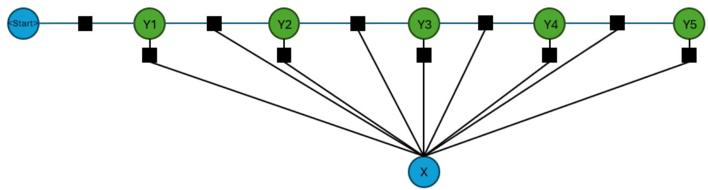
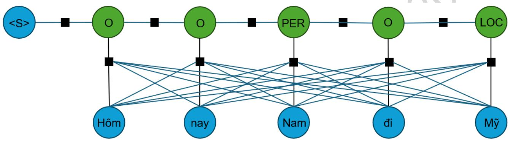
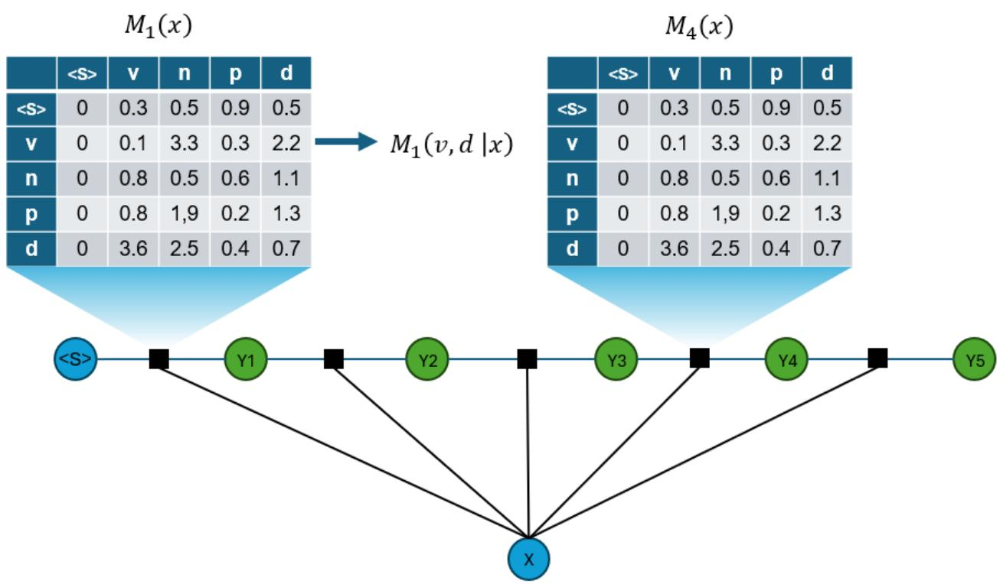

# Định nghĩa

  
Hình 1. Linear-Chain CRFs dạng factor với các ô vuông là các hàm phụ thuộc giữa các nút

Gọi X là biến ngẫu nhiên đại diện cho chuỗi dữ liệu đầu vào cần được gán nhãn, Y là biến ngẫu nhiên đại diện cho chuỗi nhãn tương ứng với chuỗi dữ liệu X. Tất cả các thành phần $Y _ { i }$ của Y thuộc một tập nhãn hữu hạn $\mathcal { Y }$ (tập các nhãn có thể có). $\varOmega _ { x }$ là các trường hợp có thể có của chuỗi X, $\varOmega _ { y }$ là các trường hợp có thể có của chuỗi nhãn Y.

Giả định cả X và Y đều được coi là biến ngẫu nhiên phân phối chung (jointly distributed), nghĩa là chúng có mối liên hệ xác suất với nhau, và xác suất $P ( X , Y )$ là dương nghiêm ngặt $( P ( X = \ x , Y = y ) > 0 , \forall x , y )$ .

CRFs [8] là một mô hình phân biệt, tập trung vào việc xây dựng mô hình xác suất có điều kiện P(Y|X). CRFs dự đoán chuỗi nhãn Y dựa trên chuỗi dữ liệu X đã cho. CRFs không cố gắng mô hình hóa xác suất của $\mathrm { X }$ (tức là P(X)), mà chỉ quan tâm đến xác suất của Y khi biết X.

Định nghĩa: Cho đồ thị $G = ( V , E )$ sao cho $Y = ( Y _ { v } ) _ { v \in V } ,$ nghĩa là ?? được chỉ mục hóa theo các đỉnh của đồ thị $G$ . Khi đó, cặp $( X , Y )$ là một trường ngẫu nhiên điều kiện (conditional random fields - CRFs) trong trường hợp, khi biết $X$ , các biến ngẫu nhiên $Y _ { v }$ thỏa mãn tính chất Markov đối với đồ thị:

$$
P ( Y _ { v } | X , Y _ { w } , w \neq v ) = \ P ( Y _ { v } | X , Y _ { w } , w { \sim } v )
$$

trong đó $w { \sim } v$ có nghĩa là ?? và $v$ là các đỉnh kề nhau trong đồ thị ??. Hay nói cách khác trạng thái của các đỉnh trong đồ thị chỉ phụ thuộc vào các điểm lân cận.

$= >$ CRFs là một trường hợp đặc biệt của MRF, trong có các nút có thể chia thành 2 tập riêng biệt X, Y. Và xác suất của chuỗi nhãn Y được xác định dựa trên toàn bộ chuỗi quan sát X. Do X là các biến quan sát lên cấu trúc đồ thị của X là tùy ý và Y và các biến y ∈ Y có th $\acute { \hat { \mathbf { e } } }$ phụ thuộc vào bất kì biến nào trong X.

Trong trường hợp CRFs có X, Y là các chuỗi $\mathrm { X } = ( \mathrm { X } 1 , . . . , \mathrm { X } { \mathrm { n } } )$ , $\mathrm { Y } = ( \mathrm { Y } 1 , . . . ,$ Yn) và đồ thị G là cây mà các đỉnh có bậc không quá 2 (chuỗi tuyến tính) thì được gọi là trường ngẫu nhiên có điều kiện tuyến tính (Linear-Chain CRFs).

  
Hình 2. Ví dụ minh họa Linear-Chain CRFs trong bài toán gán nhãn thực thể có

tên

Hình 2 là một ví dụ về Linear-Chain CRFs được sử dụng trong bài toán gán nhãn thực thể có tên (tìm xem từ nào là tên riêng – PER, từ nào là tên địa danh – LOC). Ở đây, các từ trong câu đầu vào cần được gán nhãn sẽ có vai trò là chuỗi X, các nhãn cần được gán cho từng từ trong câu đầu vào sẽ là chuỗi Y. Các nhãn này sẽ nhận một trong các giá trị: PER-Tên riêng, LOC-Địa điểm, O-Không xác định. Theo tích chất Markov thì nhãn của từ hiện tại chỉ phụ thuộc vào nhãn trước, nhãn sau và câu đầu vào.

# Xây dựng mô hình xác suất $\mathbf { P } ( \mathbf { Y } | \mathbf { X } )$

Với giả định $P ( X = x , Y = y )$ là dương nghiêm ngặt, theo định lý Hammersley–Clifford [9], ta có:

$$
E ( x , y ) = \mathrm { ~ - ~ } \sum _ { c _ { i } \in C } f _ { i } \left( c _ { i } \right)
$$

$$
P ( X = x , Y = y ) = \frac { 1 } { Z } e ^ { - E ( x , y ) }
$$

$$
Z = \sum _ { x \in \varOmega _ { x } , y \in \varOmega _ { y } } e ^ { - E ( x , y ) }
$$

Trong đó C là tập tất cả các nhóm đầy đủ của $\mathtt { d } \overset { \triangledown } { \hat { \boldsymbol { \alpha } } }$ thị G (một nhóm đầy đủ trong đồ thị vô hướng là một tập hợp các đỉnh mà giữa tất cả các cặp đỉnh trong tập hợp đó đều tồn tại một cạnh), $f _ { i }$ là hàm năng lượng của cụm $c _ { i }$ chỉ ra khả năng xảy ra các mối quan $\mathrm { h } \hat { \mathrm { e } }$ trong cụm. Z là hằng số chuẩn hóa để tạo phân phối xác suất hợp lệ $( < 1 )$ . $E ( x , y )$ là hàm năng lượng được sử dụng để đánh giá mức độ "tốt" của một cặp giá trị $( x , y )$ cụ th $\acute { \hat { \mathbf { e } } }$ của các biến ngẫu nhiên X, Y. Cặp giá trị $( x , y )$ có $E ( x , y )$ thấp hơn được coi là tốt hơn.

Dựa vào công thức trên kết hợp định lý Bayes, ta suy ra phân phối của chuỗi nhãn Y khi biết X có dạng sau:

$$
\begin{array} { c c l } { P ( Y = y | X = x ) = \displaystyle \frac { P ( Y = y , X = x ) } { \bigotimes ^ { \otimes \langle P \rangle } } = \displaystyle \frac { \frac { e ^ { - E ( X , y ) } } { Z } } { \sum _ { y ^ { \prime } \in \mathcal { Q } _ { y } } e ^ { - E ( x , y ^ { \prime } ) } } } \\ { \displaystyle } & { \displaystyle \qquad = \frac { e ^ { - E ( x , y ) } } { Z ( x ) } } \\ { \displaystyle } & { = \frac { e x p \left( \sum _ { c \in \mathcal { C } } f _ { i } ( c _ { i } ) \right) } { Z ( x ) } } \end{array}
$$

Với Linear-Chain CRFs, tập các cụm là 2 đỉnh của các cạnh và các đỉnh lẻ, khi đó, ta có:

$$
E ( x , y ) = { } - \left( \sum _ { ( i - 1 , i ) \in E } f \left( y _ { i - 1 } , y _ { i } , x , i \right) + \sum _ { y _ { i } \in y } g \left( y _ { i } , x , i \right) \right)
$$

Để đơn giản, ta thêm 2 nhãn vào đầu và cuối chuỗi nhãn: $\mathrm { Y } 0 = <$ <Start>. Trong Linear-Chain CRFs, hàm năng lượng cho các cạnh là tổng hợp các hàm đặc trưng cạnh $f _ { k }$ và hàm năng lượng cho đỉnh là tổng hợp các hàm đặc trưng của đỉnh $g _ { k }$ .

$$
E ( x , y ) = \ - \left( \sum _ { i = 1 } ^ { n } \sum _ { k } \lambda _ { k } \ f _ { k } ( y _ { i - 1 } , y _ { i } , x , i ) + \ \sum _ { i = 1 } ^ { n } \sum _ { k } \mu _ { k } \ g _ { k } ( y _ { i } , x , i ) \right)
$$

$$
\begin{array} { r l } {  { _ { \theta } ( Y = y | X = \ x ) } } \\ & { = \ \frac { e x p ( \sum _ { i = 1 } ^ { n } \sum _ { k } \lambda _ { k } f _ { k } ( y _ { i - 1 } , y _ { i } , x , i ) + \ \sum _ { i = 1 } ^ { n } \sum _ { k } \mu _ { k } \ g _ { k } ( y _ { i } , x , i ) ) } { Z _ { \theta } ( x ) } } \end{array}
$$

$$
_ { \geqslant } ( x ) = \sum _ { y ^ { \prime } \in \varOmega _ { y } } e x p \left( \sum _ { i = 1 } ^ { n } \sum _ { k } \lambda _ { k } f _ { k } ( y ^ { \prime } _ { i - 1 } , y ^ { \prime } _ { i } , x , i ) + \sum _ { i = 1 } ^ { n } \sum _ { k } \mu _ { k } g _ { k } ( y ^ { \prime } _ { i } , x , i ) \right)
$$

Các hàm đặc trưng $f _ { k } { \mathrm { v a } } \ g _ { k }$ được cho trước và cố định, thường là chỉ báo cho 1 đặc trưng ví dụ $1$ hàm đặc trưng sẽ trả $\mathbf { v } \dot { \hat { \mathbf { e } } }$ giá trị 1 khi $X _ { i }$ viết hoa chữ cái đầu và $Y _ { i }$ có nhãn là “N” ngược lại sẽ trả về 0.

Trọng số $\lambda _ { k }$ , $\mu _ { k }$ của hàm đặc trưng là một hệ số điều chỉnh mức độ ảnh hưởng của hàm đặc trưng đến năng lượng của cấu hình. Trọng số càng cao, hàm đặc trưng càng có ảnh hưởng lớn đến xác suất của chuỗi nhãn.

# Linear-Chain CRFs dạng ma trận

Giả sử, $\mathcal { Y } = \{ C _ { 1 } , \dots , C _ { l } \} , \mathcal { Y } ^ { \prime } = \mathcal { Y } \cup \{ < S t a r t > \}$ . Xác xuất có điều kiện của chuỗi Y có thể được biểu diễn dưới dạng ma trận. Tại mỗi vị trí i trong chuỗi quan sát $\mathbf { X }$ , ta định nghĩa một ma trận biến ngẫu nhiên kích thước $| \mathcal { Y } ^ { \prime } | \times | \mathcal { Y } ^ { \prime } | , M _ { i } ( x ) =$ $\bigl [ M _ { i } \bigl ( C _ { j } , C _ { k } \bigl | x \bigr ) \bigr ] , \ C _ { j } , C _ { k } \in \mathcal { Y } .$

Mỗi phần tử $M _ { i } { \left( C _ { j } , C _ { k } \middle | x \right) }$ đại diện cho một giá trị xác suất chưa chuẩn hóa. $M _ { i } ( x )$ là biến ngẫu nhiên mà giá trị phụ thuộc vào chuỗi quan sát X.

$$
\begin{array} { r l } {  { M _ { i } \big ( C _ { j } , C _ { k } \big | x \big ) } } \\ & { = \textstyle { e x p } ( \sum _ { k } \lambda _ { k } f _ { k } \big ( Y _ { i - 1 } = C _ { j } , y _ { i } = C _ { k } , x , i \big )  } \\ & { +  \sum _ { k } \mu _ { k } g _ { k } \big ( Y _ { i } = C _ { j } , x , i \big ) ) } \end{array}
$$

Với cách biểu diễn trên, $Z _ { \theta } ( x )$ có thể viết lại dưới dạng sau với $1 _ { | \mathcal { Y } \prime | \times 1 }$ là ma trận kích thước $| \mathcal { Y } ^ { \prime } |$ hàng và 1 cột có các giá trị bằng 1:

$$
{ \cal Z } _ { \theta } ( x ) = \left( M _ { 1 } ( x ) \times M _ { 2 } ( x ) \times . . . \times M _ { n + 1 } \times 1 _ { | \mathcal { Y } | \times 1 } \right) _ { 0 , 0 }
$$

Công thức xác suất có điều kiện có thể biểu diễn dưới dạng ma trận:

$$
p _ { \theta } ( Y = y | X = x ) = \ { \frac { \prod _ { i = 1 } ^ { n } M _ { i } ( y _ { i - 1 } , y _ { i } | x ) } { \left( \left( \prod _ { i = 1 } ^ { n } M _ { i } ( x ) \right) \times 1 _ { | \mathcal { Y } | \times 1 } \right) _ { 0 , 0 } } }
$$

Biểu diễn này hữu ích trong việc huấn luyện và suy luận mô hình CRFs.

  
Hình 3. Linear-Chain CRFs biều diễn dưới dạng factor với các factor được coi là ma trận chuyển đổi

Hình 3 là một ví dụ mình họa của linear-Chain CRFs biểu diễn dưới dạng factor cho bài toán POS tiếng Việt (gán nhãn động từ - v, danh từ - n, đại từ - p, trạng từ - d). Ở đây, câu đầu vào có 5 từ và mỗi 1 từ sẽ được gán nhãn từ loại tương ứng. Chuỗi từ loại chính là chuỗi Y. Giữa mỗi cặp nhãn cần gán kề nhau sẽ có một ma trận thể hiện khả năng mà giá trị nhán được gán khi biết nhãn của từ liền kề.