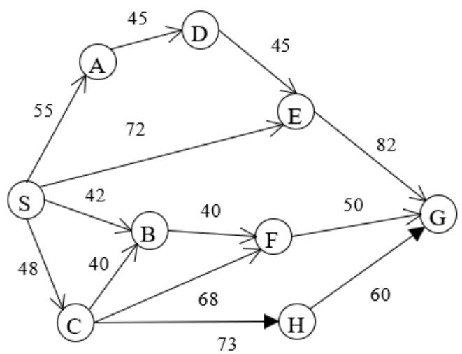
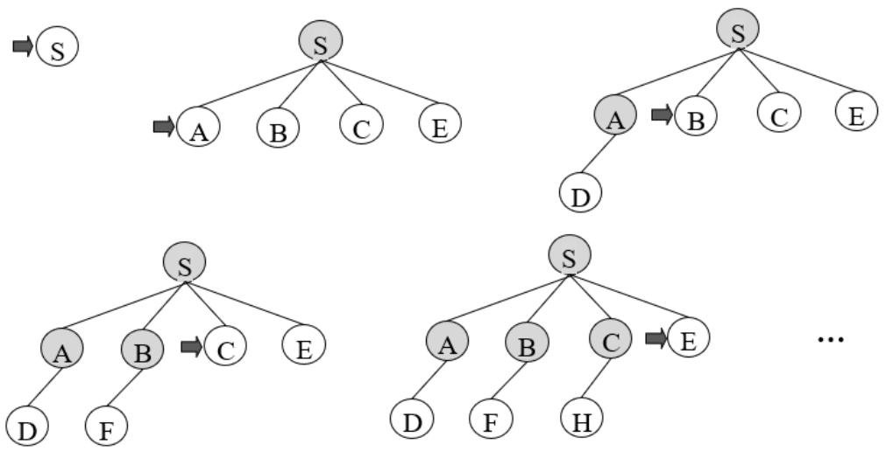

Thuật toán tìm kiếm không có thông tin được xem xét trước tiên là tìm kiếm theo chiều rộng (Breadth-first search, viết tắt là BFS), một dạng tìm kiếm vét cạn.

# Nguyên tắc:

Tìm kiếm theo chiều rộng là trong số những nút biên lựa chọn nút nông nhất (gần nút gốc nhất) để mở rộng. Như vậy, trước hết tất cả các nút có độ sâu bằng 0 (nút gốc) được mở rộng, sau đó tới các nút có độ sâu bằng 1 được mở rộng, rồi tới các nút có độ sâu bằng 2, và tiếp tục như vậy. Ở đây, độ sâu được tính bằng số nút nằm trên đường đi từ nút gốc tới nút đang xét.

Có thể nhận thấy, để thực hiện nguyên tắc tìm kiếm theo chiều rộng, ta cần lựa chọn nút được thêm vào sớm hơn trong danh sách nút biên O để mở rộng. Điều này có thể thực hiện dễ dàng bằng cách dùng một hàng đợi FIFO để lưu các nút biên.

Thuật toán tìm theo chiều rộng được thể hiện trên hình 1. Khác với thuật toán tìm kiếm tổng quát ở trên, tập nút biên O được tổ chức dưới dạng hàng đợi FIFO: các nút mới sinh ra được thêm vào cuối của O tại bước 3 của mỗi vòng lặp; nút đầu tiên của O sẽ được lấy ra để mở rộng như tại bước 1 của vòng lặp của thuật toán trên hình vẽ. Bước 2 của vòng lặp kiểm tra điều kiện đích và trả về kết quả trong trường hợp nút lấy ra từ O là nút đích. Thuật toán kết thúc trong hai trường hợp: 1) khi lấy được nút đích từ O; và 2) khi tập O rỗng. Hai trường hợp này tương ứng với hai lệnh return ở trong và ngoài vòng lặp.

Con trỏ ngược: khi mở rộng một nút ta cần sử dụng con trỏ ngược để ghi lại nút cha của nút vừa được mở ra. Con trỏ này được sử dụng để tìm ngược lại đường đi về trạng thái xuất phát khi tìm được trạng thái đích. Khi cài đặt thuật toán, mỗi nút được biểu diễn bằng một cấu trúc dữ liệu có chứa một con trỏ ngược trỏ tới nút cha.

Sau khi tìm được nút đích, có thể khôi phục đường đi tới nút đó bằng cách lần theo các con trỏ ngược, bắt đầu từ nút đích. 2025-09-2

While (O không rỗng) do

Return: Không có lời giải

Hình 1. Thuật toán tìm kiếm theo chiều rộng

# Các cải tiến:

Một số cải tiến sau đây có thể sử dụng kết hợp với thuật toán tìm theo chiều rộng vừa trình bày.

Tránh xem xét lại các nút đã mở rộng. Việc xem xét lại các nút đã mở rộng có thể dẫn tới vòng lặp. Mặc dù vòng lặp không ảnh hưởng tới khả năng tìm ra lời giải của tìm theo chiều rộng, xong việc có vòng lặp và xem xét lại các nút làm tăng độ phức tạp tính toán do phải khảo sát nhiều nút hơn. Vấn đề này có thể giải quyết bằng cách sử dụng tập đóng tương tự trong thuật toán Graph Search. Một trạng thái đã có mặt trong tập đóng hoặc tập biên sẽ không được thêm vào tập biên nữa. Người đọc có thể tự kiểm tra kết quả của thuật toán trong trường hợp có sử dụng kiểm tra tập đóng và tập biên với trường hợp không kiểm tra bằng cách thực hiện thuật toán với ví dụ trên hình 2.1

Kiểm tra đích trước khi thêm vào tập biên. Trong thuật toán tổng quát, việc kiểm tra điều kiện đích được thực hiện khi nút được lấy ra khỏi O để mở rộng. Thay vào đó, ta có thể kiểm tra trước khi thêm nút vào O. Ưu điểm của cách làm này là giảm bớt số lượng nút cần lưu trong nút biên cũng như số nút được mở rộng. Cụ thể về số lượng nút cần mở rộng khi thực hiện kiểm tra đích trước sẽ được trình bày trong phần tính chất của thuật toán ở bên dưới.

Ví dụ: Xét ví dụ tìm đường đi từ nút S tới nút G trên đồ thị ở hình 2.1 (để đơn giản, ví dụ này sử dụng đồ thị có hướng; quá trình tìm đường đi trên đồ thị vô hướng được thực hiện tương tự, trừ việc từ một nút có thể di chuyển sang nút cha của nút đó)

  
Hình 2.1: Ví dụ đồ thị cho bài toán tìm đường đi

Một số bước đầu tiên của thuật toán, có sử dụng việc lưu và kiểm tra tập nút đóng, được thể hiện dưới dạng các cây tìm kiếm như trên hình 2.2. Lưu ý: để thống nhất trong việc trình bày, trong số các nút có vai trò giống nhau, tức là có cùng độ sâu, nút đứng trước trong bảng chữ cái sẽ được mở rộng trước. Quy tắc này không được quy định trong thuật toán và chỉ để tiện cho trình bày.

Hình 2.9. Một số cây tìm kiếm sinh ra khi tìm kiếm theo chiều rộng. Các cây được thể hiện theo thứ tự từ trái sang phải, từ trên xuống dưới. Nút mở rộng tiếp theo được đánh dấu bằng mũi tên

Kết quả thực hiện các bước của thuật toán cũng có thể theo dõi qua thứ tự mở rộng các nút và nội dung danh sách tập nút biên. Dưới đây là minh họa cho thứ tự mở rộng nút và tập biên cho ví dụ trên hình 2.1 (có sử dụng tập nút đóng). Để tiện cho trình bầy, ta sẽ quy định phía bên trái là đầu của hàng đợi O và phía bên phải là cuối của hàng đợi O. Như vậy các nút được thêm vào từ phía bên phải và lấy ra từ bên trái. Con trỏ tới nút cha sẽ được viết dưới dạng chỉ số bên cạnh mỗi nút

khi b và d tăng.

Giả sử rằng, mỗi trạng thái khi được phát triển sẽ sinh ra b trạng thái $\mathrm { k } \dot { \hat { \mathbf { e } } } .$ . Như vậy từ nút gốc sẽ sinh ra b nút với độ sâu 1, các nút này lại sinh ra b2 nút với độ sâu 2, và tiếp tục như vậy. Giả sử nút đích của bài toán nằm ở độ sâu d. Trong trường hợp xấu nhất, nút đích nằm cuối cùng trong số các nút $\dot { \mathbf { O } }$ độ sâu này và do vậy ta cần mở rộng tất cả nút $\dot { \mathbf { O } }$ độ sâu d trước khi tìm ra đích, tức là sinh ra $\mathrm { b d } + 1$ nút $\dot { \mathbf { O } }$ độ sâu $\mathrm { d } + 1$ . Như vậy, tổng số nút cần mở rộng để tìm ra nút đích là (tính cả nút $\mathrm { g } \acute { \mathrm { o c } }$ ):

$$
1 + b + b 2 + . . . + b d + 1 = O ( b d + 1 )
$$

Nếu tiến hành kiểm tra điều kiện đích trước khi thêm vào tập biên như đề cập ở trên, ta sẽ không phải sinh ra các nút $\dot { \mathbf { O } }$ độ sâu $\mathrm { d } + 1$ và do vậy số nút cần sinh ra chỉ c n là O(bd).

• Yêu cầu bộ nhớ: thuật toán cần lưu O $( \mathsf { b d } + \mathsf { l } )$ nút trong tập biên sau khi đã mở rộng tất cả các nút ở độ sâu d. Nếu sử dụng tập các nút đóng thì tập này cần lưu O(bd) nút. Như vậy độ phức tạp bộ nhớ của tìm kiếm rộng là O (bd $+ 1$ ).

Như vậy, ưu điểm của tìm theo chiều rộng là tính đầy đủ và tối ưu nếu giá thành đường đi như nhau. Nhược điểm của thuật toán này là độ phức tạp tính toán lớn và yêu cầu về bộ nhớ lớn. Trong hai nhược điểm sau, độ phức tạp về bộ nhớ lớn là nghiêm trọng hơn do không thể kiếm được máy tính có bộ nhớ đủ lớn để chạy thuật toán, trong khi ta có thể đợi thêm thời gian để chờ thuật toán chạy xong nếu thời gian chạy không quá lâu. Trên thực thế, thuật toán tìm theo chiều rộng chỉ có thể sử dụng cho các bài toán có kích thước rất nhỏ (b và d không quá 10).