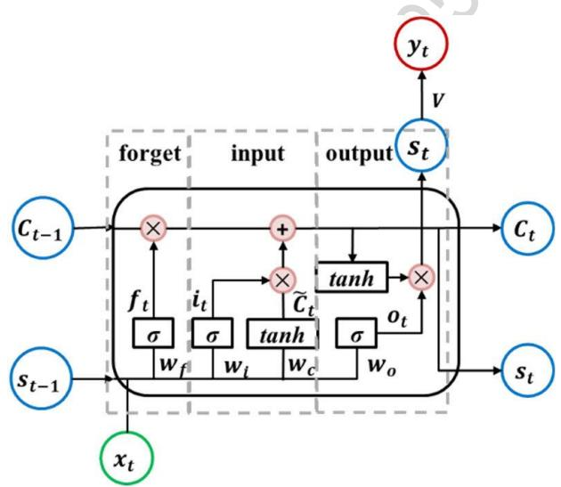
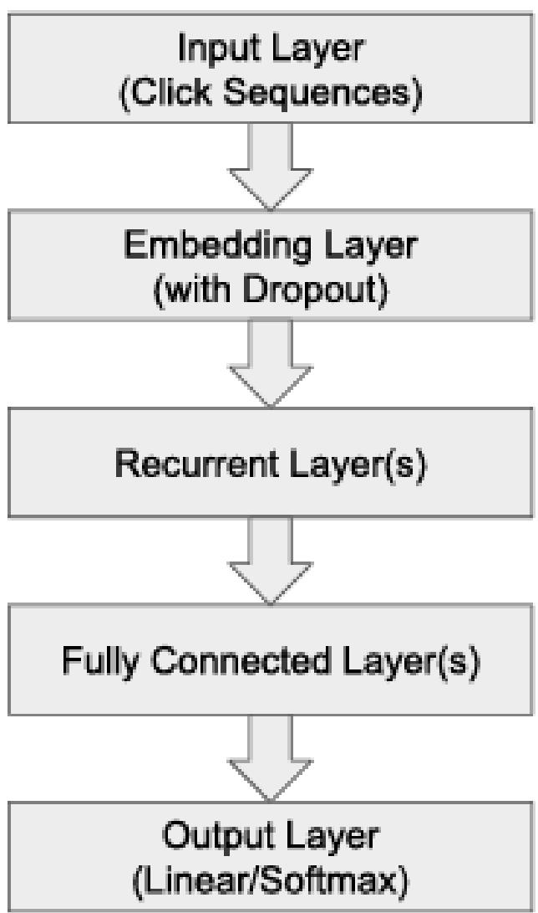

<table><tr><td rowspan=2 colspan=1>Ai</td><td rowspan=1 colspan=1>VIETTEL AI RACE</td><td rowspan=1 colspan=1>Public 109</td></tr><tr><td rowspan=1 colspan=1>RNN-BASED RECSYS MODELS</td><td rowspan=1 colspan=1>Làn ban hành: 1</td></tr></table>

# 1. Tầm quan trọng của việc khai thác thông tin tuần tự trong dữ liệu người dùng

Hệ gợi ý tuần tự là một trong những hướng nghiên cứu quan trọng trong lĩnh vực hệ gợi ý, tập trung vào việc khai thác thông tin từ chuỗi hành vi của người dùng để dự đoán hành động tiếp theo. Khác với các hệ gợi ý truyền thống chỉ dựa trên thông tin tĩnh, như lịch sử tương tác tổng quát hoặc các thuộc tính người dùng, hệ gợi ý tuần tự tận dụng các thay đổi động trong sở thích và hành vi người dùng theo thời gian.

Nhờ sự phát triển của học sâu, các phương pháp hiện đại như GRU4Rec, SASRec và BERT4Rec đã cải thiện đáng kể khả năng khai thác thông tin tuần tự:

GRU4Rec: Giúp mã hóa chuỗi sự kiện tuần tự, nhưng còn hạn chế trong việc xử lý chuỗi dài.

- SASRec: Loại bỏ hạn chế của RNN bằng cách sử dụng self-attention để nắm bắt các mối quan hệ giữa các sự kiện mà không bị giới hạn bởi khoảng cách.

BERT4Rec: Mở rộng SASRec với khả năng khai thác ngữ cảnh hai chiều, tối ưu hóa thông tin từ cả phía trước và phía sau trong chuỗi.

Việc áp dụng các phương pháp này đã mở ra khả năng gợi ý chính xác và hiệu quả hơn, đặc biệt trong các môi trường thực tế như thương mại điện tử, nơi hành vi người dùng thay đổi nhanh chóng và có tính cá nhân hóa cao.

<table><tr><td rowspan=2 colspan=1>Ai</td><td rowspan=1 colspan=1>VIETTEL AI RACE</td><td rowspan=1 colspan=1>Public 109</td></tr><tr><td rowspan=1 colspan=1>RNN-BASED RECSYS MODELS</td><td rowspan=1 colspan=1>Làn ban hành: 1</td></tr></table>

# 2. Cấu trúc GRU

Để xử lý vấn đề gradient biến mất hoặc bùng nổ khi chuỗi trở nên quá dài, các biến thể như GRU (Gated Recurrent Unit) và LSTM (Long Short-Term Memory) đã được giới thiệu. Chúng sử dụng các cổng kiểm soát (gates) để điều chỉnh dòng thông tin trong quá trình lan truyền ngược.

GRU sử dụng hai cổng chính, gồm cổng cập nhật $\left( \mathrm { z _ { t } } \right)$ và cổng xoá bỏ (rt), để kiểm soát dòng thông tin trong quá trình cập nhật trạng thái ẩn. Công thức cập nhật trạng thái trong GRU được định nghĩa như sau:

- Cổng cập nhật:

$$
z _ { t } = \sigma ( W _ { z } \cdot [ h _ { t - 1 } , x _ { t } ] + b _ { z } )
$$

Cổng này xác định tỷ lệ thông tin từ trạng thái cũ $\mathrm { h } _ { \mathrm { t } - 1 }$ cần giữ lại để sử dụng trong trạng thái hiện tại.

- Cổng xóa bỏ:

$$
r _ { t } = \sigma ( W _ { r } \cdot [ h _ { t - 1 } , x _ { t } ] + b _ { r } )
$$

Cổng xoá bỏ kiểm soát mức độ ảnh hưởng của trạng thái trước đó $\mathrm { h } _ { \mathrm { t } - 1 }$ khi tạo trạng thái mới.

- Trạng thái ứng viên:

$$
\tilde { h } _ { t } = t a n h ( W _ { h } \cdot [ r _ { t } \odot h _ { t - 1 } , x _ { t } ] + b _ { h } )
$$

Trạng thái ứng viên $\widetilde { h } _ { t }$ là biểu diễn trung gian, chịu tác động bởi cổng xoá bỏ $r _ { t }$ và thông tin đầu vào $x _ { t }$ .

Trạng thái ẩn cuối cùng:

$$
h _ { t } = z _ { t } \odot h _ { t - 1 } + ( 1 - z _ { t } ) \odot \tilde { h } _ { t }
$$

Trạng thái cuối cùng $h _ { t }$ là sự kết hợp giữa trạng thái trước đó ℎ??−1 (được điều chỉnh bởi $z _ { t }$ ) và trạng thái ứng viên $\widetilde { h } _ { t }$ .

<table><tr><td rowspan=2 colspan=1>Ai</td><td rowspan=1 colspan=1>VIETTEL AI RACE</td><td rowspan=1 colspan=1>Public 109</td></tr><tr><td rowspan=1 colspan=1>RNN-BASED RECSYS MODELS</td><td rowspan=1 colspan=1>Làn ban hành: 1</td></tr></table>

Ở đây:

$\bigcirc$ $x _ { t }$ là đầu vào tại thời điểm $t$ (ví dụ: embedding của sản phẩm).   
$\bigcirc$ $h _ { t - 1 }$ là trạng thái ẩn tại thời điểm trước đó.   
$\bigcirc$ $\sigma$ là hàm sigmoid, còn tanh làm hàm kích hoạt phi tuyến.   
$\bigcirc$ $W _ { z } , W _ { r } , W _ { h }$ là các trọng số cần học.   
$\bigcirc$ $b _ { z } , b _ { r } , b _ { h }$ là bias.

- Dự đoán đầu ra: Dựa trên trạng thái ẩn $h _ { t }$ , GRU dự đoán phần tử tiếp theo trong chuỗi thông qua một lớp softmax:

$$
y _ { t } = s o f t m a x ( W _ { y } \cdot h _ { t } + b _ { y } )
$$

Hàm mất mát thường được sử dụng là cross-entropy giữa phân phối dự đoán yt và nhãn thực $\mathrm { y _ { t } ^ { * } }$ .

<table><tr><td rowspan=2 colspan=1>Ai</td><td rowspan=1 colspan=1>VIETTEL AI RACE</td><td rowspan=1 colspan=1>Public 109</td></tr><tr><td rowspan=1 colspan=1>RNN-BASED RECSYS MODELS</td><td rowspan=1 colspan=1>Làn ban hành: 1</td></tr></table>

# 3. GRU4Rec

Cấu trúc mạng sử dụng trong GRU4Rec được tổ chức theo các tầng sau:

Tầng đầu vào (Input Layer): Nhận chuỗi nhấp chuột của người dùng.

- Tầng nhúng (Embedding Layer): Biểu diễn sản phẩm dưới dạng vector nhúng và có thể áp dụng dropout để giảm overfitting.

Tầng hồi tiếp (Recurrent Layer - GRU): Mô hình hóa thông tin tuần tự dựa trên GRU.

- Tầng fully connected: Hợp nhất thông tin từ trạng thái ẩn của GRU.

- Tầng đầu ra (Output Layer): Có thể sử dụng hàm softmax hoặc linear để dự đoán sản phẩm tiếp theo.

Kiến trúc tổng quát của mạng sử dụng trong GRU4Rec, bao gồm các tầng xử lý từ đầu vào đến đầu ra