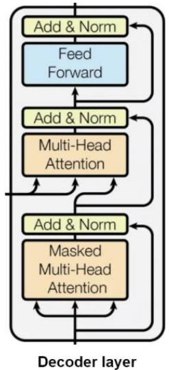
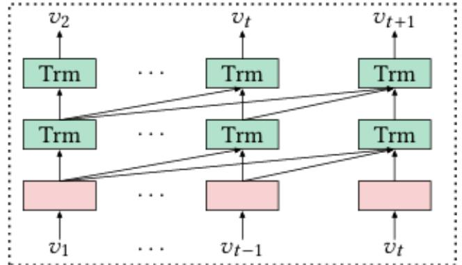
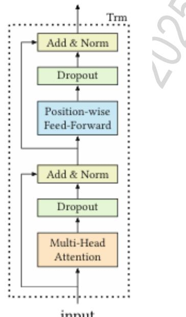
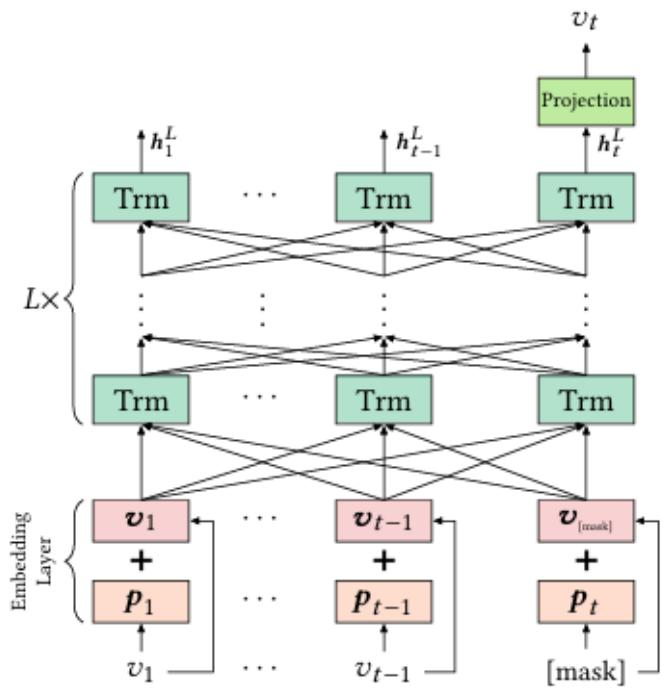

# SASRec

SASRec (Self-Attentive Sequential Recommendation) là một mô hình gợi ý tuần tự dựa trên self-attention, được thiết kế để thay thế các phương pháp truyền thống như Markov Chains (MCs) và Recurrent Neural Networks (RNNs) trong việc dự đoán hành vi người dùng. Không giống như các mô hình RNN có tính tuần tự cao và khó xử lý song song, SASRec sử dụng self-attention để chọn lọc các tương tác quan trọng trong lịch sử người dùng, đồng thời tận dụng sức mạnh tính toán song song của GPU.

Kiến trúc của SASRec

Kiến trúc của SASRec dựa trên mô hình Transformer Decoder, cụ thể là multihead self-attention để học các mối quan hệ giữa các mục trong chuỗi tương tác của người dùng. Mô hình bao $\mathrm { g } \dot { \hat { \mathrm { o } } } \mathrm { m }$ các thành phần chính sau:

1.1. Embedding Layer: o Mỗi mục sản phẩm $v _ { t }$ được ánh xạ thành một vector nhúng $e _ { t }$ . o Một positional embedding được thêm vào để mô hình hóa thứ tự của các mục trong chuỗi.   
1.2. Self-Attention Layer: o Sử dụng scaled dot-product attention để xác định trọng số giữa các mục trong chuỗi: $A t t e n t i o n ( Q , K , V ) \stackrel { \displaystyle C } { = } s o f t m a x \left( \frac { Q K ^ { T } } { \sqrt { d } } \right) V$

Trong đó:

Q, K, V là ma trận truy vấn (query), khóa (key) và giá trị (value) được ánh xạ từ các mục trước đó. ▪ d là kích thước của vector nhúng để chuẩn hóa giá trị attention.

o Mô hình sử dụng masked attention để ngăn chặn việc nhìn thấy tương lai, đảm bảo tính tuần tự trong dự đoán.

1.3. Position-wise Feed-Forward Network (FFN): o Mỗi mục sau khi được xử lý bởi self-attention sẽ đi qua một mạng FeedForward để học biểu diễn tốt hơn.   
1.4. Output layer: o Sử dụng softmax để tính xác suất mục tiếp theo mà người dùng có thể tương tác.

Mô hình SASRec có thể được biểu diễn dưới dạng công thức như sau:

$$
H = M u l t i H e a d S e l f A t t e n t i o n ( E + P )
$$

$$
\widehat { H } = F e e d F o r w a r d ( H )
$$

$$
y _ { t } = s o f t m a x ( W _ { y } \cdot \widehat { H } + b _ { y } )
$$

trong đó:

$\bigcirc$ E là ma trận nhúng của các mục.   
o P là Positional Embedding.   
o H là đầu ra từ self-attention.   
o $\widehat { H }$ là đầu ra từ feed-forward network.

Hình dưới đây minh họa cách SASRec sử dụng self-attention để xử lý chuỗi dữ liệu tuần tự. Các khối màu xanh biểu diễn các lớp Transformer (Trm) thực hiện selfattention, trong khi các khối màu hồng đại diện cho embedding input ban đầu của các mục:

Kiến trúc SASRec, thể hiện cách self-attention kết nối các mục trong chuỗi tuần tự để học biểu diễn gợi ý.

# BERT4Rec

BERT4Rec là một mô hình gợi ý tuần tự dựa trên kiến trúc Transformer, được thiết kế để học biểu diễn ngữ cảnh hai chiều (bidirectional context) nhằm cải thiện độ chính xác trong dự đoán sản phẩm tiếp theo mà người dùng có thể quan tâm. Khác với các mô hình gợi ý tuần tự truyền thống như RNN-based methods và SASRec, BERT4Rec không giới hạn trong việc học thông tin từ quá khứ mà có thể tận dụng toàn bộ chuỗi lịch sử để tạo ra biểu diễn mạnh mẽ hơn.

Các phương pháp trước đó, như SASRec, sử dụng self-attention nhưng vẫn là một mô hình unidirectional, tức là chỉ dựa vào thông tin từ các mục trước đó để dự đoán mục tiếp theo. Trong khi đó, BERT4Rec áp dụng kiến trúc bidirectional Transformer, giúp mô hình hóa hành vi người dùng bằng cách tận dụng cả ngữ cảnh phía trước và phía sau của một mục được quan tâm.

## Kiến trúc của BERT4Rec

BERT4Rec được xây dựng dựa trên stacked bidirectional Transformer layers. Tại mỗi lớp, mô hình liên tục cập nhật biểu diễn của từng vị trí bằng cách trao đổi thông tin giữa tất cả các vị trí trong chuỗi thông qua self-attention mechanism. So với các mô hình RNN truyền thống, phương pháp này giúp BERT4Rec loại bỏ giới hạn của gradient vanishing/exploding trong RNN, cùng với đó tận dụng được toàn bộ lịch sử người dùng, không chỉ dựa vào quá khứ. Phương phá này cũng có thể xử lý song song trên GPU, giúp huấn luyện nhanh hơn.

Mỗi tầng Transformer trong BERT4Rec bao gồm:

1. Multi-Head Self-Attention (MHSA): Cho phép mô hình tập trung vào nhiều khía cạnh khác nhau của dữ liệu tuần tự.   
2. Position-wise Feed-Forward Network (PFFN): Áp dụng các biến đổi phi tuyến lên từng phần tử trong chuỗi.   
3. Layer Normalization & Residual Connections: Giúp cải thiện quá trình tối ưu hóa.

Biểu diễn đầu vào của BERT4Rec bao $\mathrm { g } \dot { \hat { \mathrm { o } } } \mathrm { m }$ :

Item Embedding: Biểu diễn nhúng của sản phẩm. - Positional Embedding: Mô hình hóa vị trí của sản phẩm trong chuỗi.

  
input

Segment Embedding (loại bỏ trong BERT4Rec): Khác với BERT trong NLP, BERT4Rec không sử dụng nhúng phân đoạn do chỉ làm việc với một chuỗi tương tác duy nhấtBERT4Rec.

## Mục tiêu Cloze trong BERT4Rec

Một điểm khác biệt quan trọng của BERT4Rec so với các mô hình trước đó là sử dụng Cloze objective, thay vì dự đoán trực tiếp mục tiếp theo như RNN hoặc SASRec. Cụ thể, BERT4Rec ẩn ngẫu nhiên một số mục trong chuỗi đầu vào và huấn luyện mô hình để dự đoán lại chúng. Công thức tối ưu hóa được biểu diễn như sau:

Trong đó:

$\bigcirc$ M là tập hợp các vị trí bị ẩn $\bigcirc$ S là chuỗi tương tác của người dùng $\bigcirc$ θ là tham $\mathrm { s } \acute { \mathrm { o } } \mathrm { m } \hat { \mathrm { o } }$ hình $\bigcirc$ $v _ { t }$ là sản phẩm cần dự đoán.