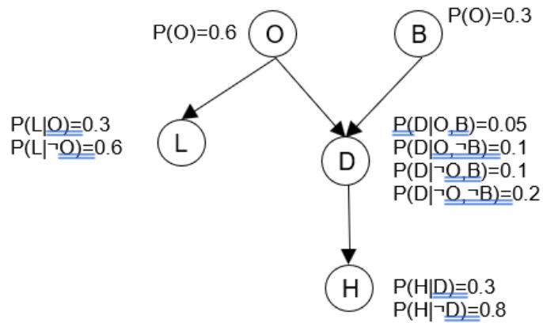
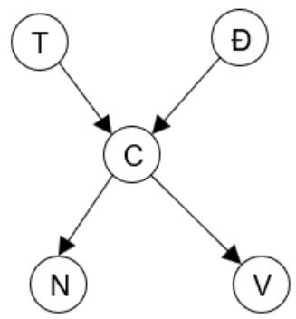
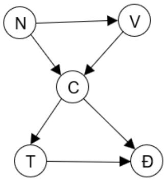
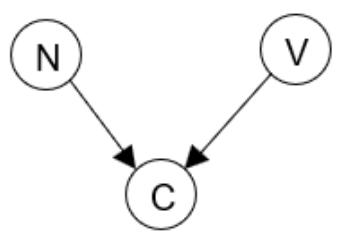
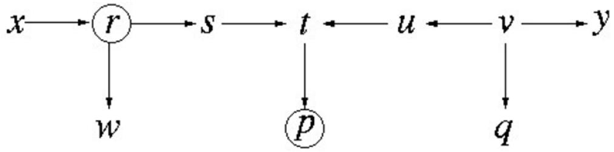

Trong các phần trước ta đã làm quen với vấn đề suy diễn xác suất, trong đó cho trước một số bằng chứng $E _ { 1 } , . . . , E _ { n }$ , cần tính xác suất điều kiện $P \left( Q \mid E 1 , . . . , E _ { n } \right)$ để kết luận về câu truy vấn $\boldsymbol { \mathcal { Q } }$ .

Xác suất điều kiện trên có thể tính được nếu biết toàn bộ xác suất đồng thời của các biến ngẫu nhiên. Tuy nhiên, trên thực tế, các bài toán thường có số lượng biến ngẫu nhiên lớn, dẫn tới số lượng xác suất đồng thời tăng theo hàm mũ. Do vậy, liệt kê và sử dụng bảng xác suất đồng thời đầy đủ để suy diễn là không thực tế.

Để khắc phục khó khăn trên, trong phần này ta sẽ xem xét cách sử dụng mạng Bayes như một mô hình biểu diễn xác suất rút gọn và cách thực hiện suy diễn xác suất trên mạng Bayes.

# 1.Khái niệm mạng Bayes

Để tiện cho việc trình bày khái niệm mạng Bayes, xét một ví dụ sau3.

Một người đi làm về và muốn dự đoán xem ở nhà có người không thông qua một số dấu hiệu có thể quan sát được. Cho biết một số dữ kiện sau:

Nếu cả nhà đi vắng thì thường bật đèn ngoài sân. Tuy nhiên, đèn ngoài sân có thể được cả trong một số trường hợp có người ở nhà, ví dụ khi có khách đến chơi. - Nếu cả nhà đi vắng thì thường buộc chó ở sân sau.

Tuy nhiên chó có thể được buộc ở sân sau cả khi có người ở nhà nếu như chó bị đau bụng.

Nếu chó buộc ở ngoài thì có thể nghe tiếng sủa, tuy nhiên có thể nghe tiếng sủa (của chó hàng xóm) cả khi chó không buộc ở ngoài.

Để thực hiện suy diễn xác suất cho bài toán trên, trước tiên cần xây dựng mô hình xác suất. Ta sẽ sử dụng năm biến ngẫu nhiên sau để thể hiện các dữ kiện liên quan tới bài toán.

O: không ai ở nhà   
L: đèn sáng   
D: chó ở ngo   
B: chó bị ốm.   
H: nghe thấy tiếng sủa.   
Việc phân tích bài toán cho thấy: Nếu biết D thì H không phụ thuộc vào O, L, B. Nếu biết B thì D độc lập với O. O và B độc lập với nhau

Tiếp theo, ta xây dựng một đồ thị, trong đó mỗi biến ngẫu nhiên ở trên được biểu diễn bởi một nút như trên hình vẽ dưới đây (hình 4.1). Các nút được nối với nhau bằng những cung có hướng sao cho hai hai nút có quan hệ phụ thuộc được nối bởi một cung và hướng của cung thể hiện chiều tác động của nút gốc tới nút đích. Với đồ thị có hướng, ta có thể xác định quan hệ giữa các nút như sau: nếu tồn tại cung có hướng từ nút A tới nút B thì nút A được gọi là nút cha (mẹ) và nút B là nút con.

  
Hình 4.1: Một ví dụ mạng Bayes

Sau khi có đồ thị, ta thêm vào bảng xác suất điều kiện. Bảng xác suất điều kiện thể hiện xác suất của biến khi biết giá trị cụ thể của các biến ở các nút cha mẹ. Trong trường hợp nút không có cha mẹ, xác suất trở thành xác suất tiền nghiệm. Để thuận tiện, bảng xác suất điều kiện được thể hiện ngay trên hình vẽ cùng với đồ thị.

Đồ thị vừa xây dựng cùng với các bảng xác suất điều kiện tạo thành mạng Bayes cho bài toán trong ví dụ trên.

Định nghĩa: Mạng Bayes là một mô hình xác suất bao gồm 2 phần

Phần thứ nhất là một đồ thị có hướng không chứa chu trình, trong đó mỗi nút tương ứng với một biến ngẫu nhiên, các cung thể hiện mối quan hệ phụ thuộc giữa các biến.

Phần thứ hai là các bảng xác suất điều kiện: mỗi nút có một bảng xác suất điều kiện cho biết xác suất các giá trị của biến khi biết giá trị các nút cha mẹ.

Cấu trúc của đồ thị trong mạng Bayes thể hiện mối quan hệ phụ thuộc hoặc độc lập giữa các biến ngẫu nhiên của bài toán. Hai nút được nối với nhau bởi một cung khi giữa hai nút có quan hệ trực tiếp với nhau, trong đó giá trị nút gốc ảnh hưởng tới giá trị nút đích.

Lưu ý rằng trong cấu trúc của mạng Bayes không cho phép có chu trình. Hạn chế này ảnh hưởng tới khả năng mô hình hóa của mạng Bayes trong một số trường hợp tuy nhiên cho phép đơn giản hóa việc xây dựng và suy diễn trên mạng Bayes.

Bảng xác suất điều kiện xác định cụ thể ảnh hưởng của các nút cha mẹ tới giá trị nút con. $\mathring { \mathrm { O } }$ đây ta chỉ xét trường hợp biến ngẫu nhiên có thể nhận giá trị rời rạc và bảng xác suất điều kiện được cho theo tổ hợp giá trị của các nút cha mẹ. Mỗi d ng trong bảng tương ứng với một điều kiện cụ thể, thực chất là một tổ hợp giá trị các nút cha. Ví dụ, trong mạng Bayes của ví dụ trên, d ng thứ nhất trong bảng xác suất của nút D ứng với điều kiện trong đó $\mathrm { O } =$ True và $\boldsymbol { \mathrm { B } } =$ True. Nếu nút không có cha mẹ thì bảng xác suất chỉ gồm một d ng duy nhất như trường hợp với nút O và nút B.

# Tính độc lập xác suất trong mạng Bayes

Mạng Bayes thể hiện hai thông tin chính.

Thứ nhất, đây là biểu diễn rút gọn của toàn bộ xác suất đồng thời. Trong ví dụ trên ta chỉ cần 10 xác suất thay vì $2 ^ { 5 } – 1$ xác suất đồng thời. Tùy theo kích thước và đặc điểm cụ thể của bài toán, hiệu quả của việc rút gọn số lượng xác suất có thể lớn hơn rất nhiều. Chẳng hạn, với mạng $\mathrm { g } \dot { 0 } \mathrm { m } 3 0$ nút nhị phân, mỗi nút có 5 nút cha, ta cần tất cả 960 xác suất điều kiện cho mạng Bayes, trong khi bảng xác suất đồng thời cho 30 biến như vậy phải có $2 ^ { 3 0 } – 1$ , tức là hơn một tỷ dòng.

Thứ hai, mạng Bayes cho thấy sự phụ thuộc hoặc độc lập xác suất có điều kiện giữa các biến. Về thực chất, chính việc độc lập về xác suất dẫn tới khả năng biểu diễn rút gọn các xác suất đồng thời.

Tính độc lập xác suất trong mạng Bayes thể hiện qua tính chất sau.

# Tính chất:

Mỗi nút trên mạng Bayes độc lập có điều kiện với tất cả các nút không phải là hậu duệ của nút đó nếu biết giá trị các nút cha.

Mỗi nút độc lập có điều kiện với tất cả các nút khác trên mạng nếu biết giá trị tất cả nút cha, nút con và nút cha của các nút con.

Ví dụ: Theo mạng Bayes trong ví dụ trên H độc lập với O, L, B nếu biết giá trị của D.

Tính các xác suất đồng thời

Sử dụng tính độc lập xác suất vừa phát biểu ở trên, có thể tính xác suất đồng thời của tất cả các biến. Xét ví dụ sau

Ví dụ: cần tính $P ( H , D , L , \neg O , B )$

Theo công thức chuỗi:

$$
^ { \circ } ( H , D , L , \^ { \neg } O , B ) = P ( H | D , L , \ \neg O , B ) ^ { \ast } P ( D | L , \neg O , B ) ^ { \ast } P ( L | \neg O , B ) ^ { \ast } P ( \neg O | B )
$$

$^ * P ( B )$ Do tính độc lập xác suất (có điều kiện):

$$
P \left( H \mid B , D , \neg O , L \right) = P ( H | D )
$$

do vậy,

$$
\begin{array} { r l } & { \quad P ( H , D , L , \neg O , B ) = P ( H | D , L , \neg O , B ) \ast P ( D | L , \neg O , B ) \ast P ( L | \neg O , B ) \ast P ( \neg O | B , \neg O , B ) } \\ & { \ast P ( B ) = P ( H | \neg O ) \ast P ( D | \neg O , B ) \ast P ( L | \neg O ) \ast P ( \neg O ) \ast P ( B ) } \end{array}
$$

Một cách tổng quát, giả sử mạng có n nút tương ứng với n biến ngẫu nhiên $X _ { 1 }$ , …, $X _ { n }$ của bài toán đang xét. Từ thông tin của mạng, có thể tính mọi xác suất đồng thời của n biến, trong đó mỗi xác suất đồng thời có dạng $P \left( X _ { 1 } = x _ { 1 } \ \wedge \ X _ { 2 } = x _ { 2 } \ \wedge \cdots \wedge \ X _ { n } = x _ { n } \right)$ (id:) hay viết gọn là $P ( x _ { 1 } , . . . , x _ { n } )$ . Xác suất đồng thời được tính theo công thức tổng quát sau:

$$
P ( X _ { 1 } = x _ { 1 } , . . . , X _ { n } = x _ { n } ) = \prod _ { i = 1 } ^ { n } P ( X _ { i } = x _ { i } | c h a _ { - } m e ( X _ { i } ) )
$$

hay viết gọn là

$$
P ( x _ { 1 } , . . . , x _ { n } ) = \prod _ { i = 1 } ^ { n } P ( x _ { i } | c h a _ { - } m e ( X _ { i } ) )
$$

trong đó cha_me $( X _ { i } )$ là giá trị cụ th $\acute { \hat { \mathbf { e } } }$ các nút cha mẹ của nút $X _ { i }$ .

$\mathrm { \Delta \vec { \mathrm { p \acute { e } } } }$ minh họa cho công thức trên, ta sẽ tính xác suất xẩy ra tình huống $\dot { \mathbf { O } }$ nhà có người, chó bị $\mathrm { { \acute { o } m } }$ và được buộc ngoài sân, đồng thời đèn không sáng và nghe tiếng chó sủa. Xác suất tình huống này chính là $P ( B , \neg O , D , \neg L , H )$ và được tính như sau:

$$
P ( B , \neg O , D , \neg L , H ) = P ( B ) \ ^ { * } P ( \neg O ) \ ^ { * } P ( D | \neg O , B ) \ ^ { * } P ( H | D ) \ ^ { * } P ( \neg L | \neg O )
$$

$$
\begin{array} { l } { { = 0 , 3 * 0 , 4 * 0 , 0 5 * 0 , 7 * 0 , 3 } } \\ { { \ } } \\ { { = 0 , 0 0 1 2 6 \ \qquad , \ \circ \mathrm { { 8 } } ^ { \circ } } } \end{array}
$$

Trong một phần trên ta đã thấy rằng nếu có mọi xác suất đồng thời thì có thể thực hiện suy diễn xác suất cho mọi dạng câu truy vấn. Như vậy, với mạng Bayes ta có thể suy diễn bằng cách trước tiên tính ra mọi xác suất đồng thời cần thiết. Tuy nhiên, cách này đòi hỏi tính toán nhiều và vì vậy trên thực tế thường sử dụng một số phương pháp suy diễn khác hiệu quả hơn. Vấn đề này sẽ được nhắc tới trong một phần sau.

# Cách xây dựng mạng Bayes

Để có thể sử dụng, trước tiên cần xây dựng ra mạng Bayes. Quá trình xây dựng mạng Bayes bao gồm việc xác định tất cả các biến ngẫu nhiên liên quan, xác định cấu trúc đồ thị của mạng, và cuối cùng là xác định giá trị cho các bảng xác suất điều kiện. Trong phần này, ta sẽ coi như đã có biến ngẫu nhiên, việc xây dựng mạng chỉ bao gồm xác định cấu trúc và bảng xác suất điều kiện.

Có hai cách tiếp cận chính để xây dựng mạng Bayes.

• Cách thứ nhất do con người (chuyên gia) thực hiện dựa trên hiểu biết của mình về bài toán đang xét. Việc xây dựng mạng được chia thành hai bước: xác định cấu trúc đồ thị và điền giá trị cho bảng xác suất điều kiện.

• Cách thứ hai là tự động xác định cấu trúc và xác suất điều kiện từ dữ liệu. Ở đây, dữ liệu có dạng giá trị các biến ghi nhận được trong quá khứ, ví dụ ta có thể ghi lại tổ hợp cá giá trị của năm biến trong ví dụ trên trong thời gian vài năm. Quá trình xây dựng mạng khi đó bao gồm xác định cấu trúc của đồ thị và bảng xác suất điều kiện sao cho phân bố xác suất do mạng thể hiện phù hợp nhất với tần suất xuất hiện các giá trị trong tập dữ liệu.

Phần này chỉ xem xét cách xây dựng mạng do con người thực hiện và mô tả một quy trình cụ thể cho việc xây dựng mạng.

Các bước xây dựng mạng được thực hiện như trên hình 4.2. Sau khi đã có cấu trúc mạng, chuyên gia sẽ xác định giá trị cho các bảng xác suất điều kiện. Thông thường, việc xác định giá trị xác suất điều kiện khó hơn nhiều so với việc xác định cấu trúc mạng, tức là xác định quan hệ giữa các nút.

B1: Xác định các biến ngẫu nhiên cho phép mô tả miền của bài toán. B2: Sắp xếp các biến theo một thứ tự nào đó. Ví dụ theo thứ tự sau: X1, X2 …   
Xn. B3: For $i = I$ to n do a. Thêm một nút mới $X _ { i }$ vào mạng b. Xác định tập Cha_Mẹ(Xi) là tập nhỏ nhất các nút đã có trước đó sao cho Xi độc lập có điều kiện với tất cả nút còn lại khi biết bố mẹ của Xi. c. Với mỗi nút thuộc tập Cha_Mẹ(Xi). Ta thêm một cạnh có hướng từ nút đó tới   
Xi. d. Xác định bảng xác suất điều kiện cho Xi the các giá trị của bố mẹ hoặc bằng xác suất tiền nghiệm nếu Xi không có bố mẹ.

Để minh họa, xét ví dụ sau. Một người vừa lắp hệ thống báo động chống trộm ở nhà. Hệ thống sẽ phát tiếng động khi có trộm. Tuy nhiên, hệ thống có thể báo động (sai) nếu có chấn động do động đất. Trong trường hợp nghe thấy hệ thống báo động, hai người hàng xóm tên làm Nam và Việt sẽ gọi điện cho chủ nhà. Do nhiều nguyên nhân khác nhau, Nam và Việt có thể thông báo sai, chẳng hạn do ồn nên không nghe thấy chuông báo động hoặc ngược lại, nhầm âm thanh khác là tiếng chuông.

Theo phương pháp trên, các bước xây dựng mạng được thực hiện như sau.

B1: lựa chọn biến: sử dụng 5 biến sau T (có trộm), Đ (động đất), B (chuông báo động), N (Nam gọi điện), V (Việt gọi điện)   
B2: các biến được sắp xếp theo thứ tự T, Đ, B, N, V B3: thực hiện như các bước ở hình vẽ, ta xây dựng được mạng thể hiện trên hình sau (để đơn giản, trên hình vẽ chỉ thể hiện cấu trúc và không có bảng xác suất điều kiện).

  
Hình 3.2.: Kết quả xây dựng mạng Bayes cho ví dụ chuông báo trộm

# Ảnh hướng của việc sắp xếp các nút tới kết quả xây dựng mạng.

Trên thực tế, việc xây dựng mạng Bayes không đơn giản, đặc biệt trong việc chọn thứ tự các nút đúng để từ đây chọn được tập nút cha có kích thước nhỏ. Để làm rõ điểm này, ta giả sử trong ví dụ trên, các biến được xếp theo thứ tự khác: N, V, C, T, Đ.

Các bước thêm nút sẽ thực hiện như sau:

- Thêm nút N: không có nút cha - Thêm nút V: nếu Nam gọi điện, xác suất Việt gọi điện sẽ tăng lên do sự kiện Nam gọi điện nhiều khả năng do có báo động và do vậy xác suất Việt nghe thấy chuông và gọi điện tăng theo. Do vậy N có ảnh hướng tới V và được thêm vào tập cha của V.

- Thêm C: Nếu Nam và Việt cùng gọi thì khả năng có chuông cao hơn, do vậy cần thêm cả N và V vào tập cha của C.

- Thêm T: Nếu đã biết trạng thái của chuông thì không cần quan tâm tới Nam và Việt nữa, do vậy chỉ có C là cha của T.

- Thêm Đ: nếu có chuông, khả năng động đất tăng lên. Tuy nhiên, nếu đồng thời ta biết có trộm thì việc có trộm giải thích phần nào nguyên nhân chuông kêu. Như vậy, cả chuông và có trộm ảnh hướng tới xác suất động đất, tức là C và T đều là cha của Đ.

Kết quả của mạng Bayes xây dựng theo thứ tự mới được thể hiện trên hình dưới. So sánh với kết quả ở trên, mạng Bayes mới phức tạp hơn, theo nghĩa có nhiều cung hơn hay trung bình các nút có nhiều nút cha hơn. Ngoài ra, ý nghĩa một số quan hệ trên mạng rất không trực quan và khó giải thích, chẳng hạn việc xác suất động đất phục thuộc vào chuông báo động và có trộm. Như vậy, mặc dù cả hai mạng Bayes xây dựng ở trên đều đúng theo nghĩa đảm bảo các ràng buộc về xác suất và đều cho phép tính ra các xác suất đồng thời, việc lựa chọn không đúng thứ tự nút sẽ làm mạng khó hiểu và phức tạp hơn.

  
Hình 3.3: Kết quả xây dựng mạng Bayes khi sử dụng thứ tự các nút khác

Từ ví dụ trên ta có thể đưa ra một số nhận xét về kết quả xây dựng mạng Bayes.

# Nhận xét:

Cùng một tập hợp biến có thể xây dựng nhiều mạng Bayes khác nhau. - Thứ tự sắp xếp có ảnh hưởng tới mạng Bayes. Nêđóng vai tr nguyên nhân đứng trước nút hệ quả.- Tất cả các mạng được xây dựng như trên đều hợ phạm các ràng buộc về xác suất và đều cho phép thực hiện suy diễn.

4. Tính độc lập xác suất tổng quát: khái niệm d-phân cách

Trong phần trước, ta đã xem xét khả năng biểu diễn tính độc lập xác suất của mạng Bayes, ví dụ, $\mathrm { m } \tilde { \hat { \mathrm { { o } i } } } x$ nút độc lập với các nút không phải hậu duệ nếu biết giá trị tất cả nút cha của $x$ . Tuy nhiên, đây mới là các trường hợp riêng, trong trường hợp tổng quát cần có khả năng xác định liệu một tập hợp các nút X có độc lập với tập hợp các nút Y khi biết các nút $E$ không. Các tính chất độc lập xác suất đã trình bầy trong phần trước không cho phép trả lời tất cả các câu hỏi tổng quát dạng này. Chẳng hạn, trong ví dụ mạng Bayes trên hình 4.1 dưới đây, nếu không biết giá trị của nút C thì theo tính chất của mạng Bayes, N và V độc lập (không điều kiện) với nhau do V không phải hậu duệ của N và N không có cha. Tuy nhiên, nếu đã biết giá trị của C thì N và V còn độc lập với nhau không? Hai tính chất trình bày trong phần trước không cho phép trả lời câu hỏi này.

  
Hình 4.1. Ví dụ mạng Bayes

Trong phần này, ta sẽ xem xét cách trả lời câu hỏi về tính độc lập của tập các nút X với tập nút Y khi biết tập nút E trên một mạng Bayes bằng cách sử dụng khái niệm d-phân cách $d \cdot$ -separation).

Nguyên lý chung của $d \mathbf { \cdot }$ -phân cách là gắn khái niệm phụ thuộc xác suất với tính kết nối (tức là có đường đi giữa các nút), và khái niệm độc lập xác suất với tính không kết nối, hay chia cắt, trên đồ thị có hướng khi ta biết giá trị một số nút $E$ . Chữ $^ { 6 6 } d ^ { 3 9 } \mathrm { ~ \overset { ? } { \mathbf { \alpha } } ~ }$ đây là viết tắt của từ “directional” tức là “có hướng”. Theo đó, các nút $X$ và các nút Y là $d$ -kết nối với nhau nếu chúng không bị $d$ -phân cách. Nếu các nút X và các nút Y bị dphân cách bởi các nút $E$ thì $X$ và Y là độc lập xác suất với nhau khi biết $E$ .

Để xác định tính $d \mathbf { \cdot }$ -phân cách của tập X và Y, trước tiên ta cần xác định tính $d \mathbf { \cdot }$ - phân cách giữa hai nút đơn $x$ thuộc $X$ và $y$ thuộc Y. Từ đây, hai tập nút sẽ độc lập với nhau nếu mỗi nút trong tập này độc lập với tất cả các nút trong tập kia. Sau đây là các quy tắc cho phép xác định tính $d \mathbf { \cdot }$ -phân cách hay tính độc lập xác suất của hai biến $x$ và y.

Quy tắc 1: nút $x$ và $y$ được gọi là $d \mathbf { \cdot }$ -kết nối nếu tồn tại đường đi không bị phong tỏa giữa hai nút. Ngược lại, nếu không tồn tại đường đi như vậy thì $x$ và $y$ là $d$ -phân cách.

Trong quy tắc này, đường đi là một chuỗi các cung nằm liền nhau, không tính tới hướng của các cung đó. Đường đi không bị phong tỏa là đường đi mà trên đó không có hai cung liền $\mathrm { k } \dot { \hat { \mathbf { e } } }$ hướng vào nhau. Trong trường hợp tồn tại hai cung như vậy thì thông tin sẽ không thể đi qua được và do vậy các nút không thể kết nối với nhau. Nút có hai cung hướng vào như vậy gọi là nút xung đột.

Ví dụ, trong trường hợp sau:

$$
x { \longrightarrow } r { \longrightarrow } s { \longrightarrow } t { \longmapsto } u { \longrightarrow } v { \longrightarrow } y
$$

giữa $x$ và $y$ tồn tại đường đi $x \mathrm { ~ - ~ } r \mathrm { ~ - ~ } s \mathrm { ~ - ~ } t \mathrm { ~ - ~ } u \mathrm { ~ - ~ } \nu \mathrm { ~ - ~ } y ;$ , tuy nhiên $t$ là nút xung đột do hai cung $^ { s t }$ và ut hướng vào nhau. Đường đi $x - r - s - t$ và $t - u - \nu - y$ là các đường đi không bị phong tỏa, do vậy $x$ và $t$ là d-kết nối, $t$ và $y$ cũng vậy. Tuy vậy, $x$ và $y$ không phải là $d$ -kết nối do không tồn tại đường đi nào không qua nút xung đột $t .$ Như vậy, x và $y$ là $d \mathbf { \cdot }$ -phân cách trên mạng này và do vậy độc lập xác suất (không điều kiện) với nhau.

Tính kết nối và phân cách xác định theo quy tắc 1 là không điều kiện và do vậy tính độc lập xác suất được xác định theo quy tắc 1 là độc lập không điều kiện.

Quy tắc 2: nút $x$ và y là $d \mathbf { \cdot }$ -kết nối có điều kiện khi biết tập nút $E$ nếu tồn tại đường đi không bị phong tỏa (không chứa nút xung đột) và không đi qua bất cứ nút nào thuộc E. Ngược lại, nếu không tồn tại đường đi như vậy thì ta nói rằng $x$ và $y$ là $d$ -phân cách bởi E. Nói cách khác, mọi đường đi giữa $x$ và $y$ (nếu có) đều bị $E$ phong tỏa.

Quy tắc 2 là cần thiết do khi ta biết giá trị một số nút (tập nút $E$ ), tính chất độc lập hay phụ thuộc giữa các nút c n lại có thể thay đổi: một số nút độc lập trở nên phụ thuộc, và ngược lại, một ss nút phụ thuộc trở thành độc lập. Tính độc lập hay phụ thuộc trong trường hợp này được gọi là $d \mathbf { \cdot }$ -phân cách có điều kiện theo tập biến $E$ .

Ví dụ: trên hình sau, giả sử tập $E { \mathrm { g } } { \dot { \hat { \mathbf { o } } } } { \mathrm { m } } $ hai nút $r$ và $\nu$ được khoanh tr n. Theo quy tắc 2, không tồn tại đường đi không bị phong tỏa nào giữa $x$ và $y$ mà không đi qua $E$ , do đó $x$ và $y$ là $d \mathbf { \cdot }$ -phân cách khi biết $E$ . Tương tự như vậy: $x$ và $s$ , $u$ và $y$ , $s$ và $u$ là $d \mathbf { \cdot }$ -phân cách khi biết $E$ do đường đi $s  r - t$ đi qua nút $r$ thuộc $E$ , đường đi $y - \nu - s$ đi qua nút $\nu$ thuộc $E$ , c n đường đi $s ^ { \scriptscriptstyle - } t ^ { \scriptscriptstyle - } u$ là đường đi bị phong tỏa tại nút xung đột $t$ theo quy tắc 1. Chỉ có các cặp nút $s \operatorname { v a } t$ , $t$ và $u$ là không bị phong tỏa bởi $E$ .

$$
x - \textcircled { r } \cdots - s - 1 \longleftarrow u - \textcircled { 2 } - y
$$

Quy tắc 3: nếu một nút xung đột là thành viên của tập $E$ , hoặc có hậu duệ thuộc tập $E _ { \mathrm { { ; } } }$ , thì nút đó không c n phong tỏa các đường đi qua nó nữa.

Quy tắc này được sử dụng cho trường hợp ta biết một sự kiện được gây ra bởi hai hay nhiều nguyên nhân. Khi ta đã biết một nguyên nhân là đúng thì xác suất những nguyên nhân c n lại giảm đi, và ngược lại nếu ta biết một nguyên nhân là sai thì xác suất những nguyên nhân c n lại tăng lên. Chẳng hạn, xẩy ra tai nạn máy bay với hai nguyên nhân là trục trặc kỹ thuật hoặc lỗi của con người. Nếu ta đã xác định được xẩy ra trục trặc kỹ thuật thì xác suất lỗi con người sẽ bị giảm đi (mặc dù không loại trừ hoàn toàn).

Ví dụ: trên ví dụ ở hình sau, giả sử tập E gồm các nút r và p được đánh dấu bằng cách khoanh tr n. Theo quy tắc 3, nút s và y là d-kết nối do nút xung đột t có hậu duệ là nút p thuộc E, do vậy đã giải tỏa đường đi $\mathbf { s } - \mathbf { t } - \mathbf { u } - \mathbf { v } - \mathbf { y }$ . Trong khi đó x và u vẫn là d-phân cách do mặc dù t đã được giải tỏa nhưng nút r vẫn bị phong tỏa theo quy tắc 2.

