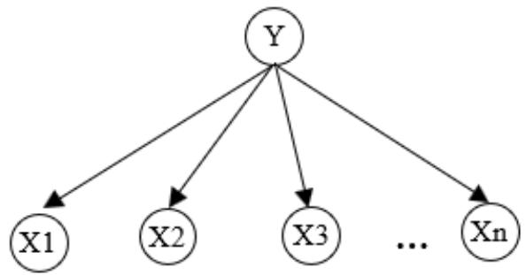

# PHÂN LOẠI BAYES ĐƠN GIẢN

Phần này sẽ đề cập tới phân loại Bayes đơn giản (Naïve Bayes), một phương pháp phân loại đơn giản nhưng có nhiều ứng dụng trong thực tế như phân loại văn bản, dự đoán sắc thái văn bản, lọc thư rác, chẩn đoán y tế. Phân loại Bayes đơn giản là trường hợp riêng của kỹ thuật học máy Bayes, trong đó các giả thiết về độc lập xác suất được sử dụng để đơn giản hóa việc tính xác suất.

# Phương pháp phân loại Bayes đơn giản

Tương tự như học cây quyết định ở trên, phân loại Bayes đơn giản sử dụng trong trường hợp mỗi ví dụ được cho bằng tập các thuộc tính $< x _ { 1 } , x _ { 2 } , . . . , x _ { n } >$ và cần xác định nhãn phân loại y, y có thể nhận giá trị từ một tập nhãn hữu hạn $C$ .

Trong giai đoạn huấn luyện, dữ liệu huấn luyện được cung cấp dưới dạng các mẫu $< _ { \mathbf { X } i } , y _ { i } >$ . Sau khi huấn luyện xong, bộ phân loại cần dự đoán nhãn cho mẫu mới $\mathbf { X }$ .

Theo lý thuyết học Bayes, nhãn phân loại được xác định bằng cách tính xác suất điều kiện của nhãn khi quan sát thấy tổ hợp giá trị thuộc tính $< x _ { 1 } , x _ { 2 } , . . . , x _ { n } >$ . Thuộc tính được chọn, ký hiệu cMAP là thuộc tính có xác suất điều kiện cao nhất (MAP là viết tắt của maximum a posterior), tức là:

$$
y = c _ { _ { M A P } } = \underset { _ { c _ { j } \in C } } { \arg \operatorname* { m a x } } P ( c _ { _ j } \mid x _ { _ 1 } , x _ { _ 2 } , . . . , x _ { _ n } )
$$

Sử dụng quy tắc Bayes, biểu thức trên được viết lại như sau

$$
c _ { \scriptscriptstyle M A P } = \underset { c _ { j } \in C } { \arg \operatorname* { m a x } } \frac { P ( x _ { 1 } , x _ { 2 } , . . . , x _ { n } \mid c _ { j } ) P ( c _ { j } ) } { P ( x _ { 1 } , x _ { 2 } , . . . , x _ { n } ) }
$$

Trong $\mathbf { v } \acute { \mathbf { e } }$ phải của biểu thức này, mẫu số không phụ thuộc vào $c _ { j }$ và vì vậy không ảnh hưởng tới giá trị của $C _ { M A P }$ . Do đó, ta có thể bỏ mẫu số và viết lại như sau:

$$
C _ { M P } = \underset { c _ { j } \in C } { \operatorname { a r g m a x } } P ( x _ { 1 } , x _ { 2 } , . . . , x _ { n } | c _ { j } ) P ( c _ { j } )
$$

Hai thành phần trong biểu thức trên được tính từ dữ liệu huấn luyện. Giá trị $P ( c _ { j } )$ được tính bằng tần suất quan sát thấy nhãn $c _ { j } \operatorname { t r e n }$ tập huấn luyện, tức là bằng số mẫu có nhãn là $c _ { j }$ chia cho tổng số mẫu. Việc tính $P ( x _ { 1 } , x _ { 2 } , . . . , x _ { n } \mid c _ { j } )$ khó khăn hơn nhiều. Vấn đề là số tổ hợp giá trị của $n$ thuộc tính cùng với nhãn phân loại là rất lớn khi n lớn. Để tính xác suất này được chính xác, mỗi tổ hợp giá trị thuộc tính phải xuất hiện cùng nhãn phân loại đủ nhiều, trong khi số mẫu huấn luyện thường không đủ lớn.

Để giải quyết vấn đề trên, ta giả sử các thuộc tính là độc lập về xác suất với nhau khi biết nhãn phân loại $c _ { j }$ . Trên thực tế, các thuộc tính thường không độc lập với nhau như vậy, chẳng hạn đối với ví dụ chơi tennis, khi trời nắng thì xác suất nhiệt độ cao cũng lớn hơn. Chính vì dựa trên giả thiết độc lập xác suất đơn giản như vậy nên phương pháp có tên gọi “Bayes đơn giản”. Tuy nhiên, như ta thấy sau đây, giả thiết như vậy cho phép tính xác suất điều kiện đơn giản hơn nhiều và trên thực tế phân loại Bayes có độ chính xác tốt trong rất nhiều ứng dụng.

Với giả thiết về tính độc lập xác suất có điều kiện, có thể viết:

$$
P ( x _ { 1 } , x _ { 2 } , . . . , x _ { n } \mid c _ { j } ) = P ( x _ { 1 } \mid c _ { j } ) P ( x _ { 2 } \mid c _ { j } ) \dots P ( x _ { n } \mid c _ { j } )
$$

tức là xác suất đồng thời quan sát thấy các thuộc tính bằng tích xác suất điều kiện của tứng thuộc tính riêng lẻ. Thay vào biểu thức $\dot { \mathbf { O } }$ trên, ta được bộ phân loại Bayes đơn giản (có đầu ra ký hiệu là $c _ { N B } \mathrm { i }$ ) như sau.

$$
\begin{array} { c } { c _ { N B } = \operatorname * { a r g m a x } P ( c _ { j } ) \prod P ( x _ { i } \mid c _ { j } ) } \\ { c _ { j } \in C \qquad i } \end{array}
$$

trong đó, $P ( x _ { i } \mid c _ { j } )$ được tính từ dữ liệu huấn luyện bằng số lần $x _ { i }$ xuất hiện cùng với $c _ { j }$ chia cho số lần $c _ { j }$ xuất hiện. Việc tính xác suất này đòi hỏi ít dữ liệu hơn nhiều so với tính $P ( x _ { 1 } , x _ { 2 } , . . . , x _ { n } \mid c _ { j } )$ .

Trên hình 1 là biểu diễn $\mathrm { m } \hat { \mathrm { o } }$ hình phân loại Bayes đơn giản dưới dạng mạng Bayes. Các thuộc tính không được nối với nhau bởi các cạnh và do vậy các thuộc tính độc lập xác suất với nhau nếu biết giá trị của nhãn phân loại.

  
Hình 1: Mô hình Bayes đơn giản: các thuộc tính Xi độc lập xác suất với nhau nếu biết giá trị nhãn phân loại Y.

# Huấn luyện.

Quá trình huấn luyện hay học Bayes đơn giản là quá trình tính các xác suất $P ( c _ { j } )$ và các xác suất điều kiện $P ( x _ { i } \mid c _ { j } )$ bằng cách đếm trên tập dữ liệu huấn luyện. Như vậy, khác với học cây quyết định, Học Bayes đơn giản không đòi hỏi tìm kiếm trong không gian các bộ phân loại. Các xác suất $P ( c _ { j } )$ và các xác suất điều kiện $P ( x _ { i } \mid c _ { j } )$ được tính trên tập dữ liệu huấn luyện theo công thức sau:

Ví dụ.

Để minh họa cho kỹ thuật học Bayes đơn giản, ta sử dụng lại bài toán phân chia ngày thành phù hợp hay không phù hợp cho việc chơi tennis theo điều kiện thời tiết đã được sử dụng trong phần học cây quyết định với dữ liệu huấn luyện cho trong bảng 4.1. Giả sử phải xác định nhãn phân loại cho ví dụ sau:

$< \mathrm { T r } \dot { \bf \mathrm { o r i } } =$ nắng, Nhiệt $\hat { \mathrm { d } } \hat { \mathrm { o } } =$ trung bình, $\mathrm { D } \hat { 0 } \hat { \hat { \mathrm { a } } } \mathrm { m } = \mathrm { c } \mathrm { a } 0$ , $\mathrm { G i } \dot { 0 } = \mathrm { m a n h } >$ Thay số liệu của bài toán vào công thức Bayes đơn giản, ta có: $\begin{array} { r l } & { \qquad c _ { N B } = \underset { c j \in C } { \operatorname { a r g m a x } } P ( c _ { j } ) ~ \Pi ~ P ( x _ { i } | ~ c _ { j } ) } \\ & { \qquad \quad i } \\ & { = \underset {  \vphantom { \operatorname { a r g m a x } }  } { \operatorname { a r g m a x } } } \\ & {  ( \vphantom { \operatorname { a r g m a x } }   } \\ & {   P ( \mathrm { T r o i } \mathord { \operatorname { i \alpha } } \mathrm { \ n a n g } | ~ c _ { j } ) P ( \mathrm { N h . ~ d \hat { o } } \mathrm { - t . ~ b i n h } | ~ c _ { j } ) P ( \mathrm { b \hat { o } } ~ \hat { a } \mathrm { m } \mathrm { = c a o } | ~ c _ { j } ) \ P ( \mathrm { G i } \mathrm { \acute { o } } \mathrm { - m a n h } | ~ c _ { j } ) P ( c _ { j } )  } \end{array}$

Do $c _ { j }$ có thể nhận hai giá trị, ta cần tính 10 xác suất. Các xác suất $P ( \mathrm { c o } )$ và $P ( \mathrm { k h } \hat { \mathrm { o n g } } )$ được tính bằng tất suất “có” và “không” trên dữ liệu huấn luyện.

$$
\begin{array} { l } { { P ( \mathrm { c } \acute { 0 } ) } } \\ { { P ( \mathrm { k h } \acute { 0 } \mathrm { n g } ) = 5 / 1 4 = 0 , 3 6 } } \end{array}
$$

Các xác suất điều kiện cũng được tính từ dữ liệu huấn luyện, ví dụ ta có:

$$
\begin{array} { l } { { P ( \mathrm { b } \hat { \rho } \hat { \mathrm { \ a m } } = \mathrm { c a o } | \mathrm { c } \hat { \rho } ) } } \\ { { P \left( \mathrm { b } \hat { \rho } \hat { \mathrm { a } } \mathrm { m } = \mathrm { c a o } | \mathrm { k h } \hat { \mathrm { o } } \mathrm { n g } \right) = 4 / 5 = 0 , 8 } } \end{array}
$$

$$
\begin{array} { r l r } { \mathrm { ~  ~ \psi ~ } = } & { { } ~ 3 / 9 } & { \mathrm { ~  ~ \psi ~ } = } & { 0 , 3 3 } \end{array}
$$

Thay các xác suất thành phần vào công thức Bayes đơn giản, ta được:

$$
\begin{array} { r l } & { \mathrm { n } \dot { \mathrm { \tilde { a } n g } } | \mathrm { c \tilde { o } } ) P ( \mathrm { t r u n g ~ b i n h } | \mathrm { c \tilde { o } } ) P ( \mathrm { c a o } | \mathrm { c \tilde { o } o } ) P ( \mathrm { m a n h } | \mathrm { c \tilde { o } } ) = 0 . 0 0 5 3 } \\ & { \mathrm { ) } P ( \mathrm { n } \dot { \mathrm { \tilde { a } n g } } | \mathrm { k h \hat { o } n g } ) P ( \mathrm { t r u n g ~ b i n h } | \mathrm { k h \hat { o } n g } ) P ( \mathrm { c a o } | \mathrm { k h \hat { o } n g } ) P ( \mathrm { m a n h } | \mathrm { k h \hat { o } n g } ) = 0 . 0 2 0 6 } \end{array}
$$

Như vậy, theo phân loại Bayes đơn giản, ví dụ đang xét sẽ được phân loại là “không”. Cần chú ý rằng, 0.0053 và 0.0206 không phải là xác suất thực của nhãn “có”

và “không”. Để tính xác suất thực, ta cần chuẩn hóa để tổng hai xác suất bằng 1. Việc chuẩn hoá được thực hiện bằng cách chia mỗi số cho tổng của hai số. Chẳng hạn xác suất có chơi sẽ bằng 0.0053/ $( 0 . 0 0 5 3 + 0 . 0 2 0 6 ) = 0 . 2 0 5 $

# Vấn đề tính xác suất trên thực tế

Phân loại Bayes đơn giản đòi hỏi tính các xác suất điều kiện thành phần $P ( x _ { i } \mid c _ { j } )$ . Xác suất này được tính bằng $n _ { c } / n$ , trong đó $n _ { c }$ số lần $x _ { i }$ và $c _ { j }$ xuất hiện đồng thời trong tập huấn luyện và n là số lần $c _ { j }$ xuất hiện.

Trong nhiều trường hợp, giá trị $n _ { c }$ có thể rất nhỏ, thậm chí bằng không, và do vậy ảnh hưởng tới độ chính xác khi tính xác suất điều kiện. Nếu $n _ { c } = 0$ , xác suất điều kiện cuối cùng sẽ bằng không, bất $\mathrm { k } \mathring { \mathrm { e } }$ các xác suất thành phần khác có giá trị thế nào.

Để khắc phục vấn đề này, một kỹ thuật được gọi là làm trơn thường được sử dụng. Kỹ thuật làm trơn đơn giản nhất sử dụng công thức tính $P ( x _ { i } \mid c _ { j } )$ như sau:

$$
\begin{array} { r } { P ( x _ { i } \mid c _ { j } ) = ( n _ { c } + 1 ) ~ / \left( n + 1 \right) } \end{array}
$$

Như vậy, $\mathrm { k } \mathring { \mathrm { e } }$ cả khi $n _ { c } = 0$ , xác suất vẫn nhận giá trị khác 0.

Trong trường hợp chung, có thể sử dụng công thức được làm trơn sau:

$$
\begin{array} { r l } { P ( x _ { i } \mid c _ { j } ) = { } } & { { } { \cfrac { n c + m p } { n + m p } } } \end{array}
$$

trong đó $p$ là xác suất tiền nghiệm của $x _ { i }$ và $m$ là tham $\mathrm { s } \acute { \mathrm { o } }$ cho phép xác định ảnh hưởng của $p$ tới công thức. Nếu không có thêm thông tin gì khác thì xác suất tiền nghiệm thường được tính $p = 1 ~ / ~ k$ , trong đó $k$ là số thuộc tính của thuộc tính $X _ { i }$ . Ví dụ, nếu không có thêm thông tin gì thêm thì xác suất quan sát thấy $\mathrm { G i } \acute { \mathrm { o } } =$ mạnh sẽ là 1/2 do thuộc tính Gió có hai giá trị. Nếu $m = 0$ , ta được công thức không làm trơn ban đầu. Ngược lại, khi $\mathbf { m } \longrightarrow \infty$ , xác suất hậu nghiệm sẽ bằng $p$ , bất $\ker \hat { \mathsf { e } } n _ { c }$ thế nào. Trong những trường hợp c n lại, cả $n _ { c } / n$ và p cùng đóng góp vào công thức.

# Ứng dụng trong phân loại văn bản tự động

Phân loại văn bản tự động là bài toán có nhiều ứng dụng thực tế. Trước tiên, cho một tập huấn luyện bao gồm các văn bản. Mỗi văn bản có thể thuộc vào một trong C loại khác nhau (ở đây ta không xét trường hợp mỗi văn bản có thể thuộc vào nhiều loại khác nhau). Sau khi huấn luyện xong, thuật toán phân loại nhận được văn bản mới và cần xác định phân loại cho văn bản này. Ví dụ, với các văn bản là nội dung thư điện tử, thuật toán có thể phân loại thư thành “thư rác” và “thư bình thường”. Khi huấn luyện, thuật toán học được cung cấp một tập thư rác và một tập thư thường. Sau đó, dựa trên nội dung thư mới nhận, bộ phân loại sẽ tự xác định đó có phải thư rác không. Một ứng dụng khác là tự động phân chia bản tin thành các thể loại khác nhau, ví dụ “chính trị”, “xã hội”, “thể thao”.v.v. như trên báo điện tử.

Phân loại văn bản tự động là dạng ứng dụng trong đó phân loại Bayes đơn giản và các phương pháp xác suất khác được sử dụng rất thành công. Chương trình lọc thư rác mã nguồn mở SpamAssassin (http://spamassassin.apache.org) là một chương trình lọc thư rác được sử dụng rộng rãi với nhiều cơ chế lọc khác nhau, trong đó lọc Bayes đơn giản là cơ chế lọc chính được gán trọng số cao nhất.

Sau đây ta sẽ xem xét cách sử dụng phân loại Bayes đơn giản cho bài toán phân loại văn bản. Để đơn giản, ta sẽ xét trường hợp văn bản có thể nhận một trong hai nhãn: “rác” và “không”.

Để sử dụng phân loại Bayes đơn giản, cần giải quyết hai vấn đề chủ yếu: thứ nhất, biểu diễn văn bản thế nào cho phù hợp; thứ hai: lựa chọn công thức cụ thể cho bộ phân loại Bayes.

Cách thông dụng và đơn giản nhất để biểu diễn văn bản là cách biểu diễn bằng “túi từ” (bag-of-word). Theo cách này, mỗi văn bản được biểu diễn bằng một tập hợp, trong đó mỗi phần tử của tập hợp tương ứng với một từ khác nhau của văn bản. Để đơn giản, ở đây ta coi mỗi từ là một đơn vị ngôn ngữ được ngăn với nhau bởi dấu cách. Lưu ý rằng đây là cách đơn giản nhất, ta cũng có thể thêm số lần xuất hiện thực tế của từ trong văn bản. Cách biểu diễn này không quan tâm tới vị trí xuất hiện của từ trong văn bản cũng như quan hệ với các từ xung quanh, do vậy có tên gọi là túi từ. Ví dụ, một văn bản có nội dung “Chia thư thành thư rác và thư thường” sẽ được biểu diễn bởi tập từ {“chia”, “thư”, “thành”, “rác”, “và”, “thường”} với sáu phần tử.

Giả thiết các từ biểu diễn cho thư xuất hiện độc lập với nhau khi biết nhãn phân loại, công thức Bayes đơn giản cho phép ta viết:

$\begin{array} { r } { c _ { N B } = \underset { c j \in \{ r a c , k h o n g \} } { \operatorname { a r g m a x } } P ( c _ { j } ) \prod _ { i } P ( x _ { i } | c _ { j } ) } \\ { c _ { j } \in \{ r a c , k h o n g \} \quad \quad } \end{array}$ = argmax cj∈{rac,khong}

P(cj) P(“chia”| cj) P(“thư ”| cj) P(“thành”| cj) P(“rác”| cj) P(“và”| cj) P(“thường ”| cj)

Các xác suất $P ( \operatorname { \mathbb { f } } \operatorname { \mathrm { r a c } } ^ { , 9 } | c _ { j } )$ được tính từ tập huấn luyện như mô tả ở trên. Những từ chưa xuất hiện trong tập huấn luyện sẽ bị bỏ qua, không tham gia vào công thức.

Cần lưu ý rằng cách biểu diễn và áp dụng phân loại Bayes đơn giản cho phân loại văn bản vừa trình bày là những phương án đơn giản. Trên thực tế có rất nhiều biến thể khác nhau cả trong việc chọn từ, biểu diễn văn bản bằng các từ, cũng như công thức tính xác suất điều kiện của văn bản.

Mặc dù đơn giản, nhiều thử nghiệm cho thấy, phân loại văn bản tự động bằng Bayes đơn giản có độ chính xác khá cao. Trên nhiều tập dữ liệu thư điện tử, tỷ lệ phân loại chính xác thư rác có thể đạt trên $9 8 \%$ . Kết quả này cho thấy, mặc dù giả thiết các từ độc lập với nhau là không thực tế, độ chính xác phân loại của Bayes đơn giản không bị ảnh hưởng đáng $\mathrm { k } \mathring { \mathrm { e } }$ .