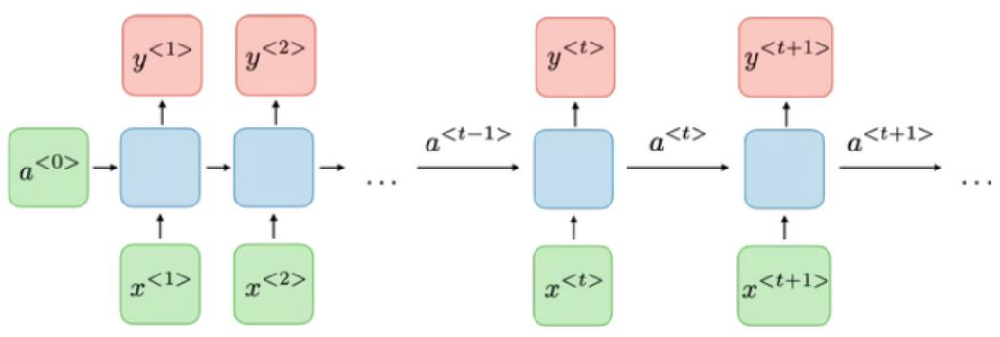
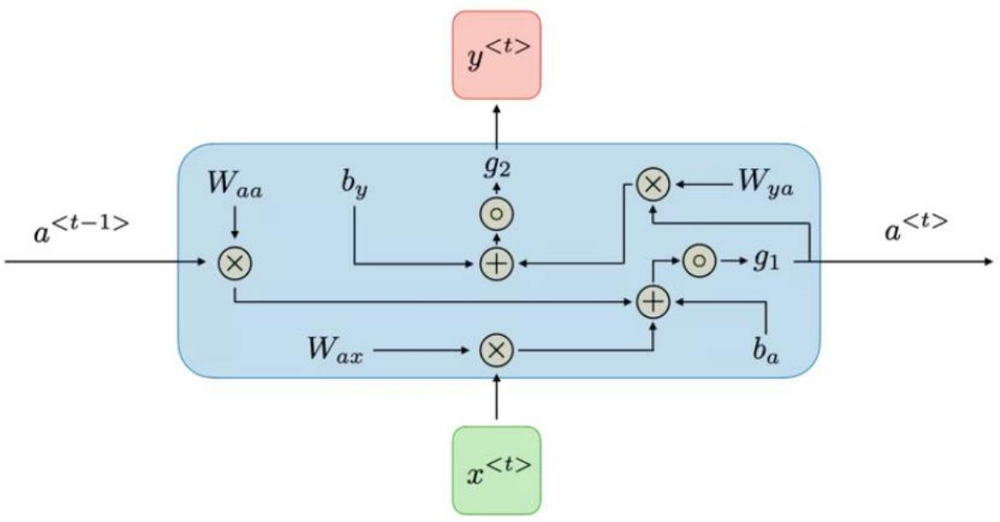
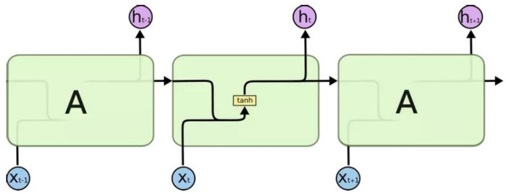
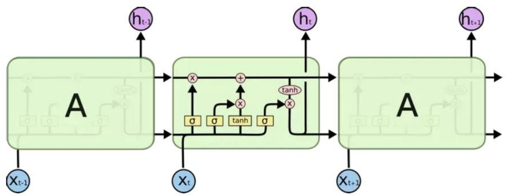
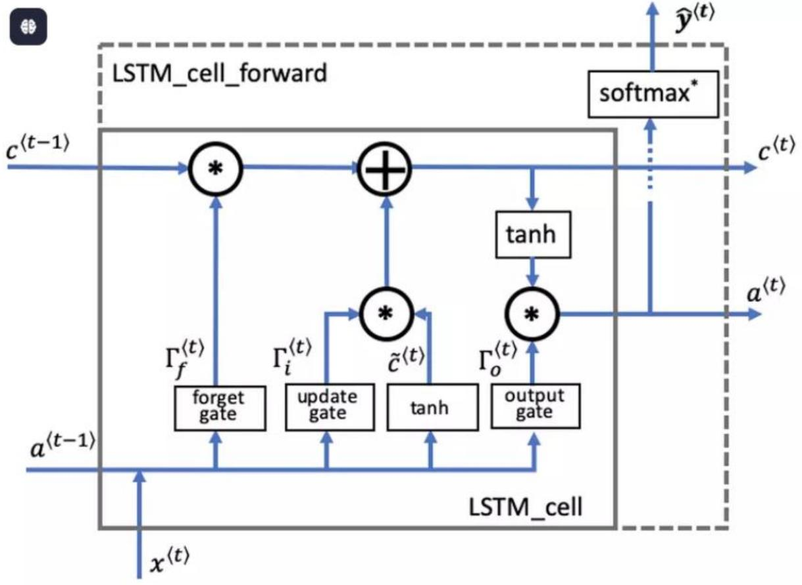

<table><tr><td rowspan=2 colspan=1>Ai</td><td rowspan=1 colspan=1>VIETTEL AI RACE</td><td rowspan=1 colspan=1>Public 113</td></tr><tr><td rowspan=1 colspan=1>ATTENTION VASU&#x27; HiNH THANHCUa MO HiNH &#x27;I TRANSFORMER</td><td rowspan=1 colspan=1>ıLàn ban hành: 1</td></tr></table>

# 1. Định nghĩa:

Attention là một kĩ thuật được sử dụng trong các mạng neural, kỹ thuật này được sử dụng trong các mô hình thực hiện các task như dịch máy hay ngôn ngữ tự nhiên. BERT và GPT là $2 \mathrm { m } \hat { \mathrm { o } }$ hình điển hình có sử dụng Attention. Attention là thành phần chính tạo nên sự đình đám của mô hình Transformer, mô hình này chính là sự đột phá trong các bài toán xử lý của NLP so với các mạng neural hồi quy. Vậy Attention là gì mà tại sao nó lại là sự khác biệt đến vậy, hãy cũng tôi đi tìm hiểu trong bài viêt ngày hôm nay với tiêu đề “Attention và sự hình thành của mô hình Transformer”

# 2. Động lực cho sự phát triển của Attention

# 2.1. Recurrent Neural Network (RNN) và sự hạn chế đáng kể

# 2.1.1. Ý tưởng cốt lõi của RNN

Con người chúng ta không thể bắt đầu suy nghĩ của mình tại tất cả các thời điểm, cũng giống như việc bạn đang đọc bài viết này, bạn hiểu mỗi chữ ở đây dựa vào các chữ mà bạn đã đọc và hiểu trước đó, chứ không phải đọc xong là quên chữ đó đi rồi đến lúc gặp thì lại phải đọc và tiếp thu lại. Giống như trong bài toán của chúng ta. Các mô hình mạng nơ-ron truyền thống lại không thể làm được việc trên. Vì vậy mạng nơ-ron hồi quy (RNN) được sinh ra để giải quyết việc đó. Mạng này chứa các vòng lặp bên trong cho phép nó lưu lại các thông tin đã nhận được. RNN là một thuật toán quan trọng trong xử lý thông tin dạng chuỗi hay nói cách khác là dạng xử lý tuần tự.

  
Cäu trúc co bán cúa RNN

<table><tr><td rowspan=2 colspan=1>Ai</td><td rowspan=1 colspan=1>VIETTEL AI RACE</td><td rowspan=1 colspan=1>Public 113</td></tr><tr><td rowspan=1 colspan=1>ATTENTION VA SU&#x27; HINH THANHCUA MO HiNHTRANSFORMER</td><td rowspan=1 colspan=1>Làn ban hành: 1</td></tr></table>

Vậy như nào là xử lý tuần tự - Xử lý tuần tự là mỗi block sẽ lấy thông tin của block trước và input hiện tại làm đầu vào

Tai mǒi buóc t, giá tri kích hoat $a ^ { t }$ và đäu ra $y ^ { t }$ duoc biéu diěn nhu sau:

$$
a ^ { t } = g _ { 1 } . ( W _ { a a } . a ^ { t - 1 } + W _ { a x } . x ^ { t } + b _ { a } )
$$

ta có thé viét gon lai nhu sau:

$$
\begin{array} { c } { { a ^ { t } = g _ { 1 } . ( \left( W _ { a a } W _ { a x } \right) \left( \begin{array} { c } { { a ^ { t - 1 } } } \\ { { x ^ { t } } } \end{array} \right) + b _ { a } ) } } \\ { { { } } } \\ { { a ^ { t } = g _ { 1 } . ( W \left( \begin{array} { c } { { a ^ { t - 1 } } } \\ { { x ^ { t } } } \end{array} \right) + b _ { a } ) } } \end{array}
$$

Tùr vói $a ^ { t }$ ta có còng thúrc tính dau ra tuong úng $y ^ { t }$

$$
y ^ { t } = g _ { 2 } . ( W _ { y a } . a ^ { t } + b _ { y } )
$$

  
Cau trúc mot block trong RNN

2.1.2. Ưu điểm và nhược điểm của RNN

<table><tr><td rowspan=2 colspan=1>Ai</td><td rowspan=1 colspan=1>VIETTEL AI RACE</td><td rowspan=1 colspan=1>Public 113</td></tr><tr><td rowspan=1 colspan=1>ATTENTION VASU&#x27; HINH THANHCUA MO HiNHTRANSFORMER</td><td rowspan=1 colspan=1>Làn ban hành: 1</td></tr></table>

<table><tr><td rowspan=1 colspan=1>Uu diém</td><td rowspan=1 colspan=1>Nhurgc diém</td></tr><tr><td rowspan=1 colspan=1>Khà nǎng xú ly cácchuǒi dàu vào có do dàikhác nhau</td><td rowspan=1 colspan=1>Tính toán khá chàm</td></tr><tr><td rowspan=1 colspan=1>Kich cō mò hinh khòngbi tǎng len theo kíchthuóc dàu vào</td><td rowspan=1 colspan=1>Khó truy càp lai thòng tin dā di qua ó mòt khoángthòi gian dài truóc dó - hay còn goi là bi quènthòng tin khi gǎp nhièu thòng tin mói</td></tr><tr><td rowspan=1 colspan=1>dung thòng tin truóc do</td><td rowspan=1 colspan=1>Quá trinh tính toán có súr Phai thuc hien tuàn tur nen khòng tàn dung triet děduoc khá nǎng tính toán song song cúa GPU</td></tr><tr><td rowspan=1 colspan=1>Trong só duoc chia sétrong suót qua trinh hoc</td><td rowspan=1 colspan=1>Vanishing gradient</td></tr></table>

# 2.2. Vấn đề gặp phải của Long Short Term Memory (LSTM)

# 2.2.1 Ý tưởng cốt lõi của LSTM (Long short term memory)

LSTM là một dạng đặc biệt của RNN, nó có khả năng học các thông tin ở xa. Về cơ bản thì LSTM và RNN không khác nhau là mấy nhưng LSTM có cải tiển một số phép tính trong 1 hidden state và nó đã hiểu quả. Hiệu quả như nào thì chúng ta hãy cũng đọc tiếp nhé!

<table><tr><td rowspan=2 colspan=1>Ai</td><td rowspan=1 colspan=1>VIETTEL AI RACE</td><td rowspan=1 colspan=1>Public 113</td></tr><tr><td rowspan=1 colspan=1>ATTENTION VASU HiNH THANHCUA MO HiNH&#x27;TRANSFORMER</td><td rowspan=1 colspan=1>ıLàn ban hành: 1</td></tr></table>

Cấu trúc của LSTM không khác gì RNN, nhưng sự cải tiến ở đây năm ở phần tính toán trong từng hidden state như sau: Thay vì chỉ có một tầng mạng nơ-ron, LSTM thiết kế với 4 tầng mạng nơ-ron tương tác với nhau một các rất đặc biệt.

Dưới đây là 2 hình ảnh biểu diễn sự khác nhau giữa RNN và LSTM

  
RNN with tanh function

  
LSTM with tanh and sigmoid functions

Chìa khóa để giúp LSTM có thể truyền tải thông tin giữa các hidden state một các xuyên suốt chính là cell state (hình dưới):

<table><tr><td rowspan=2 colspan=1>Ai</td><td rowspan=1 colspan=1>VIETTEL AI RACE</td><td rowspan=1 colspan=1>Public 113</td></tr><tr><td rowspan=1 colspan=1>ATTENTION VA SU&#x27; HiNH THANHCUa MO HiNH TRANSFORMER</td><td rowspan=1 colspan=1>ıLàn ban hành: 1</td></tr></table>

  
LSTM cell state

Đầu ra là hàm sigmoid chứa các giá trị từ 0 đến 1.

Nếu forget gate có giá trị bằng 0, LSTM sẽ "quên" trạng thái được lưu trữ trong đơn vị tương ứng của trạng thái cell trước đó.

Nếu cổng quên có giá trị bằng 1, LSTM sẽ chủ yếu ghi nhớ giá trị tương ứng ở trạng thái được lưu trữ.

$$
\Gamma _ { f } ^ { \left. t \right. } = \sigma ( \mathbf { W } _ { f } [ \mathbf { a } ^ { \left. t - 1 \right. } , \mathbf { x } ^ { \left. t \right. } ] + \mathbf { b } _ { f } )
$$

Candidate value $\tilde { \mathbf { c } } ^ { ( t ) }$

<table><tr><td rowspan=2 colspan=1>Ai</td><td rowspan=1 colspan=1>VIETTEL AI RACE</td><td rowspan=1 colspan=1>Public 113</td></tr><tr><td rowspan=1 colspan=1>ATTENTION VA SU&#x27; HiNH THANHCUa MO HiNH TRANSFORMER</td><td rowspan=1 colspan=1>Làn ban hành: 1</td></tr></table>

Chứa thông tin có thể được lưu trữ từ time step hiện tại.

$$
\tilde { \mathbf { c } } ^ { ( t ) } = \operatorname { t a n h } \left( \mathbf { W } _ { c } [ \mathbf { a } ^ { ( t - 1 ) } , \mathbf { x } ^ { ( t ) } ] + \mathbf { b } _ { c } \right)
$$

Update gate $\mathbf { { r } } _ { i }$

Quyět dinh xem phan thòng tin nào cúa $\tilde { \mathbf { c } } ^ { ( t ) }$ có the thèm vào $\mathbf { c } ^ { ( t ) }$

$$
\mathbf { \Gamma } _ { i } ^ { \left. t \right. } = \sigma ( \mathbf { W } _ { i } [ a ^ { \left. t - 1 \right. } , \mathbf { x } ^ { \left. t \right. } ] + \mathbf { b } _ { i } )
$$

# Cell state c(tci)

Là bộ nhớ trong của LSTM. Cell state như 1 băng tải truyền các thông tin cần thiết xuyết suất cả quá trình, qua các nút mạng và chỉ tương tác tuyển tính 1 chút. Vì vậy thông tin có thể tuyền đi thông suốt mà không bị thay đổi.

$$
\mathbf { c } ^ { \left. t \right. } = \mathbf { \Gamma } _ { f } ^ { \left. t \right. } * \mathbf { c } ^ { \left. t - 1 \right. } + \mathbf { \Gamma } _ { i } ^ { \left. t \right. } * \tilde { \mathbf { c } } ^ { \left. t \right. }
$$

<table><tr><td rowspan=2 colspan=1>Ai</td><td rowspan=1 colspan=1>VIETTEL AI RACE</td><td rowspan=1 colspan=1>Public 113</td></tr><tr><td rowspan=1 colspan=1>ATTENTION VA SU&#x27; HiNH THANHCUa MO HiNH &#x27;I TRANSFORMER</td><td rowspan=1 colspan=1>ıLàn ban hành: 1</td></tr></table>

# Output gate $\mathbf { \delta T } _ { o }$

Cong diěeu chinh luong thòng tin däu ra cúa cell hièn tai và luong thòng tin truyěn tói trang thái tiép theo.

$$
\mathbf { \Gamma } _ { o } ^ { \left\{ t \right\} } = \sigma ( \mathbf { W } _ { o } [ \mathbf { a } ^ { \left\{ t - 1 \right\} } , \mathbf { x } ^ { \left\{ t \right\} } ] + \mathbf { b } _ { o } )
$$

Hidden state $\mathbf { a } ^ { ( t ) }$

Dugc sú dung dě xác dinh ba cǒng $( \mathbf { T } f , \mathbf { T } u , \mathbf { T } _ { o } )$ cua time step tiép theo.

$$
\mathbf { a } ^ { ( t ) } = \Gamma _ { o } ^ { ( t ) } * \operatorname { t a n h } ( \mathbf { c } ^ { ( t ) } )
$$

Prediction $\mathbf { y } _ { p r e d } ^ { ( t ) }$

Du doán trong truòng hop sú' dung này là phân loai, vì vày ban sě sú' dung softmax.

$$
\mathbf { y } _ { p r e d } ^ { \left. t \right. } = \mathrm { s o f t m a x } ( \mathbf { W } _ { y } \mathbf { a } ^ { \left. t \right. } + \mathbf { b } _ { y } )
$$