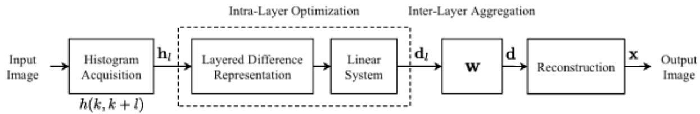

<table><tr><td rowspan="3">Ai</td><td>VIETTEL AI RACE aO</td><td>Public 114</td></tr><tr><td>CONTRAST ENHANCEMENT BASED ON LAYERED DIFFERENCE</td><td>Làn ban hành: 1</td></tr><tr><td>REPRESENTATION OF 2D HISTOGRAMS</td><td></td></tr></table>

# I. Giới thiệu

Mặc dù công nghệ xử lý hình ảnh đã có nhiều tiến bộ, các hình ảnh thu được vẫn thường không thể hiện đầy đủ chi tiết cảnh hoặc có độ tương phản thấp do giới hạn dải động. Các phương pháp tăng cường tương phản (Contrast Enhancement - CE) đã được phát triển nhằm khắc phục vấn đề này. Tuy nhiên, các phương pháp truyền thống như Histogram Equalization - HE thường tập trung vào phân phối mức xám tuyệt đối, dẫn đến hạn chế trong việc xử lý tương phản cục bộ và dễ gây hiện tượng quá làm nổi bật ở một số vùng ảnh.

Phương pháp được đề xuất là một thuật toán tăng cường tương phản toàn cục mới, dựa trên khung lý thuyết Layered Difference Representation - LDR. Điểm khác biệt chính của phương pháp này so với các thuật toán truyền thống là việc sử dụng lược đồ 2D để biểu diễn mối quan hệ mức xám giữa các điểm ảnh liền $\mathbf { k } \dot { \hat { \mathbf { e } } } .$ , thay vì chỉ xét đến phân phối mức xám đơn lẻ. Điều này cho phép phương pháp tận dụng sự nhạy cảm tự nhiên của hệ thống thị giác con người (Human Visual System - HVS) đối với sự khác biệt mức xám, mang lại kết quả cải thiện tương phản phù hợp hơn với nhận thức thị giác.

Phương pháp LDR $\mathrm { k } \acute { \mathrm { e } }$ thừa từ các nghiên cứu sử dụng lược đồ 2D trước đó, chẳng hạn như thuật toán Contextual Visual Contrast (CVC). Tuy nhiên, thay vì chỉ khai thác thông tin biên và cạnh vật thể, phương pháp LDR thiết lập mối quan hệ chặt chẽ giữa lược đồ 2D của ảnh đầu vào và sự khác biệt mức xám trong ảnh đầu ra. Phương pháp này nhấn mạnh các sự khác biệt xuất hiện thường xuyên, qua đó cải thiện tương phản cục bộ và tận dụng tối đa dải động. Điều này giúp LDR vượt qua các hạn chế của HE và CVC, mang lại hình ảnh đầu ra có độ tương phản cao hơn và chất lượng thị giác tốt hơn.

# II. Mô tả thuật toán

Thuật toán tăng cường tương phản toàn cục được đề xuất dựa trên Layered Difference Representation – LDR. Thuật toán gồm hai thành phần chính: intralayer optimization và inter-layer aggregation. Các bước chính được mô tả lần lượt dưới đây.

<table><tr><td rowspan="3">Ai</td><td>VIETTEL AI RACE</td><td>Public 114</td></tr><tr><td>CONTRAST ENHANCEMENT BASED ON LAYERED DIFFERENCE</td><td>Làn ban hành: 1</td></tr><tr><td>REPRESENTATION OF 2D HISTOGRAMS</td><td></td></tr></table>

Hình minh họa quy trình, thể hiện các bước từ việc trích xuất lược đồ $2 D _ { i }$ , tối ưu hóa trong lớp, tổng hợp giữa các lớp, đến tái cấu trúc ảnh đầu ra.

# 1. Trích Xuất Lược Đồ 2D

- Bước đầu tiên là xây dựng lược đồ 2D $\mathrm { { h } } ( \mathrm { { k } } , \mathrm { { k } } + 1 )$ từ ảnh đầu vào. Lược đồ này đếm số lượng các cặp điểm ảnh liền $\mathrm { k } \dot { \hat { \mathbf { e } } }$ với mức xám k và $_ { \mathrm { k + l } }$ , biểu diễn sự khác biệt mức xám giữa các điểm ảnh trong không gian ảnh.

ℎ(??, ?? + ??) = ??ầ?? ??ố ??á?? ??ặ?? đ??ể?? ả??ℎ ??ó ??ứ?? ??á?? $( k , k + l )$

Lược đồ 2D cung cấp thông tin phong phú về sự thay đổi mức xám, giúp phát hiện các đặc điểm cục bộ quan trọng để cải thiện tương phản.

# 2. Intra-Layer Optimization

Lược đồ $\mathrm { { h } } ( \mathrm { { k } } , \mathrm { { k } } + 1 )$ được phân tách thành các lớp (layers), mỗi lớp đại diện cho một khoảng chênh lệch mức xám cụ thể l.

- Với mỗi lớp l, một vector lược $\dot { \mathrm { d } } \dot { \hat { \mathrm { o } } } \mathrm { h } _ { \mathrm { l } }$ được tính toán. Vector này được sử dụng để thiết lập một hệ phương trình tuyến tính, từ đó giải ra vector sự khác biệt ${ \bf d } _ { \mathrm { l } }$ cho lớp l.

$$
D \cdot d _ { l } = s _ { l } ,
$$

với D là ma trận chênh lệch, sl là tổng của $\mathrm { h } _ { \mathrm { l } }$ .

- Quá trình tối ưu này đảm bảo rằng các sự khác biệt mức xám xuất hiện thường xuyên sẽ được làm nổi bật trong ảnh đầu ra.

# 3. Inter-Layer Aggregation

- Các vector khác biệt dl từ tất cả các lớp được tổng hợp lại thành một vector sự khác biệt hợp nhất d, sử dụng một vector trọng số w để xác định mức độ đóng góp của mỗi lớp.

<table><tr><td rowspan="3">Ai</td><td>VIETTEL AI RACE</td><td>Public 114</td></tr><tr><td>CONTRAST ENHANCEMENT BASED ON LAYERED DIFFERENCE</td><td>Làn ban hành: 1</td></tr><tr><td>REPRESENTATION OF 2D HISTOGRAMS</td><td></td></tr></table>

$$
d = \sum _ { l = 1 } ^ { 2 5 5 } w _ { l } \cdot d _ { l }
$$

Quá trình tổng hợp này giúp kết hợp thông tin từ tất cả các lớp, tạo ra một biểu diễn toàn diện cho toàn bộ ảnh.

# 4. Tái Cấu Trúc Hàm Biến Đổi

Vector d được sử dụng để tái cấu trúc hàm biến đổi $\mathbf { X }$ , ánh xạ mức xám đầu vào thành mức xám đầu ra.

$$
x _ { k } = x _ { k - 1 } + d _ { k - 1 } , \forall k \in [ 1 , 2 5 5 ]
$$

Hàm biến đổi này được áp dụng để biến đổi ảnh đầu vào, tạo ra ảnh đầu ra với độ tương phản được cải thiện.

# 5. Kết Quả

Hàm biến đổi x được áp dụng lên ảnh đầu vào:

$$
o u t = x [ i m g ]
$$

- Phương pháp tập trung vào việc tăng cường các sự khác biệt mức xám thường xuất hiện trong ảnh đầu vào. Điều này giúp cải thiện đáng $\mathrm { k } \mathring { \mathrm { e } }$ độ tương phản so với các phương pháp truyền thống, đồng thời tận dụng toàn bộ dải động của ảnh.