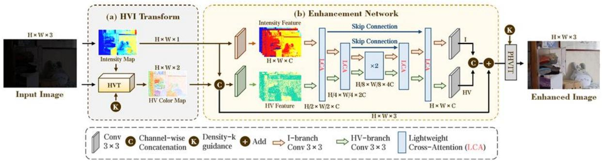
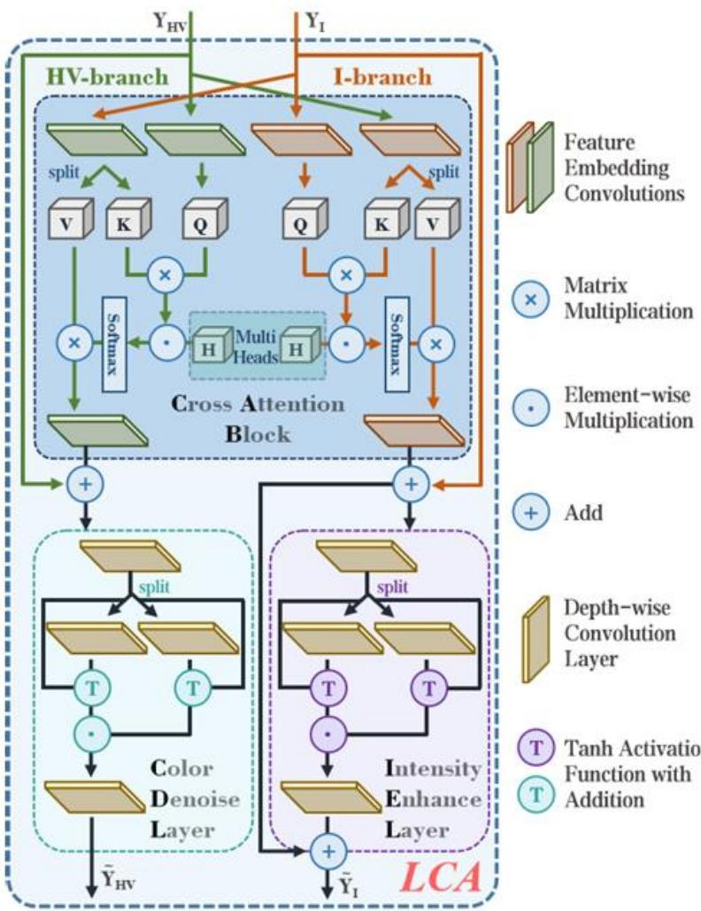

# I. Giới thiệu

Trong các điều kiện ánh sáng yếu, ảnh chụp thường bị suy giảm đáng $\mathrm { k } \mathring { \mathrm { e } }$ về chất lượng, xuất hiện noise và màu sắc không chính xác, gây khó khăn cho các ứng dụng như giám sát an ninh, xử lý y tế, và thị giác máy tính. Nhiệm vụ cải thiện ảnh ánh sáng yếu (Low-Light Image Enhancement - LLIE) nhằm phục hồi chi tiết, cân bằng độ sáng và giảm thiểu nhiễu từ các ảnh bị suy giảm chất lượng. Các phương pháp hiện tại chủ yếu dựa vào mạng nơ-ron học sâu để học hàm ánh xạ từ ảnh ánh sáng yếu sang ảnh sáng chuẩn trên không gian màu sRGB hoặc HSV. Tuy nhiên, các không gian màu này thường không ổn định do mối liên hệ phức tạp giữa độ sáng và màu sắc, dẫn đến sự phụ thuộc mạnh giữa các kênh RGB hoặc sự bất liên tục trên trục màu Hue trong không gian HSV.

Để giải quyết những hạn chế này, phương pháp tiếp cận mới được đề xuất nhằm định nghĩa một không gian màu có khả năng học được, có tên là Horizontal/Vertical-Intensity (HVI). Không gian HVI được thiết kế đặc biệt để tách biệt rõ ràng độ sáng và màu sắc, đồng thời thích ứng với các điều kiện chiếu sáng khác nhau thông qua các tham số học được. Điều này cho phép cải thiện sự ổn định trong việc xử lý ảnh, giảm thiểu hiệu ứng giả màu và lỗi về độ sáng thường gặp trong các không gian màu truyền thống. Bên cạnh đó, không gian HVI cung cấp nền tảng hiệu quả để xây dựng các kiến trúc mạng nơ-ron tối ưu hóa, phù hợp với các thiết bị tài nguyên hạn chế.

Để tận dụng tối đa không gian màu HVI, một mạng học sâu có tên Color and Intensity Decoupling Network (CIDNet) được đề xuất, kết hợp hai nhánh xử lý song song cho độ sáng và màu sắc. CIDNet được trang bị cơ chế Lighten CrossAttention (LCA), giúp tối ưu hóa tương tác giữa các đặc trưng của nhánh độ sáng và nhánh màu sắc, đảm bảo tính bổ sung thông tin giữa hai thành phần. Kết quả thực nghiệm trên nhiều bộ dữ liệu đã chứng minh rằng CIDNet, dựa trên không gian HVI, không chỉ đạt hiệu suất vượt trội so với các phương pháp hiện đại mà còn giảm thiểu đáng $\mathrm { k } \mathring { \mathrm { e } }$ độ phức tạp tính toán, đáp ứng yêu cầu triển khai trên các thiết bị biên.

# II. Mô tả phương pháp

# Không gian màu HVI

Không gian màu Horizontal/Vertical-Intensity (HVI) được thiết kế để tách biệt hoàn toàn độ sáng và màu sắc, đồng thời bổ sung các tham số học được, cho phép hệ thống thích nghi tốt hơn với các điều kiện chiếu sáng khác nhau.

# Cấu trúc của HVI

Không gian màu HVI bao gồm ba thành phần chính, được thiết kế để cải thiện khả năng biểu diễn và xử lý ảnh:

2.1. Intensity Map (Bản đồ độ sáng):

Bản đồ độ sáng được tính toán dựa trên giá trị lớn nhất trong ba kênh RGB tại mỗi điểm ảnh, giúp biểu diễn trực tiếp cường độ ánh sáng của cảnh. Công thức được định nghĩa như sau:

$$
I _ { m a x } = \operatorname* { m a x } _ { c \epsilon \{ R , G , B \} } ( I _ { C } )
$$

Bản đồ này đóng vai trò làm tham chiếu để phân tách độ sáng và màu sắc.

2.2. HV Transformation (Chuyển đổi màu sắc theo trục ngang/dọc):

Chuyển đổi HV được thiết kế để khắc phục tính không liên tục của trục Hue trong không gian HSV. Nó sử dụng các tham số học được và ánh xạ từng điểm ảnh sang mặt phẳng màu ngang/dọc, tạo thành một hệ tọa độ trực giao cho màu sắc.

Công thức tổng quát:

$$
\begin{array} { c } { { \widehat { H } = C _ { k } \cdot S \cdot D _ { T } \cdot \cos { ( 2 \pi P _ { \gamma } ) } } } \\ { { { } } } \\ { { \widehat { V } = C _ { k } \cdot S \cdot D _ { T } \cdot s i n ( 2 \pi P _ { \gamma } ) } } \end{array}
$$

Trong đó, $\mathrm { C _ { k } }$ đại diện cho mật độ màu, $\mathrm { D } _ { \mathrm { T } }$ là hàm điều chỉnh độ bão hòa, và $\mathrm { P } _ { \gamma }$ là ánh xạ tuyến tính điều chỉnh màu sắc

2.3. Perceptual-Invert HVI Transformation (Chuyển đổi ngược):

Không gian HVI tích hợp các tham số học được để cải thiện khả năng xử lý linh hoạt:

# a. Color-Density-k (Mật độ màu):

Tham số k điều chỉnh mật độ màu trên mặt phẳng màu ở các vùng có độ sáng thấp, giảm thiểu mất mát thông tin trong vùng tối. Công thức được định nghĩa như sau:

$$
C _ { k } = k \sqrt { \sin \left( \frac { \pi I _ { m a x } } { 2 } \right) + \epsilon }
$$

b. Hue Bias Parameters $( \gamma _ { G } , \gamma _ { B } )$ :

Các tham số này điều chỉnh độ nhạy màu sắc theo các kênh RGB để phù hợp với các đặc tính của cảm biến máy ảnh, giảm thiểu hiện tượng lệch màu, đặc biệt ở các vùng ánh sáng yếu.

c. Chức năng điều chỉnh độ bão hòa $( \mathrm { D } _ { \mathrm { T } } )$

Một hàm học được để tối ưu hóa độ bão hòa màu sắc dựa trên ánh xạ tuyến tính của tham số $\mathrm { P } _ { \gamma }$ , đảm bảo tính linh hoạt trong việc điều chỉnh cường độ màu.

# Chuyển đổi hai chiều giữa HVI và sRGB

Quá trình chuyển đổi giữa HVI và sRGB được thiết kế để đảm bảo tính thuận nghịch, với hai bước chính:

## Từ sRGB sang HVI:

Sử dụng bản đồ độ sáng $( I _ { \mathrm { m a x } }$ ) để tính toán các thành phần HVI, bao gồm các mặt phẳng ngang và dọc (Ĥ, V̂ ). Phương pháp này đảm bảo rằng màu sắc và độ sáng được tách biệt hoàn toàn.

## Từ HVI về sRGB:

Chuyển đổi ngược được thực hiện bằng cách tái hợp nhất các thành phần HVI và ánh xạ về không gian sRGB. Các công thức sau đây được sử dụng:

$$
R = f ( \widehat { H } , \widehat { V } , I _ { m a x } )
$$

$$
G , B = T u o n g t \downarrow \downarrow d a t r \hat { \mathsf { e } } n \dot { a } n h x \mathsf { a } c \dot { \mathsf { u } } a \widehat { H } , \widehat { V }
$$

Quá trình này không chỉ phục hồi màu sắc chính xác mà còn duy trì độ sáng tự nhiên của ảnh.

4. CIDNet

## Kiến trúc tổng thể

Tổng quan về mô hình CIDNet được đề xuất. (a) Chuyển đổi màu HVI (HVIT) nhận một ảnh sRGB làm đầu vào và tạo ra bản đồ màu HV cùng bản đồ cường độ sáng làm đầu ra. (b) Mạng tăng cường thực hiện quá trình xử lý chính, sử dụng kiến trúc UNet hai nhánh, bao gồm sáu khối Lighten Cross-Attention (LCA). Cuối cùng, áp dụng Perceptual-inverse HVI Transform (PHVIT) để nhận bản đồ HVI đã được làm sáng làm đầu vào và chuyển đổi nó thành ảnh sRGB đã được cải thiện.

Mô hình CIDNet (Color and Intensity Decoupling Network) được thiết kế dựa trên không gian màu HVI để tách biệt và xử lý độ sáng (Intensity) và màu sắc (HV-plain) trong ảnh ánh sáng yếu. Kiến trúc CIDNet bao $\mathrm { g } \dot { \hat { \mathrm { o } } } \mathrm { m }$ ba thành phần chính:

### HVI Transformation (HVIT):

Thành phần này chuyển đổi ảnh từ không gian sRGB sang không gian HVI, tách biệt hai đặc trưng:

- Intensity Map (Bản đồ độ sáng): Đại diện cho độ sáng tổng thể của cảnh, được tính toán từ giá trị lớn nhất trong các kênh RGB tại mỗi điểm ảnh.

- HV Color Map (Bản đồ màu HV): Chứa thông tin màu sắc và cấu trúc của ảnh, được điều chỉnh bởi các tham số học được như Color-Density-k và Hue Bias Parameters $( \gamma _ { \mathrm { G } } , \gamma _ { \mathrm { B } } )$ .

Quá trình này đảm bảo tách biệt hoàn toàn giữa độ sáng và màu sắc, giúp giảm độ phức tạp của mô hình trong các bước xử lý sau.

4.1.2. Mạng Tăng cường (Enhancement Network):

Đây là thành phần chính trong CIDNet, được thiết kế dựa trên kiến trúc UNet hai nhánh:

- HV-branch: Xử lý các đặc trưng màu sắc từ HV Color Map để loại bỏ nhiễu và đảm bảo màu sắc chính xác.

- Intensity-branch: Xử lý thông tin độ sáng từ Intensity Map, cải thiện độ sáng tổng thể của ảnh.

Mạng sử dụng cơ chế Lighten Cross-Attention (LCA) để trao đổi thông tin giữa hai nhánh, đảm bảo sự phối hợp và bổ sung thông tin giữa màu sắc và độ sáng.

4.1.3. Perceptual-Inverse HVI Transformation (PHVIT):

Thành phần này chuyển đổi ảnh đã được cải thiện trong không gian HVI trở lại không gian sRGB, tái hợp nhất thông tin màu sắc và độ sáng để tạo ra ảnh đầu ra tự nhiên và chính xác.

## Lighten Cross-Attention (LCA) Module

CIDNet là một mạng học sâu không gian màu HVI và cơ chế LCA để tối ưu hóa khả năng xử lý ảnh ánh sáng yếu. Với kiến trúc UNet hai nhánh và các thành phần được thiết $\mathrm { k } \acute { \mathrm { e } }$ chuyên biệt, CIDNet không chỉ cải thiện chất lượng độ sáng và màu sắc của ảnh mà còn giảm thiểu độ phức tạp tính toán, phù hợp với các thiết bị tài nguyên hạn chế.

Khối Lighten CrossAttention (LCA) hai nhánh (tức là nhánh và nhánh HV). LCA bao gồm một khối Chú ý Chéo (CAB), một Lớp Tăng cường Cường độ (IEL), và một Lớp Giảm nhiễu Màu sắc (CDL). Các lớp tích chập nhúng đặc trưng bao gồm một lớp tích chập theo chiều sâu $I \times I$ và một lớp tích chập theo nhóm $3 \times 3 .$ .

LCA là thành phần quan trọng trong CIDNet, được thiết kế để tăng cường sự phối hợp giữa hai nhánh HV-branch và Intensity-branch bằng cách học các thông tin bổ sung giữa chúng. LCA bao $\mathrm { g } \dot { \hat { \mathrm { o } } } \mathrm { m }$ ba thành phần chính:

### Cross Attention Block (CAB)

- CAB thực hiện cơ chế chú ý chéo (cross-attention), trong $\tt d \ ' 0 \ m o t$ nhánh hoạt động như "query" và nhánh còn lại là "key" và "value".

- Cơ chế này giúp mỗi nhánh học được thông tin bổ sung từ nhánh đối diện, cải thiện hiệu quả xử lý. Công thức được định nghĩa như sau:

$$
Y _ { I } = W ( V \odot S o f t m a x ( K / \alpha _ { H } ) ) + Y _ { I }
$$

o Q, K, V: Các ma trận chú ý được tính từ các nhành   
o W: Lớp tích chập nhúng đặc trưng (Feature Embedding Convolution)   
o $\alpha _ { H }$ : Tham số điều chỉnh.

4.2.2. Intensity Enhance Layer (IEL)

- Lớp IEL được thiết kế để cải thiện độ sáng tổng thể, sử dụng phép nhân theo phần tử (element-wise multiplication) giữa các tensor đầu vào, giúp tăng cường các vùng sáng mà không gây bão hòa. Công thức IEL:

$$
Y _ { I } = \ T a n h ( W _ { I } \cdot Y _ { I } ) \odot \ T a n h ( W _ { R } \cdot Y _ { R } )
$$

o $\mathrm { W _ { I } }$ , $\mathrm { W _ { R } }$ : Lớp tích chập chiều sâu (depth-wise convolution)

4.2.3. Color Denoise Layer (CDL) - CDL giảm nhiễu trong các vùng tối của ảnh, đảm bảo màu sắc chính xác. Cơ chế này giúp duy trì tính tự nhiên của ảnh và giảm thiểu lỗi giả màu.

## Hàm mất mát (Loss Function)

Hàm mất mát của CIDNet được thiết kế để khai thác ưu điểm của cả không gian màu HVI và không gian sRGB, giúp tối ưu hóa chất lượng ảnh đầu ra. Cụ thể, hàm mất mát bao gồm:

4.3.1. Hàm Mất Mát trong Không gian HVI

Trong không gian HVI, hàm mất mát được cấu thành bởi ba thành phần chính:

a. L1 Loss (L1):

- Đo lường sự khác biệt trung bình tuyệt đối giữa ảnh dự đoán $( \widehat { X } _ { H V I } )$ và ảnh gốc $( X _ { H V I } )$ .

- Đảm bảo rằng ảnh dự đoán gần với ảnh gốc về mặt giá trị điểm ảnh.

b. Edge Loss $\mathrm { ( L _ { e } ) }$ :

- Bảo tồn các cạnh và cấu trúc trong ảnh bằng cách tối thiểu hóa sự khác biệt giữa các gradient của ảnh dự đoán và ảnh gốc.

c. Perceptual Loss (Lp):

- Đảm bảo chất lượng nhận thức của ảnh dự đoán, bằng cách sử dụng các đặc trưng được trích xuất từ mạng đã huấn luyện trước (chẳng hạn VGG19).

Hàm mất mát tổng hợp trong không gian HVI được biểu diễn như sau:

$$
\begin{array} { r l } & { l \bigl ( \hat { X } _ { H V I } , X _ { H V I } \bigr ) } \\ & { \qquad = \lambda _ { 1 } \cdot L _ { 1 } \bigl ( \hat { X } _ { H V I } , X _ { H V I } \bigr ) + \lambda _ { e } \cdot L _ { e } \bigl ( \hat { X } _ { H V I } , X _ { H V I } \bigr ) + \lambda _ { p } } \\ & { \qquad \cdot L _ { p } \bigl ( \hat { X } _ { H V I } , X _ { H V I } \bigr ) } \end{array}
$$

4.3.2. Hàm Mất Mát trong Không gian sRGB

Trong không gian sRGB, hàm mất mát cũng sử dụng các thành phần $\mathrm { L _ { l } , L _ { e } }$ và Lp, tương tự như trong không gian HVI, để đảm bảo chất lượng ảnh đầu ra ở không gian màu chuẩn.

### Hàm Mất Mát Tổng quát

Hàm mất mát tổng quát kết hợp cả hai không gian HVI và sRGB:

$$
L = \lambda _ { c } \mathbf { \langle } l \bigl ( \widehat { X } _ { H V I } , X _ { H V I } \bigr ) + l ( \widehat { I } , I )
$$

Trong đó:

o ??(??̂??????, ????????): Hàm mất mát trong không gian HVI.   
o ??(??̂, ??): Hàm mất mát trong không gian sRGB.   
o ????: Trọng số để cân bằng giữa hai không gian.