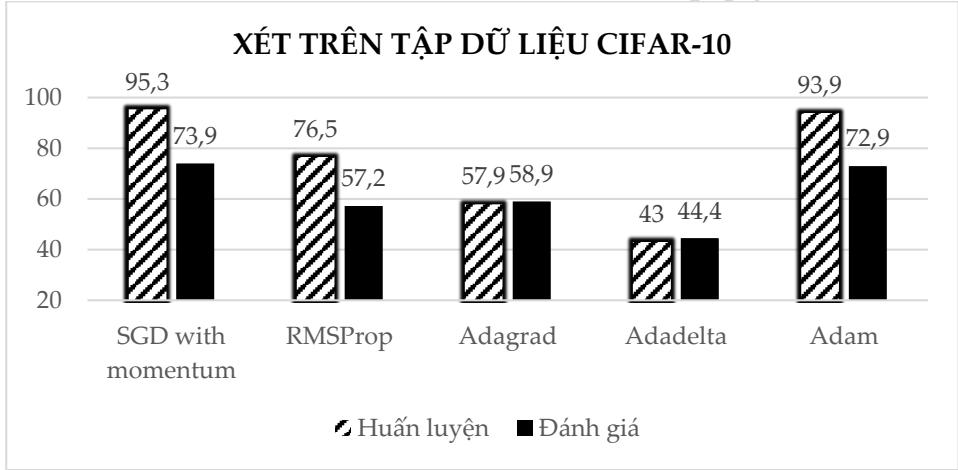

# Mở đầu

Để huấn luyện một mô hình mạng nơ-ron, chúng ta cần dựa trên giá trị hàm mất mát để biết được sự khác biệt giữa các dự đoán của mô hình đưa ra và nhãn mà chúng ta muốn dự đoán. Giá trị hàm mất mát càng bé có nghĩa là mô hình học đưa ra càng chính xác. Với mục tiêu hạ thấp giá trị của hàm mất mát, việc sử dụng các thuật toán tối ưu tập hợp các tham số và siêu tham số (parameter và hyper parameter) là một thành phần cốt lõi giúp cải thiện kết quả nhận dạng.

Trong bài báo này, chúng tôi thực hiện khảo sát các thuật toán tối ưu hiện đang nhận được nhiều sự quan tâm như SGD, RMS Prop, AdaGrad, AdaDelta và Adam. Mỗi thuật toán sẽ có những đặc điểm kĩ thuật riêng, và sẽ được đánh giá khảo sát dựa trên nhiệm vụ nhận dạng/phân loại hình ảnh. Tập dữ liệu được sử dụng trong nghiên cứu này là MNIST và CIFAR-10, hai tập cơ sở dữ liệu được sử dụng phổ biến cho nhiều nghiên cứu khác trên thế giới.

# Mạng nơ-ron tích chập và thuật toán tối ưu

Để đọc giả có thể tiếp cận được vấn đề một cách tổng quan và dễ dàng, trong nội dung phần này chúng tôi chọn trình bày những nội dung cơ bản nhất về mạng nơ-ron tích chập cũng như sơ lược về thuật toán tối ưu. Đây là những nội dung cốt lõi của nghiên cứu này.

## Mạng nơ-ron tích chập

Đối với mạng đa lớp Perceptron (Multi-layer Perceptron – MLP) truyền thống, mỗi nơ-ron trong lớp phía trước sẽ kết nối đến tất cả các nơ- ron ở lớp phía sau, khi tăng độ sâu của mô hình sẽ khiến khối lượng tính toán trong mạng tăng mạnh.

Sự ra đời của mạng CNN đã giúp giải quyết vấn đề trên dựa trên 3 ý tưởng cơ bản: vùng tiếp nhận cục bộ, tập trọng số chia sẻ và phương pháp lấy mẫu xuống. Nhìn chung, cấu trúc của CNN gồm một số lớp cơ bản sau:

# Hình 2.1. Mô hình một mạng CNN đơn giản.

## Lớp tích chập (Convolutional layer)

Lớp tích chập là một thành phần cốt lõi của mạng nơ-ron tích chập (CNN), sử dụng để trích xuất các thông tin đặc tính của hình ảnh (feature map). Kết quả đầu ra nhận được là các đặc tính của ảnh, tương ứng với bộ lọc đã sử dụng, với càng nhiều bộ lọc được sử dụng, sẽ thu được càng nhiều thông tin của ảnh tương ứng. Bên cạnh đó, việc sử dụng lớp tích chập sẽ có nhiều ưu điểm so với mạng nơ-ron truyền thống MLP, đặc biệt khi dữ liệu là hình ảnh. Một số ưu điểm có thể nổi trội so với mô hình trước đây có thể kể đến: Trích xuất thông tin theo phân vùng không gian hay hạn chế số lượng tham số và khối lượng tính toán khi tăng chiều sâu cho mô hình.

## Lớp lấy mẫu xuống (Pooling/Subsampling layer)

Lớp lấy mẫu xuống có tác dụng giảm kích thước của dữ liệu hình ảnh từ đó giúp cho mạng có thể học được các thông tin có tính chất khái quát hơn, đây cũng chính là phương pháp mà trung khu thần kinh thị giác của con người hoạt động. Đồng thời quá trình này giảm số lượng các thông số trong mạng. Các phương pháp lấy mẫu xuống thường được sử dụng là Max Pooling và Average Pooling.

## Lớp kết nối đầy đủ (Fully-connected layer - FC)

Đầu vào của lớp kết nối đầy đủ là đầu ra từ lớp lấy mẫu xuống hoặc lớp tích chập cuối cùng, nó được làm phẳng và sau đó được đưa vào lớp kết nối đầy đủ để chuyển tiếp. Lớp FC có nhiệm vụ tổng hợp thông tin đưa ra lớp quyết định (output) cho ra kết quả đánh giá.

# Thuật toán tối ưu

Về cơ bản, trong việc tối ưu hóa thiết kế, mục tiêu thiết kế hướng tới có thể chỉ là giảm thiểu chi phí sử dụng hoặc tối đa hóa hiệu quả nhận được. Để thực hiện điều này, thuật toán tối ưu hóa là một khâu không thể thiếu, đây một quy trình được thực hiện lặp đi lặp lại bằng cách so sánh các giải pháp khác nhau cho đến khi tìm thấy một giải pháp tối ưu hoặc thỏa đáng.

Đối với kỹ thuật học sâu nói riêng, thuật toán tối ưu là các kỹ thuật giúp xây dựng các mô hình mạng nơ-ron để tối ưu hóa độ chính xác của mô hình mạng [1]. Với mục tiêu là “học” được các đặc tính từ dữ liệu đầu vào, từ đó có thể tìm một tập các trọng số (weights - w) và ngưỡng (bias - $b$ ) phù hợp hơn.

## Vai trò của thuật toán tối ưu

Trong thuật toán học máy nói chung và kĩ thuật học sâu nói riêng, thuật toán tối ưu hóa là một khâu quan trọng không thể thiếu. Quá trình tối ưu hóa thực hiện xác định hàm mất mát (loss function) và sau đó tối thiểu hóa hàm trên bằng cách sử dụng hàm tối ưu. Cụ thể, thông qua việc cập nhật các tham số của mô hình $( w , b )$ và đánh giá lại hàm mất mát với một tỉ lệ học (learning rate) xác định, quá trình tối ưu giúp mô hình tương thích tốt hơn với tập dữ liệu được đào tạo.

## Hàm mất mát (Loss function)

Hàm mất mát là một phương pháp đánh giá độ hiệu quả của thuật toán “học” cho mô hình trên tập dữ liệu được sử dụng. Hàm mất mát trả về một số thực không âm thể hiện sự chênh lệch giữa hai đại lượng: a, nhãn được dự đoán và y, nhãn đúng. Hàm mất mát, bản thân chính là một cơ chế thưởng-phạt, mô hình sẽ phải đóng phạt mỗi lần dự đoán sai và mức phạt tỉ lệ thuận với độ lớn sai sót. Trong mọi bài toán học có giám sát, mục tiêu luôn bao $\mathrm { g } \dot { \hat { \mathrm { o } } } \mathrm { m }$ giảm tổng mức phạt phải đóng. Trong trường hợp lý tưởng a = y, loss function sẽ trả về giá trị cực tiểu bằng 0 [2]. Hai hàm mất mát thường xuyên được sử dụng trong mạng nơ-ron: MSE (Mean Squared Error) và Cross Entropy.

## Tỉ lệ học (Learning rate)

Learning rate hay tỉ lệ học là một thông số quan trọng trong việc quyết định tốc độ học của mạng nơ-ron. Tốc độ học được thể hiện bằng sự thay đổi giá trị cập nhật trọng số (w) trong các chu kỳ học. Tùy theo mục đích của mô hình mà tăng/giảm tỉ lệ học. Tỉ lệ học càng cao thì giúp mô hình học khá nhanh và tiết kiệm được thời gian huấn luyện, tuy nhiên việc tỉ lệ học lớn đồng nghĩa với việc sự thay đổi trọng số $( w )$ và tham số ngưỡng - bias $( b )$ càng lớn, mô hình không ổn định, một số chu kỳ học có sự dao động mạnh ở tỉ lệ nhận dạng đúng hay nói cách khác là thuật toán không được tối ưu và ngược lại đối với tỉ lệ học nhỏ.

# Một số thuật toán tối ưu

Trong phạm vi bài báo một số thuật toán tối ưu hóa sẽ được đánh giá khảo sát gồm: Gradient Descent [3], SGD với động lượng [4], RMSProp [5], Adagrad [6], Adadelta [7], Adam [6]. Việc đánh giá được thực hiện dựa trên tiêu chí giá trị hàm mất mát và tỉ lệ nhận dạng đúng hình ảnh dựa trên hai tập Train và Test data. Dựa trên các kết quả đó có thể đánh giá tác động của thuật toán tối ưu đến mô hình mạng ứng dụng vào bài toán nhận dạng hình ảnh.

## Gradient Descent

Gradient Descent (GD) là thuật toán tìm tối ưu chung cho các hàm số. $\acute { \mathrm { Y } }$ tưởng chung của GD là điều chỉnh các tham số để lặp đi lặp lại thông qua $\mathrm { m } \tilde { \hat { \mathrm { m } } } \mathrm { i }$ dữ liệu huấn luyện để giảm thiểu hàm chi phí.

$$
w ^ { ( k + 1 ) } = w ^ { ( k ) } - \eta \nabla _ { w } J ( w ^ { ( k ) } )
$$

Với $w ^ { ( k ) }$ là tham $\mathrm { s } \acute { \mathrm { o } }$ tại bước cập nhật tại lớp k, $\boldsymbol { \eta }$ là tỉ lệ học, $J ( w )$ là hàm lỗi, $\nabla _ { w } J ( w ^ { ( k ) } )$ : đạo hàm của hàm lỗi tại điểm $w ^ { ( k ) }$ .

## SGD với động lượng (SGD with momentum)

SGD với momentum là phương pháp giúp tăng tốc các vectơ độ dốc theo đúng hướng, và giúp hệ thống hội tụ nhanh hơn. Đây là một trong những thuật toán tối ưu hóa phổ biến nhất và nhiều mô hình hiện đại sử dụng nó để đào tạo. Mô tả như sau:

$$
v _ { j }  \alpha * v _ { j } - \eta * \nabla _ { W } \sum _ { 1 } ^ { m } L _ { m } ( w )
$$

$$
w _ { j }  v _ { j } + w _ { j }
$$

Phương trình (3.2) có hai phần. Thuật ngữ đầu tiên là độ dốc $\mathbf { v } _ { \mathrm { j } }$ được giữ lại từ các lần lặp trước. Hệ số động lượng $\alpha$ là tỉ lệ phần trăm của độ dốc được giữ lại mỗi lần lặp. L là hàm mất mát, $\boldsymbol { \mathsf { \Pi } } \boldsymbol { \mathsf { \Pi } }$ là tỉ lệ học.

## RMSProp (Root Mean Square Propogation)

RMSProp sử dụng trung bình bình phương của gradient để chuẩn hóa gradient. Có tác dụng cân bằng kích thước bước - giảm bước cho độ dốc lớn để tránh hiện tượng phát nổ độ dốc (Exploding Gradient), và tăng bước cho độ dốc nhỏ để tránh biến mất độ dốc (Vanishing Gradient). RMSProp tự động điều chỉnh tốc độ học tập, và chọn một tỉ lệ học tập khác nhau cho mỗi tham số. Phương pháp cập nhật các trọng số được thực hiện như mô tả:

$$
\begin{array} { l } { \displaystyle { s _ { t } = \rho s _ { t - 1 } + ( 1 - \rho ) * g _ { t } ^ { 2 } } } \\ { \displaystyle { \quad \varDelta x _ { t } = - \frac { \eta } { \sqrt { s _ { t } + \epsilon } } * g _ { t } } } \end{array}
$$

$$
x _ { t + 1 } = x _ { t } + \varDelta x _ { t }
$$

$\ldots ( \mathrm { N } \dot { \mathrm { o i } }$ $s _ { t }$ : tích luỹ phương sai của các gradient trong quá khứ, $\rho$ : tham số suy giảm, $\varDelta x _ { t }$ : sự thay đổi các tham số trong mô hình, $g _ { t }$ : gradient của các tham số tại vòng lặp t, ϵ: tham số đảm bảo kết quả xấp xỉ có ý nghĩa.

## Adagrad

Adagrad là một kỹ thuật học máy tiên tiến, thực hiện giảm dần độ dốc bằng cách thay đổi tốc độ học tập. Adagrad được cải thiện hơn bằng cách cho trọng số học tập chính xác dựa vào đầu vào trước nó để tự điều chỉnh tỉ lệ học theo hướng tối ưu nhất thay vì với một tỉ lệ học duy nhất cho tất cả các nút.

$$
w _ { t + 1 } = w _ { t } - \frac { \eta } { \sqrt { G _ { t } + \epsilon } } . g _ { t }
$$

Trong công thức (3.4), $\mathrm { G } _ { \mathrm { t } }$ là ma trận đường chéo chứa bình phương của đạo hàm vecto tham $\mathrm { s } \acute { \mathrm { o } }$ tại vòng lặp t; $\mathbf { g } _ { \mathrm { t } }$ là vectơ của độ dốc cho vị trí hiện tại và $\boldsymbol { \eta }$ là tỉ ${ \bf l } \hat { \bf e }$ học.

## Adadelta

Adadelta là một biến thể khác của AdaGrad. Adadelta không có tham số tỉ lệ học. Thay vào đó, nó sử dụng tốc độ thay đổi của chính các tham số để điều chỉnh tỉ lệ học nghĩa là bằng cách giới hạn cửa sổ của gradient tích lũy trong quá khứ ở một số kích thước cố định của trọng số w.

$$
g _ { t } ^ { \prime } = \sqrt { \frac { \varDelta x _ { t - 1 } + \epsilon } { s _ { t } + \epsilon } } . g _ { t }
$$

$$
x _ { t } = x _ { t - 1 } - g _ { t } ^ { \prime }
$$

$$
\varDelta x _ { t } = \rho \varDelta x _ { t - 1 } + ( 1 - \rho ) \mathscr { x } _ { t } ^ { 2 }
$$

Từ công thức (3.5), Adadelta sử dụng 2 biến trạng thái: $s _ { t }$ để lưu trữ trung bình của khoảng thời gian thứ hai của gradient và $\Delta x _ { t }$ để lưu trữ trung bình của khoảng thời gian thứ 2 của sự thay đổi các tham số trong mô hình. $g _ { t } ^ { \prime }$ : căn bậc hai thương của trung bình tốc độ thay đổi bình phương và trung bình mô-men bậc hai của gradient.

## Adam

Adam được xem như là sự kết hợp của RMSprop và Stochastic Gradient Descent với động lượng. Adam là một phương pháp tỉ lệ học thích ứng, nó tính toán tỉ lệ học tập cá nhân cho các tham số khác nhau. Adam sử dụng ước tính của khoảng thời gian thứ nhất và thứ hai của độ dốc để điều chỉnh tỉ lệ học cho từng trọng số của mạng nơ-ron. Tuy nhiên, qua nghiên cứu thực nghiệm, trong một số trường hợp, Adam vẫn còn gặp phải nhiều thiếu sót so với thuật toán SGD. Thuật toán Adam được mô tả:

$$
\begin{array} { r } { m _ { t } = \beta _ { 1 } m _ { t - 1 } + ( 1 - \beta _ { 1 } ) g _ { t } } \\ { v _ { t } = \beta _ { 2 } v _ { t - 1 } + ( 1 - \beta _ { 2 } ) g _ { t } ^ { 2 } } \end{array}
$$

Trong công thức (3.6), $\mathbf { v _ { t } }$ là trung bình động của bình phương và $\mathrm { m } _ { \mathrm { t } }$ là trung bình động của gradient; $\beta _ { 1 } \mathrm { v } \dot { \mathrm { a } } \beta _ { 2 }$ là tốc độ của di chuyển.

# Đánh giá kết quả với các thuật toán tối ưu

## Cơ sở dữ liệu

Để thực hiện khảo sát và đánh giá các thuật toán tối ưu với bài toán phân loại hình ảnh, nhóm nghiên cứu đề xuất hai tập cơ sở dữ liệu phổ biến cho mục đích nghiên cứu là MNIST và CIFAR-10 để thực hiện quá trình đào tạo và thực nghiệm.

### MNIST

Bộ dữ liệu MNIST là bộ dữ liệu gồm các hình ảnh xám (grayscale picture) các chữ số viết tay được chia sẻ bởi Yann Lecun bao $\mathrm { g \dot { o } m 7 0 0 0 0 }$ ảnh chữ số viết tay được chia thành 2 tập: tập huấn luyện $\mathrm { g \dot { o } m \widetilde { \ o } 0 0 0 0 }$ ảnh và tập kiểm tra 10000 ảnh. Các chữ số viết tay ở tập MNIST được chia thành 10 nhóm tương ứng với các chữ số từ 0 đến 9. Tất cả hình ảnh trong tập MNIST đều được chuẩn hóa với kích thước $2 8 \times 2 8$ điểm ảnh. Dưới đây là một số hình ảnh được trích xuất từ bộ dữ liệu.

  
Hình 4.1. Hình ảnh chữ số viết tay từ tập MNIST [8].

### CIFAR-10

Bộ cơ sở dữ liệu CIFAR10 là bộ dữ liệu chứa các ảnh màu có kích thước $3 2 \times 3 2 \times 3$ (3 lớp màu RGB) trong 10 nhóm khác nhau, gồm: máy bay, ô tô, chim, mèo, hươu, chó, ếch, ngựa, tàu và xe tải. Mỗi nhóm gồm 6000 hình ảnh, cùng với sự đa dạng về các thành phần như độ sáng, vị trí, hướng của các đối tượng. Nó là một trong những bộ dữ liệu được sử dụng rộng rãi nhất cho nghiên cứu máy học bao $\mathrm { g \dot { o } m \bar { 6 } 0 0 0 0 }$ ảnh được chia thành 2 tập: tập huấn luyện gồm 50000 ảnh và tập kiểm tra 10000 ảnh.

## Mô hình và phương pháp đánh giá

Ở đây, nhóm nghiên cứu đề xuất sử dụng mô hình CNN với cấu trúc:

Input → Convolution2D → Maxpooling → Dropout → Convolution2D Maxpooling Dropout Flatten Dense Output.

Quá trình huấn luyện và đánh giá với chu kì học là 50 và tỉ lệ học của từng thuật toán được sử dụng theo khuyến nghị của Google Colab, cụ thể tỉ lệ học ứng với các thuật toán SGD với động lượng, RMSProp, Adagrad, Adadelta, Adam lần lượt là 0.01, 0.001, 0.01, 1.0, 0.001. Phương pháp thực hiện đánh giá kết quả sử dụng trong bài là loss function và tỉ lệ nhận dạng đúng trên các tập dữ liệu được xét.

  
Hình 5.2. Một số hình ảnh từ bộ cơ sở dữ liệu CIFAR-10 [9].

## Kết quả với bộ cơ sở dữ liệu MNIST

Dánh giá các thuat toán tói ru vói bo dir lieu MNIsT

Hình 5.3 Tỉ lệ mất mát của các thuật toán tối ưu trên tập dữ liệu MNIST.   

Hình $5 . 3 ~ \mathrm { m } \hat { \mathrm { { o } } }$ tả kết quả của loss function của các thuật toán, xét trên tập dữ liệu MNIST. Ở đây, sau 50 chu kì học kết quả gần như không thay đổi nên chúng tôi chỉ xét ở 30 chu kì học đầu để có cách nhìn cụ thể hơn về sự biến thiên của hàm mất mát.

Từ đồ thị, có thể nhận thấy rằng, Adam và RMSProp là 2 thuật toán có biên độ dao động thấp nhất, gần như không thay đổi quá nhiều quanh giá trị 0.5. Trong khi đó, AdaDelta và AdaGrad là hai thuật toán có sự biến động lớn nhất trong suốt các chu kì học. Bên cạnh đó, nhận thấy rằng thuật toán SGD với động lượng là thuật toán có kết quả hội tụ nhanh nhất và tốt nhất là với tỉ lệ mất mát rơi vào khoảng 0.023. Các thuật toán Adam, RMSProp và Adagrad cũng có kết quả rất tốt lần lượt là 0.06, 0.067, 0.059, thuật toán Adelta có kết quả cao nhất trong các thuật toán đang xét với tỉ lệ mất mát 0.229.

Để có cách nhìn tổng thể hơn, tỉ lệ nhận dạng đúng của mô hình với các thuật toán khác nhau cũng được mô tả ở mô hình 5.4.

  
Hình 4.4 Tỉ lệ nhận dạng đúng của các thuật toán trên tập huấn luyện và tập đánh giá.

Từ hình 5.4, có thể thấy rằng tỉ lệ nhận dạng đúng của mô hình chịu sự ảnh hưởng từ các thuật toán tối ưu. Cụ thể, đối với thuật toán cho tỉ lệ mất mát cao như Adadelta hay Adagrad, tỉ lệ nhận dạng đúng khá thấp, rơi vào khoảng $9 3 . 4 \%$ trên tập đánh giá (Adadelta). Trong khi đó, các thuật toán cho tỉ lệ mất mát thấp như SGD with momentum, RMSProp và Adam cho tỉ lệ nhận dạng đúng khả quan hơn, đạt khoảng $9 9 . 2 \%$ , khi sử dụng trên cùng một mô hình kiến trúc mạng đề ra.

## Kết quả với bộ cơ sở dữ liệu CIFAR10

Để có thể đánh giá chính xác hơn về vai trò của các thuật toán, nhóm thực hiện khảo sát trên tập dữ liệu CIFAR-10, $\mathrm { c o } \ \mathrm { d } \hat { \mathbf { \mathrm { 0 } } }$ phức tạp cao hơn so với MNIST. Tương tự với bộ cơ sở dữ liệu MNIST, hình 4.6 đưa ra kết quả khảo sát từng thuật toán riêng biệt trên cùng một mô hình mạng và tập dữ liệu xét sau 50 chu kì học.

Từ đồ thị hình 5.4, nhận thấy rằng, xu hướng hội tụ của thuật toán Adadelta và Adagrad khá tốt, tuy nhiên, tỉ lệ mất mát lại khá cao, xấp xỉ 1.2 với Adagrad và 1.6 với Adadelta sau khoảng chu kì học được xét. SGD with momentum là thuật toán có kết quả khả quan hơn cả, độ hội tụ khá ổn định, giá trị thấp, đạt đỉnh 0.8 tại chu kì học 20. Tiếp đến là thuật toán Adam, tuy nhiên, nhận thấy rằng thuật toán Adam có xu hướng tăng tỉ lệ mất mát khi qua khỏi 10 chu kì học. RMSProp là thuật toán có sự dao động lớn nhất về tỉ lệ mất mát qua các chu kì học trong các thuật toán được khảo sát.

  
Hình 5.4 Tỉ lệ mất mát của các thuật toán tối ưu trên tập dữ liệu CIFAR10.

Hình 5.5 cho thấy, tỉ lệ nhận dạng đúng của 2 thuật toán Adagrad và Adadelta không cao so với các thuật toán còn lại. Tuy nhiên ưu điểm là giảm được hiện tượng overfitting - hiện tượng kết quả trên tập dữ liệu huấn luyện rất cao trong khi thử nghiệm mô hình trên tập dữ liệu kiểm tra cho kết quả thấp.

  
Hình 5.5 Tỉ lệ nhận dạng đúng của các thuật toán trên tập huấn luyện và tập đánh giá.

Tổng quát ta cũng có thể thấy rằng với thuật toán cho tỉ lệ mất mát cao và các thuật toán cho tỉ lệ mất mát thấp sẽ ảnh hưởng đến tỉ lệ nhận dạng đúng của mô hình, SGD with momentum và Adam là hai thuật toán có kết quả khá hứa hẹn. Cụ thể tỉ lệ nhận dạng đúng khi sử dụng các thuật toán tối ưu SGD với động lượng, RMSProp, Adagrad, Adadelta, Adam lần lượt là $7 3 . 9 \%$ , $5 7 . 3 \%$ , $5 8 . 9 \%$ , $4 4 . 5 \%$ , $7 2 . 9 \%$ .

# Kết luận

Tổng quát, kết quả từ nghiên cứu trên đã đánh giá được sự tác động của thuật toán tối ưu đến việc phân loại đúng kết quả trong bài toán nhận dạng hình ảnh. Nghiên cứu cũng cung cấp thêm hiểu biết về thuật toán tối ưu, thông qua các kết quả từ thực nghiệm đánh giá, từ đó giúp chúng ta có sự lựa chọn các thuật toán thật hợp lí trong việc xây dựng và huấn luyện, đánh giá mô hình mạng. Trong phạm vi bài báo, chúng tôi chỉ so sánh các thuật toán phổ biến và trong thực tế còn rất nhiều các thuật toán tối ưu khác. Kết quả trên chỉ so sánh và xác định ra thuật toán tối ưu nhất trong phạm vi các thuật toán được xét, đối với bộ cơ sở dữ liệu CIFAR-10 và MNIST. Một số thành phần khác như kiến trúc, các tham số, siêu tham số và các tập dữ liệu khác chúng tôi sẽ thực hiện phân tích và đánh giá ở các nghiên cứu sau.

# TÀI LIỆU THAM KHẢO

[1]. Léon Bottou, Frank E. Curtis, Jorge Nocedal (2016). Optimization Methods for Large-Scale Machine Learning, arXiv:1606.04838

[2]. Jonathan T. Barron (2017). A General and Adaptive Robust Loss Function, arXiv:1701.03077, Cornell University

[3]. Qian, N. (1999). On the momentum term in gradient descent learning algorithms. Neural Networks: The Official Journal of the International Neural Network Society, 12(1), 145–151. http://doi.org/10.1016/S0893- 6080(98)00116-6

[4]. Sutskever, I., Martens, J., Dahl, G.E. and Hinton, G.E. (2013). On the importance of initialization and momentum in deep learning. ICML (3), Vol 28, pp. 1139—1147

[5]. Christian Igel and Michael H ̈usken (2000). Improving the RMSprop Learning Algorithm. http://citeseerx.ist.psu.edu/viewdoc/summary?doi $\equiv$ 10.1.1.17.1332

[6]. Alexandre Défossez, Léon Bottou, Francis Bach, Nicolas Usunier (2020). On the Convergence of Adam and Adagrad, arXiv:2003.02395 [7]. Matthew D. Zeiler (2012), Adadelta: An Adaptive Learning Rate Method, arXiv:1212.5701v1 [cs.LG] 22 Dec 2012

[8]. Yann LeCun, Courant Institute (1989). The MNIST Database of Handwritten Digits.

[9]. Alex Krizhevsky, Vinod Nair and Geoffrey Hinton (2009). The CIFAR-10 dataset