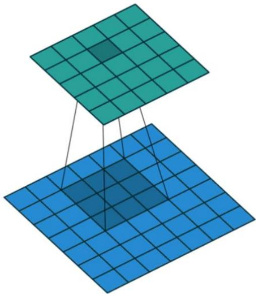
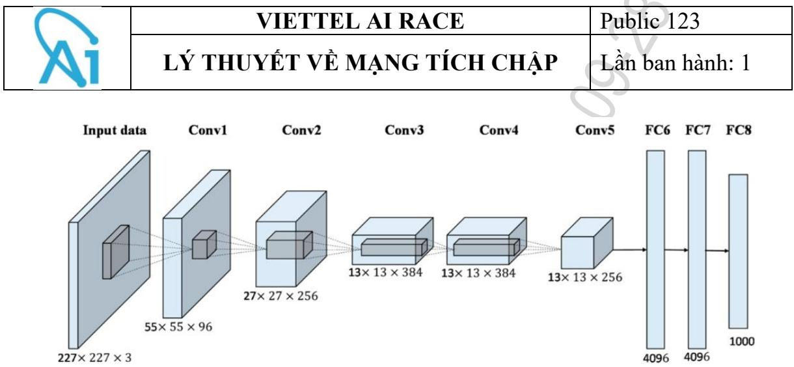
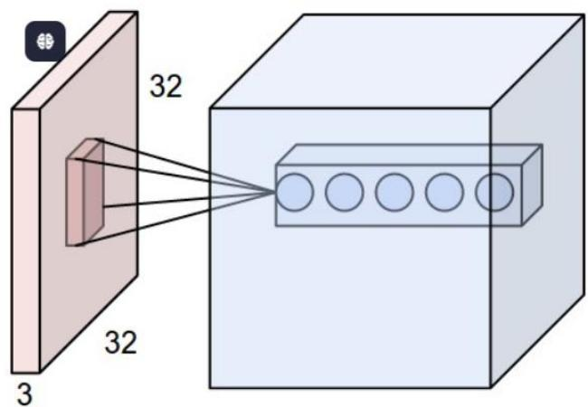

# Giới thiệu tích chập

Tích chập là một khái niệm trong xử lý tín hiệu số nhằm biến đổi thông tin đầu vào thông qua một phép tích chập với bộ lọc để trả về đầu ra là một tín hiệu mới. Tín hiệu này sẽ làm giảm những đặc trưng mà bộ lọc không quan tâm và chỉ giữ những đặc trưng chính.

Tích chập thông dụng nhất là tích chập 2 chiều được áp dụng trên ma trận đầu vào và ma trận bộ lọc 2 chiều. Phép tích chập của một ma trận $\dot { \mathbf { X } } \in \mathbb { R } ^ { W _ { 1 } \times \check { H } _ { 1 } }$ với một bộ lọc (receptive field) $\mathbf { F } \in \mathbb { R } ^ { F \times F }$ là một ma trận $\mathbf { Y } \in \mathbb { R } ^ { W _ { 2 } \times H _ { 2 } }$

Trong một mạng nơ ron tích chập, các tầng (layer) liền sau lấy đầu vào từ tầng liền trước nó. Do đó để hạn chế lỗi trong thiết $\mathrm { k } \acute { \mathrm { e } }$ mạng nơ ron chúng ta cần xác định kích thước đầu ra ở mỗi tầng. Điều đó có nghĩa là dựa vào kích thước ma trận đầu vào (W1, H1), kích thước bộ lọc (F,F) và bước nhảy S để xác định kích thước ma trận đầu ra (W2, H2)   
Xét quá trình trượt trên chiều W1 của ma trận đầu vào.

Hình 1: Quá trình trượt theo chiều rộng w1. Mỗi dòng tương ứng với một bước. Mỗi bước chúng ta dịch sang phải một khoảng s đơn vị cho tới khi đi hết w1 ô. Nếu bước cuối cùng bị dư thì chúng ta sẽ lát (padding) thêm để mở rộng ma trận sao cho quá trình tích chập không bị dư ô.

Giả sử quá trình này sẽ dừng sau w2 bước. Tại bước đầu tiên ta đi được đến vị trí thứ F . Sau mỗi bước liền sau sẽ tăng so với vị trí liền trước là S. Như vậy đến bước thứ i quá trình trượt sẽ đi đến vị trí $\mathrm { F } + ( \mathrm { i } { - } 1 ) \mathrm { S }$ . Suy ra tại bước cuối cùng w2 ma trận sẽ đi đến vị trí $\mathrm { F } + ( \mathrm { W } 2 \mathrm { - } 1 ) \mathrm { S }$ . Đây là vị trí lớn nhất gần với vị trí cuối cùng là w1 . Trong trường hợp lý tưởng thì $\mathrm { F } + ( \mathrm { W } 2 $ - 1)S. Từ đó ta suy ra:

$$
W _ { 2 } = \frac { W _ { 1 } - F } { S } + 1
$$

Khi vị trí cuối cùng không trùng với w1 thì số bước w2 sẽ được lấy phần nguyên:

$$
W _ { 2 } = \qquad \frac { W _ { 1 } - F } { S } + 1
$$

Chúng ta luôn có thể tạo ra đẳng thức (1) nhờ thêm phần đường viền (padding) tại các cạnh của ảnh với độ rộng viền là P sao cho phép chia cho S là chia hết. Khi đó:

$$
W _ { 2 } = \frac { W _ { 1 } + 2 P - F } { S } + 1
$$

Hình 2: Thêm padding kích thước P vào $2 1 { \dot { \hat { \mathbf { e } } } }$ chiều rộng (W1) Hoàn toàn tương tự ta cũng có công thức ứng với chiều cao:

$$
H _ { 2 } = \frac { H _ { 1 } + 2 P - F } { S } + 1
$$

# Mạng nơ ron tích chập (mạng CNN)

## Các Thuật ngữ

Do bài này khá nhiều thuật ngữ chuyên biệt trong mạng CNN nên để dễ hiểu hơn cho bạn đọc tôi sẽ diễn giải trước khái niệm.

- Đơn vị (Unit): Là giá trị của một điểm nằm trên ma trận khối ở mỗi tầng của mạng CNN.

- Vùng nhận thức (Receptive Field): Là một vùng ảnh trên khối ma trận đầu vào mà bộ lọc sẽ nhân tích chập để ánh xạ tới một đơn vị trên layer tiếp theo.

- Vùng địa phương (Local region): Theo một nghĩa nào đó sẽ bao hàm cả vùng nhận thức. Là một vùng ảnh cụ thể nằm trên khối ma trận ở các tầng (layer) của mạng CNN.

- Bản đồ đặc trưng (Feature Map): Là ma trận đầu ra khi áp dụng phép tích chập giữa bộ lọc với các vùng nhận thức theo phương di chuyển từ trái qua phải và từ trên xuống dưới.

Bản đồ kích hoạt (Activation Map): Là output của bản đồ đặc trưng CNN khi áp dụng thêm hàm activation để tạo tính phi tuyến.

## Kiến trúc chung của mạng neural tích chập

Tích chập được ứng dụng phổ biến trong lĩnh vực thị giác máy tính. Thông qua các phép tích chập, các đặc trưng chính từ ảnh được trích xuất và truyền vào các tầng tích chập (layer convolution). Mỗi một tầng tích chập sẽ bao gồm nhiều đơn vị mà kết quả ở mỗi đơn vị là một phép biến đổi tích chập từ layer trước đó thông qua phép nhân tích chập với bộ lọc.

Về cơ bản thiết $\mathrm { k } \acute { \mathrm { e } }$ của một mạng nơ ron tích chập 2 chiều có dạng như sau:

INPUT $_ - >$ [[CONV $_ - >$ RELU]\*N $_ - >$ POOL?]\*M $_ - >$ [FC $_ - >$ RELU]\*K ->FC

Trong đó:

• INPUT: Tầng đầu vào   
• CONV: Tầng tích chập   
• RELU: Tầng kích hoạt. Thông qua hàm kích hoạt (activation function), thường là ReLU hoặc LeakyReLU để kích hoạt phi tuyến POOL: Tầng tổng hợp, thông thường là Max pooling hoặc có thể là Average pooling dùng để giảm chiều của ma trận đầu vào. FC: Tầng kết nối hoàn toàn. Thông thường tầng này nằm ở sau cùng và kết nối với các đơn vị đại diện cho nhóm phân loại.

Các kí hiệu []N, []M hoặc []\*K ám chỉ các khối bên trong [] có thể lặp lại nhiều lần liên tiếp nhau. M, K là số lần lặp lại. Kí hiệu $\mathrm { . > }$ đại diện cho các tầng liền kề nhau mà tầng đứng trước sẽ làm đầu vào cho tầng đứng sau. Dấu ? sau POOL để thể hiện tầng POOL có thể có hoặc không sau các khối tích chập.

Như vậy ta có thể thấy một mạng nơ ron tích chập về cơ bản có 3 quá trình khác nhau:

Quá trình tích chập (convolution): Thông qua các tích chập giữa ma trận đầu vào với bộ lọc để tạo thành các đơn vị trong một tầng mới. Quá trình này có thể diễn ra liên tục ở phần đầu của mạng và thường sử dụng kèm với hàm kích hoạt ReLU. Mục tiêu của tầng này là trích suất đặc trưng hai chiều.

Quá trình tổng hợp (max pooling): Các tầng càng về sau khi trích xuất đặc trưng sẽ cần số lượng tham số lớn do chiều sâu được qui định bởi số lượng các kênh ở các tầng sau thường tăng tiến theo cấp số nhân. Điều đó làm tăng số lượng tham số và khối lượng tính toán trong mạng nơ ron. Do đó để giảm tải tính toán chúng ta sẽ cần giảm kích thước các chiều của khối ma trận đầu vào hoặc giảm số đơn vị của tầng. Vì mỗi một đơn vị sẽ là kết quả đại diện của việc áp dụng 1 bộ lọc để tìm ra một đặc trưng cụ thể nên việc giảm số đơn vị sẽ không khả thi. Giảm kích thước khối ma trận đầu vào thông qua việc tìm ra 1 giá trị đại diện cho mỗi một vùng không gian mà bộ lọc đi qua sẽ không làm thay đổi các đường nét chính của bức ảnh nhưng lại giảm được kích thước của ảnh. Do đó quá trình giảm chiều ma trận được áp dụng. Quá trình này gọi là tổng hợp nhằm mục đích giảm kích thước dài, rộng.

Quá trình kết nối hoàn toàn (fully connected): Sau khi đã giảm kích thước đến một mức độ hợp lý, ma trận cần được trải phẳng (flatten) thành một vector và sử dụng các kết nối hoàn toàn giữa các tầng. Quá trình này sẽ diễn ra cuối mạng CNN và sử dụng hàm kích hoạt là ReLU. Tầng kết nối hoàn toàn cuối cùng (fully connected layer) sẽ có số lượng đơn vị bằng với số classes và áp dụng hàm kích hoạt là softmax nhằm mục đích tính phân phối xác xuất.

# Tính chất của mạng nơ ron tích chập

Tính kết nối trượt: Khác với các mạng nơ ron thông thường, mạng nơ ron tích chập không kết nối tới toàn bộ hình ảnh mà chỉ kết nối tới từng vùng địa phương (local region) hoặc vùng nhận thức (receptive field) có kích thước bằng kích thước bộ lọc của hình ảnh đó. Các bộ lọc sẽ trượt theo chiều của ảnh từ trái qua phải và từ trên xuống dưới đồng thời tính toán các giá trị tích chập và điền vào bản đồ kích hoạt (activation map) hoặc bản đồ đặc trưng (feature map).

  
Hinh5:Quátrintrtvatin tichchpcamt blokichtuocxtrnnkétitibnichhoat，Sourceub

Các khối nơ ron 3D: Không giống như những mạng nơ ron thông thường khi cấu trúc ở mỗi tầng là một ma trận 2D (batch size x số đơn vị ở mỗi tầng). Các kết quả ở mỗi tầng của một mạng nơ ron là một khối 3D được sắp xếp một cách hợp lý theo 3 chiều rộng (width), cao (height), sâu (depth). Trong đó các chiều rộng và cao được tính toán theo công thức tích chập mục 1.1. Giá trị chiều rộng và cao của một tầng phụ thuộc vào kích thước của bộ lọc, kích thước của tầng trước, kích thước mở rộng (padding) và bước trượt bộ lọc (stride). Tuy nhiên chiều sâu lại hoàn toàn không phụ thuộc vào những tham số này mà nó bằng với số bộ lọc trong tầng đó. Quá trình tính bản đồ kích hoạt dựa trên một bộ lọc sẽ tạo ra một ma trận 2D. Như vậy khi áp dụng cho d bộ lọc khác nhau, mỗi bộ lọc có tác dụng trích suất một dạng đặc trưng trên mạng nơ ron, ta sẽ thu được d ma trận 2D có cùng kích thước mà mỗi ma trận là một bản đồ đặc trưng. Khi sắp xếp chồng chất các ma trận này theo chiều sâu kết quả đầu ra là một khối nơ ron 3D. Thông thường đối với xử lý ảnh thì tầng đầu vào có depth $= 3$ (số kênh) nếu các bức ảnh đang để ở dạng màu gồm 3 kênh RBG. Bên dưới là một cấu trúc mạng nơ ron điển hình có dạng khối.

  
Hinh 6: Cáu trúc các khói no ron 3D mang Alexnet, Source: mdpi.com

Tính chia sẻ kết nối và kết nối cục bộ: Chúng ta đã biết quá trình biến đổi trong mạng tích chập sẽ kết nối các khối nơ ron 3D. Tuy nhiên các đơn vị sẽ không kết nối tới toàn bộ khối 3D trước đó theo chiều rộng và cao mà chúng sẽ chọn ra các vùng địa phương (hoặc vùng nhận thức) có kích thước bằng với bộ lọc. Các vùng địa phương sẽ được chia sẻ chung một bộ siêu tham số có tác dụng nhận thức đặc trưng của bộ lọc. Các kết nối cục bộ không chỉ diễn ra theo chiều rộng và cao mà kết nối sẽ mở rộng hoàn toàn theo chiều sâu. Như vậy số tham số trong một tầng sẽ là FxFxD ( F, D lần lượt là kích thước bộ lọc và chiều depth).

Mỗi bộ lọc sẽ có khả năng trích xuất một đặc trưng nào đó như đã giải thích ở mục 1. Do đó khi đi qua toàn bộ các vùng địa phương của khối nơ ron 3D, các đặc trưng được trích xuất sẽ hiển thị trên tầng mới.

  
Hinh 7: Két nói cuc bo, Source: cs231n-stanford

Tính tổng hợp: Ở các tầng tích chập gần cuối số tham số sẽ cực kì lớn do sự gia tăng của chiều sâu và thông thường sẽ theo cấp số nhân. Như vậy nếu không có một cơ chế kiểm soát sự gia tăng tham số, chi phí tính toán sẽ cực kì lớn và vượt quá khả năng của một số máy tính cấu hình yếu. Một cách tự nhiên là chúng ta sẽ giảm kích thước các chiều rộng và cao bằng kỹ 6 thuật giảm mẫu (down sampling) mà vẫn giữ nguyên được các đặc trưng của khối. Theo đó những bộ lọc được di chuyển trên bản đồ đặc trưng và tính trung bình (average pooling) hoặc giá trị lớn nhất (max pooling) của các phần tử trong vùng nhận thức. Trước đây các tính trung bình được áp dụng nhiều nhưng các mô hình hiện đại đã thay thế bằng giá trị lơn nhất do tốc độ tính max nhanh hơn so với trung bình.

  
Hinh 8: Quá trinh tong hop, Source: cs231n -stanford

Độ phức tạp phát hiện hình ảnh tăng dần: Ở tầng đầu tiên, hình ảnh mà chúng ta có chỉ là những giá trị pixels. Sau khi đi qua tầng thứ 2 máy tính sẽ nhận diện được các hình dạng cạnh, rìa và các đường nét đơn giản được gọi là đặc trưng bậc thấp (low level). Càng ở những tầng tích chập về sau càng có khả năng phát hiện các đường nét phức tạp, đã rõ ràng hình thù và thậm chí là cấu thành vật thể, đây được gọi là những đặc trưng bậc cao (high level). Máy tính sẽ học từ tầng cuối cùng để nhận diện nhãn của hình ảnh.