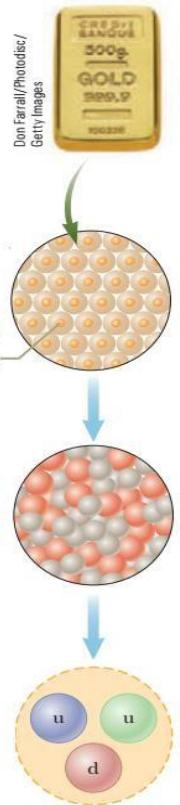

<table><tr><td rowspan="3">Ai</td><td>VIETTEL AI RACE</td><td>TD126</td></tr><tr><td>Vat ly và do lròng</td><td>Làn ban hành: 1</td></tr><tr><td></td><td></td></tr></table>

Cũng như các khoa học khác, vật lý là khoa học dựa trên các quan sát thực nghiệm và các phép đo định lượng. Mục tiêu chính của vật lý là xác định số lượng có hạn các định luật cơ bản chi phối các hiện tượng trong tự nhiên và sử dụng chúng để phát triển các lý thuyết có thể dự đoán được kết quả của các thí nghiệm trong tương lai.

Các định luật cơ bản này được diễn đạt bằng ngôn ngữ toán học, một công cụ để để gắn kết lý thuyết với thực nghiệm.

Mỗi khi có sự không nhất quán giữa tiên đoán của lý thuyết và kết quả thực nghiệm thì cần phải đưa ra một lý thuyết mới hoặc chỉnh sửa lý thuyết đã có để loại bỏ sự không nhất quán đó. Nếu một lý thuyết chỉ được thỏa mãn trong những điều kiện nhất định thì một lý thuyết tổng quát hơn sẽ có thể thỏa mãn được mà không cần các điều kiện này. Ví dụ như các định luật chuyển động được Newton (1642-1727) khám phá mô tả chính xác chuyển động của các vật có tốc độ bình thường nhưng lại không áp dụng được cho các vật chuyển động với tốc độ tương đương với tốc độ ánh sáng. Ngược lại, thuyết tương đối hẹp của Einstein (1879-1955) cho các kết quả giống với các định luật Newton đối với tốc độ nhỏ nhưng cũng mô tả chính xác chuyển động của các vật có tốc độ gần bằng tốc độ ánh sáng. Do đó, thuyết tương đối hẹp của Einstein là một thuyết về chuyển động tổng quát hơn so với thuyết được xây dựng từ các định luật Newton.

Vật lý học cổ điển bao gồm các nguyên lý của cơ học cổ điển, nhiệt động lực học, quang học và điện từ học đã được phát triển trước năm 1900. Newton là người đã có những đóng góp quan trọng cho vật lý học cổ điển, ông cũng là một trong những người khai sinh ra phép tính vi tích phân như là một công cụ toán học. Các phát triển chủ yếu của cơ học được tiếp diễn trong thế kỷ 18, nhưng ngành nhiệt động lực học và điện từ thì phải đến nửa sau của thế kỷ 19 mới được phát triển. Nguyên nhân chủ yếu là do các thiết bị thí nghiệm thời đó quá thô sơ hoặc thiếu thốn.

Cuộc cách mạng lớn của vật lý, có liên quan với vật lý hiện đại, bắt đầu vào gần cuối thế kỷ 19. Vật lý hiện đại được phát triển là do vật lý cổ điển không thể giải thích được nhiều hiện tượng vật lý. Hai sự phát triển quan trọng nhất trong kỷ nguyên hiện đại là thuyết tương đối và cơ học lượng tử. Thuyết tương đối hẹp của Einstein không những chỉ mô tả chính xác chuyển động của các vật có tốc độ tươndg đương với tốc độ ánh sáng mà còn hiệu chỉnh một cách trọn vẹn các khái niệm truyền thống về không gian, thời gian và năng lượng. Lý thuyết này còn chỉ ra rằng tốc độ ánh sáng là giới hạn trên của tốc độ của một vật và khối lượng và năng lượng có liên hệ với nhau. Cơ học lượng tử được hình thành bởi nhiều nhà khoa học khác nhau, mô tả các hiện tượng vật lý ở cấp độ nguyên tử. Nhiều thiết bị thực tiễn đã được chế tạo dựa vào các nguyên lý của cơ học lượng tử.

Các nhà khoa học làm việc không ngừng để cải thiện hiểu biết của chúng ta về các định luật cơ bản. Nhiều tiến bộ về công nghệ trong hiện tại như tàu vũ trụ không người lái, hàng loạt ứng dụng tiềm năng trong công nghệ na nô, vi mạch và máy tính siêu tốc, kỹ thuật chụp ảnh tinh xảo dùng trong nghiên cứu khoa học và y khoa cũng như nhiều kết quả đáng kể trong kỹ thuật gien là kết quả của những nỗ lực của nhiều nhà khoa học, kỹ sư, nhà kỹ thuật. Ảnh hưởng của những phát triển và khám phá này đến xã hội của chúng ta quả thực là to lớn và chắc chắn là các khám phá và phát triển trong tương lai cũng sẽ đầy hứng thú, thách thức và mang lại nhiều lợi ích cho nhân loại.

<table><tr><td rowspan=2 colspan=1>Ai</td><td rowspan=1 colspan=1>VIETTEL AI RACE</td><td rowspan=1 colspan=1>TD126</td></tr><tr><td rowspan=1 colspan=1>Vàt ly và do lròng</td><td rowspan=1 colspan=1>Làn ban hành: 1</td></tr></table>

# Các chuẩn độ dài, khối lượng và thời gian

Để mô tả các hiện tượng vật lý, ta cần phải đo lường nhiều khía cạnh khác nhau của tự nhiên. Mỗi phép đo tương ứng với một đại lượng vật lý, ví dụ như chiều dài của một vật. Các định luật vật lý được diễn đạt như là các mối quan hệ toán học giữa các đại lượng vật lý.

Trong cơ học, ba đại lượng cơ bản nhất là chiều dài, khối lượng và thời gian. Mọi đại lượng khác trong cơ học có thể được biểu diễn thông qua ba đại lượng này.

Do các quốc gia khác nhau sử dụng các chuẩn khác nhau nên cần phải có chuẩn chung cho các đại lượng. Cái được chọn làm chuẩn phải:

• có sẵn;   
• có một vài thuộc tính có thể đo lường được một cách tin cậy;   
• phải cho cùng một kết quả khi đo bởi bất kỳ ai và bất kỳ nơi nào; không thay đổi theo thời gian.

Vào năm 1960, một ủy ban quốc tế đã đưa ra một bộ các chuẩn cho các đại lượng cơ bản của khoa học. Nó được gọi là SI (Système International d’unités – Hệ đơn vị quốc tế). Bảng dưới đây là các đại lượng cơ bản nhất và đơn vị tương ứng.

<table><tr><td rowspan=1 colspan=1>Dai luong</td><td rowspan=1 colspan=1>Don vi trong SI</td></tr><tr><td rowspan=1 colspan=1>dò dài</td><td rowspan=1 colspan=1>mét (m),</td></tr><tr><td rowspan=1 colspan=1>khói luong</td><td rowspan=1 colspan=1>ki-10-gam (kg)</td></tr><tr><td rowspan=1 colspan=1>thòi gian</td><td rowspan=1 colspan=1>giày (s).</td></tr><tr><td rowspan=1 colspan=1>nhit d</td><td rowspan=1 colspan=1>Kelvin (K)</td></tr><tr><td rowspan=1 colspan=1>cuòng dò dòng dièn</td><td rowspan=1 colspan=1>Ampère (A)</td></tr><tr><td rowspan=1 colspan=1>cuòng dò sáng</td><td rowspan=1 colspan=1>Candela − Cd</td></tr><tr><td rowspan=1 colspan=1>lrong chát</td><td rowspan=1 colspan=1>mole (mol)</td></tr></table>

Các đại lượng cơ bản dùng trong cơ học là chiều dài, khối lượng và thời gian. Các đại lượng còn lại được biểu diễn qua các đại lượng này.

# 1.1.1 Chiều dài

Chiều dài được xác định bằng khoảng cách giữa hai điểm trong không gian.

Năm 1799, khi mét được chọn làm đơn vị đo hợp pháp của chiều dài tại Pháp, thì mét được định nghĩa bằng 1/10.000.000 chiều dài của đoạn kinh tuyến đi qua Paris, tính từ xích đạo lên cực bắc của Trái đất. Cần lưu ý rằng giá trị này không thỏa mãn yêu cầu là có thể sử dụng trong toàn vũ trụ.

<table><tr><td rowspan="3">Ai</td><td>VIETTEL AI RACE</td><td>TD126</td></tr><tr><td>Vat ly và do lròng</td><td>Làn ban hành: 1</td></tr><tr><td></td><td></td></tr></table>

<table><tr><td rowspan="3">Ai</td><td>VIETTEL AI RACE</td><td>TD126</td></tr><tr><td>Vat ly và do lròng</td><td>Làn ban hành: 1</td></tr><tr><td></td><td></td></tr></table>

$\mathrm { N a m } 1 9 6 0$ , mét được định nghĩa là khoảng cách giữa hai vạch trên một thanh platinum– iridium đặc biệt được lưu trữ tại Pháp trong điều kiện kiểm soát được.

Trong những năm 1960 và 1970, mét được định nghĩa bằng 1.650.763,73 lần bước sóng $\lambda$ của ánh sáng đỏ - cam phát ra từ đèn khí kripton-86.

Năm 1983, mét được định nghĩa là quãng đường mà ánh sáng đi được trong chân không trong khoảng thời gian 1/299.792.458 s. Trong thực tế, định nghĩa này thiết lập tốc độ ánh sáng trong chân không chính xác bằng 299.792.458 m/s. Định nghĩa này là hợp lệ trong toàn vũ trụ và dựa trên giả thiết rằng ánh sáng là như nhau $\dot { \mathbf { O } }$ khắp mọi nơi. Bảng 1.1Bảng liệt kê các giá trị ước lượng của một số chiều dài đã đo đạc được.

Bảng 1.1: Ước lượng giá trị số đo của một vài độ dài (m)   

<table><tr><td rowspan=1 colspan=1></td><td rowspan=1 colspan=1>Dô dài (m)</td></tr><tr><td rowspan=1 colspan=1>Khoang cách tù Trái dàt dén chuán tinh xa nhát duroc biét dén</td><td rowspan=1 colspan=1>1,4×1026</td></tr><tr><td rowspan=1 colspan=1>Khoang cách tù Trái dát dén thien hà xa nhát</td><td rowspan=1 colspan=1>9×1025</td></tr><tr><td rowspan=1 colspan=1>Khoáng cách tù Trái dát dén thien hà lón gàn nhát (Andromeda)</td><td rowspan=1 colspan=1>2×1022</td></tr><tr><td rowspan=1 colspan=1>Khoáng cách tùr Mǎt tròi dén ngòi sao gàn nhát (Proxima Centauri)</td><td rowspan=1 colspan=1>4×1016</td></tr><tr><td rowspan=1 colspan=1>Mòt nǎm ánh sáng</td><td rowspan=1 colspan=1>9,46× 1015</td></tr><tr><td rowspan=1 colspan=1>Bán kính quǐ dao trung binh cúa Trái dát quanh Mǎt tròi</td><td rowspan=1 colspan=1>1,50 × 1011</td></tr><tr><td rowspan=1 colspan=1>Khoáng cách trung binh tùr Trái dát dén Mǎt trǎng</td><td rowspan=1 colspan=1>3,84×108</td></tr><tr><td rowspan=1 colspan=1>Khoang cách tùr xich dao dén Bác cuc</td><td rowspan=1 colspan=1>1,00 × 107</td></tr><tr><td rowspan=1 colspan=1>Bán kính trung binh cua Trái dát</td><td rowspan=1 colspan=1>6,37×106</td></tr><tr><td rowspan=1 colspan=1>Dò cao dièn hinh (tính tùr bè mǎt) cúa vè tinh bay quanh Trái dát</td><td rowspan=1 colspan=1>2×10 </td></tr><tr><td rowspan=1 colspan=1>Chièu dài cua mòt sàn bóng dá</td><td rowspan=1 colspan=1>9,1 × 101</td></tr><tr><td rowspan=1 colspan=1>Chièu dài cúa mòt con ruòi nhà</td><td rowspan=1 colspan=1>5×10-3</td></tr><tr><td rowspan=1 colspan=1>Kich thuóc cúa các hat bui nho nhát</td><td rowspan=1 colspan=1>~10-4</td></tr><tr><td rowspan=1 colspan=1>Kich thuóc cúa té bào trong hàu hét các co quan sóng</td><td rowspan=1 colspan=1>~10-5</td></tr><tr><td rowspan=1 colspan=1>Duòng kính cua nguyèn tu hidro</td><td rowspan=1 colspan=1>~10-10</td></tr><tr><td rowspan=1 colspan=1>Duòng kính cúa hat nhàn nguyèn túr</td><td rowspan=1 colspan=1>~10-14</td></tr><tr><td rowspan=1 colspan=1>Duòng kính cua mòt proton</td><td rowspan=1 colspan=1>~10-15</td></tr></table>

# 1.1.2 Khối lượng

Đơn vị của khối lượng trong SI là ki-lô-gram $( \mathrm { k g } )$ , được định nghĩa là khối lượng của một khối platinum–iridium hình trụ đặc biệt lưu trữ tại văn phòng quốc tế về khối lượng và đo lường tại Sèvres, Pháp. Chuẩn khối lượng được đưa ra vào năm 1887 và từ đó đến nay chưa thay đổi, do platinum-iridium là hợp kim đặc biệt bền. Một bản sao của khối trụ này được giữ tại Viện quốc tế về tiêu chuẩn và công nghệ (NIST) tại Gaithersburd, Maryland. Bảng 1.2 liệt kê các giá trị gần đúng của khối lượng các vật thể khác nhau.

<table><tr><td rowspan=2 colspan=1>Ai</td><td rowspan=1 colspan=1>VIETTEL AI RACE</td><td rowspan=1 colspan=1>TD126</td></tr><tr><td rowspan=1 colspan=1>Vat ly và do luròng</td><td rowspan=1 colspan=1>Làn ban hành: 1</td></tr></table>

<table><tr><td rowspan="3">Ai</td><td>VIETTEL AI RACE</td><td>TD126</td></tr><tr><td>Vat ly và do lròng</td><td>Làn ban hành: 1</td></tr><tr><td></td><td></td></tr></table>

Bảng 1.2: Ước lượng khối lượng của các vật thể khác nhau   

<table><tr><td rowspan=1 colspan=1></td><td rowspan=1 colspan=1>Khói luong (kg)</td></tr><tr><td rowspan=1 colspan=1>Phàn vǔ tru quan sát duoc</td><td rowspan=1 colspan=1>1052</td></tr><tr><td rowspan=1 colspan=1>Dai Ngàn hà</td><td rowspan=1 colspan=1>1042</td></tr><tr><td rowspan=1 colspan=1>Mǎt tròi</td><td rowspan=1 colspan=1>1,99 × 1030</td></tr><tr><td rowspan=1 colspan=1>Trái dát</td><td rowspan=1 colspan=1>5,98×1024</td></tr><tr><td rowspan=1 colspan=1>Mǎt trǎng</td><td rowspan=1 colspan=1>7,36×1022</td></tr><tr><td rowspan=1 colspan=1>Cá màp</td><td rowspan=1 colspan=1>~103</td></tr><tr><td rowspan=1 colspan=1>Con nguòi</td><td rowspan=1 colspan=1>~102$</td></tr><tr><td rowspan=1 colspan=1>Con éch</td><td rowspan=1 colspan=1>~10-1</td></tr><tr><td rowspan=1 colspan=1>Con muòi</td><td rowspan=1 colspan=1>~10-5</td></tr><tr><td rowspan=1 colspan=1>Vi khuàn</td><td rowspan=1 colspan=1>~10-15</td></tr><tr><td rowspan=1 colspan=1>Nguyen tu hidro</td><td rowspan=1 colspan=1>1,67 × 10-27</td></tr><tr><td rowspan=1 colspan=1>Dien tur</td><td rowspan=1 colspan=1>9,11 × 10-31</td></tr></table>

# 1.1.3 Thời gian

Trước năm 1967, chuẩn về thời gian được định nghĩa theo ngày mặt trời trung bình (là khoảng thời gian giữa hai lần mặt trời đứng bóng liên tiếp). Đơn vị giây (second – s) được định nghĩa $\mathrm { \Delta l \dot { a } ^ { \hookrightarrow } ~ 1 ~ \bigvee ~ 1 ~ \bigvee ~ 1 ~ \bigvee ~ }$ của ngày mặt trời trung bình. Định nghĩa này dựa trên sự quay

$$
{ \biggl ( } { \frac { } { 6 0 } } { \biggr ) } { \biggl ( } { \frac { } { 6 0 } } { \biggr ) } { \biggl ( } { \frac { } { 2 4 } } { \biggr ) }
$$

của một hành tinh là Trái đất nên không thể xem là chuẩn thời gian của vũ trụ.

Vào năm 1967, giây được định nghĩa lại khi xuất hiện dụng cụ đo thời gian với độ chính xác cao – đồng hồ nguyên tử (hình 1.1b), đồng hồ này đo các dao động của nguyên tử Cesium (Cs). Theo đó, 1 giây là 9.192.631.770 chu kỳ dao động của nguyên tử Cs133. Bảng 1.3 trình bày một số giá trị gần đúng của thời gian.

<table><tr><td rowspan=2 colspan=1>Ai</td><td rowspan=1 colspan=1>VIETTEL AI RACE</td><td rowspan=1 colspan=1>TD126</td></tr><tr><td rowspan=1 colspan=1>Vàt ly và do lròng</td><td rowspan=1 colspan=1>Làn ban hành: 1</td></tr></table>

Bảng 1.3: Ước lượng giá trị của một số khoảng thời gian   

<table><tr><td></td><td>Khoang thòi gian (s)</td></tr><tr><td>Tuòi cua Vǔ try</td><td>4×1017</td></tr><tr><td>Tuói cua Trái dát</td><td>1,3 × 1017</td></tr><tr><td>Tuòi trung binh cúa sinh vien dai hoc</td><td>6,3× 108</td></tr><tr><td>Mòt nǎm</td><td>3,2 × 107</td></tr><tr><td>Mot ngày</td><td>8,6×104</td></tr><tr><td>Mot giò hoc</td><td>3,0 × 103</td></tr><tr><td>Thòi gian giüa hai nhip tim binh thuòng</td><td>8×1021</td></tr><tr><td>Chu ky cua sóng àm (mà tai nghe duoc)</td><td>~10-23</td></tr><tr><td>Chu ky dién hình cúa sóng vò tuyén</td><td>~10-26</td></tr><tr><td>Chu ky dao dòng cúa mòt nguyen tú trong chát rán</td><td>~10-13</td></tr><tr><td>Chu ky cúa ánh sáng khá kién</td><td>~10-15</td></tr><tr><td>Thòi gian va cham cúa hai hat nhàn</td><td>~10-22</td></tr><tr><td>Thòi gian dě ánh sáng di qua mòt proton</td><td>~10-24</td></tr></table>

Ngoài các đơn vị cơ bản mét, kg và s nói trên, ta có thể dùng các đơn vị khác như là mm (mili-mét), ns (nano giây), với mili và nano là các tiếp đầu ngữ chỉ các bội số của 10.

Các tiếp đầu ngữ: Các tiếp đầu ngữ (tiền tố) được ghép vào trước một đơn vị đo để biểu diễn một bội số của 10. Mỗi tiếp đầu ngữ có một tên và cách viết tắt riêng. Có thể ghép tiếp đầu ngữ với bất kỳ đơn vị cơ bản nào. Nó chính là hệ số nhân thêm vào đơn vị cơ bản.

Ví dụ: $1 \mathrm { m m } = 1 0 ^ { - 3 } \mathrm { m } ; 1 \mathrm { m g } = 1 0 ^ { - 3 } \mathrm { g }$

Đại lượng cơ bản và đại lượng phái sinh: Độ dài, khối lượng và thời gian là ví dụ cho các đại lượng cơ bản. Hầu hết các đại lượng còn lại là đại lượng phái sinh, tức là có thể được biểu diễn dưới dạng các tổ hợp toán học của các đại lượng cơ bản. Ví dụ thường gặp là diện tích (tích của hai chiều dài) và tốc độ (tỉ số giữa độ dài và khoảng thời gian). Hoặc khối lượng riêng, được định nghĩa là khối lượng của một đơn vị thể tích

$$
\rho \equiv \frac { m } { V }
$$

<table><tr><td rowspan="3">Ai</td><td>VIETTEL AI RACE</td><td>TD126</td></tr><tr><td>Vat ly và do lròng</td><td>Làn ban hành: 1</td></tr><tr><td></td><td></td></tr></table>

Tính hợp lý của các kết quả: Khi giải bài tập, bạn cần phải kiểm tra câu trả lời của mình xem chúng có hợp lý không. Việc xem lại các bảng giá trị gần đúng của độ dài, khối lượng và thời gian có thể giúp bạn kiểm tra tính hợp lý này.

Bảng 1.4: Các tiếp đầu ngữ cho bội/ước số của 10   

<table><tr><td rowspan=1 colspan=1>Lüy thira10</td><td rowspan=1 colspan=1>Tiép dàungǔ</td><td rowspan=1 colspan=1>Viét tát</td><td rowspan=1 colspan=1>Lüy thira10</td><td rowspan=1 colspan=1>Tiép dàungǔ</td><td rowspan=1 colspan=1>Viét tát</td></tr><tr><td rowspan=1 colspan=1>$10-2$</td><td rowspan=1 colspan=1>yocto</td><td rowspan=1 colspan=1>y</td><td rowspan=1 colspan=1>10{r$</td><td rowspan=1 colspan=1>kilo</td><td rowspan=1 colspan=1>k</td></tr><tr><td rowspan=1 colspan=1>10-21</td><td rowspan=1 colspan=1>Zepto</td><td rowspan=1 colspan=1>Z</td><td rowspan=1 colspan=1>106</td><td rowspan=1 colspan=1>mega</td><td rowspan=1 colspan=1>M</td></tr><tr><td rowspan=1 colspan=1>10-18</td><td rowspan=1 colspan=1>atto</td><td rowspan=1 colspan=1>a</td><td rowspan=1 colspan=1>109</td><td rowspan=1 colspan=1>giga</td><td rowspan=1 colspan=1>G</td></tr><tr><td rowspan=1 colspan=1>10-15</td><td rowspan=1 colspan=1>femto</td><td rowspan=1 colspan=1>f</td><td rowspan=1 colspan=1>1012$</td><td rowspan=1 colspan=1>tera</td><td rowspan=1 colspan=1>T</td></tr><tr><td rowspan=1 colspan=1>$10-12$</td><td rowspan=1 colspan=1>pico</td><td rowspan=1 colspan=1>P</td><td rowspan=1 colspan=1>1015</td><td rowspan=1 colspan=1>peta</td><td rowspan=1 colspan=1>P</td></tr><tr><td rowspan=1 colspan=1>10-9</td><td rowspan=1 colspan=1>nano</td><td rowspan=1 colspan=1>n</td><td rowspan=1 colspan=1>1018</td><td rowspan=1 colspan=1>exa</td><td rowspan=1 colspan=1>E</td></tr><tr><td rowspan=1 colspan=1>106</td><td rowspan=1 colspan=1>micro</td><td rowspan=1 colspan=1>μ</td><td rowspan=1 colspan=1>1021</td><td rowspan=1 colspan=1>zetta</td><td rowspan=1 colspan=1>Z</td></tr><tr><td rowspan=1 colspan=1>10-3$</td><td rowspan=1 colspan=1>milli</td><td rowspan=1 colspan=1>m</td><td rowspan=1 colspan=1>1024</td><td rowspan=1 colspan=1>yotta</td><td rowspan=1 colspan=1>Y</td></tr><tr><td rowspan=1 colspan=1>$10-2r}$</td><td rowspan=1 colspan=1>centi</td><td rowspan=1 colspan=1>c</td><td rowspan=1 colspan=1></td><td rowspan=1 colspan=1></td><td rowspan=1 colspan=1></td></tr><tr><td rowspan=1 colspan=1>10-1}$</td><td rowspan=1 colspan=1>deci</td><td rowspan=1 colspan=1>d</td><td rowspan=1 colspan=1></td><td rowspan=1 colspan=1></td><td rowspan=1 colspan=1></td></tr></table>

Câu hỏi 1.1: Trong một xưởng cơ khí, người ta chế tạo hai bánh cam, một bằng nhôm và một bằng sắt. Hai bánh cam này có cùng khối lượng. Bánh cam nào lớn hơn? (a) bánh bằng nhôm (b) bánh bằng sắt (c) hai bánh có cùng kích cỡ

<table><tr><td rowspan="3">Ai</td><td>VIETTEL AI RACE</td><td>TD126</td></tr><tr><td>Vat ly và do lròng</td><td>Làn ban hành: 1</td></tr><tr><td></td><td></td></tr></table>

# Vật chất và xây dựng mô hình

Nếu nhà vật lý không thể tương tác trực tiếp với một số hiện tượng, họ thường hình dung ra một mô hình cho hệ vật lý có liên quan đến các hiện tượng này. Ví dụ, ta không thể tương tác trực tiếp với các nguyên tử vì chúng quá nhỏ. Do đó, ta xây dựng một mô hình tưởng tượng về nguyên tử như một hệ gồm một hạt nhân và một hoặc nhiều electron nằm bên ngoài hạt nhân. Khi đã xác định được các thành phần vật lý của mô hình thì ta đưa ra các tiên đoán về hành vi của chúng trên cơ sở các tương tác giữa các thành phần của hệ hoặc tương tác giữa hệ với môi trường bên ngoài hệ.

Hãy xem xét hành vi của vật chất để làm ví dụ. Hình đầu tiên của hình 1.1 cho thấy một miếng vàng đặc. Có phải miếng vàng này toàn là vàng, không có chỗ trống nào? Nếu cắt đôi miếng vàng này, hai miếng vàng thu được vẫn giữ nguyên đặc tính hóa học như miếng vàng nguyên. Chuyện gì sẽ xảy ra nếu ta cứ chia đôi các miếng này liên tục, vô hạn lần? Các miếng ngày càng nhỏ dần này có luôn là vàng hay không? Những câu hỏi như vậy đã được đặt ra từ rất lâu bởi các nhà triết học Hi Lạp. Hai trong số họ, Leucippus và học trò của ông là Democritus, không chấp nhận ý tưởng rằng sự chia cắt như vậy có thể diễn ra mãi mãi. Họ xây dựng một mô

Mòt máu vàng bao gòm nhièu nguyèn tùr vàng ò tàm nguyèn tr là hat nhàn   
Bèn trong hat nhan là   
các proton (màu cam)   
và neutron (màu xám)

Các proton và neutron duroc tao thành tùr các hat quark. Hinh này là to hop các quark tao thành proton.

Hình 1.1   
Hình 0.1

hình một mô hình vật chất với suy đoán rằng quá trình nói trên cuối cùng cũng phải kết thúc khi nó tạo ra một hạt không thể bị chia cắt được nữa. Trong tiếng Hi lạp, “atomos” có nghĩa là “không chia cắt được”. Từ tiếng Anh “atom” (nguyên tử) bắt nguồn từ cách gọi này trong tiếng Hi lạp.

Mô hình Hi lạp về cấu trúc vật chất cho rằng mọi vật chất bình thường đều có các nguyên tử (xem hình giữa của hình 1.1). Ngoài ra, không có thêm cấu trúc nào khác được xác định trong mô hình này; các nguyên tử hoạt động như các hạt nhỏ có tương tác với nhau, nhưng mô hình này không đề cập đến cấu trúc bên trong nguyên tử.

Vào năm 1897, J. J. Thomson đã xác định electron là một hạt tích điện và là một thành phần của nguyên tử. Điều này dẫn đến mô hình nguyên tử đầu tiên có cấu trúc bên trong. Mô hình này sẽ được thảo luận trong chương 42.

Sau sự phát hiện các hạt nhân vào năm 1911, người ta đã đưa ra một mô hình nguyên tử trong đó nguyên tử được tạo thành từ các electron bao quanh một hạt nhân $\dot { \mathbf { O } }$ giữa. Tuy vậy, mô hình này dẫn đến một câu hỏi mới: Hạt nhân có cấu trúc hay không? Nghĩa là, phải chăng hạt nhân là một hạt đơn lẻ hay là một tập hợp các hạt? Vào đầu những năm 1930, người ta đưa ra một mô hình mô tả hai thành phần cơ bản trong hạt nhân: proton và neutron. Proton mang điện tích dương và một nguyên tố hóa học được xác định bằng số lượng proton trong hạt nhân của nó. Con số này được gọi là nguyên tử số (atomic number) của nguyên tố. Bên cạnh nguyên tử số, một số khác, khối số (mass number), được định nghĩa bằng tổng của số proton và số neutron tạo nên hạt nhân. Nguyên tử số của một nguyên tố không bao giờ thay đổi, còn khối số có thể thay đổi.

<table><tr><td rowspan=2 colspan=1>Ai</td><td rowspan=1 colspan=1>VIETTEL AI RACE</td><td rowspan=1 colspan=1>TD126</td></tr><tr><td rowspan=1 colspan=1>Vàt ly và do lròng</td><td rowspan=1 colspan=1>Làn ban hành: 1</td></tr></table>

<table><tr><td rowspan="3">Ai</td><td>VIETTEL AI RACE</td><td>TD126</td></tr><tr><td>Vat ly và do lròng</td><td>Làn ban hành: 1</td></tr><tr><td></td><td></td></tr></table>

Tuy nhiên, có phải sự phân chia vật chất đã kết thúc? Hiện nay, người ta đã biết rằng các proton, neutron và một số đông đảo các hạt ngoại lai được tạo nên từ 6 hạt khác gọi là quark, các hạt này được đặt tên là up, down, strange, charmed, bottom và top. Các hạt quark up, charmed và top có điện tích $+ 2 / 3$ điện tích của proton trong khi 3 hạt còn lại có điện tích $- 1 / 3$ điện tích của proton. Proton được tạo thành từ 2 hạt up và 1 hạt down (ký hiệu lần lượt là u và d trong hình 1.2). Tương tự, neutron được tạo thành từ 2 hạt down và 1 hạt up.

Khi học vật lý, bạn phải phát triển một tiến trình xây dựng các mô hình. Bạn sẽ được thử thách với việc giải quyết nhiều vấn đề toán học. Một kỹ thuật giải quyết bài toán quan trọng nhất là xây dựng mô hình cho vấn đề cần giải quyết:

• Xác định một hệ các thành phần vật lý cho bài toán và   
• Đưa ra dự đoán về hành vi của hệ thống trên cơ sở các tương tác giữa các thành phần của hệ hoặc tương tác của hệ này với môi trường xung quanh.

# Phân tích thứ nguyên

Trong vật lý, từ “thứ nguyên” được dùng để bản chất vật lý của một đại lượng. Ví dụ, khoảng cách giữa hai điểm có thể được đo bằng feet1, mét hay fulong2, tất cả đều là các cách khác nhau để biểu thị thứ nguyên độ dài.

Trong sách này, chúng tôi dùng các ký hiệu cho thứ nguyên độ dài, khối lượng và thời gian tương ứng là L, M và T 3. Chúng tôi cũng thường dùng cặp dấu ngoặc [ ] để biểu thị các thứ nguyên của các đại lượng. Ví dụ, $\nu$ được dùng để chỉ tốc độ, thứ nguyên của tốc độ sẽ được biểu thị là $[ \nu ] { = } \mathrm { L } / \mathrm { T }$ . Với diện tích (ký hiệu là $A$ ) thì ta có $[ A ] { = } \mathrm { L } ^ { 2 }$ . Bảng 1.5Error! Reference source not found. giới thiệu thứ nguyên của một số đại lượng.

Bảng 1.5: Các thứ nguyên và đơn vị của 4 đại lượng đã biết   

<table><tr><td rowspan=1 colspan=1>Dai lrong</td><td rowspan=1 colspan=1>Din tích (A )</td><td rowspan=1 colspan=1>Thè tich ( V </td><td rowspan=1 colspan=1>Tc do(ν )</td><td rowspan=1 colspan=1>Gia toc ( a )</td></tr><tr><td rowspan=1 colspan=1>Thí&#x27; nguyèn</td><td rowspan=1 colspan=1>$ {2r}$</td><td rowspan=1 colspan=1>[i</td><td rowspan=1 colspan=1>L/T</td><td rowspan=1 colspan=1>L/T2$</td></tr><tr><td rowspan=1 colspan=1>Don vi SI</td><td rowspan=1 colspan=1>$m^2$</td><td rowspan=1 colspan=1>$m$</td><td rowspan=1 colspan=1>m/s</td><td rowspan=1 colspan=1>$m/{2$</td></tr><tr><td rowspan=1 colspan=1>Don vi trong hedoluòng cúaMy</td><td rowspan=1 colspan=1>ft²2$</td><td rowspan=1 colspan=1>f $</td><td rowspan=1 colspan=1>ft /s</td><td rowspan=1 colspan=1>f / 2$</td></tr></table>

Trong nhiều trường hợp, có thể bạn phải kiểm tra một phương trình cụ thể để xem nó có phù hợp với dự tính của bạn hay không. Để làm điều đó, bạn có thể sử dụng một thủ thuật

<table><tr><td rowspan=2 colspan=1>Ai</td><td rowspan=1 colspan=1>VIETTEL AI RACE</td><td rowspan=1 colspan=1>TD126</td></tr><tr><td rowspan=1 colspan=1>Vat ly và do lròng</td><td rowspan=1 colspan=1>Làn ban hành: 1</td></tr></table>

2 Fulong: đơn vị đo chiều dài, bằng $1 / 8 ~ \mathrm { d } \mathrm { \breve { a } m }$ Anh, tức khoảng $2 0 1 \mathrm { m }$ 3 Thứ nguyên của một đại lượng được viết bằng chữ viết hoa, thẳng; còn ký hiệu đại số cho đại lượng được ký hiệu bằng chữ in nghiêng: $L$ cho $\mathtt { d } \hat { \mathbf { \rho } }$ dài và $t$ cho thời gian.

<table><tr><td rowspan="3">Ai</td><td>VIETTEL AI RACE</td><td>TD126</td></tr><tr><td>Vat ly và do lròng</td><td>Làn ban hành: 1</td></tr><tr><td></td><td></td></tr></table>

hữu ích, phân tích thứ nguyên, vì các thứ nguyên có thể được xem như là các đại lượng đại số. Cần lưu ý:

• Chỉ có thể cộng hoặc trừ các đại lượng với nhau nếu chúng có cùng thứ nguyên.   
• Vế trái và vế phải của một đẳng thức (bất đẳng thức) cần phải có cùng thứ nguyên.

Tuân theo quy tắc cơ bản này, ta có thể sử dụng phép phân tích thứ nguyên để kiểm tra tính đúng đắn của một biểu thức. Một quan hệ bất kỳ chỉ có thể đúng nếu thứ nguyên của hai vế phương trình là giống nhau.

Để minh họa cho thủ thuật này, giả thiết rằng bạn quan tâm đến một phương trình về vị trí $x$ của một chiếc xe và thời gian t nếu xe khởi hành từ trạng thái đứng yên tại vị trí $\scriptstyle x = 0$ và chuyển động với gia tốc không đổi a. Biểu thức đúng cho trường hợp này là $x = \sqrt [ 1 ] { 2 } a t ^ { 2 }$ (xem chương 2). Đại lượng x ở vế trái có thứ nguyên là L. Để cho phương trình này đúng về thứ nguyên thì vế bên phải của phương trình cũng phải có thứ nguyên là L. Ta có thể tiến hành kiểm tra thứ nguyên bằng cách thay thế thứ nguyên cho gia tốc là $\mathrm { L } / \mathrm { T } ^ { 2 }$ , và thời gian là T vào phương trình. Ta được:

$$
\mathrm { L } { = } \frac { \mathrm { L } } { \chi ^ { 2 } } \mathcal { X } ^ { 2 } = \mathrm { L }
$$

Các thứ nguyên thời gian được khử đi như trên nên chỉ còn lại thứ nguyên độ dài. Hai vế trái và phải khớp với nhau.

Một thủ thuật tổng quát hơn khi sử dụng phép phân tích thứ nguyên là lập một biểu thức có dạng: $x \propto a ^ { n } t ^ { m }$

Với m, n là các số cần tìm và $\infty$ là dấu tỉ lệ. Quan hệ này chỉ đúng nếu thứ nguyên của hai vế là như nhau. Vì thứ nguyên của vế bên trái là chiều dài nên thứ nguyên của phần bên phải cũng là chiều dài. Nghĩa là:

Do gia tốc a có thứ nguyên là $\mathrm { L } / \mathrm { T } ^ { 2 }$ (xem chương 2) nên ta có:

$$
( \mathrm { L } / \mathrm { T } ^ { 2 } ) ^ { n } \mathrm { T } ^ { m } = \mathrm { L } ^ { 1 } \mathrm { T } ^ { 0 }  \mathrm { L } / \mathrm { T } ^ { m - 2 n } = \mathrm { L } ^ { 1 } \mathrm { T } ^ { 0 }
$$

Từ phương trình trên, ta dễ thấy là $n { = } 1$ và $m { = } 2$ . Tức là: $x \propto a t ^ { 2 }$

Phép phân tích thứ nguyên chỉ có một hạn chế là không kiểm tra được các hệ số bằng số trong công thức.

Các ký hiệu dùng trong công thức không nhất thiết phải là ký hiệu dùng cho thứ nguyên của đại lượng vật lý. Một số ký hiệu được dùng thường xuyên (ví dụ như t). Một đại lượng có thể được biểu diễn bởi nhiều ký hiệu (ví dụ như tọa độ, có thể dùng x, y hoặc z), tùy theo trường hợp sử dụng.

<table><tr><td rowspan=2 colspan=1>Ai</td><td rowspan=1 colspan=1>VIETTEL AI RACE</td><td rowspan=1 colspan=1>TD126</td></tr><tr><td rowspan=1 colspan=1>Vat ly và do lròng</td><td rowspan=1 colspan=1>Làn ban hành: 1</td></tr></table>

Câu hỏi 1.2: Nói rằng “Phép phân tích đơn vị có thể cho ra giá trị bằng số của các hằng số của các tỉ lệ có thể xuất hiện trong các biểu thức đại số” là đúng hay sai?

# Bài tập mẫu 1.1:

Hãy chứng tỏ rằng biểu thức $\nu = a t$ (với v là tốc độ, a là gia tốc và t là khoảng thời gian) là đúng về thứ nguyên.

# Bài tập mẫu 1.2:

Giả sử người ta bảo rằng gia tốc của một hạt chuyển động với tốc độ không đổi $\nu$ theo một đường tròn bán kính $r$ tỉ $\mathsf { l e }$ với $r ^ { n }$ và với $\nu ^ { m }$ . Hãy tìm giá trị của m và n và viết biểu thức tối giản của gia tốc.

# Giải:

Ta có thể viết biểu thức ban đầu của gia tốc với $k$ là hệ số tỉ lệ, không có thứ nguyên:

$$
a = k r ^ { n } \nu ^ { \mathrm { m } }
$$

Thay các thứ nguyên của gia tốc, tốc độ và bán kính vào, ta được:

$$
{ \frac { \mathrm { L } } { \mathrm { T } ^ { 2 } } } = \mathrm { L } ^ { n } \left( { \frac { \mathrm { L } } { \mathrm { T } } } \right) _ { } ^ { m }
$$

Cân bằng các $\mathrm { { s } \it { \tilde { 0 } } \mathrm { { m } \tilde { { u } } } }$ của L và T ta được

$$
n + m = 1 ; ~ m = 2
$$

Từ đó:

$$
n = - 1
$$

Biểu thức của gia tốc sẽ là

$$
a = k r ^ { - 1 } \nu ^ { 2 } = k \frac { \nu ^ { 2 } } { r }
$$

Trong phần $4 . 4 ~ \mathrm { v } \dot { \hat { \mathrm { e } } }$ sau, ta sẽ thấy rằng $k { = } 1$ với hệ đơn vị được chọn phù hợp. Nếu dùng hệ đơn vị khác thì $k$ sẽ khác 1. Ví dụ nếu đơn vị vận tốc là km/h và ta muốn có gia tốc tính bằng $\mathrm { m } / \mathrm { s } ^ { 2 }$ .

# Phép đổi đơn vị

Trong các bài toán, đôi khi ta phải đổi đơn vị từ một hệ đơn vị này sang một hệ đơn vị khác (ví dụ từ inch sang cm) hoặc đổi đơn vị trong cùng một hệ (ví dụ từ km sang m). Xem phụ lục A về danh sách các hệ số qui đổi.

Cũng như với thứ nguyên, có thể xem đơn vị là các đại lượng đại số và có thể ước lược

<table><tr><td rowspan="3">Ai</td><td>VIETTEL AI RACE</td><td>TD126</td></tr><tr><td>Vàt ly và do lròng</td><td>Làn ban hành: 1</td></tr><tr><td></td><td></td></tr></table>

lẫn nhau trong một công thức.

Cần lưu ý là phải luôn ghi kèm đơn vị cho mỗi đại lượng, nếu cần thì ghi đơn vị trong suốt quá trình tính toán. Làm như vậy thì có thể phát hiện được các sai sót trong tính toán.

<table><tr><td rowspan="3">Ai</td><td>VIETTEL AI RACE</td><td>TD126</td></tr><tr><td>Vat ly và do lròng</td><td>Làn ban hành: 1</td></tr><tr><td></td><td></td></tr></table>

# Ước lượng và phép tính bậc độ lớn

Trong nhiều trường hợp, ta không cần phải có một con số chính xác cho đại lượng vật lý mà chỉ cần một giá trị gần đúng, biểu diễn dưới dạng số dùng trong khoa học. Giá trị ước lượng này có thể thiếu chính xác hơn nữa (more approximate) nếu được biểu diễn theo bậc độ lớn (order of magnitute). Cách tính theo bậc độ lớn như sau:

• Biểu diễn số dưới dạng khoa học: là tích của một số $x$ (có giá trị từ 1 đến 10) với một lũy thừa của $1 0 \mathrm { k e m }$ theo một đơn vị đo. (ví dụ $1 , 2 3 { \times } 1 0 ^ { - 2 } \mathrm { m } )$ (d   
• Nếu $x$ nhỏ hơn 3,162 $\left( { \sqrt { 1 0 } } \right)$ thì bậc của độ lớn là số mũ của 10 khi biểu diễn số đã cho dưới dạng khoa học.   
• Nếu $x$ lớn hơn 3,162 thì bậc của độ lớn bằng số mũ của 10 cộng thêm 1.

Ta dùng dấu $\sim$ để chỉ “cùng bậc với”. Sử dụng qui ước này để xem xét một số giá trị về độ dài, ta được kết quả như sau:

$0 , 0 0 2 \ 1 \ \mathrm { m } = 2 , 1 { \times } 1 0 ^ { - 3 } \mathrm { m } \sim 1 0 ^ { - 3 } \ \mathrm { m }$ ; (bậc độ lớn bằng số mũ của 10, trong trường hợp này là –3)

$0 , 0 0 8 \ : 6 \mathrm { m } = 8 . 6 { \times } 1 0 ^ { - 3 } \mathrm { m } \sim 1 0 ^ { - 2 } \mathrm { m } ;$ ; (bậc độ lớn bằng số mũ của 10 cộng thêm 1)

$7 2 0 ~ \mathrm { m } = 7 , 2 { \times } 1 0 ^ { 2 } \mathrm { m } \sim 1 0 ^ { 3 } ~ \mathrm { m }$ ; (bậc độ lớn bằng số mũ của 10 cộng thêm 1)

Khi sử dụng ước lượng theo bậc độ lớn thì các kết quả chỉ tin cậy được trong phạm vi một bội số của 10. Nếu một đại lượng tăng 3 bậc độ lớn thì giá trị của nó được nhân với một hệ số là $1 0 ^ { 3 } = 1$ , 000.

# Các chữ số có nghĩa

Khi đo một đại lượng nào đó, các giá trị đo được chỉ được biết đến trong giới hạn của sai số thực nghiệm. Giá trị của sai số này phụ thuộc vào nhiều yếu tố khác nhau.

• Các sai số này có thể là do dụng cụ đo, kỹ năng của người làm thí nghiệm và/hoặc số lượng phép đo được thực hiện.   
• Ta cần có một kỹ thuật để tính đến các sai số này.

Ta sẽ dụng các qui tắc về chữ số có nghĩa để ước lượng sai số trong kết quả của các phép tính.

Số chữ số có nghĩa trong một phép đo có thể mô tả được ít nhiều về sai số. Nó có liên quan với số chữ số được ghi trong kết quả của phép đo.

Ví dụ ta cần đo bán kính của một cái đĩa CD bằng thước mét. Giả sử rằng độ chính xác mà ta có thể đạt được $^ { \mathrm { l } \dot { \mathbf { a } } \pm 0 , 1 }$ cm. Nếu ta đo được $6 { , } 0 \mathrm { c m }$ thì ta chỉ có thể nói được rằng bán kính của đĩa nằm đâu đó trong khoảng 5,9 cm đến 6,1 cm. Trong trường hợp này, giá trị đo 6,0 cm có 2 chữ số có nghĩa. Lưu ý rằng chữ số được ước lượng đầu tiên cũng được tính là chữ số có nghĩa. Vì vậy ta có thể viết giá trị bán kính của đĩa là $( 6 , 0 \pm 0 , 1 )$ cm.

<table><tr><td rowspan=2 colspan=1>Ai</td><td rowspan=1 colspan=1>VIETTEL AI RACE</td><td rowspan=1 colspan=1>TD126</td></tr><tr><td rowspan=1 colspan=1>Vàt ly và do lròng</td><td rowspan=1 colspan=1>Làn ban hành: 1</td></tr></table>

Chữ số có nghĩa là chữ số đáng tin. Số không (0) có thể có nghĩa hoặc không có nghĩa.

• Số 0 dùng để xác định vị trí của dấu thập phân thì không có nghĩa. Ví dụ như các số 0 trong các số 0,03 và 0,007 5 là không có nghĩa. Số chữ số có nghĩa của hai giá trị này lần lượt là 1 và 2. Tuy nhiên, số 10,0 lại có 3 chữ số có nghĩa. Nếu số 0 nằm sau các chữ số khác thì có thể bị nhầm lẫn. Ví dụ như khối lượng của một vật được ghi là 1 $5 0 0 \ \mathrm { g }$ thì các chữ số 0 có phải là số có nghĩa hay không. Để đỡ nhầm lẫn thì phải dùng dạng số khoa học. Trong trường hợp này, nếu ghi là $1 { , } 5 \times 1 0 ^ { 3 }$ thì có 2 chữ số có nghĩa. Nếu ghi là $1 { , } 5 0 \times 1 0 ^ { 3 }$ thì có 3 chữ số có nghĩa và nếu ghi $1 { , } 5 0 0 \times 1 0 ^ { 3 }$ thì có 4 chữ số có nghĩa. Các giá trị nhỏ hơn 1 cũng được xem xét với qui tắc tương tự: $2 , 3 \times 1 0 ^ { - 4 }$ (hoặc 0,000 23) thì có 2 chữ số có nghĩa, trong khi $2 { , } 3 0 \times 1 0 ^ { - }$ 4 (hoặc 0,000 230) thì có 3 chữ số có nghĩa.

Khi giải bài tập, ta thường kết hợp các đại lượng với nhau bằng các phép toán nhân, chia, cộng, trừ… Khi làm như vậy thì cần phải bảo đảm rằng kết quả có một số chữ số có nghĩa thích hợp.

• Khi nhân hoặc chia các đại lượng, số chữ số có nghĩa ở kết quả là số chữ số có nghĩa nhỏ nhất trong các giá trị tham gia vào phép tính.

Tính diện tích của một hình chữ nhật có 2 cạnh là 25,57 m và $^ { 2 , 4 5 \mathrm { m } }$ , ta có:

$$
2 5 , 5 7 \mathrm { m } \times 2 , 4 5 \mathrm { m } = 6 2 , 6 \mathrm { m } ^ { 2 }
$$

do số chữ số có nghĩa của hai thừa số lần lượt là 4 và 3 nên lấy 3 là số chữ số có nghĩa cho kết quả phép nhân.

Tính diện tích của một hình tròn bán kính 6,0 cm:

$$
A = \pi r ^ { 2 } = \pi \left( 6 { , } 0 \mathrm { c m } \right) ^ { 2 } = 1 { , } 1 { \times } 1 0 ^ { 2 } \mathrm { c m } ^ { 2 }
$$

Nếu dùng máy tính thì bạn có thể thu được kết quả là 113,097 335 5. Tất nhiên là không thể ghi hết các chữ số như vậy nên có thể là bạn sẽ ghi kết quả là $1 1 3 \mathrm { c m } ^ { 2 }$ . Kết quả này không đúng vì nó có đến 3 chữ số có nghĩa trong khi bán kính của hình tròn chỉ có 2 chữ số có nghĩa. Vì vậy, kết quả phải được ghi là $1 , 1 { \times } 1 0 ^ { 2 } \mathrm { c m } ^ { 2 }$ (chứ không phải là $1 1 0 \mathrm { c m } ^ { 2 } .$ )

• Nếu cộng và trừ các số thì kết quả sẽ lấy số chữ số thập phân nhỏ nhất trong các số hạng của phép tính.

Ví dụ: Tổng của 135 cm và 3,25 cm sẽ là:

$1 3 5 \mathrm { c m } + 3 , 2 5 \mathrm { c m } = 1 3 8 \mathrm { c m }$ (do số 135 cm không có số thập phân nào).

Tương tự như vậy, ta có: $2 3 , 2 + 5 , 1 7 4 = 2 8 , 4$ (Lưu ý là không thể ghi kết quả là 28,374 vì số 23,2 chỉ có 1 chữ số thập phân).

<table><tr><td rowspan=2 colspan=1>Ai</td><td rowspan=1 colspan=1>VIETTEL AI RACE</td><td rowspan=1 colspan=1>TD126</td></tr><tr><td rowspan=1 colspan=1>Vàt ly và do lròng</td><td rowspan=1 colspan=1>Làn ban hành: 1</td></tr></table>

Qui tắc về cộng hoặc trừ có thể dẫn đến trường hợp mà số chữ số có nghĩa của kết quả không giống với số chữ số có nghĩa của các số hạng trong phép tính. Xét các phép tính dưới đây:

$$
1 , 0 0 0 \ 1 + 0 , 0 0 0 \ 3 = 1 , 0 0 0 \ 4
$$

$$
1 , 0 0 2 - 0 , 9 9 8 = 0 , 0 0 4
$$

Ở phép tính thứ nhất, số chữ số có nghĩa của kết quả là 5, trong khi số chữ số có nghĩa của các số hạng lần lượt là 5 và 1. Ở phép tính thứ 2, số chữ số có nghĩa của kết quả là 1, trong khi số chữ số có nghĩa của các số hạng lần lượt là 4 và 3.

Lưu ý: Trong sách này, các ví dụ về số cũng như các bài toán ở cuối chương sẽ dùng các số với 3 chữ số có nghĩa.

Qui tắc về làm tròn số:

• Chữ số cuối cùng được giữ lại sẽ tăng lên 1 đơn vị nếu chữ số cuối cùng bị bỏ đi lớn hơn 5. (Ví dụ, 1,346 được làm tròn thành 1,35)   
• Giữ nguyên chữ số cuối cùng được giữ lại nếu chữ số cuối cùng bị bỏ đi nhỏ hơn 5. (Ví dụ, 1,342 được làm tròn thành 1,34)   
Nếu chữ số cuối cùng được bỏ đi là 5 thì chữ số được giữ lại được làm tròn thành số chẵn gần nhất.4 (Qui tắc này được đưa ra để tránh sai số tích lũy trong một loạt phép tính số học liên tiếp).   
• Khi làm toán, nếu có nhiều phép tính trung gian thì để tránh cộng dồn sai số, ta chỉ làm tròn ở phép tính cuối cùng.

# Bài tập mẫu 1.5:

Người ta trải một tấm thảm trong phòng hình chữ nhật có các số đo chiều dài là 12,71 m và chiều rộng là 3,56 m. Hãy tìm diện tích của căn phòng.

# Giải:

Nếu nhân 12,71 m với $^ { 3 , 4 6 \mathrm { m } }$ bằng máy tính bỏ túi thì ta sẽ được kết quả là $4 3 , 9 7 6 6 \mathrm { m } ^ { 2 }$ . Ta sẽ chấp nhận bao nhiêu chữ số trong kết quả này. Áp dụng qui tắc về số chữ số có nghĩa thì con số có ít chữ số có nghĩa nhất là 3,46 m. Vì vậy ta phải biểu diễn kết quả là $4 4 , 0 \mathrm m ^ { 2 }$ .

<table><tr><td rowspan="3">Ai</td><td>VIETTEL AI RACE</td><td>TD126</td></tr><tr><td>Vàt ly và do lròng</td><td>Làn ban hành: 1</td></tr><tr><td></td><td></td></tr></table>

4 Qui tắc này dựa trên lập luận là trong quá trình tính toán thì $50 \%$ các $\mathrm { s } \acute { \mathrm { o } }$ đã được làm tròn lên và $50 \%$ còn lại được làm tròn xuống. Theo qui tắc này, khi bỏ đi chữ $\mathrm { s } \acute { \circ } 5$ cuối cùng thì 2,315 và 2,325 đều được làm tròn thành 2,32.

# Tóm tắt chương 1

# Định nghĩa:

Ba đại lượng vật lý cơ bản của cơ học là độ dài, khối lượng và thời gian. Trong hệ đơn vị quốc tế, chúng lần lượt có đơn vị là mét (m), kilogram $( \mathrm { k g } )$ và giây (s). Không thể định nghĩa các đại lượng này bằng các đại lượng khác cơ bản hơn chúng.

Khối lượng riêng của một chất được định nghĩa là khối lượng của một đơn vị thể tích

$$
\rho \equiv \frac { m } { V }
$$

# Khái niệm và nguyên lý:

Phương pháp phân tích thứ nguyên là rất hữu ích đối với việc giải bài tập vật lý. Có thể xử lý các thứ nguyên như là các đại lượng đại số. Bằng cách ước lượng và tính toán theo bậc của độ lớn, ta có thể áng chừng được câu trả lời cho bài tập nếu không có đủ thông tin cần thiết để tìm ra một lời giải hoàn toàn chính xác.

Khi tính một kết quả từ một số giá trị đo mà mỗi giá trị đều có độ chính xác nhất định thì cần phải ghi kết quả với một số chính xác các chữ số có nghĩa. Khi nhân một vài đại lượng, số chữ số có nghĩa trong kết quả cuối cùng bằng số chữ số có nghĩa của đại lượng có ít chữ số có nghĩa nhất. Qui tắc này cũng áp dụng cho phép chia.

Khi cộng hoặc trừ các số, số chữ số sau dấu thập phân phải bằng số chữ số thập phân của số hạng có ít chữ số sau dấu thập phân nhất.

1. Một lốp ô tô được dùng cho 50 000 miles (dặm). Nó quay được bao nhiêu vòng trong cuộc đời của nó? Giả sử lốp xe có đường kính là 2,5 ft, chu vi khoảng 8 ft. 1 mile $= 5 2 8 0$ ft

ĐS: $1 0 ^ { 7 }$ vòng

2. Năm dương lịch, khoảng thời gian từ một Xuân phân này đến một Xuân phân tiếp theo, là cơ sở cho lịch chúng ta. Nó có 365,242 199 ngày. Tìm số giây trong một năm dương lịch.

ĐS: 31556926,0 s

3. Trong bãi đỗ xe của trường đại học cộng đồng, số xe bình thường lớn hơn số xe thể thao tiện ích (SUV) là $9 4 , 7 \%$ . Hiệu của chúng là 18. Tìm số lượng SUV trong bãi đỗ xe .

ĐS: 19

4. Bán kính của một quả cầu rắn đồng chất được đo là $( 6 , 5 0 \pm 0 , 2 0 ) \mathrm { ~ c ~ }$ m, và khối lượng của nó được đo là $( 1 , 8 5 \pm 0 , 0 2 ) \mathrm { k g }$ . Xác định khối lượng riêng của quả cầu tính bằng kilôgam trên mét khối và sai số của nó.

$$
1 , 6 \pm ~ 0 , 2 \times 1 0 ^ { 3 } ~ \mathrm { k g }
$$

5. Khoảng cách từ Mặt trời đến ngôi sao gần nhất là khoảng $4 \times 1 0 ^ { 1 6 } \mathrm { m }$ . Có thể xem dải Ngân hà là một đĩa hình trụ đường kính $\mathord { \sim } 1 0 ^ { 2 1 }$ m và độ dày ${ \sim } 1 0 ^ { 1 9 } \mathrm { m }$ . Hãy tìm số ngôi sao trong dải Ngân hà theo bậc của độ lớn. Xem khoảng cách giữa Mặt trời và ngôi sao gần nhất là khoảng cách điển hình.

ĐS: $1 0 ^ { 1 1 }$ ngôi sao.