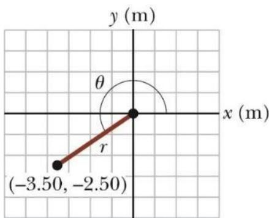

Trong vật lý, ta thường làm việc với các đại lượng có cả thuộc tính về số và về hướng đó là các đại lượng vec-tơ. Đại lượng vec-tơ được dùng nhiều trong sách này nên bạn cần phải nắm vững những kỹ thuật được trình bày trong chương này.

# Các hệ tọa độ

Các hệ tọa độ được sử dụng $\tt d \hat { e } \ m \hat { o }$ tả vị trí của một điểm trong không gian. Phần này sẽ trình bày về hệ tọa độ Descartes và hệ tọa độ cực.

### Hệ tọa độ Descartes:

Hệ tọa độ Descartes còn được gọi là hệ tọa độ vuông góc. Trong đó có hai trục tọa $\hat { \mathrm { d } } \hat { \mathrm { o } } x$ và $y$ vuông góc với nhau và giao nhau tại $\mathrm { g } \acute { \mathrm { o c } }$ tọa độ (hình 3.1).

# $3 . 1 . 2 \mathrm { H } \hat { \mathbf { e } }$ tọa độ cực

Hệ tọa độ cực bao gồm một gốc tọa độ và một đường thẳng qui chiếu. Một điểm cách gốc tọa $\mathtt { d } \hat { \mathrm { ~ o ~ } } \mathtt { m } \hat { \mathrm { ~ \rVert ~ } }$ khoảng $r$ theo hướng  tính từ đường thẳng qui chiếu (hình 3.2 a). Thường thì ta chọn trục Ox làm đường thẳng qui chiếu.

  
Hình 3.1 Trong hệ tọa độ Descartes, một điểm trong mặt phẳng được gán nhãn $( x , y )$

  
Hình 3.2 (a) Hệ tọa độ cực, các điểm được gán nhãn (r, θ); (b) liên hệ giữa $( x , y ) \nu \dot { a } \mathcal { ( r , \theta ) }$

Trong nhiều trường hợp, sử dụng hệ tọa độ cực sẽ dẫn đến các phép tính đơn giản hơn so với hệ tọa độ Descartes.

### Chuyển đổi từ tọa độ cực sang tọa độ Descartes:

Dựa trên tam giác vuông dựng từ $r$ và $\theta$ ta có: $x = r$ cos () y = r sin

Nếu biết trước các tọa độ x và y thì tan = y (3.4) và x x 2 + y2

# Bài tập mẫu 3.1:

Các tọa độ Descartes của một điểm trong mặt phẳng xy là $( \mathrm { x } , \mathrm { y } ) = ( - 3 . 5 0 ; - 2 . 5 0 ) \mathrm { m }$ như hình 3.3. Hãy tìm các tọa $\mathtt { d } \hat { \mathbf { \rho } }$ cực của điểm này.

# Giải:

Từ phương trình (3.4) ta có:

$$
r = \sqrt { x ^ { 2 } + y ^ { 2 } } = \sqrt { ( - 3 , 5 0 ~ \mathrm { m } ) ^ { 2 } + ( - 2 , 5 0 ~ \mathrm { m } ) ^ { 2 } } = 4 , 3 0 ~ \mathrm { m }
$$

Từ phương trình (3.3) suy ra:

$$
1 \mathsf { n } \mathsf { \theta } = \frac { y } { x } = \frac { - 2 , 5 0 \mathsf { m } } { - 3 , 5 0 \mathsf { m } } = 0 , 7 1 4 \Leftrightarrow \mathsf { \theta } = 2 1 6 ^ { \circ }
$$

Hình 3.3 Tìm các tọa độ cực.

# Đại lượng vec-tơ và đại lượng vô hướng

### Đại lượng vô hướng

Đại lượng vô hướng được xác định một cách trọn vẹn bằng một giá trị với một đơn vị đo tương ứng và không có hướng.

• Nhiều đại lượng là số luôn dương.   
• Một vài đại lượng có thể âm hoặc dương.   
• Có thể dùng các qui tắc số học để làm việc với các đại lượng vô hướng.

### Đại lượng vec-tơ

Đại lượng vec-tơ chỉ được xác định một cách trọn vẹn bởi một con số kèm theo đơn vị đo và một hướng nhất định.

Ví dụ về vec-tơ: Một hạt chuyển động từ A đến B dọc theo một đường cong (nét đứt) như hình vẽ.

Quãng đường mà hạt đi được là một đại lượng vô hướng (chính là độ dài của đường cong).   
Độ dời của chất điểm là đường thẳng liền nét từ A đến B, nó không phụ thuộc vào dạng của đường cong giữa 2 điểm A và B. Vì vậy độ dời là một vec-tơ.

Hình 3.4 Một chất điểm chuyển động từ A đến B theo đường nét đứt.

Cách trình bày vec-tơ: Trong tài liệu này, vec-tơ được thể hiện bằng một chữ cái in đậm và một dấu mũi tên trên đầu hoặc có thể không có mũi tên: A, A . Khi nói về độ lớn của vectơ, ta dùng chữ in nghiêng $A$ hoặc ghi rõ | A | .

Độ lớn của vec-tơ sẽ có một đơn vị vật lý và luôn là một số dương.   
Nếu viết tay thì phải dùng thêm dấu mũi tên.

Câu hỏi 3.1: Điều nào sau đây là đại lượng vec-tơ và điều nào là đại lượng vô hướng? (a) Tuổi của bạn, (b) gia tốc, (c) vận tốc, (d) tốc độ, (e) khối lượng.

# Một vài thuộc tính của vec-tơ

### Sự bằng nhau của các vec-tơ:

Hai vec-tơ là bằng nhau nếu chúng có cùng độ lớn và cùng hướng. Khi dịch chuyển một vec-tơ sang một vị trí mới mà vẫn song song với chính nó thì vec-tơ không thay đổi ví dụ như 4 vec-tơ trên hình 3.5.

### Phép cộng vec-tơ:

Phép cộng vec-tơ rất khác với cộng các đại lượng vô hướng.

  
Hình 3.5 Bốn vec-tơ bằng nhau.

Khi cộng các vec-tơ, phải lưu ý đến hướng của chúng. Đơn vị của các vec-tơ phải giống nhau (nghĩa là chúng phải là các vec-tơ cùng loại). Không thể lấy vec-tơ độ dời cộng với vec-tơ vận tốc.

Có hai cách cộng vec-tơ: bằng hình học và bằng đại số. Cách cộng đại số là thuận tiện hơn so với cách cộng hình học (phải vẽ các vec-tơ theo tỉ lệ).

# Cộng vec-tơ theo kiểu hình học:

Khi thực hiện phép cộng vec-tơ theo kiểu hình học thì phải chọn một tỉ lệ xích. Vẽ vectơ thứ nhất với độ dài phù hợp theo hướng xác định (theo một hệ tọa độ). Vẽ vec-tơ tiếp theo sao cho $\mathrm { g } \acute { \mathrm { o c } }$ tọa độ của vec-tơ này trùng với ngọn của vec-tơ trước và các trục của hệ tọa độ của vec-tơ sau song song với các trục tọa độ của vec-tơ trước (kiểu vẽ gốc nối ngọn). Vec-tơ

tổng được vẽ từ gốc của vec-tơ đầu tiên đến ngọn của vec-tơ cuối cùng. Sau khi vẽ xong, đo độ dài của vec-tơ tổng và hướng (theo góc hợp với các trục tọa độ) của nó (xem hình 3.6).

Do phép cộng vec-tơ có tính giao hoán nên thứ tự vẽ các vec-tơ là không quan trọng. Đồng thời, do phép cộng vectơ có tính kết hợp nên khi tìm tổng của nhiều vec-tơ thì có thể gộp các vec-tơ thành nhóm một cách tùy ý. Kết quả của phép cộng không thay đổi. Ví dụ với tổng sau:

  
Hình 3.6 Một số ví dụ về cộng vec-tơ

  
Hình 3. 7 Cộng vec-tơ kiểu hình học

$$
\vec { \pmb { \ A } } + \left( \vec { \pmb { \ B } } + \vec { \pmb { C } } \right) = \left( \vec { \pmb { A } } + \vec { \pmb { \ B } } \right) + \vec { \pmb { C } }
$$

Có thể tìm tổng $\mathbf { B }$ và C trước rồi tìm tổng của A với $\mathbf { s } + \mathbf { c }$ . Nhưng cũng có thể tìm tổng của A và B trước rồi sau đó tìm tổng của $\mathbb { A } { + } \mathbb { B }$ với C

### Phép trừ vec-tơ:

Vec-tơ trái dấu: Vec-tơ trái dấu của một vec-tơ là một vec-tơ mà tổng của nó với vec-tơ ban đầu là một vec-tơ không. Vec-tơ trái dấu có độ lớn bằng với độ lớn vec-tơ gốc nhưng ngược chiều. Vec-tơ trái dấu của A là –A nên $\pmb { \Delta } + ( - \pmb { \Delta } ) = \pmb { 0 }$

Phép trừ vec-tơ: là trường hợp đặc biệt của phép cộng vec-tơ:  A − B = A + (−B)

Hai cách thực hiện phép trừ vectơ (hình 3.8):

• Cách 1: tìm vec-tơ trừ của vectơ B rồi tiếp tục thực hiện phép cộng với vec-tơ trừ này. Cách 2: Tìm một vec-tơ mà khi cộng vec-tơ này với vec-tơ thứ hai (nằm sau dấu trừ) thì được vec-tơ thứ nhất (nằm trước dấu trừ).

  
Hình 3.8 Phép trừ vec-tơ (a) cách 1; (b) cách 2

$$
\vec { \bf A } - \vec { \bf B } = \vec { \bf C } \Rightarrow \vec { \bf C } + \vec { \bf B } = \vec { \bf A }
$$

### Phép nhân (chia) vec-tơ với một số vô hướng:

Khi nhân/chia một vec-tơ với một số vô hướng thì ta được một vec-tơ có độ lớn bằng độ lớn của vec-tơ được nhân (hoặc chia) với số vô hướng đó.

Nếu số vô hướng là số dương thì vec-tơ kết quả cùng hướng với vec-tơ ban đầu. Nếu số vô hướng là số âm thì vec-tơ kết quả ngược hướng với vec-tơ ban đầu.

Câu hỏi 3.2: Độ lớn của 2 vec-tơ A và B là $\mathrm { A } = 1 2$ đơn vị và $\mathrm { B } = 8$ đơn vị. Cặp giá trị nào có giá trị lớn nhất và nhỏ nhất có thể là độ lớn của vec-tơ $R = A + B ?$ (a) 14.4 đơn vị và 4 đơn vị, (b) 12 đơn vị và 8 đơn vị, (c) 20 đơn vị và 4 đơn vị, (d) không phải 3 cặp trên.

Câu hỏi 3.3: B cộng A bằng 0, hãy chọn 2 ý nào là đúng trong các ý sau: (a) A và B song song và cùng chiều, (b) A và B song song và ngược chiều, (c) A và B có cùng độ lớn, (d) A và B trực giao.

# Bài tập mẫu 3.2:

Một ô tô đi theo hướng bắc được $2 0 \mathrm { k m }$ , sau đó quẹo sang hướng tây theo phương hợp với phương bắc 1 góc $6 0 ^ { \mathrm { o } }$ , xe đi được $3 5 \mathrm { k m }$ trên đoạn đường này (hình 3.9). Xác định độ lớn, phương và chiều của vec-tơ độ dời của xe sau 2 đoạn đường trên.

# Giải:

  
Hình 3.9 Ví dụ 3.2

Gọi A và $\vec { \textbf { B } }$ là 2 vec-tơ độ dời của xe lần lượt trong 2 đoạn đường $2 0 \mathrm { k m }$ và

Vec-tơ độ dời của 2 xe sau 2 đoạn đường trên là $\overrightarrow { R }$ . Ta có $R = \overrightarrow { A } + \overrightarrow { B }$ với độ lớn của R là:

$$
\begin{array} { r } { \mathsf { R } = \sqrt { A ^ { 2 } + B ^ { 2 } - 2 A B \cos \theta } \ = \sqrt { 2 0 ^ { 2 } + 3 5 ^ { 2 } - 2 \times 2 0 \times 3 5 \times \cos ( 1 2 0 ^ { \circ } ) } = 4 8 . 2 k n \times 3 5 \ \mathsf { R } . } \end{array}
$$

Phương của $\overrightarrow { R }$ tạo với phương bắc 1 góc β. Ta có: sin  = sin

$$
\mid \Rightarrow \sin \beta = B { \frac { \sin \theta } { R } } = 3 5 \times { \frac { \sin 1 2 0 ^ { \circ } } { 4 8 . 2 } } = 3 8 . 9 ^ { \circ }
$$

Vậy: vec-tơ độ dời của xe sau 2 đoạn đường trên có độ lớn 48.2 km, chiều hướng về phía tây, phương hợp với phương bắc $1 \mathrm { g o c } 3 8 . 9 ^ { \mathrm { o } }$ .

# Các thành phần của vec-tơ và vec-tơ đơn vị

Khi cộng các vec-tơ thì phương pháp hình học không được khuyến khích dùng trong trường hợp cần phải có độ chính xác cao hoặc trong các bài toán có không gian 3 chiều. Lúc này, ta sử dụng phương pháp thành phần. Phương pháp thành phần sử dụng các hình chiếu của vec-tơ lên các trục tọa độ.

### Các thành phần của vec-tơ:

Thành phần của vec-tơ là hình chiếu của vec-tơ này lên một trục tọa độ. Có thể biểu diễn một cách đầy đủ mọi vec-tơ theo các thành phần của nó.

Để tiện lợi thì ta sử dụng các thành phần vuông góc của vec-tơ: đó là hình chiếu của vec-tơ lên các trục tọa $\hat { \mathrm { d } } \hat { \boldsymbol { 0 } } \textbf { X }$ và y.

Hình 3.10 Phân tích vec-tơ A thành 2 thành phần $A _ { x }$ và Ay

Trên hình 3.10, các vec-tơ $\vec { \pmb { \mathsf { A } } } _ { x } , \vec { \pmb { \mathsf { A } } } _ { y }$ là các vec-tơ thành phần của $\vec { \pmb { \mathsf { A } } }$ . Các vec-tơ thành phần cũng là các vec-tơ nên chúng tuân theo các qui tắc về vec-tơ.

$A _ { x }$ và $A _ { x }$ là các số vô hướng, được gọi là các thành phần của vec-tơ $\vec { \pmb { A } }$ . Trên hình vẽ bên cạnh, dễ thấy:

$$
\vec { \mathsf { A } } = \vec { \mathsf { A } } _ { x } + \vec { \mathsf { A } } _ { y }
$$

3 vec-tơ này lập thành một tam giác vuông. Các thành phần của vec-tơ A lần lượt là:

$$
\begin{array} { r } { A _ { x } = A \mathrm { c o s } \Theta } \\ { A _ { y } = A \mathrm { s i n } \Theta } \end{array}
$$

Góc  được xác định từ trục Ox.

Các thành phần của vec-tơ là hai cạnh góc vuông của tam giác vuông có cạnh huyền là độ dài của vec-tơ. Dễ thấy:

$$
A = \sqrt { A _ { ~ x } ^ { 2 } + A _ { ~ y } ^ { 2 } }
$$

$$
\theta = \tan ^ { - 1 } \frac { A _ { y } } { A _ { x } }
$$

Trong một bài toán, một vec-tơ có th $\hat { \dot { \mathbf { e } } }$ được xác định bởi các thành phần hoặc độ dài và hướng của nó.

Các thành phần của vec-tơ có thể dương hoặc âm nhưng có cùng đơn vị với vec-tơ. Dấu của thành phần phụ thuộc vào góc (hợp bởi vec-tơ và các trục tọa độ). Hình 3.11 minh họa các trường hợp mà các thành phần vec-tơ có dấu dương, âm.

Câu hỏi 3.4: Hãy chọn từ nào phù hợp với dấu … trong câu sau: “Một thành phần của một vec-tơ … lớn hơn độ lớn của vec-tơ đó”? (a) luôn luôn, (b) không bao giờ, (c) thỉnh thoảng.

  
Hình 3.11 Dấu của các thành phần của vec-tơ A

### Vec-tơ đơn vị

Các đại lượng vec-tơ thường được biểu diễn thông qua vec-tơ đơn vị.

Vec-tơ đơn vị là vec-tơ không có thứ nguyên và có độ lớn đúng bằng 1. Các vec-tơ đơn vị được dùng để mô tả hướng trong không gian và không có ý nghĩa vật lý nào khác.

Hình 3.12 Các vec-tơ đơn vị trong hệ tọa độ Descartes.   

Trong không gian 3 chiều, các vec-tơ đơn vị được ký hiệu là ˆi, ˆj, kˆ .Các vec-tơ này vuông góc với nhau từng đôi trong một tam diện thuận. Độ lớn của mỗi vec-tơ này là 1:

Xét một vec-tơ A trong mặt phẳng Xy, $\pmb { \vec { \mathbf { A } } } _ { x } = \pmb { \cal A } _ { x } \pmb { \vec { \mathbf { \tau } } }$ ˆi và Ay = Ay ˆj nên A = Ax ˆi + Ay ˆj

### Vec-tơ vị trí

Một điểm có tọa độ (x, y) trong mặt phẳng Xy của hệ tọa độ Descartes có thể được biểu diễn bởi một vec-tơ vị trí:

$$
\hat { \mathbf { r } } = x \hat { \mathbf { i } } + y \hat { \mathbf { j } }
$$

Trong cách viết này, x và y là các thành phần của vec-tơ r

### Phép cộng vec-tơ khi dùng vec-tơ đơn vị:

Khi dùng vec-tơ đơn vị, các phép tính vec-tơ sẽ đơn giản hơn. Trong mặt phẳng Xy, tổng của hai vec-tơ: $\vec { \mathsf { R } } = \vec { \mathsf { A } } + \vec { \mathsf { B } }$ với các thành phần của vec-tơ $\vec { \bf R }$ là $\begin{array} { r } { R _ { x } = A _ { x } + B _ { x } } \end{array}$ và $\begin{array} { r } { R _ { y } = A _ { y } + B _ { y } } \end{array}$

$$
\begin{array} { r } { \hat { \bf R } = \left( \hat { A } _ { x } \hat { \bf \Phi } \hat { \bf i } + \hat { A } _ { y } \hat { \bf \Phi } \hat { \bf j } \right) + \left( \hat { B } _ { x } \hat { \bf \Phi } \hat { \bf i } + \hat { B } _ { y } \hat { \bf \Phi } \hat { \bf j } \right) } \\ { \hat { \bf R } = \left( \hat { A } _ { x } + \hat { B } _ { x } \right) \hat { \bf \Phi } \hat { \bf i } + \left( \hat { A } _ { y } + \hat { B } _ { y } \right) \hat { \bf j } } \end{array}
$$

  
Hình 3.13 Cộng 2 vec-tơ dùng vec-tơ đơn vị theo hình học

Suy ra độ lớn của vec-tơ $\begin{array} { r } { \vec { \textbf { R } } : R = \sqrt { R _ { x } ^ { 2 } + R _ { y } ^ { 2 } } = \sqrt { \left( A _ { x } + B _ { x } \right) ^ { 2 } + \left( A _ { y } + B _ { y } \right) ^ { 2 } } } \end{array}$

Góc hợp bởi vec-tơ tổng với trục Ox cho bởi:

$$
\mathsf { t a n } \theta = \frac { R _ { y } } { R _ { x } } = \frac { A _ { y } + B _ { y } } { A _ { x } + B _ { x } }
$$

Nếu xét trong không gian 3 chiều thì chỉ cần thêm thành phần thứ 3 của các vec-tơ.

$$
\begin{array} { l } { \vec { \bf A } = A _ { x } \hat { \bf i } + A _ { y } \hat { \bf j } + A _ { z } \hat { \bf k } } \\ { \vec { \bf B } = B _ { x } \hat { \bf i } + B _ { y } \hat { \bf j } + B _ { z } \hat { \bf k } } \end{array}
$$

Tổng của 2 vec-tơ này là:

$$
\hat { \mathbf { R } } = \left( A _ { x } + B _ { x } \right) \mathbf { \hat { i } } + \left( A _ { y } + B _ { y } \right) \mathbf { \hat { j } } + \left( A _ { z } + B _ { z } \right) \mathbf { \hat { k } } ^ { * } = R _ { x } \mathbf { \hat { i } } + R _ { y } \mathbf { \hat { j } } + R _ { z } \mathbf { k } ^ { * }
$$

Độ lớn của vec-tơ tổng: $R = \sqrt { R _ { x } ^ { 2 } + R _ { y } ^ { 2 } + R _ { z } ^ { 2 } }$ .

Nếu tính tổng của 3 vec-tơ trở lên thì ta vẫn dùng phương pháp như trên cho từng vec-tơ trong tổng. Ví dụ, với $\vec { \pmb { { \mathrm { R } } } } = \vec { \pmb { { \mathrm { A } } } } + \vec { \pmb { { \mathrm { B } } } } + \vec { \pmb { { \mathrm { C } } } }$ thì:

$$
{ \vec { \mathsf { R } } } = \left( A _ { x } + B _ { x } + C _ { x } \right) \mathbf { \hat { i } } + \left( A _ { y } + B _ { y } + C _ { y } \right) \mathbf { \hat { j } } + \left( A _ { z } + B _ { z } + C _ { z } \right) \mathbf { k } ^ { \prime }
$$

(a) A = 2iˆ + 5ˆj , (b) B = −3ˆj , (c) C = 5k

