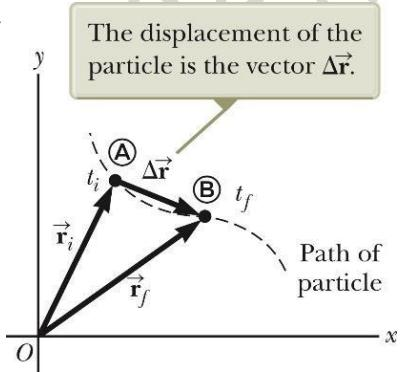
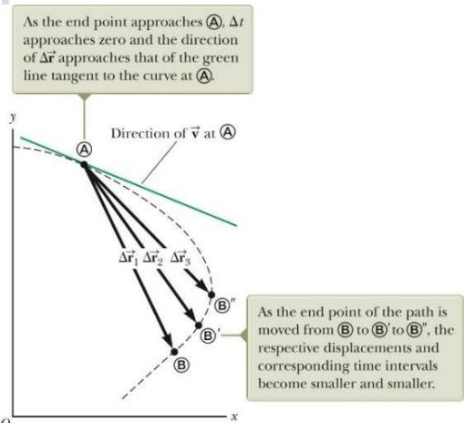
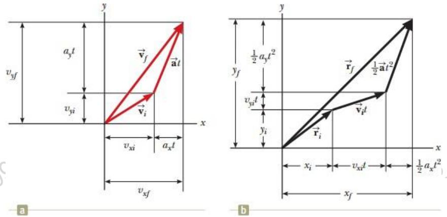
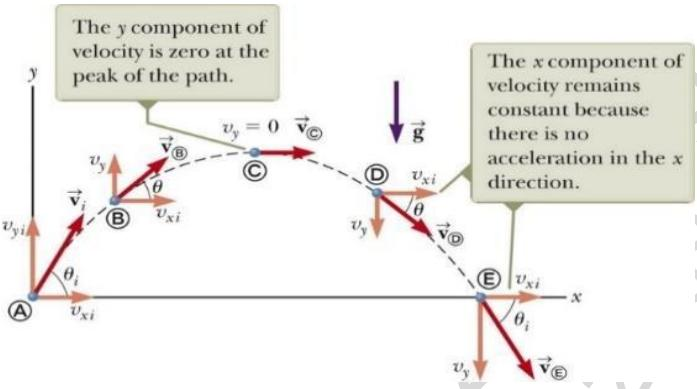
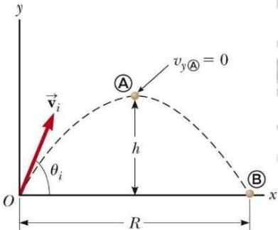
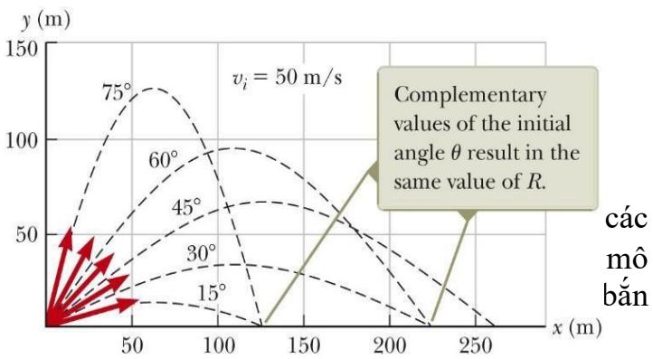

<table><tr><td rowspan="3">Ai</td><td>VIETTEL AI RACE V -</td><td>TD128</td></tr><tr><td>Chuyěn dong trong khòng gian hai chièu</td><td>Làn ban hành: 1</td></tr><tr><td></td><td></td></tr></table>

Hiểu biết về các cơ sở của chuyển động trong không gian 2 chiều (từ đây gọi tắt là chuyển động hai chiều) sẽ cho chúng ta (trong các chương sau) khảo sát các tình huống khác nhau, từ chuyển động của các vệ tinh trên quỹ đạo đến chuyển động của các electron trong điện trường đều. Chúng ta sẽ bắt đầu nghiên cứu chi tiết hơn về

bản chất vec-tơ của vị trí, vận tốc và gia tốc. Sau đó sẽ xử lý chuyển động ném nghiêng và chuyển động tròn đều như là các trường hợp đặc biệt của chuyển động hai chiều. Chúng ta cũng sẽ thảo luận về khái niệm chuyển đông tương đối.

# Các vec-tơ vị trí, vận tốc và gia tốc

# 4.1.1 Vec-tơ độ dời

Trong chương 2, ta đã thấy rằng chuyển động của một chất điểm theo một đường thẳng sẽ được xác định hoàn toàn nếu vị trí của nó được biết đến như là một hàm của thời gian. Bây giờ ta sẽ mở rộng ý tưởng này sang chuyển động 2 chiều của một chất điểm trong mặt phẳng xy. Ta bắt đầu bằng việc mô tả vị trí của một chất điểm bằng vec-tơ vị trí r , vẽ từ gốc của một hệ tọa độ đến vị trí của hạt trong mặt phẳng xy (hình 4.1).

  
Hình 4.1

Tại thời điểm ti, vị trí của chất điểm là ở A, được mô tả bởi vec-tơ $\vec { \bf r } _ { \mathrm { i } }$ , tại thời điểm tf, vị trí của chất điểm là B, được mô tả bởi vec-tơ $\vec { \bf r } _ { \mathrm { f } }$ . Quỹ đạo của chất điểm là đoạn cong AB.

Vec-tơ độ dời của chất điểm được định nghĩa là hiệu của vec-tơ vị trí $\tilde { \mathbf { 0 } }$ thời điểm cuối và vec-tơ vị trí ở thời điểm đầu của chất điểm.

$$
\Delta \vec { \mathbf { r } } \equiv \vec { \mathbf { r } } _ { t } - \vec { \mathbf { r } } _ { i }
$$

Như vậy động học chuyển động hai chiều (2 chiều hoặc 3

chiều), mọi thứ đều tương tự như trong chuyển động một chiều ngoại trừ việc ta phải sử dụng trọn vẹn cách biểu diễn vec-tơ.

<table><tr><td rowspan="3">Ai</td><td>VIETTEL AI RACE V •</td><td>TD128</td></tr><tr><td>Chuyěn dong trong khòng gian hai chièu</td><td>Làn ban hành: 1</td></tr><tr><td></td><td></td></tr></table>

# 4.1.2 Vận tốc trung bình:

Vận tốc trung bình bằng vec-tơ độ dời chia cho khoảng thời gian thực hiện độ dời đó. Hướng của vận tốc trung bình là hướng của vec-tơ độ dời.

$$
\vec { \bf v } _ { a v g } \equiv \frac { \Delta \vec { \bf r } } { \Delta t }
$$

# 4.1.3 Vận tốc tức thời:

Vận tốc tức thời là giới hạn của vận tốc trung bình khi $\Delta t$ tiến tới không (tức là bằng đạo hàm của vec-tơ độ dời theo thời gian).

$$
\vec { \pmb { v } } \equiv | \mathbf { \operatorname* { i m } } _ { \Delta t  0 } \frac { \Delta \vec { \mathbf { r } } } { \Delta t } = \frac { d \vec { \mathbf { r } } } { d t }
$$

Vận tốc tức thời tại mỗi điểm trên quỹ đạo của chất

  
Hình 4.2 Vận tốc tức thời tại điểm A có phương là đường tiếp tuyến với quỹ đạo tại điểm A.

điểm có phương là phương tiếp tuyến với quỹ đạo và có chiều là chiều chuyển động.

Độ lớn của vận tốc tức thời được gọi là tốc độ. Tốc độ là một đại lượng vô hướng.

# 4.1.4 Gia tốc trung bình

Gia tốc trung bình của một chất điểm chuyển động được định nghĩa bằng độ biến thiên của vận tốc tức thời chia cho khoảng thời gian diễn ra sự biến thiên đó.

$$
\vec { \textbf { a } } _ { a v g } \equiv \frac { \Delta \vec { \textbf { v } } } { \Delta t } = \frac { \vec { \textbf { v _ { \mathrm { f } } } } - \vec { \textbf { v _ { i } } } } { t _ { \mathrm { f } } - t _ { \mathrm { ~ , ~ } } }
$$

Gia tốc trung bình là một đại lượng vec-tơ cùng hướng với $\Delta \vec { \mathbf { v } }$

# 4.1.5 Gia tốc tức thời:

Gia tốc tức thời là giới hạn khi $\Delta t$ tiến đến không của ∆??ሬԦ ∆??

Gia tốc tức thời bằng đạo hàm theo thời gian của vec-tơ vận tốc.

Câu hỏi 4.1: Xét các vật điều khiển trong 1 ô tô gồm: bàn đạp ga, phanh, tay lái. Trong 3 vật này, vật nào gây ra gia tốc cho xe? (a) Cả 3 vật, (b) bàn đạp ga và phanh, (c) phanh, (d) bàn đạp ga, và (e) tay lái.

<table><tr><td rowspan="3">Ai</td><td>1 VIETTEL AI RACE</td><td>TD128</td></tr><tr><td>Chuyén dong trong khòng gian hai chièu</td><td>Làn ban hành: 1</td></tr><tr><td></td><td></td></tr></table>

# Chuyển động hai chiều với gia tốc không đổi

# 4.2.1 Các phương trình động học trong chuyển động hai chiều:

Nếu một chuyển động hai chiều có gia tốc không đổi, ta có thể tìm được một hệ phương trình để mô tả chuyển động đó. Các phương trình này tương tự như các phương trình động học trong chuyển động thẳng.

Có thể mô hình hóa chuyển động trong không gian 2 chiều như là hai chuyển động độc lập trong từng hướng gắn với các trục x và y. Lưu $\acute { y }$ : tác động lên chuyển động theo trục y không ảnh hưởng đến chuyển động theo trục x.

# Các phương trình động học:

Vec-tơ vị trí của một chất điểm chuyển động trong mặt phẳng xy là

$$
\hat { \mathbf { r } } { = } x \mathbf { \hat { i } } { + } y \mathbf { \hat { j } }
$$

Vec-tơ vận tốc của chất điểm được xác định bởi:

$$
\overset { \triangledown } { \boldsymbol { \nu } } = \frac { d \mathfrak { r } } { d t } = \frac { d x \cdot \mathrm {  ~ \hat { \mu } ~ } } { d t } \overset { \triangledown } { \mathbf { i } } + \frac { d y \cdot \mathrm {  ~ \hat { \mu } ~ } } { d t } \bf \hat { j } = \nabla \hat { \mu } _ { x } ^ { \mathrm {  ~ \hat { \mu } ~ } } + V _ { y } \cdot \mathrm {  ~ \hat { j } ~ }
$$

Vì gia tốc của chất điểm là hằng số nên ta tìm được biểu thức của vận tốc như là hàm của thời gian:

$$
\vec { \bf v } _ { t } = \vec { \bf v } _ { i } + \vec { \bf a } t
$$

Vị trí của chất điểm cũng được biểu diễn như là hàm của thời gian:

$$
\mathbf { \Delta } \mathbf { r } _ { } = \mathbf { r } _ { } + \mathbf { v } _ { } t + \mathbf { \Delta } \mathbf { \frac { 1 } { 2 } } \mathbf { a } t ^ { 2 }
$$

Hình 4.3 Biểu diễn các thành phần của vec-tơ (a) vị trí, (b) vận tốc trong chuyển động hai chiều có gia tốc không đổi

# Chuyển động ném nghiêng

<table><tr><td rowspan=2 colspan=1>Ai</td><td rowspan=1 colspan=1>VIETTEL AI RACE    V</td><td rowspan=1 colspan=1>TD128</td></tr><tr><td rowspan=1 colspan=1>Chuyěn dong trong khòng gian hai chièu</td><td rowspan=1 colspan=1>Làn ban hành: 1</td></tr></table>

Một vật có thể đồng thời chuyển động theo hai trục x và y. Trong phần này, ta xem xét chuyển động ném nghiêng. Phân tích chuyển động ném nghiêng của một vật sẽ đơn giản nếu chấp nhận 2 giả định:

• Gia tốc rơi tự do là hằng số trong phạm vi chuyển động và hướng xuống dưới (giống như là quả đất là phẳng trong phạm vi khảo sát, điều này là hợp lý nếu phạm vi này là bé so với bán kính của Quả đất).   
• Bỏ qua sức cản của không khí.

Phân tích chuyển động ném nghiêng: Xét một chất điểm được ném nghiêng từ gốc tọa độ với vận tốc ban đầu ??ሬ $\mathrm { h } _ { \iota } \mathrm { c } \acute { 0 }$ phương hợp với phương ngang một góc $\theta _ { \mathrm { i } }$ . Với 2 giả định nêu trên, quỹ đạo của chất điểm luôn là một parabol như trong hình 4.4. Ở điểm cao nhất của quỹ đạo, vận tốc theo phương thẳng đứng bằng 0. Gia tốc luôn bằng g tại mọi điểm trên quỹ đạo.

Cụ thể, chúng ta sẽ đi thiết lập phương trình chuyển động của chất điểm trên theo 2 phương x và y. Chuyển

  
Hình 4.4 Quỹ đạo parabol của chất điểm được ném nghiêng $I$ góc $\theta _ { i }$ từ gốc tọa độ với vận tốc ban đầu $\nu _ { i }$

động của chất điểm là tổng hợp của các chuyển động theo phương $x$ và y. Vị trí của chất điểm tại thời điểm bất kỳ cho bởi:

$$
{ \vec { \mathbf { r } } } _ { t } = { \vec { \mathbf { r } } } _ { i } + { \vec { \mathbf { v } } } _ { i } t + \big / _ { 2 } { \vec { \mathbf { g } } } t ^ { 2 }
$$

Từ những phân tích trên ta viết được:

• Theo phương x: $\mathtt { a _ { X } } = 0$ và $\mathbf { V } _ { \mathbf { X i } } =$ const nên chất điểm chuyển động thẳng đều với vận tốc $v _ { x i } = v _ { i } c o s \theta _ { i }$ . Từ biểu thức (4.10), ta viết được phương trình chuyển động của chất điểm theo phương $\mathbf { X }$ ứng với hệ tọa độ đã chọn như hình 4.4 như sau:

$$
\begin{array} { r } { x _ { f } = x _ { i } + \stackrel {  } { v _ { x i } } . t + \stackrel {  } { { } _ 2 } a _ { x } t ^ { 2 } = 0 + v _ { i } c o s \theta _ { i } . t + 0 = v _ { i } c o s \theta _ { i } . t } \end{array}
$$

• Theo phương $y \colon a _ { y } = - g = c o n s t$ nên theo phương y chất điểm chuyển động thẳng biến đổi đều với vận tốc ban đầu $v _ { y i } = + v _ { i } s i n \theta _ { i }$ . Từ biểu thức (4.10), ta viết được phương trình chuyển động của chất điểm theo phương y ứng với hệ tọa độ đã chọn như hình 4.4 như sau:

$$
\begin{array} { r } { y _ { f } = y _ { i } + v _ { y i } , t + \frac { 1 } { 2 } a _ { y } t ^ { 2 } = 0 + v _ { i } s i n \theta _ { i } , t + \frac { 1 } { 2 } ( - g ) t ^ { 2 } = v _ { i } s i n \theta _ { i } , t - \frac { 1 } { 2 } g t ^ { 2 } } \end{array}
$$

<table><tr><td rowspan="3">Ai</td><td>VIETTEL AI RACE V -</td><td>TD128</td></tr><tr><td>Chuyén dòng trong khòng gian hai chièu</td><td>Làn ban hành: 1</td></tr><tr><td></td><td></td></tr></table>

của những chất điểm chuyển động ném nghiêng vẫn là phương trình bậc 2 của y phụ thuộc x theo quỹ đạo parabol.

Câu hỏi 4.2: (i) Giả sử một vật chuyển động ném nghiêng với quỹ đạo parabol như hình 4.4, tại điểm nào trên quỹ đạo của vật vec-tơ vận tốc và vec-tơ gia tốc vuông góc với nhau? (a) không có điểm nào, (b) điểm cao nhất, (c) điểm xuất phát. (ii) Với cùng lựa chọn như trên, hỏi điểm nào trên quỹ đạo của vật vec-tơ vận tốc và vec-tơ gia tốc song song với nhau?

# Tầm xa và độ cao cực đại của vật ném nghiêng:

Khi phân tích chuyển động ném nghiêng ta thường quan tâm đến hai đặc trưng: tầm xa R (là khoảng cách xa nhất theo phương ngang so với vị trí ban đầu) và độ cao cực đại $\pmb { h }$ (là khoảng cách xa nhất theo phương đứng so với vị trí ban đầu) mà vật đạt được (hình 4.5).

  
Hình 4.5 Tại điểm A, chất điểm đạt độ cao cực đại. Tại

• Độ cao cực đại h: Khi chất điểm đi đến điểm A – vị trí đạt độ cao cực đại, vận tốc theo phương y của nó bằng 0. Từ phương trình (4.11), cho $\mathbf { v } _ { \mathrm { y } } = 0$ , ta suy ra thời gian mà chất điểm đi từ O đến A là: $t _ { A } = \begin{array} { c } { { v _ { i } s i n \theta _ { \underline { { i } } } } } \\ { { g } } \end{array}$ . Thay tA vào phương trình chuyển động (4.13), ta thu được biểu thức độ cao cực đại của chất điểm:

điểm $B _ { : }$ , chất điểm đạt vị trí xa nhất theo phương ngang.

$$
h = \frac { \stackrel { v ^ { 2 } s i n ^ { 2 } \theta _ { i } } { } } { 2 g }
$$

• Tầm xa $\pmb { R }$ : Khi chất điểm đến điểm B – vị trí đạt khoảng cách xa nhất theo phương ngang, tọa độ y của chất điểm bằng 0. Từ phương trình (4.14), cho $\mathbf { y } = 0$ ta suy ra biểu thức tính thời gian chất điểm đi từ O đến B. Cách khác, đối với bài toán ta đang xét, ta thấy t $_ 3 = 2 \mathrm { { t _ { A } } }$ . Thay tB vào phương trình (4.12) ta thu được biểu thức tính tầm xa:

Lưu ý: Các kết quả này (4.15) và (4.16) chỉ đúng trong trường hợp chuyển động là đối xứng. Trong trường hợp độ cao ban đầu và độ cao cuối cùng của vật khác nhau thì phải tính từ $\mathrm { g } \acute { \mathrm { o c } }$ tọa độ với cùng tốc độ ban đầu

<table><tr><td rowspan="3">Ai</td><td>VIETTEL AI RACE V</td><td>TD128</td></tr><tr><td>Chuyén dong trong khòng gian hai chièu</td><td>Làn ban hành: 1</td></tr><tr><td></td><td></td></tr></table>

<table><tr><td rowspan="3">Ai</td><td>V VIETTEL AI RACE</td><td>TD128</td></tr><tr><td>Chuyén dòng trong khòng gian hai chièu</td><td>Làn ban hành: 1</td></tr><tr><td></td><td></td></tr></table>