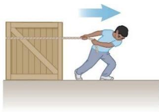

# Khái niệm về lực

Có thể phân các loại lực thành hai nhóm: (1) Lực do có tiếp xúc (lực đàn hồi của lò xo, lực căng dây, lực đàn hồi ở các điểm tiếp xúc giữa các vật…) (2) Lực của một trường lực (lực hấp dẫn, lực tĩnh điện, lực từ)

  
Hình 5.1: a, b, c lực do có tiếp xúc; d, e, f lực của một trường

Bản chất vectơ của lực: Lực là đại lượng vectơ nên khi tìm lực cần chú ý đến điểm đặt, phương, chiều và độ lớn của lực. Khi tổng hợp các lực, cần chú ý qui tắc cộng vectơ.

Hình 5.2 minh họa 2 lực tác dụng vào móc của lực $\mathrm { k } \acute { \mathrm { e } }$ theo 2 cách khác nhau: 2 lực cùng phương và 2 lực vuông góc với nhau. Khi tác dụng dọc theo trục lò xo, lực $\mathrm { F } _ { 1 }$ và $\mathrm { F } _ { 2 }$ lần lượt làm lò xo giãn ra 1cm và 2cm (hình 5.2 a,b). Nhưng hai lực này tác dụng vuông góc với nhau thì lò xo giãn ra 2,24cm (hình 5.2d).

  
Hình 5.2: Các lực tác dụng lên lực $k \acute { e } .$ : $a .$ . lực $F _ { I }$ ; $b .$ . lực $F _ { 2 }$ ; c. 2 lực $F _ { I }$ và $F _ { 2 }$ cùng phương chiều; d. 2 lực $F _ { I }$ và $F _ { 2 }$ vuông góc với nhau.

# Định luật Newton thứ nhất và các hệ qui chiếu quán tính

### Định luật Newton thứ nhất:

Nếu một vật không tương tác với các vật khác thì ta có thể xác định một hệ qui chiếu trong đó vật có gia tốc bằng 0.

  
Hình 5.3: Miếng nhựa đặt trên đệm khí.

# ${ \bf 5 . 2 . 2 H \hat { e } }$ qui chiếu quán tính

Một hệ qui chiếu mà định luật Newton thứ nhất được thỏa mãn gọi là hệ qui chiếu quán tính.

Một dạng phát biểu khác của định luật Newton thứ nhất:

Khi không có ngoại lực tác dụng và được quan sát từ một hệ qui chiếu quán tính, một vật đứng yên sẽ vẫn đứng yên và một vật chuyển động sẽ tiếp tục chuyển động với vận tốc không đổi (tức là chuyển động với tốc độ không đổi theo một đường thẳng).

Ví dụ như khi xét một miếng nhựa tròn đặt trên bàn đệm khí, và bàn này đặt trên mặt đất thì miếng nhựa này không tương tác với vật nào khác theo phương ngang nên gia tốc của nó theo phương ngang bằng không. Nếu bàn đệm khí này được đặt trên một con tàu chuyển động thẳng đều thì ta cũng quan sát được hiện tượng tương tự. Tuy nhiên, nếu tàu chuyển động có gia tốc thì hệ qui chiếu gắn với tàu không còn là hệ qui chiếu quán tính nữa. Một người đứng trên tàu sẽ thấy miếng nhựa chuyển động có gia tốc. Hệ qui chiếu gắn với tàu là hệ qui chiếu phi quán tính. Mặc dầu vậy, một người quan sát đứng yên trên mặt đất vẫn thấy miếng nhựa chuyển động thẳng đều.

Một hệ qui chiếu chuyển động với vận tốc không đổi đối với các ngôi sao ở rất xa là một xấp xỉ tốt nhất cho một hệ qui chiếu quán tính. Trong nhiều trường hợp, Trái Đất cũng có thể xem là một hệ qui chiếu quán tính.

Khoảng trước năm 1600 thì người ta cho rằng trạng thái tự nhiên của vật chất là trạng thái nghỉ (đứng yên). Galileo là người đầu tiên đưa ra cách nhìn nhận mới về chuyển động và trạng thái tự nhiên của vật chất. Theo ông thì “Vận tốc mà ta truyền cho một vật chuyển động sẽ được bảo toàn nếu các nguyên nhân bên ngoài làm chậm chuyển động bị loại bỏ”. Lúc đó vật không tìm về “trạng thái nghỉ bản chất” nữa.

dụng lên vật đó. c) Cả (a) và (b) đều đúng. d) Cả (a) và (b) đều sai.

### Cách phát biểu khác của định luật Newton thứ nhất

Nếu không có ngoại lực tác dụng và được quan sát từ một hệ qui chiếu quán tính thì một vật đứng yên sẽ đứng yên và một vật chuyển động sẽ tiếp tục chuyển động với vận tốc không đổi (tức là chuyển động thẳng đều).

Nói cách khác, nếu không có lực tác dụng lên vật thì gia tốc của vật bằng không. Bất kỳ vật cô lập nào cũng đứng yên hoặc chuyển động thẳng đều. Khuynh hướng chống lại sự thay đổi vận tốc của một vật được gọi là quán tính.

### Định nghĩa lực

Lực là nguyên nhân làm thay đổi chuyển động của một vật

# Khối lượng

### Định nghĩa khối lượng

Khối lượng là một thuộc tính của vật xác định mức độ chống lại sự thay đổi vận tốc của nó. Đơn vị của khối lượng trong hệ đo lường quốc tế là kilôgram (kg). Các thí nghiệm đã cho thấy, dưới tác dụng của một lực cho trước thì vật có khối lượng càng lớn sẽ thu được gia tốc càng nhỏ. Giả sử cho cùng một lực tác dụng lên hai vật có khối lượng lần lượt là m1 và m2 và hai vật lần lượt thu được các gia $\vec { a _ { \mathrm { ~ 1 ~ } } }$ ??à $\vec { a _ { \mathrm { ~ } } _ { 2 } }$ . Tỷ số hai khối lượng của hai vật này được định nghĩa bằng nghịch đảo của tỷ số hai độ lớn của hai gia tốc tương ứng:

$$
\frac { m _ { 1 } } { m _ { 2 } } \equiv \frac { \pmb { a } _ { 2 } } { \pmb { a } _ { 1 } }
$$

Các kết quả thí nghiệm cho thấy: Với một lực cho trước tác dụng lên vật, độ lớn gia tốc mà vật thu được tỷ lệ nghịch với khối lượng của vật.

Khối lượng là thuộc tính cố hữu của một vật, không phụ thuộc vào môi trường xung quanh vật và phương pháp được dùng để đo lường nó. Khối lượng là đại lượng vô hướng. Khối lượng tuân theo các phép tính số học thông thường.

# Khối lượng và trọng lượng:

Khối lượng và trọng lượng (weight) là hai đại lượng khác nhau. Trọng lượng là độ lớn của lực hấp dẫn tác dụng lên vật. Trọng lượng có thể thay đổi tùy theo vị trí của vật.

Ví dụ:

• wearth = 180 lb; $\mathbf { W } _ { \mathrm { m o o n } } \sim 3 0 \mathrm { ~ l t }$ b • mearth = 2 kg; mmoon = 2 kg

# Định luật Newton thứ hai

Khi xem xét từ một hệ quy chiếu quán tính, gia tốc của một vật tỉ lệ thuận trực tiếp với

lực tổng hợp tác dụng lên vật và tỉ lệ nghịch với khối lượng của nó.

Lực là nguyên nhân của các thay đổi trong chuyển động, được đo thông qua gia tốc.

Cần lưu ý là một vật có thể chuyển động mà không cần có lực tác dụng. Không được diễn giải rằng lực là nguyên nhân của chuyển động.

Về mặt đại số thì:

$$
\vec { \mathsf { a } } \propto \frac { \sum \vec { \mathsf { F } } } { m } {  } \sum \vec { \mathsf { F } } = m \vec { \mathsf { a } }
$$

ở đây, hệ số tỉ lệ được chọn bằng 1 và các tốc độ chuyển động của các vật phải nhỏ hơn nhiều so với tốc độ ánh sáng. Trong đó, $\sum \limits _ { i = 1 } ^ { \sum \vec { F } }$ là lực tổng hợp, là tổng vectơ của tất cả các lực tác dụng lên vật (còn gọi là lực toàn phần).

Định luật Newton thứ 2 cũng có thể được biểu diễn theo các thành phần:

$$
\begin{array} { l } { \Sigma F _ { x } = m \bar { \alpha } _ { x } } \\ { \Sigma F _ { y } = m \bar { \alpha } _ { y } } \\ { \Sigma F _ { z } = m \bar { \alpha } _ { z } } \end{array}
$$

Lưu ý: ma không phải là một lực.

Tổng tất cả các lực bằng tích của khối lượng của vật với gia tốc của nó.

Đơn vị của lực: Trong SI, đơn vị của lực là newton (N)

$$
1 { \mathrm { N } } = 1 \ { \mathrm { k g } } { \cdot } { \mathrm { m } } \ / s ^ { 2 }
$$

Theo hệ đơn vị của Mỹ thì đơn vị của lực là pound (lb).

• 1 lb = 1 slug·ft / s2

Quy đổi đơn vị: $1 \mathrm { N } \sim \%$ lb

Câu hỏi 5.2: Một vật chuyển động không gia tốc. Hãy chọn phát biểu không đúng trong các phát biểu sau:a) Chỉ có một lực tác dụng lên vật đó. b) Không có lực nào tác dụng lên vật. c) Nhiều lực tác dụng lên vật nhưng các lực này triệt tiêu lẫn nhau.

Câu hỏi 5.3: Khi đẩy một vật từ trạng thái nghỉ trượt qua một mặt sàn không ma sát với lực không đổi trong khoảng thời gian Δt, kết quả vật thu được tốc độ v. Sau đó, lặp lại thí nghiệm trên với lực đẩy lớn hơn 2 lần. Hỏi để đạt được vận tốc cuối cùng như thí nghiệm trên thì thời gian đẩy vật là?a) 4Δt; b) 2 Δt; c) Δt; d) Δt.

# Lực hấp dẫn và khối lượng

Lực hấp dẫn $\vec { \mathsf { F } } _ { g }$ là lực mà Trái đất tác dụng lên một vật. Lực này hướng về tâm của Trái đất, và độ lớn của nó được gọi là trọng lượng của vật.

Theo định luật Newton thứ 2 thì:

$$
{ \vec { \mathsf { F } } } _ { g } = m { \vec { \mathsf { g } } }
$$

Do đó, trọng lượng của vật:

$$
F _ { g } = m g
$$

# Nói thêm về trọng lượng:

Do trọng lượng phụ thuộc vào gia tốc trọng trường (g) nên nó sẽ thay đổi theo vị trí.

• Càng lên cao thì g và trọng lượng càng giảm. • Điều này cũng áp dụng được cho các hành tinh khác, nhưng g thay đổi theo hành tinh nên trọng lượng cũng thay đổi từ hành tinh này sang hành tinh khác.

Trọng lượng không phải là thuộc tính cố hữu của vật. Trọng lượng là thuộc tính của một hệ các vật: vật và Trái đất. Về đơn vị thì kg không phải là đơn vị của trọng lượng. Công thức 1kg=2,2lb là công thức tương đương và chỉ đúng trên mặt đất.

# Khối lượng hấp dẫn và khối lượng quán tính:

Trong các định luật của Newton, khối lượng là khối lượng quán tính và đo bằng sự cản trở đối với sự thay đổi chuyển động của vật. Còn trong công thức (5.6) khối lượng m cho biết lực hấp dẫn giữa vật và Trái Đất. Các thí nghiệm cho thấy khối lượng quán tính và khối lượng hấp dẫn có cùng giá trị.

Câu hỏi 5.4: Giả sử rằng bạn đang gọi một cuộc điện thoại liên hành tinh với bạn của bạn ở trên Mặt Trăng. Người bạn đó kể rằng anh ta mới thắng được 1 Newton vàng trong một cuộc thi. Anh ta khuyên bạn nên tham dự cuộc thi đó phiên bản Trái Đất và nếu chiến thắng cũng được 1 Newton vàng. Hỏi nếu điều đó xảy ra, ai sẽ giàu hơn?, a) Bạn sẽ giàu hơn; b) Bạn của bạn giàu hơn; c) Cả 2 giàu bằng nhau.

# Định luật Newton thứ 3

Nếu hai vật tương tác với nhau, lực $\vec { \mathsf { F } } _ { 1 2 }$ do vật 1 tác dụng lên vật 2 bằng về độ lớn nhưng ngược chiều với lực $\vec { \mathsf { F } } _ { 2 1 }$ do vật 2 tác dụng lên vật 1.

$$
\vec { \pmb { { \mathsf { F } } } } _ { 1 2 } = - \vec { \pmb { { \mathsf { F } } } } _ { 2 1 }
$$

Lưu ý về ký hiệu: $\vec { \mathsf { F } } _ { \mathsf { A B } }$ là lực do A tác dụng lên B.

Một cách phát biểu khác của định luật:

Lực tác dụng và lực phản tác dụng (phản lực) bằng nhau về độ lớn nhưng ngược chiều.

• Một trong hai lực là lực tác dụng, lực kia là phản lực. Lực và phản lực phải tác dụng lên hai vật khác nhau và cùng loại với nhau.

Ví dụ 1 về lực – phản lực: Ở hình 5.5, hai vật tác dụng vào nhau bởi các lực có độ lớn bằng nhau nhưng ngược chiều nhau.

Ví dụ 2 về lực – phảnlực: Trong hình 5.6a ở trên, lực pháp tuy $\mathrm { \hat { e } n ^ { 1 } }$ (normal force) do mặt bàn tác dụng lên màn hình $\vec { \boldsymbol { \mathsf { m } } } = \vec { \boldsymbol { \mathsf { F } } } _ { \mathrm { t m } } ,$ ) là phản lực của lực tác dụng của màn hình lên mặt bàn ( $\vec { \mathsf { F } } _ { \mathsf { m t } } ^ { \mathrm { ~ ~ } } ,$

  
Hình 5.6: Các lực tác dụng lên một màn hình máy tính được đặt nằm yên trên một mặt bàn

Lực tác dụng của Trái đất lên màn hình ( $\vec { \mathsf { F } } _ { \mathfrak { g } } = \vec { \mathsf { F } } _ { \mathsf { E m } } .$ ) có độ lớn bằng với lực mà màn hình tác dụng lên Trái đất $( \vec { \pmb { { \mathsf { F } } } } _ { \mathsf { m E } } )$ ) nhưng ngược chiều.

Khi giải toán bằng cách vận dụng các định luật của Newton, ta có thể vẽ các lực tác dụng lên vật như trong hình b (còn gọi là sơ đồ lực). Một cách khác là ta có thể vẽ sơ đồ lực trong đó sử dụng mô hình chất điểm cho vật, ta được một sơ $\mathtt { d } \overset { \mathtt { \backslash } } { \mathtt { d } }$ như trong hình c (gọi là free-body diagram).

Khi vẽ các sơ đồ, cần lưu ý là chỉ vẽ những lực tác dụng lên vật đang xét (kể cả các lực do trường lực gây ra). Các lực tác dụng lên vật xem như là tác dụng lên chất điểm thay thế cho vật. Sơ đồ này giúp ta tách các lực tác dụng lên vật đang xét mà bỏ qua các lực khác khi phân tích.

Câu hỏi 5.5: i) Nếu một con ruồi va chạm vào kính chắn gió của một chiếc xe buýt đang chạy rất nhanh, thì lực nào sau đây lớn hơn? a) của con ruồi tác dụng vào xe, b)của xe buýt tác dụng vào ruồi, c)2 vật tác dụng các lực bằng nhau.

ii) Vật nào có gia tốc lớn hơn? a) Con ruồi, b) Xe buýt, c) 2 vật có gia tốc bằng nhau.

# Các mô hình phân tích sử dụng định luật 2 Newton

Trong phần này, ta thảo luận về hai mô hình phân tích để giải toán trong đó vật cân bằng hoặc chịu tác dụng của các lực không đổi. Để giải các bài toán ta đơn giản hóa mô hình bằng các giả định sau:

• Các vật có thể được mô hình hóa thành các chất điểm (particle).   
• Chỉ quan tâm đến các ngoại lực tác dụng lên vật (có thể bỏ qua phản lực – vì phản lực tác dụng lên vật khác).   
• Tạm thời bỏ qua ma sát ở các bề mặt.   
Khối lượng của các sợi dây là không đáng $\mathrm { k } \mathring { \mathrm { e } }$ : Lực của dây tác dụng lên vật hướng ra xa vật và song song với dây. Khi dây được buộc vào vật và kéo vật đi thì độ lớn của lực này là lực căng dây

# Mô hình phân tích: Hạt ở trạng thái cân bằng

Nếu gia tốc của một vật (xem là một chất điểm) bằng không, vật được gọi là ở trạng thái cân bằng. Mô hình này gọi là mô hình chất điểm $\dot { \mathbf { O } }$ trạng thái cân bằng. Về mặt toán học, lực tổng hợp tác dụng lên vật bằng không:

$$
\sum \vec { \mathbf { F } } = 0
$$

hay $\sum F _ { x } = 0$ và $\sum F _ { y } = 0$

Ví dụ về cân bằng: một cái đèn được treo bằng một dây xích nhẹ (hình 5.7). Các lực tác dụng lên đèn $\mathrm { g } \dot { \hat { \mathrm { o } } } \mathrm { m }$ :

  
Hình 5.7: Một chiếc đèn được treo trên trần nhà nhờ sợi xích.

• Lực hấp dẫn hướng xuống dưới • Lực căng của dây xích hướng lên trên.

Áp dụng điều kiện cân bằng, ta được

$$
\sum F _ { y } = 0  T - F _ { g } = 0  T = F _ { g }
$$

# Mô hình phân tích: Hạt dưới tác dụng của một lực tổng hợp

Nếu một vật được mô hình hóa như một chất điểm chịu một gia tốc, phải có lực tổng hợp khác không tác dụng lên nó. Mô hình dùng trong trường hợp này là mô hình chất điểm dưới tác dụng của một lực tổng hợp. Ta giải bài toán theo các bước sau:

• Vẽ sơ đồ lực. • Viết định luật 2 Newton: $\sum { \vec { F } } = m { \overset {  } { . } }$ • Xét theo các phương x, y.

Một người kéo một cái thùng như hình 5.8 a. Các lực tác dụng lên thùng: lực căng dây T , trọng lực $\mathsf { \Pi } _ { \mathsf { S } _ { g } }$ , và phản lực pháp tuyến n tác dụng bởi sàn nhà.

Áp dụng định luật 2 Newton theo các phương x, y:

$\sum F _ { x } = T = m \pmb { a } _ { x }$ ${ \sum F _ { y } = n - F _ { g } = 0 \to n = F _ { g } }$

Giải hệ phương trình theo các ẩn.

Nếu lực căng dây là không đổi thì gia tốc $a$ là hằng số, ta có thể áp dụng các phương trình động học $\tt d \hat { e } \ m \hat { o }$ tả đầy đủ hơn về chuyển động của thùng.

# Lưu ý $\nu \dot { \hat { e } }$ phản lực pháp tuyến n :

Lực pháp tuyến không phải là luôn bằng trọng lực tác dụng lên vật. Ví dụ như trong hình bên cạnh thì

$$
\sum F _ { y } = n - F _ { g } - F = 0 \ { \mathrm { n } } { \hat { \mathrm { e } } } { \mathrm { n } } \colon \ n = m g + F
$$

Nó cũng có thể nhỏ hơn trọng lực.

Gợi ý để giải toán: Áp dụng các định luật Newton

# Khái niệm hóa:

• Vẽ một sơ đồ • Chọn hệ tọa độ thích hợp cho mỗi vật

# Phân loại:

• Mô hình chất điểm cân bằng: $\sum \vec { \mathbf { F } } = 0$ • Mô hình chất điểm chịu tác dụng của lực tổng hợp: $\sum \vec { \mathbf { F } } = m \vec { \mathbf { a } }$

# Phân tích:

• Vẽ sơ đồ lực cho mỗi vật • Chỉ vẽ các lực tác dụng lên vật • Tìm các thành phần theo các trục tọa độ Bảo đảm rằng các đơn vị là nhất quán • Áp dụng các phương trình thích hợp dưới dạng thành phần • Giải phương trình để tìm các ẩn số 2025-09-

# Hoàn thành bài giải

• Kiểm tra các kết quả xem có phù hợp với sơ đồ lực không • Kiểm tra các giá trị đặc biệt

  
Hình 5.8: Một cái hộp được kéo trên mặt sàn không ma sát.

# Bài tập mẫu 5.2: đèn giao thông

Một hộp đèn giao thông có trọng lượng $1 2 2 \mathrm { { N } }$ được treo trên một sợi dây buộc vào hai sợi dây khác như hình 5.10a. Các sợi dây phía trên không chắc bằng dây thẳng đứng nên sẽ bị dứt nếu lực căng lớn hơn 100 N. Hỏi hộp đèn có đứng yên được không hay là một trong các sợi dây sẽ bị đứt.

  
Hình 5.10: Đèn giao thông được treo nhờ các sợi dây cáp

Giải

Khái niệm hóa. Hộp đèn giao thông   
Giả thiết là các sợi dây không bị đứt   
Không có cái gì chuyển động   
Phân loại. Bài toán như là một bài toán về cân bằng   
Không có chuyển động, vậy gia tốc bằng không   
Mô hình chất điểm cân bằng

# Phân tích.

Vẽ sơ đồ các lực tác dụng lên hộp đèn

Vẽ sơ đồ lực tác dụng lên nút buộc ở vị trí các dây nối với nhau: Nút buộc là điểm phù hợp để chọn vì mọi lực ta quan tâm tác dụng dọc theo các đường dây sẽ đi đến nút buộc.

Áp dụng các phương trình cân bằng cho nút buộc

Với hộp đèn, ta có:

$$
\sum F _ { y } = 0 \to T _ { 3 } - F _ { g } = 0 \mathrm { ~ h a y ~ } T _ { 3 } = F _ { g }
$$

Với nút buộc:

$$
\sum F _ { x } = - T _ { 1 } { \cos } \theta _ { 1 } + T _ { 2 } { \cos } \theta _ { 2 } = 0
$$

$$
\sum F _ { y } = T _ { 1 } \mathsf { s i n } \theta _ { 1 } + T _ { 2 } \mathsf { s i n } \theta _ { 2 } - F _ { g } = 0
$$

Giải các phương trình, ta được:

$$
\begin{array} { l } { { T _ { 1 } = \displaystyle \frac { 1 2 2 \mathsf { N } } { \mathsf { s i n } 3 7 , 0 ^ { \circ } + \mathsf { c o s } 3 7 , 0 ^ { \circ } \mathsf { t a n } 5 3 , 0 ^ { \circ } } = 7 3 , 4 \mathsf { N } } } \\ { { \ } } \\ { { T _ { \phantom { \circ } 2 } = ( 7 3 , 4 \mathsf { N } ) \displaystyle \left( \displaystyle \frac { \mathsf { c o s } 3 7 , 0 ^ { \circ } } { \mathsf { c o s } 5 3 , 0 ^ { \circ } } \right) = 9 7 , 4 \mathsf { N } } } \end{array}
$$

# Bài tập mẫu 5.3: Mặt phẳng nghiêng

Một chiếc xe khối lượng m đỗ trên một đường dốc nghiêng có đóng băng như trong hình 5.11a.

(A) Tìm gia tốc của xe, giả thiết mặt đường không có ma sát

Giải:

Khái niệm hóa: dùng hình 5.11a để khái niệm hóa tình huống của bài toán. Từ kinh nghiệm hằng ngày, ta biết rằng một chiếc xe trên dốc nghiêng sẽ chuyển động nhanh dần xuống dưới.

Phân loại: đây là chất điểm dưới tác dụng của lực tổng hợp do xe chuyển động có gia tốc.

Phân tích: Các lực tác dụng vào vật:

  
Hình 5.11: Một chiếc xe hơi trên mặt phẳng nghiêng không ma sát

Phản lực vuông góc với mặt nghiêng.

Trọng lực hướng thẳng đứng xuống dưới.

Chọn hệ trục tọa độ với x dọc theo mặt nghiêng và y vuông góc với mặt nghiêng.

Thay trọng lực bởi các thành phần của nó (theo x và y).

Áp dụng mô hình chất điểm chuyển động dưới tác dụng của lực tổng hợp theo phương x và chất điểm cân bằng theo phương y.

$$
\begin{array} { l } { { \sum F _ { x } = m g \sin \theta = m a _ { x } } } \\ { { \sum F _ { y } = n - m g \cos \theta = 0 } } \end{array}
$$

Giải phương trình thứ nhất, ta được $\mathfrak { a } _ { x } = \mathfrak { g }$ sin

(B) Giả sử xe được thả từ trạng thái nghỉ từ đỉnh dốc và khoảng cách từ cản trước của xe đến chân dốc là d. Xe phải mất bao lâu để cản trước của nó chạm chân dốc và tốc độ của xe lúc đến chân dốc.

# Giải:

Đây là nội dung liên quan đến phần động học. Dùng gia tốc tìm được ở câu a để thay vào các phương trình động học. Từ đó tìm được:

$$
t = { \sqrt { \frac { 2 d } { g \sin \theta } } } \ { \mathrm { \ v { \dot { a } } } } \ V _ { x f } = { \sqrt { 2 g d \sin \theta } }
$$

# Trường hợp có nhiều vật:

Khi có hai hay nhiều vật kết nối với nhau hoặc tiếp xúc nhau, có thể áp dụng các định luật Newton cho hệ như một vật tổng thể hay từng vật riêng rẽ. Ta có thể chọn một cách để giải bài toán và dùng cách khác để kiểm tra lại kết quả.

# Các lực ma sát

Khi một vật chuyển động trên bề mặt hoặc xuyên qua một môi trường nhớt thì sẽ xuất hiện sức cản chuyển động. Đó là do các tương tác giữa vật và môi trường quanh nó. Sức cản này được gọi là lực ma sát.

### Lực ma sát nghỉ (tĩnh)

Lực ma sát nghỉ giữ cho vật không chuyển động. Chừng nào vật chưa chuyển động thì lực ma sát nghỉ đúng bằng lực tác động từ bên ngoài $f _ { \mathrm { s } } = \mathrm { F }$

Nếu F tăng thì fs tăng và ngược lại.

Gọi $\mu _ { s }$ là hệ số ma sát nghỉ thì $f _ { s } \leq \mu _ { s } n$

• Lưu ý: dấu bằng xảy ra khi các mặt bắt đầu trượt lên nhau.

### Lực ma sát trượt (động)

  
Hình 5.14: Kéo một vật bắt đầu chuyển động khi thắng được lực ma sát nghỉ.

Lực ma sát trượt tác dụng khi vật chuyển động.

Hệ số ma sát trượt $\mu _ { k }$ có thể thay đổi theo tốc độ của vật, tuy nhiên, ta bỏ qua sự thay đổi này.

$$
f _ { k } = \mu _ { k } n
$$

Khảo sát lực ma sát: Để khảo sát, ta tăng dần độ lớn của ngoại lực F và ghi lại giá trị của lực ma sát. Chú ý thời điểm vật bắt đầu trượt. Đồ thị biểu diễn quan hệ giữa lực ma sát và ngoại lực cho trên hình 5.16c.

# Lưu ý:

• Các phương trình này chỉ quan tâm đến độ lớn của các lực, chúng không phải là phương trình vec-tơ.   
Với ma sát nghỉ $( f _ { s } )$ , dấu bằng chỉ đúng khi vật sắp chuyển động, các bề mặt sắp trượt lên nhau. Nếu các bề mặt chưa trượt lên nhau thì dùng dấu nhỏ hơn   
• Hệ số ma sát phụ thuộc vào các mặt tiếp xúc.   
• Lực ma sát nghỉ (tĩnh) thường lớn hơn lực ma sát trượt (động).

• Hướng của lực ma sát ngược với hướng của chuyển động và song song với các mặt tiếp xúc. • $\mathrm { H } \hat { \mathrm { e } }$ số ma sát hầu như không phụ thuộc vào diện tích mặt tiếp xúc.

### Ma sát trong các bài toán dùng các định luật Newton

Ma sát là một lực, do đó chỉ cần thêm nó vào trong các định luật Newton.

Các qui tắc về ma sát cho phép ta xác định hướng và độ lớn của lực ma sát.

# Bài tập mẫu 5.6: thí nghiệm xác định s và k

Một khối hộp đang nằm trên một mặt nghiêng như hình 5.15. Nâng dần góc nghiêng cho đến khi hộp bắt đầu trượt. Chứng tỏ rằng có thể tìm được hệ số ma sát nghỉ $\mu _ { \mathrm { s } }$ theo góc tới hạn .

# Giải:

Khái niệm hóa: Tưởng tượng rằng khối hộp có xu hướng trược xuống dưới do tác dụng của trọng lực. Hộp trượt xuống nên ma sát sẽ hướng lên phía trên.

Phân loại: Khối hộp chịu tác dụng của nhiều lực khác nhau, tuy nhiên, nó chưa trượt xuống dốc nên đây là bài toán chất điểm cân bằng.

  
Hình 5.15: Một khối hộp trượt trên một mặt phẳng nghiêng có ma sát

Phân tích: Sơ đồ lực trên hình 5.15 cho thấy các lực tác dụng vào hộp gồm: trọng lực mg , phản lực n và lực ma sát nghỉ $\vec { \pmb { \mathsf { f } } } _ { s }$ . Chọn trục $x$ dọc theo mặt nghiêng và y vuông góc với mặt nghiêng.

$$
\begin{array} { c } { { \sum F _ { x } = m g \mathbf { s } \mathsf { i } \mathsf { n } \theta - \pmb { f } _ { s } = 0 } } \\ { { \sum F _ { y } = n - m g \cos \theta = 0 } } \end{array}
$$

Giải hệ phương trình ta có $\pmb { f _ { s } } = m g \mathsf { s i n } \theta = n$ tan

Với góc nghiêng tới hạn $\theta _ { \mathrm { c } }$ thì lực ma sát nghỉ bằng $f _ { s } = \mu _ { s } n$ nên $\mu _ { s } = \mathsf { t a n } \theta _ { c }$ .

Hoàn tất: Khi hộp bắt đầu trượt thì $\theta \geq \theta _ { \mathrm { c } }$ . Hộp trượt có gia tốc xuống dưới thì lực ma sát trượt $\pmb { f } _ { k } = \mu _ { k } \pmb { n }$ . Tuy nhiên, nếu giảm góc q thì vật cũng có thể trượt xuống, nếu vật trượt thẳng đều thì $\mu _ { k } = \mathsf { t a n } \theta _ { c } ^ { \prime }$ với ${ \theta _ { c } } ^ { \prime } < \theta _ { c }$

Lưu ý: Với bố trí thí nghiệm như trên thì ta có thể xác định hệ số ma sát bằng thực nghiệm: $\mu = \tan \theta$

• Với $\mu _ { s }$ , sử dụng góc nghiêng khi khối hộp bắt đầu trượt.   
• Với $\mu _ { k }$ , sử dụng góc nghiêng khi mà khối hộp trượt xuống với tốc độ không đổi.

# Bài tập mẫu 5.7: Một quả bóng khúc côn cầu đang trượt

Một quả bóng khúc côn cầu trượt trên mặt băng với tốc độ ban đầu là ${ 2 0 , 0 } \mathrm { m } / \mathrm { s }$ . Quả bóng trượt được $1 1 5 ~ \mathrm { m }$ trước khi dừng lại. Hãy xác định hệ số ma sát trượt giữa quả bóng và băng.

# Giải:

Khái niệm hóa: Giả sử quả bóng chuyển động sang phải như hình 5.16. Lực ma sát trượt tác dụng về bên phải và làm quả bóng chuyển động chậm lại cho đến khi dừng hẳn.

Phân loại: Các lực tác dụng lên quả bóng như trong hình 5.16, nhưng bài toán lại cho các biến số về động học. Do đó, có thể phân loại bài toán bằng nhiều cách khác nhau. Theo phương thẳng đứng, đây là bài toán chất điểm cân bằng (tổng lực tác dụng lên vật bằng 0). Theo phương ngang, là bài toán chất điểm có gia tốc không đổi.

  
Hình 5.16: quả khúc con cầu trượt có ma sát trên mặt băng

Phân tích: Vẽ sơ đồ lực tác dụng lên vật, lưu ý đến lực ma sát (ngược chiều chuyển động, song song với mặt tiếp xúc).

Áp dụng mô hình chất điểm chịu tác dụng của lực tổng hợp theo phương x:

$$
\sum F _ { x } = - f _ { k } = m \pmb { a } _ { x }
$$

Áp dụng mô hình chất điểm cân bằng theo phương y:

$$
\sum F _ { y } = n - m g = 0
$$

Giải hệ phương trình, với định nghĩa lực ma sát trượt, ta được:

$$
\mathsf { a } _ { x } = - \mu _ { k } \mathsf { g }
$$

Sau khi tìm được gia tốc, áp dụng mô hình động học, ta tìm được

Hoàn tất: Lưu ý rằng $\mu _ { k }$ không có thứ nguyên và có giá trị bé, không đổi với một vật trượt trên mặt băng.

Bài tập mẫu 5.8: Gia tốc của hai vật nối với nhau khi có ma sát

Một khối hộp có khối lượng m2 nằm trên một mặt ngang, nhám được nối với một quả cầu khối lượng m1 bằng một sợi dây nhẹ vắt qua một ròng rọc nhẹ, không ma sát như trong hình 5.20a. Tác dụng vào khối hộp một lực có độ lớn $F$ hợp với phương ngang một góc  và khối hộp chuyển động sang phải. $\mathrm { H } \hat { \mathbf { e } }$ số ma sát trượt giữa khối hộp và mặt ngang là $\mu _ { k }$ Tìm độ lớn của gia tốc của hai vật.

  
Hình 5.17: hệ 2 vật nối nhau khi có ma sát.

Giải:

Khái niệm hóa: Hình dung xem chuyện gì xảy ra khi tác dụng lực F vào khối hộp. Giả sử lực đủ lớn hơn lực ma sát nghỉ nhưng không đủ lớn để nhất hộp lên, hộp sẽ trượt sang phải và quả cầu được kéo lên.

Phân loại: Bài toán này là bài toán hai chất điểm dưới tác dụng của lực tổng hợp. Vì khối hộp không bị nhấc lên nên theo phương thẳng đứng, khối hộp được xem là chất điểm cân bằng.

Phân tích: Vẽ sơ đồ lực cho từng vật (hình 5.17b và 5.17c).

Áp dụng mô hình chất điểm chịu tác dụng của lực tổng hợp cho khối hộp theo phương ngang:

$$
\sum F _ { x } = F { \cos \theta } - f _ { k } - T = m _ { 2 } \bar { \alpha } _ { x } = m _ { 2 } \bar { \alpha }
$$

Áp dụng mô hình chất điểm cân bằng cho khối hộp theo phương thẳng đứng

$$
{ \sum } F _ { y } = \eta + F { \sin } \Theta - m _ { 2 } g = 0 \ ( 2
$$

Áp dụng mô hình chất điểm chịu tác dụng của lực tổng hợp cho quả cầu theo phương thẳng đứng:

$$
{ \sum } F _ { y } = T - { m _ { 1 } } g = { m _ { 1 } } { \partial _ { y } } = { m _ { 1 } } a \left( 3 \right)
$$

Giải hệ phương trình, ta tìm được:

$$
a = \frac { F \left( \cos \theta + \mu _ { k } \ : \sin \theta \right) - \left( m _ { 1 } + \mu _ { k } m _ { 2 } \right) g } { \displaystyle m _ { 1 } + m _ { 2 } }
$$

Hoàn tất: Gia tốc của khối hộp có thể hướng sang phải hoặc trái tùy theo dấu của tử số trong phương trình (4). Nếu vận tốc của khối hộp hướng sang trái thì phải đổi dấu của $f _ { k }$ trong (1). Trong trường hợp đó, chỉ cần đổi hai dấu cộng $( + )$ trong tử số của (4)

thành dấu trừ (–).ss

