<table><tr><td rowspan=2 colspan=1>Ai</td><td rowspan=1 colspan=1>VIETTEL AI RACE</td><td rowspan=1 colspan=1>TD131</td></tr><tr><td rowspan=1 colspan=1>Nǎng lrong cúa mòt hè</td><td rowspan=1 colspan=1>Làn ban hành: 1</td></tr></table>

Nhiều bài toán có thể giải được nhờ các định luật Newton và các nguyên lý liên quan. Tuy nhiên, về mặt lý thuyết có nhiều bài toán có thể giải được bằng các định luật Newton nhưng thực tế thì rất phức tạp. Các bài toán đó lại có thể giải một cách dễ dàng bằng một cách khác.

Khái niệm về năng lượng là một trong những chủ đề quan trọng nhất trong khoa học và kỹ thuật. Mỗi quá trình vật lý xảy ra trong vũ trụ đều liên quan đến việc chuyển hóa từ dạng năng lượng này sang dạng năng lượng khác. Trên cơ sở khái niệm năng lượng, người ta đã phát triển những phương pháp mới cho phép giải các bài toán vật lý một cách dễ dàng mà khi giải bằng các định luật Newton thì lại rất khó khăn. Chương này sẽ giới thiệu khái niệm hệ và các cách lưu trữ năng lượng trong một hệ.

# Hệ và môi trường

Một hệ là một phần nhỏ của cả vũ trụ. Một hệ có thể là một vật hoặc một chất điểm, một tập hợp nhiều vật hoặc nhiều chất điểm, hay một vùng không gian nào đó. Một hệ sẽ có ranh giới với bên ngoài. Bên ngoài biên giới của hệ là môi trường. Biên giới của một hệ có thể là một bề mặt thực hoặc một bề mặt tưởng tượng, không nhất thiết trùng với một bề mặt thực. Biên giới chia vũ trụ thành hệ và môi trường. Kích thước và hình dạng của một hệ có thể thay đổi theo thời gian.

Ví dụ một hệ: Khi có một lực tác dụng vào một vật trong không gian trống rỗng thì hệ là vật đó, bề mặt của vật là ranh giới của hệ.

Những điều cần chú ý khi giải toán:

• Xác định hệ   
• Cũng xác định một ranh giới hệ   
• Lực ảnh hưởng lên hệ từ môi trường tác động xuyên qua ranh giới của hệ.

# Công thực hiện bởi một lực không đổi

Công (ký hiệu là W) thực hiện bởi một tác nhân tác dụng một ngoại lực không đổi lên hệ là một đại lượng được xác định bằng tích của độ lớn lực F với độ dịch chuyển $\Delta r$ của điểm đặt lực nhân với cosθ, với $\theta$ là góc tạo bởi vectơ lực và vectơ độ dich chuyển.

$$
W { = } F \Delta r \cos \theta
$$

<table><tr><td rowspan=2 colspan=1>Ai</td><td rowspan=1 colspan=1>VIETTEL AI RACE            C</td><td rowspan=1 colspan=1>TD131</td></tr><tr><td rowspan=1 colspan=1>Nǎng luong cúa mòt he</td><td rowspan=1 colspan=1>Làn ban hành: 1</td></tr></table>

Chú ý rằng độ dịch chuyển ở đây là độ dịch chuyển của điểm mà lực tác dụng vào.

Lực sẽ không thực hiện công trên một vật chuyển động nếu điểm đặt lực không chuyển động cùng với phương dịch chuyển. Công thực hiện bởi một lực làm cho vật dịch chuyển có độ lớn bằng 0 khi lực vuông góc với phương dịch chuyển.

# Độ dịch chuyển trong công thức tính công

Nếu lực tác dụng vào một vật rắn được xem như một chất điểm thì độ dịch chuyển giống như độ dịch chuyển của chất điểm. Đối với vật biến dạng thì độ dịch chuyển

của vật không giống với độ dịch chuyển mà lực tác dụng vào. Do đó, để xác định độ dịch chuyển chúng ta chỉ xét đến điểm mà lực tác dụng vào.

Phản lực pháp tuyến và lực hấp dẫn không sinh ra công trên vật vì cos $\theta = \cos 9 0 ^ { \circ } = 0 .$ . Chỉ có lực F thực hiện công trên vật.

Dấu của công phụ thuộc vào hướng của lực và hướng của độ dịch chuyển. Công dương khi lực và độ dịch chuyển có cùng hướng, công âm khi chúng ngược hướng.

Công là một đại lượng vô hướng. Đơn vị của công là joule (J).

• 1 joule $= 1$ newton. 1 meter $=$ kg.m²/s² • $\mathrm { J } { = } \mathrm { N } . \mathrm { m }$

# Công là một dạng năng lượng trao đổi

Nếu công thực hiện trên một hệ nhận giá trị dương thì năng lượng được truyền vào hệ; còn nếu công thực hiện trên một hệ nhận giá trị âm thì năng lượng thoát ra khỏi hệ. Nếu một hệ tương tác với môi trường ngoài thì sự tương tác đó có thể xem như sự trao đổi năng lượng truyền qua biên giới của hệ. Điều này dẫn đến một sự thay đổi của năng lượng dự trữ trong hệ.

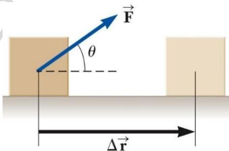

Hình 7.1 Một vật dịch chuyển dưới tác dụng của một lực không đổi.

F is the only force that does work on the block in this situation.

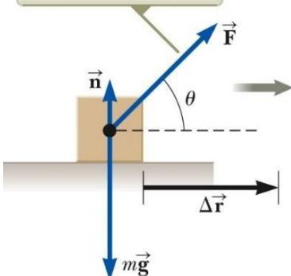

Hình 7.2 Phản lực pháp tuyến và trọng lực không sinh công, chỉ có lực $F ^ {  }$ âm? (d) không thể xác định được?

<table><tr><td rowspan="3">Ai</td><td>VIETTEL AI RACE</td><td>C TD131</td></tr><tr><td>Nǎng luong cúa mòt he</td><td>Làn ban hành: 1</td></tr><tr><td></td><td></td></tr></table>

Hình 7.3 Hình cho câu hỏi 7.2.

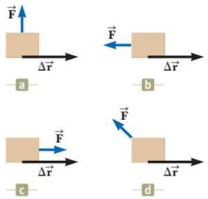  
sinh công.

<table><tr><td rowspan=2 colspan=1>Ai</td><td rowspan=1 colspan=1>VIETTEL AI RACE           C</td><td rowspan=1 colspan=1>TD131</td></tr><tr><td rowspan=1 colspan=1>Nǎng luong cua mot hè</td><td rowspan=1 colspan=1>Làn ban hành: 1</td></tr></table>

Câu hỏi 7.2: Trên hình 7.3, các lực có độ lớn bằng nhau, quãng đường dịch chuyển của vật sang phải bằng nhau. Hãy sắp xếp theo thứ tự giá trị của công do lực thực hiện trên vật từ dương nhất đến âm nhất.

# Tích vô hướng 2 vectơ

Tích vô hướng của hai vectơ $\vec { \pmb { \mathsf { A } } }$ và B , được kí hiệu là A B và có giá trị bằng:

$$
\vec { \bf A } \cdot \vec { \bf B } \equiv A B c o s \theta
$$

Với $\theta$ là góc giữa hai vectơ $\vec { \pmb { \mathsf { A } } }$ và B

Tích vô hướng có tính chất giao hoán:

$$
\vec { \pmb { \Delta } } \cdot \vec { \pmb { \mathrm { B } } } = \vec { \pmb { \mathrm { B } } } \cdot \vec { \pmb { \Delta } }
$$

và tính chất kết hợp:

$$
\vec { \mathbf { A } } \cdot \left( \vec { \mathbf { B } } + \vec { \mathbf { C } } \right) = \vec { \mathbf { A } } \cdot \vec { \mathbf { B } } + \vec { \mathbf { A } } \cdot \vec { \mathbf { C } }
$$

Áp dụng vào công thức tính công, ta được:

$$
W = F \Delta r \cos \theta = \vec { \mathsf { F } } \cdot \Delta \vec { \mathsf { r } }
$$

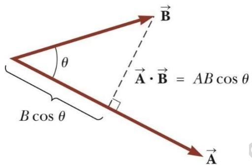  
Hình 7.4 Tích vô hướng 2 vectơ.

# Công được thực hiện bởi lực có độ lớn thay đổi

Để sử dụng công thức $\mathrm { W } = \mathrm { F } \Delta \mathrm { r c o s } \ \theta$ lực phải không đổi, do đó công thức này không thể sử dụng cho việc tính công của một lực biến thiên. Giả sử rằng trong khoảng dịch chuyển rất nhỏ $\Delta \mathbf { x }$ , $\mathrm { F _ { x } }$ là hằng số thì trong khoảng đó $\mathrm { W } = \mathrm { F } _ { \mathrm { x } } \Delta \mathbf { x }$ . Vì vậy, trên cả quãng đường dịch chuyển từ vị trí đầu $\mathbf { X } \mathbf { i }$ đến vị trí cuối $\mathbf { X } \mathbf { f }$ thì:

$$
W \approx \sum _ { x _ { i } } ^ { x _ { t } } F _ { x } \Delta x
$$

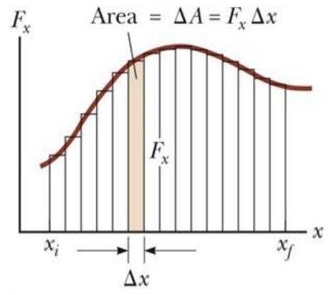

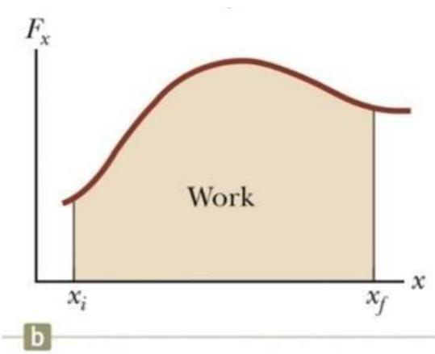

<table><tr><td rowspan=2 colspan=1>Ai</td><td rowspan=1 colspan=1>VIETTEL AI RACE           O</td><td rowspan=1 colspan=1>TD131</td></tr><tr><td rowspan=1 colspan=1>Nǎng luong cua mòt he</td><td rowspan=1 colspan=1>Làn ban hành: 1</td></tr></table>

# Thế năng của một hệ

Bây giờ chúng ta hãy xem xét một hệ gồm nhiều hơn một vật mà các vật bên trong hệ tương tác lực với nhau. Ví dụ, một hệ gồm cuốn sách và Trái đất, hai vật này tương tác với nhau bằng lực hấp dẫn. Ta sẽ thực hiện một công trên cuốn sách bằng cách nâng quyển sách thật chậm theo phương thẳng đứng, cuốn sách đã có một dời chuyển

$$
\Delta \vec { \bf r } = \left( y _ { \it f } - y _ { i } \right) \hat { \bf l }
$$

Công thực hiện trên hệ phải xuất hiện như là sự tăng năng lượng của hệ. Vì trước và sau khi thực hiện công, quyển sách đều $\acute { \mathbf { O } }$ trạng thái nghỉ nên động năng của hệ không có sự thay đổi. Như vậy, năng lượng cung cấp cho hệ từ bên ngoài phải tồn trữ ở một dạng khác động năng của hệ. Khi cuốn sách được thả rơi hệ có động năng; như vậy, trước khi cuốn sách được thả rơi hệ phải có một khả năng (potential) để thu được động năng. Ta gọi cơ chế tích trữ năng lượng trước khi cuốn sách được thả rơi là thế năng (potential energy).

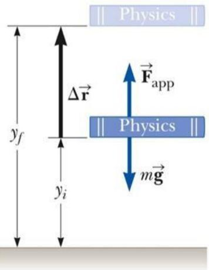  
Hình 7.10 Tác nhân bên ngoài nâng từ từ cuốn sách $\acute { o }$ độ cao $h _ { i }$ lên độ cao hf.

Thế năng là dạng năng lượng được xác định bởi cấu hình của một hệ mà trong đó các thành phần của hệ tương tác với nhau bằng các lực. Các lực này là nội lực của hệ, chỉ liên quan đến tương tác giữa các thành phần của hệ với nhau. Thế năng luôn gắn liền với một hệ của 2 hay nhiều vật tương tác lẫn nhau.

<table><tr><td rowspan=2 colspan=1>Ai</td><td rowspan=1 colspan=1>VIETTEL AI RACE</td><td rowspan=1 colspan=1>TD131</td></tr><tr><td rowspan=1 colspan=1>Nǎng lrong cúa mòt hè</td><td rowspan=1 colspan=1>Làn ban hành: 1</td></tr></table>

# 7.6.1 Thế năng hấp dẫn

Xét hệ gồm Trái Đất và cuốn sách như hình vẽ. Cuốn sách có khối lượng m đang nằm tại độ cao yi so với bề mặt Trái đất. Một tác nhân bên ngoài hệ nâng cuốn sách lến độ cao yf một cách chậm chạp để dịch chuyển không có gia tốc và do đó lực nâng có độ lớn bằng lực hấp dẫn mà Trái đất tác dụng lên cuốn sách. Công mà lực ngoài thực hiện trên hệ Cuốn sách - Trái đất là:

$$
\begin{array} { r l } & { W _ { e x t } = \left( \vec { \mathsf { F } } _ { \mathrm { a p p } } \right) \cdot \Delta \vec { \mathsf { r } } } \\ & { W _ { e x t } = ( m g \mathsf { \hat { J } } ) \cdot \left[ \left( y _ { t } - y _ { i } \right) \mathsf { \hat { J } } \right] } \\ & { W _ { e x t } = m g y _ { t } - m g y _ { i } } \end{array}
$$

Phương trình trên cho thấy công của ngoại lực thực hiện trên hệ bằng hiệu số giữa hai giá trị cuối và đầu của một đại lượng. Công này đã truyền cho hệ một năng lượng và năng lượng đó tích trữ ở một dạng được gọi là thế năng. Đại lượng mgy được gọi là thế năng hấp dẫn $U _ { g }$ của hệ vật khối lượng m và Trái đất.

$$
U _ { g } = m g y
$$

Thế năng là một đại lượng vô hướng. Đơn vị của thế năng là joules (J).

Công có thể làm thay đổi thế năng hấp dẫn của hệ

$$
{ \cal W } _ { \mathrm { e x t } } = \varDelta U _ { g }
$$

Thế năng hấp dẫn là năng lượng liên kết với một vật, phụ thuộc vào độ cao của vật đó trên bề mặt của Trái Đất. Thế năng hấp dẫn chỉ phụ thuộc vào độ cao của vật so với bề mặt Trái Đất. Khi giải các bài toán, chúng ta cần phải chọn một mốc quy chiếu sao cho thế năng hấp dẫn tại đó bằng một giá trị tham chiếu nào đó, thường là bằng 0. Việc chọn lựa mốc thế năng là tùy ý. Thông thường một vật nằm trên bề mặt của Trái Đất được xem như có thế năng hấp dẫn bằng 0. Hoặc các bài toán sẽ đề xuất một mốc thế năng để sử dụng.

Câu hỏi 7.4: Hãy chọn câu trả lời đúng: Thế năng hấp dẫn của một hệ (a) luôn luôn dương.   
(b) luôn luôn âm. (c) có thể âm hoặc dương.

# 7.6.2 Thế năng đàn hồi

Thế năng đàn hồi là một loại năng lượng mà một hệ có lò xo sẽ tích trữ. Khi đó lực tương tác giữa các thành phần bên trong hệ là lực đàn hồi của lò xo.

Xét hệ gồm có một vật và một lò xo như trên hình vẽ. Lực đàn hồi lò xo tác dụng lên cái hộp là

$$
F _ { s } = - \mathit { k x }
$$

Công thực hiện bởi ngoại lực Fapp tác dụng lên hệ lò xo - hộp là:

$$
\mathrm { W } _ { \mathrm { e x t } } = \% k x _ { f } ^ { 2 } - \% k x _ { i } ^ { 2 }
$$

<table><tr><td rowspan=2 colspan=1>Ai</td><td rowspan=1 colspan=1>VIETTEL AI RACE            C</td><td rowspan=1 colspan=1>TD131</td></tr><tr><td rowspan=1 colspan=1>Nǎng luong cúa mòt he</td><td rowspan=1 colspan=1>Làn ban hành: 1</td></tr></table>

Trong $\mathtt { d } \mathtt { d } \mathtt { d } \mathtt { X } \mathtt { i }$ và xf là vị trí đầu và cuối của vật tính từ vị trí cân bằng $\mathbf { \boldsymbol { x } } = 0$ . Công này bằng với độ chênh lệch giữa giá trị đầu và giá trị cuối của một đại lượng gắn với cấu hình của hệ. Do đó thế năng đàn hồi của hệ vật - lò xo có thể được xác định bởi hệ thức:

<table><tr><td rowspan=2 colspan=1>Ai</td><td rowspan=1 colspan=1>VIETTEL AI RACE           C</td><td rowspan=1 colspan=1>TD131</td></tr><tr><td rowspan=1 colspan=1>Nǎng luong cúa mot hè</td><td rowspan=1 colspan=1>Làn ban hành: 1</td></tr></table>

$$
U _ { s } = \% k x ^ { 2 }
$$

Lúc đó ta cũng có phương trình:

$$
{ \cal W } _ { \mathrm { e x t } } = \varDelta U _ { s }
$$

Thế năng đàn hồi có thể hiểu là năng lượng dự trữ trong một lò xo bị biến dạng. Năng lượng dự trữ này có thể chuyển hóa thành động năng. Quan sát sự biến dạng của lò xo, có thể nhận thấy: Thế năng đàn hồi dự trữ trong lò xo bằng 0 khi lò xo không biến dạng $\mathrm { { { U } _ { s } } = 0 }$ khi x $= 0$ ); năng lượng được dự trữ trong lò xo chỉ khi lò xo bị giãn hay nén; thế năng đàn hồi lớn nhất khi lò xo đạt đến độ nén hoặc độ giãn lớn nhất; thế năng đàn hồi luôn luôn dương bởi vì $\mathbf { X } ^ { 2 }$ luôn dương.

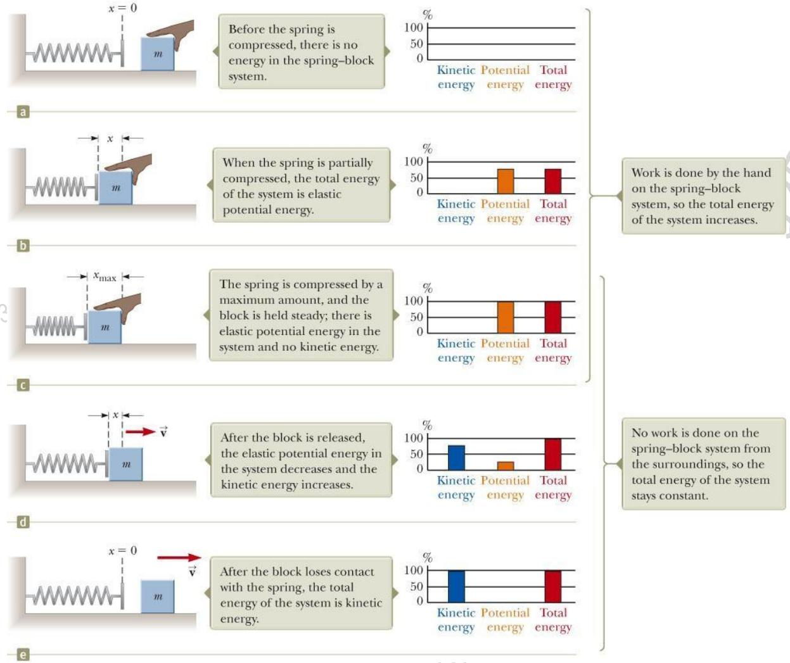  
Hình 7.11 Sự biến đổi năng lượng giữa thế năng đàn hồi và động năng của hệ.

Trên hình 7.11 là một biểu diễn đồ thị quan trọng về năng lượng của một hệ, được gọi là biểu đồ thanh năng lượng. Biểu đồ thanh năng lượng là một đồ thị quan trọng để biểu diễn thông tin về năng lượng của hệ. Trên biểu đồ thanh năng lượng, trục tung biểu diễn giá trị năng lượng, trục hoành cho thấy các loại năng lượng có trong hệ.

<table><tr><td rowspan=2 colspan=1>Ai</td><td rowspan=1 colspan=1>VIETTEL AI RACE</td><td rowspan=1 colspan=1>TD131</td></tr><tr><td rowspan=1 colspan=1>Nǎng luong cúa mòt hè</td><td rowspan=1 colspan=1>Làn ban hành: 1</td></tr></table>

Trong hình 7.11a, không có năng lượng nào cả, bởi vì lò xo đang thả lỏng còn hộp thì không chuyển động.

Trong hình 7.11b và c, tác nhân bên ngoài thực hiện công trên hệ. Do lò xo bị nén lại nên có thế năng đàn hồi trong hệ. Không có động năng trong hệ vì hộp vẫn đang được giữ

Trong hình 7.11d, hộp được thả ra cho chuyển động về phía bên phải trong khi vẫn tương tác với lò xo. Do đó, thế năng đàn hồi của hệ giảm trong khi động năng của hệ tăng.

Trong hình 7.11e, lò xo trở về chiều dài ban đầu và hệ chỉ còn động năng do sự chuyển động của cái hộp.

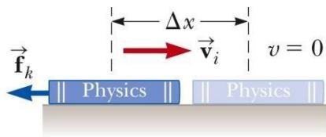

Câu hỏi 7.5: Một trái banh gắn với một lò xo nhẹ được treo thẳng đứng như hình 7.12. Khi kéo trái banh xuống dưới khỏi vị trí cân bằng rồi thả ra thì trái banh sẽ dao động lên xuống.

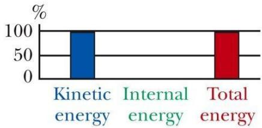

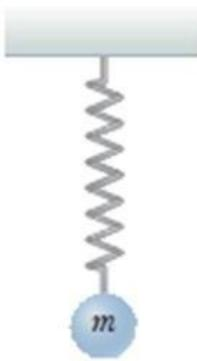  
Hình 7.12 Câu hỏi 7.5.

(i) Nếu hệ gồm trái banh, lò xo và Trái đất thì có những dạng năng lượng nào trong quá trình chuyển động đó: (a)

động năng và thế năng đàn hồi (b) động năng và thế năng hấp dẫn (c) động năng, thế năng đàn hồi và thế năng hấp dẫn (d) thế năng đàn hồi và thế năng hấp dẫn.

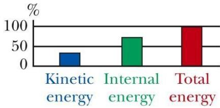

(ii) Nếu hệ gồm trái banh và lò xo thì có những dạng năng lượng nào trong quá trình chuyển động đó: (a) động năng và thế năng đàn hồi (b) động năng và thế năng hấp dẫn (c) động năng, thế năng đàn hồi và thế năng hấp dẫn (d) thế năng đàn hồi và thế năng hấp dẫn.

# Lực bảo toàn và lực không bảo toàn

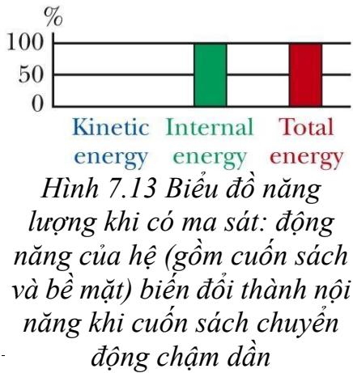

Trong phần này ta sẽ tìm hiểu một loại năng lượng có thể tồn trữ trong một hệ. Loại năng lượng đó liên hệ với nhiệt độ của hệ, được gọi là nội năng, $E _ { \mathrm { i n t . } }$ Trong ví dụ trên hình 7.13, giả sử ta dùng tay tác dụng lực gia tốc cuốn sách trượt sang phải trên một bề mặt của một chiếc bàn nặng. Ở đây, bề mặt có ma sát nên sau khi thôi tác dụng lực thì cuốn sách sẽ chuyển động chậm lại rồi dừng hẳn. Xét hệ chỉ là bề mặt mà cuốn sách trượt trên đó. Lực ma sát mà cuốn sách tác dụng lên bề mặt thực hiện công. Khi cuốn sách chuyển động sang bên phải, lực ma sát tác dụng lên bề mặt hướng sang phải và điểm đặt lực cũng dịch chuyển sang phải. Do đó công thực hiện trên bề mặt là dương nhưng bề mặt không dịch chuyển sau khi cuốn sách ngừng trượt. Công thực hiện trên hệ là công dương song cả động năng và thế năng của hệ không thay đổi. Vậy năng lượng đó nằm ở đâu?

<table><tr><td rowspan=2 colspan=1>Ai</td><td rowspan=1 colspan=1>VIETTEL AI RACE</td><td rowspan=1 colspan=1>TD131</td></tr><tr><td rowspan=1 colspan=1>Nǎng luong cúa mòt hè</td><td rowspan=1 colspan=1>Làn ban hành: 1</td></tr></table>

<table><tr><td rowspan=2 colspan=1>Ai</td><td rowspan=1 colspan=1>VIETTEL AI RACE</td><td rowspan=1 colspan=1>TD131</td></tr><tr><td rowspan=1 colspan=1>Nǎng luong cúa mòt hè</td><td rowspan=1 colspan=1>Làn ban hành: 1</td></tr></table>

Từ kinh nghiệm hằng ngày, có thể nhận biết rằng khi cuốn sách trượt trên bề mặt thì sẽ làm bề mặt nóng lên. Như vậy, công thực hiện trên hệ đã làm nóng hệ lên mà không tăng tốc độ hay thay đổi cấu hình của hệ. Người ta gọi năng lượng liên hệ với nhiệt độ của hệ là nội năng, ký hiệu là $E _ { \mathrm { i n t . } }$ Trong trường hợp này, ma sát đã thực hiện công trên bề mặt, truyền cho hệ một năng lượng dưới dạng nội năng còn động năng và thế năng của hệ vẫn giữ nguyên không thay đổi.

Bây giờ, ta xét hệ gồm có cuốn sách và bề mặt. Ban đầu hệ có động năng vì cuốn sách đang di chuyển. Trong khi cuốn sách trượt trên bề mặt thì nội năng của hệ tăng lên vì cả cuốn sách và bề mặt đều ấm hơn trước đó. Khi cuốn sách dừng lại, động năng của hệ đã chuyển hóa hoàn toàn thành nội năng của hệ. Ở đây, lực ma sát – một lực không bảo toàn, tác dụng giữa các thành phần của hệ đã chuyển hóa động năng của hệ thành nội năng.

# 7.7.1 Lực bảo toàn (lực thế)

Công thực hiện bởi một lực tác dụng lên một chất điểm làm chất điểm này chuyển động giữa hai điểm mà không phụ thuộc vào quỹ đạo chuyển động của chất điểm đó thì lực này được gọi là lực bảo toàn (lực thế). Do đó, công thực hiện bởi lực bảo toàn tác dụng lên một chất điểm chuyển động trên một quỹ đạo kín bằng 0. Quỹ đạo kín là quỹ đạo mà điểm đầu trùng với điểm cuối.

Lực hấp dẫn và lực đàn hồi là những ví dụ điển hình của lực bảo toàn.

Thế năng của một hệ gắn liền với một lực bảo toàn nào đó tác dụng giữa các thành phần của hệ đó. Một cách tổng quát, công $\mathrm { W _ { i n t } }$ được thực hiện bởi một lực bảo toàn do một thành phần của hệ tác dụng lên một thành phần khác của hệ khi cấu hình của hệ thay đổi sẽ bằng hiệu thế năng của hệ tại vị trí đầu và vị trí cuối.

$$
{ { W } _ { i n t } } = { { U } _ { i } } - { { U } _ { f } } \mathrm { = - } \Delta U
$$

The work done in moving the book is greater along the brown path than along the blue path.

Khi động năng và nội năng của hệ không thay đổi trong một quá trình thì công dương thực hiện bởi một tác nhân bên ngoài $\mathrm { W _ { e x t } }$ trong trình đó sẽ làm tăng thế năng của hệ. Trong khi đó, công do một thành phần của hệ thực hiện $\mathrm { W _ { i n t } }$ bởi lực bảo toàn bên trong một hệ cô lập là nguyên nhân làm giảm th $\acute { \mathrm { e } }$ năng của hệ.

# 7.7.2 Lực không bảo toàn (lực phi thế)

Các lực không thỏa mãn các điều kiện của lực bảo toàn được gọi là lực không bảo toàn. Công thực hiện bởi một lực không bảo toàn phụ thuộc vào quãng đường dịch chuyển.

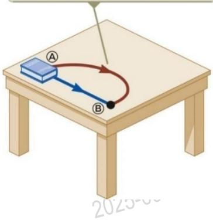

Lực không bảo toàn tác dụng bên trong hệ sẽ làm biến đổi cơ năng Emech của hệ.

<table><tr><td rowspan=2 colspan=1>Ai</td><td rowspan=1 colspan=1>VIETTEL AI RACE</td><td rowspan=1 colspan=1>TD131</td></tr><tr><td rowspan=1 colspan=1>Nǎng luong cúa mòt he</td><td rowspan=1 colspan=1>Làn ban hành: 1</td></tr></table>