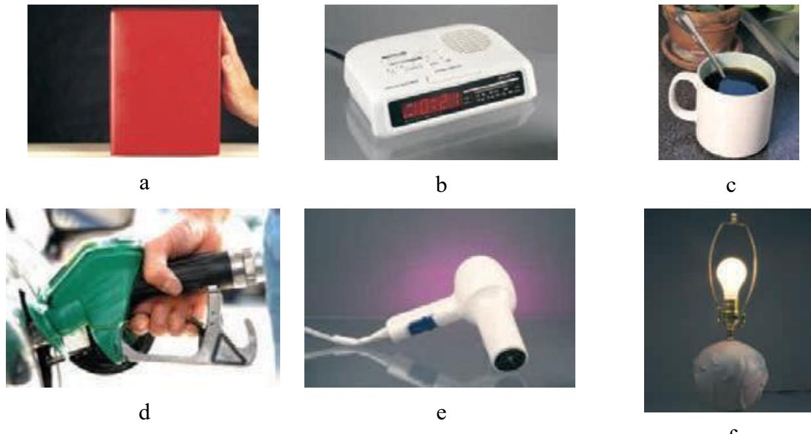
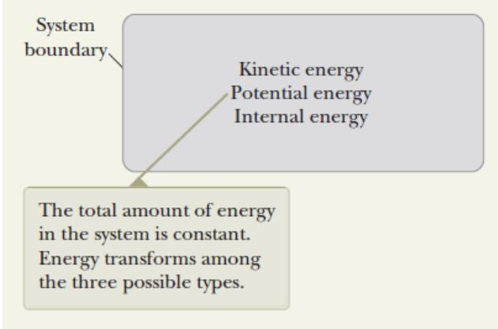

<table><tr><td rowspan=2 colspan=1>Ai</td><td rowspan=1 colspan=1>VIETTEL AI RACE</td><td rowspan=1 colspan=1>TD132</td></tr><tr><td rowspan=1 colspan=1>Dinh luàt båo toàn nǎng luong</td><td rowspan=1 colspan=1>Làn ban hành: 1</td></tr></table>

# Hệ không cô lập

Hệ không cô lập về năng lượng là một hệ có trao đổi năng lượng với môi trường qua biên giới của nó. Một hệ không cô lập sẽ tương tác với môi trường. Một vật bị tác dụng lực là một ví dụ của hệ không cô lập.

Hệ cô lập là một hệ không trao đổi năng lượng với môi trường qua biên giới của hệ.

Đối với một hệ không cô lập, năng lượng được truyền qua biên giới của hệ trong thời gian hệ tương tác với môi trường bên ngoài. Sau đây là những phương thức truyền năng lượng vào hoặc ra khỏi một hệ.

Công (Work) là một hình thức truyền năng lượng bằng cách tác dụng lực lên hệ và điểm đặt của lực bị dịch chuyển (hình 8.1a).

  
Hình 8.1 Các cơ chế truyền năng lượng.

Sóng cơ (Mechanical waves) là hình thức truyền năng lượng thông qua sự lan truyền nhiễu loạn trong môi trường. Âm thanh rời khỏi chiếc loa radio ở hình 8.1b hay sóng địa chấn, sóng biển là sự truyền năng lượng bằng sóng cơ.

Nhiệt (Heat) là một cơ chế trao đổi năng lượng giữa hệ và môi trường do có sự khác nhau về nhiệt độ. Năng lượng truyền tới đuôi cái thìa trong hình 8.1c từ phần bị nhúng trong tách cà phê nóng là dưới dạng nhiệt.

<table><tr><td rowspan="3">xi</td><td>VIETTEL AI RACE</td><td>TD132</td></tr><tr><td>Dinh luàt báo toàn nǎng luong</td><td>Làn ban hành: 1</td></tr><tr><td></td><td></td></tr></table>

Trao đổi chất (Matter transfer) là hình thức truyền năng lượng xuyên qua biên giới của hệ dưới dạng vật chất mang theo năng lượng. Ví dụ đổ xăng cho xe như ở hình 8.1d hay đối lưu là sự truyền năng lượng dưới dạng trao đổi chất.

Truyền điện (Electrical transmission) là sự truyền năng lượng vào hoặc ra khỏi hệ bằng dòng điện. Năng lượng cung cấp cho máy sấy tóc là nhờ sự truyền điện (hình 8.1e).

Sóng điện từ (Electromagnatic radiation) là năng lượng được trao đổi bởi sóng điện từ. Năng lượng truyền khỏi bóng đèn (hình 8.1f) là dưới dạng sóng điện từ.

Định luật bảo toàn năng lượng

# Năng lượng luôn được bảo toàn.

Điều này nghĩa là nếu năng lượng tổng cộng của một hệ thay đổi thì đã có một năng lượng truyền qua biên giới của hệ bằng một phương pháp trao đổi năng lượng nào đó. Dạng tổng quát của định luật bảo toàn năng lượng có thể được biểu diễn bằng phương trình bảo toàn năng lượng như sau:

$$
\begin{array} { l } { \Delta E _ { \mathrm { { s y s t e m } } } = \Sigma T } \\ { \ } \\ { \varDelta E s y s t e m = \sum T } \end{array}
$$

Trong đó, Esystem là tổng năng lượng của hệ, $T$ (Transfer) là năng lượng truyền qua biên giới của hệ.

Phương trình toán học của định luận bảo toàn năng lượng đối với một hệ không cô lập thể hiện đầy đủ các loại năng lượng trao đổi có thể được biểu diễn dưới dạng:

$$
{ \cal A } K + { \cal A } { \cal U } + { \cal A } { \cal E } _ { i n t } = { \cal W } + { \cal Q } + T _ { M W } + T _ { M T } + T _ { E T } + T _ { E R }
$$

Với K là động năng, U là thế năng và $\operatorname { E i n t }$ là nội năng của hệ; năng lượng truyền qua biên giới của hệ dưới dạng công là $T _ { \mathrm { w o r k } } = W _ { \mathrm { : } }$ , dưới dạng nhiệt là $T _ { \mathrm { h e a t } } = Q ,$ , TMW là năng lượng được truyền bởi sóng cơ, TMT là năng lượng trao đổi chất, $\mathrm { T _ { E T } }$ là năng lượng do truyền điện và TER là năng lượng trao đổi bởi sóng điện từ.

Trong thực tế, phương trình của định luật bảo toàn năng lượng sẽ đơn giản hơn nhiều. Ví dụ, nếu có một lực tác dụng lên hệ và sinh công và giả sử chỉ có cơ chế truyền năng lượng này làm thay đổi tốc độ của hệ thì phương trình của định luật bảo toàn năng lượng sẽ rút về phương trình của định lý công-động năng:

$$
\varDelta K = W
$$

Câu hỏi 8.1: Hãy cho biết cơ chế truyền năng lượng nào qua một hệ là: a- Một chiếc tivi, bMột máy cắt cỏ chạy xăng, c- Một cái gọt bút chì bằng tay.

Câu hỏi 8.2: Xét một cái hộp trượt có ma sát trên một bề mặt nằm ngang. i) Nếu hệ là chiếc hộp thì hệ là a- cô lập, b- không cô lập, c- không thể xác định được. ii) Nếu hệ là bề mặt nằm ngang thì hệ là a- cô lập, b- không cô lập, c- không thể xác định

<table><tr><td rowspan=2 colspan=1>Ai</td><td rowspan=1 colspan=1>VIETTEL AI RACE</td><td rowspan=1 colspan=1>TD132</td></tr><tr><td rowspan=1 colspan=1>Dinh luàt báo toàn nǎng luong</td><td rowspan=1 colspan=1>Làn ban hành: 1</td></tr></table>

được.

iii) Nếu hệ là cái hộp và bề mặt nằm ngang thì hệ là a- cô lập, b- không cô lập, c- không thể xác định được.

# Hệ cô lập

Đối với một hệ cô lập, không có bất kỳ hình thức trao đổi năng lượng nào với môi trường bên ngoài qua biên giới của hệ, thì tất cả các số hạng bên vế phải trong phương trình (8.2) đều bằng 0 do đó phương trình của định luật bảo toàn năng lượng có dạng:

Trên hình vẽ bên dưới mô tả các dạng năng lượng tồn trữ bên trong một hệ cô lập gồm có động năng, thế năng và nội năng. Các dạng năng lượng này biến đổi lẫn nhau nhưng tổng năng lượng của hệ bảo toàn.

Hình 8.2 Các dạng năng lượng tồn trữ bên trong hệ.

Esystem là tổng động năng, thế năng và nội năng của hệ.

Như vậy, năng lượng của một hệ cô lập không đổi.

# Công suất

Định nghĩa: Công suất tức thời là tốc độ truyền năng lượng theo thời gian và được tính theo công thức:

$$
P \equiv \frac { d E } { d t }
$$

Nếu năng lượng trao đổi dưới dạng công được thực hiện bởi một lực và trong khoảng thời gian t công do lực sinh ra là W thì công suất trung bình $\mathrm { P _ { a v g } }$ được xác định bởi công thức:

$$
P _ { a v g } = \frac { W } { \Delta t }
$$

<table><tr><td rowspan="3">xi</td><td>VIETTEL AI RACE</td><td>TD132</td></tr><tr><td></td><td>Làn ban hành: 1</td></tr><tr><td>Dinh luàt báo toàn nǎng luong</td><td></td></tr></table>

Công suất tức thời là giới hạn của công suất trung bình khi Δt tiến tới 0.

<table><tr><td rowspan=2 colspan=1>xi</td><td rowspan=1 colspan=1>VIETTEL AI RACE</td><td rowspan=1 colspan=1>TD132</td></tr><tr><td rowspan=1 colspan=1>Dinh luàt båo toàn nǎng luong</td><td rowspan=1 colspan=1>Làn ban hành: 1</td></tr></table>

# Đơn vị

Trong hệ đơn vị SI, đơn vị của công suất là watt (W).

1 watt $= 1$ joule/second = 1 kg.m2/s3

Một đơn vị công suất hay sử dụng nữa tại Mỹ là mã lực (horsepower – hp)

$$
1 \mathrm { h p } = 7 4 6 \mathrm { W }
$$

Một đơn vị của năng lượng thường bị nhầm lẫn với đơn vị công suất là kWh. Nhớ rằng kWh là đơn vị đo năng lượng, được xác định như sau:

$$
1 \ { \mathrm { k W h } } = 1 { \mathrm { k W . l h } } = ( 1 0 0 0 \ { \mathrm { W } } ) ( 3 6 0 0 \ { \mathrm { s } } ) = 3 . 6 \ { \mathrm { x } } 1 0 ^ { 6 } \ { \mathrm { J } }
$$

# Tóm tắt chương 8

Hệ không cô lập về năng lượng là một hệ có trao đổi năng lượng với môi trường qua biên giới của nó.

Hệ cô lập là một hệ không trao đổi năng lượng với môi trường qua biên giới của hệ.

Định luật bảo toàn năng lượng: Năng lượng của một hệ cô lập là không đổi.

Một lực ma sát có độ lớn fk tác dụng trên một quãng đường d thì nội năng của hệ thay đổi một lượng:

$$
\Delta \mathrm { E } _ { \mathrm { i n t } } = \mathrm { f } _ { \mathrm { k } } . \mathrm { d }
$$

Công suất là tốc độ truyền năng lượng theo thòi gian:

$$
P \equiv { \frac { d E } { d t } }
$$

Phương trình của định luật bảo toàn năng lượng đối với hệ không cô lập

$$
\bar { \Delta } \mathrm { E } _ { \mathrm { s y s t e m } } = \Sigma \mathrm { T }
$$

$$
{ \cal A } K + { \cal { A } } { \cal U } + { \cal { A } } { \cal E } _ { i n t } = { \cal W } + { \cal Q } + { \cal T } _ { M W } + { \cal T } _ { M T } + { \cal T } _ { E T } + { \cal T } _ { E R }
$$

Phương trình của định luật bảo toàn năng lượng đối với hệ cô lập

$$
\Delta \mathrm { E } _ { \mathrm { s y s t e m } } = 0
$$

$$
\Delta \mathrm { K } + \Delta \mathrm { U } + \Delta \mathrm { E i n t } = 0
$$

Nếu các lực tác dụng bên trong hệ đều là lực bảo toàn thì ta có định luật bảo toàn cơ năng

$$
\begin{array} { c } { { \Delta \mathrm { E } _ { \mathrm { m e c h } } = 0 } } \\ { { \Delta \mathrm { K } + \Delta \mathrm { U } = 0 } } \end{array}
$$