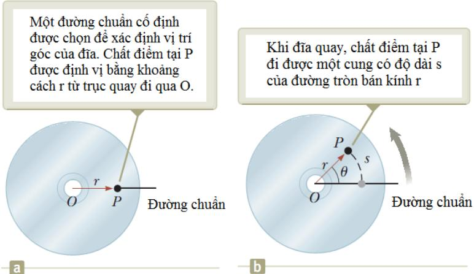
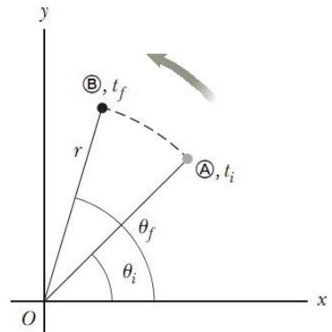
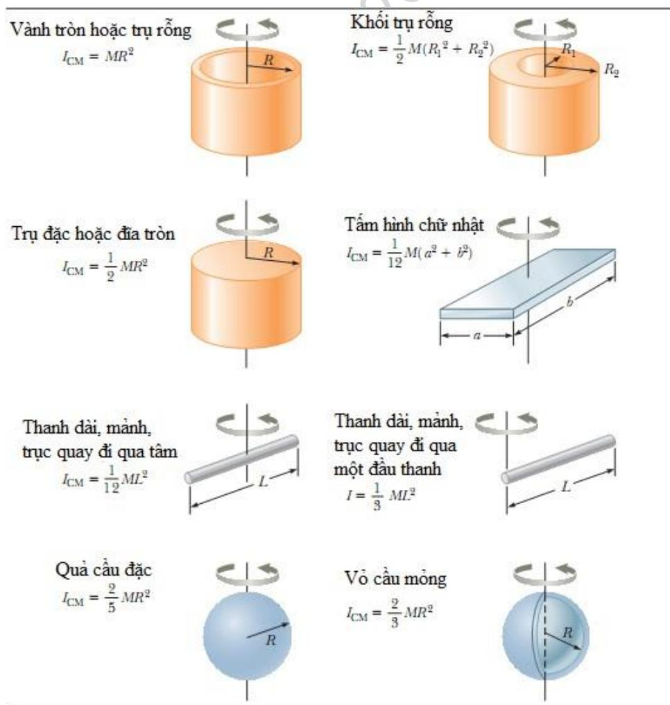
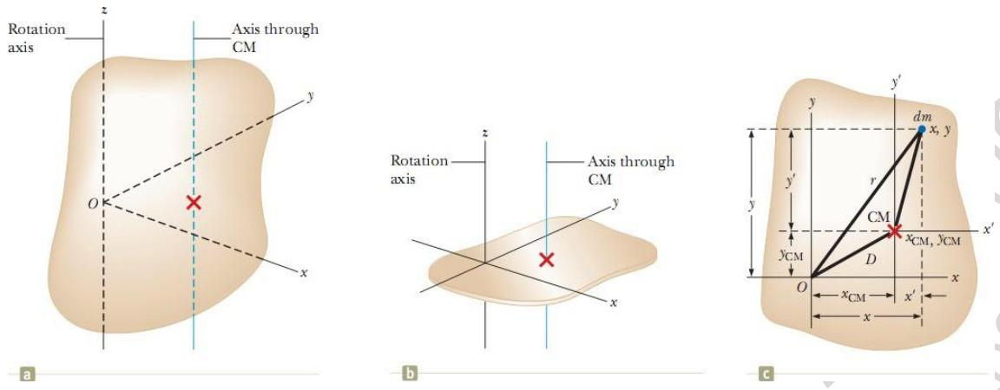
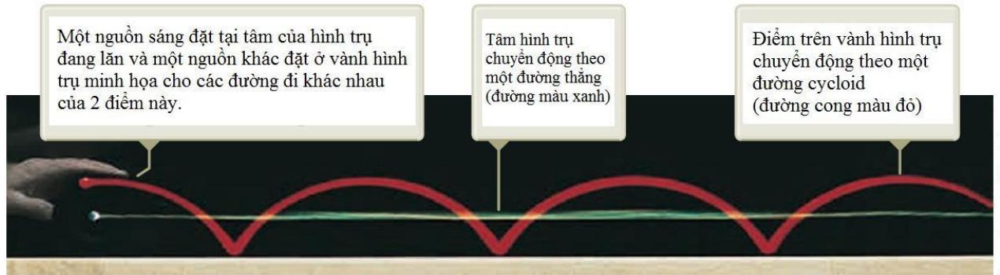
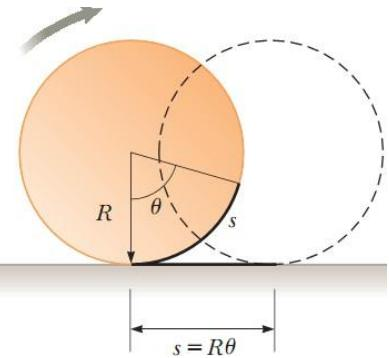
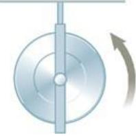
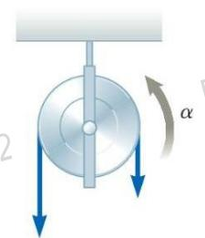

Trong chương này ta sẽ phân tích kĩ chuyển động quay của một vật rắn, cụ thể là phân tích mô hình vật rắn quay với gia tốc góc không đổi, từ đó dẫn ra các phương trình động lực học của mô hình này. Lưu ý, vật rắn là vật không bị biến dạng, tức là vị trí tương đối của các chất điểm cấu tạo nên hệ luôn không đổi. Mọi vật thể thực tế đều bị biến dạng ở mức độ nào đó; tuy nhiên, trong các phân tích dưới đây ta bỏ qua sự biến dạng của vật.

# Tọa độ góc, vận tốc góc và gia tốc góc

Hình 10.1 minh họa một đĩa CD đang quay quanh trục cố định vuông góc với mặt phẳng hình vẽ và đi qua tâm O của đĩa. Một yếu tố nhỏ của đĩa được mô hình hóa như một chất điểm tại P, cách gốc O một khoảng cố định r và quay quanh O theo một vòng tròn bán kính r.

Ta biểu diễn vị trí của P theo tọa độ cực $( r , \theta )$ , với r là khoảng cách từ gốc tọa độ tới $P$ , $\theta$ là góc quay ngược chiều kim đồng hồ từ một đường cố định được chọn làm mốc (đường chuẩn) như trên hình 10.1. Góc $\theta$

  
Hình 10.1 Một đĩa compact quay quanh trục cố định qua $O$ và vuông góc với mặt phẳng hình vẽ

thay đổi theo thời gian, còn r không thay đổi. Khi chất điểm chuyển động dọc theo đường tròn bắt đầu từ đường chuẩn $\theta = 0$ , nó chuyển động qua một cung có độ dài s như trên hình 10.1b. Ta có:

$$
\begin{array} { l } { { s = r \theta } } \\ { { \theta = \displaystyle \frac { s } { r } } } \end{array}
$$

Vì $\theta$ là tỉ số giữa độ dài của cung và bán kính của đường tròn nên nó là một số thuần túy (không có đơn vị). Tuy nhiên, ta thường cho đơn vị (giả) của $\theta$ là radian (rad).

Tọa độ góc θ: Vì đĩa là một vật rắn nên khi chất điểm tại P chuyển động quét qua một góc $\theta$ tính từ đường chuẩn thì mỗi yếu tố khác của vật cũng quay và quét qua một góc ??. Nên ta có thể liên kết góc $\theta$ với toàn bộ vật, cũng như liên kết với từng chất điểm riêng biệt, cho phép xác định tọa độ góc của vật rắn trong chuyển động quay. Chọn một đường chuẩn trên vật thì tọa độ góc của vật rắn là góc $\theta$ giữa đường chuẩn này và một đường chuẩn cố định khác (thường là trục x). Tọa độ góc θ trong chuyển động quay đóng vai trò tương tự như vị trí x trong chuyển động tịnh tiến.

Khi chất điểm đang xét chuyển động từ vị trí A tới vị trí B trong khoảng thời gian $\Delta t$ như trên hình 10.2, đường chuẩn gắn với vật quét được một góc $\Delta \theta = \theta _ { f } - \theta _ { i }$ . Đại lượng $\Delta \theta$ này được gọi là độ dời góc của vật rắn:

$$
\Delta \theta \equiv \theta _ { f } - \theta _ { i }
$$

Nếu vật rắn quay nhanh, độ dời này diễn ra trong một khoảng thời gian ngắn. Nếu vật rắn quay chậm, độ dời này diễn ra trong một khoảng thời gian dài hơn. Các tốc độ quay khác nhau được định lượng bởi khái niệm tốc độ góc trung bình $\omega _ { a v g }$ , là tỉ số giữa độ dời góc của vật rắn và khoảng thời gian $\Delta t$ diễn ra độ dời đó:

$$
\omega _ { a v g } = { \frac { \theta _ { f } - \theta _ { i } } { t _ { f } - t _ { i } } } = { \frac { \Delta \theta } { \Delta t } }
$$

Tốc độ góc tức thời $\pmb { \omega }$ được xác định bằng giới hạn của tốc độ góc trung bình khi $\Delta t  0$ :

Hình 10.2 Chất điểm trên vật rắn quay từ (A) tới $( B )$ dọc theo

$$
\omega \equiv \operatorname* { l i m } _ { \Delta t \to 0 } { \frac { \Delta \theta } { \Delta t } } = { \frac { d \theta } { d t } }
$$

cung tròn. Trong khoảng $\Delta t =$ $t _ { f } - t _ { i } ,$ r quét qua một góc

Đơn vị tốc độ góc là rad/s, có thể viết là $\mathbf { S } ^ { - 1 }$ vì rad không có thứ nguyên. ?? dương khi $\theta$ tăng (chuyển động cùng chiều kim đồng hồ), $\omega$ âm khi $\theta$ giảm (chuyển động ngược chiều kim đồng hồ)

Tính mômen quán tính của các vật rắn có hình dạng đơn giản (có tính đối xứng cao) là tương đối dễ với điều kiện trục quay trùng với một trục đối xứng, như trình bày trong mục 10.6 tiếp theo.

  
Bảng 10.2: Mômen quán tính của các vật rắn đồng nhất có hình dạng khác nhau

Câu hỏi 10.5: Bạn tắt máy khoan điện và thấy rằng khoảng thời gian để cho mũi khoan dừng lại do mômen lực ma sát trong máy khoan là  t. Bạn thay một mũi khoan lớn hơn có mômen quán tính gấp đôi. Khi mũi khoan lớn hơn này đang quay với tốc độ góc như cái nhỏ lúc đầu và khoan được ngắt điện, mômen lực ma sát vẫn giữ nguyên như trường hợp mũi khoan nhỏ. Khoảng thời gian để mũi khoan lớn hơn dừng lại là (a) 4 t (b) 2 t (b) t (c) 0.5 t (d) 0.25

t (f) không thể xác định được.

# Định lý các trục song song:

Việc tính mômen quán tính đối với một trục quay bất kì là khó khăn, ngay cả với vật có tính đối xứng cao. Ta có thể dùng định lí các trục song song để đơn giản hóa sự tính toán. Giả sử vật trên hình 10.14a quay quanh trục z. Mômen quán tính không phụ thuộc sự phân bố khối lượng dọc trục z. Tưởng tượng làm bẹp một vật thể 3 chiều thành một vật thể 2 chiều như trên hình 10.14b. Trong quá trình này tất cả khối lượng chuyển động song song với trục z cho đến khi nó nằm trong mặt phẳng xy. Các tọa độ khối tâm của vật lúc này là xCM, yCM, $\begin{array} { r } { z _ { \mathrm { C M } } = 0 . } \end{array}$ . Xét phần tử khối lượng dm có các tọa độ (x, ${ \mathrm { y } } , 0 )$ như $\dot { \mathbf { O } }$ hình 10.14c khi nhìn từ trên trục z xuống. Vì phần tử này cách trục z một khoảng $\dot { r } = \sqrt { x ^ { 2 } + y ^ { 2 } }$ , nên mômen quán tính của vật đối với trục z là:

$$
\begin{array} { r } { I = \int r ^ { 2 } d m = \int ( x ^ { 2 } + y ^ { 2 } ) \ d m } \end{array}
$$

Trong đó tốc độ góc thay đổi từ $\omega _ { i }$ đến $\omega _ { f }$ . Phương trình (10.27) là định lý công-động năng đối với chuyển động quay. Định lý này phát biểu rằng công do ngoại lực thực hiện lên vật rắn đối xứng đang quay quanh trục cố định thì bằng độ biến thiên động năng quay của vật.

Định lý này là một dạng của mô hình hệ không cô lập (năng lượng) đã thảo luận trong chương 8. Công thực hiện lên hệ vật rắn biểu thị sự truyền năng lượng qua biên của hệ do sự tăng động năng quay của vật.

Tổng quát, có thể tổ hợp định lí này với định lí công-động năng trong chuyển động tịnh tiến ở chương 7. Cho nên công do ngoại lực thực hiện lên vật bằng độ biến thiên động năng toàn phần gồm động năng tịnh tiến và động năng quay của vật. Ví dụ khi một cầu thủ ném quả bóng thì công thực hiện bởi tay của cầu thủ lên quả bóng bằng động năng do quả bóng chuyển động trong không gian và động năng quay của quả bóng.

Ngoài định lí công-động năng, các nguyên lí năng lượng khác cũng áp dụng được cho chuyển động quay. Ví dụ vật đang quay và không có các lực không bảo toàn tác dụng lên hệ thì có thể dùng mô hình hệ cô lập và nguyên lí bảo toàn cơ năng để phân tích hệ. Độ biến thiên động năng trong phương trình bảo toàn năng lượng 8.2 sẽ gồm cả độ biến thiên động năng tịnh tiến và độ biến thiên động năng quay.

Trong một số trường hợp, nếu cách tiếp cận năng lượng không đủ thông tin để giải bài toán thì phải kết hợp với cách tiếp cận động lượng. Một trường hợp như vậy được minh họa trong ví dụ 10.14 trong mục 10.9.

Bảng 10.3 liệt kê các phương trình liên quan đến chuyển động quay cùng với các công thức tương ứng của chuyển động tịnh tiến. Lưu ý đến sự giống nhau về dạng toán học của các phương trình. Hai phương trình cuối cùng ở cột bên trái của bảng 10.3 liên quan đến mômen động lượng L sẽ được trình bày trong chương 11. Ở đây chúng được đưa vào với mục đích làm hoàn chỉnh bảng các công thức chuyển động quay và chuyển động tịnh tiến.

# Chuyển động lăn của vật rắn

Trong mục này ta xét chuyển động của vật rắn lăn trên mặt phẳng. Ví dụ, xét một khối trụ lăn trên một đường thẳng sao cho trục quay của nó luôn song song với hướng lúc đầu của nó. Như hình 10.18 cho thấy, một điểm trên vành của hình trụ chuyển động theo một đường phức tạp gọi là cycloid. Tuy nhiên ta đơn giản hóa vấn đề bằng cách chú ý đến khối tâm của vật hơn là điểm trên vành của vật đang lăn. Như thấy trên hình 10.18, khối tâm của vật chuyển động theo đường thẳng. Nếu một vật lăn không trượt trên mặt phẳng (gọi là chuyển động lăn thuần túy) thì tồn tại một mối liên hệ đơn giản giữa chuyển động tịnh tiến và chuyển động quay của nó.

  
Hình 10.18 Hai điểm trên một vật đang lăn có quỹ đạo khác nhau trong không gian

Xét một khối trụ đồng nhất có bán kính R lăn không trượt trên một mặt phẳng nằm ngang (hình 10.19).

Khi trụ quay được một góc $\theta$ thì khối tâm của nó đi được một đoạn $s = R \theta$ . Do đó, tốc độ chuyển động tịnh tiến của khối tâm là:

$$
v _ { C M } = { \frac { d s } { d t } } = R { \frac { d \theta } { d t } } = R \omega
$$

trong đó $\omega$ là tốc độ góc của hình trụ. Phương trình 10.28 đúng khi khối trụ hoặc khối cầu lăn không trượt và là điều kiện đối với chuyển động lăn thuần túy.

Độ lớn gia tốc tịnh tiến của khối tâm là:

Hình 10.19 Đối với chuyển

động lăn thuần túy, khi hình trụ quay được một góc ?? thì khối tâm của nó đi được một

trong đó ?? là gia tốc góc của khối trụ.

đoạn thẳng $s = R \theta$

Tốc độ góc tức thời của chất điểm chuyển động trên đường tròn hoặc của vật rắn quay quanh trục cố định là

$$
\omega = { \frac { d \theta } { d t } }
$$

Gia tốc góc tức thời của chất điểm chuyển động trên đường tròn hoặc của vật rắn quay quanh trục cố định là

$$
\alpha = { \frac { d \omega } { d t } }
$$

Khi vật rắn quay quanh một trục cố định, các phần của vật có cùng tốc độ góc và gia tốc góc.

Độ lớn của mômen lực liên quan đến lực $\cal F ^ { \sharp }$ tác dụng lên vật tại điểm cách trục quay một khoảng r là:

$$
\tau = r F \sin \varphi = F d
$$

Trong đó $\varphi$ là góc giữa vectơ vị trí của điểm chịu tác dụng của lực và vectơ lực, d là cánh tay đòn của lực, là khoảng cách vuông góc từ trục quay tới giá của lực $\boldsymbol { F } ^ { \sharp }$ .

Mômen quán tính của một hệ chất điểm được định nghĩa là:

$$
I \equiv \sum _ { i } m _ { i } r _ { \imath } ^ { 2 }
$$

Trong đó $\mathbf { m } _ { \mathrm { i } }$ là khối lượng của chất điểm thứ i, ${ \bf { r } } _ { \mathrm { { i } } }$ là khoảng cách từ chất điểm đó đến trục quay.

# Khái niệm và nguyên lý

Khi vật rắn quay quanh trục cố định thì vị trí góc, tốc độ góc và gia tốc góc liên hệ với vị trí, tốc độ dài và gia tốc dài qua các mối liên hệ sau:

$$
\begin{array} { c } { s = r \theta } \\ { v = r \omega } \\ { a _ { t } = r \alpha } \end{array}
$$

Nếu vật rắn quay quanh trục cố định với tốc độ góc $\omega$ , động năng quay của nó là:

$$
K _ { R } = { \frac { 1 } { 2 } } I \omega ^ { 2 }
$$

trong đó I là mômen quán tính của vật đối với trục quay.

Mômen quán tính của vật rắn là:

$$
\begin{array} { r } { I = \int r ^ { 2 } d m } \end{array}
$$

Trong đó r là khoảng cách từ phần tử khối lượng dm đến trục quay.

Tốc độ sinh công của ngoại lực khi làm quay vật rắn quanh $\mathrm { m } \hat { \mathrm { 0 t } }$ trục cố định, hoặc công suất được cung cấp là:

Nếu công thực hiện lên vật rắn và kết quả duy nhất là làm quay vật rắn quanh một trục cố định thì công do các ngoại lực thực hiện khi làm quay vật bằng độ biến thiên động năng quay của vật:

$$
\Sigma W = { \frac { 1 } { 2 } } I \omega _ { f } ^ { 2 } - { \frac { 1 } { 2 } } I \omega _ { i } ^ { 2 }
$$

Động năng toàn phần của một vật rắn lăn không trượt trên mặt phẳng nghiêng thì bằng động năng quay quanh khối tâm của nó cộng với động năng tịnh tiến của khối tâm:

$$
K = \overline { { { \frac { 1 } { 2 } } } } I _ { C M } \omega ^ { 2 } + \overline { { { \frac { 1 } { 2 } } } } \overline { { { M v _ { C M } ^ { 2 } } } }
$$

# Các mô hình phân tích

# Vật rắn quay với gia tốc góc không đổi

Nếu một vật rắn quay quanh trục cố định với gia tốc góc không đổi, có thể áp dụng các phương trình động học tương tự các phương trình động học của chuyển động tịnh tiến với gia tốc không đổi:

α=constant

$$
\begin{array} { c } { \omega _ { f } = \omega _ { i } + \alpha t } \\ { \theta _ { _ { f } } = \theta _ { _ { i } } + \omega _ { _ { i } } t + \displaystyle \frac { 1 } { 2 } \alpha t ^ { 2 } } \end{array}
$$

$$
\begin{array} { c } { { \omega _ { f } ^ { 2 } = \omega _ { i } ^ { 2 } + 2 \alpha ( \theta _ { f } - \theta _ { i } ) } } \\ { { { } } } \\ { { \theta _ { f } = \theta _ { i } + \displaystyle \frac { 1 } { 2 } ( \omega _ { i } + \omega _ { f } ) t } } \end{array}
$$

# Vật rắn quay dưới tác dụng của mômen lực tổng hợp

Nếu vật rắn quay tự do quanh trục cố định và có các mômen ngoại lực tác dụng lên nó, thì vật có gia tốc góc $\alpha$ , trong đó:

$$
\sum \tau _ { e x t } = I \alpha
$$

Phương trình này trong chuyển động quay tương tự như định luật 2 Newton trong mô hình chất điểm chịu tác dụng của hợp lực.

