<table><tr><td rowspan=2 colspan=1>Ai</td><td rowspan=1 colspan=1>VIETTEL AI RACE      V</td><td rowspan=1 colspan=1>TD135</td></tr><tr><td rowspan=1 colspan=1>Momen dong lrong</td><td rowspan=1 colspan=1>Làn ban hành: 1</td></tr></table>

Chủ đề trung tâm của chương này là mômen động lượng, là đại lượng đóng vai trò quan trọng trong động lực học chuyển động quay. Tương tự như nguyên lý bảo toàn động lượng, ta cũng có nguyên lý bảo toàn mômen động lượng. Mômen động lượng của một hệ cô lập là không đổi. Đối với mômen động lượng, một hệ cô lập là một   
hệ không có các mômen ngoại lực tác dụng lên hệ. Nếu có mômen ngoại lực tác dụng lên hệ thì hệ đó không cô lập. Giống như định luật bảo toàn động lượng, định luật bảo toàn mômen động lượng là một định luật cơ bản của vật lý, nó cũng có giá trị đối với các hệ tương đối và lượng tử.

# Tích vectơ và mômen lực

Điều quan trọng khi xác định mômen động lượng là nhân 2 vectơ bằng toán tử tích có hướng.

Xét lực $F ^ {  }$ tác dụng lên chất điểm tại vị trí vectơ $r ^ {  }$ (hình 11.1). Như đã biết trong mục 10.6, độ lớn của mômen lực của lực này đối với một trục quay đi qua $\mathrm { g } \acute { \mathrm { o c } }$ là $r F$ sin $\varphi$ , trong đó $\varphi$ là góc giữa các vectơ $r ^ {  }$ và $F ^ {  }$ . Trục mà lực $F ^ {  } \acute { \mathbf { o } }$ xu hướng tạo ra chuyển động quay quanh nó là trục vuông góc với mặt phẳng tạo bởi các vectơ $r ^ {  }$ và $F ^ {  }$ .

Vectơ mômen lực $\tau ^ {  }$ được liên kết với các vectơ $r ^ {  }$ và $\vec { F }$ Ta có thể thiết lập một mối liên hệ toán học giữa $\tau ^ {  }$ , $r ^ {  }$ và $\vec { F }$ bởi một toán tử được gọi là tích vectơ:

$$
\vec { \tau ^ { \mathrm { ~ } } } = \vec { r ^ { \mathrm { ~ ~ } } } \times \vec { F ^ { \mathrm { ~ ~ } } }
$$

Bây giờ ta đưa ra một định nghĩa chính thức của tích vectơ. Cho trước hai vectơ $A ^ {  }$ và $B ^ {   }$ bất kì, tích vectơ $A ^ {  } \times \vec { B }$ được định nghĩa như là vectơ thứ ba $C ^ {  }$ có độ lớn bằng ??⃗??⃗⃗ sin $\theta$ , trong đó $\theta$ là góc giữa hai vectơ $A ^ {  }$ và $B ^ {   }$ . Tức $C ^ {  }$ $\boldsymbol { C } ^ {  } = \boldsymbol { A } ^ {  } \times \boldsymbol { B } ^ {  }$ là $C =$ $A B$ sin $\theta$ .

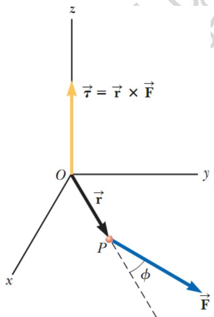

Hình 11.1: Vectơ mômen lực $\vec { \tau }$ hướng vuông góc với mặt phẳng tạo bởi vectơ vị trí ??⃗ và vectơ lực tác dụng $F ^ {  }$ . Trên hình vẽ này, ??⃗ và $F ^ {  }$ nằm trong mặt phẳng xy, nên mômen lực dọc theo trục z.

# Mô hình phân tích : $\mathbf { H } \hat { \mathbf { e } }$ không cô lập (mômen động lượng)

Hình dung một cái cột được dựng lên trên một hồ nước đóng băng (hình 11.3). Một người trượt băng trượt nhanh $\mathbf { v } \dot { \hat { \mathbf { e } } }$ phía cái cột, theo hướng hơi lệch sang bên để không va vào cái cột.

<table><tr><td rowspan=2 colspan=1>Ai</td><td rowspan=1 colspan=1>VIETTEL AI RACE      V</td><td rowspan=1 colspan=1>TD135</td></tr><tr><td rowspan=1 colspan=1>Momen dong lurong</td><td rowspan=1 colspan=1>Làn ban hành: 1</td></tr></table>

Khi cô ta trượt ngang qua cái cột, cô ta chìa tay ra bên hông và túm lấy cái cột. Hành động này làm cho cô ta chuyển động tròn xung quanh cái cột. Giống như ý tưởng về động lượng giúp ta phân tích chuyển động tịnh tiến, một sự tương tự trong chuyển động quay, mômen

Bây giờ ta có thể viết (11.9) như sau:

Mo men dōng luong $\vec { L }$ cia chát dièm dói vói truc quay là mòt vecto vuòng góc vói cà vecto vi trí $\vec { r }$ và dōng luong $\dot { P }$ cúa nó.

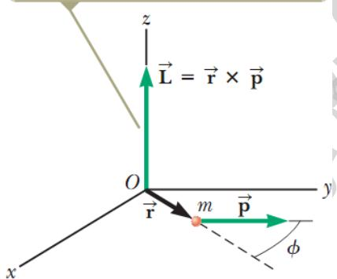  
Hình 11.4: Mômen động lượng $\vec { L }$ của chất điểm là một véctơ cho bởi $\scriptstyle { \vec { L } } = { \vec { r } } \times { \vec { p } }$

<table><tr><td rowspan=2 colspan=1>Ai</td><td rowspan=1 colspan=1>VIETTEL AI RACE      V•</td><td rowspan=1 colspan=1>TD135</td></tr><tr><td rowspan=1 colspan=1>Momen dong lrong</td><td rowspan=1 colspan=1>Làn ban hành: 1</td></tr></table>

# Mômen động lượng của hệ chất điểm

Dùng các kỹ thuật như trong mục 9.7, ta có thể chỉ ra rằng định luật 2 Newton đối với hệ chất điểm là:

$$
\sum \stackrel {  } { F } _ { e x t } = \frac { d \stackrel {  } { P } _ { t o t } } { d t }
$$

Phương trình này cho thấy tổng ngoại lực tác dụng lên hệ chất điểm thì bằng tốc độ biến thiên theo thời gian của động lượng toàn phần của hệ.

Ta hãy xem một phát biểu tương tự như vậy có thể được thực hiện đối với chuyển động quay hay không. Mômen động lượng toàn phần của hệ chất điểm đối với một trục quay nào đó được xác định bằng tổng véctơ mômen động lượng của từng chất điểm riêng biệt:

$$
L _ { t o t } = L _ { 1 } + L _ { 2 } + L _ { 3 } + . . . + L _ { n } = \sum L _ { i }
$$

trong đó tổng vectơ được lấy trên toàn bộ n chất điểm của hệ.

Lấy đạo hàm biểu thức này theo thời gian ta có:

$$
\frac { d L _ { t o t } } { d t } = \sum \frac { d L _ { i } } { d t } = \sum \vec { \tau _ { i } }
$$

Ở đây ta đã dùng phương trình (11.11) để thay thế tốc độ biến thiên theo thời gian của mômen động lượng của mỗi chất điểm với mômen lực tác dụng lên mỗi chất điểm.

<table><tr><td rowspan=2 colspan=1>Ai</td><td rowspan=1 colspan=1>VIETTEL AI RACE      V</td><td rowspan=1 colspan=1>TD135</td></tr><tr><td rowspan=1 colspan=1>Momen dong lrong</td><td rowspan=1 colspan=1>Làn ban hành: 1</td></tr></table>

Phương trình này trong chuyển động quay tương tự với phương trình $\sum { \vec { F _ { e x t } } } = \frac { d P _ { t o t } } { d t }$ đối

với hệ chất điểm. Phương trình 11.13 là biểu diễn toán học của sự diễn tả $\mathrm { m } \hat { \mathrm { o } }$ hình hệ không cô lập mômen động lượng. Nếu hệ không cô lập theo nghĩa có mômen lực tác dụng lên nó, thì mômen lực bằng tốc độ biến thiên theo thời gian của mômen động lượng.

Mặc dù ta không chứng minh ở đây, nhưng phát biểu này là đúng bất kể chuyển động của khối tâm. Nó có thể áp dụng ngay cả khi khối tâm đang gia tốc, miễn là mômen lực và mômen động lượng được đánh giá so với một trục quay đi qua khối tâm.

Sắp xếp lại phương trình 11.13 và lấy tích phân ta được

$$
\int ( \sum _ { \tau } \vec { \tau } _ { \ e x t } ) d t = \Delta L _ { _ { t o t } }
$$

Phương trình này trong chuyển động quay tương tự với phương trình của định lí xung lực-động lượng của hệ chất điểm (9.40). Phương trình này biểu diễn định lí xung lượng của mômen lực- mômen động lượng.

# Mômen động lượng của vật rắn quay

Trong ví dụ 11.4, ta đã khảo sát mômen động lượng của một hệ có thể biến dạng. Bây giờ ta sẽ tập trung sự chú ý vào hệ không biến dạng, gọi là vật rắn. Xét vật rắn quay quanh một trục cố định trùng với trục z của hệ tọa độ như chỉ ra trên hình 11.7.

Ta hãy xác định mômen động lượng của vật này. Mỗi chất điểm của vật này quay trong một mặt phẳng xy quanh trục z với tần số góc  . Độ lớn của mômen động lượng của

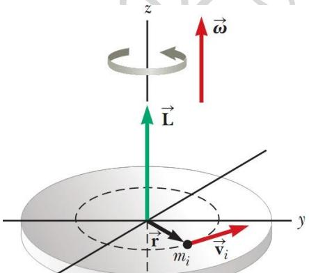

Hình 11.7: Khi vật rắn quay quanh trục, mômen động lượng $\vec { L }$ cùng hướng với vectơ vận tốc góc $\vec { \omega }$ , theo mối liên hệ $\vec { L } = I \vec { \omega }$

<table><tr><td rowspan=2 colspan=1>Ai</td><td rowspan=1 colspan=1>VIETTEL AI RACE      V</td><td rowspan=1 colspan=1>TD135</td></tr><tr><td rowspan=1 colspan=1>Momen dong lrong</td><td rowspan=1 colspan=1>Làn ban hành: 1</td></tr></table>

# Mô hình phân tích: hệ cô lập (mômen động lượng)

Trong chương 9 ta đã thấy rằng động lượng toàn phần của một hệ chất điểm là không đổi nếu hệ cô lập, tức là khi ngoại lực tác dụng lên hệ bằng không. Trong chuyển động quay, ta cũng có một định luật bảo toàn tương tự:

“Mômen động lượng toàn phần của một hệ không đổi cả độ lớn và hướng (bảo toàn) nếu tổng mômen ngoại lực tác dụng lên hệ bằng không, hoặc hệ cô lập“.

Phát biểu này thường được gọi là nguyên lý bảo toàn mômen động lượng và là cơ sở cho cách diễn tả mômen động lượng của mô hình hệ cô lập.

# Chuyển động hồi chuyển và các con cù

Một kiểu chuyển động khác lạ và hấp dẫn có thể bạn đã biết là con cù quay quanh trục đối xứng của nó như trên hình 11.13a. Nếu con cù quay nhanh, trục đối xứng của nó quay quanh trục z, vẽ ra một hình nón, (Hình 11.13b). Chuyển động của trục đối xứng xung quanh trục thẳng đứng, được biết tới như là chuyển động tiến động, thường là chậm so với chuyển động quay của con cù.

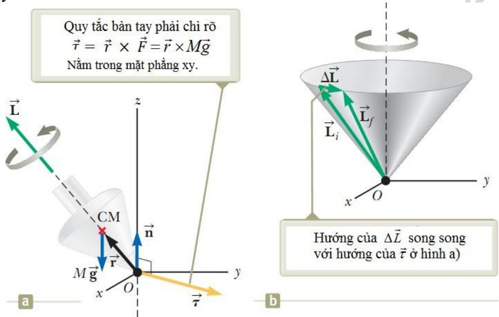  
Hình 11.13. Chuyển động tiến động của con cù quay quanh trục đối xứng của nó. a) Các ngoại lực tác dụng lên con cù chỉ là phản lực pháp tuyến n và trọng lực $M \vec { g }$ . Hướng của mômen động lượng L dọc theo trục đối xứng. b) Vì $\vec { L } _ { f } = \Delta \vec { L } + \vec { L } _ { i }$ nên con cù tiến động quanh

Câu hỏi nảy sinh một cách tự nhiên ở đây là tại sao con cù không bị đổ xuống. Vì khối tâm của nó không ở ngay trên điểm trụ O, nên có một mômen lực tác dụng lên con cù đối với trục quay đi qua O, mômen lực này gây bởi trọng lực Mg . Con cù sẽ đổ xuống nếu như nó không quay. Tuy nhiên vì nó quay, nên nó có một mômen động lượng $L$ hướng dọc theo trục đối xứng của nó. Ta sẽ chỉ ra rằng trục đối xứng này chuyển động xung quanh trục z (xảy ra chuyển động tiến động) vì mômen lực làm cho hướng của trục đối xứng thay đổi. Sự minh họa này là một ví dụ tuyệt vời về tầm quan trọng của bản chất véctơ của mômen động lượng.

<table><tr><td rowspan=2 colspan=1>Ai</td><td rowspan=1 colspan=1>VIETTEL AI RACE      V-</td><td rowspan=1 colspan=1>TD135</td></tr><tr><td rowspan=1 colspan=1>Momen dong lrong</td><td rowspan=1 colspan=1>Làn ban hành: 1</td></tr></table>

<table><tr><td rowspan=2 colspan=1>Ai</td><td rowspan=1 colspan=1>VIETTEL AI RACE      V</td><td rowspan=1 colspan=1>TD135</td></tr><tr><td rowspan=1 colspan=1>Momen dong lrong</td><td rowspan=1 colspan=1>Làn ban hành: 1</td></tr></table>

Biểu thức này chỉ ra rằng trong khoảng thời gian vô cùng nhỏ dt, mômen lực gây ra một độ biến thiên mômen động lượng $d \vec { L }$ , cùng hướng với  . Do đó, giống như véctơ mômen lực, dL cũng phải vuông góc với $\vec { L }$ . Hình 11.14c minh họa chuyển động tiến động của trục đối xứng của con quay. Trong khoảng thời gian dt, độ biến thiên mômen động lượng là $d \vec { L } = \vec { L _ { f } } - \vec { L _ { i } } = \tau \vec { d t }$ . Vì dL vuông góc với $\vec { L } ^ { \vec { \mathbf { \Phi } } }$ , nên độ lớn của $\bar { L }$ không thay đổi, $\left| \vec { L } _ { f } \right| = \left| \vec { L } _ { i } \right|$ . Hơn nữa, sự thay đổi chỉ là hướng của $\vec { L }$ . Vì sự thay đổi mômen động lượng dL là theo hướng của  , nằm trong mặt phẳng xy, nên con quay hồi chuyển chịu chuyển động tiến động.

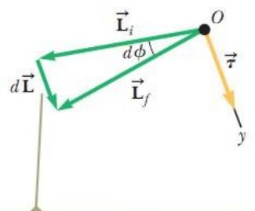

Trong hrc Mg theo chièu am cia truc z, gày ra mò men hrc len con quay theo chièu durong cia truc y dóivói dièm try.

Mò men lrc gày ra dò bièn thièn mò men dòng lrong di cia con quay theo huóng song song vói mò men luc. Truc cùa con quay quét durgc góc $d \phi$ trong khoàng thòi gian dt.

Hình 11.14. a) Một con quay hồi chuyển được đặt trên một cái trụ ở đầu mút bên phải. b) Giản đồ đối với con quay chỉ ra các lực, mômen lực và mômen động lượng. c) Nhìn từ trên xuống (dọc theo trục z) các vectơ mômen động lượng của con quay tại thời điểm đầu và cuối của khoảng thời gian rất ngắn dt.

Để đơn giản hóa sự mô tả hệ, giả sử mômen động lượng toàn phần của bánh xe tiến động là tổng của mômen động lượng I do quay và mômen động lượng do chuyển động của khối tâm so với trục đứng. Trong cách xử lý này, ta bỏ qua phần đóng góp của chuyển động của khối tâm và lấy mômen động lượng toàn phần chỉ là I . Trong thực hành, sự xấp xỉ này là tốt khi  lớn.

Giản đồ véctơ trên hình 11.14c cho thấy rằng trong khoảng thời gian dt, véctơ mômen động lượng quay được một góc $d \phi$ , cũng là góc mà con quay hồi chuyển quay được. Từ tam

<table><tr><td rowspan=2 colspan=1>Ai</td><td rowspan=1 colspan=1>VIETTEL AI RACE       V</td><td rowspan=1 colspan=1>TD135</td></tr><tr><td rowspan=1 colspan=1>Momen dong lrong</td><td rowspan=1 colspan=1>Làn ban hành: 1</td></tr></table>

Chia cả 2 vế cho dt và dùng công thức L = I ta thấy rằng tốc độ trục xe quay đối với trục thẳng đứng là:

$$
\mathfrak { O } _ { P } = \frac { d \Phi } { d t } = \frac { \mathbf { M } \mathbf { g r } _ { \mathrm { C M } } } { \mathrm { I } \odot }
$$

Tần số góc ${ \mathfrak { O } } _ { P }$ gọi là tần số tiến động. Kết quả này chỉ đúng khi ${ \mathfrak { O } } _ { P } < < { \mathfrak { O } }$ . Nếu không, sẽ liên quan đến một chuyển động phức tạp hơn nhiều. Như bạn có thể thấy từ phương trình (11.20), điều kiện ${ \mathfrak { O } } P < < { \mathfrak { O } }$ thỏa mãn khi  rất lớn, tức là khi bánh xe quay rất nhanh. Hơn nữa, chú ý rằng tần số tiến động suy giảm khi  tăng, tức là khi bánh xe quay càng nhanh quanh trục đối xứng của nó.

Một ví dụ về con quay hồi chuyển, giả sử bạn đang ở trên một con tàu vũ trụ trong không gian xa xôi, và bạn cần thay đổi quỹ đạo của tàu. Để lái động cơ chạy đúng hướng, bạn cần phải xoay tàu vũ trụ. Tuy nhiên, làm thế nào để bạn xoay con tàu vũ trụ trong không gian trống rỗng? Cách thứ nhất là phải có các động cơ tên lửa nhỏ bắn ra vuông góc với tàu, cung cấp một mômen lực đối với khối tâm của tàu. Một cơ cấu như vậy là đáng mong muốn, và nhiều tàu vũ trụ có các tên lửa như vậy.

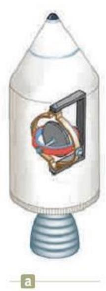  
Hình 11.15. a) Tàu vũ trụ mang theo một con quay đang đứng yên chưa quay.

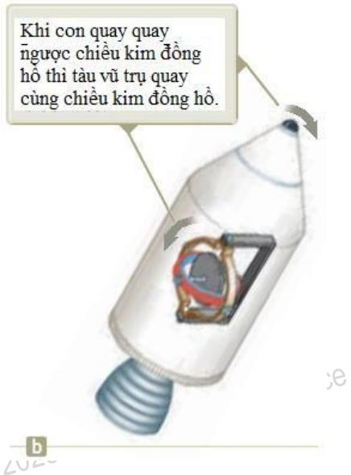  
b) Con quay được điều khiển cho quay.

<table><tr><td rowspan=2 colspan=1>Ai</td><td rowspan=1 colspan=1>VIETTEL AI RACE      V-</td><td rowspan=1 colspan=1>TD135</td></tr><tr><td rowspan=1 colspan=1>Momen dong lrong</td><td rowspan=1 colspan=1>Làn ban hành: 1</td></tr></table>

Tuy nhiên, ta hãy khảo sát phương pháp khác liên quan tới mômen động lượng, và không đòi hỏi tiêu thụ nhiên liệu tên lửa. Giả sử tàu vũ trụ mang một con quay hồi chuyển không quay như trên hình 11.15a. Trong trường hợp này, mômen động lượng của tàu vũ trụ đối với khối tâm của nó bằng không. Giả sử con quay được làm cho quay, cung cấp cho nó một mômen động lượng khác không. Không có mômen ngoại lực tác dụng lên hệ cô lập (tàu vũ trụ-con quay), cho nên mômen động lượng của hệ này phải bằng không theo mô hình hệ cô lập (mômen động lượng). Mômen động lượng của hệ bằng không nếu tàu vũ trụ quay theo chiều ngược với chiều quay của con quay sao cho véc tơ mômen động lượng của tàu và của con quay khử lẫn nhau. Kết quả của việc làm cho con quay quay như trên hình 11.15b là tàu quay vòng. Bằng cách bố trí ba con quay theo ba trục vuông góc với nhau, có thể thu được sự quay mong muốn trong không gian.

<table><tr><td rowspan=2 colspan=1>Ai</td><td rowspan=1 colspan=1>VIETTEL AI RACE      V</td><td rowspan=1 colspan=1>TD135</td></tr><tr><td rowspan=1 colspan=1>Momen dong lrong</td><td rowspan=1 colspan=1>Làn ban hành: 1</td></tr></table>

Hiệu ứng này tạo ra một tình huống không mong muốn đối với tàu Voyager 2 trong chuyến bay của nó. Tàu này đã mang một máy ghi âm (dùng băng) mà phần guồng (ống) của nó quay ở tốc độ rất cao. Mỗi lần máy thu băng được bật lên, guồng tác dụng như một con quay hồi chuyển và tàu bị quay theo hướng ngược lại. Sự quay này đã được Trung tâm điều khiển tàu (Mission Control) dùng các vòi phun bắn về một phía để dừng sự quay.

Câu hỏi 11.1: Cho hai quả cầu đặc và rỗng cùng khối lượng và bán kính. Chúng chuyển động quay cùng tốc độ góc. Hỏi quả cầu nào có mômen động lượng lớn hơn:

(a) Quả cầu đặc.   
(b) Quả cầu rỗng.   
(c) Bằng nhau.   
(d) Không thể xác định.

Câu hỏi 11.2: Một người thợ lặn lao ra từ tàu xuống nước với cơ thể duỗi thẳng và quay chậm. Hỏi động năng quay của cô ấy sẽ như thế nào:

(a) Tăng lên.   
(b) Giảm đi.   
(c) Không đổi.   
(d) Không thể xác định.   
Mômen động lượng $\vec { L }$ đối với một trục quay đi qua gốc O của chất điểm có động lượng   
${ \vec { p } } = m { \vec { \nu } }$ là $L \equiv { \stackrel {  } { \mathbf { r } } } \times { \stackrel {  } { \mathbf { p } } } ( 1 1 . 1 0 )$   
trong đó $\vec { r }$ là véc tơ vị trí của chất điểm so với gốc O.

<table><tr><td rowspan="3">Ai</td><td>VIETTEL AI RACE V</td><td>TD135</td></tr><tr><td>Momen dong lrong</td><td>Làn ban hành: 1</td></tr><tr><td></td><td></td></tr></table>

<table><tr><td>τ = r^ × F^(11.1)</td></tr></table>

# Khái niệm và nguyên lý

Thành phần z của mômen động lượng của một vật rắn đang quay đối với một trục z cố định   
là $L _ { z } = { \cal I } \omega$ (11.14)   
trong đó I là mômen quán tính của vật rắn đối với trục quay và  là tốc độ góc của nó.

# Mô hình phân tích để giải bài toán

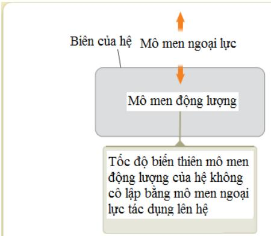

He khòng cò làp (mò men dòng luong). Néu hè tuong tuong tác vói mòi trròng theo nghia có mò men ngoai luc tác dung lèn he, thi mò men ngoai lyc tác dung lèn hè bàng tōc do bién thièn theo thòi gian cua mò men dòng lrong cia he:

$$
\sum { \vec { \tau } } _ { \mathrm { e x t } } = { \frac { d { \vec { \mathbf { L } } } _ { \mathrm { t o t } } } { d t } }
$$

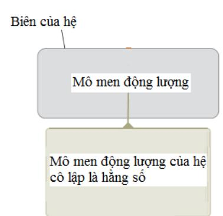

$\mathbf { H } \hat { \mathbf { e } }$ cò làp (mò men dòng luong). Néu hè khòng chiu tác dung cùa $\mathrm { m } \hat { \mathrm { o } }$ men ngoai lrc tiì mòi trrong, thi mò men dòng luong cia he duoc bao toàn:

$$
\vec { \bf L } _ { i } = \vec { \bf L } _ { f }
$$

Ap dung dinh luàt bào toàn $\mathrm { m } \hat { \mathrm { o } }$ men dòng luong này cho $\mathtt { h e }$ mà có men quán tính thay dòi ta có:

$$
I _ { i } \omega _ { i } = I _ { f } \omega _ { f } = \mathrm { c o n s t a n t }
$$

<table><tr><td colspan="1" rowspan="2">Ai</td><td colspan="1" rowspan="1">VIETTEL AI RACE      V•</td><td colspan="1" rowspan="1">TD135</td></tr><tr><td colspan="1" rowspan="1">Momen dong lrong</td><td colspan="1" rowspan="1">Làn ban hành: 1</td></tr><tr><td colspan="1" rowspan="2">Ai</td><td colspan="1" rowspan="1">VIETTEL AI RACE      V</td><td colspan="1" rowspan="1">TD135</td></tr><tr><td colspan="1" rowspan="1">Momen dong lrong</td><td colspan="1" rowspan="1">Làn ban hành: 1</td></tr></table>

1. Cho hệ gồm: một thanh nhẹ, mảnh có chiều dài $1 { = } 1 \mathrm { m }$ , hai vật (xem như chất điểm) được gắn hai đầu thanh. Hạt một khối lượng $m _ { 1 } = 4 k g$ và vật hai khối lượng $m _ { 2 } = 3 k g$ . $\mathrm { H } \hat { \mathrm { e } }$ quay quanh tâm, trong mặt phẳng xy (như hình). Tính momen động lượng của hệ so với gốc biết tốc độ của mỗi hạt là ${ 5 , 0 0 } \mathrm { m } / \mathrm { s }$ .

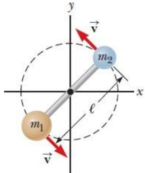

2. Một vật nặng có ${ \bf m } = 2 { \bf k g }$ được gắn vào đầu của một sợi dây quấn quanh ròng rọc như hình vẽ. Ròng rọc là một vành tròn bán kính R $\ l = 8 \mathrm { { c m } }$ và khối lượng $\mathbf { M } = 2 \mathrm { k g }$ . Các nan hoa có khối lượng không đáng $\mathrm { k } \mathring { \mathrm { e } }$ .

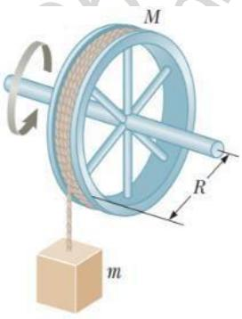

(a) Tính tổng mômen lực đối với trục ròng rọc.   
(b) Khi vật chuyển động với tốc độ v thì ròng rọc quay với tốc độ $\begin{array} { r } { \mathrm { g } \dot { \mathrm { o c } } = \frac { \mathtt { v } } { \mathtt { R } } } \end{array}$ Xác định tổng mômen động lượng của hệ đối với trục ròng rọc theo v.   
(c) Sử dụng kết quả câu a và τ = d L để tính gia tốc của ròng rọ dt

3. Một hạt $5 . 0 0 \mathrm { k g }$ bắt đầu chuyển động từ $\mathrm { g } \acute { \mathrm { o c } }$ tại $\mathbf { t } = 0 . \mathrm { V } \hat { \mathbf { a } } \mathbf { n }$ tốc cho bởi phương trình:

$$
v ^ {  } = ( 6 t ^ { 2 } l ^ {  } + 2 t \vec { \jmath ^ {  } } )
$$

Với $v ^ {  }$ tính bằng m/s và t tính bằng s.

(a) Tìm vị trí của nó theo thời gian.   
(b) Mô tả chuyển động của nó.   
(c) Tính gia tốc theo thời gian   
(d) Tính tổng ngoại lực tác động lên hạt theo thời gian,   
(e) Tính tổng momen ngoại lực so với $\mathrm { g } \acute { \mathrm { o c } }$ tác động lên hạt theo thời gian, (f) Tính mômen động lượng so với $\mathrm { g } \acute { \mathrm { o c } }$ theo thời gian   
(g) Tính động năng của hạt theo thời gian,   
(h) Tính công suất truyền cho hạt theo thời gian.

4. Một đĩa khối lượng đồng nhất $\mathrm { m } = 3 { , } 0 0 \mathrm { k g }$ và bán kính $\mathrm { \Delta r } = 0 { , } 2 0 0 \mathrm { \ m }$ quay quanh một trục cố định vuông góc với đĩa với tần số góc 6,00 rad / s. Tính độ lớn mômen động lượng của đĩa khi trục quay

(a) Đi qua khối tâm của đĩa (b) Đi qua một điểm giữa khối tâm và vành đĩa.

<table><tr><td rowspan=2 colspan=1>Ai</td><td rowspan=1 colspan=1>VIETTEL AI RACE      V•</td><td rowspan=1 colspan=1>TD135</td></tr><tr><td rowspan=1 colspan=1>Momen dong lurong</td><td rowspan=1 colspan=1>Làn ban hành: 1</td></tr></table>

<table><tr><td rowspan=2 colspan=1>Ai</td><td rowspan=1 colspan=1>VIETTEL AI RACE      V</td><td rowspan=1 colspan=1>TD135</td></tr><tr><td rowspan=1 colspan=1>Momen dong lrong</td><td rowspan=1 colspan=1>Làn ban hành: 1</td></tr></table>

5. Khoảng cách giữa tâm của hai bánh xe của một xe máy là 155 cm. Khối tâm của xe máy, $\mathrm { k } \mathring { \mathrm { e } }$ cả người lái nằm trên mặt đất 88 cm và $\dot { \mathbf { O } }$ giữa 2 bánh xe. Giả sử khối lượng của mỗi bánh xe không đáng $\mathrm { k } \mathring { \mathrm { e } }$ so với người lái và xe. Động cơ chỉ lái bánh sau. Hỏi giá trị gia tốc theo phương ngang nào của xe máy sẽ làm bánh xe trước văng lên khỏi mặt đất.

6. Một bàn xoay bán kính $\mathtt { R } = 2 , 0 0 \mathrm { m } \mathrm { c } \mathrm { \dot { c } }$ mômen quán tính $\mathrm { I } = 2 5 0 \ k g m ^ { 2 }$ và quay không có ma sát ở tốc độ 10,0 vòng / phút theo một trục vuông góc với nó. Một đứa trẻ nặng 25,0 kg nhảy lên vòng xoay và ngồi xuống cạnh vòng xoay. Tìm tốc độ góc mới của vòng xoay?

7. Một học sinh ngồi trên một chiếc ghế xoay tự do cầm hai quả tạ, mỗi chiếc có khối lượng ${ 3 , 0 0 } \mathrm { k g }$ (như hình). Khi dang tay ra theo chiều ngang (hình a), tạ cách trục quay là $1 . 0 0 \mathrm { m }$ và học sinh quay với tốc độ góc là 0,750 rad / s. Tổng momen quán tính của ghế xoay và học sinh đối với trục quay là 3,00 $\mathrm { k g . m } ^ { 2 }$ và được xem như không đổi. Học sinh co tay lại theo chiều ngang tới vị trí quả tạ cách trục xoay $0 { , } 3 0 0 \mathrm { m }$ (hình b).

(a) Tìm tốc độ góc mới của học sinh.   
(b) Tìm động năng quay của hệ trước và sau khi học sinh co tay.

8. Một khối gỗ có khối lượng M đăt trên bề mặt bàn nằm ngang không ma sát được gắn vào một thanh cứng có chiều dài l và khối lượng không đáng $\mathrm { k } \mathring { \mathrm { e } }$ (hình), thanh cứng này được gắn một đầu cố định vào bàn và có thể xoay quanh đầu này. Một viên đạn chuyển động trên bề mặt mặt bàn với vận tốc v có phương vuông góc với thanh cứng đến va chạm và cắm vào khối gỗ.

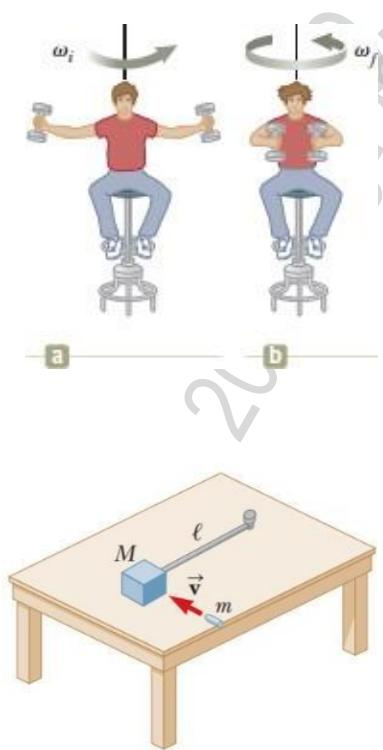

(a) Tính mômen động lượng của hệ viên đạn – khối $\mathbf { g } \tilde { \hat { 0 } }$ đối với trục quay thẳng đứng đi qua điểm cố định của thanh cứng.   
(b) Tính tỷ số phần năng lượng của viên đạn đươc chuyển hóa thành nội năng của hệ sau va chạm.

9. Một viên đạn nặng 0,005kg được bắn vào cánh cửa nặng $1 8 \mathrm { k g }$ theo phương ngang với tốc độ $1 0 3 ~ \mathrm { m / s }$ , viên đạn cắm vào cửa ở vị trí các mép dưới một đoạn $1 0 \mathrm { \ c m }$ (như hình). Cánh cửa rộng 1 m và có thể xoay quanh bản lề, bỏ qua ma sát.

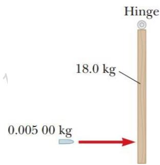

(a) Trước khi viên đạn chạm vào cánh cửa nó có mômen động lượng so với trục quay của cánh cửa hay không?   
(b) Nếu có hãy tính giá trị của mômen động lượng này, nếu không hãy giải thích.   
(c) Cơ năng của hệ viên đạn – cánh cửa có bảo toàn trong suốt quá trình va chạm không?

<table><tr><td rowspan=2 colspan=1>Ai</td><td rowspan=1 colspan=1>VIETTEL AI RACE      V•</td><td rowspan=1 colspan=1>TD135</td></tr><tr><td rowspan=1 colspan=1>Momen dong lrong</td><td rowspan=1 colspan=1>Làn ban hành: 1</td></tr></table>

(d) Tốc độ góc của cánh cửa ngay sau khi va chạm là bao nhiêu?   
(e) Tính tổng năng lượng của hệ viên đạn – cánh cửa sau va chạm và xác định xem nó ít hơn hay bằng với động năng của viên đạn trước khi va chạm.

<table><tr><td rowspan=2 colspan=1>Ai</td><td rowspan=1 colspan=1>VIETTEL AI RACE      V•</td><td rowspan=1 colspan=1>TD135</td></tr><tr><td rowspan=1 colspan=1>Momen dong lrong</td><td rowspan=1 colspan=1>Làn ban hành: 1</td></tr></table>

10. Ba vật có khối lượng bằng nhau được gắn với một thanh cứng không có khối lượng như hình. Thanh cứng đang nằm ngang, đứng yên thì bắt đầu xoay tự do trong mặt phẳng

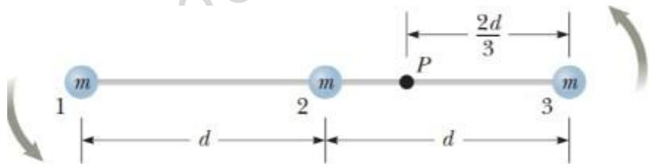

thẳng đứng với trục quay đi qua điểm P. Giả sử m và d đã biết, hãy tìm

(a) Mômen quán tính của 3 vật này đối với trục quay qua P, (b) Mômen xoắn tác động lên hệ tại $\mathrm { t } = 0$ ,   
(c) Gia tốc góc của hệ tại $\mathrm { t } = 0$ ,   
(d) Gia tốc tiếp tuyến của vật 3 tại $\mathrm { t } = 0$ ,   
(e) Động năng cực đại của hệ,   
(f) Tốc độ góc tối đa thanh đạt được,   
(g) Mômen động lượng cực đại của hệ và   
(h) Tốc độ cực đại của vật hai.

11. Bắn một viên đạn có khối lượng m với tốc độ $v _ { i }$ về phía phải (như hình a) và đâm vào đầu thanh sắt cố định có khối lượng M, chiều dài d, xoay quanh trục không ma sát vuông góc với mặt phẳng hình vẽ qua O (như hình). Chúng ta muốn xác định được tỷ số động năng thay đổi trong hệ do va chạm.

(a) Mô hình phân tích nào thích hợp để mô tả chuyển động của viên đạn và thanh sắt?

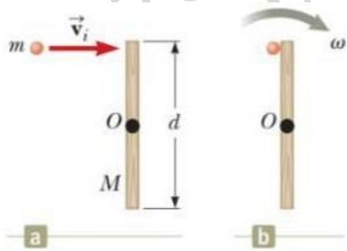

(b) Xác định mômen động lượng của hệ trước va chạm đối với trục quay qua O? (c) Mômen quán tính của hệ đối với trục qua O sau khi m cắm vào thanh.   
(d) Nếu tốc độ góc của hệ thống sau va chạm là ω, xác định mômen động lượng của hệ sau va chạm.   
(e) Tính tốc độ góc ω sau va chạm,   
(f) Tính động năng của cơ hệ trước khi va chạm và   
(g) Tính động năng của cơ hệ sau va chạm.   
(h) Tính tỷ số động năng trước và sau va chạm.   
12. Hai phi hành gia (như hình), mỗi người có khối lượng 75kg, được nối với nhau bằng một sợi dây dài 10 m và có khối lượng không đáng kể. Xem như họ cô lập trong không gian   
và quay quanh khối tâm của họ với tốc độ 5 m/s. Xem như các phi hành gia là các chất điểm

(a) Tính độ lớn của mômen động lượng của

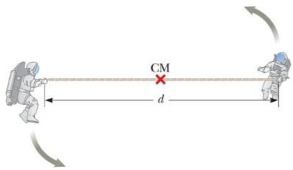

<table><tr><td rowspan="3">Ai</td><td>VIETTEL AI RACE V •</td><td>TD135</td></tr><tr><td></td><td></td></tr><tr><td>Momen dong lrong</td><td>Làn ban hành: 1</td></tr></table>

hệ hai phi hành gia và (b) Tính động năng quay của hệ.

<table><tr><td rowspan=2 colspan=1>Ai</td><td rowspan=1 colspan=1>VIETTEL AI RACE      V</td><td rowspan=1 colspan=1>TD135</td></tr><tr><td rowspan=1 colspan=1>Momen dong lurong</td><td rowspan=1 colspan=1>Làn ban hành: 1</td></tr></table>

Một phi hành gia kéo sợi dây thừng để rút ngắn khoảng cách giữa hai người còn $5 \textrm { m }$ . Hãy tính

(c) Mômen động lượng mới của hệ,   
(d) Tốc độ mới của phi hành gia và   
(e) Động năng quay mới của hệ thống.   
(f) Hóa năng dự trữ trong cơ thể của phi hành gia đã được chuyển đổi thành cơ năng của hệ khi anh ta rút ngắn sợi dây là bao nhiêu?

13. Hiện tượng nóng lên của Trái đất đang rất được quan tâm bởi vì ngay cả những thay đổi nhỏ trong nhiệt độ Trái đất có thể có những hậu quả đáng $\mathrm { k } \mathring { \mathbf { e } }$ . Ví dụ, nếu những tảng băng ở hai cực của Trái đất tan chảy hoàn toàn, thì nước trong các đại dương nhiều lên và làm tràn ngập nhiều vùng duyên hải.

Mô hình tảng băng ở 2 cực có khối lượng $2 . 3 \times 1 0 ^ { 1 9 } \mathrm { k g }$ và có dạng đĩa phẳng bán kính 6 $\times 1 0 ^ { 5 } \mathrm { m }$ . Giả sử các tảng băng sau khi tan chảy sẽ tạo thành lớp vỏ hình cầu là nước bao quanh Trái đất. Hỏi độ dài một ngày đêm thay đổi một lượng bao nhiêu so với hiện tại là 24 giờ/ngày? (tính theo giây và $\%$ ). Cho khối lượng Trái đất là 5,972 × 1024kg và bán kính Trái đất là $6 3 7 1 \ \mathrm { k m }$ .