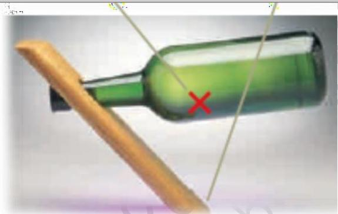
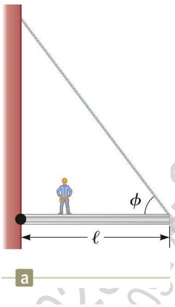
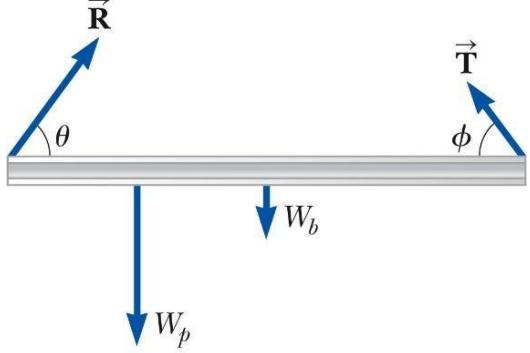
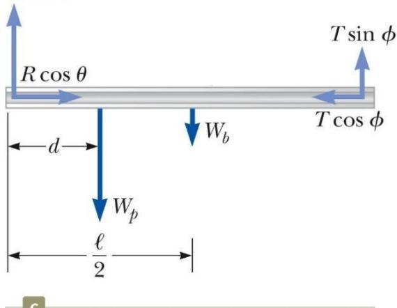
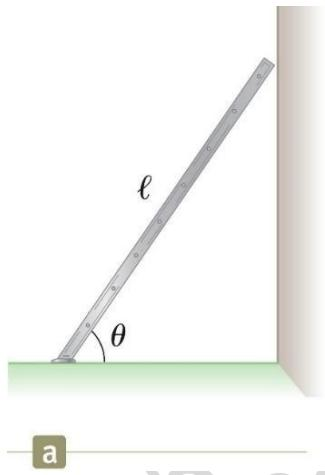

<table><tr><td rowspan=2 colspan=1>Ai</td><td rowspan=1 colspan=1>VIETTEL AI RACE       1-</td><td rowspan=1 colspan=1>TD136</td></tr><tr><td rowspan=1 colspan=1>Trang thái càn bàng tinh và sur dàn hòi</td><td rowspan=1 colspan=1>Làn ban hành: 1</td></tr></table>

Cân bằng tĩnh là trạng thái chuyển động đặc biệt của vật rắn. Khi đó, vật rắn có vận tốc chuyển động tịnh tiến và vận tốc chuyển động quay đều bằng 0 trong một hệ quy chiếu quán tính. Trạng thái cân bằng tĩnh này được ứng dụng rất nhiều trong kỹ thuật dân dụng, kiến trúc và cơ khí.

# Mô hình phân tích: Vật rắn ở trạng thái cân bằng

Cân bằng có nghĩa là một vật chuyển động với vận tốc dài và vận tốc góc không đổi so với một quan sát viên trong một hệ quy chiếu quán tính.

Ở đây ta quan tâm đến trường hợp đặc biệt mà cả hai loại vận tốc này bằng không

• Trường hợp này được gọi là cân bằng tĩnh.

Cân bằng tĩnh là một tình huống thường gặp trong kỹ thuật, đặc biệt là trong xây dựng, kiến trúc và cơ khí.

# Sự đàn hồi:

Chúng ta có thể thảo luận về việc các vật bị biến dạng như thế nào trong điều kiện chịu tải.

Một vật đàn hồi sẽ trở lại hình dạng ban đầu khi không còn lực làm nó biến dạng.

Người ta định nghĩa nhiều hằng số đàn hồi khác nhau, tương ứng với mỗi kiểu biến dạng khác nhau.

Trong mô hình hạt ở trạng thái cân bằng thì một hạt chuyển động với vận tốc không đổi do hợp lực tác dụng lên nó bằng không.

Với các vật thật (dạng mở rộng) thì tình huống sẽ phức tạp hơn nhiều.

• Thường thì không thể xem các vật là các hạt.

Với một vật thật ở trạng thái cân bằng thì cần thỏa mãn một điều kiện thứ hai:

• Điều kiện này liên quan đến chuyển động quay của vật.

Một vật khi ở trạng thái cân bằng tĩnh thì: tổng ngoại lực và tổng mômen ngoại lực tác dụng lên vật bằng 0.

Các điều kiện này mô tả mô hình vật rắn ở trạng thái cân bằng.

<table><tr><td rowspan=2 colspan=1>Ai</td><td rowspan=1 colspan=1>VIETTEL AI RACE      V-</td><td rowspan=1 colspan=1>TD136</td></tr><tr><td rowspan=1 colspan=1>Trang thái càn bàng tinh và sy dàn hòi</td><td rowspan=1 colspan=1>Làn ban hành: 1</td></tr></table>

Các lưu ý về cân bằng:

Cân bằng tịnh tiến

Điều kiện thứ nhất về cân bằng là phát biểu về cân bằng tịnh tiến.

• Gia tốc tịnh tiến của khối tâm của vật phải bằng không.   
• Điều này được áp dụng trong một hệ quy chiếu quán tính.

Cân bằng quay

• Điều kiện thứ hai về cân bằng là một phát biểu về cân bằng quay.   
• Gia tốc góc của vật bằng không.   
• Điều này phải đúng với mọi trục quay.

# Cân bằng động và cân bằng tĩnh

Trong chương này, ta tập trung vào cân bằng tĩnh.

• Vật không chuyển động. • $\mathbf { v } _ { \mathrm { C M } } = 0$ và $\omega = 0$

Mômen hợp lực bằng không không có nghĩa là vật không chuyển động quay.

Cân bằng động cũng có thể xảy ra.

• Vật có thể quay với vận tốc góc không đổi.   
• Vật có thể chuyển động với vận tốc khối tâm không đổi.

# Các phương trình trong cân bằng

Ta sẽ giới hạn các ứng dụng cho các tình huống mà các lực nằm trong mặt phẳng xy

• Các lực này được gọi là đồng phẳng vì chúng cùng nằm trong một mặt phẳng • Giới hạn này dẫn đến 3 phương trình theo các trục.

Các phương trình này là:

$\begin{array} { c } { { \Sigma \mathrm { F _ { x } } = 0 } } \\ { { \ } } \\ { { \mathrm { : } \Sigma \mathrm { F _ { y } } = 0 } } \\ { { \ } } \\ { { \Sigma \mathrm { { \tau _ { z } } = 0 } } } \end{array}$ (12.3)

Vị trí của trục của phương trình mômen quay được chọn bất kỳ.

<table><tr><td rowspan="3">Ai</td><td>VIETTEL AI RACE V</td><td>TD136</td></tr><tr><td>Trang thái càn bàng tinh và sur dàn hòi</td><td>Làn ban hành: 1</td></tr><tr><td></td><td></td></tr></table>

Ví dụ về vật rắn ở trạng thái cân bằng

Chiến lược giải toán về cân bằng

Khái niệm hóa

Tìm tất cả các lực tác dụng lên vật.

Hình dung ảnh hưởng của mỗi lực đến sự quay của vật như là chỉ có lực này tác dụng lên vật.

Phân loại

<table><tr><td rowspan=2 colspan=1>Ai</td><td rowspan=1 colspan=1>VIETTEL AI RACE      V</td><td rowspan=1 colspan=1>TD136</td></tr><tr><td rowspan=1 colspan=1>Trang thai càn bàng tīnh và sur dàn hòi</td><td rowspan=1 colspan=1>Làn ban hành: 1</td></tr></table>

Khẳng định rằng vật là một vật rắn cân bằng.

Vật phải có gia tốc tịnh tiến và gia tốc góc bằng không.

# Phân tích

Vẽ một sơ đồ.

Vẽ và đặt tên tất cả các ngoại lực tác dụng lên vật.

Mô hình hạt chịu tác dụng của hợp lực: có thể biểu diễn vật như là một điểm trong sơ đồ lực vì ta không quan tâm đến điểm tác động của lực lên vật.

Mô hình vật rắn cân bằng: Không thể biểu diễn vật bằng một điểm vì điểm tác động của các lực là quan trọng.

Lập một hệ tọa độ thuận tiện.

Tìm thành phần của các lực theo hai trục tọa độ.

Trọng tâm của hệ gồm chai rượu và giá đỡ rơi đúng vào điểm đặt của giá đỡ

  
Hình 12.1: Hệ chai rượu và giá đỡ cân bằng

Áp dụng điều kiện thứ nhất về cân bằng $( \mathrm { { \Sigma F { = } 0 } } )$ .

Cẩn thận với các dấu cộng, trừ.

Chọn một trục thuận tiện cho việc tính mômen quay tổng hợp đối với vật rắn: Nhớ rằng việc chọn trục là tùy ý.

Chọn một trục sao cho các phép tính là đơn giản nhất: Lực tác dụng dọc theo đường thẳng đi qua gốc có mômen quay bằng không

Áp dụng điều kiện thứ 2 của cân bằng.

Hai điều kiện cân bằng sẽ cho ta một hệ phương trình.

Giải hệ phương trình.

# Hoàn tất

Bảo đảm rằng các kết quả là phù hợp với sơ đồ ban đầu.

Nếu lời giải cho thấy một lực âm thì lực đó ngược với chiều mà ta đã vẽ trong sơ đồ.

Kiểm tra các kết quả để bảo đảm rằng: $\sum F _ { x } = 0 , \sum F _ { y } = 0 , \sum F _ { z } = 0 \ : .$

Sự cân bằng của hệ chai rượu và giá đỡ trong hình 12.1 là một ví dụ thú vị về trạng thái cân bằng tĩnh của vật rắn. Để chai rượu có thể đứng cân bằng trên giá đỡ thì cần hai điều kiện:

<table><tr><td rowspan=2 colspan=1>Ai</td><td rowspan=1 colspan=1>VIETTEL AI RACE      V-</td><td rowspan=1 colspan=1>TD136</td></tr><tr><td rowspan=1 colspan=1>Trang thái càn bàng tinh và sur dàn hòi</td><td rowspan=1 colspan=1>Làn ban hành: 1</td></tr></table>

tổng hợp lực và tổng mômen lực tác dụng lên hệ phải bằng không. Để điều kiện thứ hai được thỏa mãn thì trọng tâm của hệ $\mathrm { g } \dot { \hat { \mathrm { o } } } \mathrm { m }$ chai rượu và giá đỡ phải ở trên đường thẳng đứng đi qua điểm đặt của giá đỡ trên bàn.

<table><tr><td rowspan=2 colspan=1>Ai</td><td rowspan=1 colspan=1>VIETTEL AI RACE   - V-</td><td rowspan=1 colspan=1>TD136</td></tr><tr><td rowspan=1 colspan=1>Trang thái càn bàng tīnh và sur dàn hòi</td><td rowspan=1 colspan=1>Làn ban hành: 1</td></tr></table>

# Bài tập mẫu 12.1: Người đứng trên xà ngang:

Một thanh xà đồng chất nằm ngang có chiều dài $l { = } 8 . 0 0 \mathrm { m }$ và trọng lượng $W _ { b } { = } 2 0 0 \ \mathrm { N }$ được gắn vào tường bởi một trục quay. Đầu còn lại của xà được móc vào cáp treo lập một góc $\Phi { = } 5 3 ^ { \circ }$ so với xà (hình 12.8a). Một người có trọng lượng $\mathrm { W p { = } 5 6 0 0 \mathrm { N } }$ đứng trên xà và cách tường một khoảng $\mathrm { d } { = } 2 . 0 0$ N. Tìm lực căng của cáp treo cũng như độ lớn và hướng của lực mà tường tác dụng lên xà.

Giải:

# Khái niệm hóa

Thanh xà là đồng chất.

Trọng tâm của xà là ở tâm hình học của xà (trung điểm của xà). \$\rac\$

Người đứng trên xà.

Lực căng của cáp và lực mà tường tác dụng lên xà là gì?

# Phân loại

Hệ đứng yên, phân loại bài toán như là một vật rắn nằm cân bằng.

# Phân tích

Vẽ một sơ đồ lực (hình 12.8b).

Dùng trục quay cho trong bài toán (nằm trên tường) làm trục quay: Cách này là đơn giản nhất

Lưu ý là ở đây có 3 ẩn số (đại lượng cần tìm) là T, R, .

Có thể phân tích các lực thành các thành phần.

Áp dụng 2 điều kiện cân bằng, ta thu được 3 phương trình.

Giải hệ phương trình để tìm các ẩn số.

# Hoàn tất

Giá trị của $\theta$ cho thấy hướng của $R$ trong đồ thị là đúng.

Rsin θ

<table><tr><td rowspan="3">Ai</td><td>VIETTEL AI RACE V -</td><td>TD136</td></tr><tr><td>Trang thái càn bàng tinh và sur dàn hòi</td><td>Làn ban hành: 1</td></tr><tr><td></td><td></td></tr></table>

# Bài tập mẫu 12.2: Thang dựng nghiêng

Một cái thang đồng chất có chiều dài l tựa vào một cái tường nhẵn, thẳng đứng (hình 12.9a). Khối lượng của thang là m và hệ số ma sát giữa thang và sàn nhà là $\scriptstyle \mu = 0 , 4 0$ . Tìm góc nghiêng nhỏ nhất $\theta _ { \mathrm { m i n } }$ để thang không bị trượt.

# Khái niệm hóa

Thang là đồng chất.

Trọng lượng của thang đặt $\dot { \mathbf { O } }$ tâm hình học của nó (cũng là trọng tâm).

Giữa thang và sàn nhà có ma sát nghỉ (ma sát tĩnh).

# Phân loại

Mô hình hóa vật như là một vật rắn nằm cân bằng: do ta không muốn thang trượt

# Phân tích

$\mathrm { V } \tilde { \mathrm { e } } \mathrm { m } \hat { \mathrm { o } } \mathrm { t }$ sơ đồ chỉ ra tất cả các lực tác động lên thang.

Lực ma sát là $f _ { \mathrm { s } } = \mu _ { \mathrm { s } } \textrm { n }$ .

Chọn O làm trục quay.

Áp dụng các phương trình của 2 điều kiện cân bằng.

Giải các phương trình.