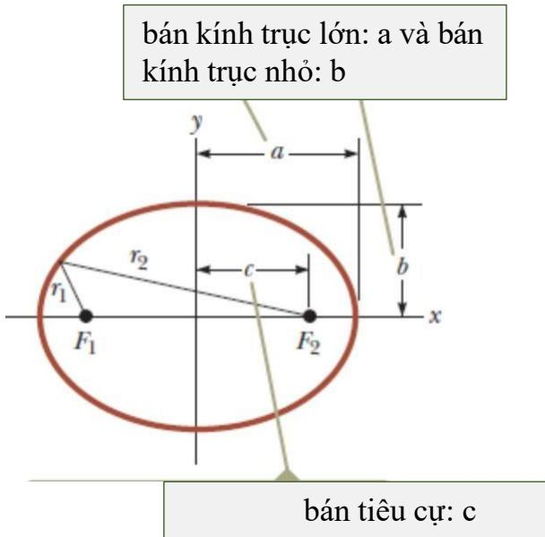
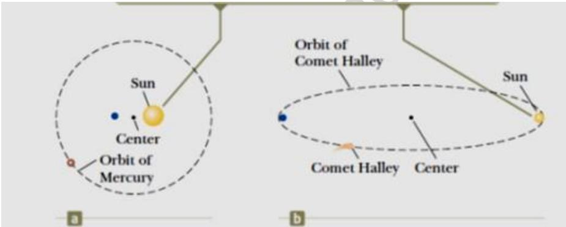
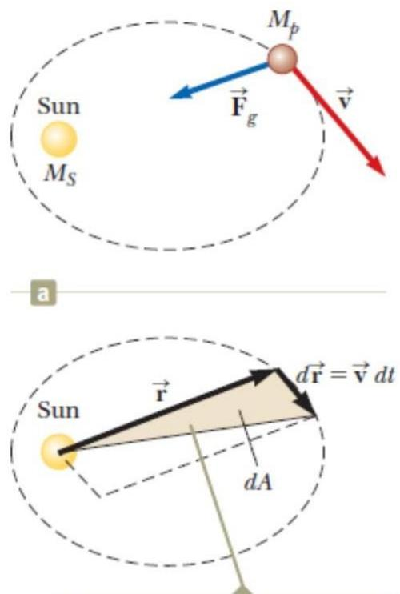
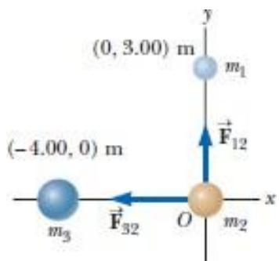
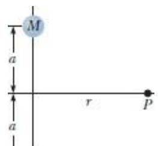
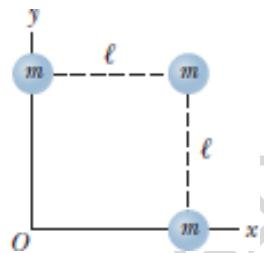
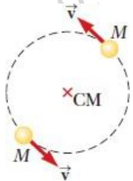

<table><tr><td rowspan=2 colspan=1>Ai</td><td rowspan=1 colspan=1>VIETTEL AI RACE</td><td rowspan=1 colspan=1>TD137</td></tr><tr><td rowspan=1 colspan=1>Van vàt háp dǎn25-09</td><td rowspan=1 colspan=1>Làn ban hành: 1</td></tr></table>

Trước năm 1687, số liệu về chuyển động của Mặt Trăng và các hành tinh đã được thu thập rất nhiều. Tuy nhiên, những chuyển động này là do loại lực nào gây ra thì vẫn là một bí ẩn. Ngay chính năm đó, Isaac Newton đã đưa ra chìa khóa cho vấn đề này.

Từ định luật I của mình, ông biết rằng có đang có một lực tổng hợp nào đó đang tác động lên Mặt Trăng vì nếu không có thì Mặt Trăng đã chuyển động với quỹ đạo thẳng chứ không phải tròn như hiện tại. Newton chỉ ra rằng chính trọng lực của Trái Đất đã tác động lên Mặt Trăng. Ông nhận ra rằng lực hút giữa Trái Đất và Mặt Trăng, giữa Mặt Trời và các hành tinh thực ra chính là trường hợp đặc biệt của lực hút giữa các vật. Nói một cách khác, lực hút làm Mặt Trăng quay quanh Trái Đất, cũng chính là lực làm làm quả táo rơi từ trên cây.

Trong chương này, chúng ta sẽ học về Định luật vạn vật hấp dẫn. Định luật này sẽ được kiểm chứng bởi các số liệu quan sát thiên văn học. Chúng ta cũng chỉ ra rằng các định luật về chuyển động của các hành tinh được trình bày bởi Johannes Kepler cũng suy ra được nhờ định luật vạn vật hấp dẫn và định luật bảo toàn moment động lượng.

<table><tr><td rowspan=2 colspan=1>Ai</td><td rowspan=1 colspan=1>VIETTEL AI RACE</td><td rowspan=1 colspan=1>TD137</td></tr><tr><td rowspan=1 colspan=1>Van vàt háp dǎn25-09</td><td rowspan=1 colspan=1>Làn ban hành: 1</td></tr></table>

# 13.2.1 Trọng lực

Trọng lực là trường hợp riêng của lực hấp dẫn do Trái Đất tác dụng lên một vật. Độ lớn của trọng lực là:

$$
\begin{array} { r } { P = G \frac { M _ { E } m } { ( R _ { E } + h ) ^ { 2 } } } \end{array}
$$

Với:

• m: khối lượng của vật   
P: là trọng lực của Trái Đất tác dụng lên vật có khối lượng m   
• ME: khối lượng Trái Đất   
RE: bán kính của Trái Đất   
• G: hằng số hấp dẫn

# 13.2.2 Gia tốc trọng trường

Theo định luật II Newton, trọng lực $\mathrm { P }$ do Trái đất tác dụng lên vật m sẽ làm vật m có gia tốc là g:

$$
P = m g
$$

Mặt khác theo công thức (13.2), ta có: $\begin{array} { r } { P = G \frac { M _ { E } m } { ( R _ { E } + h ) ^ { 2 } } } \end{array}$ . Từ công thức (13.2) và (13.3) suy ra:

$$
\begin{array} { r } { g = G \frac { M _ { E } } { ( R _ { E } + h ) ^ { 2 } } } \end{array}
$$

g: được gọi là gia tốc trọng trường.

# Trường hấp dẫn – Trọng trường

Định luật vạn vật hấp dẫn xem như một thành công lớn nữa của Newton vì nó giúp giải thích quy luật chuyển động của các hành tinh. Đồng thời, phạm vi ứng dụng của các định luật khác của ông cũng được mở rộng ra áp dụng cho các vật thể có kích thước và khối lượng lớn như các hành tinh trong vũ trụ. Từ năm 1687, lý thuyết của Newton đã được ứng dụng vào giải thích chuyển động của sao chổi, thí nghiệm Cavendish, quỹ đạo của Sao đôi, và sự quay của các thiên hà. Tuy nhiên, cả Newton và những người cùng thời với ông đều không thể nào lý giải được tại sao hai vật ở xa mà có thể tương tác được với nhau. Mãi sau khi ông mất thì khái

niệm về một trườn g hấp dẫn xung quan h các vật có

<table><tr><td rowspan=2 colspan=1>Ai</td><td rowspan=1 colspan=1>VIETTEL AI RACE</td><td rowspan=1 colspan=1>TD137</td></tr><tr><td rowspan=1 colspan=1>Van vàt háp dǎn25-09</td><td rowspan=1 colspan=1>Làn ban hành: 1</td></tr></table>

Riêng đối với Trái Đất, trường hấp dẫn của nó được gọi là trọng trường. Với giả thiết Trái đất là quả cầu đồng nhất thì vecto cường độ của trường hấp dẫn $\vec { \bf g } { \bf  } { \bf c } \vec { \bf o }$ công thức là:

$$
g \mathrm {  } = { \LARGE \sum _ { m } } ^ { F _ { g }  } = - { \LARGE \sum _ { r ^ { 2 } } } ^ { G M _ { E } } r \mathrm {  }
$$

$\vec { F ^ { \prime \prime } g } ^ {  } \vert \dot { \mathrm { a } }$ trọng lực tác dụng lên chất điểm có khối lượng mng số hấp dẫn $\mathbf { M } _ { \mathrm { E } }$ là khối lượng của Trái Đất • r: là khoảng cách từ tâm Trái Đất đến điểm mà ta đang khảo sát • $r \to \mathrm { { l } \dot { a } }$ vectơ đơn vị hướng từ tâm Trái Đất đến điểm khảo sát.

Đối với các điểm ở gần mặt đất thì giá trị $\mathbf { r } \approx \mathrm { R e }$ , khi đó $\vec { \pmb { g } } \mathrm {  c } \acute { 0 }$ độ lớn là g ≈ 9,8 m/s2.

# Các định luật Kepler và chuyển động của các hành tinh

Từ hàng ngàn năm trước, con người đã bắt đầu quan sát chuyển động của các hành tinh và các ngôi sao và cho rằng Trái Đất là trung tâm vũ trụ. Đây là lý thuyết xuất phát từ nhà bác học người Hy Lạp Claudius Ptolemy (100 - 170). Lý thuyết này được chấp nhận trong suốt 1400 năm sau. Mãi cho đến năm 1543, nhà bác học người Ba Lan Nicolaus Copernicus (1473 – 1543) mới đưa ra một nhận định là Trái Đất và các hành tinh khác quay quanh Mặt Trời. Sau đó, vì khao khát muốn tìm ra quy luật sắp xếp của bầu trời, nhà bác học người Đan Mạch Tycho Brahe (1546 – 1601) đã miệt mài quan sát sự chuyển động của các hành tinh và 777 ngôi sao mà mắt thường có thể nhìn thấy. Nhờ dữ liệu này mà người trợ lý của Brahe – Johannes Kepler đã bỏ ra 16 năm trời để tìm ra mô hình toán học giải thích chuyển động của các hành tinh. Tuy nhiên, vì các dữ liệu này là do quan sát chuyển động $\dot { \mathbf { O } }$ tại Trái Đất nên gây ra rất nhiều khó khăn cho Kepler trong việc tính toán. Cuối cùng, Kepler cũng đã đưa ra được mô hình chính xác nhờ vào dữ liệu của Brahe về chuyển động của Sao Hỏa xung quanh Mặt Trời. Lý thuyết của Kepler về chuyển động của các hành tinh được tóm tắt trong ba định luật:

1. Tất cả các hành tinh chuyển động theo các quỹ đạo elip trong đó Mặt Trời là một tiêu điểm.   
2. Vecto bán kính kẻ từ Mặt Trời đến một hành tinh quét được những điện tích bằng nhau trong những khoảng thời gian bằng nhau.   
3. Bình phương chu kỳ quỹ đạo của một hành tinh tỷ lệ với lập phương bán trục lớn của quỹ đạo elip của hành tinh đó.

# 13.4.1 Định luật I Kepler

“Tất cả các hành tinh chuyển động theo các quỹ đạo elip trong đó Mặt Trời là một tiêu điểm.”

<table><tr><td rowspan=2 colspan=1>Ai</td><td rowspan=1 colspan=1>VIETTEL AI RACE</td><td rowspan=1 colspan=1>TD137</td></tr><tr><td rowspan=1 colspan=1>Van vàt háp dǎn25-09</td><td rowspan=1 colspan=1>Làn ban hành: 1</td></tr></table>

Các mô hình về hệ mặt trời lúc bấy giờ đều cho rằng quỹ đạo của các thiên thể đều là tròn. Tuy nhiên, theo định luật I Kepler, quỹ đạo tròn chỉ là một trường hợp đặc biệt, quỹ đạo elip mới là trường hợp tổng quát. Khám phá này của Kepler đã gặp rất nhiều thách thức vì

<table><tr><td rowspan=2 colspan=1>Ai</td><td rowspan=1 colspan=1>VIETTEL AI RACE</td><td rowspan=1 colspan=1>TD137</td></tr><tr><td rowspan=1 colspan=1>Van vàt háp dǎn25-09</td><td rowspan=1 colspan=1>Làn ban hành: 1</td></tr></table>

phần lớn các nhà khoa học thời đó đều tin rằng quỹ đạo của các hành tinh có hình tròn hoàn hảo.

Như ta đã biết, $\mathrm { m } \hat { \mathrm { 0 t } }$ elip (hình 13.2) sẽ được đặc trưng bởi:

• Bán kính trục lớn (a), kính trục nhỏ (b), bán tiêu cự (c), với:

$$
a ^ { 2 } = b ^ { 2 } + c ^ { 2 }
$$

• Độ lệch tâm: $e = { } ^ { c } / _ { a }$ . Độ lệch tâm là tham số có giá trị từ 0 (đường tròn) đến nhỏ hơn 1 (khi độ lệch tâm tiến tới 1, elip tiến tới dạng parabol).

  
Hình 13.2: Dạng hình học quỹ đạo elip của các hành tinh

Độ lệch tâm quỹ đạo mà Kepler tính được cho Trái Đất là 0,017 vì vậy quỹ đạo của nó gần như là hình tròn. Đối với hành tinh có độ lệch tâm lớn nhất là Sao Thủy thì độ lệch tâm quỹ đạo của nó cũng chỉ là 0,21. Với các giá trị độ lệch tâm của các hành tinh thì quỹ đạo elip của các hành tinh rất khó phân biệt so với hình tròn. Chính vì lý do này mà các nghiên cứu của Kepler được đánh giá rất cao. Kể cả quỹ đạo elip của sao chổi Haley cũng được tính toán dựa trên định luật Kepler với độ lệch tâm là 0,97. Với bán kính trục lớn rất dài so với bán kính trục nhỏ, sao chổi Haley phải mất đến 76 năm mới chuyển động hết một vòng xung quanh Mặt Trời.

<table><tr><td rowspan=2 colspan=1>Ai</td><td rowspan=1 colspan=1>VIETTEL AI RACE</td><td rowspan=1 colspan=1>TD137</td></tr><tr><td rowspan=1 colspan=1>CVan vát háp dǎn5</td><td rowspan=1 colspan=1>Làn ban hành: 1</td></tr></table>

  
Hình 13.3: Quỹ đạo của sao Thủy (hình a) và quỹ đạo của sao chổi Haley (hình b)

<table><tr><td rowspan=2 colspan=1>Ai</td><td rowspan=1 colspan=1>VIETTEL AI RACE</td><td rowspan=1 colspan=1>TD137</td></tr><tr><td rowspan=1 colspan=1>Van vàt háp dǎn25-09</td><td rowspan=1 colspan=1>Làn ban hành: 1</td></tr></table>

Định luật I Kepler là kết quả trực tiếp của tính chất tỷ lệ nghịch với bình phương khoảng cách của lực hấp dẫn. Dưới tác dụng của lực hấp dẫn gây ra bởi Mặt trời, các thiên thể có thể chuyển động theo các quỹ đạo hình elip (các hành tinh, tiểu hành tinh, sao chổi) hoặc parabol hoặc hyperbol (thiên thạch).

# 13.4.2 Định luật II Kepler

“Vecto bán kính kẻ từ Mặt Trời đến một hành tinh quét được những điện tích bằng nhau trong những khoảng thời gian bằng nhau.”

Diện tích dA quét bởi vectơ bán kính nối từ Mặt Trời đến hành tinh $( r {  } )$ trong thời gian dt bằng nửa diện tích của hình bình hành.

Hình 13.4: - hình a: tác dụng lực hút của Mặt Trời lên hành tinh

- hình b: trong thời gian dt, hình bình hành được tạo nên bởi 2 vectơ bán kính $r {  }$ (với gốc tọa độ đặt ở Mặt Trời) và ?? ??→ = ??→ ???? (13.8)

<table><tr><td rowspan=2 colspan=1>Ai</td><td rowspan=1 colspan=1>VIETTEL AI RACE</td><td rowspan=1 colspan=1>TD137</td></tr><tr><td rowspan=1 colspan=1>Van vàt háp dǎn25-09</td><td rowspan=1 colspan=1>Làn ban hành: 1</td></tr></table>

Moment của lực hấp dẫn mà Mặt Trời tác dụng lên hành tinh đối với trục qua Mặt trời bằng không nên moment động lượng của hành tinh đối với trục qua Mặt trời được bảo toàn:

<table><tr><td rowspan="2">Ai</td><td>VIETTEL AI RACE</td><td>TD137</td></tr><tr><td>Van vàt háp dǎn 25-09</td><td>Làn ban hành: 1</td></tr></table>

$$
U = - \begin{array} { c } { { G M _ { E } m } } \\ { { r } } \end{array}
$$

Công thức (13.21) trên chỉ đúng cho những vật nằm trên và bên ngoài bề mặt Trái Đất, tức $\mathbf { r } \geq \mathrm { R e }$ . Với gốc thế năng đã chọn $( \infty )$ thì thế năng trọng trường sẽ luôn có giá trị âm.

Ta có thể phát triển công thức (13.21) lên thành thế năng hấp dẫn tổng quát hơn của hệ hai chất điểm cách nhau một khoảng r và có khối lượng lần lượt là $\mathbf { m } _ { 1 }$ và $\mathbf { m } _ { 2 }$ như sau:

$$
U = - \frac { G m _ { \perp } m _ { 2 } } { r }
$$

Đối với hệ có ba chất điểm thì tổng thế năng hấp dẫn của cả hệ sẽ bằng:

$$
\begin{array} { r } { U _ { _ { t o t a l } } = U _ { _ { 1 2 } } + U _ { _ { 1 3 } } + U _ { _ { 2 3 } } = - G ( \frac { m _ { 1 } m _ { 2 } } { r _ { 1 2 } } + \frac { m _ { 1 } m _ { 3 } } { r _ { 1 3 } } + \frac { m _ { 2 } m _ { 3 } } { r _ { 2 3 } } ) } \end{array}
$$

Thế năng này có giá trị đúng bằng công cần thiết để tách các chất điểm của hệ ra xa nhau vô cùng.

# Năng lượng của các hành tinh và các vệ tinh

Cho hệ gồm một vật có khối lượng m chuyển động với vật tốc ν trong trường hấp dẫn của vật có khối lượng M với $ { \mathbf { M } } > >  { \mathbf { m } }$ . Hệ này có thể là mô hình cho một hành tinh chuyển động xung quanh Mặt Trời, một vệ tinh chuyển động xung quanh Trái Đất hoặc một sao chổi chuyển động ngang qua Mặt Trời. Nếu vật M được gắn cố định trong một hệ quy chiếu quán tính thì tổng cơ năng E của hệ 2 vật sẽ chỉ là cơ năng của vật m. Cơ năng này bao $\mathrm { g } \dot { \hat { \mathrm { o } } } \mathrm { m }$ động năng K và thế năng hấp dẫn U của vật m (hay thế năng của hệ hai vật):

$$
E = K + U
$$

$$
\begin{array} { r } { E = { \frac { 1 } { 2 } } m \nu ^ { 2 } - G { \frac { M m } { r } } } \end{array}
$$

Công thức 13.25 cho thấy cơ năng E của vật có khả năng mang các giá trị dương, âm hoặc bằng không phụ thuộc vào độ lớn vận tốc ν. Đối với các hệ liên kết như Mặt Trời-Trái Đất, Mặt Trăng – Trái Đất hoặc vệ tinh của Trái Đất thì cơ năng của vật sẽ có giá trị âm. Ta có thể dễ dàng kiểm chứng điều này qua chuyển động của một hành tinh có quỹ đạo được xem như tròn bất kỳ:

$$
F _ { g } = m a  \frac { G M m } { r ^ { 2 } } = \frac { m \nu ^ { 2 } } r
$$

<table><tr><td rowspan=2 colspan=1>Ai</td><td rowspan=1 colspan=1>VIETTEL AI RACE</td><td rowspan=1 colspan=1>TD137</td></tr><tr><td rowspan=1 colspan=1>Van vàt háp dǎn</td><td rowspan=1 colspan=1>Làn ban hành: 1</td></tr></table>

Nếu chia hai vế của đẳng thức trên cho 2 ta sẽ được:

$$
{ \frac { m v ^ { 2 } } { 2 } } = { \frac { G M m } { 2 r } }
$$

Áp dụng công thức (13.26) vào công thức (13.25) ta được:

$$
E = { \frac { G M m } { 2 r } } - { \frac { G M m } { r } }
$$

<table><tr><td rowspan="2">Ai</td><td>VIETTEL AI RACE</td><td>TD137</td></tr><tr><td>Van vàt háp dǎn 25-09</td><td>Làn ban hành: 1</td></tr></table>

$$
\begin{array} { r } { E = - \frac { G M m } { 2 r } \left( \mathrm { q u } \tilde { \mathrm { y } } \mathrm { d a o t r o n } \right) } \end{array}
$$

Trong quỹ đạo tròn, động năng của một vật có giá trị dương sẽ bằng $\%$ độ lớn của thế năng hấp dẫn. Vì vậy, cơ năng của vật sẽ có giá trị âm. Đây chính là năng lượng liên kết của hệ, tức năng lượng tối thiểu cần để tách riêng hai vật ra khỏi nhau xa vô cùng.

Đối với quỹ đạo elip, công thức của cơ năng sẽ giống (13.27) nhưng ta chỉ cần thay bán kính r của quỹ đạo tròn bằng bán kính trục lớn a trong quỹ đạo elip, tức là:

$$
\begin{array} { r } { E = - \frac { G M m } { 2 a } \left( { \tt q u \tilde { y } d a o e l i p } \right) } \end{array}
$$

Nếu hệ cô lập thì cơ năng này sẽ có giá trị không đổi. Vì vậy, khi vật m chuyển động từ vị trí 1 (r1) đến vị trí 2 (r2) thì cơ năng sẽ được bảo toàn:

$$
\begin{array} { r } { E = { \frac { 1 } { 2 } } m v _ { i } ^ { 2 } - G { \frac { M m } { r _ { i } } } = { \frac { 1 } { 2 } } m v _ { j } ^ { 2 } - G { \frac { M m } { r _ { j } } } } \end{array}
$$

# Câu hỏi lý thuyết chương 13

1. Sắp xếp các đại lượng năng lượng sau từ lớn nhất đến nhỏ nhất. Nếu có bằng nhau thì minh họa dấu bằng.

(a) giá trị tuyệt đối của thế năng trung bình của hệ Mặt trời – Trái đất.   
(b) động năng trung bình của Trái Đất khi chuyển động quanh Mặt trời.   
(c) giá trị tuyệt đối của tổng năng lượng của hệ Mặt trời – Trái đất.

2. Giả sử gia tốc hấp dẫn ở bề mặt của một mặt trăng A của sao Mộc là 2m/s2. Mặt trăng B có khối lượng gấp đôi và bán kính gấp đôi của mặt trăng A. Gia tốc hấp dẫn ở bề mặt của nó bằng bao nhiêu? Bỏ qua gia tốc hấp dẫn gây bởi sao Mộc.

(a) (a) $8 ~ \mathrm { m } / \mathrm { s } ^ { 2 }$ (b) (b) $4 \mathrm { m } / \mathrm { s } ^ { 2 }$ (c) (c) $2 { \mathrm { m } } / { \mathrm { s } } ^ { 2 }$ (d) (d) $1 ~ \mathrm { m } / \mathrm { s } ^ { 2 }$ (e) (e) $0 . 5 \mathrm { m } / \mathrm { s } ^ { 2 }$

3. Một vệ tinh ban đầu di chuyển theo quỹ đạo tròn với bán kính R quanh Trái đất. Giả sử nó được chuyển vào quỹ đạo tròn có bán kính 4R.

(i) Lực tác động lên vệ tinh như thế nào?   
(a) lớn gấp tám lần   
(b) lớn gấp bốn lần (c) lớn gấp 1/2 lần   
(d) lớn gấp 1/8 lần   
(e) lớn gấp 1/16 lần   
(ii) Điều gì xảy ra với tốc độ của vệ tinh? Chọn từ các khả năng tương tự (a) đến (e).

<table><tr><td rowspan="3">Ai</td><td>VIETTEL AI RACE</td><td>TD137</td></tr><tr><td>Van vàt háp dān</td><td>Làn ban hành: 1</td></tr><tr><td>5</td><td></td></tr></table>

<table><tr><td rowspan="3">Ai</td><td>VIETTEL AI RACE</td><td>TD137</td></tr><tr><td>Van vàt háp dǎn 25-09</td><td>Làn ban hành: 1</td></tr><tr><td></td><td></td></tr></table>

(iii) Điều gì xảy ra với chu kỳ của nó? Chọn từ các khả năng tương tự (a) đến (e).

4. $\mathrm { X } \dot { \hat { \mathrm { e } } } \mathrm { p }$ hạng độ lớn của các lực hấp dẫn sau từ lớn nhất đến nhỏ nhất. Nếu hai lực bằng nhau, minh họa dấu bằng.

(a) lực tác dụng bởi vật nặng $2 \mathrm { k g }$ lên vật nặng $3 \mathrm { k g }$ cách nhau $1 \textrm { m }$ .   
(b) lực tác động bởi vật nặng $2 \mathrm { k g }$ lên vật thể $9 \mathrm { k g }$ cách nhau $1 \textrm { m }$ .   
(c) lực tác dụng bởi vật nặng $2 \mathrm { k g }$ lên vật thể $9 \mathrm { k g }$ cách nhau $2 \mathrm { m }$ .   
(d) lực tác dụng bởi vật thể $9 \mathrm { k g }$ lên vật thể $2 \mathrm { k g }$ cách nhau $2 \mathrm { m }$ .   
(e) lực tác dụng bởi vật thể $4 \mathrm { k g }$ lên vật thể $4 \mathrm { k g }$ khác cách đó 2 m.

5. Lực hấp dẫn tác dụng lên một phi hành gia tại bề mặt Trái Đất là 650 N. Khi cô ấy đang ở trong trạm không gian quay quanh Trái Đất thì lực hấp dẫn tác dụng lên cô ấy:

(a) lớn hơn 650N,   
(b) chính xác bằng 650N,   
(c) nhỏ hơn 650N,   
(d) gần nhưng không chính xác bằng không, hoặc   
(e) chính xác bằng không?

# Bài tập chương 13

1. Ba quả cầu đồng nhất có khối lượng $ { \mathbf { m } } _ { 1 } = 2 , 0 0  { \mathrm { k g } }$ , $\mathbf { m } _ { 2 } ~ =$ $4 { , } 0 0 ~ \mathrm { k g }$ và $\mathrm { m } _ { 3 } = 6 { , } 0 0 \ \mathrm { k g }$ được đặt $\dot { \mathbf { O } }$ các vị trí như trong hình. Tính lực hấp dẫn tác dụng lên quả cầu $\mathbf { m } 2$ do hai quả cầu còn lại gây ra.

ĐS: $\Vec { F } = - 1 0 . 0 \hat { i } + 5 . 9 3 \hat { j } \times 1 0 ^ { - 1 1 } N$

2. Hai vật hút lẫn nhau với lực hấp dẫn có độ lớn $1 \times 1 0 ^ { - 8 } \mathrm { N }$ khi cách nhau 20,0 cm. Nếu tổng khối lượng của hai vật thể là $5 . 0 0 \mathrm { k g } \quad$ , tính khối lượng của mỗi vật?

3. Gia tốc rơi tự do trên bề mặt Mặt trăng là khoảng 1/6 gia tốc rơi tự do trên bề mặt Trái đất. Bán kính của Mặt trăng là khoảng $\mathrm { ~ \ i ~ { ~ 0 , 2 5 0 ~ } } R _ { E }$ $( R _ { E } = 6 , 3 7 \times 1 0 ^ { 6 } \mathrm { m }$ , $R _ { E }$ : bán kính Trái Đất). Tìm tỷ số khối lượng riêng của chúng, $\begin{array} { r } { \rho _ { M \Breve { \mathbf { a } } { t } } \mathrm { t r } \Breve { \mathbf { a } } \mathrm { n } \underline { { q } } } \\ { \rho _ { T r \Breve { \mathbf { a } } { i } } \mathrm { d } \tilde { \mathbf { a } } \mathrm { t } } \end{array}$ .

ĐS: $\rho _ { M } / \rho _ { E } = 2 / 3$

4. (a) Xác định vecto cường độ trường hấp dẫn $g $ tại P do hai quả

<table><tr><td rowspan=2 colspan=1>Ai</td><td rowspan=1 colspan=1>VIETTEL AI RACE</td><td rowspan=1 colspan=1>TD137</td></tr><tr><td rowspan=1 colspan=1>Van vàt háp dǎn</td><td rowspan=1 colspan=1>Làn ban hành: 1</td></tr></table>

cầu gây ra như trong hình.

(b) Chứng minh rằng, vecto cường độ trường hấp dẫn $g $ tại P bằng $0 \mathrm { k h i r } {  } 0$ .

<table><tr><td rowspan="3">Ai</td><td>VIETTEL AI RACE</td><td>TD137</td></tr><tr><td>Van vàt háp dǎn 25-09</td><td>Làn ban hành: 1</td></tr><tr><td></td><td></td></tr></table>

(c) Chứng minh rằng, vecto cường độ trường hấp dẫn $g $ tại P bằng 2GM/r2 khi ?? → ∞.

ĐS: (a) về phía khối tâm.

5. Ba quả cầu giống nhau đặt tại 3 đỉnh của hình vuông cạnh l như hình bên. Xác định vecto cường $\mathtt { d } \hat { \mathbf { \rho } }$ trường hấp dẫn $g $ tại O.

ĐS: $\scriptstyle { { \vec { g } } = { \frac { G m } { I ^ { 2 } } } \left( { \sqrt { 2 } } + { \frac { 1 } { 2 } } \right) }$ về phía góc đối diện.

6. Io, một vệ tinh của sao Mộc, có chu kỳ quỹ đạo 1,77 ngày, và bán kính quỹ đạo là $4 , 2 2 \times 1 0 ^ { 5 } \mathrm { k m }$ . Từ những dữ liệu này, xác định khối lượng của sao Mộc.

ĐS: $M _ { J } = 1 . 9 0 { \times } 1 0 ^ { 2 7 } k g$ (khoảng 316 lần khối lượng Trái Đất).

7. $\mathrm { H } \hat { \mathbf { e } }$ sao đôi của Plaskett bao $\mathrm { g } \dot { \hat { \mathrm { o } } } \mathrm { m }$ hai ngôi sao quay trên một quỹ đạo tròn có tâm là trung điểm của đoạn nối hai ngôi sao, xem như khối lượng của hai sao là bằng nhau. Giả sử tốc độ quỹ đạo của mỗi ngôi sao $\operatorname { l } \dot { \mathrm { a } } | v \rrangle | = 2 2 0 k m / s$ và chu kỳ quỹ đạo là 14,4 ngày. Tìm khối lượng M của mỗi ngôi sao so với khối lượng của mặt trời. (Biết khối lượng Mặt trời: $1 , 9 9 \times 1 0 ^ { 3 0 } k g )$ .

ĐS: $M = 1 . 2 6 { \times } 1 0 ^ { 3 2 } k g = 6 3 . 3$ khối lượng mặt trời.

8. Các ngôi sao neutron là những vật thể có khối lượng riêng cực kỳ lớn, hình thành từ những tàn dư của vụ nổ siêu tân tinh (supernova). Chúng quay rất nhanh. Giả sử khối lượng của một ngôi sao neutron hình cầu gấp đôi khối lượng Mặt trời, bán kính $1 0 { , } 0 \mathrm { k m }$ . Xác định tốc độ góc lớn nhất mà nó có thể có để cho vật chất tại bề mặt của sao trên đường xích đạo của nó chỉ được giữ trong quỹ đạo bởi lực hấp dẫn.

ĐS: w 1.63 104 rad s

9. Một vệ tinh trong quỹ đạo Trái Đất có khối lượng là 100 kg và ở độ cao $2 \times 1 0 ^ { 6 } m$ .

(a) Tính thế năng của hệ thống vệ tinh - Trái Đất? (b) Tính độ lớn của lực hấp dẫn do Trái đất tác dụng lên vệ tinh? (c) Có những lực nào do vệ tinh tác dụng lại trái đất?

<table><tr><td rowspan="3">Ai</td><td>VIETTEL AI RACE</td><td>TD137</td></tr><tr><td>Van vàt háp dǎn 25-09</td><td>Làn ban hành: 1</td></tr><tr><td></td><td></td></tr></table>

ĐS: a) b) F

10. Sau khi Mặt trời sử dụng hết nhiên liệu hạt nhân của nó và Mặt trời sẽ trở thành sao lùn trắng. Khối lượng của sao lùn trắng này bằng khoảng một nửa khối lượng của Mặt trời, vật chất của nó được nén trong một thể tích hình cầu tương đối khiêm tốn, cỡ chỉ bằng kích thước trái đất, do đó vật chất của nó cực kỳ đặc. Tính:

(a) Mật độ trung bình của sao lùn trắng,

<table><tr><td rowspan="3">Ai</td><td>VIETTEL AI RACE</td><td>TD137</td></tr><tr><td>Van vàt háp dǎn 25-09</td><td>Làn ban hành: 1</td></tr><tr><td></td><td></td></tr></table>

(b) Gia tốc rơi tự do và thế năng của một vật có khối lượng $1 . 0 0 \mathrm { k g } \dot { \sigma } ^ { 1 }$ bề mặt của sao lùn trắng.

$$
\rho = 1 . 8 4 \times 1 0 ^ { 9 } \frac { k g } { m ^ { 3 } } { \sf b } ) \ g = 3 . 2 7 \times 1 0 ^ { 6 } \frac { m } { s ^ { 2 } }
$$

11. Một vệ tinh $5 0 0 \mathrm { k g }$ nằm trong quỹ đạo tròn ở độ cao $5 0 0 \mathrm { k m }$ so với bề mặt Trái đất. Do ma sát không khí, vệ tinh cuối cùng rơi xuống bề mặt Trái Đất và chạm đất với tốc độ $2 { , } 0 0 \ \mathrm { k m / s }$ . Tính phần năng lượng đã được chuyển thành nội năng do ma sát với không khí.

ĐS: $\Delta E = 1 . 5 8 { \times } 1 0 ^ { 1 0 } J$

12. Một vệ tinh $1 . 0 0 0 \mathrm { k g }$ quay quanh Trái đất ở độ cao không đổi $1 0 0 \mathrm { k m } . $

(a) Tính năng lượng phải thêm vào hệ (vệ tinh – trái đất) để di chuyển vệ tinh này vào một quỹ đạo tròn với độ cao $2 0 0 \mathrm { k m ? }$   
(b) Động năng và thế năng trong hệ thay đổi như thế nào?

ĐS: (a) $\Delta E = 4 6 9 M J$

13. Một vệ tinh có khối lượng 200 kg ở độ cao $2 0 0 \mathrm { k m }$ so với bề mặtTrái Đất.

(a) Giả sử quỹ đạo là tròn, vệ tinh mất bao lâu để hoàn thành một vòng quỹ đạo?

(b) Tính tốc độ của vệ tinh?

(c) $\mathrm { V } \hat { \mathbf { e } }$ tinh xuất phát từ bề mặt trái đất, tính năng lượng tối thiểu cần thiết cung cấp cho vệ tinh này ? Bỏ qua sức cản không khí nhưng tính đến sự quay của Trái Đất quanh trục của nó.

ĐS: (a) $T = 1 . 4 7 h$ (b) $\nu = 7 . 7 9 \frac { k m } { s }$ (c) $E _ { \mathrm { m i n } } = 6 . 4 3 { \times } 1 0 ^ { 9 } J$

14. Một vệ tinh nằm trong quỹ đạo tròn quanh Trái đất ở độ cao $2 , 8 0 . 1 0 ^ { 6 } \mathrm { m }$ . Tìm:

(a) Chu kỳ quay.   
(b) Tốc độ và gia tốc của vệ tinh.

ĐS: (a) T (b) v 6.60 km ; s $a = 4 . 7 4 \frac { m } { s ^ { 2 } }$ về phía trái đất.