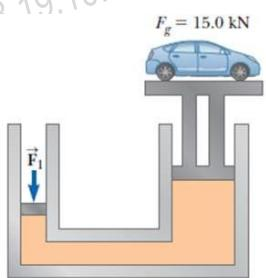
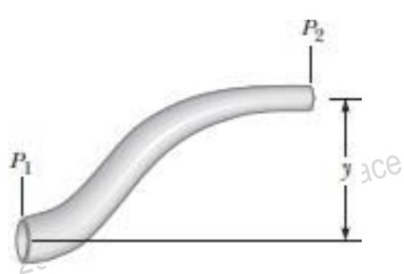

<table><tr><td rowspan="3">Ai</td><td>VIETTEL AI RACE V •</td><td>TD138</td></tr><tr><td>Co hoc chát luu</td><td>Làn ban hành: 1</td></tr><tr><td></td><td></td></tr></table>

Vật chất thông thường tồn tại $\acute { \mathbf { O } }$ ba trạng thái: rắn, lỏng, khí. Chúng ta biết rằng, ở trạng thái rắn vật chất sẽ có thể tích và hình dạng xác định, ở trạng thái lỏng thì chúng chỉ có thể tích xác định còn ở trạng thái khí thì ngay cả thể tích và hình dạng đều không xác định. Những mô tả trên chỉ cho chúng ta bức tranh cơ bản về các trạng thái tồn tại của vật chất nhưng nó không hoàn toàn chính xác. Ví dụ như nhựa đường (asphalt) và chất dẽo (plastics) thường được xem là những chất rắn nhưng sau một khoảng thời gian nó lại có xu hướng chảy như chất lỏng. Ngoài ra, trạng thái rắn, lỏng, khí của một vật chất phụ thuộc rất nhiều vào nhiệt độ và áp suất. Nói tóm lại, theo thời gian một vật chất nào đó sẽ thay đổi trạng thái rắn, lỏng, khí của nó tùy thuộc vào điều kiện bên ngoài.

Chất lưu là một hệ, gồm các phân tử sắp xếp một cách ngẫu nhiên, tương tác với nhau bằng một lực liên kết yếu và định hình được nhờ vào lực tác dụng của thành bình. Cả chất lỏng và chất khí đều là chất lưu.

Trong cơ học chất lưu, chúng ta áp dụng các định luật đã biết để nghiên cứu chất lưu ở trạng thái tĩnh và trạng thái động của chúng.

# Áp suất

Chất lưu không tác dụng lực căng hay lực kéo lên một vật, ở trạng thái tĩnh nó chỉ có một xu hướng là nén lên mọi mặt của một vật bất kỳ đặt trong nó. (Hình 14.1)

Áp suất của chất lưu có thể được đo bằng một dụng cụ rất đơn giản. Dụng cụ đo áp suất được cấu tạo bằng một xi-lanh rỗng được hút chân không nối với một pittông nhẹ bằng một lò xo. Ta có thể thấy cấu tạo của nó ở Hình 14.2.

Khi nhúng dụng cụ đo áp suất này vào chất lưu cần khảo sát thì chất lưu sẽ nén một lực F lên mặt bên ngoài của pittông. Lò xo bên dưới cũng sẽ bị nén theo cho đến khi lực nén

  
Hình 14.1: Lực nén của chất lưu lên một vật đặt trong nó

F của chất lưu cân bằng với lực đàn hồi của lò xo. Đo độ lớn của lực đàn hồi thì ta sẽ biết giá trị của lực nén F. Áp suất P của chất lưu khi đó chính là tỉ số giữa lực nén F và diện tích A của pittông. Tổng quát, áp suất của chất lưu chính là lực nén của chất lưu đó lên một đơn vị diện tích của bề mặt vật khác đặt trong nó. Công thức tính áp suất khi đó là:

$$
P = { \frac { F } { A } }
$$

<table><tr><td rowspan="3">Ai</td><td>VIETTEL AI RACE V -</td><td>TD138</td></tr><tr><td>Co hoc chát lru</td><td>Làn ban hành: 1</td></tr><tr><td></td><td></td></tr></table>

Nếu áp suất thay đổi trên toàn bề mặt của vật bị nén thì khi đó áp suất tại vi trí của diện tích nhỏ dA sẽ là:

$$
\begin{array} { r } { P = \frac { d F } { d A }  d F = P d A } \end{array}
$$

Vì vậy, lực tác dụng của chất lưu lên toàn diện tích bề mặt A của vật là:

  
Hình 14.2: Dụng cụ đo áp suất chất lưu

$$
\textstyle F = \int d F = \int P d A
$$

Đơn vị đó áp suất trong hệ SI là $\textstyle ( \mathrm { N } / \mathrm { m } ^ { 2 } )$ hay pascal $\mathrm { ( P a ) }$ :

$$
1 \mathrm { P a } = 1 \mathrm { N } / \mathrm { m } ^ { 2 }
$$

<table><tr><td rowspan="3">Ai</td><td>VIETTEL AI RACE V</td><td>TD138</td></tr><tr><td>Co hoc chát luu</td><td>Làn ban hành: 1</td></tr><tr><td></td><td></td></tr></table>

Mỗi bên của phương trình này là công của lực tác động lên piston tương ứng. Do đó, công của lực $\mathrm { F } _ { 1 }$ trên piston đầu vào bằng công của lực $\mathrm { F } _ { 2 }$ trên piston đầu ra, vì nó phải bảo tồn năng lượng.

Các ứng dụng khác của định luật Pascal: phanh thủy lực, nâng xe hơi, đòn bẩy thủy lực, xe nâng hàng.

# Phương pháp đo áp suất khí quyển

Áp suất khí quyển là một thông số quan trọng luôn được đề cập đến trong các chương trình dự báo thời tiết. Giá trị của áp suất khí quyển này thay đổi theo từng vùng, từng thời điểm chứ không phải là giá trị áp suất khí quyển chuẩn $\mathrm { P _ { o } }$ không đổi mà ta đã đề cập ở mục 14.2. Vậy, áp suất khí quyển này được đo như nào?

# Khí áp kế Torricelli

Một trong những khí áp kế phổ biến đã được chế tạo bởi nhà bác học Evangelista Torricelli (1608–1647). Áp kế này gồm một ống thủy tinh dài chứa đầy thủy ngân, được úp ngược vào một chậu cũng chứa thủy ngân (hình 14.5). Khi đó, áp suất tại mặt trên của cột thủy ngân trong ống là $\boldsymbol { \mathrm { P } } = \boldsymbol { 0 }$ .

Áp suất tại điểm B và điểm A trong thủy ngân là như nhau và bằng áp suất khí quyển. Nếu ta đặt áp $\mathrm { k } \acute { \mathrm { e } }$ này trong điều kiện chuẩn thì áp suất tại A và B chính là áp suất khí quyển $\mathrm { { { P } _ { 0 } } }$ . Vì cột thủy ngân trong ống được cân bằng nên lực nén do áp suất thủy ngân và trọng lực của cột thủy ngân tại điểm A sẽ cân bằng nhau, tức:

  
Hình 14.5: Áp kế khí thủy ngân

$$
P _ { o } = \rho _ { H g } g h
$$

$$
\begin{array} { r } { \stackrel { \triangledown } { \boldsymbol { \Psi } } _ { h } = \frac { \boldsymbol { P } _ { o } } { \rho _ { H g } g } } \end{array}
$$

<table><tr><td rowspan=2 colspan=1>Ai</td><td rowspan=1 colspan=1>VIETTEL AI RACE      V-</td><td rowspan=1 colspan=1>TD138</td></tr><tr><td rowspan=1 colspan=1>Co hoc chát luru</td><td rowspan=1 colspan=1>Làn ban hành: 1</td></tr></table>

  
Hình 14.6: Áp kế khí chữ U

Để đo áp suất khí P của khí trong bình ta đổ vào ống chữ U một chất lỏng và để hở trong không khí. Khi đó áp suất tại A và B là bằng nhau và bằng áp suất P của chất khí trong bình. Áp dụng công thức 14.6 ta có được: $P = P _ { o } + \rho g h$

Khi đó:

• $P$ là áp suất tuyệt đối của chất khí.   
• $P - P _ { o } = \rho g h$ : được gọi là áp suất tương đối của chất khí trong bình so với khí quyển.

Thông thường nếu không cần biết giá trị thực của áp suất thì người ta thường đo áp suất tương đối của chất khí đó bằng cách đo độ cao chênh lệch h của chất lỏng. Ví dụ, áp suất khí ta đo được trong lốp xe chính là áp suất tương đối.

# Động lực học chất lưu

Ở các nội dung trước, ta đã khảo sát chất lưu ở trạng thái tĩnh. Trong đề mục này ta sẽ khảo sát chất lưu ở trạng thái chuyển động. Khi một chất lưu chuyển động thì chuyển động của nó sẽ thuộc một trong hai loại: chuyển động thành dòng (lớp) (hình 14.7) hay chuyển động rối (hình 14.8).

Trong chuyển động của chất lưu ta sẽ gặp khái niệm độ nhớt. Độ nhớt chính là đại lượng đặc trưng cho mức độ ma sát giữa các lớp chất lưu lên nhau khi chúng chuyển động. Vì chuyển động thực tế của chất lưu rất phức tạp nên trước tiên chúng ta sẽ khảo sát chuyển động của chất lưu lý tưởng với các điều kiện như sau:

<table><tr><td rowspan="3">Ai</td><td>VIETTEL AI RACE V</td><td>TD138</td></tr><tr><td>Co hoc chát luru</td><td>Làn ban hành: 1</td></tr><tr><td></td><td></td></tr></table>

Hình 14.7: Chuyển động thành lớp của chất khí khi xe chuyển động trong hầm

  
Hình 14.8: Khói thuốc chuyển động trong sự chảy thành dòng ở phía dưới và trong sự chảy rối ở phía trên.

1. Trong chất lưu lý tưởng thì ma sát giữa các lớp chất lưu khi chuyển động được bỏ qua.   
2. Chất lưu lý tưởng sẽ chuyển động thành dòng. Ở chế độ chuyển động này, mọi hạt   
chất lưu qua một điểm sẽ có cùng vận tốc.   
3. Mật độ khối lượng của chất lưu là không thay đổi, hay chất lưu là không chịu nén.   
4. Chất lưu không có chuyển động xoáy.

Đường dòng là đường cong sao cho tiếp tuyến với nó tại mỗi điểm trùng với vectơ của phân tử chất lưu tại điểm đó (hình 14.9).

  
Hình 14.9: Hình ảnh đường dòng của chất lưu

Một tập hợp các đường dòng tạo thành một ống dòng. Các hạt chất lưu không đi vào hay

<table><tr><td rowspan="3">Ai</td><td>VIETTEL AI RACE V -</td><td>TD138</td></tr><tr><td>Co hoc chát lru</td><td>Làn ban hành: 1</td></tr><tr><td></td><td></td></tr></table>

đi ra một ống dòng.

<table><tr><td rowspan="3">Ai</td><td>VIETTEL AI RACE V</td><td>TD138</td></tr><tr><td>Co hoc chát luru</td><td>Làn ban hành: 1</td></tr><tr><td></td><td></td></tr></table>

Lưu lượng thể tích của chất lưu qua một tiết diện là đại lượng đo bằng thể tích chất lưu qua tiết diện đó trong một đơn vị thời gian. Với tiết diện có diện tích A và vuông góc với vận tốc $v $ của chất lưu (giả định vận tốc $v $ của chất lưu là như nhau tại mọi điểm thuộc tiết diện đang xét) thì lưu lượng qua tiết diện này bằng: Aν. Đơn vị của lưu lượng thể tích trong hệ SI $\mathrm { l } \dot { \mathrm { a } } \frac { \overline { { 3 } } } { s } .$

Chất lưu lý tưởng khi chuyển động sẽ tuân theo phương trình liên tục: lưu lượng thể tích chất lưu qua mọi tiết diện vuông góc với ống dòng khác nhau trong cùng một ống dòng của chất lưu đều bằng nhau, tức là:

$$
A _ { 1 } \nu _ { 1 } = A _ { 2 } \nu _ { 2 } = . . . = A _ { \mathrm { i } } \nu _ { \mathrm { i } } = { \mathrm { c o n s t } }
$$

Với $A _ { 1 } , A _ { 2 } , . . . , A _ { \mathrm { i } }$ lần lượt là diện tích của mặt cắt 1, 2, …, thứ i trong cùng một ống dòng, còn $\nu _ { 1 }$ , ν2, …, $\nu _ { 1 }$ lần lượt là vận tốc của chất lưu tại mặt cắt 1, 2, …, thứ i trong cùng một ống dòng.

# Phương trình Bernoulli

Cho chất lưu lý tưởng chuyển động trong một ống dòng như hình 14.10.

Áp suất tại mỗi điểm của chất lưu lý tưởng sẽ tuân theo phương trình Bernoulli:

$$
P + \frac { 1 } { 2 } \rho \nu ^ { 2 } + \rho g y = c o n s t a n t
$$

Với:

• y là độ cao của tiết diện đó

• P là áp suất chất lưu tại một điểm bất kỳ trong dòng chảy.

• ρ là mật độ khối lượng của chất lưu

• ν là vận tốc dòng chảy tại tiết điện đó.

  
Hình 14.10: Dòng chảy của chất lưu lý tưởng qua các tiết diện khác nhau

<table><tr><td rowspan="3">Ai</td><td>VIETTEL AI RACE V •</td><td>TD138</td></tr><tr><td>Co hoc chát luru</td><td>Làn ban hành: 1</td></tr><tr><td></td><td></td></tr></table>

# Các ứng dụng của động lực học chất lưu

Lý thuyết động lực học chất lưu có thể giúp ta giải thích được các hiện tượng liên quan chuyển động của các vật thể trong chất lưu. Đầu tiên ta sẽ khảo sát dòng khí chuyển động qua cánh máy bay có hình ảnh các đường dòng như hình 14.11.

Giả sử dòng khí đang chuyển động theo phương ngang từ phải sang trái với vận tốc ??→1 . Khi gặp cánh máy bay, do độ nghiêng của cánh dòng chảy của chất khí bị bẻ cong lõm xuống với vận tốc ??→ 2 . Cánh máy bay đã tác dụng một lực lên dòng khí và theo định luật III Newton, dòng khí này cũng tác dụng ngược lại lên máy bay một lực $\pmb { F } ^ { \sharp }$ cùng độ lớn nhưng ngược chiều. Lực này được phân tích thành 2 thành phần là lực nâng và lực cản. Lực nâng tác dụng vào cánh máy bay sẽ phụ thuộc vào các yếu tố như: tốc độ của máy bay, diện tích của cánh, độ cong của cách máy bay và góc giữa cánh máy bay so với phương ngang. Độ cong của cánh máy bay phải được thiết kế sao nhằm làm cho áp suất khí $\dot { \mathbf { O } }$ phía trên cánh máy bay nhỏ hơn phía dưới tuân theo định luật Bernoulli. Chính sự chênh lệch áp suất này đã giúp nâng cánh máy bay lên. Khi góc chênh lệch giữa cánh máy bay và phương ngang tăng thì sẽ làm xuất hiện các dòng chảy xoáy làm giảm lực nâng.

Cánh máy bay đã bẻ cong các dòng chảy của chất khí đang chuyển động từ phải sang trái

  
Hình 14.11: Dòng chảy của khí qua cánh máy bay

Một cách tổng quát, khi một vật thể chuyển động xuyên qua một chất lưu thì nó sẽ bẻ cong các dòng chảy làm sinh ra lực nâng tác dụng lên vật đó. Một vài yếu tố ảnh hưởng lên lực nâng này là: hình dạng của vật, sự định hướng của vật so với dòng chảy, chuyển động xoáy và kết cấu bề mặt của vật thể đó.

# Ví dụ về quả banh golf:

Quả banh được cung cấp một chuyển động quay lùi. Các chỗ trũng trên mặt banh làm tăng ma sát với không khí làm cho lực nâng tăng lên. Lực nâng do chuyển động xoáy của bóng tạo ra sẽ làm cho độ tăng tầm xa lớn hơn độ giảm tầm xa gây ra bởi lực ma sát trong chuyển động tịnh tiến của quả bóng.

# Ví dụ về máy phun:

Một dòng khí chạy qua phía trên của một ống hở hai đầu. Đầu còn lại của ống được nhúng vào một chất lỏng. Dòng khí chuyển động làm giảm áp suất phía trên ống. Chất lỏng dâng lên

<table><tr><td rowspan="3">Ai</td><td>VIETTEL AI RACE V</td><td>TD138</td></tr><tr><td>Co hoc chát luru</td><td>Làn ban hành: 1</td></tr><tr><td></td><td></td></tr></table>

đến dòng khí. Chất lỏng bị phân tán vào trong ống phun dưới dạng các hạt nhỏ.

<table><tr><td rowspan="3">Ai</td><td>VIETTEL AI RACE V •</td><td>TD138</td></tr><tr><td>Co hoc chát luu</td><td>Làn ban hành: 1</td></tr><tr><td></td><td></td></tr></table>

# Câu hỏi lý thuyết chương 14

1. Khi một vật được nhúng trong một chất lỏng, tại sao tổng hợp lực tác dụng lên vật theo phương ngang bằng không?

2. Hai ly uống nước có bề dày mỏng và có diện tích đáy bằng nhau nhưng hình dạng khác nhau, với các mặt cắt ngang rất khác nhau ở mặt trên của hai ly, được đổ đầy với cùng một mực nước. Theo công thức $P = P _ { o } + \rho g h$ , áp suất là như nhau ở mặt dưới (hay đáy) của cả hai ly. Theo quan điểm này, tại sao khi người ta cân thì hai ly có trọng lượng khác nhau?

3. Một con cá nằm yên ở đáy cùng của một xô nước, trong khi xô đang được đặt trên một cái cân. Khi cá bắt đầu bơi xung quanh, kim của cân có thay đổi không? Giải thích.

4. Việc cấp nước cho một thành phố thường được cung cấp từ các hồ chứa được xây dựng ở nơi đất cao. Nước chảy từ hồ chứa, qua đường ống, và vào nhà của bạn. Tại sao khi bạn bật vòi nước ở tầng trệt của một tòa nhà thì nước chảy nhanh hơn so với khi bật vòi nước trong một căn hộ ở tầng cao hơn?

5. Một con tàu đậu trong hồ nội địa sẽ nổi cao hơn hay thấp hơn khi con tàu đậu trong đại dương? Tại sao?

# Bài tập chương 14

1. Một phụ nữ $^ { 5 0 , 0 \mathrm { k g } }$ mang giày cao gót được mời vào nhà trong đó nhà bếp lót bằng sàn vinyl. Đế gót có hình tròn và bán kính 0,500 cm.

(a) Nếu người phụ nữ đứng cân bằng trên một gót chân, tính áp lực cô ấy gây ra trên sàn? (b) Chủ nhà có quan tâm không? Giải thích câu trả lời của bạn.

$$
\mathrm { D S } \colon \mathrm { a } ) P = 6 . 2 4 \times 1 0 ^ { 6 } \frac { N } { m ^ { 2 } } \ .
$$

2. (a) Máy hút bụi rất mạnh có ống hút với đường kính 2,86 cm. Đầu cuối của ống hút đặt vuông góc trên mặt phẳng của một viên gạch, trọng lượng lớn nhất của viên gạch bằng bao nhiêu để người lau dọn có thể nâng nó lên?

(b) Chuyện gì sẽ xảy ra nếu bạch tuộc sử dụng một con vòi có đường kính 2,86 cm trên mỗi hai vỏ sò để kéo vỏ ra ngoài. Tìm lực lớn nhất bạch tuộc có thể gây ra trên một vỏ sò trong nước muối sâu $^ { 3 2 , 3 \mathrm { ~ m ~ } }$ .

ĐS: a) F b) $F = 2 7 5 N$

3. Piston nhỏ của máy nâng thủy lực có diện tích mặt cắt ngang $3 { , } 0 0 c m ^ { 2 }$ , và piston lớn có diện tích mặt cắt ngang là $2 0 0 \ c m ^ { 2 }$ . Cần phải áp lực nén $F _ { 1 }$ bằng bao nhiêu lên piston nhỏ để máy nâng nâng được tải trọng $F _ { g } = 1 5 k N ?$

<table><tr><td rowspan="3">Ai</td><td>VIETTEL AI RACE V</td><td>TD138</td></tr><tr><td>Co hoc chát lru</td><td>Làn ban hành: 1</td></tr><tr><td></td><td></td></tr></table>

ĐS: $F _ { 1 }$

<table><tr><td rowspan="3">Ai</td><td>VIETTEL AI RACE</td><td>TD138</td></tr><tr><td>Co hoc chát lru</td><td>Làn ban hành: 1</td></tr><tr><td></td><td></td></tr></table>

4. $\mathrm { B } \mathring { \boldsymbol { \mathrm { e } } }$ chứa trong hình chứa đầy nước với chiều cao $\mathrm { d } = 2 { , } 0 0 \mathrm { m }$ . Mặt bên của bể chứa có một cửa $\mathrm { s } \dot { \hat { 0 } }$ hình chữ nhật (chiều cao $\mathrm { h } { = } 1 , 0 0 \mathrm { m }$ và chiều rộng $\mathrm { w } { = } 2 , 0 0 \mathrm { m }$ ) với bản $1 \dot { \hat { \mathrm { e } } }$ đặt ở phía trên của cửa sổ.

(a) Xác định độ lớn của lực mà nước tác động lên cửa sổ. (b) Tìm độ lớn của mô-men xoắn của lực mà nước tác động lên cửa sổ đối với bản lề.

ĐS: a) $F = 2 9 . 4 k N$ b) $\tau = 1 6 . 3 k N . m$ .

5. Piston 1 trong hình bên có đường kính 0.250 in ( $\mathrm { 1 i n } { = } 2 . 5 4 \mathrm { c m }$ ). Piston 2 có đường kính 1,50 in. Xác định độ lớn của lực F, cần thiết để đỡ được tải trọng 500 lb $\scriptstyle 1 1 6 = 0 . 4 5 3 5 9 2$ ) khi không có ma sát.

ĐS: $F = 2 . 3 1 l b$

6. Blaise Pascal làm một bản sao áp $\mathrm { k } \acute { \mathrm { e } }$ của Torricelli nhưng sử dụng rượu vang đỏ Bordeaux, mật độ khối lượng $9 8 4 ~ \mathrm { k g } / m ^ { 3 }$ thay thế cho thủy ngân.

(a) Chiều cao h của cột rượu đối với áp suất bình thường của khí quyển bằng bao nhiêu?   
(b) Chân không ở phía trên cột rượu có tốt như khi dùng thủy ngân không?   
ĐS: a) $h = 1 0 . 5 m$ .

7. Đổ thủy ngân vào ống chữ U. Nhánh trái của ống có diện tích ngang $A _ { 1 }$ là $1 0 { , } 0 \ c m ^ { 2 }$ nhánh phải có diện tích ngang $A _ { 2 }$ là $5 { , } 0 0 c m ^ { 2 }$ . Đổ 100gr nước vào nhánh phải như hình.

(a) Xác định chiều dài của cột nước $\dot { \mathbf { O } }$ nhánh phải của ống chữ U. (b) Với mật độ thủy ngân là $1 3 , 6 \mathrm { g } / c m ^ { 3 }$ , chiều dài của cột thủy ngân ở nhánh bên trái sẽ tăng thêm một đoạn h bằng bao nhiêu?

ĐS: a) $h { = } 2 0 . 0 c m$ b) $\Delta h { \stackrel { } { = } } 0 . 4 9 0 c m$

<table><tr><td rowspan="3">Ai</td><td>VIETTEL AI RACE V</td><td>TD138</td></tr><tr><td>Co hoc chát lru</td><td>Làn ban hành: 1</td></tr><tr><td></td><td></td></tr></table>

<table><tr><td rowspan="3">Ai</td><td>VIETTEL AI RACE V</td><td>TD138</td></tr><tr><td>Co hoc chát luru</td><td>Làn ban hành: 1</td></tr><tr><td></td><td></td></tr></table>

8. Khối kim loại nặng $1 0 { , } 0 \mathrm { k g }$ có kích thước 12,0 cm x 10,0 cmx 10,0 cm được treo vào lực $\mathrm { k } \acute { \mathrm { e } }$ và đươc nhúng vào nước. Chiều cao của khối kim loại là $1 2 { , } 0 \ \mathrm { c m }$ , và mặt trên của khối cách mặt nước $5 . 0 0 \mathrm { c m }$ .

(a) Tính độ lớn lực tác động lên mặt trên và mặt dưới của khối?   
(b) Đọc số chỉ lực kế?   
(c) Chứng minh rằng lực nâng bằng với độ chênh lệch của hai lực trên?

ĐS: a) $F _ { t o p } = 1 . 0 1 7 9 \times 1 0 ^ { 3 } N ; F _ { b o t } = 1 . 0 2 9 7 \times 1 0 ^ { 3 } N \mathrm { ~ b } )$ (d

$$
T = 8 6 . 2 N
$$

9. Cần phải có bao nhiêu mét khối hêli để nâng một khí cầu nhẹ có treo một tải trọng 400 kg lên đến độ cao $8 0 0 0 { \mathrm { m } } ?$ Lấy khối lượng riêng của He $\rho _ { H e } = 0 , 1 7 9 \mathrm { k g } / m ^ { 3 }$ . Giả sử thể tích khí cầu không đổi và mật độ không khí giảm theo độ cao $\mathbf { Z }$ theo biểu thức $\rho _ { k h \hat { 0 } n g k h i } = \ \rho _ { 0 } e _ { \mathrm { ~ \tiny ~ , ~ } } / 8 0 0 0$ , trong đó $\mathbf { Z }$ tính bằng mét và $\rho _ { 0 } { = } 1 { , } 2 0 \mathrm { k g } / m ^ { 3 }$ là mật độ không khí $\dot { \mathbf { O } }$ mực nước biển.

ĐS: $V = 1 . 5 2 \times 1 0 ^ { 3 } m ^ { 3 }$

10. Nước chảy qua một ống có đường kính 2.74 cm, đổ đầy một thùng 25 lít trong 1.50 phút.

(a) Tốc độ của nước rời khỏi đầu ống là bao nhiêu?   
(b) Một vòi phun được gắn vào đầu ống. Nếu đường kính vòi phun bằng 1/3 đường kính của ống, tốc độ của nước rời khỏi vòi phun là bao nhiêu?

ĐS: a) $\nu = ^ { 0 . 4 7 1 } \frac { m } { s } \ \mathbf { b } ) \ \nu = ^ { 4 . 2 4 } \frac { m } { s }$

11. Nước di chuyển qua một đường ống có tiết diện nhỏ dần trong dòng chảy ổn định (lý tưởng). Tại điểm thấp hơn thể hiện trong hình, áp suất $\mathtt { | i \mathrm { P } _ { 1 } = 1 . 7 5 \mathrm { x } 1 0 ^ { 4 } }$ Pa và đường kính ống là 6,00 cm. Tại một điểm khác cao hơn một đoạn $\mathrm { y } = 0 { , } 2 5 0 \mathrm { m } .$ áp suất là $\mathrm { P } _ { 2 } = 1 \mathrm { , } 2 0 \mathrm { x } 1 0 ^ { 4 }$ Pa và đường kính ống là 3,00 cm.

(a) Tìm tốc độ dòng chảy qua các tiêt diện $\dot { \mathbf { O } }$ hai đầu của đoạn ống trên. $( \mathsf { b } ) \mathsf { T i m }$ lưu lượng nước chảy qua ống.

<table><tr><td rowspan="3">Ai</td><td>VIETTEL AI RACE V -</td><td>TD138</td></tr><tr><td>Co hoc chát luru</td><td>Làn ban hành: 1</td></tr><tr><td></td><td></td></tr></table>

12. Một ống hút được sử dụng để lấy nước từ một bể như minh họa trong hình bên. Giả sử dòng chảy ổn định không có ma sát.

<table><tr><td rowspan="3">Ai</td><td>VIETTEL AI RACE</td><td>TD138</td></tr><tr><td>Co hoc chát luru</td><td>Làn ban hành: 1</td></tr><tr><td></td><td></td></tr></table>

(a) $\mathrm { N } \hat { \ e } \mathrm { u } \mathrm { h } = 1 , 0 0 \mathrm { m }$ , hãy tìm tốc độ dòng chảy ở cuối ống hút. (b) Tìm giới hạn về chiều cao của đỉnh ống hút (y) ở phía trên đầu của ống hút. Lưu ý: đối với dòng chảy của chất lỏng liên tục, áp suất của nó không được giảm xuống dưới áp suất hơi bão hòa của nó. Giả sử nước ở $2 0 { , } 0 ^ { 0 } \mathrm { C } ,$ , tại đó áp suất hơi bão hòa là $2 { , } 3 \mathrm { k P a }$ .

$$
\begin{array}{c} \nu = ^ { 4 . 4 3 } \frac { m } { s } \ b ) \ \gamma  \\ & { \leq 1 0 . 1 m } \end{array}
$$

13. Nước bị ép ra khỏi bình chữa cháy nhờ áp suất không khí được nén trong bình như trong hình. Áp suất khí trong bình bằng bao nhiêu để nước bị ép ra khỏi bình có tốc độ ${ 3 0 } \mathrm { , 0 ~ m / s }$ , khi mực nước trong bình thấp hơn vòi phun $0 { , } 5 0 0 \mathrm { m } ?$

ĐS: $P = 4 5 5 k P a$

14. Một tia nước phun ra theo chiều ngang từ một lỗ gần đáy bể. Nếu lỗ có đường kính $3 { , } 5 0 \ \mathrm { m m }$ , chiều cao h của mực nước trong bể là bao nhiêu?

ĐS: $h { = } 9 . 0 0 c m$

