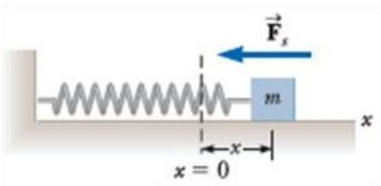
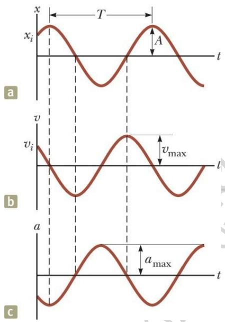
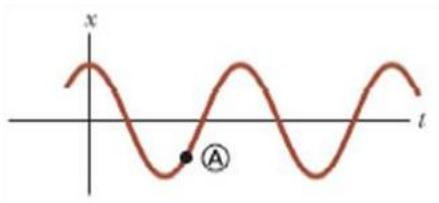
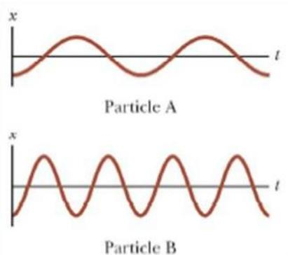
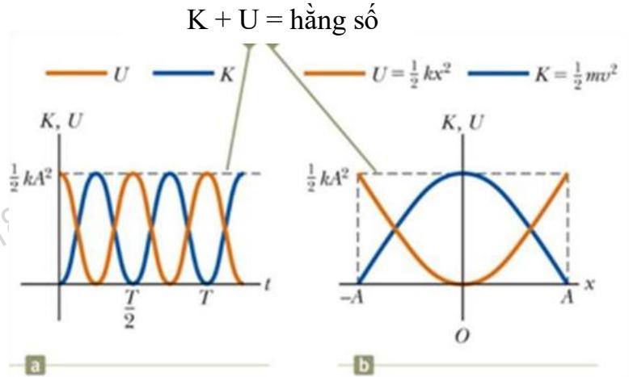
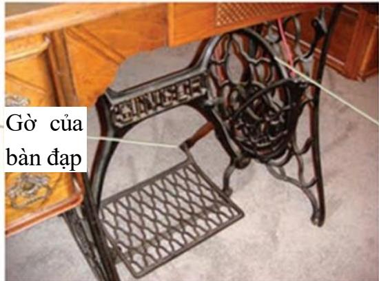
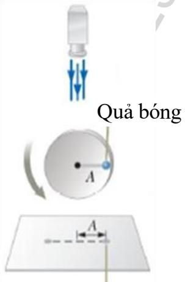

Chuyển động tuần hoàn là một chuyển động lặp đi lặp lại của một vật theo thời gian. Sau một khoảng thời gian nhất định, vật trở về một vị trí cho trước. Một loại chuyển động tuần hoàn đặc biệt xảy ra trong các hệ cơ học được gọi là dao động. Đặc điểm của các hệ thống này là:

• Hệ có một vị trí cân bằng bền và chuyển động qua lại hai bên vị trí đó.   
• Lực tác dụng lên hệ luôn hướng về vị trí cân bằng (thường gọi là lực hồi phục).

Chúng ta có thể gặp các dao động trong thực tế như: dây đàn ghi ta, mặt trống khi rung động, dao động của cây cầu, của nhà cao tầng.

Nếu trong hệ dao động, lực tác dụng lên vật tỉ lệ thuận với độ dời của vật (so với vị trí cân bằng) thì dao động này được gọi là dao động điều hòa.Đây là loại dao động sẽ được nghiên cứu kỹ trong chương này.Tầm quan trọng của việc nghiên cứu này là ở chỗ: các dao động trong tự nhiên và trong kỹ thuật thường có tính chất rất gần với dao động điều hòa và mọi dao động tuần hoàn có thể được biểu diễn như sự tổng hợp của các dao động điều hòa.

Lý thuyết về dao động là cơ sở quan trọng để nghiên cứu một hiện tượng vật lý khác là hiện tượng sóng.

# Chuyển động của vật gắn với lò xo

Xét một vật nhỏ có khối lượng m(xem như chất điểm) được gắn với một lò xo có một đầu cố định. Vật mcó thể chuyển động không ma sát trên mặt phẳng ngang như Hình 15.1.Khi lò xo không co giãn, vật sẽ ở đứng yên ở vị trí gọi là vị trí cân bằng.Khi truyền cho vật một vận tốc từ vị trí cân bằng, vật sẽ dao động xung quanh vị trí này.

Chọn trục x dọc theo phương của lò xo, gốc O tại vị trí cân bằng. Khi vật ở vị trí có tọa $\hat { \mathrm { d } } \hat { \mathrm { o } } x$ thì lực đàn hồi do lò xo tác dụng lên vật được xác định theo định luật Hooke:

  
Hình 15.1

$$
F _ { s } = - k . x
$$

Lực $F _ { s }$ luôn hướng về vị trí cân bằng và luôn ngược dấu với tọa $\mathtt { d } \hat { \boldsymbol { \mathrm { o } } } \boldsymbol { x } . \boldsymbol { x }$ được gọi là độ dời của vật (tính từ vị trí cân bằng, dưới đây gọi là li độ).

Áp dụng định luật Newton thứ hai cho vật, ta tìm được gia tốc của vật như sau:

$$
\begin{array} { c } { { F _ { x } = m a _ { x } \qquad { \displaystyle  ~ } - k x = m a _ { x } } } \\ { { a _ { x } = { } - { \displaystyle \frac { k } { m } } x } } \end{array}
$$

Từ 15.2 ta thấy gia tốc của vật tỉ lệ thuận với độ dời và ngược dấu với độ dời của vật.

Những hệ thống hoạt động theo quy luật này sẽ thực hiện một dao động điều hòa.

Một vật thực hiện dao động điều hòa khi gia tốc của vật tỉ lệ thuận với độ dời và ngược dấu với độ dời của vật.

# Khảo sát dao động cơ điều hòa

Thay $a _ { x } = d v / d t = d ^ { 2 } x / d t ^ { 2 }$ vào 15.2 ta được phương trình:

$$
{ \frac { d ^ { 2 } x } { d t ^ { 2 } } } = - { \frac { k } { m } } x
$$

Đặt

$$
\omega ^ { 2 } = { \frac { k } { m } }
$$

thì phương trình 15.3 trở thành:

$$
\frac { d ^ { 2 } x } { d t ^ { 2 } } = - \omega ^ { 2 } x
$$

Nghiệm của phương trình 15.5 là:

$$
x ( t ) = A \cos ( \omega t + \phi )
$$

Trong đó $A$ là biên độ dao động, $\omega$ là tần số góc và $\phi$ là pha ban đầu. $A , \omega$ và $\phi$ đều là các hằng số. Biên độ $A$ và pha ban đầu $\phi$ được xác định từ các điều kiện ban đầu (độ dời và vận tốc lúc $t = 0$ ).

Đại lượng $( \omega t + \phi )$ gọi là pha của dao động.

Từ 15.4 ta có biểu thức xác địnhtần số góc dao động:

$$
\omega = \mathrm { \sqrt { \frac { \it k } { m } } }
$$

Hai đại lượng quan trọng đặc trưng cho dao động là chu kỳ và tần số dao động. Chu kỳ T của dao động là khoảng thời gian vật hoàn thành một dao động. Dựa vào tính chất tuần hoàn của hàm số x(t) cho bởi phương trình 15.6, ta tìm được:

$$
T = \frac { 2 \pi } { \omega } = ~ 2 \pi \sqrt { \frac { m } { k } }
$$

Tần số f của dao động là số dao động diễn ra trong một đơn vị thời gian:

$$
f = { \cfrac { 1 } { T } } = { \cfrac { 1 } { 2 \pi } } \sqrt { \cfrac { k } { m } }
$$

Từ 15.6 chúng ta suy ra biểu thức của vận tốc và gia tốc như sau:

$$
\begin{array} { l } { { v ( t ) = - A \omega \sin ( \omega t + \phi ) } } \\ { { a ( t ) = - A \omega ^ { 2 } \cos ( \omega t + \phi ) } } \end{array}
$$

Các phương trình 15.6, 15,10 và 15.11 cho thấy: li độ $x$ và vận tốc $\nu$ lệch pha một góc $\pi / 2$ còn li $\widehat { \mathrm { d } } \widehat { \mathrm { o } } \ x$ và gia tốc $a$ lệch pha một góc bằng $\pi$ . Ngoài ra các giá trị cực đại của vận tốc và gia tốc được suy ra từ các phương trình 15.10 và 15.11 là

$$
v _ { m a x } = \omega A = \sqrt { \frac { k } { m } } \ A
$$

$$
\begin{array} { r } { a _ { m a x } = \omega ^ { 2 } A = \frac { k } { m } A } \end{array}
$$

Câu hỏi 15.1: Một vật gắn với lò xo được kéo đến vị trí $x = A$ và được thả ra từ trạng thái nghỉ. Trong một dao động hoàn chỉnh, chiều dài quãng đường vật đi được bằng:

(a) A/2 (b) A (c) 2A (d) 4A

Hình 15.2 Đồ thị biểu diễn sự phụ thuộc theo thời gian của: a.Li độ b. Vận tốc c. Gia tốc

Câu hỏi 15.2: Một hạt dao động điều hòa có đồ thị li độ theo thời gian được cho như hình vẽ. Khi hạt ở điểm A trên đồ thị, Chúng ta có thể nói gì về li độ và vận tốc của hạt ?

(a) Li độ và vận tốc của hạt đều dương.   
(b) Li độ của hạt âm, vận tốc của hạt bằng không.   
(c) Li độ và vận tốc của hạt đều âm.   
(d) Li độ của hạt âm, vận tốc của hạt dương.

  
Hình vẽ cho câu hỏi 15.2

Câu hỏi 15.3: Hình bên là đồ thị của li độtheo thời gian của hai hạt A và B dao động điều hòa. Dao động điều hòa của B

(a) có tần số góc lớn hơn và biên độ lớn hơn của A.   
(b) có tần số góc lớn hơn và biên độ nhỏ hơn của A.   
(c) có tần số góc nhỏ hơn và biên độ lớn hơn của A.   
(d) có tần số góc nhỏ hơn và biên độ nhỏ hơn của A.

Câu hỏi 15.4: Một vật khối lượng mtreo vào một lò xo rồi cho dao động. Chu kỳ của dao động này là T. Thay vậtm bằng vật có khối lượng 2m. Cho vật 2m dao động thì chu kỳ của dao động bằng:

(a) 2T (b) √2?? (c) T (d) ??/√2e.T/2

  
Hình vẽ cho câu hỏi 15.3

# Năng lượng của vật dao động điều hòa

Trong nội dung này chúng ta sẽ xem xét cơ năng của hệ dao động. Vì bỏ qua tác dụng của lực ma sát nên cơ năng của hệ được bảo toàn. Chúng ta sẽ sử dụng hệ dao động con lắc lò xo để thực hiện việc khảo sát này.

Động năng của hệ dao động chỉ là động năng của vật và bằng:

$$
K = { \frac { 1 } { 2 } } ~ m v ^ { 2 } = { \frac { 1 } { 2 } } ~ m \omega ^ { 2 } A ^ { 2 } \sin ^ { 2 } ( \omega t + \phi )
$$

Thế năng đàn hồi dự trữ $\acute { \mathbf { O } }$ lò xo và bằng (Lưu ý rằng $k = m \omega ^ { 2 }$ ):

$$
U = { \frac { 1 } { 2 } } \ k x ^ { 2 } = { \frac { 1 } { 2 } } \ m \omega ^ { 2 } A ^ { 2 } \cos ^ { 2 } ( \omega t + \phi )
$$

Cơ năng của hệ dao động điều hòa bằng:

$$
E = K + U = \frac { 1 } { 2 } \ : m \omega ^ { 2 } A ^ { 2 } [ \sin ^ { 2 } ( \omega t + \phi ) + \ : \cos ^ { 2 } ( \omega t + \phi ) ]
$$

$$
E = { \frac { 1 } { 2 } } \ m \omega ^ { 2 } A ^ { 2 } = { \frac { 1 } { 2 } } \ k A ^ { 2 }
$$

Kết quả thu được cho chúng ta thấy cơ năng của hệ dao động điều hòa là một hằng số và tỉ lệ thuận với bình phương biên độ dao động. Đồ thị ở hình 15.3 minh họa sự bảo toàn năng lượng của hệ.

  
Hình 15.3: a. Đồ thị biểu diễn biểu diễn sự phụ thuộc của động năng và thế năng   
theo thời gian với $\phi$ $= 0$ .

b. Đồ thị biểu diễn biểu diễn sự phụ thuộc của động năng và thế năng

theo li độ.

Ngoài ra, từ $\mathrm { k } \acute { \mathrm { e t } }$ quả thu được cho năng lượng, ta có thể suy ra vận tốc của vật:

$$
E = K + U = { \frac { 1 } { 2 } } \ m v ^ { 2 } + { \frac { 1 } { 2 } } \ k x ^ { 2 } = { \frac { 1 } { 2 } } \ k A ^ { 2 }
$$

$$
v = \pm { \sqrt { { \frac { k } { m } } ( A ^ { 2 } - x ^ { 2 } ) } } = \pm \omega { \sqrt { ( A ^ { 2 } - x ^ { 2 } ) } }
$$

# Liên hệ giữa dao động điều hòa và chuyển động tròn đều

Trong thực tế cuộc sống, có nhiều thiết bị thể hiện mối liên hệ giữa dao độngđiều hòa và chuyển động tròn đều. Ví dụ, bộ phận truyền động của máy may cơ như hình 15.4 dưới đây. Khi chân của thợ may đạp tới lui vào bàn đạp tạo ra những dao động lên xuống chogờ bàn đạp và kéo theo chuyển động tròn của bánh xe truyền động. Chuyển động tròn này được truyền vào máy may nhờ sợi dây truyền động và dẫn đến kết quả là kim khâu dao động thẳng đứng. Trong phần này chúng ta sẽ tìm hiểu mối quan hệ giữa hai loại chuyển động này.

Hình 15.5 là một bố trí thực nghiệm để chỉ ra mối liên hệ giữa chuyển động tròn đều và dao động cơ điều hòa. Một quả cầu nhỏ(được xem như một chất điểm) gắn vào vành của đĩa tròn bán kính $A$ để chuyển động cùng với đĩa khi đĩa quay. Cho đĩa tròn quay đều. Chiếu đèn vào quả cầu, ta sẽ thấy cái bóng của quả cầuthực hiện một dao động trên màn.

  
Hình 15.4

Cụ thể hơn, hãy quan sát hình 15.6 trong đó chất điểm chuyển động tròn đềuvới tốc độ góc ωtrên đường tròn tâm O bán kính $\dot { \boldsymbol { A } } . \dot { \boldsymbol { \mathrm { O } } }$ thời điểm $t = 0$ chất điểm $\dot { \mathbf { O } }$ vị trí P trên đường tròn có bán kính OP tạo với trục $x$ một góc $\phi$ (Hình 15.6a). Ởthời điểm $t .$ , vị trí $\mathrm { P }$ của chất điểm trên đường tròn có bán kính OP tạo với trục x một góc?? $\mathbf { \omega } = ( \omega t + \mathbf { \beta } \phi )$ (Hình 15.6b). Gọi Q là hình chiếu của P lên trục $x .$ , thì tọa độ của $\mathrm { Q }$ được xác định như sau:

$$
x ( t ) = A { \cos } ( \omega t { \mathrm { ~ + ~ } } \phi )
$$

Chuyển động của bóng của quả cầu.

Hình 15.5

#

Kết quả này chứng tỏ chứng tỏ Q dao động điều hòa trên trục x quanh vị trí cân bằng O với biên độ là A(A là bán kính quỹ đạo tròn của P). Chúng ta cũng thấy rằng

tốc độ góc ω củaP bằng với tần số góc của Q, chu kỳ chuyển động tròn của P Q và pha ban đầu $\phi$ của Q bằng góc mà OP hợp với trục x ở thời điểm $t = 0$ .

$+ ~ \phi )$ tương ứng bằng với vận tốc và gia tốc trong