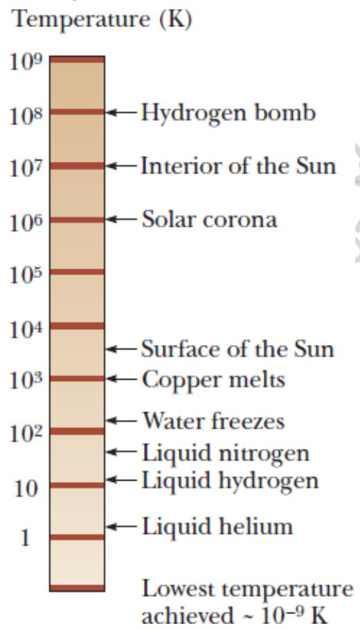

Trong cơ học, chúng ta đã xác định khái niệm về khối lượng, lực và động năng để tạo tiền đề cho phương pháp định lượng. Tương tự như vậy, một khái niệm định lượng về các hiện tượng nhiệt đòi hỏi phải định nghĩa đầy đủ về nhiệt độ, nhiệt lượng và nội năng. Chương này bắt đầu với bài viết về nhiệt độ. Tiếp theo, chúng ta xem xét tầm quan trọng khi nghiên cứu các hiện tượng nhiệt của các chất đặc biệt. Ví dụ: các loại khí giãn nở đáng $\bar { \mathrm { k } } \bar { \hat { \mathrm { e } } }$ khi nung nóng, trong khi chất lỏng và chất rắn giãn nở ít hơn. Chương này kết thúc với một nghiên cứu về khí lý tưởng ở mức vĩ mô. Ở đây, chúng ta chỉ quan tâm đến các mối quan hệ định lượng giữa áp suất, thể tích và nhiệt độ của một chất khí.

# Nhiệt độ và nguyên lý thứ không của nhiệt động lực học

# Nhiệt độ

Chúng ta thường kết hợp các khái niệm về nhiệt độ với độ nóng hoặc lạnh một đối tượng khi chúng ta chạm vào nó. Bằng cách này, các giác quan cho ta chỉ số định tính của nhiệt độ. Tuy nhiên, giác quan của chúng ta không đáng tin cậy và thường đánh lừa chúng ta.

Ví dụ, nếu bạn đứng bằng đôi chân trần với một chân trên thảm và một chân trên sàn gạch liền kề, ta cảm thấy gạch lạnh hơn so với thảm mặc dù cả hai đều ở cùng một nhiệt độ, lý do là vì gạch trao đổi năng lượng dưới dạng nhiệt mạnh hơn so với thảm. Làn da của bạn “đo đạc” mức độ trao đổi năng lượng bằng nhiệt chứ không phải là nhiệt độ thực tế.

Những gì chúng ta cần là một phương pháp đáng tin cậy và có thể lặp lại để đo độ nóng hoặc lạnh của đối tượng chứ không phải là tỷ lệ chuyển đổi năng lượng. Các nhà khoa học đã chế tạo và phát triển các nhiệt kế khác nhau để phục vụ các phép đo định lượng như vậy.

  
Hình 19.1: Nguyên lý thứ không của nhiệt động lực học, A và B cân bằng nhiệt với nhau

# Nguyên lý thứ không của nhiệt động lực học

Hai đối tượng có nhiệt độ ban đầu khác nhau cuối cùng đạt được nhiệt độ trung bình khi được đặt tiếp xúc với nhau.

Ví dụ, khi nước nóng và nước lạnh được trộn lẫn trong một bồn tắm, năng lượng được chuyển từ nước nóng đến nước lạnh và nhiệt độ cuối cùng của hỗn hợp là giá trị nào đó giữa nhiệt độ nóng và lạnh ban đầu.

Nguyên lý thứ không nhiệt động học (định luật trạng thái cân bằng) phát biểu như sau:

Nếu hai vật lần lượt cân bằng nhiệt với một vật thứ ba nào đó, thì chúng cũng cân bằng nhiệt với nhau.

Cân bằng nhiệt có nghĩa là trạng thái trong đó hai vật tiếp xúc vật lí với nhau có nhiệt độ bằng nhau.

Cái quan trọng nhất mà nguyên lý thứ không thiết lập là nhiệt độ là một tính chất căn bản và có thể đo được của vật chất.

Câu hỏi 19.1: Hai đối tượng, với các kích thước, khối lượng và nhiệt độ khác nhau, được đặt tiếp xúc nhiệt. Chiều chuyển đổi năng lượng như thế nào?

(a) Năng lượng đi từ đối tượng lớn đến đối tượng nhỏ hơn.   
(b) Năng lượng đi từ vật có khối lượng lớn đến vật có khối lượng nhỏ hơn.   
(c) Năng lượng đi từ đối tượng ở nhiệt độ cao hơn đến đối tượng ở nhiệt độ thấp hơn.

# Nhiệt kế và thang đo độ C (Celcius)

# Nhiệt kế

Nhiệt kế là thiết bị được sử dụng để đo nhiệt độ của một hệ, dựa trên nguyên lý: một số tính chất vật lý của một hệ thống thay đổi khi nhiệt độ của hệ thay đổi.

The level of the mercury in the thermometer rises as the mercury is heated by water in the test tube.

Một số tính chất vật lý thay đổi theo nhiệt độ là

• thể tích của chất lỏng,   
• các kích thước của chất rắn, áp suất của chất khí ở thể tích không đổi, thể tích của chất khí ở áp suất không đổi,   
điện trở của dây dẫn

• màu sắc của vật.

Nhiệt $\mathrm { k } \acute { \mathrm { e } }$ thông dụng có chứa một lượng chất lỏng, thường là thủy ngân hoặc rượu, có thể giãn nở trong một ống mao dẫn thủy tinh khi

Hình 19.2: Nhiệt kế thủy ngân trước và sau khi tăng nhiệt độ của nó.

bị nung nóng (Hình 19.2). Trong trường hợp này, đặc tính thay đổi là thể tích của chất lỏng.

Một sự thay đổi nhiệt độ bất kỳ trong nhiệt kế được định nghĩa là tỷ lệ thuận với sự thay đổi độ cao của cột chất lỏng. Có thể hiệu chỉnh nhiệt kế bằng cách đặt nó tiếp xúc nhiệt với một hệ tự nhiên được duy trì ở nhiệt độ không đổi.

# Thang nhiệt độ Celsius (độ C)

Thang nhiệt độ Celsius xác định nhiệt độ của vật theo độ C (viết tắt $^ { 0 } \mathrm { C }$ ), do nhà thiên văn học Anders Celsius đưa ra vào năm 1742.

Thang nhiệt độ Celsius lấy nhiệt độ của nước khi đóng băng $( 0 ^ { 0 } \mathrm { C } )$ và nhiệt độ sôi của nước $( 1 0 0 ^ { 0 } \mathrm { C } )$ làm chuẩn, trong điều kiện áp suất tiêu chuẩn. Sau đó chia nhỏ thành 100 vạch chia, mỗi vạch chia tương ứng với 1 độ.

# Nhiệt $\mathbf { k } \hat { \mathbf { e } }$ khí đẳng tích và thang nhiệt độ tuyệt đối Nhiệt kế khí đẳng tích

Tính chất vật lý được khai thác trong thiết bị này là sự thay đổi của áp suất theo nhiệt độ ứng với thể tích không đổi.

Bình P được ngâm trong nước đá và cột B chứa thủy ngân. Thể tích của khí trong bình cầu P được giữ không đổi, cột thủy ngân B có thể nâng lên hay hạ xuống để mức thủy ngân trong cột A ở điểm $" 0 "$ trên thang đo. Độ chênh lệch cột thủy ngân là h. Từ đó, ta tính được áp suất của khí $\overset { \cdot } { \mathbf { O } } \overset { 0 } { \underset { \cdot } { \mathbf { O } } } { } ^ { 0 } \overset { \cdot } { \mathbf { C } }$ bằng phương trình $P = P _ { 0 } + \rho g h$ .

Kế tiếp cho bình P ngâm trong nước sôi. Cột thủy ngân B cũng được điều chỉnh sao cho mức thủy ngân $\acute { \mathbf { O } }$ cột A ở điểm "0" trên thang đo. Tiếp tục đo độ chênh lệch cột thủy ngân và từ đó, ta tính được áp suất của khí ${ \textrm { y l } } 0 0 { \textrm { } } ^ { 0 } { \mathrm { C } }$ .

  
The volume of gas in the flask is kept constant by raising or lowering reservoir $B$ to keep the mercury level in column A constant.   
Hình 19.3: Nhiệt kế khí đẳng tích

Nhiệt kế khí đẳng tích dễ dàng cho ra kết quả áp suất trên một dải nhiệt độ. Nó khá chính xác - miễn là chúng ta tránh gần với nhiệt độ ngưng tụ của khí. Thật thú vị khi ngoại suy biểu đồ này để xem ở nhiệt độ nào, áp suất bằng 0.

Độ không tuyệt đối

Hình 19.4: Đồ thị biểu diễn mối quan hệ của áp suất theo nhiệt độ của nhiệt kế

Nếu ta sử dụng nhiệt kế khí đẳng tích với các loại khí khác nhau, thực nghiệm cho thấy giá trị đọc được từ nhiệt kế không phụ thuộc vào loại khí được sử dụng. Nếu kéo dài đồ thị cho các loại khí khác nhau, áp suất luôn bằng không khi nhiệt độ là $- 2 7 3 , 1 5 ^ { \mathrm { { o } } } \mathrm { { C } }$ . Nhiệt độ này được gọi là số không tuyệt đối – không độ tuyệt đối.

Không độ tuyệt đối được sử dụng như là cơ sở của các thang nhiệt độ tuyệt đối. Kích thước thang chia độ của thang nhiệt độ tuyệt đối giống kích thước của thang chia độ trên thang nhiệt giai Celsius.

$$
\mathrm { ~ T ~ } ^ { 0 } \mathrm { C } = \mathrm { T } - 2 7 3 , 1 5
$$

  
Hình 19.5: Đồ thị từ thực nghiệm biểu diễn áp suất theo nhiệt độ

# Thang nhiệt độ tuyệt đối (thang nhiệt độ Kelvin)

Thang nhiệt độ tuyệt đối được thông qua vào năm 1954 bởi Ủy ban quốc tế về Khối lượng và Đo lường, nó dựa trên hai điểm cố định mới:

• Một điểm là điểm 0 tuyệt đối, là trạng thái nhiệt động học lý tưởng của vật chất, trong đó mọi chuyển động nhiệt đều ngừng. • Điểm thứ hai là điểm ba của nước. Điểm ba của nước nghĩa là ứng với cùng một giá trị nhiệt độ và áp suất của nước, ba pha của nước (khí, lỏng, rắn) có thể cùng tồn tại trong cân bằng nhiệt động lực học. Điểm ba của nước xảy ra $^ { \mathrm { ~ \tiny ~ 5 ~ 0 ~ , 0 1 ^ { \mathrm { o } } C } }$ và $4 { , } 5 8 \ \mathrm { m m }$ thủy ngân. Nhiệt độ này được đặt bằng giá trị 273,16 trên thang nhiệt độ tuyệt đối.

Cách làm này làm cho thang độ không tuyệt đối cũ phù hợp với các thang nhiệt độ mới.

Đơn vị đo nhiệt độ trong hệ đơn vị SI là Kelvin.

Thang nhiệt độ tuyệt đối cũng được gọi là thang nhiệt độ Kelvin.

Nhiệt độ điểm ba là 273,16 K. Khi dùng kelvin thì không sử dụng ký hiệu độ.

Kelvin được định nghĩa là 1/273,16 của độ chênh lệch giữa không độ tuyệt đối và nhiệt

độ của điểm ba của nước.

# Vài ví dụ về nhiệt độ tuyệt đối

Các con số ở hình 19.6 cho biết giá trị nhiệt độ tuyệt đối của các quá trình vật lý khác nhau. Thang đo là thang logarit.

Thực tế, không thể đạt nhiệt độ không tuyệt đối. Các thí nghiệm đã đến được gần nhiệt độ này.

# Thang nhiệt độ Fahrenheit (độ F)

Đây là một thang đo thông dụng được sử dụng thường ngày ở Mỹ, đặt tên theo Daniel Fahrenheit. Nhiệt độ đóng băng của nước là 32oF, và nhiệt độ hóa hơi của nước là 212oF. Có 180 khoảng chia (độ) giữa hai điểm tham chiếu.

# Mối quan hệ giữa các thang đo

Mối quan hệ giữa độ Celsius và Kelvin

$$
T _ { C } = T - 2 7 3 , 1 5
$$

Mối quan hệ giữa độ Celsius và độ F

$$
T _ { F } = \frac { 9 } { 5 } T _ { C } + 3 2
$$

Nhiệt độ đóng băng của nước

$$
0 ^ { \circ } \mathbf { C } = 2 7 3 , 1 5 \mathbf { K } = 3 2 ^ { \circ } \mathbf { F }
$$

Nhiệt độ hóa hơi của nước

$$
1 0 0 ^ { \circ } \mathrm { C } = 3 7 3 , 1 5 \mathrm { K } = 2 1 2 ^ { \circ } \mathrm { F }
$$

Note that the scale is logarithmic.

  
Hình 19.6: Nhiệt độ tuyệt đối của các quá trình vật lý khác nhau

Câu hỏi 19.2: Hãy xem xét các cặp vật liệu sau đây. Cặp nào có hai vật liệu, vật liệu này nóng gấp đôi vật liệu kia? (a) nước sôi ở $1 0 0 ^ { 0 } \mathrm { C } ,$ , một ly nước ở $5 0 ~ ^ { 0 } \mathrm { C }$ (b) nước sôi $\dot { \mathrm { ~ y ~ l ~ } } 1 0 0 ^ { \mathrm { { ~ 0 } } } \mathrm { { C } }$ , mêtan đông lạnh tại – 50 0C (c) một khối băng $\dot { \sigma } - 2 0 { } ^ { 0 } \mathrm { C }$ , ngọn lửa $2 3 3 ~ ^ { 0 } \mathrm { C }$ (d) không có cặp nào trong số đó oLARace

# Bài tập mẫu19.1:

Nhiệt độ $5 0 ~ \mathrm { { ^ { 0 } F } }$ đổi ra nhiệt độ Celcius và Kelvin bằng bao nhiêu? (Đáp số 10 0C và 283 K)

Sự giãn nở nhiệt của chất rắn và chất lỏng

# Giãn nở nhiệt

Giãn nở nhiệt là sự gia tăng kích thước của một vật khi nhiệt độ của nó tăng lên. Giãn nở nhiệt là hệ quả của sự thay đổi khoảng cách tương đối giữa các nguyên tử trong một vật. Nếu sự giãn nở tương đối nhỏ so với kích thước ban đầu của vật, sự thay đổi theo chiều bất kỳ,

Without these joints to separate sections of roadway on bridges, the surface would buckle due to thermal expansion on very hot days or crack due to contraction on very cold days.

  
a

The long, vertical joint is filled with a soft material that allows the wall to expand and contract as the temperature of the bricks changes.

  
Hình 19.7: Ví dụ về giãn nở nhiệt

lấy xấp xỉ, là tỷ lệ thuận với lũy thừa bậc nhất của sự thay đổi về nhiệt độ. Các ví dụ về giãn nở nhiệt được minh họa trong hình 19.7.

# Giãn nở dài

Giả sử một đối tượng có chiều dài ban đầu $L _ { i }$ . Nhiệt độ thay đổi một lượng $\Delta T = T _ { f } - T _ { i }$ , chiều dài thay đổi một lượng $\Delta L = L _ { f } - L _ { i }$ . Ta định nghĩa hệ số giãn nở dài là:

Khi vòng bị đốt nóng, kích thước theo các chiều đều tăng lên. Khoảng trống trong vòng đệm và vòng đệm giãn nở như nhau

$$
\Delta L _ { \big / }
$$

$$
\alpha = \frac { L _ { i } } { \Delta T }
$$

Hệ số giãn nở dài, α, có đơn vị là (oC)-1

Một số vật liệu giãn nở dọc theo một chiều, nhưng co lại theo các chiều khác khi nhiệt độ tăng. Do các kích thước dài thay đổi, diện tích bề mặt và thể tích cũng thay đổi theo sự thay đổi về nhiệt độ. Một lỗ hở trong một mẩu vật liệu cũng giãn nở giống như phần rỗng đã được lấp đầy bởi vật liệu ấy. Khái niệm về sự nở vì nhiệt có thể được xem là tương tự với sự phóng ảnh.

# Giãn nở khối

Sự giãn nở khối tỷ lệ thuận với khối lượng ban đầu và sự thay đổi $\mathcal { \dot { \mathbf { v } } } \dot { \hat { \mathbf { e } } }$ nhiệt độ.

$$
\Delta V = \beta V _ { i } \Delta T
$$

• $\beta$ là hệ số giãn nở khối.

Hình 19.8: Sự giãn nở vì nhiệt của một cái vòng.

• Đối với một vật rắn, $\beta = 3 a$ (Giả định vật liệu là đẳng hướng, giống nhau ở tất cả các hướng).

• Đối với một chất lỏng hoặc khí, $\beta$ được cho trong bảng.

# Bảng 19.1: Hệ số giãn nở nhiệt của một số vật liệu

Table 19.1 Average Expansion Coefficients for Some Materials Near Room Temperature   

Hình 19.9: a) Dải lưỡng kim uốn cong khi nhiệt độ thay đổi do hai kim loại có hệ số giãn nở nhiệt khác nhau và b) Một dải lưỡng kim được sử dụng trong bộ điều nhiệt để ngắt hoặc làm tiếp xúc điện.

# Sự giãn nở nhiệt của nước

• Khi tăng nhiệt độ từ $0 \mathrm { { ^ \circ C } }$ đến $4 \mathrm { { ^ \circ C } }$ , nước co lại. Mật độ của nó tăng lên. • Trên $4 \mathrm { { ^ \circ C } }$ , nước giãn nở khi nhiệt độ tăng. Mật độ của nó giảm. • Mật độ nước tối đa ( $1 0 0 0 \mathrm { g } / \mathrm { c m } ^ { 3 } )$ xảy ra ở $4 \mathrm { { ^ \circ C } }$

  
Hình 19.10: Mật độ nước thay đổi theo nhiệt độ ở áp suất khí quyển.

Câu hỏi 19.3: Nếu bạn được yêu cầu làm một nhiệt kế thủy tinh rất nhạy,bạn sẽ chọn loại chất lỏng nào sau đây? (a) thủy ngân (b) rượu (c) xăng (d) glycerin

Câu hỏi 19.4: Hai khối cầu được làm bằng cùng một kim loại và có cùng bán kính, nhưng một cái rỗng và một cái đăc. Khi nhiệt độ tăng, quả cầu nào mở rộng hơn? (a) Quả cầu đặc (b) Quả cầu rỗng (c) Hai quả cầu mở rộng như nhau (d) Không có đủ thông tin.

# Bài tập mẫu 19.2:

Một đoạn đường ray làm bằng thép có chiều dài $3 0 \mathrm { m }$ khi nhiệt độ là $0 \%$ . Độ dài của   
nó bằng bao nhiêu khi nhiệt độ là $4 0 ~ ^ { 0 } \mathrm { C 2 }$   
(Đáp số: 30,013m)

# Mô tả vĩ mô về khí lý tưởng

# Khí lý tưởng

Khí lý tưởng là một loại chất khí tưởng tượng chứa các hạt giống nhau có kích thước vô cùng nhỏ so với thể tích của khối khí và không tương tác với nhau, chúng chỉ va chạm đàn hồi với tường bao quanh khối khí.

Đối với chất khí, thể tích phụ thuộc vào kích thước của bình chứa.

Phương trình trạng thái của chất khí:

Rất hữu ích để biết mối liên hệ giữa khối lượng, áp suất và nhiệt độ của khí có khối lượng m.

Phương trình mô tả sự liên hệ giữa các đại lượng này được gọi là phương trình trạng thái.

Một cách tổng quát, phương trình trạng thái là khá phức tạp. Tuy nhiên, nếu khí được duy trì ở áp suất thấp, thì phương trình trạng thái trở nên đơn giản hơn nhiều. Các phương trình trạng thái có thể được xác định từ kết quả thí nghiệm.

Khí có mật độ thấp thường được xem là khí lý tưởng. Và ta có thể dùng mô hình khí lý tưởng để đưa ra các dự đoán phù hợp để mô tả hành vi của các khí thực ở áp suất thấp.

# Mô hình khí lý tưởng

Các mô hình khí lý tưởng có thể được sử dụng để đưa ra dự đoán về các cách biến dổi của chất khí.

Nếu chất khí $\dot { \mathbf { O } }$ áp suất thấp, mô hình này mô tả đầy đủ các biến đổi của các khí thực sự.

# Mol

Lượng khí trong một thể tích nhất định được biểu diễn bởi số mol, n.

Một mol của một chất là lượng chất đó có chứa NA hạt cấu thành của chất đó. Với NA là số Avogadro: $\mathrm { N _ { A } } = 6 \ 0 2 2 \mathrm { ~ x ~ } 1 0 ^ { 2 3 }$ . Các hạt cấu thành có th $\acute { \hat { \mathbf { e } } }$ là các nguyên tử hay phân tử.

Số mol có thể được xác định từ khối lượng của các chất:

$$
n = \frac { m } { M }
$$

M là khối lượng mol của chất, có thể thu được từ bảng tuần hoàn, là khối lượng nguyên tử thể hiện trong gam/mol, m là khối lượng của mẫu, $n$ là số mol.

Ví dụ: Một người có khối lượng 4,00 u nên $\mathrm { M } = 4 { , } 0 0 \ \mathrm { g / m o l }$

# Các định luật về khí

• Khi một chất khí được giữ ở nhiệt độ không đổi, tích giữa áp suất $p$ và thể tích $V$ của nó là một hằng số hay áp suất tỷ lệ nghịch với thể tích của nó (Định luật Boyle). • Khi một chất khí được giữ ở áp suất không đổi, tỉ số giữa thể tích $V$ và nhiệt độ T không đổi hay thể tích và nhiệt độ tỉ lệ thuận với nhau (Định luật Charles và GayLussac). • Khi khối lượng của khí được giữ không đổi, tỉ số giữa áp suất $p$ và nhiệt độ $T$ không đổi hay áp suất tỷ lệ thuận với nhiệt độ (Định luật Guy-Lussac).

# Phương trình trạng thái của chất khí lý tưởng:

Phương trình trạng thái khí lý tưởng:

# ???? = ??????

$R$ là hằng số, được gọi là hằng số khí lý tưởng.

$R = 8 , 3 1 4 \mathrm { J } / \mathrm { m o l } \cdot \mathrm { K } = 0 , 0 8 2 1 4 \mathrm { ~ a t m ~ } . 1 / \mathrm { \Omega }$ $. 1 / \mathrm { m o l } \cdot \mathrm { K }$

Từ đây, bạn có thể xác định rằng 1 mol của bất kỳ chất khí ở áp suất khí quyển và $\dot { \sigma } 0 { } ^ { \mathrm { { o } } } \mathrm { C }$ là 22,4 l.

Định luật khí lý tưởng thường được viết theo tổng số của các phân tử, N, hiện diện trong mẫu.

$$
P V = n R T = ( ^ { N } / _ { ^ { \vphantom { N } } N _ { A } } ) R T = N k _ { B } T
$$

