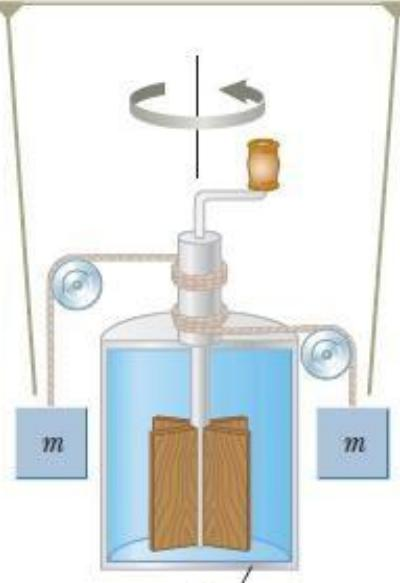

Nhiệt động lực học và cơ học đã được xem là hai ngành riêng biệt của vật lý. Cho đến khoảng năm 1850, các thí nghiệm của James Joule và những người khác đã cho thấy sự liên kết giữa chúng. Mối liên kết đã được tìm thấy giữa việc trao đổi năng lượng bởi nhiệt trong các quá trình nhiệt và sự trao đổi năng lượng bởi công   
trong các quá trình cơ học.

Khái niệm về năng lượng đã được khái quát hóa để bao gồm cả nội năng.

Các nguyên lý bảo toàn năng lượng nổi lên như là một quy luật phổ quát của tự nhiên.

# Nhiệt lượng và nội năng

Trong phần này sẽ thảo luận về nội năng, nguyên lý thứ nhất của nhiệt động lực học, và các ứng dụng của nguyên lý này.

Nguyên lý thứ nhất của nhiệt động lực học mô tả các hệ mà trong đó sự thay đổi năng lượng duy nhất là nội năng. Sự trao đổi năng lượng thực hiện bởi nhiệt và công.

Ta sẽ xem xét công thực hiện bởi các hệ có thể biến dạng.

# Nội năng Eint

Nội năng là tổng năng lượng của một hệ có được từ các thành phần vi mô của nó.

The falling blocks rotate the paddles, causing the temperature of the water to increase.

• Các thành phần vi mô này là các nguyên tử và phân tử. • Hệ được quan sát từ một hệ quy chiếu đứng yên đối gắn với khối tâm của hệ.

# Nhiệt lượng Q

Nhiệt lượng được định nghĩa là năng lượng chuyển đổi qua ranh giới của một hệ do sự khác biệt nhiệt độ giữa hệ và môi trường xung quanh, được viết tắt là nhiệt.

# Đơn vị năng lượng

Trong lịch sử, calo (cal) là đơn vị được sử dụng cho năng lượng.

Một calo là lượng năng lượng trao đổi cần thiết để làm tăng nhiệt độ của 1g nước từ $1 4 . 5 ^ { \mathrm { o } } \mathrm { C }$ đến

  
Hình 20.1: Thí nghiệm của Joule để xác định mối tương đương giữa cơ và nhiệt.

$1 5 . 5 \mathrm { { ^ \circ C } }$ .

1 kilocalo $= 1 0 0 0$ calo.

Theo hệ thống đo lường của Mỹ, đơn vị là một BTU (British Thermal Unit).

Một BTU là lượng năng lượng trao đổi cần thiết để làm tăng nhiệt độ 1 lb của nước từ $6 3 \mathrm { { ^ \circ F } }$ đến $6 4 \mathrm { { ^ \circ F } }$ .

Ngoài ra, đơn vị của năng lượng theo hệ SI là Joules (J)

$$
\textit { I c a l } = 4 , 1 8 6 J
$$

# Nhiệt dung riêng và phép đo nhiệt lượng

# Nhiệt dung C

Nhiệt dung, $C _ { : }$ , của một vật cụ thể được định nghĩa là lượng năng lượng cần thiết để làm tăng nhiệt độ của vật thêm $1 ^ { \circ } \mathrm { C }$ .

Nếu năng lượng Q tạo ra sự thay đổi nhiệt độ là $\Delta \mathrm { T }$ , thì

$$
\mathrm { Q } \equiv \mathrm { C } \ \Delta \mathrm { T }
$$

# Nhiệt dung riêng c

Nhiệt dung riêng, c, là nhiệt dung của mỗi khối lượng đơn vị.

Nếu trao đổi một lượng năng lượng Q để làm một vật có khối lượng m và thay đổi nhiệt độ ∆T, thì nhiệt dung riêng là:

$$
c \equiv \frac { Q } { m \Delta T }
$$

Nhiệt dung riêng của chất càng lớn, năng lượng phải thêm vào một khối lượng đã cho để tạo nên một sự thay đổi nhiệt độ cụ thể càng lớn.

Phương trình thường được viết theo thuật ngữ Q:

$$
Q = m c \Delta T
$$

# Sự thay đổi của nhiệt dung riêng theo nhiệt độ

Về mặt kỹ thuật, nhiệt dung riêng thay đổi theo nhiệt độ. Phương trình vi phân là

$$
\mathrm { T } _ { F }
$$

$$
\begin{array} { r } { 0 = \mathrm { m } \int \mathrm { c d T } } \end{array}
$$

Tuy nhiên, nếu các khoảng biến đổi nhiệt độ không quá lớn, sự thay đổi này có thể bỏ

qua và c có thể được coi như một hằng số.

# Nhiệt dung riêng của nước

Nước có nhiệt dung riêng cao nhất so với vật liệu thông thường.

# Phép đo nhiệt lượng

Muốn đo nhiệt dung riêng của một vật, ta nung nóng vật đó đến nhiệt độ $\mathrm { T _ { x } }$ , sau đó nhúng nó vào nước (khối lượng đã biết) có nhiệt độ $T _ { w } < T _ { x }$ , rồi ghi lại nhiệt độ của nước sau khi chúng cân bằng nhau. Phép đo này được gọi là phép đo nhiệt lượng. Thiết bị đo gọi là nhiệt lượng $\mathrm { k } \acute { \mathrm { e } }$ .

Hình $2 0 . 2 \ \mathrm { m } \hat { \mathrm { { o } } }$ tả vật nóng trong nước lạnh và nhiệt lượng truyền từ nhiệt độ cao đến nhiệt độ thấp. Nếu hệ vật và nước bị cô lập, sự bảo toàn năng lượng đòi hỏi nhiệt lượng thoát ra khỏi vật $\mathrm { Q } _ { \mathrm { h o t } }$ bằng với nhiệt lượng đi vào nước $\mathrm { Q _ { c o l d } }$ . Biểu thức bảo toàn năng lượng:

$$
\mathrm { Q } _ { c o l d } = - \mathrm { Q } _ { h o t }
$$

Xét một mẫu vật ta đang muốn xác định nhiệt độ. Giả sử $\mathbf { m } _ { \mathbf { X } }$ là khối lượng của nó, $\mathbf { c _ { X } }$ là nhiệt dung riêng và $\mathrm { T _ { x } }$ là nhiệt độ ban đầu. Tương tự, ta có các đại lượng mw, $\mathtt { c } _ { \mathrm { w } }$ và $\mathrm { T _ { w } }$ đại diện cho các giá trị tương ứng cho nước. Gọi $\mathrm { T _ { f } }$ là nhiệt độ cuối cùng sau khi hệ $\mathsf { \bar { g o m } }$ nước và mẫu vật) đạt trạng thái cân bằng. Phương trình (20.4) cho thấy rằng nhiệt lượng truyền cho nước là $Q _ { w } = m _ { w } c _ { w } ( T _ { f } - T _ { w } ) { > } 0$ vì $T _ { f } >$ $T _ { w }$

Hình 20.2: Trong thí nghiệm, một vật nóng có nhiệt dung riêng chưa biết được đặt trong nước lạnh trong thùng chứa cô lập với môi trường.

Nhiệt lượng truyền cho mẫu vật là $Q _ { x } = m _ { x } c _ { x } ( T _ { f } - T _ { x } ) < 0$

Từ phương trình (20.5), ta có phương trình

$$
\mathrm { m } _ { \mathrm { w } } \mathrm { c } _ { \mathrm { w } } ( \mathrm { T } _ { \mathrm { f } } - \mathrm { T } _ { \mathrm { w } } ) = - \mathrm { m } _ { \mathrm { x } } \mathrm { c } _ { \mathrm { x } } ( \mathrm { T } _ { \mathrm { f } } - \mathrm { T } _ { \mathrm { x } } ) = \mathrm { m } _ { \mathrm { x } } \mathrm { c } _ { \mathrm { x } } ( \mathrm { T } _ { \mathrm { x } } - \mathrm { T } _ { \mathrm { f } } )
$$

• Phương trình này giúp xác định nhiệt dung riêng chưa biết.

• Về mặt kỹ thuật, cần xác định khối lượng của bình chứa, nhưng nếu $m _ { \mathrm { w } } > > m _ { \mathrm { b i n h } }$ chứa , nó có thể được bỏ qua.

Bảng 20.1: Một số giá trị nhiệt dung riêng

TABLE 20.1 Specific Heats of Some Substances at $2 5 \mathrm { { ^ \circ C } }$ and Atmospheric Pressure   

Câu hỏi 20.1: Hãy tưởng tượng bạn có 1 kg sắt, thủy tinh và nước, và tất cả đều ở nhiệt độ $1 0 ^ { \circ } \mathrm { C }$ . (a) Sau khi thêm năng lượng 100J vào mỗi vật, sắp xếp các vật theo thứ tự nhiệt độ từ cao đến thấp. (b) sắp xếp các vật theo thứ tự nhiệt lượng nhận được từ nhiều đến ít nếu nhiệt độ các vật được tăng thêm $2 0 \mathrm { { } ^ { \circ } C }$ . (cd:

# Nhiệt chuyển pha

Trong một số trường hợp, mặc dù có sự trao đổi năng lượng giữa khối chất và môi trường nhưng nhiệt độ khối chất không thay đổi. Đó là khi xảy ra sự chuyển pha. Pha là một tập hợp các phần đồng tính, có tính chất như nhau của một hệ thống. Chẳng hạn nước có thể tồn tại ở pha rắn, lỏng hoặc khí. Những hình thức kết tinh khác nhau của một chất cũng là những pha khác nhau của chất đó. Sự chuyển từ pha này sang pha khác của một hệ gọi là sự chuyển pha. Nước khi hạ nhiệt độ đến $0 ^ { 0 } \mathrm { C }$ thì chuyển từ pha lỏng sang pha rắn là một ví dụ cho sự chuyển pha.

Các chất khác nhau phản ứng khác nhau đối với năng lượng truyền vào hoặc lấy đi trong quá trình chuyển pha do chúng có các sắp xếp phân tử bên trong khác nhau. Lượng năng lượng này cũng phụ thuộc vào khối lượng của chất. Khi nói đến hai pha của một chất, chúng ta sử dụng thuật ngữ chất ở pha cao hơn để chỉ chất ở nhiệt độ cao hơn. Ví dụ khi nói về hai pha của nước là nước lỏng và và nước đá thì nước lỏng là chất ở pha cao hơn.

Xét một hệ gồm hai pha của một chất đang ở trạng thái cân bằng. Gọi khối lượng ban đầu của chất ở pha cao hơn là mi. Sau khi nhận nhận nặng lượng Q khối lượng sau cùng của chất ở pha cao hơn là mf. Nhiệt chuyển pha L được định nghĩa là:

$$
L \equiv \frac { Q } { \Delta m }
$$

trong đó $\Delta m = m _ { f } - m _ { i }$ là độ biến thiên khối lượng của chất $\dot { \mathbf { O } }$ pha cao hơn. Giá trị của L phụ thuộc vào loại chuyển pha và các tính chất của chất chuyển pha.

Trong một quá trình chuyể pha, không có sự thay đổi về nhiệt độ của các chất. Nhiệt chuyển pha khi có sự chuyển pha từ rắn sang lỏng gọi là nhiệt nóng chảy. Nhiệt chuyển pha khi có sự chuyển pha từ lỏng sang khí gọi là nhiệt hóa hơi.

Nếu toàn bộ lượng vật chất ở pha thấp trải qua một sự chuyển pha, thì sự thay đổi khối lượng của vật chất ở pha cao bằng khối lượng ban đầu của vật liệu ở pha thấp. Ta cũng có thể viết lại phương trình

$$
\mathrm { Q } = \mathrm { L } \Delta \mathrm { m }
$$

Nếu năng lượng đi vào hệ:

• Sẽ dẫn đến sự nóng chảy hoặc hóa hơi • Lượng vật chất $\dot { \mathbf { O } }$ pha cao sẽ tăng • Δm và $\boldsymbol { \mathcal { Q } }$ mang dấu dương

Nếu năng lượng được rút ra khỏi hệ:

• Sẽ dẫn đến kết tinh hoặc hóa lỏng (ngưng tụ) • Lượng vật chất $\dot { \mathbf { O } }$ pha cao sẽ giảm • Δm và $\boldsymbol { \mathcal { Q } }$ mang dấu âm

Bảng 20.2: Một số giá trị của của hệ số nhiệt chuyển pha

# TABLE 20.2

Latent Heats of Fusion and Vaporization   

# Bài tập mẫu 20.2:

Tính tổng năng lượng cần cung cấp để chuyển toàn bộ 1 g nước đá $\mathrm { { \dot { \Phi } } } - 3 0 ^ { 0 } \mathrm { { C } }$ thành hơi nước ở $1 2 0 \mathrm { { } ^ { 0 } C }$ .

# Giải:

Hình $2 0 . 3 ~ \mathrm { m } \hat { \mathrm { \omega } }$ tả quá trình chuyển hóa của nước từ dạng đặc sang dạng hơi.

  
Hình 20.3: Đồ thị từ nước đá sang hơi nước

Đồ thị có các phần sau

Phần A: Nước đá tăng nhiệt độ

Bắt đầu từ 1 gram nước đá $\dot { \sigma } - 3 0 \ { } ^ { \mathrm { o } } \mathrm { C }$ , trong giai đoạn A, nhiệt độ của nước đá thay đổi từ $- 3 0 \mathrm { { } ^ { \circ } C }$ đến $0 \mathrm { { ^ \circ C } }$ , dựa vào bảng 20.1, ta có phương trình ${ \mathrm { Q } } = { \mathrm { m } } _ { \mathrm { i } } { \mathrm { c } } _ { \mathrm { i } } \Delta { \mathrm { T } } =$ $( 1 \times 1 0 ^ { - 3 } ) ( 2 0 9 0 ) ( 3 0 ) = 6 2 , 7 ]$

Trong trường hợp này, hệ thu năng lượng là 62,7 J.

Phần B: băng tan

Năng lượng chuyển hóa 1g nước đá sang dạng nước (chất lỏng), dựa vào bảng 20.2, sử dụng phương trình $\mathrm { Q } = L _ { f } \Delta m _ { w } = L _ { f } m _ { i } = ( 1 \times 1 0 ^ { - 3 } ) ( 3 , 3 3 \times 1 0 ^ { 5 } ) = 3 3 3 \mid$

Năng lượng thu vào: 333 J

Phần C: nước tăng nhiệt độ

Giữa $0 \ \mathrm { { ^ \circ C } }$ và $1 0 0 ~ ^ { \mathrm { { o } C } }$ , vật liệu là chất lỏng và không có sự thay đổi trạng thái. Nước vẫn giữ nguyên pha. $\mathrm { H } \hat { \mathrm { e } }$ thu năng lượng làm tăng nhiệt độ.

Ta có $\mathrm { Q } = \mathrm { m } _ { w } \mathrm { c } _ { \mathrm { w } } \Delta \mathrm { T } = ( 1 \times 1 0 ^ { - 3 } ) ( 4 , 1 9 \times 1 0 ^ { 3 } ) ( 1 0 0 ) = 4 1 9 \ \mathrm { J }$ Năng lượng thu vào: 419 J Phần $D$ : nước sôi Tại $1 0 0 ^ { \circ } \mathrm { C }$ , sự thay đổi trạng thái xảy ra (sôi). Nhiệt độ không thay đổi.

Sử dụng $\mathrm { Q } = L _ { v } \Delta m _ { s } = ( 1 \times 1 0 ^ { - 3 } ) ( 2 , 2 6 \times 1 0 ^ { 6 } ) = 2 2 6 0 \mathrm { J }$ Năng lượng cần: 2260 J

Phần $E$ : bay hơi

Sau khi toàn bộ nước được chuyển thành hơi nước, hơi nước sẽ nóng lên. Không xảy ra thay đổi trạng thái. Hệ thu năng lượng để tăng nhiệt độ.

Khi nhiệt độ tăng từ $1 0 0 \mathrm { { ‰} }$ đến $1 2 0 \mathrm { { ‰} }$ , năng lượng cần: 40,2 J

Vậy tổng năng lượng 1gram nước đá thay đổi từ $- 3 0 \mathrm { { } ^ { \circ } C }$ đến $1 2 0 \mathrm { { } ^ { 0 } C }$ cần năng lượng tổng là 3110 J.

# Sự chậm đông

Nếu nước ở dạng lỏng được giữ đứng yên trong một bình rất sạch thì có thể giảm nhiệt độ của nước xuống dưới $0 \mathrm { { ^ \circ C } }$ mà không làm nó đóng băng. Hiện tượng này gọi là sự chậm đông.

Sự đóng băng chỉ xảy ra khi nước cần một sự nhiễu loạn theo cách nào đó để các phân tử tách nhau ra và tạo thành một cấu trúc băng rộng và mở để làm cho mật độ băng thấp hơn mật độ của nước. Nếu nước chậm động bị nhiễu loạn, nó sẽ đóng băng ngay lập tức. Hệ rơi về cấu hình năng lượng thấp của các phân tử liên kết của cấu trúc băng và năng lượng tỏa ra nâng nhiệt độ trở về $0 \ { } ^ { \mathrm { { o } } } \mathrm { { C } }$ .

# Sự quá nhiệt

Nước sạch có thể tăng nhiệt độ đến trên $1 0 0 ^ { \circ } \mathrm { C }$ mà không sôi. Hiện tượng này được gọi là sự quá nhiệt.

Sự hình thành bong bóng hơi trong nước đòi hỏi tâm hóa hơi. Tâm hóa hơi này có thể là một vết xước trên bình chứa hoặc một tạp chất trong nước. Khi bị nhiễu loạn, nước quá nhiệt có thể phát nổ. Bong bóng nước hình thành ngay lập tức, nước nóng được đẩy lên trên và trào ra ngoài bình chứa.

Câu hỏi 20.2: Giả sử có một quá trình tương tự nhằm thêm năng lượng vào cục đá như trên, nhưng thay vào đó, ta sẽ vẽ đồ thị nội năng của hệ như là một hàm của năng lượng vào. Đồ thị đó sẽ như thế nào?

Công và nhiệt trong các quá trình nhiệt động

Các biến trạng thái

Các biến trạng thái $\mathrm { m } \hat { \mathrm { o } }$ tả trạng thái của một hệ. Bao gồm: Áp suất, nhiệt độ, thể tích, nội năng.

Trạng thái của một hệ cô lập chỉ được xác định khi hệ đang $\dot { \mathbf { O } }$ trạng thái cân bằng nhiệt. Đối với chất khí trong bình chứa, mọi thành phần của chất khí phải $\dot { \mathbf { O } }$ cùng nhiệt độ và áp suất.

# Sự trao đổi năng lượng

Nhiệt lượng, $\boldsymbol { \mathcal { Q } }$ , thu vào hoặc mất đi của một hệ phụ thuộc vào quá trình biến đổi. Nguồn nhiệt là một nguồn năng lượng được xem là đủ lớn để một sự trao đổi năng lượng có giới hạn không làm thay đổi nhiệt độ của nó.

Piston được giữ cố định ở vị trí ban đầu nhờ một tác nhân bên ngoài. Bỏ qua ngoại lực tác dụng lên hệ. Piston di chuyển lên và khí sinh ra một công trên piston. Suốt quá trình giãn nở, chỉ cần năng lượng vừa đủ để chuyển hóa năng lượng nhiệt từ bình chứa sang chất khí để duy trì nhiệt độ không đổi.

# Sự chuyển hóa năng lượng, hệ cô lập

Xét chất khí trong một xy lanh có một màng như hình vẽ. Ban đầu, khí bị nhốt ở bên dưới màng ngăn $\mathrm { H } \hat { \mathrm { e } }$ hoàn toàn cách nhiệt. Khi màng bị vỡ, chất khí nhanh chóng giãn nở lấp đầy khoảng trống cho đến khi đạt được thể tích cuối cùng. Lúc này, chất khí không sinh công vì nó không tác dụng lực. Không có năng lượng được trao đổi dưới dạng nhiệt thông qua lớp vỏ cách nhiệt

  
Hình 20.7: Sự trao đổi năng lượng của khí trong xylanh

Tóm lại:

• Năng lượng chuyển hóa bởi nhiệt, sinh công, phụ thuộc vào trạng thái đầu, cuối và trung gian của hệ.   
• Cả công và nhiệt đều phụ thuộc quá trình biến đổi.   
• Không thể xác định giá trị của công và nhiệt nếu chỉ dựa vào trạng thái đầu và cuối của một quá trình nhiệt động lực học.

# Nguyên lý thứ nhất của nhiệt động lực học

Nguyên lý thứ nhất của nhiệt động lực học là trường hợp đặc biệt của định luật bảo toàn năng lượng. Đó là trường hợp đặc biệt khi chỉ có sự biến đổi nội năng và chỉ có sự trao đổi năng lượng bởi nhiệt và công.

Nguyên lý thứ nhất của nhiệt động lực học

$$
\Delta E _ { i n t } = Q + W
$$

Tất cả các đại lượng phải có cùng đơn vị của năng lượng.

Một hệ quả của nguyên lý này là sự tồn tại đại lượng được biết đến như là nội năng – được xác định bởi trạng thái của hệ. Nội năng là một biến trạng thái.

Hình 20.8: Nguyên lý 1 nhiệt động lực học

Hệ cô lập là hệ không tương tác với môi trường xung quanh. Không có sự trao đổi năng lượng bằng nhiệt. Công thực hiện trên hệ bằng 0.

$$
\mathcal { Q } = W = 0 , \mathtt { n e n } \Delta E \mathrm { i n t } = 0
$$

Nội năng của hệ cô lập không đổi.

# Các chu trình

Chu trình là một tiến trình bắt đầu và kết thúc ở cùng một trạng thái.

Trên giản đồ PV, chu trình được biểu diễn như một đường cong khép kín.

Độ biến thiên nội năng bằng 0 vì nó là một biến trạng thái

Nếu $\Delta E _ { \mathrm { i n t } } = 0$ , $Q = - W$

Trong một chu trình, công thực hiện trên hệ trong mỗi chu trình có độ lớn bằng diện tích của vùng giới hạn bởi đường cong biểu diễn chu trình trên giản đồ PV.

# Một vài ứng dụng của nguyên lý thứ nhất nhiệt động lực học

### Quá trình đoạn nhiệt

Quá trình đoạn nhiệt là quá trình trong đó không có năng lượng vào hoặc ra khỏi hệ dưới dạng nhiệt.

$$
Q = 0
$$

Điều này có được do: Các thành cách nhiệt của bình, Các quá trình được thực hiện nhanh nên không có sự trao đổi nhiệt.

$$
\mathrm { V i } Q = 0 , \Delta E _ { \mathrm { i n t } } = W
$$

Nếu khí bị nén đoạn nhiệt, W mang dấu dương, $\Delta E _ { \mathrm { i n t } }$ mang dấu dương và nhiệt độ tăng.

Nếu khí giãn nở đoạn nhiệt, nhiệt độ khí giảm.

Một số ví dụ điển hình về quá trình đoạn nhiệt trong kỹ thuật:

Sự giãn nở của khí nóng trong động cơ đốt trong.   
• Khí ga hóa lỏng trong hệ thống làm mát.   
• Nén đột ngột trong động cơ diesel.

### Sự giãn nở tự do đoạn nhiệt

Đây là quá trình đoạn nhiệt vì nó diễn ra trong bình cách nhiệt. Vì chất khí giãn nở vào khoảng trống, nó không tác dụng lực lên piston và $W = 0$ .

Vì $Q = 0$ và $W { = } 0 { \Longrightarrow } \Delta E { \mathrm { i n t } } = 0$ , nghĩa là nội năng của khối khí $\dot { \mathbf { O } }$ trạng thái đầu và cuối bằng nhau.

Nếu khối khí thực hiện quá trình là khí lý tưởng thì nhiệt độ của khối khí trong quá trình này không thay đổi.

### Quá trình đẳng áp

Quá trình đẳng áp là quá trình xảy ra khi áp suất không đổi.

Có thể thực hiện bằng cách cho piston di chuyển tự do, vì vậy hệ luôn ở trạng thái cân bằng giữa lực tổng hợp từ khí đẩy lên và trọng lượng của piston cộng với lực do áp suất của không khí đẩy xuống.

Giá trị nhiệt và công nói chung đều khác 0.

Công là $W { = } { \mathcal { - P } } \left( V _ { f ^ { - } } V _ { i } \right)$ với $P$ là áp suất không đổi.

### Quá trình đẳng tích

Quá trình đẳng tích là quá trình xảy ra khi thể tích không đổi.

Thực hiện bằng cách kẹp piston $\acute { \mathbf { O } }$ vị trí cố định.

Vì thể tích không đổi, $W { = } 0$ .

Từ định luật 1, $\Delta E _ { \mathrm { i n t } } = Q$

Nếu năng lượng được truyền bởi nhiệt vào một hệ có thể tích không đổi, toàn bộ năng lượng sẽ truyền vào cho hệ và nội năng của hệ tăng lên.

### Quá trình đẳng nhiệt

Quá trình đẳng nhiệt là quá trình trong đó nhiệt độ không đổi.

Thực hiện bằng cách đặt các xylanh tiếp xúc với nguồn nhiệt có nhiệt độ không đổi.

Vì nhiệt độ không đổi, $\Delta E _ { \mathrm { i n t } } = 0$ .

Nên, $Q = - \ W$

Năng lượng bất kỳ đi vào hệ dưới dạng nhiệt phải ra khỏi hệ dưới dạng công.

  
Hình 20.9: Quá trình đẳng nhiệt

Hình 20.9 mô tả giản đồ PV của quá trình giãn nở đẳng nhiệt.

Đường cong có dạng hypebol. Đường cong gọi là đường đẳng nhiệt

Phương trình:

$$
p V = n R T = \mathrm { h } \dot { \bar { \mathrm { a n g } } } \mathrm { s } \acute { \hat { 0 } }
$$

