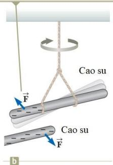

Trong chương này, ta sẽ bắt đầu nghiên cứu về thuyết điện từ trường. Mối liên kết đầu tiên mà ta có với các kiến thức cũ là khái niệm về lực. Lực điện từ giữa các hạt mang điện là một trong những lực cơ bản của tự nhiên. Ta bắt đầu bằng việc mô tả một số tính chất cơ bản của biểu hiện đầu tiên của lực điện từ là lực tĩnh điện. Sau đó ta sẽ nghiên cứu định luật Coulomb, một định luật chi phối tương tác điện giữa hai điện tích bất kỳ. Từ đây, ta sẽ giới thiệu khái niệm về điện trường, gắn liền với một phân bố điện tích và mô tả ảnh hưởng của nó lên các hạt mang điện khác. Ta sẽ dùng định luật Coulomb để tìm cường độ điện trường của một phân bố điện cho trước. Ngoài ra, ta cũng sẽ tìm hiểu chuyển động của một hạt mang điện trong điện trường đều.

Liên hệ thứ hai giữa thuyết điện từ với các nội dung trước đây là khái niệm về năng lượng. Nội dung này sẽ được trình bày trong chương 25

# Các tính chất của điện tích

Nhiều thí nghiệm đơn giản đã minh họa cho sự tồn tại của các lực điện. Ví dụ như khi dùng tay cọ xát một quả bóng cao su trong một ngày khô ráo thì ta có thể thấy rằng quả bóng có thể hút các mẩu giấy nhỏ. Lực hút thường là đủ lớn để làm các mẩu giấy treo lơ lửng bên dưới quả bóng.

Khi vật chất hành xử theo cách này, ta nói chúng bị nhiễm điện hay đã tích điện.

Trong một loạt thí nghiệm đơn giản, người ta tìm thấy rằng có hai loại điện tích mà Benjamin Franklin (1706–1790) gọi là điện tích dương và điện tích âm. Các electron được xem là mang điện tích âm và các proton mang điện tích dương. Để kiểm chứng sự tồn tại của hai loại điện tích, giả sử ta cọ xát một thanh cứng bằng cao su vào lông thú rồi treo nó lên trên một sợi dây như trong hình 23.1. Nếu đưa một thanh thủy tinh (đã được cọ xát vào lụa) lại gần thanh cao su thì chúng sẽ hút nhau (hình 23.1a). Mặt khác, nếu để hai thanh cao su (hoặc thủy tinh) đã nhiễm điện lại gần nhau thì chúng sẽ đẩy nhau (hình23.1b). Trên cơ sở các quan sát này, ta Biện luận rằng các điện tích cùng dấu thì đẩy nhau và các điện tích trái dấu thì hút nhau.

Mot thanh cao su tich dien àm treo trèn soi dày bi hút bòi mot thanh thiy tinh tich dièn durong.

Theo qui ước của Franklin thì điện tích trên thanh thủy tinh nói trên được gọi là điện tích dương và điện tích trên thanh cao su được gọi là điện tích âm. Vì vậy, vật tích điện nào bị hút vào thanh cao su tích điện (hoặc bị đẩy ra xa thanh thủy tinh tích điện) sẽ phải có điện tích dương.

  
Mot thanh cao su tich dién àm bi dày bòi mòt thanh cao su tich dièn àm khác.

  
Hình 23.1

Một khía cạnh quan trong khác về điện được rút ra từ các quan sát thực nghiệm là trong một hệ cô lập thì điện tích luôn được bảo toàn. Nghĩa là khi cọ xát vật này vào vật khác thì điện tích không được sinh ra trong quá trình này. Trạng thái nhiễm điện là do có điện tích chuyển từ vật này sang vật kia. Một vật nhận một lượng điện tích âm thì vật kia nhận một lượng điện tích dương tương ứng. Ví dụ như khi cọ xát thanh thủy tinh vào lụa thì lụa nhận một lượng điện tích âm có độ lớn bằng lượng điện tích dương mà thanh thủy tinh có được. Vận dụng hiểu biết về cấu tạo của nguyên tử thì ta có thể nói rằng trong quá trình này một số electron đã được chuyển từ thanh thủy tinh sang lụa. Tương tự như vậy, khi cọ xát cao su vào lông thú thì electron được chuyển từ lông thú sang cho cao su. Sở dĩ như vậy là do bình thường thì vật chất trung hòa về điện.

Do bào toàn dièn tích nèn mot electron sě bò sung dièn tích âm cho tám lua và mòt lrong dièn tích duong trong iíng dugc dè lai trong thanh thiy tinh

Vào năm 1909, Robert Millikan (1868–1953) khám phá ra rằng các hạt mang điện luôn luôn xuất hiện như là bội của một đện lượng e. Theo cách nói hiện đại, điện tích $q$ (ký hiệu chuẩn dùng cho điện tích) được xem là bị lượng tử hóa. Nghĩa là hạt mang điện tồn tại như là các “gói” rời rạc và ta có thể viết $q = \pm N e$ với $N$ là một số nguyên bất kỳ. Một số thí nghiệm khác vào thời gian này đã cho thấy là electron có điện tích $- e$ và proton có điện tích $+ e .$ Một số hạt khác, neutron chẳng hạn, thì không mang điện.

  
Hình 23.2

Trắc nghiệm nhanh 23.1: Ba vật được đưa lại gần nhau từng đôi một. Vật A và vật B đẩy nhau. Vật B và vật C cũng đẩy nhau. Phát biểu nào sau đây có thể đúng? (a) Các vật A và C có điện tích cùng dấu. (b) Các vật A và C có điện tích trái dấu. (c) Cả ba vật này mang điện cùng dấu. (d) Một trong ba vật trung hòa về điện. (e) Cần làm thêm một vài thí nghiệm khác để xác định dấu của các điện tích.

# Nhiễm điện do cảm ứng

Việc phân loại vật chất theo khả năng di chuyển của electron trong vật chất là một cách làm thuận tiện.

Khi đó, chất dẫn điện là các vật liệu mà electron là electron tự do, không bị liên kết với các nguyên tử và có thể di chuyển tương đối tự do trong vật liệu; chất cách điện là các vật liệu mà mọi electron bị liên kết với nguyên tử và không thể di chuyển tục do trong vật liệu. Các vật liệu như thủy tinh, cao su và gỗ khô được xếp vào nhóm chất cách điện. Khi các vật liệu này bị nhiễm điện do cọ xát thì chỉ vùng bị cọ xát bị nhiễm điện và các điện tích không dịch chuyển sang các vùng khác. Ngược lại, các vật liệu như đồng, nhôm và bạc là các vật dẫn điện tốt. Khi một vùng nhỏ của các vật liệu này bị nhiễm điện thì điện tích sẽ tự phân bố trên toàn bộ bề mặt của vật chất.

Chất bán dẫn là loại vật chất thứ ba. Tính dẫn điện của nó nằm giữa chất dẫn điện và chất cách điện. Silic (Si) và germani (Ge) là những ví dụ rõ ràng về chất bán dẫn, thường dùng để sản xuất các loại vi mạch (chíp) trong máy tính, điện thoại di động và các hệ thống giải trí tại nhà. Các tính chất điện của chất bán dẫn có thể thay đổi nhiều lần bằng cách thêm vào một lượng nguyên tử của một chất khác.

Để hiểu cách làm nhiễm điện một chất dẫn điện bằng quá trình cảm ứng, ta dùng một quả cầu kim loại rỗng đặt cách điện với mặt đất như hình 23.3. Nếu điện tích của quả cầu đúng bằng 0 thì nó có một số lượng proton và electron như nhau. Khi đưa một thanh cao su nhiễm điện lại gần quả cầu, các electron ở vùng gần thanh nhất sẽ bị đẩy sang phía đối diện của quả cầu. Sự dịch chuyển này để lại một vùng mang điện dương trên quả cầu.

  
Hình 23.3: Hiện tượng tích điện do cảm ứng.

a: Quả cầu có số điện tích dương và điện tích âm bằng nhau.

b: Một thanh cao su nhiễm điện được đặt gần quả cầu, không tiếp xúc với quả cầu. Các electron trong quả cầu trung hòa điện sẽ được phân bố lại.

c: Quả cầu được nối với mặt đất. Một số electron có thể rời quả cầu thông qua dây tiếp đất.

d: Bỏ dây tiếp đất. Bây giờ quả cầu sẽ có nhiều điện tích dương hơn. Điện tích không được phân bố đồng đều. Điện tích dương đã bị cảm ứng bởi quả cầu.

e: Bỏ thanh cao su. Các electron tự phân bố lại trên quả cầu. Vẫn có một tập hợp các điện tích dương trên quả cầu. Điện tích bây giờ được phân bố đồng đều trên quả cầu. Chú ý rằng thanh không mất điện tích âm trong quá trình này.

Để làm nhiễm điện một vật dẫn điện bằng cảm ứng không cần phải có sự tiếp xúc với vật cảm ứng. Điều này khác với cách làm nhiễm điện do cọ xát là cách mà cần phải có sự tiếp xúc giữa hai vật.

Một quá trình tương tự với sự cảm ứng có thể xảy ra trong vật cách điện. Trong hầu hết các phân tử trung hòa thì tâm điện âm trùng với tâm điện dương. Khi đến gần một vật mang điện, các tâm này rời xa nhau một khoảng nhỏ và làm xuất hiện điện tích âm ở một phía và điện tích dương ở phía kia. Sự sắp xếp diễn ra bên trong các phân tử này tạo ra một lớp điện tích trên bề mặt của chất cách điện như trong hình 23.4a. Từ đó làm xuất hiện lực hút giữa vật tích điện và vật cách điện. Nhờ đó ta giải thích được tại sao một thanh nhiễm điện lại có thể hút các mẩu giấy trung hòa về điện như trong hình 23.4b.

  
Hình 23.4

Trắc nghiệm nhanh 23.2: Ba vật được đưa lại gần nhau, từng đôi một. Khi vật A và vật B ở gần nhau thì chúng hút nhau. Khi vật B và vật C ở gần nhau thì chúng đẩy nhau. Phát biểu nào sau đây là chắc chắn đúng? a) Vật A và C có điện tích cùng dấu. b) Vật A và C có điện tích trái dấu. c) Cả ba vật đều tích điện cùng dấu. d) Một trong ba vật trung hoà về điện. e) Cần làm thêm một vài thí nghiệm để xác định thông tin về điện tích của các vật.

# Định luật Coulomb

Charles Coulomb đã đo độ lớn của các lực điện giữa các vật tích điện bằng cân xoắn do ông chế tạo. Nguyên tắc hoạt động của cân xoắn cũng giống như thiết bị do Cavendish dùng để đo khối lượng riêng của Trái đất, trong đó, quả cầu trung hòa về điện được thay bằng một quả cầu tích điện. Lực điện giữa các quả cầu tích điện A và B trong hình 23.5 làm cho chúng hút vào nhau hoặc tách xa nhau ra. Do đó, dây treo bị xoắn lại. Vì lực xoắn của dây tỉ lệ với góc mà thanh treo quay được nên số đo góc này sẽ cho biết độ lớn của lực hút hoặc đẩy giữa các quả cầu. Lực điện có độ lớn lớn hơn nhiều so với lực hấp dẫn giữa chúng, do đó có thể bỏ qua lực hấp dẫn.

  
Hình 23.5: Cân xoắn

Charles Coulomb (1736 – 1806)

Nhà vật lý người Pháp.

Charles Coulomb đã đo cường độ lực điện giữa 2 quả cầu nhỏ tích điện. Lực này tỉ lệ nghịch với bình phương khoảng cách $r$ giữa các điện tích và hướng dọc theo đường nối giữa chúng, tỉ lệ thuận với tích của các điện tích q1 và q2. Các điện tích trái dấu thì hút nhau (lực hút). Các điện tích cùng dấu thì đẩy nhau (lực đẩy).

Ông có những đóng góp lớn liên quan đến lĩnh vực tĩnh điện và từ tính.

Các lĩnh vực nghiên cứu khác •Sức bền vật liệu •Cơ học kết cấu

Trong SI, đơn vị của điện tích coulomb (C).

Trong tự nhiên giá trị điện tích nhỏ nhất là •Công thái học (Ergonomics)

$e = 1 { , } 6 0 2 1 8 \ \times \ 1 0 ^ { - 1 9 } \mathrm { C }$ . Một điện tích có độ lớn là 1 C tương ứng với 6,2460218 $\times 1 0 ^ { 1 8 }$ electron hoặc proton. Các điện tích thường gặp có giá trị khoảng vài $\mu \mathrm { C }$ .

Electron và proton giống nhau về độ lớn điện tích nhưng khác nhau về khối lượng. Proton và neutron giống nhau về khối lượng nhưng khác nhau về điện tích.

Khi sử dụng định luật Coulomb, cần nhớ rằng lực là một đại lượng vec-tơ và phải xem xét nó một cách phù hợp. Nếu biểu diễn định luật Coulomb dưới dạng vec-tơ, ta sẽ có:

$$
\vec { \mathbf { F } } _ { 1 2 } = k _ { e } \frac { q _ { 1 } q _ { 2 } } { r ^ { 2 } } \hat { \mathbf { r } } _ { 1 2 }
$$

  
Hình 23.6: Lực điện tác dụng giữa các hạt mang điện

Trong đó: $\hat { \textbf { \textit { r } } _ { 1 2 } }$ là vec-tơ đơn vị, hướng từ điện tích $q _ { 1 }$ đến điện tích $q _ { 2 }$ như trong hình $2 3 . 6 _ { \cdot _ { \circ } , \vec { E } _ { 1 2 } }$ là lực điện mà điện tích $q _ { 1 }$ tác dụng lên điện tích $q _ { 2 }$ , bằng độ lớn của lực F21 (do $q _ { 2 }$ tác dụng lên điện tích $q _ { 1 }$ ).

Lưu ý về hướng của lực: Dấu của tích $q _ { 1 } q _ { 2 }$ sẽ cho biết hướng của lực điện tác dụng giữa $q _ { 1 }$ và $q _ { 2 }$ . Trong hình 23.6a, hai điện tích là dùng dấu nên lực là lực đẩy, hướng ra phía ngoài hai điện tích. Trong hình 23.6b, hai điện tích trái dấu nên lực là lực đẩy, hướng vào phía trong 2 điện tích.

Nếu có nhiều hơn 2 điện tích thì lực tác dụng giữa mỗi cặp điện tích được tính bởi (23.2). Lực tổng hợp tác dụng lên một điện tích bất kỳ sẽ bằng tổng vec-tơ của các lực tác dụng lên điện tích đó từ các điện tích còn lại. Ví dụ, nếu có 4 điện tích thì lực tổng hợp tác dụng lên điện tích thứ nhất sẽ là:

$$
\vec { \mathbf { F } } _ { 1 } = \vec { \mathbf { F } } _ { 2 1 } + \vec { \mathbf { F } } _ { 3 1 } + \vec { \mathbf { F } } _ { 4 1 }
$$

# Trắc nghiệm nhanh 23.3:

Vật A có điện tích $1 2 \mu \mathrm { C }$ và vật B có điện tích $1 6 \mu \mathrm { C }$ . Phát biểu nào dưới đây về lực điện tác dụng lên các điện tích này là đúng?

$$
\vec { \mathbf { F } } _ { \mathrm { A B } } = - 3 \vec { \mathbf { F } } _ { \mathrm { B A } } \quad \mathrm { ~  ~ \lambda ~ } _ { \mathrm { b } } ) \ \vec { \mathbf { F } } _ { \mathrm { A B } } = - \vec { \mathbf { F } } _ { \mathrm { B A } } \quad \quad \mathrm { ~  ~ \gamma ~ } \mathrm { ~  ~ c ~ } \mathrm { ~  ~ \mathrm { ~ \bf ~ 3 ~ } ~ } \vec { \mathbf { F } } _ { \mathrm { A B } } = - \vec { \mathbf { F } } _ { \mathrm { B A } } \mathrm { ~  ~ \lambda ~ } _ { \mathrm { d } } ) \ \vec { \mathbf { F } } _ { \mathrm { A B } } = 3 \vec { \mathbf { F } } _ { \mathrm { B A } }
$$

e) F = F f) 3F = F

# Bài toán mẫu 23.2:

Xét 3 điện tích điểm nằm ở 3 góc của một tam giác vuông như trong hình 23.7. Biết $q _ { 1 }$ $= q _ { 3 } = 5 { , } 0 0 \ \mu \mathrm { C } .$ $q _ { 2 } = - 2 , 0 0 ~ \mu \mathrm { C }$ và $a = 0 , 1 0 0 \mathrm { m }$ . Tìm lực tổng hợp tác dụng lên điện tích $q _ { 3 }$ .

Khái niệm hóa: Xét điện tích $q _ { 3 }$ . Vì nó nằm gần 2 điện tích còn lại nên sẽ chịu tác dụng của hai lực điện. Các lực này tác dụng theo hai hướng khác nhau (hình 23.7). Dựa vào các lực này, ta ước lượng được vec-tơ lực tổng hợp.

  
Hình 23.7

Phân loại: Bài toán này thuộc dạng tính tổng vec-tơ.

$$
F _ { 2 3 x } = - F _ { 2 3 } \mathrm { c o s } ( 1 8 0 ^ { \circ } ) = - 8 , 9 9 \mathrm { N } .
$$

Từ đó tính được các thành phần của lực $\vec { \bf F } _ { 3 }$ :

$$
\begin{array} { r l } & { F _ { 3 x } = F _ { 1 3 x } + F _ { 2 3 x } = 7 , 9 4 + ( - 8 , 9 9 ) = - 1 , 0 5 \mathrm { N } } \\ & { F _ { 3 y } = F _ { 1 3 y } + F _ { 2 3 y } = 7 , 9 4 + 0 = 7 , 9 4 \mathrm { N } . } \end{array}
$$

Tức là: $\vec { \mathbf { F } _ { 3 } } = ( - 1 , 0 4 \mathbf { \hat { i } } + 7 , 9 4 \mathbf { \hat { j } } ) \mathbf { N }$

Biện luận: Lực tổng hợp tác dụng lên điện tích $q _ { 3 }$ hướng chéo lên phía trên, sang trái.

Biện luận: Về mặt toán học, phương trình nói trên có thể có một nghiệm khác là x = −3,44 m nhưng không phù hợp với bài toán. $\dot { \mathrm { ~ O ~ } }$ tọa độ này, hai lực tác dụng lên q3 cùng chiều nên không thể triệt tiêu lẫn nhau.

# Hạt trong điện trường

Trong trường hợp các lực điện, Faraday đã phát triển khái niệm về trường. Theo hướng tiếp cận này, một điện trường được cho là tồn tại trong vùng không gian xung quanh các vật tích điện, điện tích nguồn. Có thể phát hiện ra sự tồn tại của điện trường bằng cách đặt một điện tích thử vào trong trường đó và xem xét lực điện tác dụng lên nó. Ví dụ, trong hình 23.10 là một điện tích thử dương

  
Hình 23.10: Điện tích thử đặt gần điện tích nguồn.

Nếu đặt một điện tích $q$ bất kỳ vào điện trường thì nó sẽ chịu một lực điện cho bởi:

$$
\vec { \bf F } = q \vec { \bf E } \left( 2 3 . 4 \right)
$$

Nếu $q$ dương, lực điện và điện trường cùng chiều nhau. Nếu $q$ âm, lực điện và điện trường ngược chiều nhau.

Công thức (23.4) có sự tương tự với công thức của vật trong trường trọng lực ${ \vec { \mathbf { F } } } = m { \vec { \mathbf { g } } } $ . Công thức này được dùng để tìm lực điện tác dụng lên một điện tích bất kỳ tại một vị trí mà ở đó đã biết điện trường.

Áp dụng định luật Coulomb ta tìm được lực điện tác dụng bởi điện tích điểm $q$ lên điện tích thử $q _ { 0 }$ đặt gần nó:

$$
{ \vec { \mathbf { F } } } = k _ { e } { \frac { q q _ { 0 } } { r ^ { 2 } } } { \hat { \mathbf { r } } }
$$

Từ đó, điện trường tại điểm đặt điện tích thử q0 sẽ là:

$$
\vec { \bf E } = k _ { e } \frac { q } { r ^ { 2 } } \hat { \bf r }
$$

Nếu điện tích $q$ dương, lực hướng ra xa $q$ . Điện trường hướng ra xa điện tích nguồn dương. Nếu $q$ âm, lực hướng lại gần $q$ . Điện trường hướng lại gần điện tích nguồn âm.

  
Hình 23.11: Lực điện và điện trường do các điện tích khác nhau tạo ra

Để tính điện trường tại $\mathrm { m } \hat { \mathrm { 0 t } }$ điểm $P$ do một số hữu hạn điện tích điểm gây ra thì ta lần lượt áp dụng công thức (23.5) cho mỗi điện tích điểm $q _ { \mathrm { i } }$ rồi lấy tổng vec-tơ các điện trường thành phần này:

$$
\vec { \mathbf { E } } = k _ { e } \sum _ { i } \frac { q _ { i } } { r _ { i } ^ { 2 } } \hat { \mathbf { r } } _ { i }
$$

# Trắc nghiệm nhanh 23.4:

Một điện tích $+ 3 ~ \mu \mathrm { C }$ được đặt tại $\mathrm { d i e m } \ : P$ thì nó chịu tác dụng bởi một lực điện từ bên ngoài, hướng sang phải và có độ lớn $4 \times 1 0 ^ { 6 } \mathrm { N } / \mathrm { C }$ . Nếu thay điện tích này bằng một điện tích $- 3 ~ \mu \mathrm { C }$ thì lực điện tác dụng lên điện tích này sẽ thế nào? (a) Không bị ảnh hưởng gì; (b) Đổi hướng; (c) Lực bị thay $\mathbf { \bar { d } } \hat { \mathbf { o } } \mathbf { i }$ theo một cách không thể xác định được.

Bài toán mẫu 23.5: Một giọt nước nhỏ có khối lượng $3 , 0 0 \times 1 0 ^ { - 1 2 } \mathrm { k g }$ nằm gần mặt đất, trong không khí vào một ngày mưa bão. Một điện trường trong khí quyển có hướng thẳng đứng từ trên xuống và có độ lớn là $6 { , } 0 0 \times 1 0 ^ { 3 } \mathrm { N / C }$ trong vùng có giọt nước. Giọt nước nằm lơ lửng trong không khí. Hỏi điện tích của giọt nước là bao nhiêu?

Khái niệm hóa: Hình ảnh một giọt nước nằm lơ lửng trong không khí là không bình thường. Vậy phải có cái gì đó kéo giọt nước lên để nó không rơi xuống.

Phân loại: Bài toán này thuộc dạng bài toán cân bằng của hạt trong điện trường và trong trường hấp dẫn.

Phân tích: Từ điều kiện cân bằng của giọt nước ta có lực điện tác dụng vào giọt nước cùng phương, ngược chiều với trọng lực tác dụng lên nó: $F _ { e } = m g$ . Từ đó, ta tìm được độ lớn của điện tích là: q = mg . Do điện trường hướng thẳng đứng

$E$ xuống dưới và lực điện hướng lên trên nên điện tích của giọt nước là âm.

# Đáp số: q = −4,90  10−15 C

Bài toán mẫu 23.6: Điện trường do hai hạt mang điện tạo ra Hai điện tích $q _ { 1 }$ và $q _ { 2 }$ được đặt trên trục $x$ và lần lượt cách trục một khoảng là $a$ và $b$ . (A) Tìm các thành phần của điện trường tổng hợp tại điểm $P$ nằm tại vị trí $( 0 , y )$ .

(B) Xét trường hợp đặc biệt khi các điện tích này cùng độ lớn và $a = b$ .

(C) Xét trường hợp $P$ nằm rất xa $\mathrm { g } \acute { \mathrm { o c } }$ tọa độ, tức là $\mathbf { y } > > \mathbf { a }$

Giải:

  
Hình 23.12

Khái niệm hóa: Trong bài toán này, điện trường tổng hợp do hai điện tích điểm tạo ra ở $P$ là tổng vec-tơ của điện trường do mỗi điện tích tạo ra.

Phân loại: Đây là bài toán mà ta sử dụng công thức (23.6) để giải.

# Phân tích:

a) Điện trường do $q _ { 1 }$ và $q _ { 2 }$ gây ra tại $P$ được chỉ ra trong hình 23.12. Độ lớn của chúng lần lượt là:

$$
E _ { 1 } = k _ { e } \frac { \left| q _ { 1 } \right| } { r _ { 1 } ^ { 2 } } = k _ { e } \frac { \left| q _ { 1 } \right| } { e ^ { 2 } + y ^ { 2 } } ; E _ { 2 } = k _ { e } \frac { \left| q _ { 2 } \right| } { r _ { 2 } ^ { 2 } } = k _ { e } \frac { \left| q _ { 2 } \right| } { b ^ { 2 } + x ^ { 2 } }
$$

Biểu diễn các điện trường này dưới dạng vec-tơ:

$$
\begin{array} { l } { { \displaystyle { \vec { \bf E } } _ { 1 } = k _ { e } \frac { \left| q _ { 1 } \right| } { a ^ { 2 } + y ^ { 2 } } \cos \hat { \mathrm { \bf ~ i } } + k _ { e } \frac { \left| q _ { 1 } \right| } { a ^ { 2 } + y ^ { 2 } } \mathrm { s i n } \Phi \hat { \mathrm { \bf ~ j } } } ; } \\ { { \displaystyle } } \\ { { \displaystyle { \vec { \bf E } } _ { 2 } = k _ { e } \frac { \left| q _ { 2 } \right| } { b ^ { 2 } + y ^ { 2 } } \cos \theta \hat { \mathrm { \bf ~ i } } = k _ { e } \frac { \left| q _ { 2 } \right| } { b ^ { 2 } + y ^ { 2 } } \mathrm { s i n } \theta \hat { \mathrm { \bf ~ j } } } } \end{array}
$$

Từ đó tìm được các thành phần của điện trường tổng hợp:

b) Trong trường hợp hai điện tích bằng nhau về độ lớn và $a = b$ thì các kết quả trên sẽ trở thành:

$$
E _ { x } = k _ { e } \frac { 2 \left| \boldsymbol { q } \right| } { a ^ { 2 } + y ^ { 2 } } \mathrm { c o s } \theta = k _ { e } \frac { 2 a \left| \boldsymbol { q } \right| } { \left( a ^ { 2 } + y ^ { 2 } \right) ^ { 3 / 2 } } \mathrm { v } \dot { \mathrm { a } } E _ { y } = 0
$$

c) Nếu y $> >$ a thì kết quả trên sẽ là: $E _ { x } \approx k _ { e } { \frac { 2 a \left| q \right| } { y ^ { 3 } } }$

trong đó tích phân được lấy trên toàn bộ phân bố điện. Tích phân này là một phép toán vec-tơ nên phải có cách tính phù hợp. Ta phải tính theo các thành phần tọa độ của hệ trục tọa độ không gian tương ứng với phân bố điện.

Các phân bố điện thường gặp là phân bố theo một đường, phân bố theo mặt và phân bố theo khối. Để thuận tiện trong tính toán, ta thường sử dụng khái niệm mật độ điện tích. Giả sử điện tích được phân bố đều (đồng nhất) thì:

- Đối với phân bố theo khối:  ρ  $\rho \equiv { \frac { Q } { \ d r } }$ ; tỉ số giữa tổng điện tích và thể tích của vật.   
Đơn vị của  là $\mathrm { C } / \mathrm { m } ^ { 3 }$ .   
Đối với phân bố theo mặt: $\sigma \equiv { \frac { Q } { \ A } }$ ; tỉ số giữa tổng điện tích và diện tích của vật.   
Đơn vị của $\sigma$ là $\mathrm { C } / \mathrm { m } ^ { 2 }$ .

- Đối với phân bố theo đường: $\lambda \equiv \frac { Q } { \ell }$ ; tỉ số giữa tổng điện tích và độ dài của vật Đơn vị của $\lambda$ là $\mathrm { C } / \mathrm { m }$ .

Nếu phân bố điện không đều (đồng nhất) thì điện lượng của một vi phân th $\hat { \dot { \mathbf { e } } }$ tích, diện tích và độ dài sẽ lần lượt là:

$$
d q = \rho d V d q = \partial d q = d \mathcal { A } d q = d \mathcal { A } d q = \lambda d \mathcal { \ell }
$$

# Chiến lược giải toán

1. Khái niệm hóa: Thiết lập một hình ảnh trong đầu về bài toán: suy nghĩ về các điện tích riêng biệt hoặc một phân bố điện và tưởng tượng về dạng điện trường mà chúng có thể tạo ra. Xem xét tính đối xứng của các hệ điện tích để hình dung về điện trường.

2. Phân loại: Bài toán đề cập đến hệ điện tích điểm rời rạc hay một phân bố điện liên tục? Tìm được câu trả lời cho câu hỏi này thì ta sẽ biết cách làm tiếp theo trong phần phân tích.

# Phân tích

(a) Nếu là một nhóm các điện tích riêng lẻ: Sử dụng nguyên lý chồng chất, tìm các điện trường do những điện tích riêng gây ra tại điểm khảo sát, rồi cộng chúng lại như các vec-tơ để tìm ra điện trường tổng hợp. Chú ý số lượng các vec-tơ.

(b) Nếu là một phân bố điện tích liên tục: Tổng vec-tơ để đánh giá điện trường tổng hợp tại một điểm phải được thay thế bằng tích phân vec-tơ. Chia phân bố điện tích thành nhiều phần tử nhỏ, tính vec-tơ tổng bằng cách lấy tích phân trên toàn bộ miền phân bố điện tích đó.

Lưu ý về tính đối xứng của hệ điện tích để đơn giản hóa tính toán. Sự khử của các thành phần điện trường trong bài toán mẫu 23.8 là một minh họa cho việc áp dụng tính đối xứng.

# Biện luận

- Kiểm tra xem biểu thức của điện trường có phù hợp với hình dung ban đầu hay không và có phản ánh tính đối xứng mà ta đã lưu ý trước đó không.

- Hình dung sự thay đổi các thông số để xem kết quả tính toán có thay đổi một cách hợp lý hay không.

Bài toán mẫu 23.9: Điện trường của một đĩa tròn tích điện đều

Một đĩa tròn bán kính $R$ với mật độ điện tích s. Hãy tính điện trường tại một điểm $P$ nằm trên trục của đĩa và cách tâm đĩa một khoảng $x$ (hình 23.16).

# Giải:

Khái niệm hóa: Nếu xem đĩa như là một tập hợp các vòng tròn xếp kề nhau thì ta có thể sử dụng kết quả của bài toán mẫu 23.8 – điện trường do một vòng tròn bán kính $a$ tạo ra – và tính tổng đối với tất cả các vòng tạo nên đĩa.

Phân loại: Vì đĩa là một vật liên tục nên ta phải tìm điện trường đối với một phân bố liên tục.

Phân tích: Trước tiên, cần tìm điện tích dq của một phần diện tích có dạng một vành tròn có bán kính trong là $r$ và bề rộng dr như trong hình 23.16:

$$
d q = \sigma d A = \sigma \left( 2 \pi r d r \right) = 2 \pi \sigma r d r .
$$

# ĐƯỜNG SỨC ĐIỆN TRƯỜNG

Trong các phần trước ta đã định nghĩa điện trường bằng biểu diễn toán học với phương trình (23.3). Bây giờ ta sẽ tìm cách trực quan hóa điện trường bởi một biểu diễn bằng hình ảnh. Một cách thuận tiện để trực quan hóa các mẫu điện trường là vẽ các đường gọi là đường sức điện trường (được Faraday giới thiệu đầu tiên). Đường sức điện trường có một số tính chất sau:

$^ +$ Vec-tơ điện trường tiếp tuyến với đường sức điện trường tại mỗi điểm. Hướng của đường sức cùng hướng với vec-tơ điện trường.

$+ \mathrm { \ S \hat { \rho } }$ đường sức đi qua một đơn vị diện tích bề mặt vuông góc với các đường sức tỉ lệ thuận với độ lớn của điện trường trong khu vực đó. Nếu các đường sức nằm sát nhau thì $\dot { \mathbf { O } }$ đó điện trường mạnh, nếu các đường sức nằm xa nhau thì điện trường ở đó yếu.

Các tính chất này được thể hiện trên hình 23.17. Mật độ của các đường sức đi qua mặt A lớn hơn mật độ của các đường sức đi qua mặt B. Do đó, điện trường ở mặt A lớn hơn ở mặt B. Ngoài ra, vì các đường sức ở các vị trí khác nhau có hướng khác nhau nên điện trường này là không đều.

Ta có thể kiểm chứng được rằng mối quan hệ giữa cường độ điện trường với mật độ của đường sức là phù hợp với công thức (23.5) (công thức tìm điện trường từ định luật Coulomb).

  
Hình 23.17

Hình 23.18 cho thấy các đường sức biểu diễn cho điện trường của điện tích điểm trong không gian 2 chiều. Các đường sức này là các đường xuyên tâm, xuất phát từ điện tích điểm. Nếu điện tích là dương thì các đường sức hướng ra xa điện tích. Nếu điện tích là âm thì các đường sức hướng ra xa điện tích. Trong cả hai trường hợp, đường sức là dài vô hạn.

  
Hình 23.18

Dưới đây là một số qui tắc để vẽ đường sức:

$^ +$ Đường sức phải xuất phát từ điện tích dương và kết thúc ở điện tích âm. Trong trường hợp số điện tích âm và dương khác nhau thì một số đường có thể xuất phát hoặc kết thúc ở rất xa.

+ Số đường sức đi vào hoặc ra khỏi một điện tích tỉ lệ với độ lớn của điện tích đó.   
$^ +$ Các đường sức không được cắt nhau.

Hình 23.19 cho thấy các đường sức đối với hệ hai điện tích điểm cùng độ lớn nhưng trái dấu (a); hai điện tích điểm dương, cùng độ lớn (b) và hệ $\mathrm { g } \dot { \hat { \mathrm { o } } } \mathrm { m }$ hai điện tích $2 q$ và $- q$   

(c). Hệ gồm hai điện tích điểm cùng độ lớn nhưng trái dấu được gọi là một lưỡng cực điện.

  
Hình 23.19: Đường sức điện trường của các hệ điện tích điểm khác nhau

Trắc nghiệm nhanh 23.5: Trong hình 23.19, hãy xếp hạng độ lớn điện trường tại các điểm A, B và C theo thứ tự giảm dần.

# Chuyển động của hạt mang điện trong điện trường đều

Khi một hạt mang điện được đặt trong một điện trường, nó sẽ chịu một lực điện. Nếu đây là lực duy nhất đặt trên hạt mang điện thì nó chính là lực tổng hợp. Lực này sẽ gây ra gia tốc cho hạt theo định luật II Newton. Do đó

$$
\vec { \bf a } = \frac { q \vec { \bf E } } { m }
$$

Nếu điện trường là đều (có độ lớn và hướng không đổi) và hạt chuyển động tự do thì lực tác dụng lên hạt là không đổi. Ta có thể áp dụng mô hình hạt chuyển động với gia tốc không đổi đối với chuyển động của hạt mang điện. Nghĩa là trong trường hợp này, có thể dùng $3 ~ \mathrm { m } \hat { \mathrm { { o } } }$ hình cho chuyển động của hạt trong điện trường đều: hạt chuyển động trong một trường lực, hạt chuyển động dưới tác dụng của lực tổng hợp và hạt chuyển động với gia tốc không đổi.

Nếu hạt mang điện tích dương, gia tốc của nó hướng theo điện trường. Nếu hạt mang điện tích âm, gia tốc của nó ngược chiều với điện trường.

Bài toán mẫu 23.10: Electron trong điện trường đều

Một điện trường đều $\vec { \bf E }$ giữa hai bản tích điện đặt song song cách nhau một khoảng d có hướng dọc theo trục $x$ như trong hình 23.20. Một hạt mang điện dương $q$ và có khối lượng m được thả không vận tốc đầu tại điểm A gần bản dương và chuyển động nhanh dần về điểm $B$ gần bản âm.

A) Hãy tìm tốc độ của hạt tại $B$ bằng cách xem hạt mang điện như là một hạt chuyển động với gia tốc không đổi.

Giải:

Khái niệm hóa: Khi hạt mang điện dương ở tại điểm A, nó chịu tác dụng của lực điện hướng sang phải (cùng chiều với điện trường). Kết quả là nó sẽ chuyển động nhanh dần về B.

Phân loại: Có th $\dot { \hat { \mathrm { ~ e ~ } } } \mathrm { m } \hat { \mathrm { ~ } }$ hình hóa chuyển động của hạt như là hạt chuyển động với gia tốc không đổi.

Phân tích: Dùng phương trình của hạt chuyển động với gia tốc không đổi thể hiện quan hệ giữa tốc độ, gia tốc và vị trí của hạt:

$$
\nu _ { _ { f } } ^ { 2 } = \dot { \nu } _ { _ { f } } ^ { 2 } + 2 a \left( x \ _ { _ { f } } - x \ _ { _ { i } } \right) = 2 a d
$$

Ta tìm được

  
Hình 23.20

$$
\nu _ { f } = \sqrt { 2 a d } = \sqrt { 2 \frac { q E } { m } d } = \sqrt { \frac { 2 q E d } { m } }
$$

B) Tìm tốc độ của hạt mang điện tại $B$ bằng cách xem hạt như là một hệ không cô lập theo phương pháp năng lượng

Phân loại: Phát biểu của bài toán cho ta biết rằng hạt mang điện là một hệ không cô lập $\nu \dot { \hat { e } }$ năng lượng. Lực điện sẽ thực hiện công lên hệ. Năng lượng được truyền vào hệ bởi công do lực điện tác dụng lên hạt. Cấu hình ban đầu của hệ là khi hạt ở trạng thái đứng yên tại $A$ và cấu hình cuối của hệ là khi hạt có tốc độ nào đó tại $B$ .

Phân tích: Viết phương trình của định lý công – động năng: $W = \Delta K$ Thay biểu thức của công và động năng ứng với các vị trí $A$ và $B$ : F d =  mv2 . Từ đó tìm ra kết quả đã có ở phần A). $F \dot { d } = \frac { 1 } { 2 } m \nu ^ { 2 } { } _ { f }$