Điện trường đã được nghiên cứu $\mathbf { v } \dot { \hat { \mathbf { e } } }$ phương diện tác dụng lực trong các chương trước. Trong chương này, điện trường sẽ được khảo sát ở khía cạnh năng lượng. Bằng cách tiếp cận theo hướng năng lượng, các bài toán có thể được giải theo hướng không cần đến việc sử dụng lực. Khái niệm về thế năng có giá trị lớn trong   
các nghiên cứu về điện. Do lực tĩnh điện là lực bảo toàn, hiện tượng tĩnh điện có thể được mô tả một cách dễ dàng dưới dạng năng lượng điện thế.

# Điện thế và hiệu điện thế

Khi một điện tích $q$ đặt trong điện trường ${ \overrightarrow { E } } .$ , nó sẽ chịu tác dụng một lực bằng ${ \overrightarrow { F } } = q { \overrightarrow { E } } .$ Đây là lực bảo toàn bởi vì theo bản chất, các tương tác đều tuân theo định luật Coulomb. Hãy xem xét dưới góc độ một hệ kín các điện tích, khi điện tích $q$ chuyển động chỉ dưới tác dụng của các điện tích còn lại. Với một chuyển dời vô cùng bé $\overrightarrow { d s }$ , trường lực thế Coulomb sinh một công bằng ${ \overrightarrow { F } } \cdot { \overrightarrow { d s } }$ . Trong cơ học ta biết rằng, công do trường lực thế sinh ra bằng đúng độ suy giảm thế năng, cho nên:

$$
- d U = \overrightarrow { F } \cdot \overrightarrow { d s }
$$

Khi điện tích $q$ di chuyển từ vị trí A đến vị trí B trong điện trường, độ biến thiên thế năng bằng:

$$
\Delta U = - \int _ { ( A ) } ^ { ( B ) } \overrightarrow { F } \cdot \overrightarrow { d s } = - q \int _ { ( A ) } ^ { ( B ) } \overrightarrow { E } \cdot \overrightarrow { d s }
$$

$\mathring { \mathrm { O } }$ đây tích phân đường tính dọc theo quỹ đạo di chuyển của điện tích $q$ từ A đến B. Tuy nhiên vì trường lực bảo toàn nên dù đi theo con đường nào, giá trị của tích phân này cũng không thay đổi.

Khi đã có biểu thức tính độ biến thiên thế năng, chỉ cần chọn một điểm O nào đó làm gốc thế năng ( $U = 0$ ), ta đã có thể tính thế năng của điện tích đặt trong điện trường:

$$
U = - q \int _ { ( \mathrm { \diamond } ) } ^ { ( \mathrm { P } ) } \longrightarrow \longrightarrow ( \mathrm { \diamond } ) \stackrel { ( 0 ) } { \cal E } \cdot \longrightarrow 
$$

Thế năng của điện tích $q$ tại vị trí P bất kì trong điện trường có trị số bằng công của lực điện trường làm di chuyển điện tích $q$ đó từ $P \nu \dot { \hat { e } }$ gốc thế năng.

Thế năng tại vị trí P của một đơn vị điện tích trong điện trường $\overrightarrow { E }$ được gọi là điện thế tại điểm đó:

Điện thế tại vị trí $P$ bất kì trong điện trường có trị số bằng công của lực điện trường làm di chuyển điện tích 1 Coulomb từ $\dot { P } \nu \dot { \hat { e } }$ gốc điện thế (gốc thế năng).

Tương tự như độ biến thiên thế năng $\Delta U$ ta cũng có khái niệm hiệu điện thế giữa hai điểm B và A:

$$
\Delta V = V _ { B } - V _ { A } = - \int _ { ( A ) } ^ { ( B ) } { \overrightarrow { E } } \cdot { \overrightarrow { d s } }
$$

Từ (25.1) và (25.3), ta $\mathrm { c o } \mathrm { m } \acute { \mathrm { o } } \mathrm { i }$ liên hệ giữa độ biến thiên thế năng và hiệu điện thế:

$$
\Delta U = q \Delta V
$$

Theo định luật bảo toàn năng lượng: $\Delta U + \Delta K = 0$ , suy ra động năng mà điện tích q thu được khi di chuyển từ điểm A đến điểm B nói trên bằng độ suy giảm của thế năng:

$$
\Delta K { = } { - } \Delta U { = } { - } q \Delta V { = } q ( V _ { \it A } { - } V _ { \it B } )
$$

Điện thế và hiệu điện thế có thứ nguyên của năng lượng trên một đơn vị điện tích, được gán cho một đơn vị đặc biệt trong hệ SI – Volt: $1 \mathrm { V } = 1 \mathrm { J } / \mathrm { C }$ .

Mối liên hệ (25.2), (25.3) cũng cho ta một đơn vị khác của cường độ điện trường là $\mathrm { V } / \mathrm { m }$ $1 \mathrm { N } / \mathrm { C } = 1 \mathrm { V } / \mathrm { m }$ .

Khi một electron mang điện tích nguyên tố $- e$ chuyển động dưới tác dụng của điện trường, đi qua đoạn đường có hiệu điện thế bằng 1V, ta nói rằng electron đã thu được thêm động năng bằng 1 electron-volt:

$$
1 e V = 1 , 6 { \times } 1 0 ^ { - 1 9 } C \cdot 1 V = 1 , 6 { \times } 1 0 ^ { - 1 9 } J
$$

Câu hỏi 25.1: Hai điểm A và B nằm trong một điện trường như hình 25.1. (i) Hiệu điện thế $\Delta V _ { \widehat { \mathbf { C } } } {  } V _ { B } - V _ { A }$ có giá trị như thế nào? (a) dương (b) âm (c) bằng không. (ii) Một điện tích âm ban đầu nằm tại A, sau đó di chuyển đến vị trí B. Sự biến thiên của thế năng U có giá trị như thế nào? Lựa chọn trong các khả năng như phần trước.

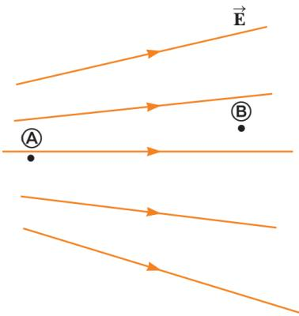  
Hình 25.1: Hai điện tích điểm trong điện trường

# Hiệu điện thế trong điện trường đều

Ta tiến hành khảo sát một điện trường đều, theo đó các đường sức điện trường hướng song song và đều đặn như miêu tả trên hình 25.2a. Từ phương trình (25.3) suy ra được hiệu điện thế giữa hai điểm A và B nằm trên cùng một đường sức điện trường:

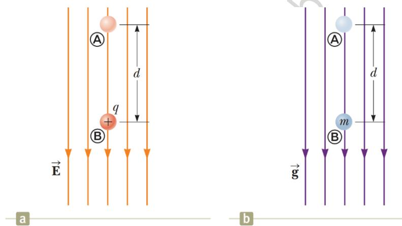

Hình 25.2: (a) Hạt mang điện tích $q$ chuyển động dọc theo đường sức điện trường đều (b) Hạt khối lượng m rơi trong trường trọng lực đều.

$$
{ \Delta } V = V - V = - \int \stackrel { ( B ) } { E } \overleftrightarrow { E } \cdot \overrightarrow { d s } = - \int \displaylimits _ { ( A ) } ^ { ( B ) } E \cdot { d s } \cdot \cos ( 0 ^ { 0 } ) = - \sum \op _ { ( A ) } ^ { ( \pm ) } E \cdot { d s }
$$

Trong điện trường đều $E$ có độ lớn không đổi nên có thể đưa ra ngoài dấu tích phân:

$$
\Delta V = - E \int _ { ( A ) } ^ { ( B ) } d s
$$

$$
\Delta V = - E d
$$

Dấu “–“ ở đây nói rằng, điện thế tại B thấp hơn điện thế tại A: $V _ { B } < V _ { A }$ . Như vậy, các đường sức điện trường luôn hướng theo chiều suy giảm của điện thế.

Khi một điện tích $q$ di chuyển từ A đến B, thế năng của hạt trong điện trường thay đổi một lượng bằng

Có nghĩa nếu hạt mang điện tích dương: $q > 0$ , thế năng sẽ giảm: U  0. Nói cách khác, khi một điện tích dương di chuyển xuôi theo chiều của đường sức điện trường, thế năng của nó sẽ giảm. Như hình 25.2a miêu tả, nếu ban đầu hạt mang điện tích dương $q$ thả tự do từ trạng thái đứng yên, nó sẽ chịu tác dụng một lực ${ \overrightarrow { F } } = q { \overrightarrow { E } }$ hướng xuống dưới, bắt đầu đi xuống và tăng tốc. Hạt dần thu động năng từ chính sự suy giảm của thế năng. Đó là minh chứng rõ ràng cho định luật bảo toàn năng lượng.

Hình 25.2b miêu tả hình ảnh tương tự, khi một hạt khối lượng $m$ rơi tự do trong trường hấp dẫn gần mặt đất. Hạt cũng chịu tác dụng của trọng lực hướng xuống và tăng tốc. Động năng tích luỹ tự sự suy giảm của thế năng trọng trường.

Phép so sánh nói trên giữa hạt mang điện tích dương trong điện trường với hạt chuyển động dưới trường trọng lực rất hữu ích cho việc hình dung về các hiện tượng tĩnh điện. Chỉ một điểm lưu ý rằng: khối lượng thì luôn dương, nhưng điện tích có thể dương, cũng có thể âm.

Với trường hợp điện tích âm, khi hạt di chuyển theo chiều của đường sức điện trường, thế năng của hạt sẽ tăng, thay vì giảm. Nếu ban đầu hạt đứng yên, nó sẽ tăng tốc về phía ngược chiều của đường sức.

Ta khảo sát trường hợp tổng quát hơn, khi hạt mang điện tích di chuyển từ vị trí A đến vị trí B trong điện trường đều, nhưng không nằm trên cùng một đường sức như hình 25.3. Lúc này hiệu điện thế giữa A và B bằng:

$$
\Delta V = V _ { _ { B } } - V _ { _ { A } } = - \int _ { ( A ) } ^ { ( B ) } \stackrel { \longrightarrow } { { \cal E } } \cdot \stackrel { \longrightarrow } { d s } = - \stackrel {  } { { \cal E } } \cdot \int \stackrel { ( B ) } { d s } = - \stackrel { \longrightarrow } { { \cal E } } \cdot s
$$

$\mathring { \mathrm { O } }$ đây vector $\overrightarrow { E }$ của điện trường đều có thể đưa ra ngoài dấu tích phân. Độ biến thiên của thế năng:

$$
\Delta U = q \Delta V = - q \overrightarrow { E } \cdot \overrightarrow { s }
$$

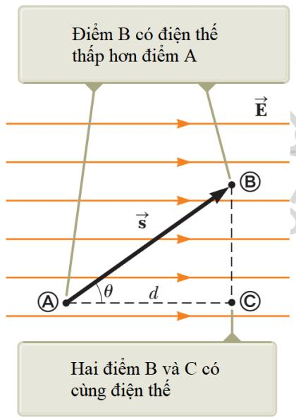

Tích vô hướng (25.8) có thể tính qua hình học:

$$
\Delta V = V _ { \scriptscriptstyle B } - V _ { \scriptscriptstyle A } = - E d
$$

Mặt khác hiệu điện thế giữa hai điểm A và C nằm trên cùng một đường sức:

Hình 25.3: Hạt mang điện tích chuyển động không

$$
V _ { \mathrm { ~ } } - V _ { \mathrm { ~ } } = - E d
$$

song song với đường sức của điện trường đều

Từ đây suy ra rằng $V _ { B } = V _ { C }$ . Tổng quát lên có thể thấy rằng, mọi điểm nằm trên cùng một mặt phẳng vuông góc với đường sức điện trường đều có cùng một điện thế. Ta gọi mặt phẳng chứa tất cả các điểm có cùng điện thế như vậy là một mặt đẳng thế. Đối với điện trường đều, họ các mặt đẳng thế cấu thành từ những mặt phẳng song song với nhau và cùng vuông góc với các đường sức điện trường.

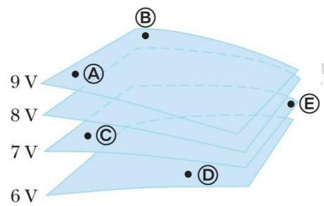  
Hình 25.4: Các mặt đẳng thế

Câu hỏi 25.2: Các điểm được đánh dấu trên hình 25.4 nằm trên các mặt đẳng thế. Hãy sắp xếp công thực hiện của điện trường lên một điện tích dương theo thứ tự giảm dần, khi điện tích này di chuyển từ A sang B, từ B sang C, từ C sang D và từ D sang E.

# Bài tập mẫu 25.1: Điện trường giữa hai bản phẳng song song tích điện trái dấu

Một ắc-quy hiệu điện thế 12V mắc vào hai bản phẳng đặt song song như hình 25.5. Khoảng cách giữa hai bản $d = 0 { , } 3 \mathrm { c m }$ , đủ nhỏ để xem rằng điện trường giữa hai bản là đều. Tính cường độ điện trường giữa hai bản phẳng.

# Giải:

Dùng công thức (25.6), có thể tính cường độ điện trường giữa hai bản phẳng song song:

$$
E = \frac { \left| V _ { _ B } - V _ { _ A } \right| } { d } = \frac { 1 2 V } { 0 , 3 \times 1 0 ^ { - 2 } m } = 4 { \times } 1 0 ^ { 3 } V / m
$$

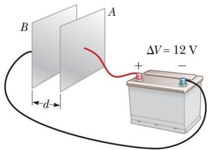  
Hình 25.5: Hai bản phẳng song song nối vào nguồn điện

# Bài tập mẫu 25.2: Chuyển động của hạt proton trong điện trường đều

Một proton được thả ra từ trạng thái đứng yên tại vị trí A trong một điện trường đều có độ lớn $8 { , } 0 { \times } 1 0 ^ { 4 } \mathrm { V / m }$ (hình 25.6). Proton di chuyển đến điểm B cách đó một đoạn $d = 0 , 5 0 \mathrm { m }$ dọc theo hướng của điện trường $\vec { E }$ . Tìm tốc độ của proton sau đoạn đường đó.

# Giải:

Khái niệm. Hình dung rằng hạt proton rơi xuống tựa như đang ở trong một trường trọng lực. Trong bài tập này, hạt cũng chịu tác dụng một gia tốc không đổi bởi lực điện trường.

Phân loại. Do hệ không tương tác với bên ngoài nên ta có thể quy vấn đề về chủ đề bảo toàn năng lượng.

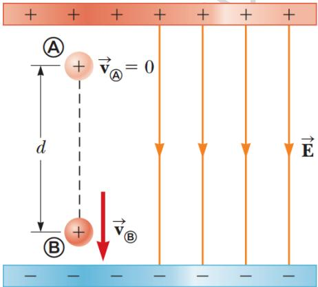  
Hình 25.6: Proton tăng tốc theo hướng của điện trường

Phân tích. Áp dụng định luật bảo toàn năng lượng cho điểm A và điểm B:

Thế biểu thức của động năng và thế năng tại A và B tương ứng:

Từ đó suy ra vận tốc $\nu$ đồng thời tính $\Delta V$ theo công thức (25.6):

$$
\nu = { \sqrt { \frac { - 2 e \Delta V } { m } } } = { \sqrt { \frac { - 2 e ( - E d ) } { m } } } = { \sqrt { \frac { 2 e E d } { m } } }
$$

$$
= \sqrt { \frac { 2 ( 1 , 6 \times 1 0 ^ { - 1 9 } C ) ( 8 , 0 \times 1 0 ^ { 4 } \mathrm { V } ) ( 0 , 5 0 m ) } { 1 , 6 7 \times 1 0 ^ { 2 7 } k g } }
$$

$$
= 2 , 8 \times 1 0 ^ { 6 } m / s
$$

Nhận định. Điện th $\acute { \mathrm { e } }$ giảm theo chiều chuyển động của proton, $\Delta V < 0$ , kéo theo sự suy giảm của thế năng: $\Delta U < 0 . { \mathrm { \scriptsize ~ D } } \dot { \hat { \mathrm { e } } }$ cân bằng sự suy giảm này, proton lại tích luỹ động năng trong chuyển động có gia tốc, tuân theo định luật bảo toàn năng lượng.

# Điện thế và thế năng tạo bởi điện tích điểm

Từ trình bày $\dot { \mathbf { O } }$ chương 23, ta đã biết rằng một điện tích điểm $q > 0$ tạo ra trong không gian xung quanh một điện trường đối xứng xuyên tâm với những đường sức hướng ra ngoài. Hiệu điện thế giữa hai điểm A và B bất kì (hình 25.7) có thể tính theo công thức (25.3):

$$
V _ { _ { B } } - V _ { _ { A } } = - \int _ { ( A ) } ^ { ( B ) } \overrightarrow { E } \cdot \overrightarrow { d s }
$$

Vector cường độ điện trường $\overrightarrow { E }$ đối với điện trường của điện tích điểm có dạng

$$
\overrightarrow { E } = \frac { k _ { e } q } { r ^ { 3 } } \overrightarrow { r }
$$

  
Hình 25.7: Tính hiệu điện thế giữa hai điểm bất kì trong điện trường đối xứng xuyên tâm

Thế vào thu được

$$
V _ { _ B } - V _ { _ A } = - \int _ { \left( A \right) } ^ { \left( B \right) } \frac { k _ { e } q } { r ^ { 3 } } \vec { r } \cdot \overrightarrow { d s }
$$

Lưu ý rằng gốc thế năng lấy $\acute { \mathbf { O } }$ trạng thái hai điện tích cách xa nhau vô cùng. Nếu $q _ { 1 } , q _ { 2 }$ cùng dấu, chúng có sức mạnh đẩy nhau ra xa nhất có thể, chứng tỏ hệ có mang năng lượng $U > 0$ . Ngược lại nếu $q _ { 1 } , q _ { 2 }$ trái dấu, cần phải bổ sung một năng lượng nhờ một lực bên ngoài mới tách chúng ra xa được, chứng tỏ hệ mang năng lượng âm. Nếu biện luận theo hướng cho rằng điện tích $q _ { 1 }$ nằm trong điện trường do $q _ { 2 }$ tạo ra, ta cũng đi đến kết quả như (25.13).

# Mối liên hệ giữa điện trường và điện thế

Công thức (25.3) viết lại dưới dạng vi phân

$$
d V = - \overrightarrow { E } \cdot \overrightarrow { d s }
$$

cho ta giá trị của hiệu điện thế nếu biết trước điện trường $\overrightarrow { E }$ tại các điểm trong không gian.

Có nghĩa thành phần $E _ { x }$ của vector cường độ điện trường bằng đạo hàm riêng của điện thế theo biến $x$ đảo dấu. Ta cũng thu được kết luận tương tự đối với thành phần theo $y$ và $z .$ , viết thành bộ đầy đủ:

$$
\begin{array} { r } { \boldsymbol { E } _ { \mathrm { \Delta } x } = - \displaystyle \frac { \partial \boldsymbol { V } } { \partial \boldsymbol { x } } , \boldsymbol { E } _ { \mathrm { \Delta } y } = - \displaystyle \frac { \partial \boldsymbol { V } } { \partial \boldsymbol { y } } , \boldsymbol { E } _ { \mathrm { \Delta } z } = - \displaystyle \frac { \partial \boldsymbol { V } } { \partial \boldsymbol { z } } } \\ { \quad \partial ^ { \mathrm { \Delta } } \boldsymbol { \hat { x } } } \end{array}
$$

Hình chiếu của vector $\overrightarrow { E }$ theo hướng của vector $l$ bất $\mathrm { k i }$ cũng được tính theo cách tương tự như thế:

$$
E _ { _ l } = - { \frac { d V } { d l } }
$$

Xét hai điểm lân cận nằm trên cùng một mặt đẳng thế, hiệu điện thế giữa hai điểm này: $d V = 0$ . Do vậy, hình chiếu của vector $\overrightarrow { E }$ theo phương tiếp tuyến với mặt đẳng thế cũng bằng $\overrightarrow { E }$ không. Nói cách khác, vector cường độ điện trường  luôn hướng vuông góc với mặt đẳng thế.

Hình 25.11 miêu tả họ các mặt đẳng thế trong các trường hợp khác nhau: điện trường đều, điện trường sinh ra bởi điện tích điểm và điện trường tạo bởi lưỡng cực điện. Trong tất cả các trường hợp, các mặt đẳng thế luôn vuông góc với những đường sức điện trường tại giao điểm:

• Trên mục 25.2 ta đã phân tích được rằng, họ các mặt đẳng thế trong điện trường đều là những mặt phẳng song song, cố nhiên vuông góc với đường sức điện trường. • Ở mục 25.3 ta cũng làm sáng tỏ rằng, điện thế tạo bởi điện tích điểm chỉ phụ thuộc vào khoảng cách đến điện tích điểm, nên họ các mặt đẳng thế là những mặt cầu, giao nhau vuông góc với đường sức đối xứng xuyên tâm.

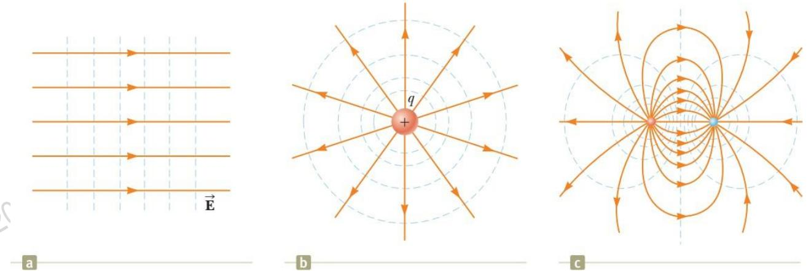  
Hình 25.11: Họ các mặt đẳng thế trong các trường hợp: (a) điện trường đều (b) điện trường của điện tích điểm (c) điện trường tạo bởi lưỡng cực điện

Hãy thử suy vector $\overrightarrow { E }$ của điện trường tạo bởi điện tích điểm từ biểu thức của điện thế (25.11):

# Điện thế sinh ra bởi sự phân bố điện tích liên tục

Ở mục 25.3, chúng ta tính được điện thế sinh ra bởi tập hợp các điện tích điểm rời rạc. Mục này trình bày phương pháp tính điện thế sinh ra bởi sự phân bố điện tích liên tục, tức vật tích điện có kích thước đáng $\mathrm { k } \mathring { \mathbf { e } }$ . Có hai phương pháp tiến hành: phương pháp chia nhỏ và phương pháp dùng định lý Gauss.

# Phương pháp chia nhỏ

Ta chia vật tích điện có kích thước lớn nói trên thành những phần rất nhỏ, nhỏ đến mức có thể xem mỗi phần như thế là một điện tích điểm. Đối với mỗi điện tích điểm vừa cắt ra ấy, ta đã có thể áp dụng công thức (25.11) để tính điện thế $d V$ do nó tạo ra tại điểm P cần khảo sát:

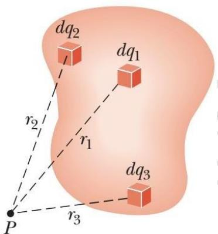

Hình 25.12: Tính điện thế sinh ra bởi sự phân bố

$$
d V = k _ { e } { \frac { d q } { r } }
$$

điện tích liên tục

trong đó $r$ là khoảng cách từ phần nhỏ đang xét đến điểm P. Điện thế do vật sinh ra tại điểm P là sự tổng hợp của tất cả các phần nhỏ trên toàn bộ vật tích điện:

$$
V = \sum d V = \int d V = k _ { e } \int \frac { d q } { r }
$$

# Cần lưu ý ở phương pháp này rằng: gốc lấy điện thế $\boldsymbol { V } = 0 ,$ ) nằm $\scriptstyle { \vec { \pmb { \sigma } } }$ xa vô cùng $( \infty )$

# Phương pháp dùng định lý Gauss

Đối với những hệ tích điện mang tính đối xứng, ta có thể dùng định lý Gauss để tính điện trường $\overrightarrow { E }$ trước. Sau đó dùng công thức () để tính điện thế:

$$
V = \int _ { ( \Theta ) } ^ { \Theta ^ { \prime } } \overrightarrow { E } \cdot \overrightarrow { d s }
$$

trong đó $\mathrm { g } \acute { \mathrm { o c } }$ lấy điện thế $( V = 0 )$ có thể quy ước tại một điểm O nào đó.

# Bài tập mẫu 25.4: Điện thế tạo bởi vành tròn tích điện đều

(A) Tìm biểu thức của điện thế tại điểm P nằm trên trục đối xứng của một vành tròn bán kính a với điện tích $\boldsymbol { \mathcal { Q } }$ phân bố đều, cách tâm vành tròn một đoạn $x$ .

# Giải:

Chia vành tròn ra rất nhiều phần nhỏ, mỗi phần có điện tích dq nhỏ đến mức có thể xem như điện tích điểm. Áp dụng công thức (20.20), ta có thể tính điện thế tại điểm P:

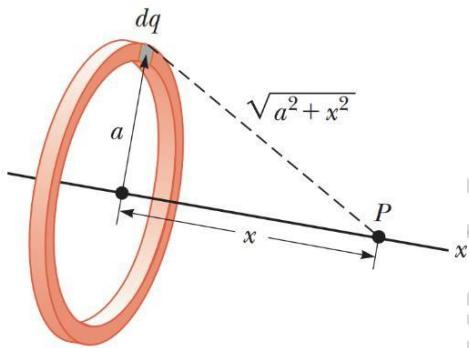  
Hình 25.13: Tính điện thế tại điểm nằm trên trục của vành tròn tích điện đều

$$
V = k _ { e } \int { \frac { d q } { r } }
$$

Để ý rằng điểm P nằm cách đều tất cả các phần của vành tròn, do vậy tích phân trên dễ dàng chuyển thành:

$$
V = \frac { k _ { e } } { r } \int d q
$$

Tích phân trên thể hiện tổng toàn bộ điện tích chứa trên vành. Còn khoảng cách $r$ có thể biểu diễn thành $r = \sqrt { a ^ { 2 } + x ^ { 2 } }$

$$
V = { \frac { k _ { e } Q } { \sqrt { a ^ { 2 } + x ^ { 2 } } } }
$$

(B) Tìm biểu thức của cường độ điện trường tại P.

# Giải:

Do tính chất đối xứng, có thể kết luận rằng vector cường độ điện trường $\overrightarrow { E }$ tại điểm P phải hướng dọc theo trục x. Nói cách khác $\overrightarrow { E }$ chỉ có thành phần theo $x$ . Từ mối liên hệ (25.16) giữa cường độ điện trường và thế năng:

$$
\begin{array}{c} E ~ = - { \frac { d V } { d x } } = - k Q { \frac { d } { d x } } ^ { \Big ( } { \frac { 1 } { \sqrt { a ^ { 2 } + x ^ { 2 } } } } ~ \Big ) =  \end{array} \quad k _ { e } x \quad _ { Q }
$$

Bài tập mẫu 25.5: Điện thế tạo bởi thanh tích điện đều Một thanh có chiều dài $l$ đặt dọc theo trục x như hình vẽ. Thanh có điện tích $\boldsymbol { \mathcal { Q } }$ phân bố đều với mật độ dài . Tính điện thế tại điểm $\mathrm { P }$ nằm trên trục $y$ cách đầu thanh một đoạn bằng $a$ .

# Giải:

Điện thế tại $\mathrm { P }$ được tạo bởi các phần điện tích phân bố khắp chiều dài thanh. Xét một đoạn $d x$ rất nhỏ trên thanh, mang điện tích $d q = \lambda d x$ đủ nhỏ để có thể xem như điện tích điểm.

Điện thế do điện tích điểm dq nói trên tạo ra tại P:

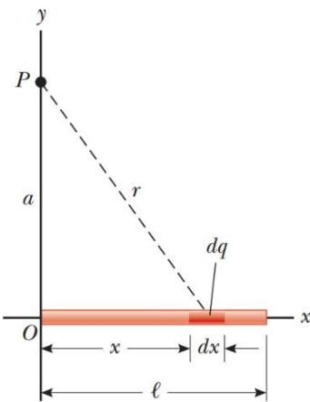

Hình 25.14: Tính điện thế tạo bởi thanh tích

$$
d V = k _ { e } \frac { d q } { r } = k _ { e } \frac { \lambda d x } { \sqrt { a ^ { 2 } + x ^ { 2 } } }
$$

điện đều

Điện thế do rất nhiều điện tích điểm như thế trên toàn bộ thanh tạo ra tại P là tích phân:

$$
V = \int _ { 0 } ^ { l } k _ { e } \frac { \lambda d x } { \sqrt { a ^ { 2 } + x ^ { 2 } } }
$$

Theo đó cận tích phân lấy từ $x = 0$ cho đến $x = l .$ .

Để ý rằng $k _ { e }$ và $\lambda = Q / l$ là những số không đổi, có thể cho ra ngoài dấu tích phân:

$$
\left| \begin{array} { c c c } { { \displaystyle { l \big ( } } } & { { \displaystyle { d x } } } & { { \big Q } } \\ { { \displaystyle { V = k _ { e } \lambda \int _ { 0 } \frac { d } { \sqrt { a ^ { 2 } + x ^ { 2 } } } } = k _ { e } \frac { \mathrm { - } } { l } \mathrm { l n ( x + } } } & { { \displaystyle a ^ { 2 } + x ^ { 2 } ) } } \end{array} \right| ^ { l }
$$

$$
= \vert \kappa _ { e } \stackrel { Q } { } _ { l } \ln _ { \big \vert } \frac { l + \sqrt { a ^ { 2 } + l ^ { 2 } } } { a } \big \vert 
$$

# Điện thế tạo bởi vật dẫn tích điện

Từ chương 24, ta biết rằng đối với vật dẫn điện ở trạng thái cân bằng, điện tích chỉ phân bố trên bề mặt vật dẫn. Ngoài ra ta cũng biết rằng, điện trường chỉ tồn tại bên ngoài vật dẫn và vuông góc với bề mặt vật dẫn. Bên trong vật dẫn điện trường hoàn toàn bị triệt tiêu.

Chương này ta tiếp tục bàn đến vật dẫn điện về phương diện điện thế. Áp dụng công thức (25.3) cho hai điểm A và B bất kì nằm trong hoặc trên bề mặt vật dẫn, ta có:

$$
{ \overset { ( B ) } { \underset { E } { \longrightarrow } } } . { \overset { } { d s } } = 0
$$

$$
V _ { \scriptscriptstyle B } - V _ { \scriptscriptstyle A } = - \int _ { ( \zeta { \cal A } ) }
$$

Như vậy mọi điểm thuộc vật dẫn đều có điện thế bằng nhau.

Hình 25.15 miêu tả điện thế tại các điểm bên trong và bên ngoài quả cầu làm bằng vật liệu dẫn điện. Theo trình bày ở chương 24, việc áp dụng định lý Gauss cho ra kết quả rằng: điện trường bên ngoài quả cầu tích điện có dạng y hệt như điện trường tạo bởi điện tích điểm:

$$
E = k _ { e } \frac { q } { r ^ { 2 } }
$$

Do đó điện thế tại một điểm bất kì nằm ngoài quả cầu cũng sẽ có dạng như điện th $\acute { \mathrm { e } }$ sinh ra bởi điện tích điểm đặt tại tâm quả cầu:

$$
V = k _ { e } { \frac { q } { r } }
$$

Từ đó suy ra điện thế ngay trên bề mặt quả cầu tích điện:

$$
V = k _ { _ { e } } { \frac { q } { R } }
$$

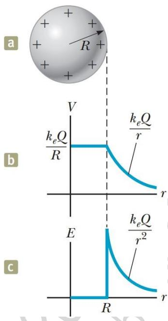  
Hình 25.15: (a) vật dẫn hình cầu (b) điện thế (c) điện trường

với $R$ là bán kính quả cầu. Trong trường hợp quả cầu làm bằng vật liệu dẫn điện, biểu thức (25.20) cũng chính là điện thế tại mọi điểm thuộc quả cầu. Hình 25.15b diễn tả điều đó bằng đoạn nằm ngang tương ứng với các điểm bên trong quả cầu.

# Bài tập mẫu 25.6: Hai quả cầu tích điện nối nhau

Hai vật dẫn hình cầu có bán kính lần lượt bằng $r _ { 1 }$ và $r _ { 2 }$ ban đầu đặt cách xa nhau. Sau đó chúng được nối với nhau nhờ sợi dây dẫn điện như hình 25.16. Khi hệ cân bằng, điện tích trên mỗi quả cầu lần lượt bằng $q _ { 1 }$ và $q _ { 2 }$ , phân bố đều trên mỗi bề mặt. Tìm tỉ số của cường độ điện trường trên bề mặt của hai quả cầu này.

# Giải:

Do hai quả cầu đặt cách nhau đủ xa, sự ảnh hưởng lẫn nhau về điện trường là không đáng $\mathbf { k } \acute { \hat { \mathbf { e } } } ,$ , dẫn đến điện tích mỗi bên vẫn phân bố đều trên mỗi bề mặt và điện trường trên mỗi quả cầu vẫn giữ được nguyên tính đối xứng.

Việc nối hai quả cầu bằng dây dẫn làm cho điện thế cả hai bằng nhau:

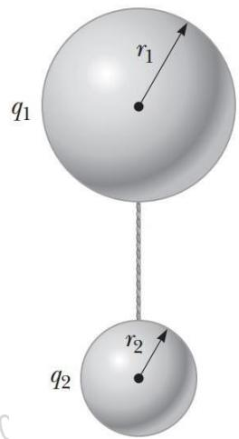  
Hình 25.16: Hai quả cầu dẫn điện nối với nhau

$$
V = k _ { \mathrm { ~ } _ { e } } ^ { \mathrm { ~ } \mathcal { I } _ { 1 } } = k _ { \mathrm { ~ } _ { e } } ^ { \mathrm { ~ } \mathcal { I } _ { 2 } }
$$

hay:

$$
\displaystyle \frac { q _ { 1 } } { q _ { 2 } } = \frac { r _ { 1 } } { r _ { 2 } } ( 1 )
$$

Cường độ điện trường trên bề mặt mỗi quả cầu có độ lớn:

$$
E _ { 1 } = k _ { e } \frac { q _ { 1 } } { r ^ { 2 } } , E _ { _ 2 } = k _ { e } \frac { q _ { 2 } } { r ^ { 2 } }
$$

Lấy tỉ số của cường độ điện trường:

$$
\underbrace { E _ { _ 1 } } _ { E _ { 2 } } = \underbrace { q _ { _ 1 } r _ { _ 2 } ^ { 2 } } _ { q _ { _ 2 } r _ { _ 1 } ^ { 2 } }
$$

Thế (1) vào thu được:

$$
\begin{array} { c } { E } \\ { E _ { _ 2 } ^ { ^ 1 } = \frac 1 { r ^ { \textit { 1 } } } ^ { 2 } = \frac { r } { r } } \end{array}
$$

Từ kết quả thu được có thể thấy rằng, khi hai quả cầu nối nhau bằng dây dẫn điện, điện trường trên bề mặt của quả cầu nhỏ thì lớn hơn điện trường trên bề mặt quả cầu lớn.

# Vật dẫn rỗng ruột

Vật dẫn rỗng ruột có thể miêu tả như hình 25.17. Với loại vật dẫn hết sức đặc biệt này, ta sẽ chứng minh rằng điện trường bên trong phần rỗng của vật dẫn phải luôn luôn bằng không, dù điện trường bên ngoài có thay đổi thế nào đi nữa! Thực vậy, xét hai điểm A và B bất kì thuộc thành bên trong sát phần rỗng, theo (25.3) ta có:

$$
V _ { _ B } - V _ { _ A } = - \int _ { ( A ) } ^ { ( B ) } \overrightarrow { E } \cdot \overrightarrow { d s }
$$

Nhưng đối với vật dẫn bất kì ta cũng đã chứng minh rằng điện thế tại mọi điểm trong nó đều bằng nhau: $V _ { A } = V _ { B }$ . ENên vector cường độ điện trường buộc phải bằng không.

Vật dẫn rỗng ruột dưới dạng những hộp có vỏ bằng kim loại có nhiều ứng dụng trong việc cách ly các vật bên trong khỏi ảnh hưởng của điện trường ngoài.

Dièn trròng bèn trong óc vàt dân bi trièt tièu, cho dù vàt dān vǎn có mang dièn tich

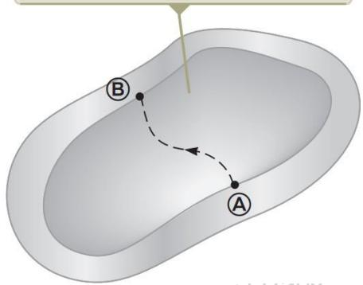  
Hình 25.17: Vật dẫn rỗng ruột

# Tia lửa điện

Tia lửa điện thường quan sát thấy ở gần vật dẫn điện cao thế. Khi điện trường gần vật dẫn đủ lớn, các electron tự do, vốn phát sinh do sự ion hoá ngẫu nhiên của phân tử khí, sẽ được gia tốc và bị đẩy xa khỏi phân tử mẹ. Chúng chuyển động nhanh và va chạm với nhiều phân tử khí xung quanh, làm phát sinh thêm rất nhiều sự ion hoá thứ cấp, kéo theo sự xuất hiện càng lúc càng nhiều electron tự do khác. Các electron này sau đó tái kết hợp với những ion phân tử, di chuyển từ trạng thái tự do sang trạng thái liên kết ở mức năng lượng thấp hơn làm phát ra năng lượng dưới dạng ánh sáng. Đó chính là tia lửa điện.

Ở những phần nhọn của vật dẫn, điện tích tập trung nhiều hơn và sinh ra điện trường lớn hơn so với những phần khác. Do đó tia lửa điện thường hay xuất hiện ở những điểm nhọn này.

Tia lửa điện có thể được quan sát rõ hơn nhờ máy quay tử ngoại

# Thí nghiệm giọt dầu Millikan

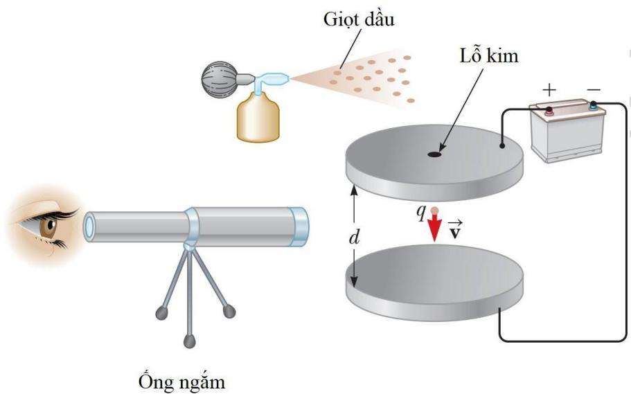  
Hình 25.18: Thí nghiệm giọt dầu Millikan

Trong giai đoạn 1909-1913, Robert Millikan đã tiến hành phép đo điện tích của electron, xác định giá trị của điện tích nguyên tố e. Thiết bị thí nghiệm được mô tả như hình 25.18. Bộ phận chính của thiết bị gồm hai đĩa kim loại đặt song song, đấu vào hai cực của ắc quy để tạo ra điện trường giữa chúng. Millikan dùng bình phun sương phun những giọt dầu li ti vào khoảng trống giữa hai đĩa, đồng thời rọi x-quang làm ion hoá không khí, khiến cho các electron được giải phóng và dính vào những giọt dầu. Những giọt dầu được chiếu sáng, hiện giữa ống kính quan sát như những ngôi sao hiện giữa trời đêm.

Hình 25.21: Bộ lọc bụi tĩnh điện   

Hiệu điện thế giữa hai điểm A và B trong điện trường $\overrightarrow { E }$ được định nghĩa qua công thức:

$$
\Delta V \equiv \frac { \Delta U } { q } = - \int _ { ( A ) } ^ { ( B ) } \overrightarrow { E } \cdot \overrightarrow { d s }
$$

trong đó U - độ chênh lệch thế năng. Điện thế $V = U / q$ là một đại lượng vô hướng, có đơn vị Volt (V): $1 \mathrm { V } = 1 \mathrm { J } / \mathrm { C }$

# Khái niệm và nguyên lý

Khi một điện tích dương $q$ di chuyển từ vị trí A sang vị trí B trong điện trường ${ \overline { { E } } } _ { : }$ , thế năng thay đổi một lượng bằng:

$$
\Delta U = - q \int _ { ( \stackrel {  } { \langle d \rangle } } ^ { ( B ) } \stackrel {  } { \vec { E } \cdot \vec { d s } }
$$

Hiệu điện thế giữa hai điểm nằm trên cùng một đường sức của điện trường đều và cách nhau một đoạn $d$ bằng

$$
\Delta V = - E d
$$

Nếu chọn $V = 0$ tại $r = \infty$ , điện thế tạo ra bởi một điện tích điểm tại vị trí cách nó đoạn r bằng

$$
V = k _ { e } { \frac { q } { r } }
$$

Điện thế do nhiều điện tích điểm tạo thành là sự tổng hợp các thế năng của từng điện tích điểm riêng rẽ.

Thế năng của hệ tạo bởi hai điện tích điểm nằm cách nhau một khoảng r12

$$
U = k _ { e } \frac { q _ { 1 } q _ { 2 } } { r _ { 1 2 } }
$$

Thế năng của hệ cấu thành từ nhiều điện tích điểm có thể tính được bằng cách lấy tổng thế năng từ mỗi cặp trong hệ theo cách như trên.

Nếu điện thế được cho dưới dạng một hàm số phụ thuộc vào toạ độ $V = V ( x , y , z )$ , các thành phần của vector cường độ điện trường $\bar { E }$ có thể tính được bằng cách lấy đạo hàm của điện thế theo toạ độ:

$$
E _ { _ x } = - \frac { d V } { d x } , E _ { _ y } = - \frac { d V } { d y } , E _ { _ z } = - \frac { d V } { d z }
$$

Điện thế tạo ra bởi sự phân bố liên tục các điện tích được tính bằng

$$
V = k _ { _ { e } } { \int } \frac { d q } { r _ { _ { s } } }
$$

Đối với vật dẫn điện $\acute { \mathbf { O } }$ trạng thái cân bằng, mọi điểm nằm trong vật dẫn và trên bề mặt vật dẫn đều có cùng một điện thế.

# Câu hỏi lý thuyết chương 25

1. Phân biệt hai khái niệm điện thế và thế năng.

2. Hãy mô tả mặt đẳng thế trong điện trường tạo bởi một dây tích điện dài vô hạn và của một mặt cầu tích điện đều.

3. Khi hai hạt mang điện tích điểm đặt xa nhau vô cùng, thế năng của hệ được quy ước bằng không. Khi đưa các hạt tiến lại gần nhau, thế năng của hệ mang giá trị dương nếu hai điện tích cùng dấu, mang giá trị âm nếu hai điện tích trái dấu. Hãy giải thích tại sao như vậy.

# Bài tập chương 25

1. Hai bản phẳng đặt song song cách nhau $5 { , } 3 3 \ \mathrm { m m }$ , đặt dưới hiệu điện thế 600 V.

(a) Tính cường độ điện trường giữa hai bản phẳng.   
(b) Tìm lực tác dụng lên một electron đang nằm trong điện trường này.   
(c) Để di chuyển một electron từ vị trí cách bản dương $2 { , } 9 0 \mathrm { m m }$ đến bản âm cần thực hiện một công bằng bao nhiêu?

ĐS: (a) $1 , 1 3 { \times } 1 0 ^ { 5 } \mathrm { N } / \mathrm { C }$ (b) $1 , 8 { \times } 1 0 ^ { - 1 4 } \mathrm { N } \left( \mathrm { c } \right) 4 , 3 7 { \times } 1 0 ^ { - 1 7 } \mathrm { J }$

2. Một proton được gia tốc từ trạng thái đứng yên bằng hiệu điện thế 120 V. Tính tốc độ mà nó thu được sau khi gia tốc.

ĐS: $1 { , } 5 2 { \times } 1 0 ^ { 5 } \mathrm { m } / \mathrm { s }$

3. Một điện trường đều có cường độ $3 2 5 ~ \mathrm { V / m }$ hướng theo chiều âm của trục $y$ như hình vẽ. Tính hiệu điện thế $V _ { B } - V _ { A }$ giữa hai điểm A(-0,2 ;-0,3) và B(0,4 ;0,5). Gợi ý: lấy tích phân đường theo đường đứt nét như hình vẽ.

ĐS: $+ 2 6 0 \mathrm { V }$

4. Khi một electron chuyển động song song theo trục $x$ từ vị trí $x = 0$ đến vị trí $x = 2 \mathrm { c m }$ , tốc độ của nó suy giảm từ

$3 { , } 7 { \times } 1 0 ^ { 6 } \mathrm { m } / \mathrm { s }$ xuống còn 1,4105 m/s.

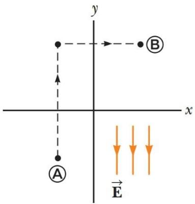  
Hình bài 3

(a) Tính hiệu điện thế giữa hai điểm nói trên (b) Điểm nào có điện thế lớn hơn?

ĐS: (a) -38,9 V

5. Hai điện tích điểm được bố trí cách nhau $d = 2$ cm như hình vẽ. Tính điện thế tại điểm A cách đều các điện tích một khoảng $d$ và tại điểm B nằm chính giữa hai điện tích.

ĐS: $V _ { _ A } = 5 { , } 3 9 \mathrm { k V }$ , $V _ { _ A } = 1 0 { , } 8 \mathrm { k V }$

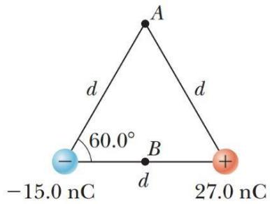  
Hình bài 5

6. Ba điện tích điểm có giá trị lần lượt bằng $2 0 ~ \mathrm { n C }$ , $1 0 ~ \mathrm { n C }$ và - $2 0 ~ \mathrm { n C }$ được gắn cố định trên một trục thẳng đứng như hình vẽ.

(a) Tính thế năng của hệ ba điện tích gắn cố định nói trên. (b) Đặt thêm hạt có điện tích $4 0 ~ \mathrm { n C }$ và khối lượng $2 \times 1 0 ^ { - 1 3 }$ kg vào vị trí như hình vẽ. Hạt này bị đẩy và chuyển động ra xa do tương tác với ba điện tích $\mathrm { c } \acute { \alpha }$ định. Tính vận tốc của hạt khi nó bị đẩy tới xa vô cùng.

ĐS: (a) $- 4 , 5 { \times } 1 0 ^ { - 5 } \mathrm { J } \left( { \bf b } \right) 3 , 4 6 { \times } 1 0 ^ { 4 } \mathrm { m } / \mathrm { s }$

7. Hai điện tích điểm đặt cách nhau $d = 2$ cm như hình vẽ. Cho biết $\mathcal { Q } = 5 \mathrm { n C }$ . Hãy tính:

(a) Điện thế tại A.   
(b) Điện thế tại B.   
(c) Hiệu điện thế giữa B và A.

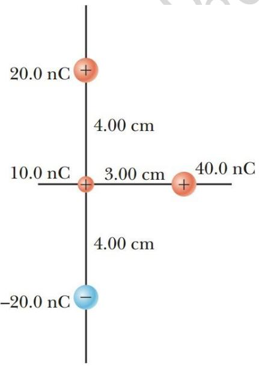  
Hình bài 6

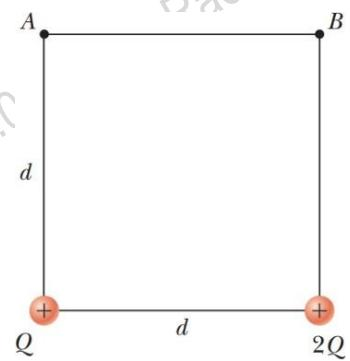  
Hình bài 7

ĐS: (a) $V _ { _ A } = 5 , 4 3 \mathrm { k V }$ (b) $V _ { _ B } = 6 { , } 0 8 \mathrm { k V }$ (c)

V = 658V

8. Tại một vị trí P nào đó gần điện tích điểm có cường độ điện trường bằng $5 0 0 \mathrm { V / m }$ và điện thế $- 3 \ \mathrm { k V }$ . Hãy tính :

(a) Khoảng cách giữa điểm P và điện tích điểm.   
(b) Độ lớn của điện tích điểm.

ĐS: (a) $6 \mathrm { m } ( \mathrm { b } ) - 2 \mu \mathrm { C }$

9. Bốn hạt có cùng điện tích $\boldsymbol { \mathcal { Q } }$ đặt trên bốn góc của hình vuông có cạnh bằng a. Hãy tính:

(a) Điện thế ở tâm của hình vuông.   
(b) Công cần thực hiện để đưa một hạt điện tích $q$ từ xa vô cùng về tâm của hình vuông.

ĐS: (a) $4 \sqrt 2 k _ { e } { \frac { Q } { a } } \left( \mathbf { b } \right) 4 \sqrt 2 k _ { e } { \frac { q Q } { a } }$

10. Năm 1911, Rutherford cùng hai trợ lý Geiger và Marsden đã tiến hành thí nghiệm tán xạ tia alpha trên nguyên tử vàng. Mỗi hạt alpha có điện tích bằng $+ 2 e$ và khối lượng $6 { , } 6 4 \times 1 0 ^ { - 2 7 } \mathrm { k g }$ . Kết quả thí nghiệm chỉ ra rằng, hầu hết khối lượng của nguyên tử gần như tập trung vào hạt nhân với kích thước rất nhỏ, được bao quanh bởi các quỹ đạo electron.

Bắn một hạt alpha từ khoảng cách xa hướng thẳng tới hạt nhân vàng với điện tích $+ 7 9 e$ . Tốc độ ban đầu của alpha bằng $2 { , } 0 0 { \times } 1 0 ^ { 7 } \mathrm { m / s }$ . Hạt alpha có khả năng tiến lại gần nhất so với hạt nhân vàng một khoảng bằng bao nhiêu? Cho rằng hạt nhân vàng luôn nằm cố định.

ĐS: $2 { , } 7 4 { \times } 1 0 ^ { - 1 4 } \mathrm { m }$

11. Dựa vào độ thị sự phụ thuộc của điện th $\acute { \mathrm { e } }$ vào toạ độ $V ( x )$ , hãy vẽ đồ thị sự phụ thuộc của thành phần $x$ của cường độ điện trường theo toạ độ $E _ { x } ( x )$ .

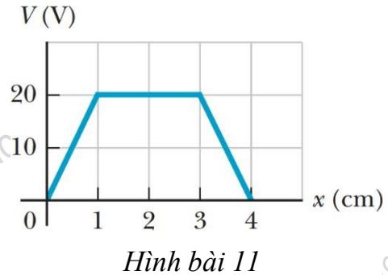

12. Trong phạm vi từ $x = 0$ đến $x = 6 , 0 0 \mathrm { m }$ , điện thế có dạng hàm số $V = a + b x ,$ , với $\overset { \cdot } { a } = 1 \overset { \cdot } { 0 } , 0 \mathrm { \ v { V } }$ và $b = 7 { , } 0 0 \mathrm { V / m }$ . Hãy xác định :

(a) Điện thế tại $x = 0$ , $x = 3 , 0 0$ và $x = 6 , 0 0 \mathrm { m }$ .   
(b) Độ lớn và hướng của điện trường tại $x = 0$ , $x = 3 , 0 0$ và $x = 6 , 0 0 \mathrm { m }$ .

ĐS: (a) 10V, -11V và -32V (b) $7 \mathrm { N } / \mathrm { C }$ tại mọi điểm $x > 0$

13. Trên một vùng không gian nhất định nào đó, điện thế có dạng hàm số $V = 5 x - 3 x ^ { 2 } y + 2 y z ^ { 2 }$ .

(a) Tìm hàm số biểu diễn các thành phần $E _ { x } , E _ { y } , E _ { z }$ của vector cường độ điện trường $\overrightarrow { E }$ . (b) Tính cường độ điện trường tại điểm P có toạ độ $( 1 , 0 0 ; 0 ; - 2 , 0 0 ) \mathrm { m } .$ . ĐS: (a) $\overrightarrow { E } = ( - 5 + 6 x y ) \cdot \overrightarrow { i } + ( 3 x ^ { 2 } - 2 z ^ { 2 } ) \cdot \overrightarrow { j } - 4 y z \cdot \overrightarrow { k } \quad ( \mathbf { b } ) 7 , 0 7 \mathrm { N } / \mathrm { C }$

14. Một thanh tích điện đều dài $1 4 ~ \mathrm { c m }$ được uốn cong thành nửa cung tròn  Hình như hình vẽ. Tổng điện tích trên thanh bằng $- 7 { , } 5 ~ \mu \mathrm { C }$ . Tính điện thế tại tâm O của cung tròn.

ĐS: $- 1 { , } 5 1 { \times } 1 0 ^ { 6 } \mathrm { V }$

15. Một dây tích điện đều với mật độ điện dài $\lambda$ được uốn thành dạng như hình vẽ. Hãy tính điện thế tại điểm O.

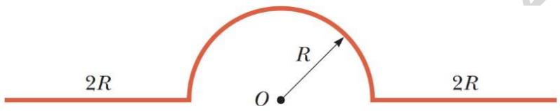  
Hình bài 15

ĐS: $k _ { e } \lambda ( \pi + 2 \ln { 3 } )$

16. Một vật dẫn hình cầu có bán kính $1 4 \mathrm { { c m } }$ và điện tích $2 6 \mu \mathrm { C }$ . Tính cường độ điện trường và điện thế tại điểm cách tâm vật dẫn:

(a) $\begin{array} { c } { r = 1 0 \mathrm { c m } } \\ { r = 2 0 \mathrm { c m } } \\ { r = 1 4 \mathrm { c m } } \end{array}$   
(b)   
(c)   
ĐS: (a) $1 { , } 6 7 { \times } 1 0 ^ { 6 } \mathrm { V }$ (b) 1,17106V (c) 1,67106V

17. Ống Geiger-Mueller có cấu tạo $\mathrm { g } \dot { \hat { \mathrm { o } } } \mathrm { m }$ anode và cathode từ hai ống kim loại hình trụ lồng vào nhau như hình vẽ. Anode có bán kính $r _ { B }$ và tích điện với mật độ dài $\lambda$ . Cathode có bán kính $r _ { A }$ và tích điện với mật độ dài $- \lambda .$

(a) Chứng tỏ rằng hiệu điện thế giữa anode và cathode có dạng:

$$
\Delta V = 2 k \underset { e } { \lambda } \ln \underset { \underset { \left\lfloor \frac { 1 } { r } \right\rfloor } { \longrightarrow } } { \binom { r _ { s _ { 1 } } } { r _ { s } } }
$$

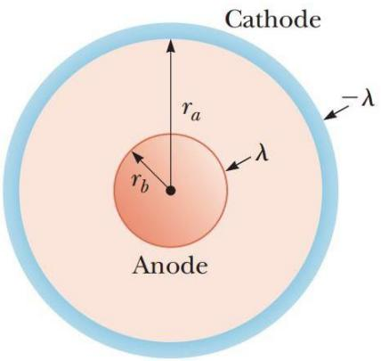

Hình bài 17

(b) Chứng tỏ rằng cường độ điện trường phụ thuộc vào khoảng cách $r$ đến trục đối xứng theo biểu thức:

$$
E = \frac { \Delta V } { \ln ( r _ { A } / \mathrm { r } _ { B } ) } \frac { 1 } { r }
$$