Ánh sáng là cơ sở cho hầu như mọi sự sống trên trái đất. Ví dụ, thực vật chuyển đổi năng lượng của ánh sáng mặt trời thành năng lượng hóa học thông qua quá trình quang hợp. Ngoài ra, ánh sáng là phương tiện chính mà chúng ta có thể truyền và nhận thông tin đến và đi từ các vật thể xung quanh cũng như từ trong vũ trụ.

Ánh sáng là một dạng bức xạ điện từ, truyền năng lượng từ nguồn sáng tới người quan sát. Nhiều hiện tượng trong cuộc sống hàng ngày của chúng ta phụ thuộc vào tính chất của ánh sáng. Khi bạn xem tivi hoặc xem ảnh trên màn hình máy tính, bạn sẽ thấy hàng triệu màu được tạo thành từ sự kết hợp chỉ có ba màu là: đỏ, xanh dương và xanh lục. Màu xanh của bầu trời ban ngày, màu đỏ và màu cam trên bầu trời lúc bình minh hay hoàng hôn là kết quả của hiện tượng tán xạ ánh sáng bởi các phân tử không khí. Bạn thấy hình ảnh của mình trong gương phòng tắm buổi sáng hoặc hình ảnh của những chiếc xe khác trong gương chiếu hậu khi đang lái xe là kết quả từ sự phản xạ ánh sáng. Nếu bạn đeo kính để nhìn cho rõ thì bạn đang nhờ vào hiện tượng khúc xạ ánh sáng. Màu sắc của cầu vồng là do sự tán sắc ánh sáng khi nó đi qua những hạt mưa lơ lửng trên bầu trời sau cơn mưa. Nếu bạn đã từng nhìn thấy những vòng tròn màu của hào quang xung quanh cái bóng của chiếc máy bay bạn đang đi trên những đám mây thì bạn đang thấy kết quả của hiện tượng giao thoa ánh sáng.

Trong phần giới thiệu của chương 35, chúng ta sẽ thảo luận về lưỡng tính sóng-hạt của ánh sáng. Trong một số trường hợp, ánh sáng được mô hình như một dòng hạt; ở những trường hợp khác, mô hình sóng hoạt động tốt hơn. Chương 35 đến hết 38 tập trung vào các khía cạnh của ánh sáng được hiểu rõ nhất thông qua mô hình sóng của ánh sáng. Trong phần 6, chúng ta sẽ tìm hiểu về bản chất hạt của ánh sáng.

Chương này bắt đầu giới thiệu hai mô hình lịch sử của ánh sáng và thảo luận các phương pháp đo tốc độ ánh sáng trước đây. Tiếp theo là những hiện tượng cơ bản của quang hình học: sự phản xạ (reflection) của ánh sáng từ một bề mặt và sự khúc xạ (refraction) khi ánh sáng đi qua biên giới giữa hai môi trường. Chúng ta cũng sẽ nghiên cứu sự tán sắc (dispersion) của ánh sáng khi nó khúc xạ qua vật liệu, dẫn đến hiện tượng xuất hiện cầu vồng. Cuối cùng, chúng ta sẽ nghiên cứu hiện tượng phản xạ toàn phần (total internal reflection), là cơ sở cho hoạt động của sợi quang và công nghệ sợi quang.

## Bản chất của ánh sáng

Trong lịch sử có hai mô hình cơ bản về bản chất của ánh sáng. Trước thế kỷ thứ 19, ánh sáng được xem như một dòng hạt. Các hạt này hoặc được phát ra từ các vật hoặc xuất phát từ mắt người quan sát. Newton là người chủ xướng cho lý thuyết hạt ánh sáng. Ông cho rằng các hạt ánh sáng xuất phát từ các vật và đi đến mắt để kích thích cảm giác sáng của người quan sát.

Christian Huygens thì lại tin rằng ánh sáng có thể là một dạng sóng chuyển động nào đó. Ông đã chỉ ra rằng các tia sáng giao thoa với nhau. Những nghiên cứu khác suốt thể kỷ thứ 19 đã dẫn đến một sự thừa nhận chung về lý thuyết sóng của ánh sáng. Thomas Young là người cung cấp bằng chứng rõ ràng đầu tiên (năm 1801) về bản chất sóng của ánh sáng. Ông đã giải thích hiện tượng giao thoa của ánh sáng dựa trên nguyên lý chồng chất. Hiện tượng này không thể giải thích được bằng lý thuyết hạt ánh sáng. Maxwell đã khẳng định rằng ánh sáng là một dạng sóng điện từ có tần số cao và Hertz đã cung cấp bằng chứng thực nghiệm cho lý thuyết của Maxwell vào năm 1887.

Mặc dù mô hình sóng và lý thuyết cổ điển về điện - từ có thể giải thích được hầu hết các tính chất của ánh sáng, nhưng chúng không thể giải thích được một số kết quả thí nghiệm sau đó. Nổi bật nhất là hiệu ứng quang điện được phát hiện bởi Hertz: Khi ánh sáng bắn vào một bề mặt kim loại thì các electron có thể được thoát ra khỏi bề mặt. Các thí nghiệm cho thấy động năng của một electron thoát ra độc lập với cường độ ánh sáng. Phát hiện này mâu thuẫn với mô hình sóng. Einstein đã đề xuất một giải thích về hiệu ứng quang điện vào năm 1905 sử dụng mô hình dựa trên khái niệm lượng tử hóa được Max Planck phát triển vào năm 1900. Mô hình lượng tử giả định năng lượng của sóng ánh sáng nằm trong các hạt gọi là photon và do đó năng lượng được cho là bị lượng tử hóa. Theo lý thuyết của Einstein, năng lượng E của một photon tỉ lệ thuận với tần số f của sóng điện từ :

$$
\mathrm { E = h f }
$$

h = 6,63. 10-34 J.s là hằng số Planck.

Như vậy, ánh sáng phải có lưỡng tính sóng hạt. Trong một số hoàn cảnh ánh sáng biểu hiện các đặc trưng của sóng và trong một số hoàn cảnh khác ánh sáng lại biểu hiện các đặc trưng của hạt.

## Đo tốc độ ánh sáng

Vì ánh sáng di chuyển với tốc độ rất cao $( \mathbf { c } = 3 , 0 0 . 1 0 ^ { 8 } \mathbf { m } / \mathrm { s } )$ nên những cố gắng trước đây để đo tốc độ của nó đều không thành công. Galileo đã cố gắng đo tốc độ ánh sáng bằng cách cho hai người quan sát đứng cách nhau $1 0 ~ \mathrm { k m }$ xác định thời gian ánh sáng truyền đi qua khoảng cách giữa hai người và ông đã kết luận rằng vì thời gian phản ứng của người quan sát lớn hơn nhiều thời gian chuyển động của ánh sáng nên không thể đo được tốc độ ánh sáng bằng cách này.

### Phương pháp Roemer

Năm 1675, Ole Roemer đã sử dụng các quan sát thiên văn để ước lượng tốc độ ánh sáng. Ông đã sử dụng chu kỳ quay của Io, một mặt trăng của sao Mộc, khi sao Mộc quay xung quanh Mặt Trời. Góc quay của sao Mộc trong khoảng thời gian Trái Đất quay quanh Mặt Trời một góc $9 0 ^ { 0 }$ có thể tính được.

In the time interval during which the Earth travels $9 0 ^ { \circ }$ around the Sun (three months),Jupiter travels only about 7.5°.

Chu kỳ quay dài hơn khi Trái Đất lùi xa dần sao Mộc, ngắn hơn khi Trái Đất tiến lại gần.

Sử dụng số liệu của Roemer, Huygens đã ước tính giới hạn dưới của tốc độ ánh sáng là $2 { , } 3 { . } 1 0 ^ { 8 } ~ \mathrm { m } / \mathrm { s }$ . Đây là một kết quả rất quan trọng trong lịch sử vì nó đã cho thấy rằng ánh sáng có tốc độ hữu hạn và đã cho một ước lượng về tốc độ đó.

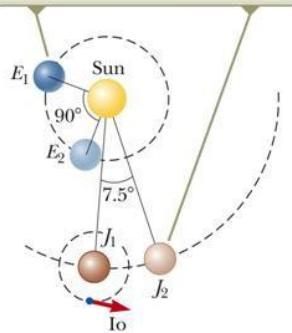

### Phương pháp Fizeau

Phương pháp thành công đầu tiên để đo tốc độ ánh sáng bằng các kỹ thuật thuần túy trên mặt đất được phát triển vào năm 1849 bởi nhà vật lý người Pháp Armand H. L. Fizeau.

Hình 35.2 biểu diễn một sơ đồ đơn giản của thiết bị đo. Nếu d là khoảng cách giữa nguồn sáng (được xem là vị trí của bánh xe) và gương và t là thời gian ánh sáng di chuyển từ bánh xe đến gương thì tốc độ của ánh sáng là $\mathrm { c } = 2 \mathrm { d } / \Delta \mathrm { t }$ .

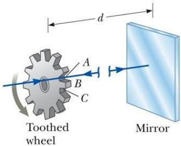  
Hình 35.1: Phương pháp Roemer   
Hình 35.2: Phương pháp Fizeau

Để đo thời gian vận chuyển, Fizeau đã sử dụng một bánh xe răng cưa, chuyển đổi một chùm ánh sáng liên tục thành một loạt các xung ánh sáng. Nếu một xung ánh sáng di chuyển về phía gương và đi qua khe hở tại điểm A trong hình 35.2 và quay trở lại bánh xe tại răng B thì xung phản xạ sẽ không tới được người quan sát. Với tốc độ quay lớn hơn, điểm C có thể di chuyển vào vị trí để cho phép xung phản xạ đi tới người quan sát. Biết khoảng cách d, số răng của bánh xe và tốc độ góc của bánh xe, Fizeau đã xác định được giá trị tốc độ ánh sáng là $3 , \bar { 1 } \times 1 0 ^ { 8 }$ $\mathrm { m } / \mathrm { s }$ .

Các phép đo mang lại giá trị chính xác hơn được chấp nhận hiện tại là 2,997 924 58×108 $\mathrm { m } / \mathrm { s } .$ .

# Gần đúng tia trong quang hình học (quang học tia)

Quang học tia (Ray Optics), còn gọi là quang hình học (Geometric Optics), nghiên cứu sự lan truyền của ánh sáng. Nó sử dụng giả thuyết rằng ánh sáng truyền đi theo đường thẳng trong một môi trường đồng dạng và thay đổi hướng khi gặp bề mặt của một môi trường khác hoặc nếu như tính chất quang học của môi trường là không đồng dạng. Gần đúng tia (Ray approximation) được sử dụng để biểu diễn các chùm sáng. Các tia sáng là những đường thẳng vuông góc với mặt sóng (front wave). Với gần đúng tia, chúng ta giả thiết rằng một sóng ánh sáng truyền đi trong môi trường trên một đường thẳng theo hướng của các tia đó.

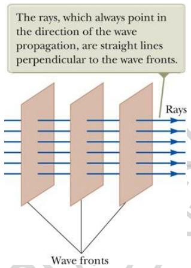

Nếu một sóng gặp một vật cản với bước sóng $\lambda < < \mathtt { d }$ thì sóng đó sẽ xuất phát từ khoảng trống và tiếp tục di chuyển theo một đường thẳng, d là đường kính của khoảng trống. Đây là một gần đúng tốt để nghiên cứu gương, kính, lăng kính ...Các hiệu ứng xảy ra đối với những khoảng trống có kích thước khác nhau.

Hình 35.3: Quang học tia

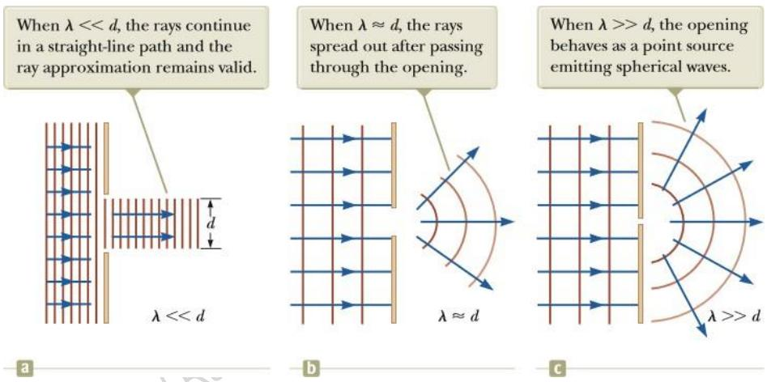  
Hình 35.4: Một sóng phẳng bước sóng  chiếu tới màn chắn có một lỗ trống đường kính d.

35.4

# Sự phản xạ ánh sáng

Một tia sáng (tia tới) di chuyển trong một môi trường khi gặp biên giới với một môi trường thứ hai thì một phần của tia tới sẽ bị phản xạ ngược lại môi trường đầu tiên, có nghĩa là nó sẽ hướng ngược lại môi trường thứ nhất. Đối với các sóng ánh sáng truyền trong không gian ba chiều thì hướng của các tia phản xạ khác với hướng của các tia tới.

Phản xạ gương (specular reflection) là sự phản xạ từ một bề mặt nhẵn. Các tia phản xạ song song với nhau.

Tất cả hiện tượng phản xạ ánh sáng trong sách này đều được giả thiết là phản xạ gương.

Sự phản xạ tràn lan (Diffuse reflection) là sự phản xạ trên một bề mặt thô. Các tia phản xạ truyền đi theo nhiều hướng khác nhau. Một bề mặt được coi là bề mặt thô nếu sự biến đổi bề mặt nhỏ hơn nhiều bước sóng ánh sáng.

# Định luật phản xạ (Law of reflection)

Pháp tuyến là một đường thẳng vuông góc với bề mặt. Nó nằm tại vị trí tia tới đập lên bề mặt. Tia tới tạo với pháp tuyến một góc 1. Tia phản xạ tạo với tia tới một góc $\boldsymbol { \theta _ { 1 } }$ .

Góc phản xạ bằng góc tới :

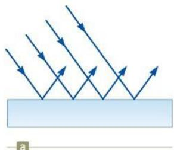

  
Hình 35.5: Sự phản xạ gương

$$
\theta _ { 1 } = \theta _ { 1 }
$$

Mối liên hệ này được gọi là định luật phản xạ.

Tia tới, tia phản xạ và pháp tuyến đều nằm trên một mặt phẳng. Bởi vì sự phản xạ sóng là một hiện tượng phổ biến, thường xảy ra nên chúng ta sẽ đưa ra một mô hình phân tích cho trường hợp này được gọi là mô hình phân tích sóng bị phản xạ (the wave under reflection model).

Câu hỏi 35.1: Trong phim, bạn có thể nhìn thấy diễn viên nhìn vào một chiếc gương và thấy mặt mình trong đó. Có thể nói chắc chắn rằng trong cảnh đó người diễn viên nhìn thấy trong gương a) mặt anh ta b) mặt bạn c) mặt đạo diễn d) camera quay cảnh e) không thể xác định được.

# Bài tập mẫu 35.1: Phản xạ nhiều lần

Hai gương hợp nhau một góc $1 2 0 ^ { \mathrm { o } }$ như hình vẽ. Tia tới chiếu lên gương $\mathbf { M } _ { 1 }$ dưới góc $6 5 ^ { \mathrm { { \circ } } }$ , tia phản xạ hướng đến gương M2. Hãy xác định hướng của tia sáng sau khi phản xạ trên gương $\mathbf { M } _ { 2 }$ . 2025-0

# Giải:

Theo định luật phản xạ, tia phản xạ trên $\mathbf { M } _ { 1 }$ hợp với gương một góc

$$
8 = 9 0 ^ { \circ } - 6 5 ^ { \circ } = 2 5 ^ { \circ }
$$

The incident ray, the reflected ray, and the normal all lie in the same plane, and $\theta _ { 1 } ^ { \prime } = \theta _ { 1 }$

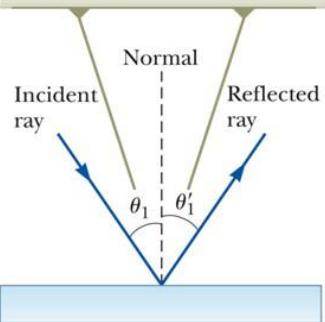

 = 180° - 25° - 120° = 35°

Hình 35.6: Định luật phản xạ   

Hình 35.7: Sự phản xạ nhiều lần

$$
\theta _ { \mathrm { M } 2 } = 9 0 ^ { \circ } - 3 5 ^ { \circ } = 5 5 ^ { \circ }
$$

Tia phản xạ trên gương ${ { \bf { M } } _ { 2 } }$ hợp với pháp tuyến một góc

$$
{ \theta } ^ { \prime } { } _ { \mathrm { M } 2 } = { \theta } _ { \mathrm { M } 2 } = 5 5 ^ { \circ }
$$

# Sự phản xạ ngược (retroreflection)

Giả sử góc hợp giữa hai gương là $9 0 ^ { \mathrm { o } }$ thì chùm tia phản xạ sẽ quay trở về nguồn phát song song với chùm tia tới ban đầu. Hiện tượng này được gọi là sự phản xạ ngược. Có nhiều áp dụng của hiện tượng này như đo khoảng cách tới Mặt Trăng, gương chiếu hậu, tín hiệu giao thông...

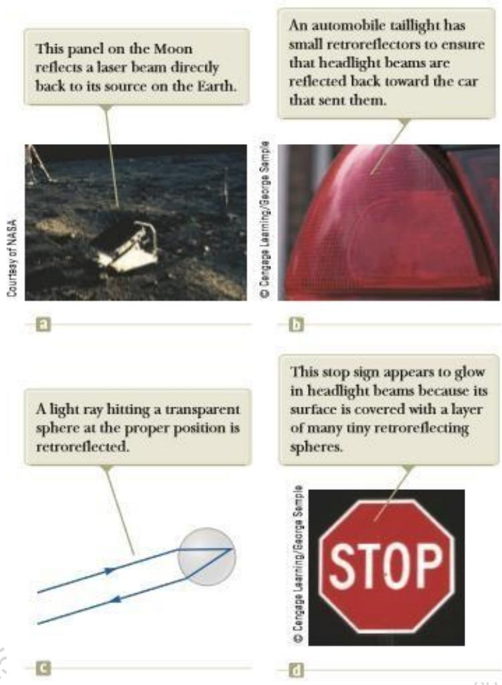  
Hình 35.8: Ứng dụng hiện tượng phản xạ ngược

Vào năm 1969, một bảng gồm nhiều gương phản xạ nhỏ đã được các phi hành gia tàu Apollo 11 đưa lên Mặt trăng (hình 35.8a). Một chùm tia laser từ Trái đất chiếu đến bảng gương này sẽ được phản xạ trực tiếp trở lại chính nó và thời gian di chuyển của nó có thể đo được. Từ đó có thể xác định được khoảng cách từ Trái đất đến Mặt trăng với sai số $1 5 \mathrm { { c m } }$ .

Một ứng dụng hàng ngày khác được tìm thấy trong đèn hậu ô tô. Một phần nhựa của đèn hậu được tạo thành bởi nhiều góc hình khối nhỏ (hình 35.8b) để các chùm đèn pha từ ô tô phía sau chiếu đến sẽ phản xạ lại người lái xe.

Thay vì các góc hình lập phương, các hình cầu nhỏ đôi khi được sử dụng (hình 35.8c). Những quả cầu nhỏ trong suốt được sử dụng trong một vật liệu phủ trên nhiều biển báo đường bộ. Do sự phản xạ ngược từ những quả cầu này, dấu hiệu dừng xe trong hình 35.8d sẽ sáng hơn nhiều so với khi nó chỉ đơn giản là một bề mặt phẳng, sáng bóng. Sự phản xạ ngược cũng được sử dụng cho các tấm phản quang trên giày chạy bộ và quần áo chạy để cho phép người chạy bộ được nhìn thấy vào ban đêm.

# Sự khúc xạ ánh sáng

Khi một tia sáng lan truyền trong một môi trường trong suốt đến gặp mặt phân cách với một môi trường trong suốt khác thì một phần tia tới bị phản xạ và một phần sẽ đi vào môi trường thứ hai.

All rays and the normal lie in the same plane, and the refracted ray is bent toward the normal because $u _ { 2 } < v _ { 1 }$

Tia sáng đi vào môi trường thứ hai này có hướng bị thay đổi. Sự gãy tia sáng này được gọi là khúc xạ (refraction).

Tia tới, tia phản xạ, tia khúc xạ và pháp tuyến đều nằm trong cùng một mặt phẳng. Góc khúc xạ (angle of refraction) phụ thuộc vào vật liệu và góc tới (angle of incidence).

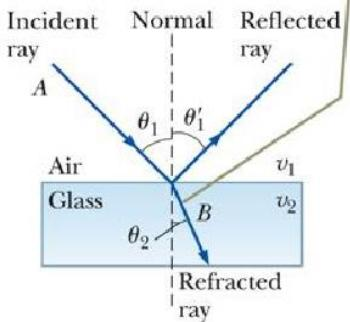

$$
{ \frac { \sin \theta _ { 2 } } { \sin \theta _ { 1 } } } = { \frac { \mathbf { v } _ { 2 } } { \mathbf { v } _ { 1 } } }
$$

$\mathbf { V } _ { 1 }$ là tốc độ ánh sáng trong môi trường thứ nhất và $\mathbf { V } _ { 2 }$ là tốc độ ánh sáng trong môi trường thứ hai. Đường đi của tia sáng qua bề mặt khúc xạ là có thể đảo ngược. Ví dụ một tia sáng truyền từ A đến B thì nếu có một tia xuất phát từ B sẽ đi theo con đường AB để đến A.

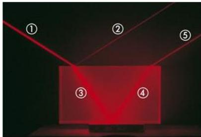  
Hình 35.9: Sự khúc xạ ánh sáng

Câu hỏi 35.2: Trên hình 35.9, tia tới tà tia (1), hãy chỉ ra các tia phản xạ và tia khúc xạ trong những tia sáng 2, 3, 4, 5.

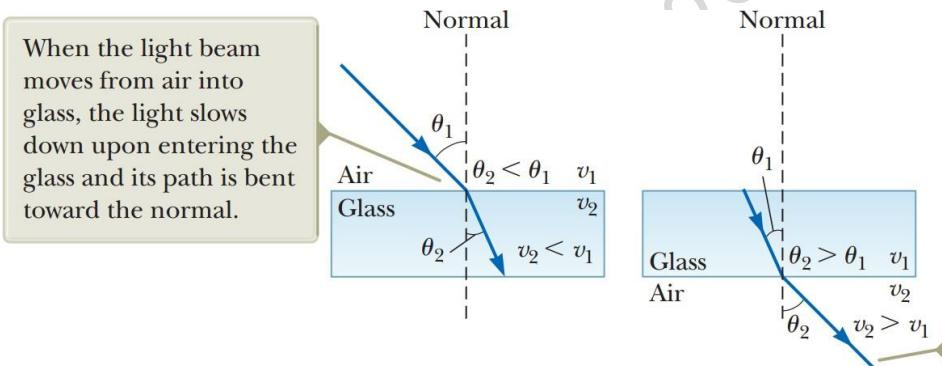  
Hình 35.10: (a) Sự khúc xạ ánh sáng khi đi vào. môi trường có tốc độ nhỏ hơn, a (b). môi trường có tốc độ lớn hơn

When the beam moves from glass into air, the light speeds up upon entering the air and its path is bent away from the normal.

Ánh sáng có thể khúc xạ vào trong một vật liệu mà ở đó tốc độ của nó nhỏ hơn. Góc khúc xạ nhỏ hơn góc tới. Tia sáng bị gập về phía pháp tuyến (hình 35.10.a).

Ánh sáng có thể khúc xạ vào trong một vật liệu mà ở đó tốc độ của nó lớn hơn. Góc khúc xạ lớn hơn góc tới. Tia sáng bị lệch xa khỏi pháp tuyến (hình 35.10.b).

Trong một môi trường, ánh sáng có tốc độ nhỏ hơn trong chân không. Điều đó có thể giải thích như sau. Ánh sáng đập vào một electron. Electron đó có thể hấp thụ ánh sáng, dao động và bức xạ ánh sáng. Sự hấp thụ và phát xạ có thể làm cho tốc độ di chuyển trung bình trong môi trường giảm xuống.

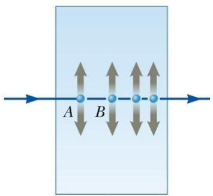  
Hình 35.11: Sự giảm vận tốc của tia sáng khí đi vào môi trường

### Chiết suất - Chỉ số khúc xạ

Tốc độ của ánh sáng trong một vật liệu bất kỳ đều nhỏ hơn tốc độ ánh sáng trong chân không. Chiết suất n của một môi trường được xác định như sau:

$$
n = { \frac { c } { \mathrm { ~ v ~ } } }
$$

Trong đó, c là tốc độ ánh sáng trong chân không, v là tốc độ ánh sáng trong môi trường. Đối với chân không $\mathfrak { n } = 1$ , đối với không khí n cũng được coi là bằng 1. Đối với các môi trường khác, $\mathbf n > 1$ . Chiết suất n là một số không thứ nguyên lớn hơn 1.

# Bảng 35.1: Chiết suất của một số môi trường

# Some Indices of Refraction

TABLE35.1 Indices of Refraction   

<table><tr><td>Substance</td><td>Indexof Refraction</td><td>Substance</td><td>Index of Refraction</td></tr><tr><td>Solids at20°C</td><td></td><td>Liquids at20°C</td><td></td></tr><tr><td>Cubic zirconia</td><td>2.20</td><td>Benzene</td><td>1.501</td></tr><tr><td>Diamond (C)</td><td>2.419</td><td>Carbon disulfide</td><td>1.628</td></tr><tr><td>Fluorite (CaF2)</td><td>1.434</td><td>Carbon tetrachloride</td><td>1.461</td></tr><tr><td>Fusedquartz (SiO2)</td><td>1.458</td><td>Ethylalcohol</td><td>1.361</td></tr><tr><td>Gallium phosphide</td><td>3.50</td><td>Glycerin</td><td>1.473</td></tr><tr><td>Glass,crown</td><td>1.52</td><td>Water</td><td>1.333</td></tr><tr><td>Glass,flint</td><td>1.66</td><td></td><td></td></tr><tr><td>Ice (H2O)</td><td>1.309</td><td>Gasesat0°C,1atm</td><td></td></tr><tr><td>Polystyrene</td><td>1.49</td><td>Air</td><td>1.000293</td></tr><tr><td>Sodium chloride (NaCl)</td><td>1.544</td><td>Carbon dioxide</td><td>1.00045</td></tr></table>

### Tần số ánh sáng giữa hai môi trường