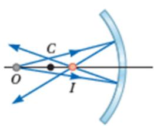
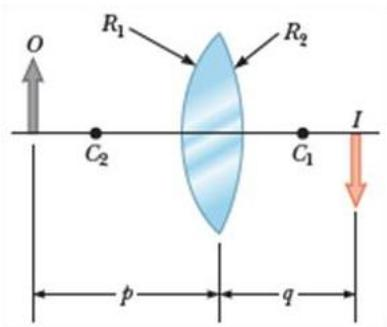

[Type here]   

Nội dung của chương này đề cập đến các ảnh được tạo thành khi chùm tia sáng gặp các bề mặt ngăn cách giữa hai môi trường. Các ảnh được tạo ra do sự phản xạ hoặc khúc xạ gây bởi các bề mặt này. Chúng ta có thể thiết kế các gương và thấu kính để tạo ra các ảnh có các đặc điểm như mong muốn. Trong chương này, ánh

sáng được thể hiện gần đúng như các tia và giả thiết rằng ánh sáng truyền đi theo đường thẳng. Đầu tiên chúng ta xem xét quá trình tạo ảnh bởi các loại gương và thấu kính và xác định vị trí cũng như kích thước của ảnh. Sau đó chúng ta sẽ kết hợp các gương và thấu kính để tạo ra các thiết bị quang học hữu ích như kính hiển vi và kính thiên văn.

## Ảnh tạo bởi gương phẳng

Xét một nguồn sáng điểm đặt ở O trước một gương phẳng và cách gương một đoạn $p$ như trong hình vẽ. Khoảng cách $p$ được gọi là khoảng cách vật. Chùm sáng phân kỳ từ nguồn đến gương và bị phản xạ bởi gương tạo ra chùm tia phản xạ cũng là chùm tia phân kỳ. Đường kéo dài (dường đứt nét trong hình) của chùm tia phản xạ giao nhau $\dot { \mathbf { O } }$ điểm $I .$ Chùm tia phản xạ dường như được phát ra từ điểm $I \overset { \triangledown } { \mathbf { \Vec { O } } }$ sau gương. Điểm $I$ được gọi là ảnh của vật ở O. Khoảng cách $q$ từ $I$ đến gương được gọi là khoảng cách ảnh.

  
Gương Hình 36.1

Một ảnh tạo bởi giao điểm của các tia sáng gọi là ảnh thật và một ảnh tạo bởi đường kéo dài của các tia sáng gọi là ảnh ảo.

Ảnh của một vật tạo bởi gương phẳng luôn là ảnh ảo. Một ảnh thật có thể hứng được trên màn ảnh, còn ảnh ảo thì không.

Để xác định ảnh của một vật có kích thước, ta cần xác định ảnh của tất cả các điểm trên vật. Mặc dù có vô hạn tia sáng đi từ một điểm trên vật, nhưng chúng ta chỉ cần xét hai tia sáng phát ra từ điểm này và vẽ các tia phản xạ tương ứng nhờ định luật phản xạ ánh sáng để xác định vị trí ảnh. Trong hình 36.2, ảnh của điểm $P$ trên vật được xác định nhờ hai tia: tia $P Q$ và PR. Do hai tam giác PQR và $P ^ { \prime } Q R$ bằng nhau nên $P Q = P Q$ , vì vậy $| p | = | q |$ . Do đó ảnh tạo bởi gương phẳng của một vật đối xứng với vật qua gương.

Hình 36.2 cũng chỉ ra rằng chiều cao $h$ của vật bằng với chiều cao h’ của ảnh. Độ phóng đại ảnh của một vật được định nghĩa như sau:

$$
M = { \frac { c h i { \hat { \mathbf { e } } } u c a o { \hat { \mathbf { a } } } n h } { c h i { \hat { \mathbf { e } } } u c a o v { \hat { \mathbf { a } } } t } } = { \frac { h ^ { \prime } } { h } }
$$

  
Hình 36.2

Định nghĩa này cũng sẽ được dùng cho tất cả các loại gương và thấu kính. M sẽ có giá trị dương khi ảnh và vật cùng chiều, $M$ sẽ có giá trị âm khi ảnh và vật ngược chiều. Với gương

[Type here]   

phẳng $M = + 1$ .

Bổ sung câu hỏi 36.1 vì tất cả các câu Quick Quiz đều có khả năng ra đề thi trắc nghiệm.

# Bài tập mẫu 36.1: Các ảnh tạo bởi hai gương.

Hai gương phẳng được đặt vuông góc nhau như hình 36.3 và vật được đặt ở O. Xác định các ảnh được tạo ra.

# Giải:

Ảnh của vật qua gương 1 là $I _ { 1 }$ và qua gương 2 là $I _ { 2 }$ . Ảnh $I _ { 3 }$ là ảnh của $I _ { 1 }$ qua gương 2 và cũng là ảnh của $I _ { 2 }$ qua gương 1.

  
Hình 36.3

Bổ sung phần ứng dụng trong gương chiếu hậu của ô tô (như trong giáo trình gốc).

## Ảnh tạo bởi gương cầu

Có nhiều loại gương cong khác nhau nhưng ở đây chúng ta chỉ khảo sát gương có bề mặt là một phần của mặt cầu (thường là một chỏm cầu), gọi là gương cầu.

Trong hình 36.4, tâm $C$ của mặt cầu chứa gương gọi là tâm của gương, bán kính $R$ của mặt cầu này gọi là bán kính của gương. Đường thẳng qua $C$ và $V$ (V là điểm chính giữa của gương gọi là đỉnh gương) gọi là trục chính của gương. Nếu mặt phản xạ của gương là mặt lõm thì gọi là gương cầu lõm và nếu mặt phản xạ của gương là mặt lồi thì gọi là gương cầu lồi.

  
Hình 36.4

### Gương cầu lõm

Xét một nguồn sáng điểm đặt trước gương tại một điểm $O$ tùy ý trên trục chính (Hình 36.5). Hai tia sáng phân kỳ từ $O$ tới gương cho hai tia phản xạ giao nhau tại ảnh I, rồi chúng phân kỳ từ $I$ như

Các tia phản xạ giao nhau ở các điểm khác nhau trên trục chính.

thể có một nguồn sáng tại đó. Ảnh $I$ này là ảnh thật.

  
Gương   
Hình 36.5

Trong chương này chúng ta chỉ xét các tia sáng đi từ vật và tạo một góc nhỏ với trục chính (điều kiện tương điểm). Tất các tia này đều cho tia phản xạ qua một điểm duy nhất và làm cho ảnh của vật rõ nét. Các tia xa trục chính cho các tia phản xạ hội tụ tại các điểm khác nhau trên trục chính, tạo ra một ảnh mờ (Hình 36.6). Hiệu ứng này gọi

  
Hình 36.6

[Type here] là cầu sai.

[Type here]   

Hình 36.7 cho phép chúng ta tính được khoảng cách ảnh $q$ khi biết khoảng cách vật $p$ và bán kính $R$ của gương. Các khoảng cách $p$ và $q$ là đo từ điểm V. Các tia sáng trong hình xuất phát từ đỉnh của vật: một tia qua $C$ cho tia phản xạ truyền ngược lại và một tia tới gương tại $V$ cho tia phản xạ đối xứng tia tới qua trục chính.

Từ hình vẽ ta có: $t a n \theta = h / p$ và $t a n \theta =$ $- h ^ { \prime } / q$ ( $h ^ { \prime } < 0$ vì ảnh ngược chiều với vật). Độ phóng đại ảnh

$$
M = { \frac { h ^ { \prime } } { h } } = - { \frac { q } { p } }
$$

Mặt khác ta cũng có:

$$
t a n \alpha = \frac { - h ^ { \prime } } { R - q } v \dot { { \mathrm { a } } } t a n \alpha = \frac { h } { p - R }
$$

  
Hình 36.7

Suy ra:

$$
{ \frac { h ^ { \prime } } { h } } = - { \frac { R - q } { p - R } }
$$

Từ 36.2 và 36.3 ta được:

$$
{ \frac { R - q } { p - R } } = { \frac { q } { p } }
$$

Suy ra:

$$
\frac { 1 } { p } + \frac { 1 } { q } = \frac { 2 } { R }
$$

Phương trình 36.4 gọi là phương trình gương cầu.

Nếu vật ở rất xa gương, nghĩa là $p$ rất lớn so với $R$ thì $1 / p \approx 0$ và phương trình 36.4 cho $q \approx R / 2$ . Nghĩa là khi vật $\dot { \mathbf { O } }$ rất xa gương thì ảnh ở vị trí trung điểm của đoạn $C V$ như hình 36.8. Điểm ảnh đặc biệt này gọi là tiêu điểm $F$ và khoảng cách ảnh này gọi là tiêu cự $f ,$ trong đó

$$
f = { \frac { R } { 2 } }
$$

Tiêu cự f là một thông số đặc biệt của gương và được dùng để so sánh gương này với gương khác. Dùng f phương trình 36.4 được viết lại thành:

[Type here]

Hình 36.8

$$
{ \frac { 1 } { p } } + { \frac { 1 } { q } } = { \frac { 1 } { f } }
$$

[Type here]   

### Gương cầu lồi

Hình 36.9 cho thấy ảnh của vật $\dot { \mathbf { O } }$ trước gương là một ảnh ảo và luôn cùng chiều với vật nhưng nhỏ hơn vật.

Các phương trình 36.2, 36.4 và 36.6 sử dụng được cho cả gương cầu lõm và gương cầu lồi, nhưng cần tuân theo quy ước về dấu theo bảng 36.1.

  
Hình 36.9

Bảng 36.1- Quy ước dấu cho gương cầu   

Đối với gương cầu lõm, khi cho vật từ xa gương tiến đến $F$ thì ảnh thật (ngược chiều với vật) sẽ tiến ra xa gương và càng lớn dần. Khi vật ở tại $F ,$ , ảnh $\dot { \mathbf { O } }$ xa vô cùng. Khi vật $\dot { \mathbf { O } }$ giữa $F$ và gương thì ảnh là ảo, cùng chiều với vật, lớn hơn vật và cứ lớn dần lên.

Đối với gương cầu lồi, ảnh luôn là ảo, cùng chiều và nhỏ hơn vật. Khi vật tiến về phía gương thì ảnh lớn dần và tiến về phía gương.

Bổ sung câu hỏi 36.2 và 36.3 vì tất cả các câu Quick Quiz đều có khả năng ra đề thi trắc nghiệm.

# Bài tập mẫu 36.2: Một gương cầu có tiêu cự 10,0 cm.

Một gương cầu có tiêu cự $1 0 { , } 0 \mathrm { c m }$ .

(A) Xác định vị trí và mô tả ảnh của một vật đặt cách gương $2 5 \mathrm { c m }$ .   
(B)Xác định vị trí và mô tả ảnh của một vật đặt cách gương $1 0 \mathrm { c m }$ .

Giải:

(A) Theo công thức gương cầu:

$$
{ \frac { 1 } { p } } + { \frac { 1 } { q } } = { \frac { 1 } { f } } \Rightarrow q = { \frac { p f } { p - f } } = { \frac { 2 5 . 1 0 } { 2 5 - 1 0 } } = 1 6 , 7 { \mathrm { ~ c m } }
$$

Độ phóng đại ảnh:

$$
M = - { \frac { q } { p } } = - 0 { , } 6 6 7
$$

Kết luận: Ảnh thu được là ảnh thật, nhỏ hơn vật và ngược chiều với vật.

(B)

$$
{ \frac { 1 } { p } } + { \frac { 1 } { q } } = { \frac { 1 } { f } } \qquad = > q = { \frac { p f } { p - f } } = { \frac { 1 0 . 1 0 } { 1 0 - 1 0 } } \to \infty
$$

Kết luận: Ảnh ở xa vô cực, nghĩa là chùm tia xuất phát từ vật đến gương cho chùm tia phản xạ song song nhau.

Bổ sung thêm bài tập mẫu 36.4 như trong giáo trình gốc

## Ảnh tạo bởi sự khúc xạ

Xét hai môi trường trong suốt có chiết suất $n _ { 1 }$ và $n _ { 2 }$ và ngăn cách nhau bởi mặt cầu có bán kính $R$ (Hình 36.16). Giả sử nguồn sáng điểm đặt ở $O$ trong môi trường có chiết suất ??1. Một chùm sáng từ $O$ khúc xạ $\dot { \mathbf { O } }$ mặt cầu và hội tụ $\dot { \mathrm { ~ o ~ } } I ,$ , là ảnh của nguồn.

[Type here]

Với một tia sáng từ $O$ khúc xạ qua I (Hình 36.17), định luật Snell cho

$$
n _ { 1 } s i n \theta _ { 1 } = n _ { 2 } s i n \theta _ { 2 }
$$

[Type here]   

Với các góc $\theta$ nhỏ sao cho có thể sử dung gần đúng ???????? $\approx \theta$ (góc $\theta$ tính theo radian) thì phương trình trên có thể viết lại thành

$$
n _ { 1 } \theta _ { 1 } = n _ { 2 } \theta _ { 2 }
$$

Theo hình vẽ ta cũng có

$$
\theta _ { 1 } = \alpha + \beta v \mathsf { \bar { a } } \beta = \theta _ { 2 } + \gamma
$$

Kết hợp các phương trình trên để khử $\theta _ { 1 }$ và $\theta _ { 2 }$ thì thu được

$$
n _ { 1 } \alpha + n _ { 2 } \gamma = ( n _ { 2 } - n _ { 1 } ) \beta
$$

Sử dụng các tam giác trong hình vẽ chúng ta cũng thu được các kết quả

$$
t a n \alpha \approx \alpha = \frac { d } { p } ~ ; t a n \beta \approx \beta = \frac { d } { R } ~ v \dot { \mathrm { a } } ~ t a n \gamma \approx \gamma = \frac { d } { q }
$$

Thay các biểu thức này vào (36.7) rồi rút gọn thì được

$$
{ \frac { n _ { 1 } } { p } } + { \frac { n _ { 2 } } { q } } = { \frac { n _ { 2 } - n _ { 1 } } { R } }
$$

Kết quả này không phụ thuộc ?? (với $\alpha$ nhỏ) nên tất cả các tia sáng đều hội tụ tại cùng một điểm ảnh I.

Để cho thuận tiện khi xét các trường hợp khác nhau, chúng ta gọi phía mặt ngăn cách chứa chùm sáng tới là phía trước và phía bên kia gọi là phía sau. Ngược với ảnh tạo bởi gương, ảnh thực tạo bởi các tia khúc xạ xuất hiện $\acute { \mathbf { O } }$ phía sau mặt ngăn cách nên quy ước về dấu cho $q$ và $R$ sẽ ngược với quy ước dấu cho gương.

# Sự khúc xạ qua các bề mặt phẳng

Nếu bề mặt khúc xạ là phẳng thì $R \to \infty$ và phương trình 36.8 trở thành

[Type here]

[Type here]   

Phương trình (36.9) cho thấy $q$ và $p$ ngược dấu nhau nên ảnh và vật ở cùng phía so với bề mặt khúc xạ như minh họa $\dot { \mathbf { O } }$ hình 36.18, nghĩa là ảnh thu được là ảnh ảo.

Bổ sung câu hỏi 36.4 và 36.5 vì tất cả các câu Quick Quiz đều có khả năng ra đề thi trắc nghiệm.

Bài tập mẫu 36.7: Một con cá đang bơi ở độ sâu d so với mặt nước của một hồ nước.

Một con cá đang bơi ở độ sâu $d$ so với mặt nước của một hồ nước. (A) Một người quan sát con cá theo hướng vuông góc với mặt nước sẽ thấy con cá ở độ sâu biểu kiến bằng bao nhiêu?

# Giải:

Từ phương trình (36.9), suy ra

$$
q = - \frac { n _ { 2 } } { n _ { 1 } } p = - \frac { 1 , 0 0 } { 1 , 3 3 } d = - 0 , 7 5 2 d
$$

$q < 0$ nên ảnh là ảo và người sẽ thấy con cá $\acute { \mathbf { O } }$ độ sâu biểu kiến khoảng bằng 3/4 độ sâu thực sự (Hình 36.20a).

(B) Nếu mặt của người quan sát cách mặt nước một đoạn $d$ thì con cá sẽ thấy mặt người cách mặt nước một đoạn biểu kiến bằng bao nhiêu?

# Giải:

Phương trình 36.9 cho

$$
\begin{array} { r l r } { q = - \frac { n _ { 2 } } { \bf \nabla } ^ { n _ { 1 } } } & { { } } & { p = \bf { \sigma } ^ { - } } \end{array}
$$

1,33   
1,00

Ảnh của mặt người là ảo, nghĩa là ảnh trong môi trường không khí trên mặt nước (Hình 36.20b).

(C) Nếu con cá có chiều cao thực sự là $h$ (đo từ vây trên đến vây dưới của con cá) thì chiều cao biểu kiến của con cá mà người quan sát nhìn thấy bằng bao nhiêu so với h?

Giải:

Ảnh của vây trên và vây dưới của con cá ở các vị trí

$$
q _ { 1 } = - 0 , 7 5 2 d v \dot { \mathsf { a } } q _ { 2 } = - 0 , 7 5 2 ( d + h )
$$

Chiều cao biểu kiến của con cá là

$$
h ^ { \prime } = q _ { 1 } - q _ { 2 } = 0 , 7 5 2 h
$$

Vì vậy chiều cao biểu kiến của con cá chỉ bằng khoảng 3/4 chiều cao thực của con cá.

## Ảnh tạo bởi thấu kính mỏng

Thấu kính thường được dùng để tạo ảnh bởi sự khúc xạ trong các hệ thống quang học của các thiết bị như máy ảnh, kính hiển vi, kính viễn vọng. Với thấu kính, ánh sáng sẽ khúc xạ ở cả hai bề mặt của thấu kính và ảnh do sự khúc xạ ở bề mặt thứ nhất của thấu kính sẽ trở thành vật đối với mặt thứ hai. Chúng ta sẽ xem xét thấu kính dày trước rồi cho độ dày của thấu kính xấp xỉ bằng không để có kết quả cho thấu kính mỏng.

Xét một thấu kính đặt trong không khí, thấu kính có chiết suất $n$ và được giới hạn bởi hai mặt cầu có bán kính là $R _ { 1 }$ và $R _ { 2 }$ như ở hình 36.21. Một vật được đặt ở $O$ sẽ cho ảnh tạo bởi bề mặt 1 ở $I _ { 1 }$ xác định bởi $q _ { 1 }$ thỏa phương trình

$$
{ \frac { 1 } { p _ { 1 } } } + { \frac { n } { q _ { 1 } } } = { \frac { n - 1 } { R _ { 1 } } }
$$

Nếu ảnh là ảo (như trong hình 36.21a) thì $q _ { 1 } < 0$ và nếu ảnh là thật (như trong hình 36.21b) thì $q _ { 1 } > 0$ .

[Type here]

  
Hình 36.21

Đối với bề mặt thứ hai, vật và ảnh xác định bởi $p _ { 2 }$ và $q _ { 2 }$ thỏa phương trình

$$
{ \frac { n } { p _ { 2 } } } + { \frac { 1 } { q _ { 2 } } } = { \frac { 1 - n } { R _ { 2 } } }
$$

Gọi $t$ là độ dày của thấu kính thì $p _ { 2 } = . - q _ { 1 } + t .$ Đối với thấu kính mỏng (bề dày rất nhỏ so với các bán kính là $R _ { 1 }$ và $R _ { 2 }$ ) thì có thể bỏ qua $t$ nên $p _ { 2 } = - q _ { 1 }$ . Phương trình 36.11 trở thành

$$
- \frac { n } { q _ { 1 } } + \frac { 1 } { q _ { 2 } } = \frac { 1 - n } { R _ { 2 } }
$$

Kết hợp hai phương trình 36.10 và 36.12 chúng ta thu được

$$
\frac { 1 } { p _ { 1 } } + \frac { 1 } { q _ { 2 } } = ( n - 1 ) ( \frac { 1 } { R _ { 1 } } - \frac { 1 } { R _ { 2 } } )
$$

Với thấu kính mỏng, gọi $p$ và $q$ lần lượt là khoảng cách ảnh và khoảng cách vật như hình 36.22 thì phương trình 36.13 được viết lại thành

$$
\frac { 1 } { p } + \frac { 1 } { q } = ( n - 1 ) ( \frac { 1 } { R _ { 1 } } - \frac { 1 } { R _ { 2 } } )
$$

Tiêu cự f của một thấu kính mỏng là khoảng cách ảnh của vật ở xa vô cùng. Theo định nghĩa này chúng ta thu được công thức để xác định $f$ là

Hình 36.22

$$
\frac { 1 } { f } = ( n - 1 ) ( \frac { 1 } { R _ { 1 } } - \frac { 1 } { R _ { 2 } } )
$$

Chúng ta có thể viết phương trình 26.14 theo f như sau

$$
{ \frac { 1 } { p } } + { \frac { 1 } { q } } = { \frac { 1 } { f } }
$$

Phương trình 36.16 được gọi là phương trình thấu kính mỏng.

[Type here]

Một thấu kính có hai tiêu điểm $F _ { 1 }$ , $F _ { 2 }$ và hai tiêu điểm này có cùng khoảng cách tới thấu kính. Có hai loại thấu kính: thấu kính hội tụ và thấu kính phân kỳ. Hình 36.23 là một số hình dạng của hai loại thấu kính này.

  
Hình 36.23. (a) Thấu kính hội tụ. (b) Thấu kính phân kỳ

Bảng 36.2 - Quy ước dấu cho thấu kính.

\* Đối với thấu kính phân kỳ

[Type here]

• Tia sáng tới thấu kính song song với trục chính, tia khúc xạ qua thấu kính có phương đi qua tiêu điểm ở trước thấu kính.

• Tia sáng tới có phương qua tiêu điểm ở sau thấu kính, tia khúc xạ qua thấu kính song song với trục chính.

• Tia sáng tới qua tâm của thấu kính cho tia khúc xạ truyền thẳng.

  
Hình 36.22. Ảnh của vật qua thấu kính mỏng

Chỉnh kích thước của hình lớn lên

Đánh số sai hình (không đúng thứ tự)

Bài tập mẫu 36.8: Một thấu kính hội tụ có tiêu cự 10,0 cm.

(A) Một vật đặt cách thấu kính 30,0 cm. Tìm vị trí ảnh và mô tả ảnh. Vẽ hình.

Giải:

Từ phương trình thấu kính

$$
{ \frac { 1 } { p } } + { \frac { 1 } { q } } = { \frac { 1 } { f } }
$$

Suy ra:

$$
q = \frac { p . f } { p - f } = \frac { 3 0 . 1 0 } { 3 0 - 1 0 } = 1 5 c m
$$

Độ phóng đại ảnh:

Ảnh của vật là ảnh thật $\dot { \mathbf { O } }$ sau thấu kính, ngược chiều với vật, cao bằng 0,5 lần vật.

[Type here]

(B) Một vật đặt cách thấu kính 10,0 cm. Tìm vị trí ảnh và mô tả ảnh.

Giải:

Tương tự câu a,

[Type here]

$$
q = { \frac { p . f } { p - f } } = { \frac { 1 0 . 1 0 } { 1 0 - 1 0 } } \quad \Rightarrow \quad q \to \infty
$$

Ảnh ở xa vô cùng so với thấu kính

(C) Một vật đặt cách thấu kính 5,0 cm. Tìm vị trí ảnh và mô tả ảnh. Vẽ hình.

Giải:

Từ phương trình thấu kính, suy ra:

$$
q = { \frac { p . f } { p - f } } = { \frac { 5 . 1 0 } { 5 - 1 0 } } = - 1 0 c m
$$

Độ phóng đại ảnh:

$$
M = - \frac { q } { p } = - \frac { - 1 0 c m } { 5 c m } = 2
$$

Ảnh của vật là ảnh ảo, cùng chiều với vật, cao bằng hai lần vật.

Bổ sung bài tập mẫu 36.9 đối với thấu kính phân kỳ như trong giáo trình gốc

Hệ thấu kính mỏng.

Giả sử vật được đặt trước hệ gồm hai thấu kính. Ảnh của vật được xác định theo trình tự sau:

• Xác định ảnh của vật tạo ra bởi thấu kính thứ nhất như là khi không có thấu kính thứ hai.   
• Ảnh tạo ra bởi thấu kính thứ nhất là vật của thấu kính thứ hai. Nếu vật này ở sau thấu kính thứ hai thì vật này là vật ảo (nghĩa là $p < 0$ ).

Ảnh tạo bởi thấu kính thứ hai là ảnh tạo bởi hệ thống hai thấu kính trên.

Độ phóng đại ảnh của hệ hai thấu kính:

Cách thức xác định ảnh như trên cũng được sử dụng cho hệ gồm nhiều hơn hai thấu kính.

Trong trường hợp hệ hai thấu kính được đặt sát nhau thì ảnh của vật tạo bởi hệ giống như ảnh tạo bởi một thấu kính có tiêu cự f thỏa phương trình:

tr ng đó $f _ { 1 }$ và o $f _ { 2 }$ là tiêu cự

[Type here] của hai thấu kính.

Bài tập mẫu 36.10:

$$
{ \frac { 1 } { f } } = { \frac { 1 } { f _ { 1 } } } + { \frac { 1 } { f _ { 2 } } }
$$

Hai thấu kính hội tụ mỏng có tiêu cự lần lượt là $f _ { 1 } = 1 0 , 0$ ???? và $f _ { 2 } = 2 0 , 0$ ???? được đặt cách nhau $2 0 \mathrm { c m }$ . Một vật ở bên trái thấu kính thứ nhất và cách thấu kính này $3 0 \mathrm { c m }$ . Tìm vị trí và độ phóng đại của ảnh tạo ra bởi hệ hai thấu kính.

# Giải:

Vị trí của ảnh tạo ra bởi thấu kính thứ nhất:

$$
\begin{array} { c } { { q _ { 1 } = \displaystyle { \frac { p _ { 1 } f _ { 1 } } { p \phantom { - } - f } = \displaystyle { \frac { 3 0 . 1 0 } { 3 0 - 1 0 } } } } } \\ { { \phantom { q _ { 1 } = \displaystyle { \frac { p _ { 1 } f _ { 1 } } { 1 } - 1 } } } } \\ { { \phantom { q _ { 1 } = \displaystyle { \frac { p _ { 1 } f _ { 1 } } { p \phantom { - } - f } } } } } \end{array}
$$

Độ phóng đại ảnh này bằng:

$$
M _ { 1 } = - \frac { q _ { 1 } } { p _ { 1 } } = - 0 { , } 5
$$

Vật của thấu kính thứ hai (là ảnh trên) có khoảng cách vật là:

  
Hình 36.30. Ví dụ

$$
p _ { 2 } = t - q _ { 1 } = 2 0 c m - 1 5 c m = 5 c m
$$

Vị trí của ảnh tạo ra bởi thấu kính thứ hai:

$$
q _ { 2 } = { \frac { p _ { 2 } f _ { 2 } } { p \ { \stackrel { - } { F } } \ } } = { \frac { 5 . 2 0 } { 5 \ { - 2 0 } } } = - 6 . 6 7 c m
$$

Độ phóng đại ảnh này bằng:

$$
\begin{array} { c c c } { { q _ { 2 } } } & { { 6 , 6 7 c m } } \\ { { M _ { 2 } = - \displaystyle \frac { } { p _ { 2 } } = - \displaystyle \frac { } { 5 c m } = 1 , 3 3 } } \end{array}
$$

Độ phóng đại của ảnh tạo ra bởi hệ hai thấu kính:

$$
M = M _ { 1 } . M _ { 2 } = - 0 . 6 6 7
$$

Nghĩa là ảnh tạo ra bởi hệ ở trước thấu kính thứ hai, ngược chiều với vật và nhỏ hơn vật.

## Quang sai

Các kết quả phân tích của chúng ta về gương và thấu kính được thực hiện với điều kiện các tia sáng tạo với trục chính một góc nhỏ (điều kiện tương điểm) và thấu kính là mỏng. Dưới các điều kiện này, mọi tia sáng đi từ một nguồn điểm đều hội tụ tại một điểm nên ảnh thu được sẽ sắc nét. Khi các điều kiện này không được thỏa, ảnh sẽ không hoàn hảo.

[Type here]   

Để phân tích chính xác về ảnh, chúng ta cần dùng định luật Snell để xác định sự phản xạ và khúc xạ cho mỗi tia sáng khi bị phản xạ hoặc khúc xạ ở các bề mặt. Theo cách thực hiện này, một điểm trên vật sẽ không tương ứng một điểm ảnh duy nhất và như vậy ảnh bị nhòe. Sự sai lệch của ảnh thực tế so với ảnh dự đoán (nhờ các kết quả thu được $\dot { \mathbf { O } }$ các nội dung trước) được gọi là quang sai.

# Các loại quang sai Cầu sai

Các tia khúc xạ giao nhau ở các điểm khác nhau trên trục chính.

Quang sai loại này xảy ra do tiêu điểm ứng với chùm tia sáng tới càng xa trục chính của thấu kính (hoặc gương) sẽ khác với tiêu điểm ứng với chùm tia sáng tới đi gần trục chính như hình minh họa 36.31 và 36.8. Nguyên nhân gây ra cầu sai là do sử dụng các thấu kính(hoặc gương) có bề mặt hình cầu.

Nhiều máy ảnh có khẩu độ điều chỉnh được để thay đổi cường độ sáng và giảm bớt cầu sai. Bằng cách giảm khẩu độ, ảnh thu được sẽ rõ nét nhưng cần tăng thời gian phơi sáng.

  
Hình 36.31

Đối với gương, để giảm cầu sai thì dùng gương parabol thay cho gương cầu.

# Sắc sai

Các tia với bước sóng khác nhau hội tụ ở các điểm khác nhau.

Sắc sai xảy do chiết suất của môi trường trong suốt phụ thuộc vào bước sóng ánh sáng. Vì vậy khi sử dụng ánh sáng trắng, tia màu tím bị khúc xạ mạnh hơn tia màu đỏ. Điều này dẫn đến kết quả là tiêu cự thấu kính giảm dần đối với ánh sáng có màu từ đỏ đến tím như hình 36.32.

Sắc sai làm mờ ảnh. Để giảm sắc sai, có thể dùng kết hợp một thấu kính hội tụ và một thấu kính phân kỳ làm bằng hai loại thủy tinh có chiết suất khác nhau.

## Máy ảnh

Máy ảnh là một thiết bị quang học đơn giản được mô tả như hình 36.33. Máy ảnh gồm một buồng tối, một thấu kính hội tụ để tạo ra ảnh thật và một bộ phận nhạy sáng (để lưu ảnh) được điều chỉnh ở đúng vị trí của ảnh.

  
Cảm biến   
Hình 36.33: Máy ảnh kỹ thuật số

Máy ảnh sẽ lưu ảnh trên phim hoặc được số hóa để lưu thông tin về ảnh vào một thẻ nhớ (máy ảnh kỹ thuật số). Bằng cách thay đổi khoảng cách từ thấu kính đến bộ phận lưu ảnh cho phù hợp chúng ta sẽ thu được ảnh rõ nét của vật.

Chưa nhắc đến khẩu độ

36.7 Mắt [Type here]

Giống như máy ảnh, mắt hội tụ áng sáng và tạo ra ảnh rõ nét. Mắt điều chỉnh lượng sáng đi vào và tạo ảnh bằng một cơ chế rất phức tạp, chính xác và hiệu quả hơn rất nhiều so với một máy ảnh tinh vi. Mắt thực sự là một kỳ quan sinh lý học.Hình 36.34 trình bày các thành phần cơ bản của mắt.

  
Hình 36.34: Các thành phần cơ bản của mắt

Giác mạc là một màng mỏng cứng và trong suốt cho phép ánh sáng đi vào mắt. Lòng đen điều chỉnh lượng ánh sáng vào mắt bằng cách mở rộng ra khi gặp ánh sáng yếu hoặc thu hẹp lại khi gặp ánh sáng mạnh. Hệ thống giác mạc và thủy tinh thể hội tụ ánh sáng vào võng mạc, nơi đây gồm hàng triệu tế bào cảm thụ ánh sáng. Khi bị ánh sáng kích thích, các tế bào này sẽ gửi các xung về não nhờ các dây thần kinh thị giác giúp chúng ta cảm nhận được vật. Ảnh của vật được cảm nhận rõ khi ảnh này hiện ra ở võng mạc.

Khi cần nhìn một vật, hình dạng của thủy tinh thể được thay đổi (tiêu cự của thủy tinh thể thay đổi theo) cho phù hợp nhờ cơ vòng. Quá trình này gọi là sự điều tiết. Do khả năng điều tiết bị hạn chế nên mắt chỉ thấy rõ vật khi vật được đặt trong một khoảng giới hạn gọi là giới hạn nhìn rõ của mắt. Điểm gần mắt nhất của giới hạn nhìn rõ gọi là điểm cực cận và điểm xa mắt nhất gọi là điểm cực viễn. Người có mắt bình thường thì điểm cực cận cách mắt trung bình khoảng 25 cm và điểm cực viễn ở xa vô cùng. Tuy nhiên khi người càng lớn tuổi khoảng cách từ cực cận đến mắt sẽ tăng.

Có hai loại tế bào cảm thụ ánh sáng: tế bào hình que và tế bào hình nón. Tế bào hình que rất nhạy cảm với ánh sáng giúp chúng ta nhìn trong tối nhưng không phân biệt được màu sắc. Tế bào hình nón nhạy cảm với các bước sóng khác nhau của ánh sáng. Tế bào hình nón được chia thành ba loại: đỏ, xanh lá cây và xanh dương. Nếu hai loại tế bào hình nón đỏ và xanh là cây kích thích đồng thời, bộ não sẽ hiểu là màu vàng. Nếu cả ba loại tế bào hình nón đều bị kích thích đồng thời bởi các ánh sáng đỏ, xanh lá cây và xanh dương thì bộ não sẽ hiểu là màu trắng. cả ba loại tế bào hình nón đều bị kích thích đồng thời bởi các ánh sáng với mọi màu sắc khác nhauthì bộ não cũng sẽ hiểu là màu trắng.

Các tật của mắt Viễn thị

[Type here]   

Người bị viễn thị có thể nhìn rõ các vật ở xa nhưng không thể nhìn rõ các vật ở gần. Điểm cực cận của mắt người bị viễn thị ở xa hơn so với người có mắt bình thường. Khi nhìn các vật ở gần, khả năng khúc xạ của giác mạc và thủy tinh thể không đủ để hội tụ ánh sáng trên võng mạc (Hình 36.37a). Tật này có thể khắc phục bằng cách đeo kính hội tụ (Hình 36.37b) để hội tụ ánh sáng trên võng mạc.

Cận thị

  
Hình 36.38

Người bị cận thị có thể nhìn rõ các vật ở gần nhưng không thể nhìn rõ các vật ở xa. Điểm cực viễn của mắt người bị cận thị không ở xa vô cực (như mắt bình thường) và có thể cách mắt nhỏ hơn 1m. Tiêu cự lớn nhất của mắt cận thị không đủ để tạo ra ảnh rõ nét của vật ở xa trên võng mạc mà ở trước võng mạc nên mắt không nhìn rõ được vật (Hình 36.38a). Tật này có thể khắc phục bằng cách đeo kính phân kỳ (Hình 36.38b) giúp điểm hội tụ ở trên võng mạc.