Quang sóng là một nghiên cứu liên quan đến hiện tượng mà không thể được giải thích một cách đầy đủ bằng quang hình học. Đôi khi được gọi là quang vật lý. Những hiện tượng này bao $\mathrm { g } \dot { \hat { \mathrm { o } } } \mathrm { m }$ : giao thoa, nhiễu xạ, phân cực. Trong chương 18, chúng ta đã nghiên cứu về mô hình giao thoa sóng và thấy rằng sự chồng chất của hai sóng cơ học có thể được tăng cường hay bị triệt tiêu. Trong cấu trúc giao thoa, biên độ của sóng tổng hợp lớn hơn biên độ của sóng thành phần nếu ở đó hiện tượng giao thoa được tăng cường (cực đại giao thoa). Trong khi đó, giao thoa triệt tiêu (cực tiểu giao thoa) có biên độ tổng hợp nhỏ hơn biên độ của sóng lớn hơn (khi có hai nguồn sóng). Sóng ánh sáng cũng giao thoa với nhau. Về cơ bản, tất cả sự giao thoa liên quan đến sóng ánh sáng phát sinh khi điện từ trường tạo thành sự kết hợp các sóng đơn lẻ.

## Giao thoa

### Sơ lược lịch sử

Người đầu tiên đề ra thuyết sóng ánh sáng có sức thuyết phục là nhà vật lý người Hà Lan Christiaan Huygens năm 1678. Ưu điểm lớn của nó là giải thích được những định luật về phản xạ và khúc xạ theo thuyết sóng và ý nghĩa vật lý của chiết suất.

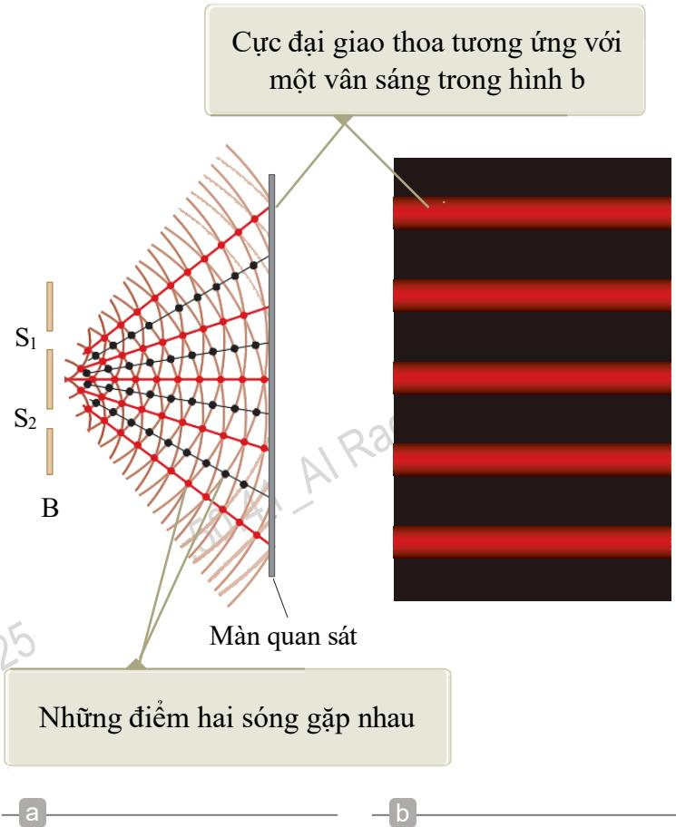

Hình 37.1: (a) Sơ đồ thí nghiệm giao thoa khe Young. Hai khe S1 và $\mathrm { S } _ { 2 }$ được xem như hai nguồn sóng ánh sáng $\mathrm { k } \acute { \mathrm { e t } }$ hợp tạo thành sự giao thoa trên màn chắn (hình vẽ không theo tỷ lệ). (b) Bức tranh giao thoa được phóng to từ màn chắn.

$\mathrm { N } \breve { \bf a } \mathrm { m } 1 8 0 1$ , Thomas Young là người đầu tiên xây dựng lý thuyết sóng của ánh sáng trên một cơ sở thực nghiệm vững vàng khi chứng minh rằng hai sóng ánh sáng chồng lên nhau có thể giao thoa với nhau. Sơ đồ dụng cụ thí nghiệm của Young được thể hiện như trong hình 37.1a. Sóng ánh sáng của máy bay đến một rào chắn B (chứa hai khe $\mathrm { S } _ { 1 }$ và $\mathbf { S } _ { 2 }$ ). Ánh sáng từ hai khe $\mathrm { S } _ { 1 }$ , $\mathrm { S } _ { 2 }$ tạo ra trên màn quan sát thành các dải sáng, tối (được gọi là vân giao thoa) song song và cách đều nhau (hình 37.1b). Khi tia sáng từ hai khe $\mathrm { S } _ { 1 }$ và $\mathrm { S } _ { 2 }$ hội tụ tại một điểm trên màn cùng một lúc thì chúng tăng cường lẫn nhau và tạo thành vân sáng (cực đại giao thoa) tại điểm đó. Ngược lại, khi ánh sáng từ hai khe triệt tiêu nhau tại bất cứ vị trí nào trên màn thì chúng triệt tiêu lẫn nhau và tạo thành vân tối (cực tiểu giao thoa).

### Giao thoa ánh sáng

Hình 37.2 cho thấy hình ảnh giao thoa thực sự tạo nên trên bề mặt của một bể chứa nước. Các sóng được phát đi từ hai quả cầu nối với cùng một máy rung cơ học và dao động lên xuống đối với mặt nước. Hai quả cầu này làm nhiệm vụ giống như hai khe S1 và S2 của hình 37.1, chúng là các nguồn của hai sóng chồng lên nhau để tạo nên hình ảnh giao thoa.

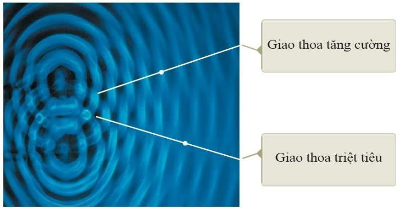  
Hình 37.2: Bức tranh giao thoa thu được từ các sóng nước được tạo ra từ hai nguồn rung trên bề mặt của một bể nước.

Ánh sáng từ hai khe hẹp hình thành một ảnh hiển thị trên màn quan sát. Ảnh gồm một loạt những vạch sáng tối xen kẽ song song nhau được gọi là vân.

• Giao thoa cực đại (tăng cường) sẽ xảy ra nơi mà một vân sáng xuất hiện.   
• Giao thoa cực tiểu (triệt tiêu) sẽ hình thành một vân tối.

# Cực đại giao thoa

Giả sử có hai sóng giao thoa xảy ra tại điểm O. Hai sóng lan truyền cùng một khoảng cách. Do đó, chúng đến cùng pha. Kết quả là, giao thoa xảy ra tại điểm này và một vân sáng trung tâm sẽ được quan sát (hình 37.3a).

Sóng tần số thấp hơn phải lan truyền xa hơn sóng tần số cao để đạt đến điểm P. Sóng tần số thấp hơn sẽ lan truyền một bước sóng lớn hơn. Do đó, các sóng đến cùng pha. Một vân

sáng thứ hai xảy ra tại vị trí này (hình 37.3b).

# Cực tiểu giao thoa

Sóng tần số cao lan truyền xa hơn một nửa bước sóng so với sóng có tần số thấp để đạt đến điểm R. Sóng có tần số cao trùng với đỉnh của sóng có tần số thấp hơn nên giao thoa bị triệt tiêu (hình 37.3c).

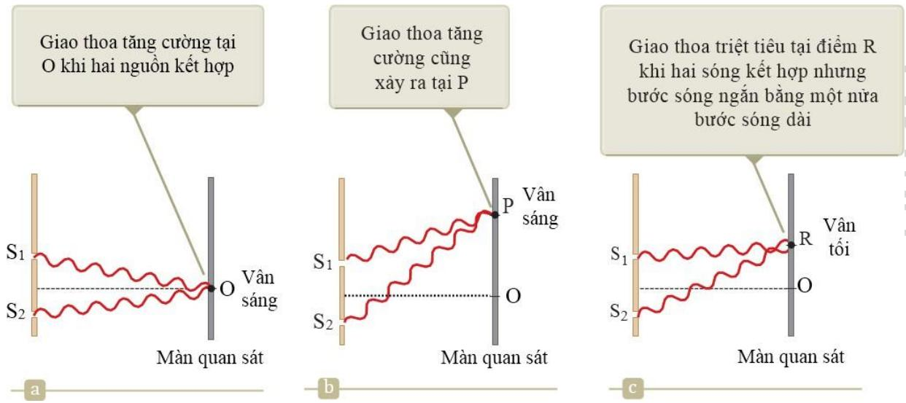  
Hình 37.3: Trong thí nghiệm giao thoa của Young, ánh sáng nhiễu xạ từ hai khe S1, S2 chồng trên nhau tạo nên các điểm giao thoa trên màn quan sát: (a) vân sáng trung tâm, (b) cực đại giao thoa, (c) cực tiểu giao thoa.

Điều kiện giao thoa: Để xuất hiện hình ảnh giao thoa trên màn quan sát từ hai nguồn phải thỏa mãn những điều kiện sau đây:

Các nguồn phát ánh sáng là nguồn kết hợp, có nghĩa là hiệu số pha dao động phải không đổi theo thời gian. Các nguồn sáng đơn sắc, có nghĩa là chúng phải có cùng một giá trị bước sóng.

# Cách tạo các nguồn kết hợp

Ánh sáng từ một nguồn đơn sắc được sử dụng để chiếu vào một rào chắn. Rào chắn chứa hai khe hở (hẹp), có hình dạng rãnh (như thí nghiệm của Young được minh họa trong hình 37.1).

Ánh sáng ló ra từ hai khe sáng tương quan nhau vì một nguồn duy nhất sẽ tạo ra chùm sáng ban đầu, đây là một phương pháp thường được sử dụng.

### Nhiễu xạ qua khe Young

Nếu ánh sáng vẫn lan truyền theo hướng ban đầu sau khi đi qua các khe thì không có hiện tượng giao thoa (hình 37.4a). Theo nguyên lý Huygens, sóng phát ra từ các khe sẽ bị lan

ra (phân kỳ) thành nhiều hướng khác nhau được gọi là nhiễu xạ (hình 37.4b).

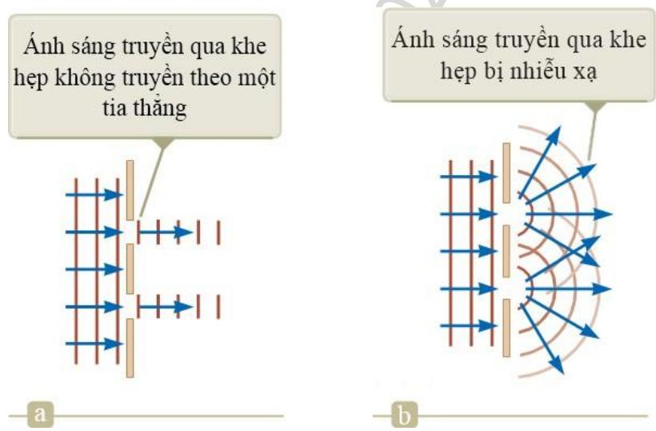  
Hình 37.4: (a) Nếu sóng ánh sáng không lan ra sau khi đi qua các khe hẹp thì không xảy ra hiện tượng giao thoa. (b) Sóng ánh sáng từ hai khe chồng chất lên nhau khi chúng bị nhiễu xạ.

## Thí nghiệm giao thoa khe Young kép

Hình 37.5 cho thấy tia sáng truyền từ hai khe $\mathrm { S } _ { 1 }$ và $\mathrm { S } _ { 2 }$ trên màn B đến một điểm P trên màn quan sát. Màn quan sát được đặt vuông góc với khoảng cách từ màn chắn chứa hai khe một khoảng L. Trục chính được vẽ từ điểm chính giữa hai khe đến màn quan sát, P được xác định bởi góc θ với trục chính, y là khoảng cách từ điểm P đến trục chính.

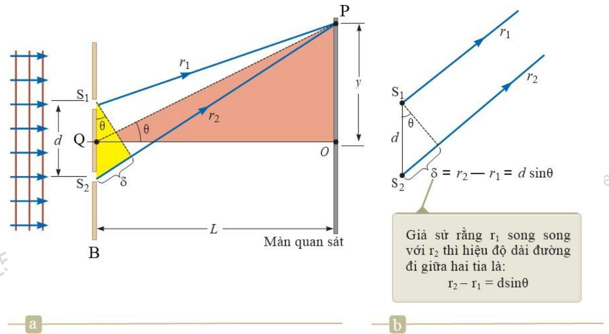

Hình 37.5: (a) Cấu trúc hình học mô tả thí nghiệm giao thoa khe Young (hình vẽ không theo tỷ lệ). (b) Khi L $> > \mathrm { d }$ chúng ta xem gần đúng các tia r1 và r2 song song với nhau khi chúng đến P.

Sóng ánh sáng đi qua $\mathrm { S } _ { 2 }$ cùng pha với sóng ánh sáng đi qua $\mathrm { S } _ { 1 }$ vì hai sóng này là những phần của một sóng duy nhất dọi vào màn chắn B. Tuy nhiên, sóng đến $\mathrm { P }$ từ nguồn $\mathrm { S } _ { 2 }$ không thể cùng pha với sóng đến $\mathrm { P }$ từ $\mathrm { S } _ { 1 }$ vì rằng sóng thứ hai phải đi qua một quãng đường dài hơn sóng thứ nhất.

Điều kiện cực đại giao thoa: Nếu như hiệu quang lộ bằng không hoặc bằng một bội số nguyên lần bước sóng thì các sóng tới sẽ cùng pha với nhau và khi giao thoa sẽ tăng cường nhau, tạo thành cực đại giao thoa (vân sáng).

$$
\delta = \mathrm { d } \sin \theta = \mathrm { m } \lambda , \mathrm { v } \dot { \mathrm { o i } } \mathrm { m } = 0 , \pm 1 , \pm 2 . . . .
$$

Khi: $\mathrm { m } = 0$ , gọi là cực đại bậc không. $\mathbf { m } = \pm 1$ , gọi là cực đại bậc một. $\mathbf { m } = \pm 2$ , gọi là cực đại bậc hai.

Hiệu quang lộ  (đối với giao thoa cực đại) tương ứng với độ lệch pha $2 \pi$ rad. Hiệu quang lộ cùng tỉ lệ với $\lambda$ khi độ lệch pha $\boldsymbol { \Phi }$ bằng $2 \pi$ . Độ lệch pha giữa hai sóng tại $\mathrm { P }$ phụ thuộc vào hiệu quang lộ của chúng: $\delta = \mathbf { r } _ { 2 } - \mathbf { r } _ { 1 } = \mathrm { d } \mathrm { s i n } \theta$

$$
\Phi = \frac { 2 \pi } { \lambda } \delta = \frac { 2 \pi } { \lambda } \mathrm { d s i n } \Theta
$$

biểu thức (37.10) cho thấy, độ lệch pha $\boldsymbol { \Phi }$ phụ thuộc vào góc θ (như trong hình 37.5).

Hình 37.6 là đồ thị của phương trình (37.14) biểu thị cường độ của hình ảnh giao thoa của hai khe như một hàm của dsin . Chú ý rằng từ phương trình (37.14) cường độ biến thiên từ 0 tại vân cực tiểu đến Imax tại vân cực đại.

Với hệ nhiều hơn 2 khe hẹp (hình 37.7), ảnh nhiễu xạ chứa các cực đại chính và cực đại phụ. Đối với N khe hẹp thì cường độ của các cực đại chính lớn hơn $\mathrm { N } ^ { 2 }$ lần so với cường độ của các cực đại tạo bởi 1 khe hẹp. Khi số khe hẹp tăng lên thì cường độ của các cực đại chính cũng tăng và trở nên hẹp hơn, khi đó, các cực đại phụ giảm theo cường độ tương đối so với các cực đại chính. Số cực đại phụ bằng N−2, trong đó N là số khe hẹp. Hiện tượng giao thoa không thể sinh ra hoặc làm biến mất năng lượng mà chỉ đơn thuần là phân bố lại cường độ ánh sáng trên màn quan sát.

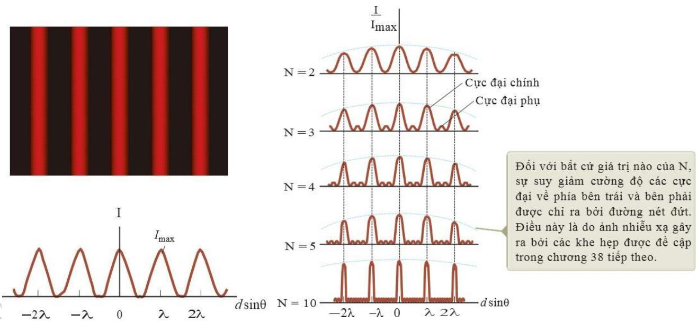  
Hình 37.6: Sự phụ thuộc của cường độ ánh sáng vào hiệu quang lộ giữa

hai sóng khi màn quan sát được đặt rất xa so với khoảng cách giữa hai khe hẹp ( $\mathrm { ~ L ~ } \gg \mathrm { ~ d ~ }$ ).

Hình 37.7: Hình ảnh giao thoa nhiều khe. Khi số khe N tăng lên thì cực đại chính (các đỉnh cao nhất trong mỗi biểu đồ) càng hẹp hơn nhưng vẫn giữ nguyên vị trí và số lượng cực đại phụ tăng lên.

## Gương LLOYD

Trong phương pháp giao thoa khe Young đã tạo được hai nguồn sáng kết hợp xuất phát từ một nguồn duy nhất. Phương pháp đơn giản khác cũng tạo được hai nguồn kết hợp là dùng gương Lloyd. Một nguồn sáng điểm S được đặt gần một gương phẳng và một màn quan sát được đặt ở xa và vuông góc với gương phẳng như hình 37.8. Ánh sáng đến điểm quan sát P trên màn có thể được truyền trực tiếp từ nguồn S hoặc có thể được truyền từ S tới gương, bị phản xạ rồi tới P. Tia phản xạ có thể được xem như xuất phát từ nguồn S’ là ảnh của S qua gương phẳng. S và S’ là hai nguồn sáng kết hợp, tương tự như hai khe Young. Tuy nhiên, những điểm theo lý thuyết (thí nghiệm khe Young) được dự đoán là điểm sáng thì thực tế lại là điểm tối và ngược lại. Điều này chứng tỏ hai nguồn S và S’ ngược pha với nhau.

Xét điểm P’ là giao giữa gương và màn quan sát (P’ cách đều S và S’). Nếu sự khác biệt về quãng đường dẫn đến sự khác biệt về pha thì chúng ta sẽ thấy một vân sáng tại $\mathbf { P } '$ (hiệu quang lộ bằng không), tương ứng với vân sáng trung tâm cho hệ giao thoa hai khe. Thay vào đó, một vân tối được quan sát tại P’. Vậy, khi phản xạ trên bề mặt gương, tia phản xạ ngược pha với tia tới hay quang lộ của tia phản xạ tăng thêm nửa bước sóng.

Xung phản xạ trên một sợi dây đàn hồi trải qua sự thay đổi pha $1 8 0 ^ { \mathrm { o } }$ khi bị phản xạ từ ranh giới của một sợi dây dày hoặc một trụ chống đỡ cố định, nhưng không có sự thay đổi pha khi xung được phản xạ từ sợi dây mãnh hoặc một trụ chống đỡ cố định. Tương tự, một sóng điện từ bị thay đổi pha $1 8 0 ^ { \mathrm { o } }$ (hay $\pi$ rad) khi bị phản xạ từ môi trường có chiết suất lớn hơn chiết suất của môi trường tới (hình 37.9a). Nếu phản xạ từ môi trường có chiết suất nhỏ hơn chiết suất của môi trường tới thì tia phản xạ không bị thay đổi pha (hình 37.9b). Tương tự như một xung trên một sợi dây bị phản xạ từ một cột chống đỡ.

Hinh ành giao thoa hien trèn màn quan sát là sy két hop giüa tia sáng truc tiép (1) và tia phàn xa

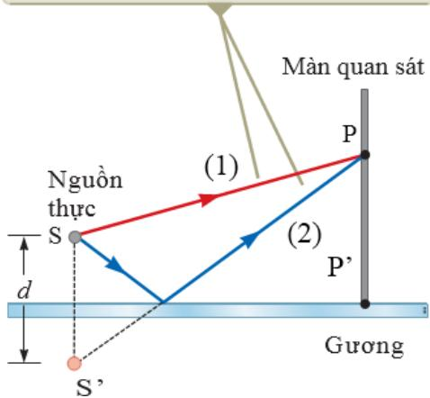  
Hình 37.8: Gương Lloyd. Tia phản xạ bị đổi pha $1 8 0 ^ { \mathrm { o } }$ .

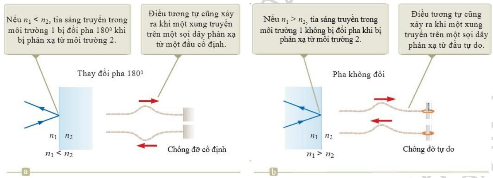

Hình 37.9: So sáng sự phản xạ của sóng ánh sáng và sóng trên dây: (a) Sự biến đổi pha do phản xạ, (b) Sự biến đổi pha do đổi pha.

## Giao thoa của màn mỏng

### Giao thoa do phản xạ

Màu sắc mà chúng ta nhìn thấy được từ ánh sáng mặt trời đập trên một bong bóng xà phòng hoặc trên ván dầu là kết quả giao thoa của sóng ánh sáng phản xạ từ mặt ngoài và mặt trong của một bản mỏng trong suốt.

Giả sử các tia sáng lan truyền trong không khí hầu như vuông góc với hai bề mặt của màng mỏng. Tia phản xạ 1 bị phản xạ tại mặt trên (A) trải qua sự biến đổi pha $1 8 0 ^ { 0 }$ so với tia tới. Tia 2 bị phản xạ tại bề mặt màng dưới (B) không bị thay đổi pha vì chiết suất của không khí nhỏ hơn màng mỏng. Vì vậy, tia phản xạ 1 bị lệch pha $1 8 0 ^ { \mathrm { o } }$ so với tia phản xạ 2, khi đó hiệu quang lộ giữa chúng là $\lambda _ { \mathrm { n } } / 2$ . Tuy nhiên, tia phản xạ 2 di chuyển xa hơn tia phản xạ 1

Các yếu tố ảnh hưởng tới sự giao thoa:

• Pha có thể sẽ bị đảo ngược trong sự phản xạ • Hiệu quang lộ

# Chú ý:

• Các điều kiện sẽ thỏa mãn nếu môi trường ở bề mặt trên của màng mỏng giống với môi trường ở bề mặt dưới của nó. Nếu có những môi trường khác nhau, những điều kiện này sẽ đúng nếu chiết suất cả hai môi trường nhỏ hơn n.

• Nếu màng mỏng giữa hai môi trường, một môi trường có chiết suất nhỏ hơn màng mỏng và môi ó chiết suất cao hơn chiết suất màng mỏng, những điều kiện cho giao thoa cực đại và giao thoa cực tiểu sẽ bị đảo ngược.

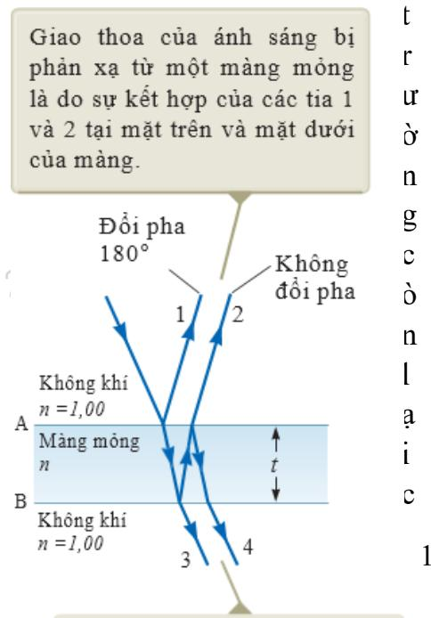  
Caác tia 3 và 4 tao hieu ing giao thoa do ánh sáng truyèn

Với các vật liệu khác nhau trên 2 mặt của màng, có thể có một sự biến đổi pha $1 8 0 ^ { 0 }$ tại cả hai bề mặt hoặc không bề mặt nào, do đó phải kiểm tra hiệu quang lộ và biến đổi pha.

Hình 37.10: Giao thoa qua màn mỏng.

  
Hình 37.11: Giao thoa qua màng mỏng − bong bóng xà phòng.

(a) Một màn mỏng dầu nổi trên mặt nước được thể hiện bằng các hoa văn màu sắc khi ánh sáng trắng tương tác với màn mỏng, (b) Giao thoa qua bong bóng xà phòng, màu sắc có được là do sự giao thoa giữa các tia sáng phản chiếu từ bên trong và bên ngoài bề mặt của màn xà phòng.

### Vân tròn Newton

Một phương pháp khác để quan sát giao thoa sóng ánh sáng là đặt một thấu kính phẳng − lồi lên trên tấm thủy tinh phẳng như hình 37.12a. Với sự sắp xếp này, lớp không khí giữa tấm thủy tinh và mặt cong của thấu kính tạo thành một bản mỏng không khí có bề dày thay đổi. Điểm quan sát M nằm trên bề mặt cong của thấu kính, cách quang trục của thấu kính một khoảng r và cách tấm thủy tinh một khoảng d. Nếu bán kính mặt cong R của thấu kính rất lớn so với khoảng cách r và hệ thống được quan sát từ phía trên, gần với trục chính của thấu kính thì ảnh giao thoa quan sát được là các vòng sáng, tối xen kẽ nhau (vân giao thoa quan sát bằng ánh sáng phản xạ với cách bố trí như hình 37.12b là những đường tròn đồng tâm). Ảnh giao thoa này được Newton khám phá ra nên được gọi là vân tròn Newton.

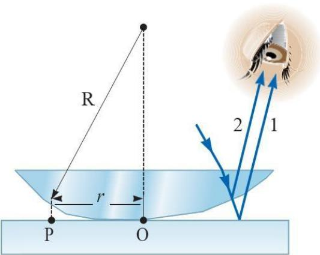

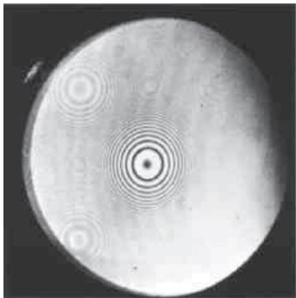

Hình 37.12: Vân tròn Newton: (a) Thí nghiệm, (b) Hình ảnh vân tròn.

Các vân tròn sáng, tối quan sát được là do hiệu ứng giao thoa của hai chùm tia phản xạ 1 và 2. Chùm tia 1 phản xạ tại bề mặt cong của thấu kính. Chùm tia này không bị đổi pha, vì chiết suất của không khí nhỏ hơn chiết suất của chất làm thấu kính. Chùm tia 2 phản xạ tại bề mặt tấm thủy tinh có chiết suất lớn hơn chiết suất không khí nên pha được tăng thêm $1 8 0 ^ { 0 }$ , hay quang lộ tăng thêm $\lambda / 2$ . Bán kính của các vân sáng, vân tối phụ thuộc vào bán kính mặt cong R và bước sóng $\lambda$ .

Vân sáng: bề dày của lớp không khí giữa hai bản thỏa mãn:

$$
\mathrm { d } = \left( 2 \mathrm { m } + 1 \right) _ { 4 } ^ { \underline { { \lambda } } }
$$

Vân tối: bề dày của lớp không khí giữa hai bản thỏa mãn:

$$
\mathbf { d } = \mathbf { m } { \frac { \lambda } { 2 } }
$$

Các vân giao thoa là các vòng tròn tại tâm O $( \mathrm { d } { < } { < } \mathrm { R } )$ . Bán kính của các vân tối thỏa mãn điều kiện:

$$
{ \bf r } ^ { 2 } = { \bf R } ^ { 2 } - \left( { \bf R } - { \bf d } { \bf \Delta } \right) ^ { 2 } \approx 2 { \bf R } { \bf d }
$$

Thay thế: d ${ \bf d } _ { \mathrm { { m } } } = { \bf m } { \frac { \lambda } { 2 } }$ vào biểu thức (37.21), ta được:

$$
{ \bf r } _ { \mathrm { m } } \approx \sqrt { { \bf m } \lambda { \bf R } / { \bf n } }
$$

Chiến thuật giải bài toán với giao thoa của màng mỏng: Khi giải bài toán giao thoa của màng mỏng cần chú ý một số vấn đề sau đây:

Đặc điểm: Nhận dạng nguồn sáng, vị trí của người quan sát.

Phân loại: Nhận dạng màng mỏng gây ra giao thoa

Phân tích:

Loại giao thoa xuất hiện được xác định bởi mối quan hệ giữa tỷ lệ bước sóng phản chiếu bên trên và bên dưới bề mặt của màng mỏng.

• Độ lệch pha thay đổi dựa vào hiệu quang lộ hoặc các biến đổi pha xảy ra nếu như phản xạ. Cả hai nguyên nhân cần được xem xét khi xác định giao thoa cực đại và giao thoa cực tiểu.

• Xác định chiết suất của môi trường để xác định các phương trình đúng.

Kiểm tra: Kiểm tra kết quả tính toán cuối cùng xem có hợp lý hay không, ý nghĩa vật lý như thế nào.

## Giao thoa $\mathbf { k } \hat { \mathbf { e } }$ Michelson

Giao thoa $\mathrm { k } \acute { \mathrm { e } }$ được phát minh bởi nhà Vật lý người Mỹ A. A. Michelson. Giao thoa kế chia ánh sáng làm hai phần và sau đó tái kết hợp các phần để tạo thành ảnh giao thoa. Thiết bị có thể được sử dụng để đo bước sóng hoặc độ dài với độ chính xác cao.

Sơ đồ nguyên lý: Một tia sáng được chia thành hai tia bởi gương M0. Gương được bố trí nghiêng $4 5 ^ { 0 }$ so với chùm tia tới. Gương đóng vai trò là bộ tách chùm tia, nó truyền qua một nửa tia sáng và phản xạ phần còn lại. Tia phản xạ đi về phía gương M1 (gương M1 có thể di chuyển được) cách $\mathrm { M } _ { 0 } \ \mathrm { m } \hat { \mathrm { ~ } } { \mathrm { t ~ } }$ đoạn L1. Tia sáng truyền qua đi về phía gương M2 cách M0 một đoạn L2. Sau khi phản xạ trên M1 và M2, các tia phản xạ tái kết hợp tại M0 và hình thành ảnh giao thoa. Ảnh giao thoa được quan sát bởi kính ngắm Telescope.

Nguyên lý hoạt động: Điều kiện giao thoa cho hai tia sáng được xác định bởi hiệu quang lộ giữa chúng. Khi dịch chuyển gương $\mathbf { M } _ { 1 }$ song song với trục chính của nó và dọc theo tia sáng ra xa một đoạn $\lambda / 4$ thì hiệu quang lộ của tia phản xạ tăng thêm  2 và hệ vân giao thoa dịch chuyển đi một nửa khoảng vân. Độ dài của bước sóng ánh sáng được đo bằng cách đếm số vân dịch chuyển cho mỗi lần dịch gương M1.

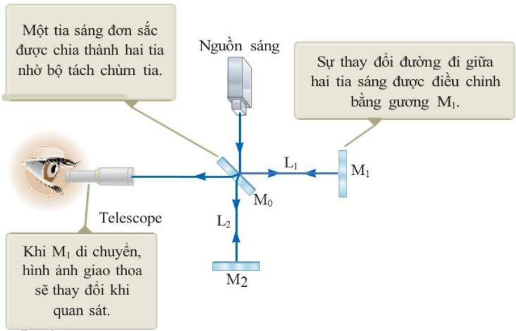  
Hình 37.14: Giao thoa kế Michelson cho thấy đường đi của ánh sáng bắt đầu từ nguồn sáng. Gương M0 tách ánh sáng thành 2 chùm phản xạ từ các gương $\mathbf { M } _ { 1 }$ và M2 trở về $\mathrm { M } _ { 0 }$ và sau đó đến kính ngắm Telescope.

Ứng dụng: Giao thoa kế Michelson đã được sử dụng để bác bỏ ý tưởng Trái đất chuyển động xuyên qua một vòng trời. Một số ứng dụng hiện đại, bao gồm: Quang phổ hồng ngoại biến đổi Fourier (FTIR) và đài quan sát sóng hấp dẫn dùng giao thoa $\mathrm { k } \acute { \mathrm { e } }$ Laser (LIGO).

Quang phổ hồng ngoại biến đổi Fourier: Được dùng để tạo một phổ với độ phân giải cao trong một khoảng thời gian rất ngắn. Kết quả là một tập hợp các dữ liệu liên quan cường độ sáng phụ thuộc vào vị trí của gương. Nó được gọi là ảnh giao thoa (interferogram). Ảnh giao thoa có thể được phân tích bởi máy tính để cung cấp tất cả các thành phần của bước sóng. Quá trình này được gọi là biến đổi Fourier.

• Đài quan sát sóng hấp dẫn dùng giao thoa kế Lazer: Thuyết tương đối rộng tiên đoán sự tồn tại của sóng hấp dẫn. Theo lý thuyết của Einstein, trọng lực tương đương với một biến đổi của không gian, những biến đổi này có thể lan truyền trong không gian. Thiết bị LEGO được thiết kế để phát hiện sự biến dạng tạo bởi một rung động khi nó băng qua gần Trái đất. Giao thoa $\mathrm { k } \acute { \mathrm { e } }$ sử dụng chùm tia lazer với hiệu quang lộ khoảng vài km. Tại điểm cuối của một nhánh của giao thoa $\mathbf { k } \acute { \hat { \mathbf { e } } } ,$ , một gương được gắn vào một con lắc lớn. Khi một sóng hấp dẫn đi qua, con lắc di chuyển và tạo ảnh giao thoa tạo bởi các chùm tia lazer từ hai nhánh sẽ thay đổi.

Nhờ giao thoa kế của Michelson mà ta so sánh được chiều dài của mét mẫu so với bước sóng ánh sáng, là cơ sở để định nghĩa mét qua bước sóng ánh sáng. Cũng chính nhờ giao thoa kế của mình, năm 1881, Michelson đã tiến hành thí nghiệm chứng tỏ rằng vận tốc ánh sáng trong chân không là bằng nhau và bằng ${ \mathrm { c } } = 3 . 1 0 ^ { 8 } { \mathrm { m } } / { \mathrm { s } }$ trong tất cả các hệ qui chiếu quán tính – là một cơ sở thực nghiệm để Einstein xây dựng lý thuyết tương đối năm 1907.

Hình 37.15: Đài quan sát sóng hấp dẫn bằng giao thoa kế Lazer (LIGO) gần Richland, Washington. Chú ý hai nhánh vuông góc của giao thoa kế Michelson.

# Tóm tắt chương 37

Định nghĩa

Giao thoa ánh sáng xuất hiện khi hai sóng (hoặc nhiều hơn) chồng lấp lên nhau tại một điểm nhất định. Hình ảnh giao thoa được quan sát khi các nguồn phát ánh sáng là nguồn kết hợp và có bước sóng xác định.

Cường độ tại một điểm trong mô hình giao thoa hai khe được xác định:

$$
\mathrm { I } = \mathrm { I } _ { \mathrm { m a x } } \cos ^ { 2 } \left( { \frac { \pi \mathrm { d } \sin \theta } { \lambda } } \right)
$$

trong đó, Imax là cường độ cực đại trên màn quan sát.

# Phân tích mô hình và giải quyết vấn đề

Thí nghiệm giao thoa khe Young đóng vai trò như một nguyên mẫu cho hiện tượng giao thoa liên quan đến bức xạ điện từ. Trong thí nghiệm này, hai khe cách nhau một khoảng a được chiếu sáng bởi nguồn ánh sáng đơn sắc. Điều kiện cho vân sáng (cực đại giao thoa) là:

Điều kiện cho vân tối (cực tiểu giao thoa) là:

$$
\delta = \mathrm { d } \mathrm { s i n } \theta = \left( \mathrm { m } + \frac { 1 } { 2 } \right) \rho , \mathrm { v } \Dot { \mathrm { o i } } \mathrm { m } = 0 , \pm 1 , \pm 2 . . . .
$$

# Câu hỏi lý thuyết chương 37

1. Một chùm ánh sáng đơn sắc có bước sóng 500 nm chiếu đến hai khe hẹp cách nhau $2 \mathrm { m }$ . Góc tạo bởi vân sáng thứ hai so với vân sáng trung tâm là?

(a) 0,05 rad (b) 0,025 rad (c) 0,1 rad (d) 0,25 rad (e) 0,01 rad

2. Một màn bong bóng xà phòng được dựng thẳng đứng trong không khí và quan sát hiện tượng phản xạ ánh sáng như trong hình 37.16. Giải thích tại sao màn bong bóng xà phòng tối ở phần đầu?

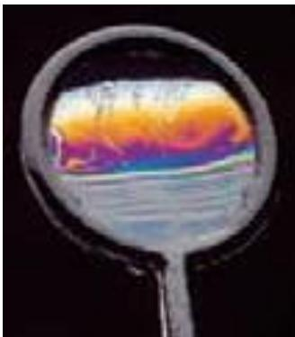  
Hình 37.16

3. (a) Trong thí nghiệm giao thoa khe Young, tại sao chúng ta dùng ánh sáng đơn sắc? (b) Nếu sử dụng áng sáng trắng thì hệ vân giao thoa trên màn sẽ thay đổi như thế nào?

4. Giải thích tại sao khi đặt hai đèn pin $\mathrm { g } \dot { \hat { \mathrm { a } } } \mathrm { n }$ nhau thì không tạo ra hệ vân giao thoa trên màn quan sát?

# Bài tập chương 37

37.1. Người ta thực hiện giao thoa ánh sáng đơn sắc bằng hai khe Young cách nhau $0 { , } 3 2 \mathrm { m m }$ với ánh sáng có bước sóng $\lambda = 5 0 0 \mathrm { n m }$ . Hãy xác định số cực đại giao thoa có được khi thay đổi góc lệch $- 3 0 ^ { 0 } < \Theta < 3 0 ^ { 0 }$ .

ĐS: 641 cực đại

37.2. Trong thí nghiệm Young về hiện tượng giao thoa ánh sáng, nguồn sáng đơn sắc có bước sóng $5 3 0 ~ \mathrm { n m }$ . Khoảng cách giữa hai khe hẹp $\mathrm { S } _ { 1 }$ và $\mathbf { S } _ { 2 }$ là $0 { , } 3 ~ \mathrm { m m }$ . Vân giao thoa được hứng trên một màn ảnh đặt sau hai khe, song song với chúng và cách chúng $2 \textrm { m }$ . Xác định khoảng cách giữa vân tối thứ nhất và thứ hai.

ĐS: 3,53 mm

37.3. Chiếu một chùm tia lazer vào hai khe hẹp cách nhau $0 { , } 2 ~ \mathrm { m m }$ , khoảng cách từ hai khe đến màn quan sát là $5 \mathrm { m }$ . Xảy ra hiện tượng giao thoa trên màn quan sát. Nếu góc hợp bởi vân sáng trung tâm và vân sáng bậc 1 là $0 { , } 1 8 1 ^ { 0 }$ thì giá trị bước sóng của nguồn sáng lazer là bao nhiêu.

ĐS: 632 nm

37.4. Thí nghiệm giao thoa khe Young được thực hiện với đèn lazer argon (màu xanh lam). Khoảng cách giữa hai khe là $0 { , } 5 \mathrm { m m }$ , khoảng cách từ hai khe đến màn quan sát là $^ { 3 , 3 \mathrm { ~ m ~ } }$ . Vân sáng đầu tiên cách vân sáng trung tâm một khoảng $\dot { \mathrm { ~ a ~ } } 3 , 4 \mathrm { ~ m m }$ . Hãy xác định giá trị bước sóng của ánh sáng lazer argon.

ĐS: 515 nm

37.5. Tại sao trường hợp sau đây không thể xảy ra? Hai khe hẹp trên một tấm kim loại đặt cách nhau 8 mm. Một chùm sóng cực ngắn được chiếu vuông góc đến tấm kim loại đi qua hai khe và được hứng ảnh trên màn quan sát. Cho biết bước sóng của bức xạ là $1 , 0 0 \mathrm { \ : \vec { c m } \pm 5 \% } ,$ , nhưng chúng ta muốn đo chính xác hơn giá trị của bước sóng. Di chuyển đầu dò sóng cực ngắn dọc theo đường thẳng song song với màn quan sát để khảo sát hình ảnh giao thoa, chúng ta đo được vị trí của vân sáng bậc 1, từ đó xác định được chính xác giá trị bước sóng của nguồn bức xạ.

ĐS: $\sin \theta _ { \mathrm { s i n g } } = 1 , 2 5$ (không thể xảy ra)

37.6. Hai khe Young $\mathrm { S } _ { 1 } \mathrm { S } _ { 2 }$ cách nhau một khoảng d được chiếu bằng ánh sáng có bước sóng là $6 2 0 ~ \mathrm { { n m } }$ . Vân sáng đầu tiên (tính từ vân sáng trung tâm) được quan sát tại một góc $1 5 ^ { 0 }$ so với phương ngang. Xác định khoảng cách d giữa hai khe.

ĐS: $2 4 0 \mu \mathrm { m }$

37.7. Thực hiện thí nghiệm Young về giao thoa ánh sáng với các thông số sau: khoảng cách giữa hai khe $0 , 1 \mathrm { m m }$ , ánh sáng được chiếu có bước sóng $5 8 9 \mathrm { n m }$ , khoảng cách từ hai khe đến màn quan sát $4 \mathrm { m }$ .

(a) Xác định hiệu quang lộ của hai sóng tới từ mỗi khe tại vị trí vân sáng bậc ba.

(b) Xác định hiệu quang lộ của hai sóng tới từ mỗi khe tại vị trí vân tối thứ ba.

ĐS: (a) $2 4 0 \mu \mathrm { m }$ , (b) $1 { , } 4 7 \mu \mathrm { m }$

37.8. Một khe sáng đơn sắc S phát ra ánh sáng có bước sóng 442 nm chiếu vào hai khe S1 và $\mathrm { \bf S } _ { 2 }$ cách nhau $0 { , } 4 \mathrm { m m }$ . Xác định khoảng cách xa nhất đặt màn quan sát, sao cho vị trí của hai vân tối đối diện với hai khe và chỉ có một vân sáng ở giữa chúng.

ĐS: 36,2 cm

37.9. Hai loa của một thùng nổ cách nhau $3 5 \ \mathrm { c m }$ . Một bộ dao động điện từ tạo ra dao động cho hai loa với cùng tần số là $2 \mathrm { k H z }$ . Xác định góc được tạo bởi đường thẳng vuông góc tại trung điểm của đường nối hai loa để người quan sát nghe được âm có cường độ lớn nhất, nhỏ nhất? Biết tốc độ truyền âm là $3 4 0 \mathrm { m / s }$ .

ĐS: âm có cường độ lớn nhất: $0 ^ { 0 }$ ; 29,10; $^ { 7 6 , 3 ^ { 0 } }$ âm có cường độ nhỏ nhất: 14,10, 46,80

37.10. Một nhà kho ven sông có một số cánh cửa nhỏ hướng ra bờ sông. Hai trong số các của này được mở (hình 37.17). Các bức tường của nhà kho được lót bằng vật liệu hấp thụ âm. Hai người đứng cách hai cánh cửa tại khoảng cách $\mathrm { L } = 1 5 0 \mathrm { m }$ . Người A đứng dọc theo một đường thẳng đi qua điểm giữa hai cánh cửa, người B đứng cách người A một khoảng $\mathrm { y } = 2 0 \mathrm { m }$ . Một chiếc tàu ven sông phát ra tiếng còi. Để người A nghe được âm thanh to và rõ, còn người B thì không nghe được âm thì khoảng cách giữa hai cánh cửa mở phải bằng bao nhiêu? Biết bước sóng của nguồn âm là $3 \mathrm { m }$ và giả sử người B đang đứng ở vị trí cực tiểu đầu tiên.

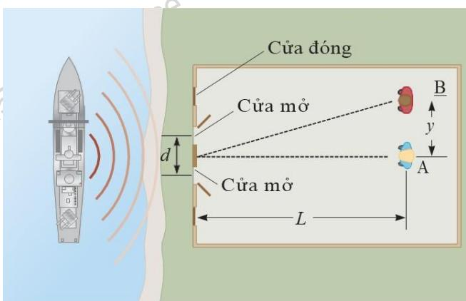

ĐS: 11,3 m

37.11. Thực hiện thí nghiệm giao thoa qua hai khe (hình 37.18) với: $\mathrm { d } = 0 , 1 5 \mathrm { m m }$ , $\mathrm { L } = 1 4 0$ cm, $\lambda = 6 4 3 ~ \mathrm { n m }$ , $_ \mathrm { y } = 1 \mathrm { , } 8$ cm. Hãy xác định:

(a) Hiệu quang lộ  của sóng từ hai khe tại điểm P.

(b) Mối quan hệ giữa hiệu quang lộ và bước sóng .

(c) Tại điểm P là điểm cực đại, cực tiểu hay trạng thái trung gian? Giải thích?

ĐS: (a) $1 { , } 9 3 \ \mu \mathrm { m }$ , (b) $\delta = 3 \lambda$ , (c) cực đại

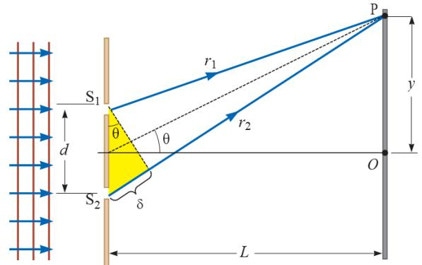  
Hình 37.18

37.12. Thực hiện giao thoa ánh sáng như hình 37.19 (hình vẽ không theo tỷ lệ): ${ \mathrm { L } } = 1 , 2 { \mathrm { m } }$ , $\mathbf { d } = 0 , 1 2 \mathrm { ~ m m }$ , $\lambda = 5 0 0 \mathrm { n m }$ . Hãy xác định độ lệch pha giữa hai sóng tới P khi:

(a) $\theta = 0 { , } 5 ^ { 0 }$ (b) $\mathrm { y } = 5 \mathrm { m m }$

(c) Giá trị của θ là bao nhiêu khi độ lệch pha là 0,333 rad ?

(d) Giá trị của θ là bao nhiêu khi hiệu quang $1 \hat { \varrho } \ \delta = \lambda / 4$

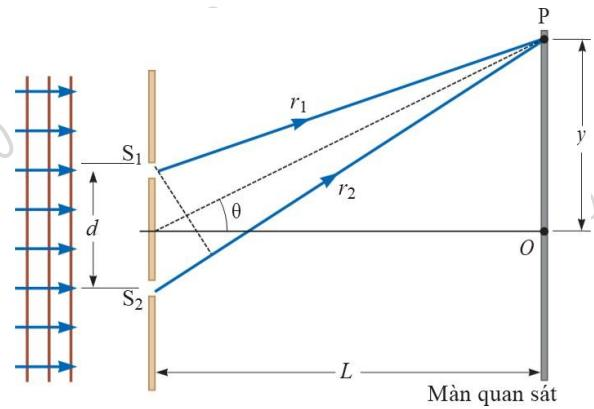  
Hình 37.19

ĐS: (a) 13,2 rad, (b) 6,28 rad, (c) $1 { , } 2 7 { . } 1 0 ^ { - 2 }$ , (d) $5 , 9 7 . 1 0 ^ { - 2 }$

37.13. Các tia sáng $\mathrm { k } \acute { \mathrm { e } } \mathrm { t }$ hợp có bước sóng $\lambda$ chiếu vào hai khe hẹp cách nhau một khoảng d, với góc tới $\theta _ { 1 }$ theo phương ngang (hình 37.20). Các tia ló ra khỏi hai khe $\mathrm { m } \hat { \mathrm { 0 t } }$ góc $\theta _ { 2 }$ tương ứng.

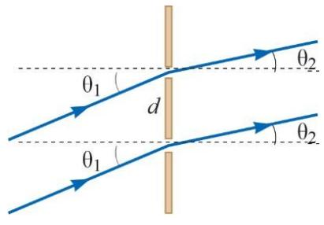  
Hình 37.20

Hình ảnh giao thoa cực đại tạo thành bởi các tia sáng được hứng trên màn quan sát đặt cách hai khe khá xa. Hãy chứng minh rằng góc $\theta _ { 2 }$ được xác định như sau:

$$
\begin{array} { r } { \Theta _ { _ 2 } = \sin ^ { - 1 } \left( \sin \Theta _ { _ 2 } - \displaystyle \frac { \operatorname* { m a x } } { \operatorname* { d } } \right) } \\ { \qquad \quad \Big ( \qquad \mathrm { ~ } \mathrm { ~ } \mathrm { ~ } \mathrm { ~ } \mathrm { ~ } \mathrm { ~ } \mathrm { ~ } \mathrm { ~ } \mathrm { ~ } \mathrm { ~ } \mathrm { ~ } \mathrm { ~ } \mathrm { ~ } \mathrm { ~ } \mathrm { ~ } \mathrm { ~ } \mathrm { ~ } \mathrm { ~ } \mathrm { ~ } \mathrm { ~ } \mathrm { ~ } \mathrm { ~ } \mathrm { ~ } \mathrm { ~ } \mathrm { ~ } \mathrm { ~ } \mathrm { ~ } \mathrm { ~ } \mathrm { ~ } \mathrm { ~ } \mathrm { ~ } \mathrm { ~ } \mathrm { ~ } \mathrm { ~ } \mathrm { ~ } \mathrm { ~ } \mathrm { ~ } \mathrm { ~ } \mathrm { ~ } \mathrm { ~ } \mathrm { ~ } \mathrm { ~ } \mathrm { ~ } \mathrm { ~ } \mathrm { ~ } \mathrm { ~ } \mathrm { ~ } \mathrm { ~ } \mathrm { ~ } \mathrm { ~ } \mathrm { ~ } \mathrm { ~ } \mathrm { ~ } \mathrm { ~ } \mathrm { ~ } \mathrm { ~ } \mathrm { ~ } \mathrm { ~ } \mathrm { ~ } \mathrm { ~ } \mathrm { ~ } \mathrm { ~ } \mathrm { ~ } \mathrm { ~ } \mathrm { ~ } } \mathrm { ~ }  \end{array}
$$

37.14. Hai khe hẹp đặt cách nhau $0 , 1 8 \mathrm { m m }$ . Hình ảnh giao thoa được hứng trên màn chắn cách hai khe một khoảng $8 0 ~ \mathrm { c m }$ bằng ánh sáng có bước sóng $6 5 6 { , } 3 \ \mathrm { n m }$ . Hãy xác định phần trăm cường độ cực đại tại khoảng cách $_ { \mathrm { y } } = 0 \mathrm { , 6 }$ cm so với cường độ cực đại tại vân sáng trung tâm.

ĐS: $9 6 { , } 8 \%$

37.15. Cường độ ánh sáng tại một điểm giao thoa hai khe trên màn là $6 4 { , } 0 \%$ giá trị cực đại.

(a) Xác định độ lệch pha nhỏ nhất (tính bằng rad) giữa hai nguồn.

(b) Biểu diễn độ lệch pha dưới dạng hiệu quang lộ đối với ánh sáng có bước sóng 486,1 nm.

ĐS: (a) 1,29 rad, (b)  = r − r = dsin  = $\displaystyle { \delta = { \bf r - r _ { \omega } } = \mathrm { d s i n } \theta = \frac { \phi \lambda } { 2 \pi } }$

37.16. Một màng bong bóng xà phòng (chiết suất $\mathbf { n } = 1 , 3 3 ,$ ) bay trong không khí, lớp bong bóng dạng hình cầu, bề dày 120 nm.

(a) Bước sóng của ánh sáng nhìn thấy được phản xạ mạnh nhất là?

(b) Xác định độ dày nhỏ nhất của màng xà phòng (lớn hơn 120 nm) để ánh sáng phản xạ là lớn nhất với cùng giá trị bước sóng.

ĐS: (a) 638 nm, (b) 360 nm

37.17. Cho một màng mỏng có chiết suất là 1,5. Chiếu một ánh sáng có bước sóng trong khoảng $0 , 4 \mu \mathrm { m } \leq \lambda \leq 0 , 7 5 \mu \mathrm { m }$ , góc chiếu tới là $0 ^ { 0 }$ . (a) Tìm độ dày t nhỏ nhất sao cho để ngoài ánh sáng màu vàng $( \lambda = 0 , 5 8 \mu \mathrm { m } )$ ) cho cực đại giao thoa còn có giao thoa của một ánh sáng $\lambda$

khác. (b) Xác định giá trị $\lambda$ ở câu (a).

ĐS: (a) $0 { , } 4 8 3 ~ \mu \mathrm { m }$ , (b) $0 { , } 4 1 4 \mu \mathrm { m }$

37.18. Một màng dầu mỏng $_ \mathrm { n } = 1 , 2 5 ,$ ) nằm trên mặt ván trơn và ẩm ướt. Ánh sáng đỏ có bước sóng $6 4 0 ~ \mathrm { n m }$ và ánh sáng xanh có bước sóng $5 1 2 \mathrm { n m }$ bị phản xạ mạnh nhất. Coi các tia sáng được chiếu vuông góc đến màng mỏng. Xác định bề dày của lớn màng dầu?

ĐS: 512 nm

37.19. Một vật liệu có chiết suất 1,3 được sử dụng để làm lớp phủ chống sự phản xạ trên bề mặt thủy tinh $( \mathtt { n } = 1 , 5 )$ ). Tính độ dày tối thiểu của lớp vật liệu này để sự phản xạ từ ánh sáng có bước sóng $5 0 0 \mathrm { n m }$ là nhỏ nhất.

ĐS: 96,2 nm

37.20. Một lớp màng mỏng $\mathrm { M g F } _ { 2 }$ có chiết suất 1,38 được sử dụng để phủ trên ống kính của máy ảnh.

(a) Xác định ba bước sóng dài nhất được tăng cường.

(b) Có bất kỳ bước sóng ánh sáng nào trong quang phổ có thể nhìn thấy được không?

ĐS: (a) $2 7 6 \mathrm { n m }$ , $1 3 8 \mathrm { n m }$ , ${ 9 2 , 0 \mathrm { n m } }$ , (b) không (thuộc vùng tử ngoại)

37.21. Hình 37.21 cho thấy mặt thấu kính có bán kính cong R, đặt trên một bản thủy tinh phẳng và được dọi từ trên bằng ánh sáng có bước sóng . Hình cho thấy các vân giao thoa tròn (gọi là vân tròn Newton) xuất hiện, tương ứng với độ dày thay đổi $\mathrm { { e _ { k } } }$ của lớp không khí giữa thấu kính và bản thủy tinh.

(a) Tìm bán kính r của các vân sáng, thừa nhận $\frac { \mathrm { r } } { \mathrm { R } } { \ll } 1$ (b) Chứng minh rằng hiệu bán kính các vân sáng liên tiếp cho bởi biểu thức:

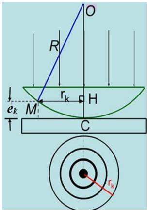  
Hình 37.21

$$
\Delta \mathbf { r } = \mathbf { r } _ { \mathbf { k } + 1 } - \mathbf { r _ { \mathbf { \lambda } \mathbf { k } } } \approx \frac { 1 } { 2 } \sqrt { \frac { \lambda \mathbf { R } } { \mathbf { k } } }
$$

(c) Chứng minh rằng diện tích giữa các vân sáng liên tiếp cho bởi biểu thức:

$$
\mathbf { A } = \pi \lambda \mathbf { R } , \mathbf { v } \acute { \mathbf { o } } \mathbf { i } \mathbf { k } \gg 1
$$

(chú ý rằng diện tích này không phụ thuộc vào k)