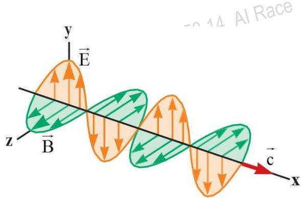

Sóng cơ (mechanical waves) đòi hỏi sự hiện diện của một môi trường trong khi đó sóng điện từ (electromagnetic waves) có thể truyền qua chân không. Các phương trình của Maxwell dựa vào lý thuyết sóng điện từ truyền trong không gian với vận tốc của ánh sáng. Herzt xác nhận những tiên đoán của Maxwell là đúng khi ông đã tạo ra và phát hiện ra sóng điện từ vào năm 1887. Sóng điện từ được tạo ra bằng cách dao động điện tích. Sóng phát ra từ những điện tích có thể dò được tại những nơi rất xa. Sóng điện từ vừa mang năng lượng, vừa mang động lượng.

## Dòng điện dịch và dạng tổng quát của định luật Ampere

### Sơ lược lịch sử

Nhà vật lý lý thuyết Scottish (1831−1879) đã phát triển lý thuyết sóng điện từ của ánh sáng, lý thuyết về động lực của khí và giải thích bản chất màu sắc tự nhiên và chu kỳ của sao Thổ.

Ông đã xây dựng thành công hệ phương trình về trường điện từ và được biết đến với tên gọi hệ phương trình Maxwell. Maxwell là người đã làm được một việc rất quan trọng là khái quát hóa định luật Ampere, đây là một đóng góp rất quan trọng.

Khả năng toán học đáng gờm kết hợp với cái nhìn sâu sắc tuyệt vời cho phép Maxwell dẫn đầu trong nghiên cứu về điện từ và lý thuyết động học. Ông chết vì ung thư trước khi ông 50 tuổi.

  
James Clerk Maxwell (1831–1879)

### Sự mở rộng định luật Ampere do Maxwell thực hiện

Trong chương 30, chúng ta đã sử dụng định luật Ampere để phân tích từ trường tạo bởi dòng điện:

$$
\oint \overrightarrow { \mathbf { B } } \cdot \mathrm { d } \overrightarrow { \mathbf { S } } = \mu _ { 0 } \mathbf { I }
$$

Trong phương trình này, tích phân đường qua bất kỳ đường cong khép kín có dòng điện chạy qua, dòng điện dẫn chạy qua vòng ampere được xác định: $\boldsymbol { \mathrm { I } } = \mathrm { d } \boldsymbol { \mathrm { q } }$ dt (Trong phần này, chúng ta sử dụng thuật ngữ “dòng điện dẫn” để chỉ dòng điện được mang bởi các hạt mang điện trong dây dẫn để phân biệt nó với một loại dòng điện khác sẽ được giới thiệu sau). Biểu thức trên chỉ đúng nếu điện trường là tĩnh, tức không phụ thuộc vào thời gian. Maxwell đã ghi nhận giới hạn của định luật Ampere và thay đổi biểu thức này trong trường hợp điện

trường thay đổi theo thời gian.

Xét một tụ điện được tích điện như hình 34.1. Khi xuất hiện dòng điện dẫn thì điện tích trên bản dương của tụ thay đổi nhưng không có dòng điện nào tồn tại trong khe hỡ giữa hai bản tụ vì không xuất hiện các hạt mang điện. Bây giờ hãy xét hai mặt $\mathrm { S } _ { 1 }$ và $\mathbf { S } _ { 2 }$ được giới hạn bởi cùng một đường P, định luật Ampere nói rằng xung quanh đường dẫn P này phải bằng $\mu { _ 0 } \mathrm { I } _ { ; }$ , trong đó I là cường độ dòng điện tổng cộng qua bất kỳ bề mặt nào được bao bọc bởi đường P.

Khi đường dẫn P được coi là ranh giới của $\mathrm { S } _ { 1 }$ thì $\oint \overrightarrow { \mathbf { B } } \cdot \mathbf { d } \overrightarrow { \mathbf { s } } = \mu _ { 0 } \mathbf { I } ,$ trong đó I là dòng điện dẫn qua mặt S1. Khi đường dẫn P được coi là ranh giới của $\mathbf { S } _ { 2 }$ thì $\mathrm { \oint \vec { B } \cdot d s ^ { \prime } } = 0$ , bởi vì không có dòng điện dẫn qua mặt $\mathbf { S } _ { 2 }$ . Do đó, một trường hợp mâu thuẩn có thể xảy ra từ sự gián đoạn của dòng điện. Maxwell đã giải quyết vấn đề này bằng cách đưa ra một số hạn bổ sung $\dot { \mathbf { O } }$ phía bên phải của định luật Ampere. Số hạn cộng thêm được gọi là dòng điện dịch (displacement current, Id).

Dòng dièn dān chi di qua $\mathrm { S } _ { 1 } .$ dièu này trái nguoc vói dinh luàt Ampere khi mò phóng $\mathrm { m } { \hat { \mathrm { ~ } } } ^ { \dagger }$ dòng dién dàn qua $\mathrm { S } _ { 2 }$

Hình 34.1: Hai mặt phẳng $\mathrm { S } _ { 1 }$ và $\mathrm { S } _ { 2 }$ gần một bản của tụ điện được giới hạn bởi đường P.

$$
\begin{array} { c } { \displaystyle { \mathrm {  ~ I ~ } \equiv \varepsilon ^ { \mathrm {  ~ \ d ~ } } } } \\ { \displaystyle { \mathrm {  ~ d ~ } \mathrm {  ~ \Omega ~ } _ { 0 } \frac { \partial \mathrm {  ~ \Omega ~ } } { \partial \mathrm {  ~ \Gamma ~ } } } } \end{array}
$$

trong đó, $\varepsilon _ { \scriptscriptstyle 0 }$ là hằng số điện môi và $\Phi _ { \mathrm { E } } \equiv _ { . }$ E dA là thông lượng electron xuyên qua bề mặt được giới hạn bởi đường tích phân.

Khi tụ điện đang được tích điện (hoặc phóng điện), sự thay đổi điện trường giữa hai bản cực của tụ được coi là tương đương với dòng điện dẫn trong dây. Do đó, biểu thức dòng điện dịch (34.1) được thêm vào dòng điện dẫn trong định luật Ampere, để đi tới một định luật dạng hoàn thiện hơn mà $\dot { \mathbf { O } }$ đó từ trường được tạo bởi dòng điện dẫn và điện trường thay đổi theo thời gian (time-varying electric field). Biểu thức tổng quát của định luật Ampere (nhiều người gọi là định luật Ampere−Maxwell.

$$
\oint \overrightarrow { \mathbf { B } } \cdot \mathbf { d } \overrightarrow { \mathbf { s } } = \mu _ { 0 } \left( \mathrm { I } + \mathrm { I } _ { \mathrm { d } } \right) = \mu _ { 0 } \mathrm { I } + \mu _ { 0 } \varepsilon _ { 0 } \frac { \mathrm { d } \Phi _ { \mathrm { E } } } { \mathrm { d t } }
$$

Hình $3 4 . 2 \mathrm { m } \hat { \mathrm { 0 } }$ tả sự thay đổi điện trường E tồn tại giữa các bản của tụ điện tạo ra một thông lượng electron. Thông lượng electron qua bề mặt S được xác định: $\Phi _ { \mathrm { { E } } } \equiv \int \overrightarrow { \mathrm { E } } \cdot \mathrm { d } \overrightarrow { \mathrm { A } } = \mathrm { E } \mathbf { A }$ , trong đó A là diện tích của các bản của tụ điện và E là độ lớn của điện trường đều giữa hai

bản tụ: $\mathrm { E = q / { \bigl ( } \varepsilon _ { 0 } A { \bigr ) } }$ , trong đó q là điện tích trên bản cực dương của tụ điện, A là diện tích bản cực. Khi đó, thông lượng electron:

Dien trròng giüa các ban tao ra mot thong lrong electron qua bè mǎt S.

$$
\Phi _ { \mathrm { { E } } } = \mathrm { E A } = { \frac { \mathrm { { q } } } { \varepsilon _ { \mathrm { { 0 } } } } }
$$

Do đó, dòng điện dịch qua mặt S là:

$$
\begin{array} { r } { \mathrm { ~ I ~ } = \varepsilon \ \mathrm { d } \Phi _ { \mathrm { E } } \ = \frac { \mathrm { d } \mathbf { q } } { \mathrm { d } \varepsilon } } \end{array}
$$

Phương trình (34.3) cho thấy dòng điện dịch trong khe giữa các bản của tụ có cùng một giá trị. Bằng cách xét bề mặt S, chúng ta có thể xác định dòng điện dịch khi nguồn của từ trường trên bề mặt giới hạn. Dòng điện dịch có nguồn gốc vật lý từ điện trường thay đổi theo thời gian. Điểm chính của phần này là từ trường được tạo ra bởi dòng điện dẫn và điện trường thay đổi theo thời gian.

  
Hình 34.2: Khi dòng điện dẫn tồn tại trong các dây dẫn, sự thay đổi điện trường tồn tại giữa các bản của tụ điện.

Câu hỏi 34.1: Trong một mạch RC, tụ điện bắt đầu phóng điện.

(i) Trong quá trình phóng điện, khoảng không gian giữa hai bản của tụ điện. Xuất hiện:

(a) Dòng điện dẫn nhưng không có dòng điện dịch (b) Dòng điện dịch nhưng không có dòng điện dẫn (c) Cả hai dòng điện dẫn và dòng điện dịch (d) Không xuất hiện dòng điện

(ii) Trong cùng một vùng không gian, xuất hiện:

(a) Điện trường nhưng không có từ trường (b) Từ trường nhưng không có điện trường (c) Cả hai điện và từ trường (d) Không xuất hiện điện trường hay từ trường

# Bài tập mẫu 34.1: Dòng điện dịch trong tụ điện

Một điện áp thay đổi hình sin được áp vào hai đầu một tụ điện như trong hình 34.3.

Điện dung của tụ điện là $\mathrm { C } = 8 { , } 0 0 \mu \mathrm { F }$ , tần số của điện áp là $\mathrm { f } = 3 , 0 0 \mathrm { k H z }$ , biên $\mathtt { d } \hat { \mathbf { \rho } }$ điện áp là $\Delta \mathrm { V } _ { \mathrm { m a x } } = 3 0 { , } 0 \mathrm { V } .$ . Hãy xác định dòng điện dịch giữa hai bản của tụ điện.

# Giải:

Khái niệm: Hình 34.3 biểu diễn sơ đồ mạch điện trong trường hợp này. Hình 343 cho thấy chi tiết của tụ điện và điện trường giữa hai bản tụ.

Phân loại: Chúng ta xác đinh kết quả bằng cách sử dụng các phương trình được đưa ra trong phần này, vì vậy ví dụ này được xem như điển hình.

Tần số góc của nguồn:

  
Hình 34.3 (bài tập 34.1)

$$
\mathfrak { o } = 2 \pi \mathrm { f } = 2 \pi . \left( 3 , 0 0 . 1 0 ^ { 3 } \right) = 1 , 8 8 . 1 0 ^ { 4 } \mathrm { s } ^ { - 1 }
$$

Sự khác biệt về điện áp qua tụ điện như một hàm theo thời gian:

$$
\Delta \mathbf { v _ { c } } = \Delta \mathbf { V _ { m a x } } \ \mathrm { s i n o t } \ = 3 0 , 0 \mathrm { s i n } \Big ( 1 , 8 8 . 1 0 ^ { 4 } \ \mathrm { t } \Big )
$$

Điện tích của tụ điện: $\mathsf { q } = \mathbf { C } \Delta \mathbf { v } _ { \mathrm { c } }$

Từ phương trình (34.3) về định nghĩa dòng điện dịch:

$$
\mathrm { \Pi _ { \overset { . } { d } } } = \mathrm { \frac { d q } { d t } } = \mathrm { \frac { d } { d t } } \left( \mathrm { C \Delta { v } _ { \overset { . } { c } } } \right) = \mathrm { C } \mathrm { \frac { d } { d t } } \left( \Delta \mathrm { V _ { \overset { . } { m a x } } } \mathrm { s i n } \mathrm { \omega _ { \overset { . } { m } } } \right) = { \omega } \mathrm { C } \Delta \mathrm { V } \mathrm { c o s o t }
$$

Thay số:

$$
\begin{array} { r l } { \dot { \mathrm { \vert \Phi _ { d } ~ } } } & { { } = \left( 1 , 8 8 . 1 0 ^ { 4 } \mathrm { s ^ { - 1 } } \right) \left( 8 , 0 0 . 1 0 ^ { - 6 } \mathrm { C } \right) \left( 3 0 , 0 \mathrm { V } \right) \mathrm { c o s } \left( 1 , 8 8 . 1 0 ^ { 4 } \mathrm { t } \right) \ = \ 4 , 5 1 \mathrm { c o s } \left( 1 , 8 8 . 1 0 ^ { 4 } \mathrm { t } \right) \ \mathrm { s ^ { - 1 } } } \end{array}
$$

## Phương trình Maxwell và phát minh của Hertz

Trong lý thuyết thống nhất của Maxwell về điện từ cho rằng, sóng điện từ là một hệ quả tự nhiên của những định luật cơ bản của điện từ học giống như các định luật Newton về chuyển động đối với cơ học. Tuy nhiên cũng có một sự khác nhau rất quan trọng. Einstein đưa ra thuyết tương đối hẹp vào năm 1905, khoảng 200 năm sau thì xuất hiện các định luật Newton và 40 năm sau thì xuất hiện các phương trình Maxwell. Sau khi có lý thuyết tương đối, các định luật Newton phải thay đổi rất nhiều khi tốc độ tương đối đạt đến giá trị xấp xỉ vận tốc ánh sáng. Tuy nhiên, đối với phương trình Maxwell thì không cần thay đổi gì, chúng hoàn toàn phù hợp với thuyết tương đối hẹp.

Các phương trình Maxwell đại diện cho các định luật về điện và từ tính mà chúng ta đã bàn luận, nhưng chúng có hệ quả rất quan trọng. Để đơn giản, các phương trình Maxwell áp dụng cho không gian trống, tức là không có bất cứ vật liệu điện môi hoặc từ tính nào sẽ

được trình bày.

### Phương trình Maxwell 1 − Định luật Gauss

Tổng thông lượng điện (electric flux) qua bề mặt kín bất kỳ bằng tổng điện tích bên trong bề mặt kín chia cho 0. Định luật này liên quan đến sự phân bố điện tích để tạo ra điện trường.

$$
\oint \overrightarrow { \mathrm { E } } \cdot \mathrm { d } \overrightarrow { \mathrm { A } } = \frac { { \mathfrak { q } } } { \mathfrak { E } _ { 0 } }
$$

### Phương trình Maxwell 2 − Định luật Gauss trong từ trường

Từ thông (magnetic flux) toàn phần qua một mặt kín bằng không, có nghĩa là số đường sức từ đi vào phải bằng số đường sức từ đi ra khỏi một mặt kín. Điều này có nghĩa là các đường sức từ không thể bắt đầu hoặc kết thúc tại bất kỳ điểm nào. Nếu điều này đúng thì những đơn cực từ (isolated magnetic monopoles) sẽ được tìm thấy trong tự nhiên. Tuy nhiên, cho đến nay vẫn chưa tìm thấy được.

$$
\oint \overrightarrow { \mathbf { B } } \cdot \mathbf { d } \overrightarrow { \mathbf { A } } = 0
$$

### Phương trình Maxwell 3 − Định luật Faraday về cảm ứng

Phương trình này dùng để mô tả việc tạo ra điện trường bằng cách làm cho từ trường biến thiên theo thời gian. Theo điện động lực học, tích phân đường của điện trường dọc theo một đường cong khép kín bằng tốc độ biến thiên của từ thông gửi qua diện tích bề mặt được giới hạn bởi đường cong đó. Một hệ quả của định luật Faraday là tồn tại dòng điện dẫn trong vòng dây dẫn đặt trong một từ trường biến thiên theo thời gian.

$$
\oint \vec { \mathrm { E } } \cdot \mathrm { d } \vec { \mathrm { s } } = - \frac { \mathrm { d } \Phi _ { \mathrm { B } } } { \mathrm { d t } }
$$

### Phương trình Maxwell 4 − Định luật Ampere-Maxwell

Định luật Ampere-Maxwell dùng để mô tả việc tạo ra từ trường bằng điện trường biến thiên và dòng điện. Tích phân đường của từ trường dọc theo một đường cong khép kín bằng tổng của 0 nhân với dòng điện và 00 nhân với tốc độ biến thiên từ thông gửi qua diện tích bề mặt được giới hạn bởi đường cong đó:

### Lực Lorentz

Tại một điểm trong không gian tồn tại điện trường và từ trường, lực tác dụng lên một

hạt mang điện tích q có thể được tính toán từ điện và từ trường của hạt như sau:

$$
\vec { \mathrm { F } } = \mathbf { q } \overrightarrow { \mathrm { E } } + \mathbf { q } \overrightarrow { \mathrm { v } } \times \overrightarrow { \mathrm { B } }
$$

Những phương trình của Maxwell và lực Lorentz mô tả đầy đủ về tương tác điện từ trước đó. Cần chú ý tính đối xứng của hệ bốn phương trình Maxwell. Các phương trình (34.4) và (34.5) lần lượt là các tích phân mặt của E và B lấy trên một mặt kín. Phương trình (34.6) và (34.7) lần lượt là các tích phân đường của E và B lấy dọc theo một chu vi kín. Phương trình của Maxwell có tầm quan trọng cơ bản không chỉ đối với điện từ học nói riêng và ngành khoa học nói chung.

### Thí nghiệm của Hertz

Heinrich Rudolf Hertz (1857−1894) là nhà Vật lý người Đức. Ông là người đầu tiên tạo ra sóng điện từ và phát hiện ra sóng điện từ tại phòng thí nghiệm vào năm 1887. Ông cũng chỉ ra một khía cạnh sóng khác của ánh sáng. Những tia lửa điện được cảm ứng qua khoảng trống của hai điện cực của mạch thu, khi hiệu chỉnh tần số của mạch thu trùng với mạch phát. Trong một loạt các thí nghiệm khác, Herzt cũng chỉ ra bức xạ được tạo ra bởi những thiết bị này có thể thể hiện bản chất sóng. Giao thoa, nhiễu xạ, phản xạ, khúc xạ và phân cực. Ông cũng đo được vận tốc bức xạ gần đúng bằng vận tốc của ánh sáng.

  
Heinrich Rudolf Hertz (1857–1894)

Mô tả thí nghiệm: Một cuộn dây cảm ứng được nối với mạch phát. Mạch phát $\mathrm { g } \dot { \mathsf { o } } \mathsf { m } 2$ cực dạng hình cầu đặt cách nhau một khoảng rất nhỏ. Cuộn dây cung cấp một điện áp tăng vọt trong một khoảng thời gian ngắn đến các điện cực. Khi đó, không khí ở khoảng giữa 2 điện cực bị oxy hóa và trở thành một dây dẫn tốt hơn. Việc xả điện giữa các điện cực tạo thành một dao động có tần số rất cao, điều này tương đương mạch LC.

Vận tốc của bức xạ điện từ trong chân không là rất quan trọng không những đối với lý thuyết điện từ của Maxwell mà còn đối với cả lý thuyết của Einstein. Trong một không gian trống rỗng ( $\mathsf { q } = 0$ và $\mathrm { { I } } = 0$ ), hai phương trình (34.6) và (34.7), Maxwell đã tiên đoán rằng ánh sáng là một dạng bức xạ điện từ (electromagnetic radiation). Thí nghiệm của Hertz cho ta một ví dụ về sự phát sóng điện từ (hình 34.4). Lõi của cuộn dây cung cấp một điện thế cho các điện cực electron, một điện cực dương và một điện cực âm. Trong thí nghiệm đó rõ ràng rằng là điện tích trên hai quả cầu biến thiên một cách tuần hoàn theo thời gian. Một tia lửa điện được tạo ra giữa hai quả cầu khi điện trường của các điện cực lớn hơn cường độ điện trường giữa hai quả cầu trong không khí $( 3 . 1 0 ^ { 6 } \ \mathrm { V / m } )$ . Các electron tự do trong điện trường mạnh được gia tốc và tích đủ năng lượng $\mathrm { d } \acute { \mathrm { e } }$ ion hóa các phân tử mà chúng va chạm. Sự ion hóa này tạo ra nhiều electron để gia tốc và gây ra các quá trình ion hóa khác. Khi không khí trong khe bị ion hóa trở thành một chất dẫn điện tốt và sự phóng điện giữa các điện cực làm xuất hiện trạng thái dao động ở tần số rất cao. Theo quan điểm mạch điện, $\mathrm { m } \hat { \mathrm { o } }$ hình thí nghiệm của Hertz tương đương với mạch LC, trong đó độ tự cảm của cuộn dây và điện dung của tụ điện được tạo ra từ các điện cực hình cầu.

Bởi vì giá trị của L và C trong thí nghiệm của Hertz là nhỏ và tần số dao động rất lớn, khoảng $1 0 0 \mathrm { M H z }$ (với $\mathrm { c o } { = } 1 / \sqrt { \mathrm { L C } }$ cho mạch dao động LC). Sóng điện từ phát ra tại giá trị tần số này là kết quả của các electron tự do di chuyển trong mạch điện. Hertz đã ghi nhận các sóng này bằng cách sử dụng một vòng dây đơn với khoảng cách giữa các tia lửa điện (máy thu). Mạch nhận sóng, có độ tự cảm L, điện dung C và tần số dao động f, được đặt cách một vài mét từ máy phát. Trong thí nghiệm của Hertz, các tia lửa điện được tạo ra giữa khoảng không gian giữa hai điện cực của máy thu khi tần số của máy thu được điều chỉnh sao cho trùng với tần số của máy phát. Từ thí nghiệm này, Hertz đã chứng minh được rằng dòng điện trong máy thu được tạo ra bởi sóng điện từ được phát ra từ máy phát.

Ngoài ra, Hertz đã thực hiện một loạt các thí nghiệm liên quan đến bức xạ được tạo ra bởi thiết bị tia lửa của mình nhằm thể hiện các tính chất sóng của hiện tượng giao thoa, nhiễu xạ, phản xạ, khúc xạ và phân cực. Đó là tất cả các tính chất của ánh sáng như chúng ta đã được biết. Sóng vô tuyến mà Hertz đã tạo ra có các tính chất tương tự như sóng ánh sáng, tuy nhiên chúng khác nhau về tần số và bước sóng. Thí nghiệm thuyết phục nhất của ông là đo tốc độ của bức xạ này. Sóng có

Máy phát bao gòm hai dièn cue hinh càu nói vói mòt cuòn càm. Cuòn cám có tác dung cung cáp dièn áp ngán dǎn dén các dièn cuc và hinh thành su dao dòng trong quá trinh phóng dièn giüa các dièn curc.

  
Hình 34.4: Sơ đồ thí nghiệm của Hertz để tạo ra và ghi nhận sóng điện từ.

tần số đã biết được phản xạ từ một tấm kim loại và tạo ra mô hình giao thoa sóng. Bằng cách đo khoảng cách giữa hai điểm nút cho phép xác định được giá trị bước sóng . Sử dụng mối quan hệ ${ \bf v } = \lambda { \bf f }$ trong quá trình lan truyền sóng, Hertz đã tính được vận tốc của sóng điện từ là $\mathrm { v } = 3 . 1 0 _ { \mathrm { c } } ^ { 8 } \mathrm { m } / \mathrm { s }$ , giá trị này được biết đến như vận tốc của ánh sáng khả kiến.

## Sóng điện từ phẳng

Giả sử rằng vector điện trường và từ trường của một sóng điện từ có quan hệ không − thời gian đặc biệt, phù hợp với các phương trình của Maxwell. Giả sử một sóng điện từ truyền theo phương x với $\overrightarrow { \mathrm { E } }$ và $\mathbf { B }$ như được minh họa trong hình 34.5. Vector điện trường E hướng theo phương y và từ trường $\overrightarrow { \mathrm { B } }$ Ehướng theo phương z. Sóng mà trong đó điện trường và từ trường $\overrightarrow { \mathrm { B } }$ bị hạn chế là song song với một cặp trục vuông góc được gọi là sóng phân cực tuyến tính (linearly polarized waves). Giả sử rằng tại bất kỳ mọi điểm trong không gian thì độ lớn của E và $\overrightarrow { \mathrm { B } }$ chỉ phụ thuộc vào tọa độ x và thời gian t.

Giả sử nguồn phát sóng điện từ tại bất kỳ vị trí nào trong mặt phẳng yz. Nếu chúng ta định nghĩa tia (ray) là một đường thẳng mà sóng truyền đi thì tất cả các tia của sóng phân cực tuyến tính đều song song với nhau. Tập hợp của các sóng này được gọi là sóng phẳng (plane waves). Bề mặt nối những điểm cùng pha của tất cả các sóng phẳng gọi là mặt sóng (wave front) có dạng mặt phẳng. Tuy nhiên, khi một nguồn điểm bức xạ phát sóng theo mọi hướng thì bề mặt nối những điểm cùng pha của những vị trí này có dạng hình cầu, sóng này được gọi là sóng cầu (spherical wave).

  
Hình 34.5: Điện trường và từ trường của sóng điện từ truyền với vận tốc dọc theo chiều dương của trục x.

### Điện trường cảm ứng

Bây giờ chúng ta bắt đầu với định luật Faraday từ phương trình (34.6) để chứng minh sự có mặt của sóng điện từ phẳng:

$$
\oint \vec { \mathrm { E } } \cdot \mathrm { d } \vec { \mathrm { s } } = - \frac { \mathrm { d } \Phi _ { \mathrm { B } } } { \mathrm { d t } }
$$

$$
{ \frac { \partial \mathrm { E } } { \partial \mathrm { x } } } = - { \frac { \partial \mathrm { B } } { \partial \mathrm { t } } }
$$

### Từ trường cảm ứng

Một cách tương tự, chúng ta có thể suy ra phương trình thứ hai để chứng minh sự tồn tại của sóng điện từ phẳng bằng cách xuất phát từ phương trình thứ tư của Maxwell (phương trình (34.7)).

$$
\oint \overrightarrow { \mathbf { B } } \cdot \mathrm { d } \overrightarrow { \mathbf { s } } = \mu _ { 0 } \mathrm { I } + \varepsilon _ { 0 } \mu _ { 0 } \ \frac { \mathrm { d } \Phi _ { \mathrm { E } } } { \mathrm { d t } }
$$

tích phân $\oint \overrightarrow { \mathbf { B } } \cdot \mathrm { d } \mathbf { s } ^ { \mathbf { \alpha } }$ lấy ngược chiều kim đồng hồ vòng quanh hình chữ nhật nằm trên mặt phẳng xz, có chiều rộng dx và chiều dài $\ell$ như trên hình 34.7. Chú ý rằng độ lớn của từ trường thay

Chúng ta thấy rằng sự thay đổi của thông lượng $\Phi _ { \mathrm { E } }$ sẽ cảm ứng một từ trường với các vector $\overrightarrow { \mathrm { B } } \big ( \mathrm { x } \big )$ và ${ \vec { \mathrm { B } } } ( \mathbf { x } + \mathbf { d x } )$ có hướng như được vẽ trong hình 34.7. Thông lượng electron xuyên qua hình chữ nhật ấy là $\Phi _ { \mathrm { E } } = \mathrm { E } \mathcal { \ell } \mathrm { d } \mathbf { x }$ , lấy vi phân của thông lượng electron theo thời gian ta có:

$$
\frac { \partial \Phi _ { \mathrm { E } } } { \partial \mathrm { t } } = \ell \mathrm { d } \mathrm { x } \frac { \partial \mathrm { E } } { \partial \mathrm { t } }
$$

Nếu chúng ta thay phương trình (34.12) và (34.13) vào phương trình (34.7), chúng ta tìm được:

### Sự truyền tải năng lượng

Bằng cách lấy đạo hàm phương trình (34.11) theo x sau đó kết hợp với phương trình (34.14) ta có:

Theo phurong trinh (34.11), su thay dòi dièn trròng làm phát sinh tù tròng bién thièn theo thòi gian theo huróng z.

Theo phuong trinh (34.14), sur thay dòi tùr trròng làm phát sinh dièn truòng thay dòi theo thòi gian theo hróng y.

  
Hình 34.6: Khi sóng đi qua các hình chữ nhật tại điểm P, sự thay đổi từ thông qua hình chữ nhật trong mặt phẳng xy cảm ứng

  
Hình 34.7: Khi sóng đi qua các hình chữ nhật tại điểm P, sự thay đổi điện thông qua hình chữ nhật trong mặt phẳng xz cảm ứng

một điện trường $\vec { \mathrm { E } } \left( \mathbf { x } \right)$ và ${ \vec { \operatorname { E } } } { \bigl ( } \mathbf { x } + \mathbf { d x } { \bigr ) }$ dọc theo các cạnh của hình chữ nhật ấy.

một từ trường $\vec { \bf B } ( { \bf x } )$ và ${ \vec { \mathrm { B } } } { \bigl ( } \mathbf { x } + \mathbf { d x } { \bigr ) }$ dọc theo các cạnh của hình chữ nhật ấy.

Tương tự, lấy đạo hàm phương trình (34.14) theo x sau đó kết hợp với phương trình (34.11) ta có:

Phối hợp phương trình (34.15) và (34.16) ta có kết quả cuối cùng:

$$
\mathsf { c } = \frac { 1 } { \sqrt { \mu _ { 0 } \varepsilon _ { 0 } } }
$$

Thay số vào ta được:

$$
\mathbf { c } = { \frac { 1 } { \sqrt { \mathsf { \mu _ { 0 } } \varepsilon _ { 0 } } } } = { \frac { 1 } { \sqrt { \left( 4 \pi . 1 0 ^ { - 7 } \operatorname { T m } / \mathbf { A } \right) \left( 8 , 8 5 4 . 1 0 ^ { - 1 2 } \mathbf { C } ^ { 2 } / \operatorname { N m } ^ { 2 } \right) } } } = 2 , 9 9 7 . 1 0 ^ { 8 } \mathbf { m } / \mathbf { s }
$$

Chúng ta đã chứng minh rằng phương trình Maxwell (34.6) và (34.7) có nghiệm dạng sóng, với hai thành phần E và B cùng thỏa mãn một phương trình sóng. Sóng điện từ truyền đi với vận tốc bằng vận tốc ánh sáng.

Nghiệm của phương trình (34.15) và (34.16) là sóng dạng hình sin, có độ lớn của vector điện trường và từ trường thay đổi theo x và t theo các biểu thức:

$$
\begin{array} { r } { \mathrm { E } = \mathrm { E } _ { \mathrm { m a x } } \cos ( \mathrm { k x - \omega t } ) } \\ { \mathrm { B } = \mathrm { B } _ { \mathrm { m a x } } \cos ( \mathrm { k x - \omega t } ) } \end{array}
$$

trong đó: $\mathrm { E } _ { \mathrm { m a x } }$ và $\mathrm { B } _ { \mathrm { m a x } }$ là các giá trị cực đại của điện trường và từ trường. Số sóng $k = 2 \pi / \lambda$ , với $\lambda$ là bước sóng. Tần số góc $\omega = 2 \pi \mathrm { f }$ , với f là tần số sóng $\left( \mathrm { H z } \right)$ . Trong quá trình truyền sóng điện từ, tỷ số  k bằng tốc độ của sóng điện từ:

$$
\frac { \omega } { \nu } = \frac { 2 \pi \mathrm { f } } { 2 \pi / \lambda } = \lambda \mathrm { f } = \alpha
$$

Mối quan hệ giữa vận tốc, tần số và bước sóng của một sóng hình sin được xác định theo biểu thức: $\mathbf { v } = \mathbf { c } = \lambda \mathbf { f }$ . Do đó, trong quá trình lan truyền sóng điện từ thì bước sóng và tần số có mối liên hệ với nhau như sau:

$$
\lambda = \sum \limits _ { \overline { { \mathrm { ~ f ~ } } } } ^ { \mathbf { c } } = \underbrace { 1 0 0 . 1 0 ^ { 8 } \mathrm { m / s } } _ { \mathrm { ~ f ~ } }
$$

Hình 34.8 biểu diễn sóng điện từ phân cực tuyến tính hình sin tại một thời điểm di chuyển theo chiều dương của trục x.

Hình 34.8: Sóng điện từ hình sin di chuyển theo chiều dương của trục x với vận tốc c.

Bằng việc lấy đạo hàm phương trình (34.18) theo x và phương trình (34.19) theo t, chúng ta có thể biểu diễn toán học quá trình di chuyển của sóng điện từ như sau:

$$
\begin{array} { r l } & { \frac { \partial \mathrm { E } } { \partial \mathrm { E } } = - \mathrm { k E } \qquad \sin \mathrm { ( k x - \omega ) } } \\ & { \hat { \sigma } \mathrm { x } } \\ & { \frac { \partial \mathrm { B } } { \partial \mathrm { m } } = \mathrm { \omega } \mathrm { B } \qquad \sin \mathrm { ( k x - \omega ) } } \\ & { \hat { \sigma } \mathrm { t } \qquad \operatorname* { m a x } } \end{array}
$$

Thay các kết quả đạo hàm vừa tìm được vào phương trình (34.11) ta được:

$$
\mathbf { k E } _ { \operatorname* { m a x } } = \mathbf { \omega } \mathbf { B } _ { \operatorname* { m a x } }
$$

$$
\frac { \mathrm { E } _ { \mathrm { m a x } } } { \mathrm { B } _ { \mathrm { m a x } } } = \frac { \omega } { \nu } = \alpha
$$

Kết hợp phương trình (34.18) và (34.19):

$$
\frac { \mathrm { E } _ { \mathrm { m a x } } } { \mathrm { B } _ { \mathrm { m a x } } } = \frac { \mathrm { E } } { \mathrm { B } } { = } { \mathrm { c } }
$$

Trong quá trình lan truyền sóng điện từ, tỷ lệ giữa độ lớn cường độ điện trường và cường độ từ trường bằng với tốc độ của ánh sáng. Cuối cùng, cần chú ý rằng sóng điện từ vẫn tuân theo nguyên lý chồng chất như sóng cơ học, bởi vì các phương trình vi phân liên quan đến E và B là các phương trình tuyến tính.

Người ta đã chứng minh được rằng đối với sóng điện từ phẳng đơn sắc:

1. Hai vector E và $\vec { \mathrm B }$ luôn vuông góc với nhau.   
2. Ba vector E ,  và c , theo thứ tự đó, hợp thành một tam diện thuận ba mặt vuôngB góc.

Câu hỏi 34.2: Một sóng điện từ lan truyền theo chiều âm của trục y. Điện trường tại một điểm trong không gian được định hướng theo chiều dương của trục x. Từ trường tại điểm đó hướng theo chiều nào?

(a) chiều âm của trục x (b) chiều dương của trục y (c) chiều dương của trục z (d) chiều âm của trục z

# Bài tập mẫu 34.2: Sóng điện từ

Một sóng điện từ hình sin có tần số $4 0 { , } 0 \mathrm { k H z }$ truyền trong không gian tự do theo trục x như hình 34.9.

(A) Hãy xác định bước sóng và chu kỳ của sóng.

Giải

Khái niệm: Hãy tưởng tượng sóng điện từ trong hình 34.9 truyền theo chiều dương của trục x, với điện trường và từ trường dao động cùng pha.

Phân loại: Chúng ta sử dụng biểu thức toán học của mô hình truyền sóng cho song điện từ.

Phân tích: Sử dụng phương trình (34.20) để tìm độ dài bước sóng:

$$
\lambda = \frac { \mathbf { c } } { \mathbf { \overline { { f } } } } = \frac { 3 , 0 0 . 1 0 ^ { 8 } \mathbf { m / s } } { 4 0 , 0 . 1 0 ^ { 6 } \mathrm { H z } } = 7 , 5 0 \mathbf { \ m }
$$

Chu kỳ của sóng là nghịch đảo của tần số:

$$
\mathrm { T = \frac { 1 } { - } = \frac { 1 } { 4 0 , 0 . 1 0 ^ { 6 } H z } = 2 , 5 0 . 1 0 ^ { - 8 } s }
$$

  
Hình 34.9: (bài tập 34.2)

(B) Tại cùng một vị trí và cùng thời gian, điện trường có giá trị cực đại là $7 5 0 \mathrm { N } / \mathrm { C }$ hướng theo chiều dương của trục y. Hãy xác định cường độ và hướng của từ trường tại vị trí này.

# Giải

Sử dụng phương trình (34.21) để xác định độ lớn của từ trường:

$$
\mathbf { B } _ { \mathrm { m a x } } ^ { \mathrm { O } } = { \frac { \mathrm { E } _ { \mathrm { m a x } } } { \mathrm { c } } } = { \frac { 7 5 0 \mathrm { N / C } } { 3 , 0 0 . 1 0 ^ { 8 } \mathrm { m / s } } } = 2 { , } 5 0 . 1 0 ^ { - 6 } \mathrm { T }
$$

Bởi vì E và $\vec { \mathrm B }$ phải vuông góc với nhau và vuông góc với phương truyền sóng như trên hình 34.9 nên từ trường phải hướng theo trục z.

## Năng lượng sóng điện từ

Trong mô hình hệ không đồng nhất về năng lượng, chúng ta đã xác định bức xạ sóng điện từ như là một phương pháp truyền năng lượng qua mặt giới hạn của một hệ. Phần năng lượng sóng điện từ truyền qua được ký hiệu là $\mathrm { T } _ { \mathrm { E R } }$ . Tốc độ truyền năng lượng của sóng điện từ được mô tả bởi vector S, gọi là vector Poynting, được xác định bởi biểu thức:

Độ lớn của vector Poynting cho biết tốc độ truyền năng lượng xuyên qua một đơn vị diện tích vuông góc với phương truyền sóng. Do đó, độ lớn của $\vec { \mathsf { S } }$ đại diện cho năng lượng trên một đơn vị diện tích. Hướng của vector này dọc theo phương truyền sóng (hình 34.10). Đơn vị của vector $\vec { \mathsf { S } }$ trong hệ SI là $\dot { \mathrm { ~ J ~ } } _ { \mathrm { { S } } , \mathrm { { m } } ^ { 2 } } = \mathrm { { W } } \dot { \mathrm { ~ \Omega ~ } } _ { \mathrm { { m } } ^ { 2 } }$ .

Đối với sóng điện từ phẳng: $\left| { \vec { \mathrm { E } } } \times { \vec { \mathrm { B } } } \right| = \mathrm { E B }$ khi đó độ lớn của $\vec { \mathsf { S } }$ được xác định như sau:

Hình 34.10: Vector Poynting của sóng điện từ phẳng dọc theo phương truyền sóng.

$$
\mathrm { S = } \frac { \mathrm { E B } } { \mu _ { \mathrm { 0 } } }
$$

Bởi vì $\mathrm { B } { = } \mathrm { E } / \mathrm { c }$ , khi đó biểu thức (34.23) được viết lại như sau:

Biểu thức độ lớn của S áp dụng tại bất kỳ thời điểm nào và biểu thị cho tốc độ tức thời của năng lượng xuyên qua một đơn vị diện tích ứng với giá trị tức thời của E và B. Đối với sóng điện từ phẳng hình sin thì trung bình theo thời gian S qua một hoặc nhiều chu kỳ được gọi là cường độ sóng I. (Cường độ của sóng âm đã được nhắc đến trong chương 17.) Khi thực hiện tính giá trị trung bình này, chúng ta sẽ thu được một công thức miêu tả giá trị trung bình theo thời gian của $\cos ^ { 2 } \left( \mathrm { k x } - \omega t \right)$ và bằng 1 2. Khi đó, giá trị trung bình của S (hay nói cách khác là cường độ sóng) là:

Cường độ của sóng điện từ tỷ lệ với bình phương biên độ của cường độ điện trường hay cường độ từ trường.

Cần nhắc lại rằng năng lượng trên một đơn vị thể tích gắn liền với điện trường, được gọi là mật độ năng lượng tức thời:

và mật độ năng lượng tức thời gắn liền với từ trường:

$$
\mathbf { u } _ { \mathrm { B } } = { \frac { \mathbf { B } ^ { 2 } } { 2 \mu _ { 0 } } }
$$

Do E và B thay đổi theo thời gian đối với sóng điện từ nên mật độ năng lượng cũng thay đổi theo thời gian. Sử dụng mối liên hệ $\mathrm { B } = \mathrm { E } / \mathrm { c }$ và $\mathsf { c } = 1 \Big / \sqrt { \mu _ { 0 } \varepsilon _ { 0 } }$ , biểu thức của $\mathtt { u _ { B } }$ được viết lại như sau:

$$
\mathbf { \Psi } _ { \mathrm { ~ \tiny ~ B ~ } } = \frac { \left( \mathrm { E / c } \right) ^ { 2 } } { 2 \mu } = \frac { \mu _ { 0 } \varepsilon _ { 0 } } { 2 \mu _ { _ 0 } } \mathrm { E } ^ { 2 } = \frac { 1 } { 2 } \varepsilon _ { _ 0 } \mathrm { E } ^ { 2 }
$$

So sáng kết quả này với biểu thức của $\mathbf { u } _ { \mathrm { E } }$ , ta có:

$$
\mathbf { u } _ { \mathrm { B } } = \mathbf { u } _ { \mathrm { E } } = { \frac { 1 } { 2 } } \varepsilon _ { 0 } \mathrm { E } ^ { 2 } = { \frac { \mathbf { B } ^ { 2 } } { 2 \mu _ { 0 } } }
$$

Cuối cùng, mật độ năng lượng tức thời của sóng điện từ gắn liền với từ trường bằng với mật độ năng lượng tức thời gắn liền với điện trường. Do đó, đối với một thể tích nhất định thì năng lượng của sóng điện từ được chia đều cho hai thành phần điện trường và từ trường.

Tổng mật độ năng lượng tức thời u của sóng điện từ bằng tổng mật độ năng lượng của điện trường và từ trường:

$$
\mathbf { u } = \mathbf { u } _ { \mathrm { B } } + \mathbf { u } _ { \mathrm { E } } = \varepsilon _ { 0 } \mathrm { E } ^ { 2 } = { \frac { \mathbf { B } ^ { 2 } } { \mu } }
$$

Khi giá trị mật độ năng lượng tức thời của sóng điện từ này được tính trung bình trong một hoặc nhiều chu kỳ,

$$
\mathbf { u } _ { \mathrm { a v g } } = \varepsilon _ { 0 } \left( \mathrm { E } ^ { \mathrm { } } \right) _ { \mathrm { a v g } } \mathbf { \Sigma } _ { 2 } ^ { 1 } \mathbf { \Sigma } _ { 2 } ^ { 2 } = \frac { \mathbf { B } ^ { 2 } } { 2 \mu _ { 0 } }
$$

So sáng kết quả này với biểu thức (34.24) ta có:

$$
\mathrm { I } { = } \mathrm { S } _ { \mathrm { a v g } } { = } \mathrm { c u } _ { \mathrm { a v g } }
$$

Nói cách khác, cường độ của sóng điện từ bằng mật độ năng lượng trung bình nhân với vận tốc của ánh sáng.

Mở rộng:

Mặt trời cung cấp khoảng $1 0 ^ { 3 } \mathrm { W } / \mathrm { m } ^ { 2 }$ năng lượng đến bề mặt Trái đất thông qua bức xạ điện từ. Hãy tính toán tổng công suất chiếu lên mái nhà, kích thước mái nhà là $8 , 0 0 \mathrm { m } \times 2 0 , 0 \mathrm { m }$ . Giả sử rằng độ lớn trung bình của vector Poynting đối với bức xạ mặt trời ở bề mặt Trái đất

là $\mathrm { S } _ { \mathrm { a v g } } = 1 0 0 0 \mathrm { W } / \mathrm { m } ^ { 2 }$ . Giá trị trung bình này đại diện cho công suất trên một đơn vị diện tích, còn được gọi là cường độ sáng. Khi đó, bức xạ đến mái nhà có công suất:

$$
\mathbf { P } _ { \mathrm { a v g } } = \mathbf { S } _ { \mathrm { a v g } } \mathbf { A } = \Big ( 1 0 0 0 \mathbf { W } \big / \mathrm { m } ^ { 2 } \Big ) \big ( 8 , 0 0 \mathrm { ~ m } \times 2 0 , 0 \mathrm { ~ m } \big ) = 1 , 6 0 . 1 0 ^ { 5 } \mathbf { W }
$$

Giá trị công suất trên là lớn hơn so với công suất yêu cầu của một ngôi nhà điển hình. Nếu công suất này có thể được hấp thụ và cung cấp cho các thiết bị điện thì nó có thể cung cấp nhiều hơn năng lượng trung bình cho một ngôi nhà. Tuy nhiên, năng lượng mặt trời không dễ dàng khai thác để sản xuất điện và phát triển quy mô lớn như tính toán trong bài toán này. Ví dụ, hiệu suất chuyển đổi của pin quang điện từ năng lượng Mặt trời vào khoảng $12 - 1 8 \%$ nên công suất tiêu thụ giảm đáng $\mathrm { k } \mathring { \mathrm { e } }$ . Mặt khác, phụ thuộc vào vị trí, bức xạ không thể chiếu đến mái nhà cả ngày mà nó chỉ tồn tại trong thời gian nửa ngày. Không có năng lượng cung cấp cho hệ thống vào ban đêm và những ngày nhiều mây, điều này làm giảm đi một phần năng lượng được tích trữ trước đó. Cuối cùng, trong khi năng lượng đến với tốc độ lớn vào giữa ngày thì chúng sẽ được lưu trữ lại để sử dụng dần, cần có pin hoặc các thiết bị lưu trữ khác. Nhìn chung, sự vận hành năng lượng mặt trời trên mái nhà hiện tại không hiệu quả về chi phí cho hầu hết các ngôi nhà.

# Bài tập mẫu 34.3:

Hãy xác định độ lớn cực đại của điện trường và từ trường của ánh sáng khả kiến từ chiếc đèn để bàn chiếu đến một mặt giấy. Coi bóng đèn như một nguồn bức xạ điện từ có hiệu suất phát sáng là $5 \%$ .

# Giải

Khái niệm: Dây tóc bóng đèn phát ra bức xạ điện từ. Ánh sáng càng mạnh thì cường độ của điện trường và từ trường càng lớn.

Phân loại: Coi dây tóc bóng đèn như một nguồn sáng điểm phát ra theo mọi hướng.   
Quá trình lan truyền bức xạ điện từ có thể được mô hình hóa như sóng cầu.

Phân tích: Cường độ sóng tại một điểm cách nguồn một khoảng r được xác định: $\mathrm { I } = \mathrm { P _ { a v g } } \left/ 4 \pi \mathrm { r } ^ { 2 } \right.$ , trong đó Pavg là công suất trung bình của nguồn và 4r2 là diện tích của hình cầu bán kính r từ nguồn. Khi đó, cường độ của sóng điện từ được cho bởi công thức (34.24): 2025-0

$$
\mathrm { I } = \frac { \mathrm { P _ { a v g } } } { 4 \pi \mathrm { r ^ { 2 } } } = \frac { \mathrm { E ^ { 2 } } } { 2 \mu _ { _ { 0 } } \mathrm { c } }
$$

Giải phương trình trên để xác định cường độ điện trường cực đại:

Giả sử công suất bức xạ của bóng đèn là 60 W, với hiệu suất là $5 \%$ là $3 \mathrm { ~ W ~ }$ (phần năng lượng hao phí do dẫn nhiệt và bức xạ không nhìn thấy). Khoảng cách từ bóng đèn đến mặt cầu là $^ { 0 , 3 \mathrm { ~ m ~ } }$ . Thay số ta được:

$$
\mathrm { E } _ { \mathrm { m a x } } = { \sqrt { \frac { { \bigl ( } 4 \pi . 1 0 ^ { - 7 } \mathrm { T . m } { \bigr / } \mathrm { A } { \bigr ) } { \bigl ( } 3 . 0 0 . 1 0 ^ { 8 } \mathrm { m } { \bigr / } \mathrm { s } { \bigr ) } { \bigl ( } 3 . 0 \mathrm { W } { \bigr ) } } { 2 \pi { \bigl ( } 0 , 3 0 \mathrm { m } { \bigr ) } ^ { 2 } } } } = 4 5 \mathrm { V / m }
$$

Sử dụng biểu thức (34.21) để xác định độ lớn của cường độ từ trường:

$$
\mathrm { B } _ { \mathrm { m a x } } = \frac { \mathrm { E } _ { \mathrm { m a x } } } { \mathrm { c } } = \frac { 4 5 \mathrm { V / m } } { 3 , 0 0 . 1 0 ^ { 8 } \mathrm { m / s } } = 1 , 5 . 1 0 ^ { - 7 } \mathrm { T }
$$

Kết luận: Giá trị này của cường độ từ trường là nhỏ hơn hai bậc so với từ trường của Trái đất.

## Động lượng và áp suất bức xạ

Sóng điện từ vận chuyển động lượng cũng như năng lượng. Khi động lượng này hấp thụ bởi những bề mặt thì áp lực sẽ tác dụng lên các bề mặt này. Giả sử sóng vận chuyển với tổng năng lượng $\mathrm { T } _ { \mathrm { E R } }$ đến bề mặt trong một khoảng thời gian t thì tổng động lượng p (trường hợp hấp thụ hoàn toàn) được xác định:

$$
\displaystyle \mathfrak { p } = \frac { \mathrm { T } _ { \mathtt { E R } } } { \mathrm { c } }
$$

trong đó c là vận tốc ánh sáng. Chiều của sự biến thiên động lượng là chiều của chùm tia tới. Áp suất P gây ra trên một bề mặt được xác định bằng lực tác dụng trên một đơn vị diện tích: F A , kết hợp với định luật II Newton, ta có:

$$
\mathrm { P = } { \frac { \mathrm { F } } { \mathrm { A } } } { = } { \frac { 1 } { \mathrm { A } } } { \frac { \mathrm { d } \mathrm { p } } { \mathrm { d t } } }
$$

Thay phương trình (34.27) vào biểu thức tính áp suất:

$$
\mathrm { P = \frac { 1 } { A \ d i f } = \frac { 1 \ d f } { A \ d t } \{ \underset { \Delta } { T _ { \mathrm { E R } } } \ } _ { \mathrm { = } \mathrm { c } } \mathrm { \Lambda }  \mathrm { \Lambda } _ { \mathrm { c } } \mathrm { d } \mathrm { T } _ { \mathrm { E R } } ^ { \mathrm { E R } } \mathrm { \Lambda } _ { \mathrm { A } ^ { \prime } } \mathrm { d } \mathrm { t } ) 
$$

(dTER dt) A là tốc độ năng lượng đến bề mặt trên một đơn vị diện tích, được gọi là độ lớn

của vector Poynting. Do đó, áp suất bức xạ P gây ra trên bề mặt hấp thụ hoàn toàn được xác định:

$$
\mathrm { \bf P = \frac { S } { c } }
$$

Nếu như bề mặt phản xạ toàn phần (như gương) và bức xạ được chiếu tới thẳng góc thì độ lớn của sự biến thiên động lượng của vật dịch chuyển trong khoảng thời gian t sẽ có giá trị lớn gấp hai lần giá trị động lượng trong công thức (34.27). Điều này có nghĩa, động lượng được truyền trên một bề mặt bởi ánh sáng tới và ánh sáng phản xạ có giá trị bằng nhau là $\begin{array} { r } { \mathbf { p } = \mathrm { T } _ { \mathrm { E R } } \left/ \mathbf { c } \right. . \nabla \mathrm { i } \mathbf { v } \hat { \mathbf { a } } \mathbf { y } , } \end{array}$

$$
\displaystyle \mathsf { p } = \frac { 2 \mathsf { T } _ { \mathrm { E R } } } { \mathsf { c } }
$$

Áp suất bức xạ gây ra trên một bề mặt phản xạ toàn phần khi bức xạ được chiếu tới thẳng góc là:

$$
\mathrm { P = } \frac { 2 \mathrm { S } } { \mathrm { c } }
$$

Đối với bề mặt xảy ra phản xạ một phần, sự thay đổi áp suất nằm giữa $\mathrm { ~ S ~ } \boldsymbol { \mathscr { k } }$ và $2 \mathrm { S } / \mathrm { c }$ . Đối với ánh sáng mặt trời trực tiếp, áp suất bức xạ khoảng $5 . 1 0 ^ { - 6 } \mathrm { N } / \mathrm { m } ^ { 2 }$ .

# Bài tập mẫu 34.4: Quét ngang $\mathbf { H } \hat { \mathbf { e } }$ Mặt trời

Một lượng lớn bụi tồn tại trong không gian. Mặc dù trên lý thuyết những hạt bụi này có thể thay đổi về kích thước từ kích thước phân tử tới kích thước lớn hơn, nhưng rất ít bụi trong hệ mặt trời nhỏ hơn $0 { , } 2 \mu \mathrm { m }$ . Giải thích tại sao?

# Giải

Các hạt bụi chịu tác dụng của 2 lực chính: lực hấp dẫn kéo chúng về phía Mặt Trời và lực áp suất-bức xạ đẩy chúng ra xa khỏi Mặt Trời. Lực hấp dẫn tỷ lệ thuận với bậc 3 của bán kính của các hạt bụi hình cầu bởi vì nó tỷ lệ với khối lượng và vì vậy tỷ lệ với thể tích của hạt $4 \pi \mathrm { r } ^ { 3 } / 3$ . Áp suất bức xạ tỷ lệ thuận với bình phương bán kính bởi vì nó phụ thuộc vào tiết diện cắt ngang của hạt. Đối với các hạt lớn, lực hấp dẫn sẽ lớn hơn lực áp suất bức xạ. Đối với các hạt có bán kính nhỏ hơn $0 { , } 2 \mu \mathrm { m }$ lực gây ra từ áp suấtbức xạ sẽ lớn hơn lực hấp dẫn. Do đó, các hạt bị quét ra khỏi hệ mặt trời bởi ánh sáng mặt trời.

# Bài tập mẫu 34.5: Áp suất của bút chiếu Lazer

Khi trình bày báo cáo, nhiều người sử dụng bút laser để hướng sự chú ý của người theo dõi tới thông tin trên màn hình. Nếu một bút laser $3 { , } 0 \mathrm { m W }$ tạo ra một điểm sáng trên màn hình có đường kính $2 , 0 \mathrm { m m }$ , xác định áp suất bức xạ trên màn hình phản xạ $70 \%$ ánh sáng đập vào nó. Công suất $3 { , } 0 \mathrm { m W }$ là giá trị được lấy trung bình theo thời gian.