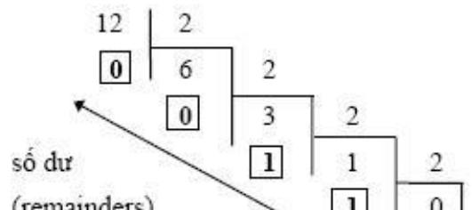
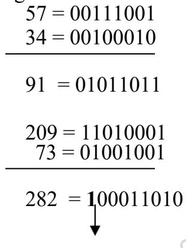
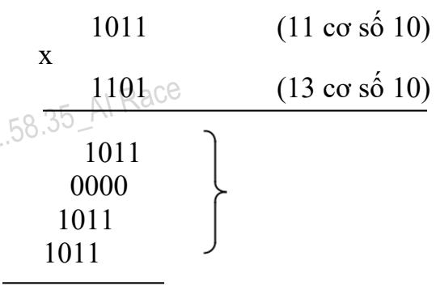

1. Biểu diễn dữ liệu trong máy tính

# 1.1 Biểu diễn số trong các hệ đếm

Hệ đếm là tập hợp các ký hiệu và qui tắc sử dụng tập ký hiệu đó để biểu diễn và xác định các giá trị các số. Mỗi hệ đếm có một số ký số (digits) hữu hạn. Tổng số ký số của mỗi hệ đếm được gọi là cơ số (base hay radix), ký hiệu là b.

# Hệ đếm cơ số b

Hệ đếm cơ số b $\mathbf { b } \geq 2$ và nguyên dương) mang tính chất sau :

• Có b ký số để thể hiện giá trị số. Ký số nhỏ nhất là 0 và lớn nhất là b-1. Giá trị vị trí thứ n trong một số của hệ đếm bằng cơ số b lũy thừa n • Số $\mathrm { { N _ { ( b ) } } }$ trong hệ đếm cơ số (b) được biểu diễn bởi:

$$
N _ { ( b ) } = a _ { 1 } a _ { 2 - 1 } a _ { 2 - 2 } \cdots a _ { 1 } a _ { 0 } a - 1 ^ { a } - 2 \cdots a - m
$$

trong đó, số N(b) có n+1 ký số biểu diễn cho phần nguyên và m ký số lẻ biểu diễn cho phần b_phân, và có giá trị là:

$$
\begin{array} { c l } { { { \bf N } _ { ( \mathfrak { b } ) } = { \bf a } _ { \mathfrak { a } } { \bf b } ^ { \mathrm { a } } + { \bf a } _ { { \mathfrak { a } } - 1 } { \bf b } ^ { { \mathrm { a } } - 1 } + { \bf a } _ { { \mathfrak { a } } - 2 } { \bf b } ^ { { \mathrm { a } } - 2 } + \ldots + { \bf a } _ { 1 } { \bf b } ^ { 1 } + { \bf a } _ { 0 } { \bf b } ^ { 0 } + { \bf a } _ { - 1 } { \bf b } ^ { - 1 } + { \bf a } _ { - 2 } { \bf b } ^ { - 2 } + \ldots + { \bf a } _ { - \pi } { \bf b } ^ { - \pi } } } \\ { { \mathrm { h a y l i a } ; } } \\ { { N _ { ( \mathfrak { b } ) } = \displaystyle \sum _ { i } ^ { n } a _ { i } b ^ { i } } } \end{array}
$$

Trong ngành toán - tin học hiện nay phổ biến 4 hệ đếm là hệ thập phân, hệ nhị phân, hệ bát phân và hệ thập lục phân.

# Hệ đếm thập phân (Decimal system, $\scriptstyle \mathbf { b } = \mathbf { 1 0 }$ )

Hệ đếm thập phân hay hệ đếm cơ số 10 là một trong các phát minh của người Ả rập cổ, bao $\mathrm { g \dot { o } m \thinspace l 0 \dot { k } \bar { y } }$ số theo ký hiệu sau:

# 0,1,2,3,4,5,6,7,8,9

Qui tắc tính giá trị của hệ đếm này là mỗi đơn vị ở một hàng bất kỳ có giá trị bằng 10 đơn vị của hàng $\bar { \mathrm { k } } \bar { \hat { \mathrm { e } } }$ cận bên phải. $\mathring { \mathrm { O } }$ đây $\mathtt { b } \mathtt { = } 1 0$ . Bất kỳ số nguyên dương trong hệ thập phân có thể biểu diễn như là một tổng các số hạng, mỗi số hạng là tích của một số với 10 lũy thừa, trong đó $\mathrm { { s } \it { \tilde { 0 } } \ m \tilde { { u } } }$ lũy thừa được tăng thêm 1 đơn vị kể từ số mũ lũy thừa phía bên phải nó. Số mũ lũy thừa của hàng đơn vị trong hệ thập phân là 0.

Ví dụ: Số 5246 có thể được biểu diễn như sau:

2 1 0

$$
\begin{array} { c } { 5 2 4 6 = 5 \mathrm { ~ x ~ } 1 0 + 2 \mathrm { ~ x ~ } 1 0 + 4 \mathrm { ~ x ~ } 1 0 + 6 \mathrm { ~ x ~ } 1 0 } \\ { = 5 \mathrm { ~ x ~ } 1 0 0 0 + 2 \mathrm { ~ x ~ } 1 0 0 + 4 \mathrm { ~ x ~ } 1 0 + 6 \mathrm { ~ x ~ } 1 } \end{array}
$$

Thể hiện như trên gọi là ký hiệu mở rộng của số nguyên vì

$$
5 2 4 6 = 5 0 0 0 + 2 0 0 + 4 0 + 6
$$

Như vậy, trong s $\dot { \hat { 0 } } 5 2 4 6 : \mathrm { k y } \mathrm { s } \acute { \hat { 0 } } 6$ trong số nguyên đại diện cho giá trị 6 đơn vị (1s), ký số 4 đại diện cho giá trị 4 chục (10s), ký số 2 đại diện cho giá trị 2 trăm (100s) và ký số 5 đại diện cho giá trị 5 ngàn (1000s). Nghĩa là, số lũy thừa của 10 tăng dần 1 đơn vị từ trái sang phải tương ứng với vị trí ký hiệu số,

$$
{ \begin{array} { c } { 0 } \\ { 1 0 = 1 \ 1 0 = 1 0 \ 1 0 \ = 1 0 0 \ 1 0 \ = 1 0 0 0 \ 1 0 = 1 0 0 0 0 \ . . . } \end{array} } \qquad 
$$

Mỗi ký số ở thứ tự khác nhau trong số sẽ có giá trị khác nhau, ta gọi là giá trị vị trí (place value).

Phần thập phân trong hệ thập phân sau dấu chấm phân cách thập phân (theo qui ước của Mỹ) thể hiện trong ký hiệu mở rộng bởi 10 lũy thừa âm tính từ phải sang trái $\mathrm { k } \mathring { \mathrm { e } }$ từ dấu chấm phân cách:

$$
1 0 1 1 0 1 \mathrm { { -- } } 1 0 1 1 0 0 2 \mathrm { { -- } } 1 0 1 1 0 0 0 3 \mathrm { { -- } } = \dots
$$

$$
{ \begin{array} { r c c c } { \mathbf { V } _ { 1 } ^ { \prime } { \mathrm { ~ d u } } : 2 5 4 4 . 6 8 = 2 \mathrm { ~ x ~ } 1 0 \ + 5 \mathrm { ~ x ~ } 1 0 + 4 \mathrm { ~ x ~ } 1 0 + 6 \mathrm { ~ x ~ } } & { - 2 } & { } \\ { { \mathrm { ~ 3 ~ } } 0 { \mathrm { ~ u ~ } } : 2 5 4 . 6 8 = 2 \mathrm { ~ x ~ } 1 0 } & { + { \mathrm { ~ 5 ~ x ~ } } 1 0 + 4 \mathrm { ~ x ~ } 1 0 + 6 \mathrm { ~ x ~ } } & { } & { { \mathrm { ~ 2 ~ } } } \end{array} }
$$

# 1.1.3 Hệ đếm nhị phân (Binary system, $\scriptstyle \mathbf { b } = 2$ )

Với cơ số ${ \tt b } = 2$ , chúng ta có hệ đếm nhị phân. Đây là hệ đếm đơn giản nhất với 2 chữ số là 0 và 1, mỗi chữ số nhị phân gọi là BIT (viết tắt từ chữ BInary digiT). Vì hệ nhị phân chỉ có 2 trị số là 0 và 1, nên khi muốn diễn tả một số lớn hơn, hoặc các ký tự phức tạp hơn thì cần kết hợp nhiều bit với nhau. Ta có thể chuyển đổi số trong hệ nhị phân sang số trong hệ thập phân quen thuộc.

Ví dụ: Số 11101.11(2) sẽ tương đương với giá trị thập phân là :

$$
\begin{array} { r l } & { \mathrm { S ~ o ~ n h i ~ p h a n : ~ 1 } \quad \mathrm { ~ 1 } \quad \quad \quad \mathrm { 1 } \quad \quad \quad \mathrm { 1 } \quad \quad \quad \mathrm { 0 } \quad \quad \mathrm { 1 } \quad \mathrm { \Omega } _ { \cdot } ^ { \mathrm { ~ \wedge ~ } } \mathrm { \Omega } _ { \cdot } \mathrm { 1 } \quad \quad 1 } \\ & { \mathrm { S ~ o ~ v i ~ t r i : ~ 1 } \quad \mathrm { ~ 4 } \quad \quad \mathrm { 3 } \quad \quad \mathrm { 2 } \quad \quad \mathrm { 1 } \quad \quad \mathrm { 0 } \quad \quad \mathrm { - 1 } \quad \quad 2 } \\ & { \mathrm { T r i ~ v i ~ t i : ~ 1 } \quad \quad 2 ^ { \mathrm { * } } \quad \quad 2 ^ { \mathrm { 2 } } \quad \quad \mathrm { 2 } ^ { \mathrm { 2 } } \quad \quad \mathrm { 2 } ^ { \mathrm { 0 } } \quad \quad 2 ^ { \mathrm { 2 } } \quad \quad 2 ^ { \mathrm { - 2 } } } \\ & { \mathrm { H \hat { e } ~ 1 0 ~ l a : } \quad \quad \mathrm { 1 6 } \quad \quad \mathrm { 8 } \quad \quad \mathrm { 4 } \quad \quad \mathrm { 2 } \quad \quad \mathrm { 1 } \quad \quad 0 . 5 \quad \quad 0 . 2 5 } \end{array}
$$

nhur vay:

$$
\mathbf { 1 1 1 0 1 . 1 1 _ { ( 2 ) } } = \mathbf { 1 x } \mathbf { 1 6 } + \mathbf { 1 x 8 } + \mathbf { 1 x 4 } + \mathbf { 0 x 2 } + \mathbf { 1 x 1 } + \mathbf { 1 x 0 . 5 } + \mathbf { 1 x 0 . 2 5 } = \mathbf { 2 9 . 7 5 } \mathbf { \Omega } _ { ( 1 0 ) }
$$

sò 10101 (he 2) sang he thap phàn sě la:

$$
\mathbf { 1 0 1 0 1 } _ { ( 2 ) } = \mathbf { 1 } \mathbf { x } 2 ^ { 4 } + \mathbf { 0 } \mathbf { x } 2 ^ { 3 } + \mathbf { 1 } \mathbf { x } 2 ^ { 2 } + \mathbf { 0 } \mathbf { x } 2 ^ { 1 } + \mathbf { 1 } \mathbf { x } 2 ^ { 0 } = 1 6 + 0 + 4 + 0 + 1 = 2 \mathbf { 1 } _ { ( 1 0 ) }
$$

# Hệ đếm bát phân (Octal system, $\mathbf { b { = } 8 }$

Nếu dùng 1 tập hợp 3 bit thì có thể biểu diễn 8 trị khác nhau : 000, 001, 010, 011, 100, 101, 110, 111. Các trị này tương đương với 8 trị trong hệ thập phân là 0, 1, 2, 3, 4, 5, 7. Tập hợp các chữ

3 số này gọi là hệ bát phân, là hệ đếm với $\mathbf { b } = 8 = 2$ . Trong hệ bát phân, trị vị trí là lũy thừa của 8.

Ví dụ:

$$
{ 2 3 5 . 6 4 _ { ( 8 ) } = 2 \times 8 + 3 \times 8 + 5 \times 8 + } _ { 6 \times 8 \times \mathrm { ~ ( ~ } 4 \times 8 \mathrm { ~ = ~ } 1 5 7 . 8 1 2 5 _ { ( 1 0 ) } }
$$

# Hệ đếm thập lục phân (Hexa-decimal system, $\bf { b { = } } 1 6$

4 Hệ đếm thập lục phân là hệ cơ $\scriptstyle { \hat { \mathsf { s o } } } \ { \mathsf { b } } = 1 6 = 2$ , tương đương với tập hợp 4 chữ số nhị phân (4 bit). Khi thể hiện ở dạng hexa-decimal, ta có $1 6 \mathrm { k } \dot { \mathrm { y } }$ tự $\mathrm { g } \bar { \hat { 0 } } \mathrm { m } 1 0$ chữ số từ 0 đến 9, và 6 chữ in A, B, $\mathrm { { \mathbb { C } } } ,$ D, E, F để biểu diễn các giá trị số tương ứng là 10, 11, 12, 13, 14, 15. Với hệ thập lục phân, trị vị trí là lũy thừa của 16.

Ví dụ:

$$
\begin{array} { c c c } { { 4 } } & { { 3 } } & { { 2 } } & { { 1 } } \\ { { 3 4 \mathrm { F } 5 \mathrm { C } _ { ( 1 6 ) } = 3 \mathrm { x } 1 6 } } & { { + 4 \mathrm { x } 1 6 } } & { { + 1 5 \mathrm { x } 1 6 + 5 \mathrm { x } 1 6 + 1 2 \mathrm { x } 1 6 } } & { { = 2 1 6 2 9 4 _ { ( 1 0 ) } } } \end{array}
$$

Ghi chú: Một số ngôn ngữ lập trình qui định viết số hexa phải có chữ H ở cuối chữ số. Ví dụ: Số 15 viết là $\mathrm { F _ { H } }$ .

# Chuyển đổi một số từ hệ thập phân sang hệ đếm cơ số b

# 1.1.6.1. Đổi phần nguyên từ hệ thập phân sang hệ b

Tổng quát: Lấy số nguyên thập phân N(10) lần lượt chia cho b cho đến khi thương số bằng   
0. Kết   
quả số chuyển đổi $\mathrm { N } _ { ( \mathfrak { b } ) }$ là các dư số trong phép chia viết ra theo thứ tự ngược lại.. Ví dụ:   
Số 12(10)   
$= \mathrm { ? } _ { \cdot } ( 2 )$ . Dùng phép chia cho 2 liên tiếp, ta có một loạt các số dư như sau:

# 1.1.6.2. Đổi phần thập phân từ hệ thập phân sang hệ cơ số b

Tổng quát: Lấy phần thập phân N(10) lần lượt nhân với b cho đến khi phần thập phân của tích số bằng 0. Kết quả số chuyển đổi $\mathrm { N } _ { ( \mathfrak { b } ) }$ là các số phần nguyên trong phép nhân viết ra theo thứ tự

# 1.2 Biểu diễn dữ liệu trong máy tính và đơn vị thông tin

# 1.2.1 Nguyên tắc chung

Thông tin và dữ liệu mà con người hiểu được tồn tại dưới nhiều dạng khác nhau, ví dụ như các số liệu, các ký tự văn bản, âm thanh, hình ảnh,… nhưng trong máy tính mọi thông tin và dữ liệu đều được biểu diễn bằng số nhị phân (chuỗi bit).

Để đưa dữ liệu vào cho máy tính, cần phải mã hoá nó về dạng nhị phân. Với các kiểu dữ liệu khác nhau cần có cách mã hoá khác nhau. Cụ thể:

Các dữ liệu dạng số (số nguyên hay số thực) sẽ được chuyển đổi trực tiếp thành các chuỗi số nhị phân theo các chuẩn xác định.   
Các ký tự được mã hoá theo một bộ mã cụ thể, có nghĩa là mỗi ký tự sẽ tương ứng với một chuỗi số nhị phân.   
Các dữ liệu phi số khác như âm thanh, hình ảnh và nhiều đại lượng vật lý khác muốn đưa vào máy phải số hoá (digitalizing). Có thể hiểu một cách đơn giản khái niệm số hoá như sau: các dữ liệu tự nhiên thường là quá trình biến đổi liên tục, vì vậy để đưa vào máy tính, nó cần được biến đổi sang một dãy hữu hạn các giá trị số (nguyên hay thực) và được biểu diễn dưới dạng nhị phân.

Tuy rằng mọi dữ liệu trong máy tính đều ở dạng nhị phân, song do bản chất của dữ liệu, người ta thường phân dữ liệu thành 2 dạng:

Dạng cơ bản: gồm dạng số (nguyên hay thực) và dạng ký tự. Số nguyên không dấu được biểu diễn theo dạng nhị phân thông thường, số nguyên có dấu theo mã bù hai, còn số thực theo dạng dấu phảy động. Để biểu diễn một dữ liệu cơ bản, người ta sử dụng 1 số bit. Các bit này ghép lại với nhau để tạo thành từ: từ 8 bít, từ 16 bít,…

Dạng có cấu trúc: Trên cơ sở dữ liệu cơ bản, trong máy tính, người ta xây dựng nên các dữ liệu có cấu trúc phục vụ cho các mục đích sử dụng khác nhau. Tuỳ theo cách “ghép” chúng ta có mảng, tập hợp,xâu, bản ghi,…

# Đơn vị thông tin

Đơn vị nhỏ nhất để biểu diễn thông tin gọi là bit. Một bit tương ứng với một sự kiện có 1 trong 2 trạng thái.

Ví dụ: Một mạch đèn có 2 trạng thái là:

• Tắt (Off) khi mạch điện qua công tắc là hở • Mở (On) khi mạch điện qua công tắc là đóng

Số học nhị phân sử dụng hai ký số 0 và 1 để biểu diễn các số. Vì khả năng sử dụng hai số 0 và 1 là như nhau nên một chỉ thị chỉ gồm một chữ số nhị phân có thể xem như là đơn vị chứa thông tin nhỏ nhất.

Bit là chữ viết tắt của BInary digiT. Trong tin học, người ta thường sử dụng các đơn vị đo thông tin lớn hơn như sau:

# 1.3 Biểu diễn số nguyên

Số nguyên gồm số nguyên không dấu và số nguyên có dấu. Về nguyên tắc đều dùng 1 chuỗi bit để biểu diễn. Đối với số nguyên có dấu, người ta sử dụng bit đầu tiên để biểu diễn dấu „-„ và bit này gọi là bit dấu.

# Số nguyên không dấu

Trong biểu diễn số nguyên không dấu, mọi bit đều được sử dụng để biểu diễn giá trị số. Ví dụ 1 dãy 8 bit biểu diễn số nguyên không dấu có giá trị:

8   
$2 = 2 5 6 \mathrm { s } \acute { \mathrm { o } }$ nguyên dương, cho giá trị từ 0 (0000 0000) đến 255 (1111 1111).   
Với n bits ta có thể biểu diễn 1 số nguyên có giá trị lớn nhất là $2 ^ { \mathrm { n } } { - } 1$ và dải giá trị biểu diễn được từ 0 đến $2 ^ { \mathrm { n } } { - } 1$ .

Thí dụ: 00000000 = 0

00000010 = 2   
00000100 = 4   
11111111 = 255

# Số nguyên có dấu

Trong biểu diễn số nguyên có dấu, bit đầu làm bít dấu: 0 là số dương và 1 cho số âm. Số nguyên có dấu thể hiện trong máy tính ở dạng nhị phân là số dùng 1 bit làm bít dấu, người ta qui ước dùng bit ở hàng đầu tiên bên trái làm bit dấu (S): 0 là số dương và 1 cho số âm. Cách phổ biến biểu diễn số âm có dấu là dùng mã bù hai:

Số bù hai được tính như sau:

Biểu diễn số nguyên không dấu • Nghịch đảo tất cả các bit (số bù một) • Cộng thêm một. (số bù hai)

Chú ý: Thử biểu diễn mã bù hai của -37 để thu được số +35

# Tính toán số học với số nguyên

1.3.3.1. Cộng/ trừ số nguyên

Cộng/ trừ số nguyên không dấu

Khi cộng hai số nguyên không dấu n bits ta thu được một số nguyên không dấu cũng n bits. Vì vậy,

• Nếu tổng của hai số đó nhỏ hơn hoặc bằng $2 ^ { \mathrm { n } } { - } 1$ thì kết quả nhận được là đúng. Nếu tổng của hai số đó lớn hơn $2 ^ { \mathrm { n } } { } ^ { - 1 }$ thì khi đó sẽ tràn số và kết quả sẽ là sai. Thí dụ với trường hợp 8 bits, tổng nhỏ hơn 255 thì ta sẽ có kết quả đúng:

+

Bit tràn ra ngoài => kết quả $=$ 26 là sai.

• Để tránh hiện tượng tràn số này ta phải sử dụng nhiều bit hơn để biểu diễn.

Cộng/trừ số nguyên có dấu Số nguyên có dấu được biểu diễn theo mã bù hai, vậy qui tắc chung như sau:

Cộng hai số nguyên có dấu n-bit sẽ bỏ qua giá trị nhớ ra khỏi bit có ý nghĩa cao nhất, tổng nhận được sẽ có giá trị đúng và cũng được biểu diễn theo mã bù hai, nếu kết quả nhận được nằm trong dải $- 2 ^ { \mathrm { n } } - 1$ đến $+ 2 ^ { \mathrm { { \bar { n } } - 1 } }$ - 1.   
Để trừ hai số nguyên có dấu X và Y (X – Y) , cần lấy bù hai của Y tức $- \mathrm { Y }$ , sau đó cộng X với –Y theo nguyên tắc trên.

Như vậy, khi thực hiện phép tính trên sẽ thừa ra 1 bit bên trái cùng, bit này sẽ không được lưu trong kết quả và sẽ được bỏ qua.

# 1.3.3.2. Nhân/ chia số nguyên

So với phép cộng và phép trừ, phép nhân và phép chia phức tạp hơn nhiều. Dưới đây, chỉ giới thiệu phép nhân/phép chia với số nhị phân. Ví dụ sau mô tả phép nhân hai số nhị phân:

# 10001111

# kết quả 143 trong cơ số 10

Chúng ta có một số nhận xét sau:

Phép nhân tạo ra các tích riêng, mỗi tích thu được là kết quả của việc nhân từng bit. • Các tích riêng dễ dàng xác định theo qui tắc: oBit tương ứng số nhân là 1 thì tích riêng bằng số bị nhân oBit tương ứng số nhân bằng 0 thì tích riêng bằng 0 • Tích được tính bằng tổng các tích riêng.

Phép chia phức tạp hơn phép nhân nhưng dựa trên cùng 1 nguyên tắc.