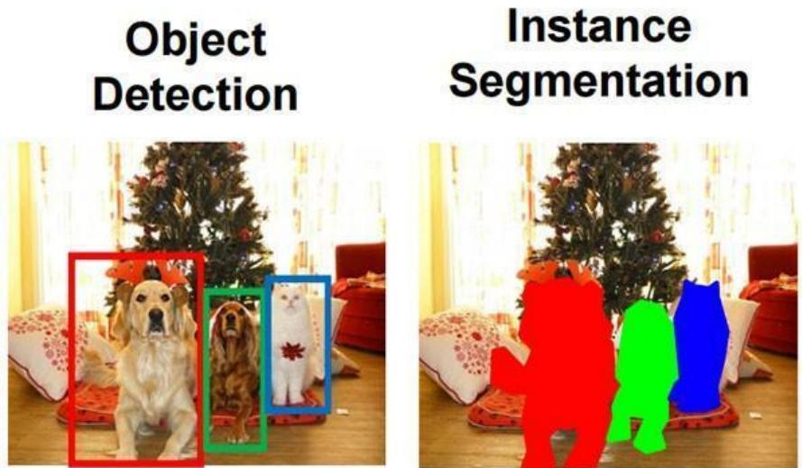
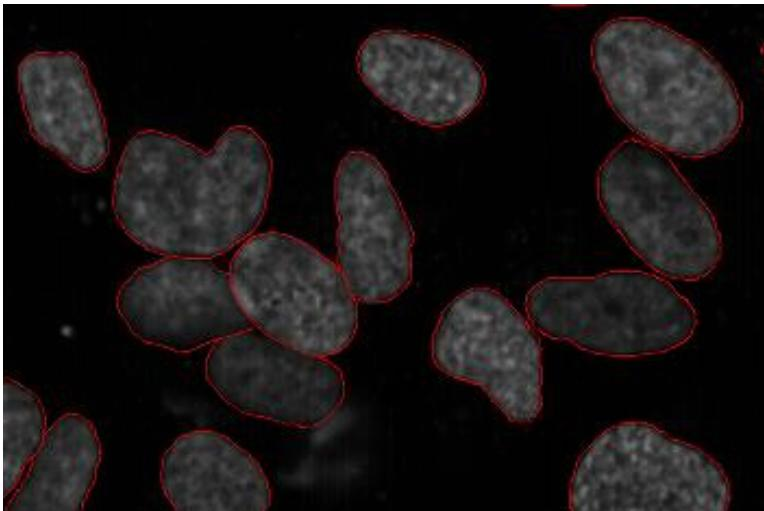
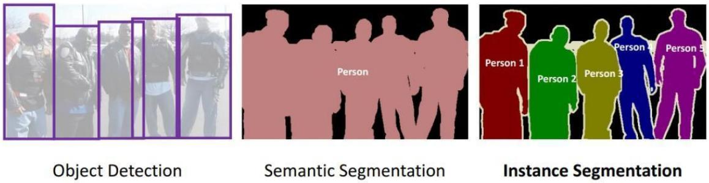
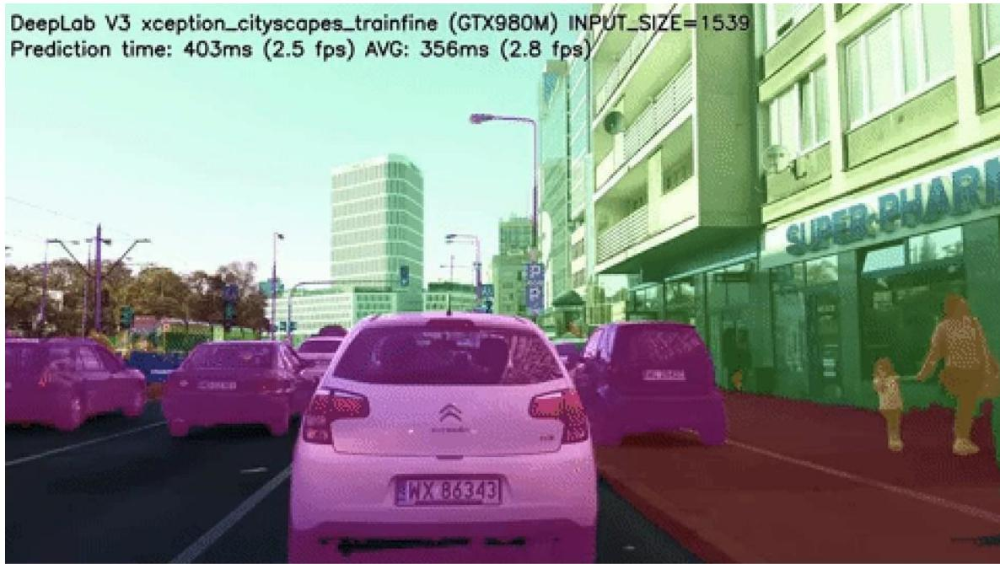
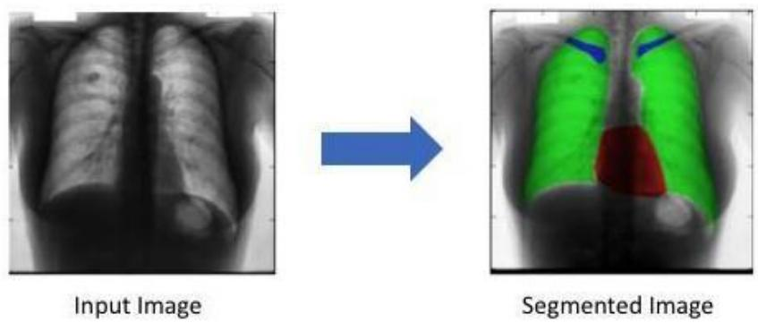
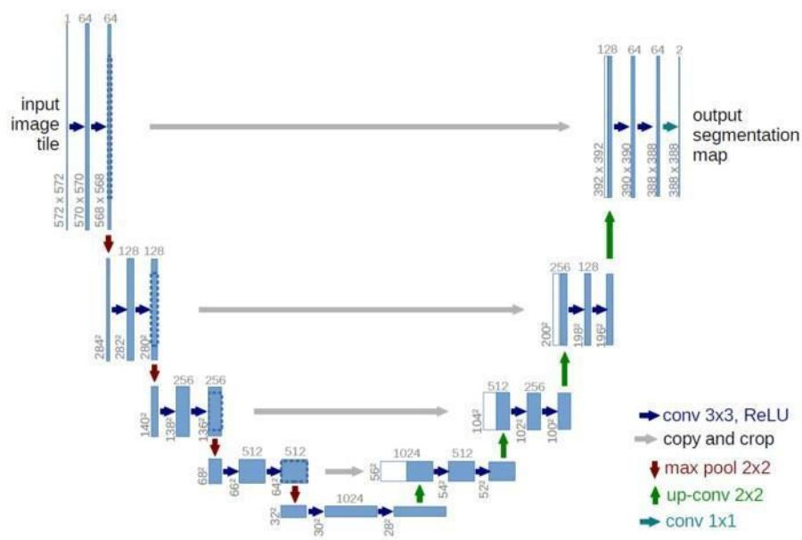
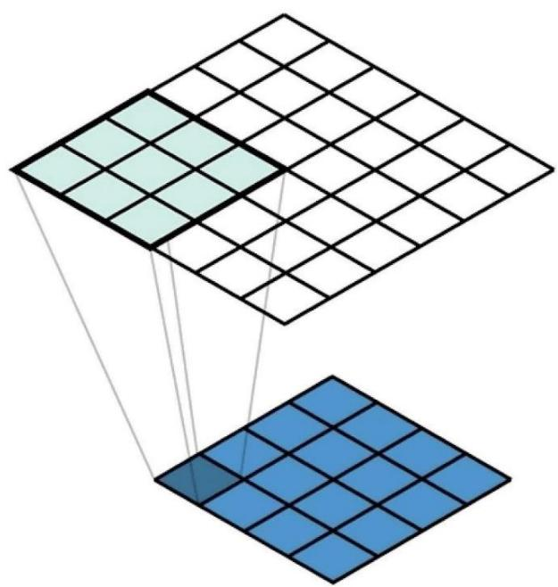

# 1. Bài toán Image segmentation

Bài trước bạn đã được giới thiệu về object detection, đi tìm các bounding box quanh các đối tượng trong ảnh và sau đó phân loại các bounding box. Tuy nhiên là các bounding box thì không biểu thị được đúng hình dạng của đối tượng và có nhiều nhiễu ở trong bounding box đấy ví dụ như trong bounding box màu đỏ có cả một phần của cây thông cũng như cái $\mathrm { g } \acute { \mathrm { o i } } \mathrm { = } >$ Image segmentation ra đời để chia ảnh thành nhiều vùng khác nhau hay tìm được đúng hình dạng của các đối tượng.

  
Hình 15.1: So sánh object detection và segmentation [4]

Cùng thử lấy ví dụ tại sao cần image segmentation nhé. Ung thư là một căn bệnh hiểm nghèo và cần được phát hiện sớm để điều trị. Vì hình dạng của các tế bào ung thư là một trong những yếu tố quyết định độ ác tính của bệnh, nên ta cần image segmentation để biết được chính xác hình dạng của các tế bào ung thư để có các chẩn đoán xác định. Rõ ràng object detection $\dot { \mathbf { O } }$ đây không giải quyết được vấn đề.

  
Hình 15.2: Ví dụ về segmentation [15]

# 1.1 Phân loại bài toán image segmentation

Bài toán image segmentation được chia ra làm 2 loại:

Semantic segmentation: Thực hiện segment với từng lớp khác nhau, ví dụ: tất cả người là 1 lớp, tất cả ô tô là 1 lớp.

• Instance segmentation: Thực hiện segment với từng đối tượng trong một lớp.   
Ví dụ có 3 người trong ảnh thì sẽ có 3 vùng segment khác nhau cho mỗi người.

  
Hình 15.3: Phân loại semantic segmentation và instance segmentation [27]

Cần áp dụng kiểu segmentation nào thì phụ thuộc vào bài toán. Ví dụ: cần segment người trên đường cho ô tô tự lái, thì có thể dùng semantic segmentation vì không cần thiết phải phân biệt ai với ai, nhưng nếu cần theo dõi mọi hành vi của mọi người trên đường thì cần instance segmentation thì cần phân biệt mọi người với nhau.

# 1.2 Ứng dụng bài toán segmentation

# 1.2.1 Ô tô tự lái

Segmentation dùng để xác định đường, các xe ô tô, người đi bộ,... để hỗ trợ cho ô tô tự lái

# Chẩn đoán trong y học

Segmentation được ứng dụng rất nhiều trong y học để hỗ trợ việc chẩn đoán bệnh. Ví dụ phân tích ảnh X-quang.

  
Hình 15.4: Ứng dụng segmentation [16]

# 2. Mạng U-Net với bài toán semantic segmentation

Như trong bài xử lý ảnh ta đã biết thì ảnh bản chất là một ma trận của các pixel. Trong bài toán image segmentation, ta cần phân loại mỗi pixel trong ảnh. Ví dụ như trong hình trên với semantic segmentation, với mỗi pixel trong ảnh ta cần xác định xem nó là background hay là người. Thêm nữa là ảnh input và output có cùng kích thước.

U-Net được phát triển bởi Olaf Ronneberger et al. để dùng cho image segmentation trong y học. Kiến trúc có 2 phần đối xứng nhau được gọi là encoder (phần bên trái) và decoder (phần bên phải).

# 2.1 Kiến trúc mạng U-Net

  
Fig. 1. U-net architecture (example for 32x32 pixels in the lowest resolution). Each blue box corresponds to a multi-channel feature map. The number of channels is denoted ontop of the box.The x-y-size is provided at the lower leftedge of the box. White boxes represent copied feature maps. The arrows denote the different operations.

# Hình 15.5: Mạng U-Net [20]

Nhận xét:

• Thực ra phần encoder chỉ là ConvNet bình thường (conv, max pool) với quy tắc quen thuộc từ bài VGG, các layer sau thì width, height giảm nhưng depth tăng.

• Phần decoder có mục đích là khôi phục lại kích thước của ảnh gốc, ta thấy có up-conv lạ. Conv với stride $> 1$ thì $\mathrm { d } \acute { \mathrm { e } }$ giảm kích thước của ảnh giống như max pool, thì up-conv dùng để tăng kích thước của ảnh.

• Bạn thấy các đường màu xám, nó nối layer trước với layer hiện tại được dùng rất phổ biến trong các CNN ngày nay như DenseNet để tránh vanishing gradient cũng như mang được các thông tin cần thiết từ layer trước tới layer sau.

# 2.2 Loss function

Vì bài toán là phân loại cho $\mathrm { m } \tilde { \hat { \mathrm { m } } } \mathrm { i }$ pixel nên loss function sẽ là tổng cross-entropy loss cho $\mathrm { m } \tilde { \hat { \mathrm { m } } } \mathrm { i }$ pixel trong toàn bộ bức ảnh.

# 2.3 Transposed convolution

Hình ở trên có kích thước là $6 ^ { * } 6 .$ , hình ở dưới có kích thước là $4 ^ { * } 4$ , kernel có kích thước $3 ^ { * } 3$ .

Nếu ta thực hiện phép tính convolution với input là hình ở trên, padding $= 0$ , stride = 1 và kernel $3 ^ { * } 3$ thì output sẽ là hình ở dưới.

Phép tính transposed convolution thì sẽ ngược lại, input là hình $\dot { \mathbf { O } }$ dưới, padding $= 0 _ { ; }$ , stride $= 1$ và kernel $3 ^ { * } 3$ thì output sẽ là hình $\dot { \sigma }$ trên. Các ô vuông ở hình trên bị đè lên nhau thì sẽ được cộng dồn. Các quy tắc về stride và padding thì tương tự với convolution.