# 1. Vectorization

Ngay từ bài đầu tiên về linear regression, tôi đã giới thiệu về việc biểu diễn và tính toán dưới dạng vector. Việc biểu diễn bài toán dưới dạng vector như vậy gọi là vectorization. Nó không chỉ giúp code gọn lại mà còn tăng tốc độ tính đoán một cách đáng $\mathrm { k } \mathring { \mathrm { e } }$ khi thực hiện các phép tính trên vector, ma trận so với for-loop.

# # -\*- coding: utf-8 -\*-

import numpy as np import time   
${ \mathfrak { a } } =$ np.random.rand(10000000)   
${ \bf b } =$ np.random.rand(10000000)   
start $=$ time.time()   
${ \tt 3 } =$ np.dot(a, b.T)   
end $=$ time.time()   
print("Vectorization time : ", end-start)   
start $=$ time.time()   
${ \mathfrak { c } } = 0$   
for i in range(len(a)): $\mathrm { \mathfrak { c } + = \mathrm { a } [ i ] \ ^ { * } \ b [ i ] }$   
end $=$ time.time()   
print("For-loop time : ", end-start)

Bạn sẽ thấy nếu dùng for-loop mất hơn 4s để nhân 2 vector trong khi dùng thư viện numpy để tính chỉ mất 0.01s. Tại sao lại như thế nhỉ?

Giả sử bạn có 10 tấn hàng cần vận chuyển từ A đến B và bạn có một xe tải với khả năng chở được 5 tấn mỗi lần. Vậy nếu chất đầy hàng mỗi lần chở thì chỉ cần 2 lần chạy là chuyển hết số hàng. Tuy nhiên nếu mỗi lần bạn chỉ chất 1 tấn hàng lên xe để chở đi thì xe cần đi tới 10 lần để chuyển hết số hàng.

Tương tự như vậy, khi nhân 2 vector ở trên bạn cần thực hiện 10000000 phép tính nhân 2 số. Giả sử máy tính có thể tính được tối đa 1000 phép tính nhân một lúc. Việc bạn dùng for-loop giống như mỗi thời điểm bạn chỉ yêu cầu máy tính thực hiện một phép nhân, nên để nhân 2 vector sẽ cần 10000000 đơn vị thời gian. Tuy nhiên thư viện numpy sẽ tối ưu việc tính toán 10000000 bằng cách yêu cầu máy tính thực hiện 1000 phép tính một lúc, tức là chỉ cần $\overline { { 1 0 0 0 } } = 1 0 0 0 0$ đơn vị thời gian để hoàn thành phép nhân 2 vector. Vậy nên là việc vectorization thông thường sẽ tính toán nhanh hơn.

# 2. Mini-batch gradient descent

# 2.1 Mini-batch gradient descent là gì

Ở trong thuật toán gradient descent, tại bước thứ hai khi ta tính đạo hàm của loss function với các biến. Trong bài linear regression, ta dùng tất cả các dữ liệu trong dataset để tính đạo hàm rồi cập nhật bước 2:

$$
{ \begin{array} { r l } & { { \boldsymbol { \mathcal { X } } } = { \left[ \begin{array} { l } { 1 } \\ { 1 } \end{array} \right] } , } \\ & { { \boldsymbol { \mathcal { X } } } = { \left[ \begin{array} { l } { 1 } \\ { 1 } \end{array} \right] } , } \\ { \qquad { \boldsymbol { \mathcal { X } } } = { \left[ \begin{array} { l } { 1 } \\ { 0 } \\ { \cdots } \\ { 1 } \end{array} \right] } , } \\ { { \frac { d J } { d w _ { 0 } } } = s u m ( { \boldsymbol { \hat { Y } } } - Y ) , { \frac { d J } { d w _ { 1 } } } = s u m ( { \boldsymbol { X } } [ : , 1 ] \otimes ( { \boldsymbol { \hat { Y } } } - Y ) ) } \\ & { w _ { 0 } = w _ { 0 } - l e a r n i n g . r a t e : { \frac { d J } { d w _ { 0 } } } , w _ { 1 } = w _ { 1 } - l e a r n i n g . r a t e : { \frac { d J } { d w _ { 1 } } } } \end{array} }
$$

Thuật toán gradient descent chạy tốt nhưng số lượng dữ liệu trong training set chỉ là 30. Tuy nhiên nếu dữ liệu có kích thước lớn như ảnh và số lượng lớn hơn ví dụ 5000 thì việc tính đạo hàm với loss function với toàn bộ dữ liệu sẽ rất tốn thời gian. Và mini-batch gradient descent ra đời để giải quyết vấn đề đấy.

Dựa vào số lượng dữ liệu cho mỗi lần thực hiện bước 2 trong gradient descent là người ta chia ra làm 3 loại:

Batch gradient descent: Dùng tất cả dữ liệu trong training set cho mỗi lần thực hiện bước tính đạo hàm.   
• Mini-batch gradient descent: Dùng một phần dữ liệu trong training set cho mỗi lần thực hiện bước tính đạo hàm.   
• Stochastic gradient descent: Chỉ dùng một dữ liệu trong training set cho mỗi lần thực hiện bước tính đạo hàm.

Ví dụ điểm thi đại học trung bình của một trường trung học phổ thông là 24 điểm. Batch gradient descent giống như tính điểm trung bình tất cả học sinh thi đại học năm nay của trường, con số sẽ tương đối gần 24, ví dụ 24,5. Mini-batch sẽ chọn ngẫu nhiên một số học sinh, ví dụ 32 học sinh để tính điểm trung bình thì điểm trung bình sẽ xa 24 hơn ví dụ 22. Tuy nhiên, Stochastic giống như chỉ chọn một học sinh làm điểm trung bình, thì lúc này điểm trung bình có thể khác xa con số 24 rất nhiều, ví dụ 18 hoặc 29. Việc điểm trung bình ở minibatch hay stochastic khác so với điểm trung bình toàn trường gọi là nhiễu trong dữ liệu. Hay giải thích đơn giản là chỉ lấy 1 hoặc một phần dữ liệu thì không thể mô tả hết được tất cả dữ liệu.

Do đó hàm loss-function với hệ số learning_rate phù hợp thì batch gradient descent theo epoch sẽ giảm đều đặn. Vì có nhiễu trong dữ liệu nên mini-batch thì vẫn giảm nhưng có dao động và stochastic có giảm nhưng dao động cực kì lớn.

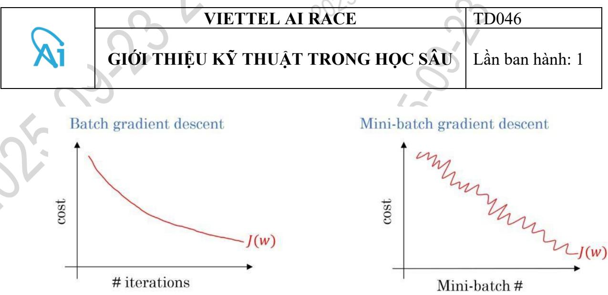  
Hình 12.1: So sánh loss function khi dùng batch và mini-batch [13]

Hình dưới là biểu diễn biệc cập nhật hệ số trong gradient descent, điểm đỏ là giá trị nhỏ nhất ta cần tìm, các điểm ở ngoài cùng là giá trị khởi tạo của hệ số trong gradient descent. Ta có thể thấy vì không có nhiễu nên batch gradient descent thì hệ số cập nhật trực tiếp theo 1 đường thẳng. Mini-batch thì mất nhiều thời gian hơn và còn đi chệch hướng tuy nhiên thì vẫn đến được điểm đỏ. Còn stochastic thì đi khá lòng vòng để đến được điểm đỏ và vì dữ liệu quá nhiễu nên có thể thuật toán gradient descent chỉ quanh điểm đỏ mà không đến được điểm đỏ (minimum point).

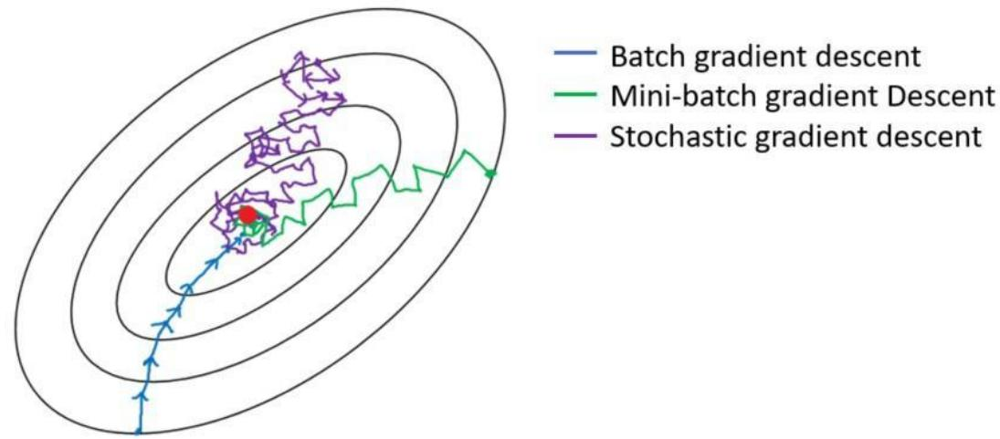  
Hình 12.2: Cập nhật loss function đến minimum point của các thuật toán [13]

Batch gradient descent thường được dùng khi số lượng dữ liệu trong training set nhỏ hơn 2000. Với lượng dữ liệu lớn thì mini-batch gradient descent được sử dụng. Nó có thể giải quyết được vấn đề lượng dữ liệu quá lớn như trong batch gradient descent, hơn nữa đỡ nhiễu và có thể dùng vectorization so với stochastic gradient descent nên thường được sử dụng trong deep learning.

# 2.2 Các thông số trong mini-batch gradient descent

Ví dụ code trong bài 7, trong bài toán phân loại chữ số cho dữ liệu MNIST

H = model.fit(X_train, Y_train, validation_data (X_val, Y_val), batch_size $^ { - 3 2 }$ , epochs $\scriptstyle = 1 0$ , verbose $\mathrel { \mathop = } 1$ )

X_train, Y_train là dữ liệu và label cho training set. Tương tự X_val, Y_val là dữ liệu cho validation set.

batch_size: Là size trong mini-batch gradient descent, nghĩa là dùng bao nhiêu dữ liệu cho mỗi lần tính và cập nhật hệ số.

steps_per_epoch: Là bao nhiêu lần thực hiện bước 2 trong gradient descent trong mỗi epoch. Mặc định sẽ là số lượng dữ liệu chia cho batch_size. Hiểu đơn giản là mỗi epoch sẽ dùng hết các dữ liệu để tính gradient descent. epochs: số lượng epoch thực hiện trong quá trình training.

Vậy thực sự số lần thực hiện bước 2 trong gradient descent trong quá trình training là: epochs \* steps_per_epoch.

Lời khuyên:

Batch_size nên được chọn là số mũ của 2 ví dụ 16, 32, 64, 128 để CPU/GPU tính toán tốt hơn. Giá trị mặc định là 32.

Nên vẽ đồ thị loss/epoch để chọn batch_size phù hợp.

# 3. Bias và variance

# 3.1 Bias, variance là gì

Bias: nghĩa là độ lệch, biểu thị sự chênh lệch giữa giá trị trung bình mà mô hình dự đoán và giá trị thực tế của dữ liệu.

Variance: nghĩa là phương sai, biểu thị độ phân tán của các giá trị mà mô hình dự đoán so với giá trị thực tế.

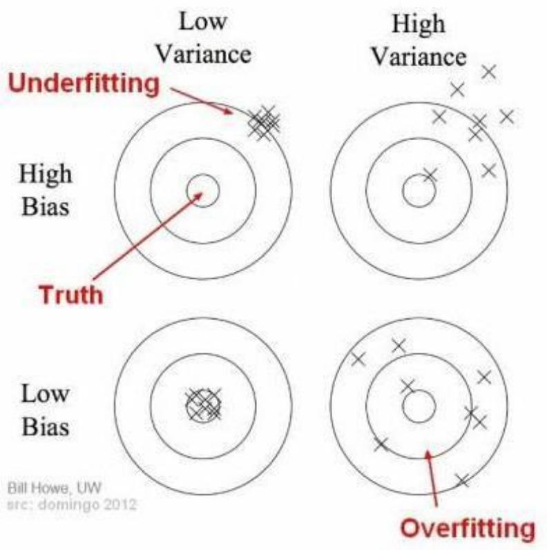

Giá trị thật dữ liệu (ground truth) ở giữa tâm các đường tròn. Các dấu X là các giá trị dự đoán. Ta thấy nếu high bias thì giá trị dự đoán rất xa tâm. Tuy nhiên nếu high variance thì các giá trị dự đoán phân tán rộng dẫn đến việc ra giá trị thực tế. $= >$ Ta mong muốn low bias và low variance.

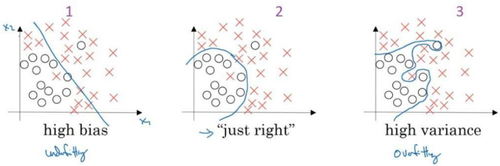

Đây là bài toán logistic regression, cần tìm đường phân chia dữ liệu.

Ở hình 1, thì đường phân chia có khá nhiều điểm bị $\mathrm { l } \tilde { \hat { \mathrm { o } } } \mathrm { i } = >$ sự chênh lệch giữa mô hình dự đoán và giá trị thực tế của dữ liệu cao $= >$ high bias, hay còn được gọi là underfitting, ý hiểu là mô hình hiện tại đơn giản hơn và chưa mô tả được mô hình của dữ liệu thực tế.

Ở hình 2, đường phân chia vẫn có lỗi nhưng ở mức chấp nhận được và nó có thể mô tả dữ liệu $= >$ low bias, low variance.

Ở hình 3, đường phân chia có thể dự đoán đúng tất cả các điểm trong training set nhưng vì nó không tổng quát hóa mô hình dữ liệu thực sự nên khi áp dụng dự đoán vào validation set thì sẽ có rất nhiều lỗi $= >$ high variance hay còn được gọi là overfitting, ý hiểu là mô hình hiện tại thực hiện tốt với dữ liệu trong training set nhưng dự đoán không tốt với validation set. Thực ra khái niệm high bias và high variance khá trìu tượng và nhiều lúc dùng nhầm lẫn giữa thống kê và machine learning. Nên khái niệm hay được dùng hơn là underfitting và overfitting.

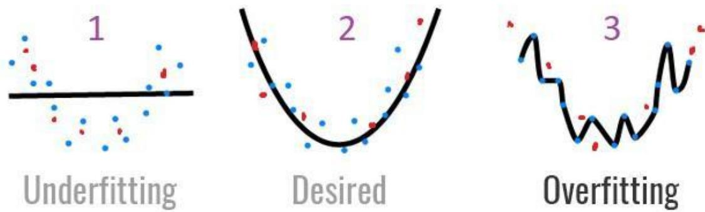  
Hình 12.3: Các điểm màu xanh là training set, điểm màu đỏ là validation set

Ví dụ khi luyện thi đại học, nếu bạn chỉ luyện khoảng 1-2 đề trước khi thi thì bạn sẽ bị underfitting vì bạn chưa hiểu hết cấu trúc, nội dung của đề thi. Tuy nhiên nếu bạn chỉ luyện kĩ 50 đề thầy cô giáo bạn soạn và đưa cho thì khả năng bạn sẽ bị overfitting với các đề mà thầy cô giáo các bạn soạn mà khi thi đại học có thể điểm số của các bạn vẫn tệ.

# 3.2 Bias, variance tradeoff

Nếu model quá đơn giản thì ta sẽ bị high bias và low variance. Tuy nhiên nếu model quá phức tạp thì sẽ bị high variance và low bias. Đấy là bias, variance tradeoff. Do đó để train được model tốt ta cần cân bằng giữa bias và variance.

# 3.3 Đánh giá bias and variance

Có 2 thông số thường được sử dụng $\mathtt { d } \overset { \triangledown } { \hat { \mathbf { e } } }$ đánh giá bias and variance của $\mathrm { m } \hat { \mathrm { o } }$ hình là training set error và validation set error. Ví dụ error (1-accuracy) trong logistic regression.

# 5. Activation function

# 5.1 Non-linear activation function

Hàm activation function được dùng sau bước tính tổng linear trong neural network hoặc sau convolutional layer trong CNN. Và hàm activation là non-linear function.

Linear function là gì? Theo wiki, "a linear function from the real numbers to the real numbers is a function whose graph is a line in the plane ", tóm lại linear function $\mathrm { l } \dot { { \mathrm { a } } } \ \mathrm { m } \hat { \mathrm { { o t } } }$ đường thẳng dạng $\mathbf { y } = \mathbf { a } ^ { * } \mathbf { x } + \mathbf { b }$ . Vậy sẽ ra sao nếu hàm activation trong neural network là một linear function?

Giả sử hàm activation dạng $\mathbf { y } = \mathbf { f } ( \mathbf { x } ) = 2 ^ { * } \mathbf { x } + 3$ và neural network như sau:

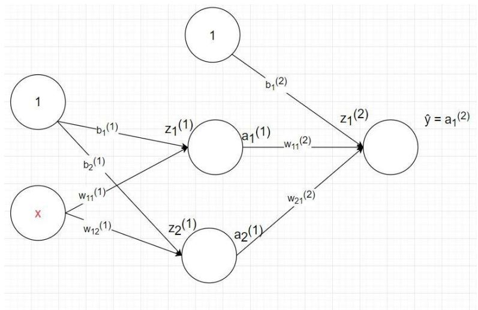  
Hình 12.5: Mô hình neural network, 1-2-1.

$$
\begin{array} { r } { z _ { 1 } ^ { ( 1 ) } = b _ { 1 } ^ { ( 1 ) } + x * w _ { 1 1 } ^ { ( 1 ) } = > a _ { 1 } ^ { ( 1 ) } = f ( z _ { 1 } ^ { ( 1 ) } = 2 * z _ { 1 } ^ { ( 1 ) } + 3 = 2 * ( b _ { 1 } ^ { ( 1 ) } + x * w _ { 1 1 } ^ { ( 1 ) } ) + 3 } \end{array}
$$

Tương tự $a _ { 2 } ^ { ( 1 ) } = 2 * ( b _ { 2 } ^ { ( 1 ) } + x * w _ { 1 2 } ^ { ( 1 ) } ) + 3$

Do đó

$$
\begin{array} { r } { \nu ^ { \ast = { a _ { 1 } ^ { ( 2 ) } } } = f ( z _ { 1 } ^ { ( 2 ) } ) = 2 \ast z _ { 1 } ^ { ( 2 ) } + 3 = 2 \ast ( b _ { 1 } ^ { ( 2 ) } + a _ { 1 } ^ { ( 1 ) } \ast w _ { 1 1 } ^ { ( 2 ) } + a _ { 2 } ^ { ( 1 ) } \ast w _ { 2 1 } ^ { ( 2 ) } ) + 3 = 2 \ast ( b _ { 1 } ^ { ( 2 ) } + ( 2 \ast ( b _ { 1 } ^ { ( 1 ) } + a _ { 1 } ^ { ( 1 ) } + a _ { 2 } ^ { ( 1 ) } + b _ { 1 } ^ { ( 2 ) } ) ) ) . } \end{array}
$$

x

$$
\begin{array} { r l } & { \ast w _ { 1 1 } ^ { ( 1 ) } ) + 3 ) \ast w _ { 1 1 } ^ { ( 2 ) } + \big ( 2 \ast ( b _ { 2 } ^ { ( 1 ) } + x \ast w _ { 1 2 } ^ { ( 1 ) } ) + 3 ) \ast w _ { 2 1 } ^ { ( 2 ) } \big ) + 3 = x \ast \big ( 4 \ast w _ { 1 1 } ^ { ( 1 ) } \ast w _ { 1 1 } ^ { ( 2 ) } + 4 \ast w _ { 1 2 } ^ { ( 1 ) } \ast w _ { 2 1 } ^ { ( 2 ) } \big ) + } \\ & { \big ( 2 \ast ( b _ { 1 } ^ { ( 2 ) } + ( 2 \ast b _ { 1 } ^ { ( 1 ) } + 3 ) \ast w _ { 1 1 } ^ { ( 2 ) } + \big ( 2 \ast b _ { 2 } ^ { ( 1 ) } + 3 \big ) \ast w _ { 2 1 } ^ { ( 2 ) } \big ) + 3 \big ) } \end{array}
$$

Tóm lại $\scriptstyle y ^ { \widehat { } } = x * a + b$ hay nói cách khác mô hình neural network chỉ là mô hình linear regression đơn giản $\mathbf { \alpha } = > \mathbf { H } \mathbf { \dot { a } } \mathbf { m }$ activation function phải là non-linear function.

# 5.2 Vanishing và exploding gradient

Backpropagation là thuật toán được dùng để tính đạo hàm các hệ số trong neural network với loss function đề rồi áp dụng gradient descent để tìm các hệ số.

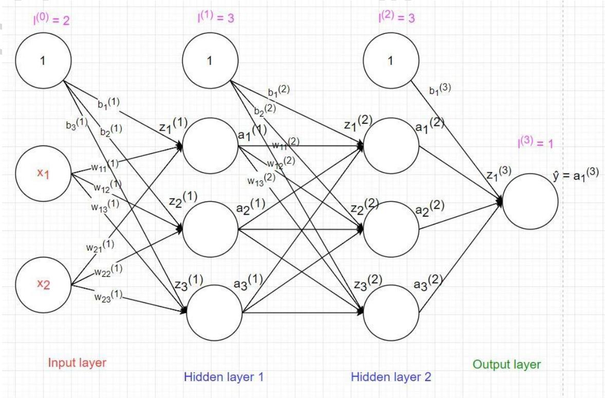  
Hình 12.6: Mô hình neural network 2-3-3-1

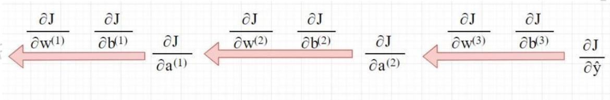  
Hình 12.7: Quá trình backpropagation

Ta có tổng quát:

$$
\frac { \partial J } { \partial \hat { A } ^ { ( l ) } } = \frac { \partial J } { \partial \hat { Y } } \cdot \prod _ { i = l + 1 } ^ { n } D ^ { ( i ) } W ^ { ( i ) }
$$

Nhận xét:

• Nếu các hệ số W và D đều nhỏ hơn 1 thì khi tính gradient ở các layer đầu ta sẽ phải nhân tích của rất nhiều số nhỏ hơn 1 nên giá trị sẽ tiến dần về 0 và bước cập nhật hệ số trong gradient descent trở nên vô nghĩa và các hệ số neural network sẽ không học được nữa. $= >$

# Vanishing gradient

Nếu các hệ số W và D đều lớn hơn 1 thì khi tính gradient ở các layer đầu ta sẽ phải nhân tích của rất nhiều số lớn hơn 1 nên giá trị sẽ tiến dần về vô cùng và bước cập nhật hệ số trong gradient descent trở nên không chính xác và các hệ số neural network sẽ không học được nữa. $= >$ Exploding gradient

Cách giải quyết vaninshing/exproding gradient là lựa chọn các giá trị khởi tạo cho hệ số phù hợp và chọn activation function phù hợp.

# 5.3 Một số activation thông dụng

# 5.3.1 Sigmoid activation function

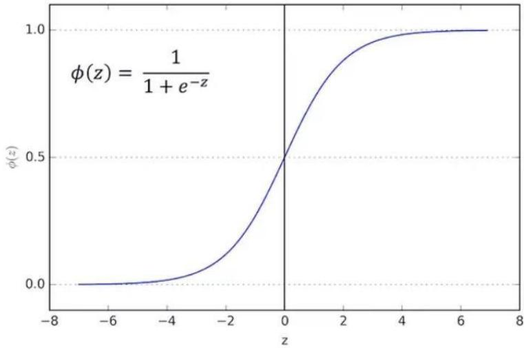  
Hình 12.8: Hàm sigmoid

Đạo hàm hàm sigmoid là $\begin{array} { r } { \sigma ( x ) \cdot \left( 1 - \sigma ( x ) \right) \leq \frac { 1 } { 4 } } \end{array}$   
$\mathrm { V i } \ d \ u \stackrel { ( } { 4 } ) ^ { 2 0 } = 9 * 1 0 ^ { - 1 3 }$ nên nếu bạn nhìn vào công thức (1) $\dot { \mathbf { O } }$ trên thì $\dot { \mathbf { O } }$ những layer đầu tiên sẽ bị vanishing gradient.

# Tanh activation function

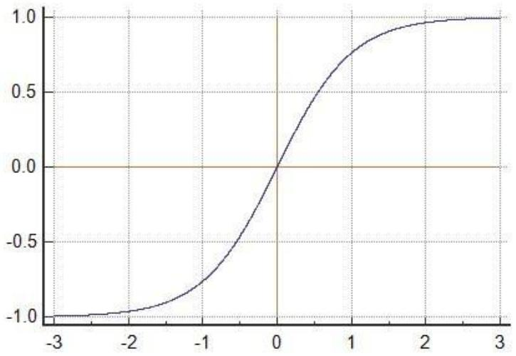  
Hình 12.9: Hàm tanh

Hàm tanh: $\begin{array} { r } { g ( x ) = \frac { e ^ { x } - e ^ { - x } } { e ^ { x } + e ^ { - x } } . } \end{array}$ ?? −?? ????+??−??, giá trị g(x) trong đoạn (-1,1)

Đạo hàm hàm tanh: $1 - g ^ { 2 } ( x ) \le 1$ . Do đó khi dùng tanh activation function sẽ bị vanishing gradient.

# ReLU activation function

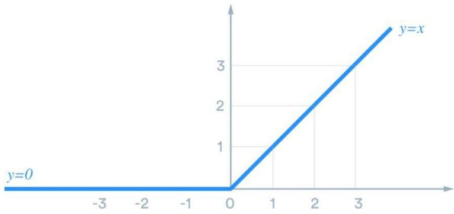  
Hình 12.10: Hàm ReLU

Hàm relu (rectified linear unit): $y = m a x ( 0 , x )$ Nhận xét:

Hàm ReLU activation đơn giản để tính $= >$ thời gian train model nhanh hơn.   
Đạo hàm là 1 với $\mathbf { \boldsymbol { x } } > = 0$ nên không bị vanishing gradient.

Tuy nhiên với các node có giá trị nhỏ hơn 0, qua ReLU activation sẽ thành 0, hiện tượng đấy gọi là "Dying ReLU". Nếu các node bị chuyển thành 0 thì sẽ không có ý nghĩa với bước linear activation ở lớp tiếp theo và các hệ số tương ứng từ node đấy cũng không được cập nhật với gradient descent. $= >$ Leaky ReLU ra đời.

# Leaky ReLU

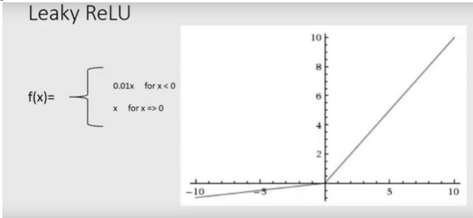  
Hình 12.11: Hàm Leaky ReLU

Hàm Leaky ReLU có các điểm tốt của hàm ReLU và giải quyết được vấn đề Dying ReLU bằng cách xét một độ dốc nhỏ cho các giá trị âm thay vì để giá trị là 0.

Lời khuyên: Mặc định nên dùng ReLU làm hàm activation. Không nên dùng hàm sigmoid.

# 6. Batch Normalize

Một trong những giả định chính trong được đưa ra trong quá trình huấn luyện một mô hình học máy đó là phân phối của dữ liệu được giữ nguyên trong suốt quá trình training. Đối với các mô hình tuyến tính, đơn giản là ánh xạ input với output thích hợp, điều kiện này luôn được thỏa mãn. Tuy nhiên, trong trường hợp Neural Network với các lớp được xếp chồng lên nhau, ảnh hưởng của các hàm activation non-linear, điều kiện trên không còn đúng nữa.

Trong kiến trúc neural network, đầu vào của mỗi lớp phụ thuộc nhiều vào tham số của toàn bộ các lớp trước đó. Hậu quả là trong quá trình backprop, các trọng số của một lớp được cập nhật dẫn đến những thay đổi về mặt dữ liệu sau khi đi qua lớp đó, những thay đổi này bị khuyếch đại khi mạng trở nên sâu hơn và cuối cùng làm phân phối của bản đồ đặc trưng (feature map) thay đổi, đây được gọi là hiện tượng covariance shifting. Khi huấn luyện, các lớp luôn phải điều chỉnh trọng số để đáp ứng những thay đổi về phân phối dữ liệu nhận được từ các lớp trước, điều này làm chậm quá trình hội tụ của mô hình.

# 6.1 Phân tích nguyên nhân

Vấn đề 1 : Khi dữ liệu chứa nhiều thành phần lớn hơn hoặc nhỏ hơn 0 và không phân bố quanh giá trị trung bình 0 (Non zero mean), kết hợp với việc phương sai lớn (high variance) làm cho dữ liệu chứa nhiều thành phần rất lớn hoặc rất nhỏ. Trong quá trình cập nhật trọng số bằng gradient descent, giá trị của dữ liệu ảnh hưởng trực tiếp lên giá trị đạo hàm (gradient), do đó làm giá trị gradient trở nên quá lớn hoặc qúa nhỏ, như chúng ta đã biết điều này không hề tốt chút nào. Hiện tượng trên xuất hiện khá phổ biến, phụ thuộc nhiều vào việc khởi tạo trọng số, và có xu hướng nghiêm trọng hơn khi mạng ngày càng sâu.

$= >$ Cần một bước normalize các thành phần dữ liệu về cùng mean và chuẩn hóa variance.

Vấn đề 2 : Các hàm activation non-linear như sigmoid, relu, tanh,... đều có ngưỡng hay vùng bão hòa. Khi lan truyền thẳng, nếu dữ liệu có các thành phần quá lớn hoặc quá nhỏ, sau khi đi qua các hàm activation, các thành phần này sẽ rơi vào vùng bão hòa và có đầu ra giống nhau. Điều này dẫn đến luồng dữ liệu sau đó trở nên giống nhau khi lan truyền trong mạng (covariance

shifting), lúc này các lớp còn lại trong mạng không còn phân biệt được các đặc trưng khác nhau. Ngoài ra, đạo hàm tại ngưỡng của các hàm activation bằng 0, điều này cũng khiến mô hình bị vanishing gradient.

$\mathrm { = } \mathrm { > } \mathrm { C a n m \hat { \mathrm { \Omega } } \mathrm { \Omega } }$ bước normalize dữ liệu trước khi đi qua hàm activation.

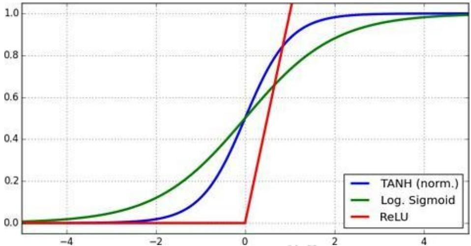  
Hình 12.12: Đồ thị các hàm activation

# 6.2 Batch Normalization ra đời

Batch normalization thực hiện việc chuẩn hóa (normalizing) và zero centering (mean substracting) dữ liệu trước khi đưa qua hàm activation (giá trị trung bình (mean) sẽ được đưa về 0 và phương sai (variance) sẽ được đưa về 1). Để thực hiện 2 công việc trên, batch normalization tính toán phương sai và độ lệch chuẩn của dữ liệu dựa trên các batchs, rồi sử dụng 2 tham $\mathrm { s } \acute { \hat { 0 } } \gamma$ và $\beta$ tinh chỉnh đầu ra.

Batch normalization:

$\begin{array} { l } { \mu _ { B } = \frac { 1 } { m _ { B } } \sum _ { i = 1 } ^ { m _ { B } } x ( i ) } \\ { \sigma _ { B } ^ { 2 } = \frac { 1 } { m _ { B } } \sum _ { i = 1 } ^ { m _ { B } } ( x ^ { ( i ) } - \mu _ { B } ) } \\ { x ^ { ( i ) } = ( x ^ { ( i ) } - \mu _ { B } ) / ( \sqrt { \sigma _ { B } ^ { 2 } + \xi } ) } \\ { z _ { ( i ) } = \gamma x ^ { \cdot } + \beta } \end{array}$   
Trong đó: $\mu _ { B }$ là giá trị trung bình của batch B   
$\boldsymbol { \sigma ^ { 2 } } _ { B }$ là phương sai của batch B   
$x ^ { \sim ( i ) }$ là giá trị của mẫu thứ i trong batch B sau khi được normalize và zero centering $\boldsymbol { z } _ { ( i ) }$ là đầu ra của mẫu thứ i trong batch B   
γ là scaling parameter của lớp   
$\beta$ là shifting parameter của lớp   
$\xi | \mathrm { \grave { a } }$ smoothing parameter, tránh xảy ra việc chia cho 0, giá trị rất nhỏ   
Chú ý: γ và $\beta$ là 2 tham số được học trong quá trình training.

# 6.3 Hiệu quả của batch normalization

Batch normalization đưa dữ liệu về zero mean và chuẩn hóa variance trước khi đưa qua activation function nhờ đó giải quyết các vấn đề vanishing gradient hay exploding gradient.

• Batch normalization cho phép learning rate lớn trong quá trình huấn luyện. • Batch-Norm giảm thiểu sự ảnh hưởng của quá trình khởi tạo trọng số ban đầu. • Batch-Norm chuẩn hóa dữ liệu đầu ra của các layer giúp model trong quá trình huấn luyện không bị phụ thuộc vào một thành phần trọng số nhất định. Do đó, Batch-norm còn được sử dụng như một regularizer giúp giảm overfitting