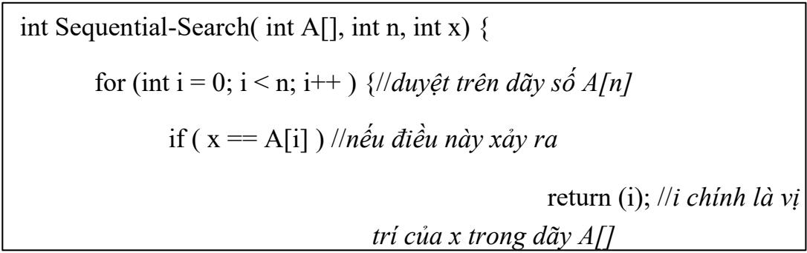

# 1. Một số thuật toán tìm kiếm thông dụng

Tìm kiếm là lĩnh vực quan trọng của khoa học máy tính có mặt trong hầu hết các ứng dụng trên máy tính. Các thuật toán tìm kiếm được chia thành ba loại: tìm kiếm trên các đối tượng dữ liệu chưa được sắp xếp (tìm kiếm tuyến tính), tìm kiếm trên các đối tượng dữ liệu đã được sắp xếp (tìm kiếm nhị phân) và tìm kiếm xấp xỉ. Nội dung cụ thể của các phương pháp được thể hiện như dưới đây.

# 1.1 Thuật toán tìm kiếm tuyến tính (Sequential Search)

Thuật toán tìm kiếm tuyến tính áp dụng cho tất cả các đối tượng dữ liệu chưa được sắp xếp. Để tìm vị trí của $x$ trong dãy A[] gồm n phần tử, ta chỉ cần duyệt tuần tự trên dãy A[] từ phần tử đầu tiên đến phần tử cuối cùng. Nếu $x = \mathsf { A } [ i ]$ thì $i$ chính là vị trí của $x$ thuộc dãy A[]. Nếu duyệt đến phần tử cuối cùng vẫn chưa tìm thấy $x$ ta kết luận $x$ không có mặt trong dãy số A[]. Thuật toán được mô tả chi tiết trong Hình 3.9.

# 1.1.1 Biểu diễn thuật toán

  
Hình 3.9. Thuật toán Sequential-Search.}

# 1.1.2 Độ phức tạp thuật toán

Độ phức tạp thuật toán là ${ \mathrm { O } } ( { \mathrm { n } } )$ , với n là số lượng phần tử trong dãy A[].

# 1.1.3 Kiểm nghiệm thuật toán

Ví dụ ta cần tìm} $\mathbf { \boldsymbol { x } } = \mathbf { \boldsymbol { 9 } }$ trong dãy $\mathrm { A } [ \mathrm { ] } = \{ 5 6 , 3 , 2 4 9 , 5 1 8 , 7 , 2 6 , 9 4 , 6 5 1 , 2 3 , 9 \} _ { \mathrm { \Omega } }$

Khi đó quá trình tìm kiếm được thể hiện như dưới đây.

trong danh sách A[].

Trường hợp 2: Nếu x lớn hơn phần tử ở giữa thì nếu x có mặt trọng dãy A[] thì ta chỉ cần tìm các phần tử từ mid $+ 1$ đến vị trí thứ n.

Trường hợp 3: Nếu x nhỏ hơn A[mid] thì x chỉ có thể ở dãy con bên trái của dãy A[].

Lặp lại quá trình trên cho đến khi cận dưới vượt cận trên của dãy A[] mà vẫn chưa tìm thấy $x$ thì ta kết luận $x$ không có mặt trong dãy A[]. Thuật toán được mô tả chi tiết trong Hình 3.10.

# 1.2.1 Biểu diễn thuật toán

int Binary-Search( int $\mathsf { A } [ ]$ , int n, int x) {1ltim vi tri cua x trong day A int $\mathsf { l o w } = 0 ; / / c \hat { a } n$ duói cúa dāy khóa int hight $= n - 1$ ;/lcàn trén cúa dāy khóa int mid $=$ (low+hight)/2; //phàn túr ō giüra while(low $< =$ hight) $\{$ lllǎp trong khi càn durói vān nhó hon càn trén if ( × > A[mid] ) //néu x lón hon phàn tú ∂ giüra $\mathsf { l o w } = \mathsf { m i d } + 1$ ; llcàn durói duroc dǎt lēn vi trí mid $+ 1$ els if $( \mathsf { x } < \mathsf { A } [ \mathsf { i } ] )$ (d) hight $=$ mid -1;//càn trén lùi vè vi trí mid-1 else return(mide); llday chính là vi trí cúa x mid $=$ (low $^ +$ hight)/2; llxác dinh lai phàn túr ó giüra } return(-1); /1khong tháy $x$ trong dāy khóa AI.   
}

# 1.2.2 Độ phức tạp thuật toán

Độ phức tạp thuật toán là $\mathrm { O } ( \log ( \mathfrak { n } ) )$ , với n là số lượng phần tử của dãy A[].

# 1.2.3 Kiểm nghiệm thuật toán

Ví dụ ta cần tìm $\mathbf { x } = 2 3$ trong dãy $\mathrm { A [ ] } = \{ 2 , 5 , 8 , 1 2 , 1 6 , 2 3 , 3 8 , 5 6 , 7 2 , 9 1 \}$

Khi đó quá trình được tiến hành như dưới đây.

}

# 1.3 Thuật toán tìm kiếm nội suy

Thuật toán tìm kiếm kiểu nội suy (interpolation search) là cải tiến của thuật toán tìm kiếm nhị phân. Thuật toán tìm kiếm nhị phân luôn thực hiện so sánh khóa với phần tử ở giữa. Trong đó, thuật toán tìm kiếm nội suy định vị giá trị so sánh tùy thuộc vào giá trị của khóa cần tìm. Bằng cách này, giá trị của khóa cần tìm kiếm dù ở đầu dãy, cuối dãy hay vị trí bất kỳ thuật toán đều tìm được vị trí gần nhất để thực hiện so sánh. Thuật toán được mô tả chi tiết trong Hình 3.11.

# 1.3.1 Biểu diễn thuật toán

if $\mathbf { \dot { \sigma } } ( \mathbf { x } < \mathbf { A } [ \mathbf { L } ] \parallel \mathbf { x } > \mathbf { A } [ \mathbf { H } ] ) / / n \acute { e } u \ d i \hat { e } u \ n \dot { a } y \ x \dot { a } y \ r a$ return -1; //chắc chắn $x$ không có mặt trong dãy A[] while $\left( \mathrm { L } < = \mathrm { H } \right)$ {//lặp trong khi cận dưới bé hơn cận trên $\mathrm { i n t } \ \mathrm { p o s } = \mathrm { L } + ( ( \mathrm { ( H \mathrm { - } L ) } / ( \mathrm { A [ H ] \mathrm { - } A [ L ] ) } ) ^ { \ast } ( \mathrm { x \mathrm { - } A [ L ] ) } ) \mathrm { ; }$ //xác định vị trí if $( \mathrm { A } [ \mathrm { p o s } ] = = \mathbf { x } ) / / n \acute { e } u$ vị trí đúng là $x$ return pos; //đây là vị trí cần tìm i $\mathrm { f } \left( \mathrm { A } [ \mathrm { p o s } ] < \mathrm { x } \right) / / n \acute { e } u x$ lớn hơn A[pos] $\mathrm { L } = \mathsf { p o s } + 1$ ; //dịch cận dưới lên 1 else //nếu $x$ bé hơn A[pos] $\mathrm { H } = \mathsf { p o s } - 1$ ; //giảm cận trên đi 1 } return -1; //kết luận không tìm thấy } int main(){ int $\mathrm { A [ ] } = \{ 1 0 , 1 2 , 1 3 , 1 6 , 3 1 , 3 3 , 3 5 , 4 2 , 4 7 \} \mathrm { ; }$ ; int $\mathbf { n } =$ sizeof(A)/sizeof(A[0]); int x $= 4 2$ ; //phần tử cần tìm int index $=$ interpolationSearch(A, n, x); if (index $! = - 1$ )//nếu tìm thấy $x$ cout<<"Vị trí:"<<index; else cout<<"Không tìm thấy x"; }

# 1.4 Thuật toán tìm kiếm Jumping

Thuật toán tìm kiếm Jumping được thực hiện bằng cách so sánh phần tử cần tìm với bước nhảy là một hàm mũ. Nếu khóa cần tìm lớn hơn phần tử tại bước nhảy ta nhảy tiếp một khoảng cũng là một hàm mũ. Trong trường hợp, khóa cần tìm nhỏ hơn phần tử tại bước nhảy, ta quay lại bước trước đó và thực hiện phép tìm kiếm tuyến tính thuần túy. Thuật toán được mô tả chi tiết trong Hình 3.12.

# 1.4.1 Biểu diễn thuật toán

Hình 3.12. Thuật toán Jumping Search.   

int JumpSearch(int A], int n, int x){ Ithuat toán Jumping Search int step $=$ (int) sqrt(n); llxác dinh buróc nháy int prev $= 0$ ; llgiá tri khǒi dàu buróc nháy truróc int $\mathsf { r } =$ min(step,n)-1;//vi trí càn so sánh while $( \mathsf { A } [ \mathsf { r } ] < \mathsf { x } )$ ){ll lǎp néu x lón hon phàn tú vi trí r prev $=$ step; l/luu lai giá tri buóc nháy truróc step $+ =$ (int)sqrt(n);/ltǎng buóc nhay them khoáng cǎn bác 2 if $( \mathsf { p r e v } > = \mathsf { n } _ { \beta }$ ) llnéu dièu này xáy ra return -1; llchác chán × khōng có trong day Al r = min(step,n)-1; lltính toán lai vi trí càn so sánh } while (A[prev] $< \times$ ){/lthyrc hiēn tim kiém tuyén tinh thong thuòng $\scriptstyle { \mathsf { p r e v } } + +$ ; if $( \mathsf { p r e v } = = \mathsf { m i n } ( \mathsf { s t e p } , \mathsf { n } ) )$ return $^ { - 1 }$ ; } if (A[prev] $\mathbf { \omega } = \mathbf { \omega } \times \mathbf { \omega }$ ) lInéu tim tháy $x$ return prev; return -1;//khöng tim tháy x   
}

# 1.4.2 Độ phức tạp thuật toán

Độ phức tạp thuật toán trong trường hợp tốt, xấu nhất là $O ( { \sqrt { n } } ) $ . Trường hợp tốt nhất là O(log(n)), với n là số lượng phần tử của dãy $\mathbf { A } [ ]$ .

# 1.4.3 Kiểm nghiệm thuật toán

Giả sử ta cần tìm vị trí của $\tt { x } = 5 5$ trong dãy $\mathrm { s } \mathring { \hat { \boldsymbol { \alpha } } } \mathrm { A } [ ] = \left\{ \right. 0 , 1 , 1 , 2 , 3 , 5 , 8 , 1 3 , 2 1 ,$ 34, 55, 89, 144, 233, 377, 610}. Khi đó, thuật toán được thực hiện như sau:

Bước 1. Ta tìm được step $^ { - 4 }$ . So sánh 53 với vị trí $5 \hat { 0 } \mathrm { ~ A } [ 3 ] { = } 2 { < } 5 5$ .

Bước 2. Dịch chuyển step $= 8$ , so sánh 53 với vị trí số $\mathrm { A } [ 7 ] = 1 3 < 5 5$ .

Bước 3. Dịch chuyển step $= 1 6$ , so sánh 53 với vị trí số

A[15 $] { = } 6 1 0 { > } 5 5$ . Bước 4. Vì $6 1 0 { > } 5 5$ nên ta trở $\mathbf { v } \dot { \hat { \mathbf { e } } }$ bước trước đó cộng thêm 1 là 9.

Bước 5. Tìm kiếm tuyến tính từ vị trí 9 đến 15 ta nhận được kết quả là 10.

1.4.4 Cài đặt thuật toán #include <iostream>

#include <cmath> using namespace std; int JumpSearch(int A[], int n, int x){ //thuật toán Jumping Search int step $=$ (int) sqrt(n); //giá trị bước nhảy int prev $= 0$ ; //giá trị bước nhảy trước int r = min(step,n)-1;//vị trí cần so sánh while $( \mathrm { A } [ \mathrm { r } ] { < } \mathrm { x } )$ ) {//lặp trong khi $A / r ] { < } x$ prev $=$ step; //lưu lại giá trị bước trước step $+ =$ (int)sqrt(n);//tăng bước nhảy if $( \mathrm { p r e v } > = \mathbf { n } _ { \mathrm { ~ } }$ ) //nếu điều này xảy ra return -1; //x chắc chắn không có trong A[] r = min(step,n)-1; //tính toán lại vị trí cần so sánh } while $( \mathrm { A } [ \mathrm { p r e v } ] < \mathbf { X } )$ {//tìm kiếm tuyến tính thông thường $\mathrm { p r e v } { + + }$ ; if $( \mathrm { p r e v } = = \mathrm { m i n } ( \mathrm { s t e p } , \mathrm { n } ) )$ return $^ { - 1 }$ ; } if $( \mathrm { A } [ \mathrm { p r e v } ] = = \mathbf { X } )$ ) //nếu tìm thấy $x$ return prev; return -1;//không tìm thấy $x$ } int main(void){ int $\mathrm { A } [ \mathrm { ] } = \left\{ \ 0 , 1 , 1 , 2 , 3 , 5 , 8 , 1 3 , 2 1 , \right.$ 34, 55, 89, 144, 233, 377, 610}; int $\mathbf { x } = 2 3 3$ , $\mathbf { n } =$ sizeof(A)/sizeof(A[0]); int index $=$ JumpSearch $\scriptstyle ( \operatorname { A } , \ n , \mathbf { X } )$ ; if (index! $\scriptstyle ! = - 1$ ) cout<<"\n Vị trí:"<<index; else cout $< < " \mathrm { w } _ { \mathrm { n } }$ Không tìm thấy x"; }

