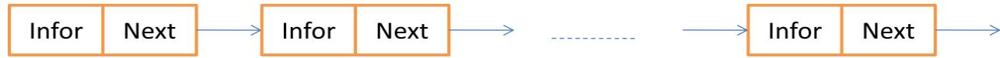
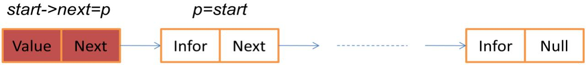
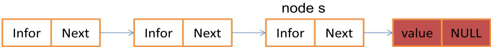
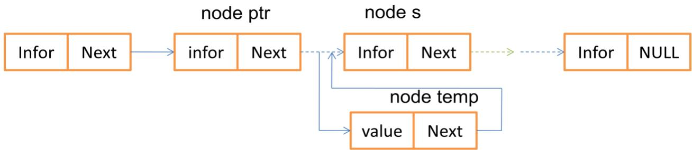

Như đã trình bày trong Chương 1, một kiểu dữ liệu trừu tượng (ADTs) được xác định khi ta xây dựng đầy đủ hai phần: cấu trúc dữ liệu cùng các phép toán trên cấu trúc dữ liệu đó. Nội dung của chương này trình bày ba kiểu dữ liệu trừu tượng quan trọng đó là danh sách liên kết, ngăn xếp và hàng đợi. Mỗi kiểu dữ liệu trừu tượng được xây dựng giải quyết lớp các vấn đề cụ thể của khoa học máy tính. Đối với người học, mỗi cấu trúc dữ liệu trừu tượng cần làm chủ được bốn điểm quan trọng sau:

Định nghĩa cấu trúc dữ liệu ADTs. ● Biểu diễn cấu trúc dữ liệu ADTs. Thao tác (phép toán) trên cấu trúc dữ liệu ADTs. Ứng dụng của cấu trúc dữ liệu ADTs.

# 1. Danh sách liên kết đơn (Single Linked List)

Như ta đã biết mảng (array) là tập có thứ tự các phần tử có cùng chung một kiểu dữ liệu và được tổ chức liên tục nhau trong bộ nhớ. Ưu điểm lớn nhất của mảng là đơn giản và xử lý nhanh nhờ cơ chế truy cập phần tử trực tiếp vào các phần tử của mảng. Hạn chế lớn nhất của mảng là số lượng phần tử không thay đổi gây nên hiện tượng thừa bộ nhớ trong một số trường hợp và thiếu bộ nhớ trong một số trường hợp khác. Đối với một số bài toán có dữ liệu lớn, nhiều khi ta không đủ không gian nhớ tự do liên tục để cấp phát cho mảng. Để khắc phục hạn chế này ta có thể xây dựng kiểu dữ liệu danh sách liên kết đơn được định nghĩa, biểu diễn và thao tác như dưới đây.

# 1.1 Định nghĩa danh sách liên kết đơn

Tập hợp các node thông tin được tổ chức rời rạc trong bộ nhớ. Trong đó, mỗi node gồm có hai thành phần:

• Thành phần dữ liệu (data): dùng để lưu trữ thông tin của node.   
• Thành phần con trỏ (pointer): dùng để liên kết với node dữ liệu tiếp theo.

# 1.2 Biểu diễn danh sách liên kết đơn

Để biểu diễn danh sách liên kết đơn ta sử dụng phương pháp định nghĩa cấu trúc tự trỏ của các ngôn ngữ lập trình. Giả sử thành phần thông tin của mỗi node được định nghĩa như một cấu trúc Item như sau:

struct Item { <Kiểu 1> <Thành viên $1 >$ ; <Kiểu $2 >$ <Thành viên $2 >$ ;

<Kiểu N> <Thành viên $\mathrm { N } >$ ; };

Khi đó, danh sách liên kết đơn được định nghĩa như sau: struct node { Item infor; //Thành phần thông tin của node; struct node \*next; //thành phần con trỏ của node } \*Start; //Start là một danh sách liên kết đơn

# Hình 3.1. Biểu diễn danh sách liên kết đơn

# 1.3 Thao tác trên danh sách liên kết đơn

Các thao tác trên danh sách liên kết đơn bao gồm:

Tạo node rời rạc có giá trị value cho danh sách liên kết đơn   
Thêm một node vào đầu danh sách liên kết đơn. Thêm một node vào cuối danh sách liên kết đơn. Thêm node vào vị trí xác định trong danh sách liên kết đơn.   
Loại node trong sách liên kết đơn.   
Tìm node trong sách liên kết đơn. Sắp xếp node trong danh sách liên kết đơn. Sửa đổi nội dung node trong sách liên kết đơn.   
• Đảo ngược các node trong danh sách liên kết đơn. Duyệt các node của danh sách liên kết đơn.

Để đơn giản, ta xem thành phần thông tin của node (Item) là một số nguyên. Khi đó, các thao tác trên danh sách liên kết đơn ta định nghĩa một lớp các thao tác như sau:

struct node { // biểu diễn node int info; //thành phần thông tin của node struct node \*next; //thành phần con trỏ của node   
}\*start; // danh sách liên kết đơn: \*start.   
class single_linked_list { //biểu diễn lớp danh sách liên kết đơn public: node\* create_node(int);//Tạo một node cho danh sách liên kết đơn void insert_begin(); //thêm node vào đầu DSLKĐ void insert_pos(); //thêm node tại vị trí cụ thể trên DSLKĐ

void insert_last(); //thêm node vào cuối DSLKĐ void delete_pos(); //loại node tại vị trí cho trước trên DSLKĐ void sort(); //sắp xếp nội dung các node theo thứ tự tăng dần void search(); //tìm kiếm node trên DSLKĐ void update(); //sửa đổi thông tin của node trên DSLKĐ void reverse(); //đảo ngược danh sách liên kết đơn void display(); //hiển thị nội dung DSLKĐ single_linked_list(){//constructor của lớp single linked list. start $=$ NULL;//chú ý start là biến toàn cục } };

Thao tác: tạo một node rời rạc có giá trị value cho DSLKĐ. node \*single_linked_list::create_node(int value){ struct node \*temp; //khai báo hai con trỏ node \*temp temp $=$ new(struct node); //cấp phát miền nhớ cho temp if (temp $= =$ NULL){ //nếu không đủ không gian nhớ cout<<“không đủ bộ nhớ để cấp phát"<<endl; return 0; else { temp- $\mathrm { > }$ info $=$ value;//thiết lập thông tin cho node temp temp->next $=$ NULL; //thiết lập liên kết cho node temp return temp;//trả lại node temp đã được thiết lập } }

# Thao tác: thêm node vào đầu DSLKĐ.

void single_linked_list::insert_begin(){ //chèn node vào đầu DSLKĐ int value; cout<<“Nhập giá trị node:"; cin>>value; //giá trị node cần chèn struct node \*temp, \*p; //sử dụng hai con trỏ temp và p temp $=$ create_node(value);//tạo một node rời rạc có giá trị value if (start $= =$ NULL){ //nếu danh sách liên kết rỗng start $=$ temp; //danh sách liên kết chính là node temp start->next $=$ NULL; //không có liêt kết với node khác } else $\{$ //nếu danh sách không rỗng

${ \mathfrak { p } } ^ { = }$ start; //p trỏ đến node đầu của start start $=$ temp; //node temp trở thành node đầu tiên của start start- $\mathrm { . > }$ next $=$ p;//các node còn lại chính là p } }

Hình 3.2. dưới đây mô tả phép thêm node vào đầu danh sách liên kết đơn.

  
Hình 3.2. Thêm node vào đầu danh sách liên kết đơn

start=temp

Thao tác thêm node vào cuối danh sách liên kết đơn:

void single_linked_list::insert_last(){//thêm node vào cuối DSLKĐ

int value; cout<<“Nhập giá trị cho node: ";cin>>value; //nhập giá trị node struct node \*temp, \*s; //sử dung hai con trỏ temp và s temp $=$ create_node(value);//tạo node rời rạc có giá trị value if(start $\mathrel { = }$ NULL) {//trường hợp DSLKĐ rỗng start $=$ temp; temp->next $\stackrel { \cdot } { = }$ NULL; } ${ \bf s } =$ start; //s trỏ đến node đầu danh sách while $\mathrm { \bf s } { - } >$ next $! =$ NULL){ //di chuyển s đến node cuối cùng $\mathbf { s } = \mathbf { s } \mathrm { - } \mathbf { \rho }$ next; } temp->next $=$ NULL; //temp không chỏ đi đâu nữa $\mathbf { S - } ^ { > }$ next $=$ temp; //thiết lập liên kết cho s cout<<“Hoàn thành thêm node vào cuối"<<endl; }

  
Hình 3.3. Thêm node vào cuối danh sách liên kết đơn

Thao tác thêm node vào vị trí pos của danh sách liên kết đơn:

ingle_linked_list::insert_pos(){//thêm node vào vị trí pos   
int value, pos, counter $= 0$ ; cout<<"Nhap gia tri   
node:";cin>>value; struct node \*temp, \*s, \*ptr; //sử dụng ba con   
trỏ node   
temp $=$ create_node(value);//tạo node rời rạc có giá trị value   
cout<<“Nhập vị trí node cần thêm:   
";cin>>pos; int i; ${ \bf s } =$ start; //s trỏ đến node   
đầu tiên   
while $( \mathrm { s } \mathrel { ! } \mathrm { = } \mathrm { N U L L } )$ { //đếm số node của DSLKĐ $\mathbf { s } = \mathbf { s } \mathrm { - } \mathbf { \rho }$ next; counter++;   
}   
if (counte $= = 0$ ) {//trường hợp DSLK đơn rỗng cout<<”Danh sách rỗng”; return;   
}   
if $( \mathsf { p o s } = = 1$ ){ //nếu pos là vị trí đầu tiên if (start $= =$ NULL){ //trường hợp DSLKĐ rỗng start $=$ temp; start->next $=$ NULL; } else { //thêm node temp vào đầu DSLKĐ ptr $=$ start; start $=$ temp; start- $>$ next $=$ ptr; }   
}   
else if $\mathrm { ( p o s > 1 }$ && pos $< =$ counter){ //trường hợp pos hợp lệ ${ \bf s } =$ start; //s trỏ đến node đầu tiên for $\mathrm { ( i = 1 ; i < p o s ; i + + ) } \{$ //di chuyển đến node pos-1 ptr $= \mathbf { s }$ ; $\mathbf { s } = \mathbf { s } \mathrm { - } \mathbf { \rho }$ next; } ptr->next $=$ temp; temp->next $= \mathbf { s }$ ; //thiết lập liên kết cho nod   
}   
else { cout<<“Vượt quá giới hạn DSLKĐ"<<endl; }

  
Hình 3.4. Thêm node vào vị trí pos

# Thao tác loại node tại vị trí pos:

void single_linked_list::delete_pos(){//loại node ở vị trí pos int pos, i, counter $= 0$ ; if (start == NULL){ //nếu danh sách liê kết đơn rỗng cout<<“Không thực hiện được"<<endl; return; } cout<<“Vị trí cần loại bỏ:";cin>>pos; struct node $^ * \mathrm { { s } }$ , \*ptr; ${ \bf s } =$ start; //s trỏ đến đầu danh sách if $( \mathsf { p o s } = = 1$ ){//nếu vị trí loại bỏ là node đầu tiên start $= \mathbf { s } \mathrm { - } \mathbf { > }$ next; s->next=NULL; free(s);} else $\{$ while $( \mathrm { s } \downarrow { = } \mathrm { N U L L }$ ) { //đếm số node của DSLKĐ $\mathbf { s } = \mathbf { s } \mathrm { - } \mathbf { \rho }$ next; counter++;} if $\mathrm { ( p o s > 0 }$ && pos $< =$ counter){ //nếu vị trí pos hợp lệ ${ \bf s } =$ start;//s trỏ đến node đầu của danh sách for $\mathrm { ( i = 1 ; i < p o s ; i + + ) } \{$ { //di chuyển đến vị trí pos-1 ptr $= \mathbf { s }$ ; $\mathbf { s } = \mathbf { s } \mathrm { - } \mathbf { \rho }$ next; } ptr->next = s->next; //thiết lập liên kết cho node } else $\{$ cout<<"Vi tri ngoai danh sach"<<endl; } free(s); //giải phóng s cout<<"Node da bi loai bo"<<endl; }   
}

  
Hình 3.5. Thao tác loại node ở vị trí pos

node ptr node s s ->next

# Thao tác sửa đổi nội dung của node:

void single_linked_list::update(){//sửa đổi thông tin của node

int value, pos, i; if (start $\scriptstyle = = \mathrm { N U L L }$ { //nếu danh sách LKĐ rỗng cout<<“Không thực hiện được"<<endl; return; } cout<<“Nhập vị trí node cần sửa:";cin>>pos; cout<<“Giá trị mới của node:";cin>>value; struct node $^ * \mathrm { { s } }$ , \*ptr; //sử dụng hai con trỏ s và ptr ${ \bf s } =$ start; //s trỏ đến node đầu tiên if $( \mathsf { p o s } = = 1$ ) $\{$ start- $\mathrm { . > }$ info $=$ value;} //sửa luôn node đầu tiên else { //nếu pos không phải là node đầu tiên for $( \mathrm { i } = 0 ; \mathrm { i } < \mathrm { p o s } - 1 ; \mathrm { i } + + )$ {//chuyển s đến vị trí pos-1 if (s == NULL){//Nếu s là node cuối cùng cout<<"Vị trí "<<pos<<" không hợp lệ“; return; } $\mathbf { s } = \mathbf { s } \mathrm { - } \mathbf { \rho }$ next; } s->info $=$ value; //Sửa đổi thông tin cho node } cout<<“Hoàn thành việc sửa đổi"<<endl; }

# Thao tác duyệt danh sách liên kết đơn:

void single_linked_list::display(){//hiển thị nội dung DSLKĐ

struct node \*temp; //sử dụng một con trỏ temp   
if (start $\mathbf { \Lambda } = = \mathbf { N } \mathbf { U } \mathbf { L } \mathbf { L }$ ){ // nếu danh sách rỗng cout<<“Có gì đâu mà hiển thị"<<endl; return;   
}   
temp $=$ start; //temp trỏ đến node đầu trong DSLKĐ   
cout<<“Nội dung DSLKĐ: "<<endl;   
while (temp $! = \mathrm { N U L L }$ ) { //lặp cho đến node cuối cùng cout<<temp->info<<"->"; //hiển thị thông tin node temp $=$ temp->next; //di chuyển đến node tiếp theo   
}   
cout<<"NULL"<<endl; //node cuối cùng là NULL   
}   
Thao tác tìm node trong danh sách liên kết đơn:   
void single_linked_list::search(){//Tìm kiếm node int value, $\mathtt { p o s } = 0$ ; bool flag $=$ false; if (start $\mathbf { \Lambda } = = \mathbf { N } \mathbf { U } \mathbf { L } \mathbf { L }$ ){//nếu danh sách rỗng cout<<“ta không có gì để tìm"<<endl; return; } cout<<“Nội dung node cần tìm:";cin>>value; struct node $^ * \mathrm { { s } }$ ; ${ \bf s } =$ start;//s trỏ đến đầu danh sách while $( \mathrm { s } \downarrow { = } \mathrm { N U L L }$ ) $\{ \mathfrak { p o s } ^ { + + }$ ; if (s->info $= =$ value){//Nếu $s { - } >$ infor là value flag $=$ true; cout<<“Tìm thấy "<<value<<" tại vị trí "<<pos<<endl; } $\mathbf { s } = \mathbf { s } \mathrm { - } \mathbf { \rho }$ next; } if (!flag) {//đến cuối vẫn không thấy cout<<“Giá trị"<<value<<“không tồn tại"<<endl; }   
}   
Thao tác sắp xếp các node trong danh sách liên kết đơn:   
void single_linked_list::sort(){//sắp xếp theo nội dung các   
node struct node \*ptr, \*s; //sử dụng hai con trỏ ptr và s int value; //giá trị trung gian   
if (start == NULL){//nếu danh sách rỗng cout<<“không có gì để sắp xếp"<<endl; return;   
}   
ptr $=$ start;//ptr trỏ đến node đầu danh sách   
while ( $\mathrm { p t r } : = \mathrm { N U L L } )$ { //lặp trong khi ptr khác rỗng for $\mathbf { \hat { s } } = \mathbf { \hat { \rho } }$ ptr->next; s ! $\stackrel { \cdot } { = }$ NULL; $\bf { s } = \bf { s } \mathrm { - } \boldsymbol { > }$ next){ //s là node tiếp theo if (ptr->info $>$ s->info){//nếu điều này xảy ra value $=$ ptr->info;//tráo đổi nội dung hai node ptr->info $= \mathbf { s } \mathbf { - }$ >info; s->info $=$ value; } } ptr $=$ ptr->next;   
}

# Thao tác đảo ngược các node của DSLKĐ:

void single_linked_list::reverse(){//đảo ngược danh sách struct node \*ptr1, \*ptr2, \*ptr3; //sử dụng ba con trỏ node if (start $= =$ NULL) {//Nếu danh sách rỗng cout<<“ta không cần đảo"<<endl; return; } if (start->next $= =$ NULL){//Nếu danh sách chỉ có một node cout<<“đảo ngược là chính nó"<<endl; return; } $\mathrm { p t r } 1 =$ start; //ptr1 trỏ đến node đầu tiên ptr2 $=$ ptr1->next;//ptr2 trỏ đến node kế tiếp của ptr1 ptr3 $=$ ptr2->next;//ptr3 trỏ đến nod kế tiếp của ptr2 ptr1- $\mathrm { . > }$ next $=$ NULL;//Ngắt liên kết ptr1 ptr2->next $=$ ptr1;//node ptr2 bây giờ đứng trước node ptr1 while $( \mathsf { p t r } 3 \mathrel { \mathop : } = \mathrm { N U L L }$ ){//Lặp nếu ptr3 khác rỗng ptr1 $=$ ptr2; //ptr1 lại bắt đầu tại vị trí ptr2 ptr2 $=$ ptr3; //ptr2 bắt đầu tại vị trí ptr3 ptr3 = ptr3->next; //ptr3 trỏ đến node kế tiếp

ptr2->next $=$ ptr1; //Thiết lập liên kết cho ptr2 } start $=$ ptr2; //node đầu tiên bây giờ là ptr2 }

//Chương trình cài đặt các thao tác trên danh sách liên kết đơn:   
#include<iostream>   
using namespace std;   
struct node { // biểu diễn danh sách liên kết đơn int info; //thành phần thông tin struct node \*next; //thành phần liên kết   
}\*start;   
class single_linked_list { //biểu diễn lớp single_linked_list public: node\* create_node(int);//tạo node rời rạc có giá trị value void insert_begin();//thêm node vào đầu danh sách liên kết đơn void insert_pos();//thêm node vào vị trí pos trong danh sách liên kết đơn void insert_last();//thêm node vào cuối danh sách liên kết đơn void delete_pos();//loại node tại vị trí pos của sách liên kết đơn void sort();//sắp xếp theo giá trị node cho danh sách liên kết đơn void search();//tìm node trong danh sách liên kết đơn void update(); //cập nhật thông tin cho node void reverse(); //đảo ngược các node trong danh sách liên kết đơn void display(); //duyệt danh sách liên kết đơn single_linked_list(){//constructor của lớp start $=$ NULL; }   
};