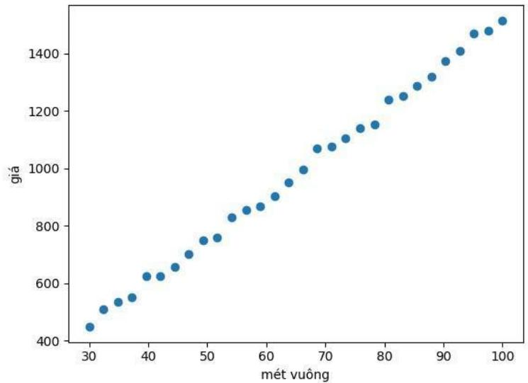
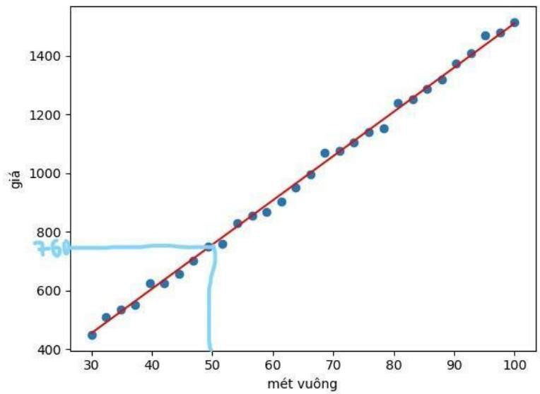
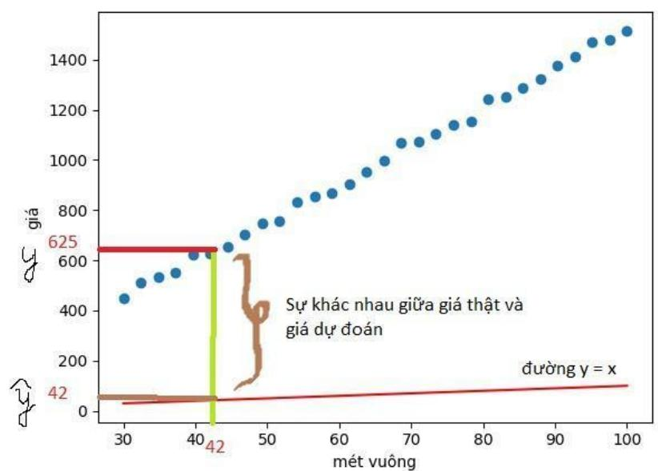
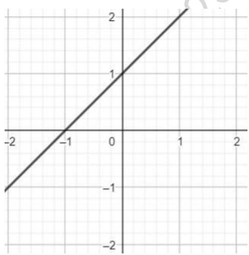
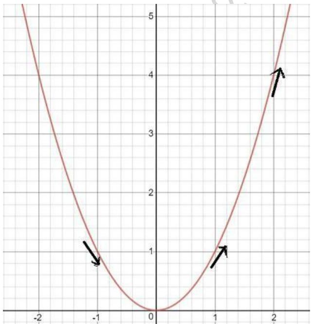
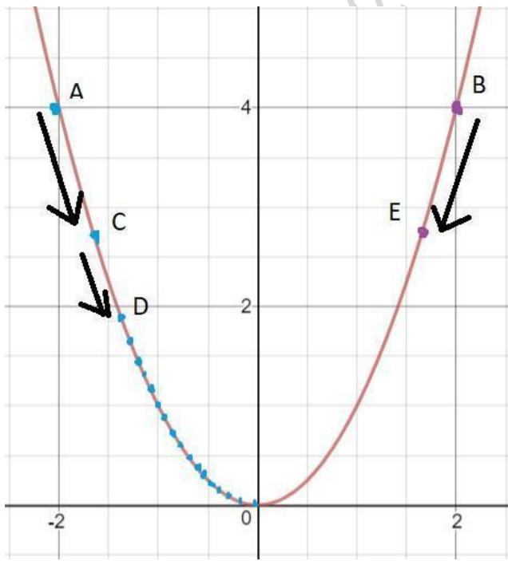
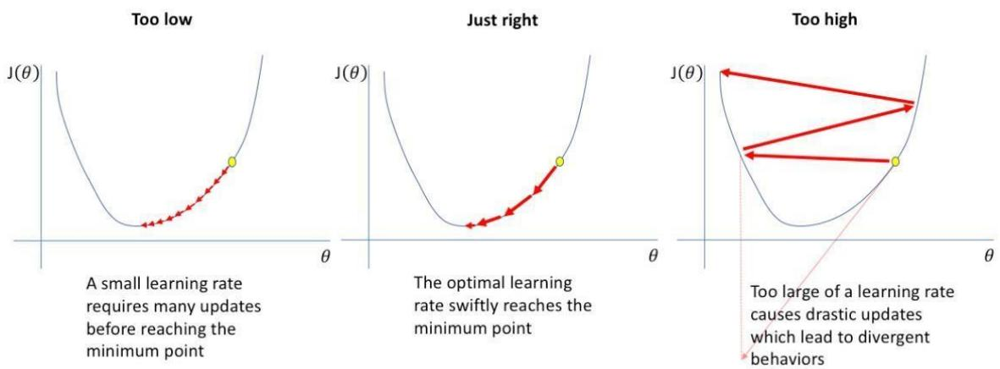
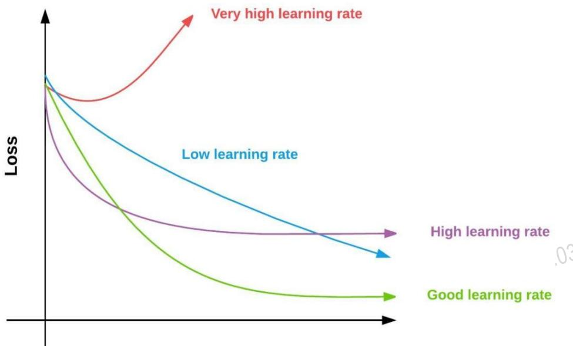

Thuật toán linear regression giải quyết các bài toán có đầu ra là giá trị thực, ví dụ: dự đoán giá nhà, dự đoán giá cổ phiếu, dự đoán tuổi,...

# 1. Bài toán

Bạn làm ở công ty bất động sản, bạn có dữ liệu về diện tích và giá nhà, giờ có một ngôi nhà mới bạn muốn ước tính xem giá ngôi nhà đó khoảng bao nhiêu. Trên thực tế thì giá nhà phụ thuộc rất nhiều yếu tố: diện tích, số phòng, gần trung tâm thương mại,.. nhưng để cho bài toán đơn giản giả sử giá nhà chỉ phụ thuộc vào diện tích căn nhà. Bạn có dữ liệu về diện tích và giá bán của 30 căn nhà như sau:

  
Hình 3.1: Đồ thị quan hệ giữa diện tích và giá nhà.

# 2. Thiết lập công thức

# 2.1 Model

Phương trình đường thẳng có dạng $y = a x + b$ ví dụ hình 3.3. Thay vì dùng kí hiệu a, b cho phương trình đường thẳng; để tiện cho biểu diễn ma trận phần sau ta sẽ thay $w _ { 1 } =$ $a , w _ { 0 } = b$

Nên phương trình được viết lại thành: $y = w _ { 1 } * x + w _ { 0 } = >$ Việc tìm đường thẳng giờ thành việc tìm $w _ { 0 } , w _ { 1 }$ .

$\mathrm { D \acute { e } }$ tiện cho việc thiết lập công thức, ta sẽ đặt ký hiệu cho dữ liệu $\dot { \sigma }$ bảng dữ liệu: $( x _ { 1 } , y _ { 1 } )$ = (30, 448.524), $( x _ { 2 } , y _ { 2 } ) = ( 3 2 . 4 1 3 8 , 5 0 9 . 2 4 8 ) ,$ ..

Tức là nhà diện tích $x _ { i }$ thực sự có giá $y _ { i }$ . Còn giá trị mà model hiện tại đang dự đoán kí hiệu là $\hat { \mathcal { { y } ^ { \prime } } _ { i } } = w _ { 1 } * x _ { i } + w _ { 0 }$

# 2.2 Loss function

Việc tìm $w _ { 0 } , w _ { 1 }$ có thể đơn giản nếu làm bằng mắt nhưng máy tính không biết điều đấy, nên ban đầu giá trị được chọn ngẫu nhiên ví dụ $w _ { 0 } = 0 , w _ { 1 } = 1$ sau đấy được chỉnh dần.

Rõ ràng có thể thấy đường $\mathbf { y } = \mathbf { x }$ như $\dot { \mathbf { O } }$ hình 3.4 không hề gần các điểm hay không phải là đường mà ta cần tìm. Ví dụ tại điểm $\mathbf { x } = 4 2$ (nhà $4 2 \ m ^ { 2 }$ ) giá thật là $6 2 \dot { 5 }$ triệu nhưng giá mà model dự đoán chỉ là 42 triệu.

  
Hình 3.2: Ước tính giá căn nhà $5 0 \ m ^ { 2 }$

  
Hình 3.4: Sự khác nhau tại điểm $\mathbf { x } = 4 2$ của model đường thẳng $\mathbf { y } = \mathbf { x }$ và giá trị thực tế ở bảng 1

  
Hình 3.3: Ví dụ đường thẳng ${ \bf y } = { \bf x } + 1$ (cd:) $\mathbf { \hat { a } } = 1$ và $\mathsf { b } = 1$ )

Nên giờ cần 1 hàm để đánh giá là đường thẳng với bộ tham số $( w _ { 0 } , w _ { 1 } ) = ( 0 , 1 ) { \mathrm { c o } }$ tốt hay không. Với mỗi điểm dữ liệu $( x _ { i } , y _ { i } )$ độ chênh lệch giữa giá thật và giá dự đoán được tính bằng: $\textstyle { \frac { 1 } { 2 } } ( { \widehat { y } } _ { i } - y _ { i } ) ^ { 2 }$ .

Và độ chênh lệch trên toàn bộ dữ liệu tính bằng tổng chênh lệch của từng điểm:

?? = 12 ⋅ 1?? ⋅ ∑ ???? = 1 $( \hat { y } _ { i } - y _ { i } ) ^ { 2 }$ (N là số điểm dữ liệu). Nhận xét:

J không âm

● J càng nhỏ thì đường thẳng càng gần điểm dữ liệu. Nếu $\mathrm { J } = 0$ thì đường thẳng đi qua tất các điểm dữ liệu.

J được gọi là loss function, hàm để đánh giá xem bộ tham số hiện tại có tốt với dữ liệu không.

$= >$ Bài toán tìm đường thẳng gần các điểm dữ liệu nhất trở thành tìm $w _ { 0 } , w _ { 1 }$ sao cho hàm J đạt giá trị nhỏ nhất.

Tóm tắt: Cần tìm đường thẳng (model) fit nhất với dữ liệu, tương ứng với việc tìm tham số $w _ { 0 } , w _ { 1 }$ để cực tiểu hóa hàm J.

Giờ cần một thuật toán để tìm giá trị nhỏ nhất của hàm $\mathrm { J } ( w _ { 0 } , w _ { 1 } )$ . Đó chính là thuật toán gradient descent.

# 3. Thuật toán gradient descent

# 3.1 Đạo hàm là gì?

Có nhiều người có thể tính được đạo hàm của hàm $f ( x ) = x ^ { 2 } \operatorname { h a y } f ( x ) = s i n ( c o s ( x ) )$ nhưng vẫn không biết thực sự đạo hàm là gì. Theo tiếng hán đạo là con đường, hàm là hàm số nên đạo hàm chỉ sự biến đổi của hàm số hay có tên thân thương hơn là độ dốc của đồ thị.

  
Hình 3.5: Đồ thị $y = x ^ { 2 }$

Như mọi người đã học đạo hàm $f ( x ) = x ^ { 2 } \operatorname { l i } f ^ { \prime } \left( x \right) = 2 * x$ (hoàn toàn có thể chứng minh từ định nghĩa nhưng cấp 3 mọi người đã học quá nhiều về công thức nên tôi không đề cập lại). Nhận xét:

$\operatorname { f } ( 1 ) = 2 * 1 < \operatorname { f } ( 2 ) = 2 * 2$ nên mọi người có thể thấy trên hình là đồ thị tại điểm $\mathbf { x } = 2$ dốc hơn $\mathtt { d } \dot { \hat { \mathbf { o } } }$ thị tại điểm $\mathbf { x } = 1$ , tuy nhiên $\operatorname { f } ^ { } ( - 2 ) = - 4 < \operatorname { f } ^ { } ( - 1 ) = - 2$ nhưng đồ thị tại x $= - 2$ dốc hơn $\mathtt { d } \dot { \hat { \mathbf { o } } }$ thị tại $\mathbf { \boldsymbol { x } } = \mathbf { \boldsymbol { - } } 1 \boldsymbol { = } \mathbf { \boldsymbol { > } }$ trị tuyệt đối của đạo hàm tại một điểm càng lớn thì đồ thị tại điểm đấy càng dốc.

● $\mathbf { f } ^ { \prime } ( - 1 ) = 2 \mathbf { \Omega } ^ { * } \left( - 1 \right) = - 2 < 0 \Rightarrow \dot { \mathbf { d } } \dot { \hat { 0 } }$ thị đang giảm hay khi tăng x thì y sẽ giảm; ngược lại đạo hàm tại điểm nào đó mà dương thì $\mathtt { d } \dot { \hat { \mathbf { o } } }$ thị tại điểm đấy đang tăng.

# 3.2 Gradient descent

Gradient descent là thuật toán tìm giá trị nhỏ nhất của hàm số f(x) dựa trên đạo hàm. Thuật toán:

1. Khởi tạo giá trị $x = x _ { 0 }$ tùy ý

2. Gán $\mathrm { ~ \bf ~ X ~ } = \mathrm { ~ \bf ~ X ~ } \cdot \mathrm { ~ \bf ~ \Lambda ~ }$ learning_rate $\ast \mathrm { \ f { \cdot } ( x ) }$ ( learning_rate là hằng số dương ví dụ learning_rate $= 0 . 0 0 1 ) 3 .$ Tính lại $\operatorname { f } ( \mathbf { x } )$ : Nếu f(x) đủ nhỏ thì dừng lại, ngược lại tiếp tục bước 2

Thuật toán sẽ lặp lại bước 2 một số lần đủ lớn (100 hoặc 1000 lần tùy vào bài toán và hệ số learning_rate) cho đến khi f(x) đạt giá trị đủ nhỏ. Ví dụ cần tìm giá trị nhỏ nhất hàm $y = x ^ { 2 }$ , hàm này ai cũng biết là giá giá trị nhỏ nhất là 0 tại $\mathbf { x } = 0$ nhưng $\mathrm { d } \acute { \mathrm { e } }$ cho mọi người dễ hình dung hơn $\mathbf { v } \dot { \hat { \mathbf { e } } }$ thuật toán Gradient descent nên tôi lấy ví dụ đơn giản.

  
Hình 3.6: Ví dụ về thuật toán gradient descent

1. Bước 1: Khởi tạo giá trị ngẫu nhiên $\mathbf { x } = \mathbf { - } 2$ (điểm A).

2. Bước 2: Do $\dot { \sigma }$ A đồ thị giảm nên $\Gamma ( \mathrm { x { = } \mathrm { - } } 2 ) = 2 ^ { * } ( - 2 ) = - 4 < 0 \mathrm { = > K h i }$ gán $\mathbf { X } = \mathbf { X }$ - learning_rate \* f’(x) nên x tăng nên $\mathtt { d } \dot { \hat { \mathbf { o } } }$ thị bước tiếp theo $\dot { \mathbf { O } }$ điểm C. Tiếp tục thực hiện bước 2, gán $\mathbf { X } = \mathbf { X }$ learning_rate $\ast _ { \mathrm { ~ f ~ } \mathrm { { ( x ) } } }$ thì $\mathtt { d } \overset { \triangledown } { \hat { \boldsymbol { \alpha } } }$ thị $\dot { \mathbf { O } }$ điểm D,... $= >$ hàm số giảm dần dần tiến tới giá trị nhỏ nhất.

Mọi người có để ý là trị tuyệt đối của đạo hàm tại A lớn hơn tại C và tại C lớn hơn tại D không? Đến khi đến gần điểm đạt giá trị nhỏ nhất $\mathbf { \boldsymbol { x } } = 0$ , thì đạo hàm xấp xỉ 0 đến khi hàm đạt giá trị nhỏ nhất tại $\mathbf { \boldsymbol { x } } = 0$ , thì đạo hàm bằng 0, nên tại điểm gần giá trị nhỏ nhất thì bước 2 gán $\mathbf { X } = \mathbf { X }$ - learning_rate $\ast _ { \mathrm { ~ f ~ } \mathrm { { ( x ) } } }$ là không đáng $\mathrm { k } \mathring { \mathrm { e } }$ và gần như là giữ nguyên giá trị của x.

Tương tự nếu giá trị khởi tạo tại $\mathbf { x } = 2$ (tại B) thì đạo hàm tại B dương nên do $\mathbf { X } = \mathbf { X }$ - learning_rate $\ast _ { \mathrm { ~ f ~ } \mathrm { { ( x ) } } }$ giảm $- > \mathrm { d } \dot { \hat { 0 } }$ thị $\dot { \mathbf { O } }$ điểm E $_ { - > }$ rồi tiếp tục gán $\mathbf { X } { = } \mathbf { X }$ -learning_rate \* $\mathbf f ( \mathbf x )$ thì hàm $\operatorname { f } ( \mathbf { x } )$ cũng sẽ giảm dần dần đến giá trị nhỏ nhất.

Ví dụ: chọn $\mathbf { x } = 1 0 ,$ learning_rate $= 0 . 1$ , bước 2 sẽ cập nhất $\mathbf { X } = \mathbf { X }$ - learning_rate\*f’(x) ${ \bf \equiv } { \bf X }$ learning_rate ${ } ^ { \ast } 2 ^ { \ast } \mathrm { { x } }$ , giá trị $\operatorname { f } ( \mathbf { x } ) = x ^ { 2 } \operatorname { s } { \tilde { \mathbf { e } } }$ thay đổi qua các lần thực hiện bước 2 như sau:

● Nếu learning_rate nhỏ: mỗi lần hàm số giảm rất ít nên cần rất nhiều lần thực hiện bước 2 để hàm số đạt giá trị nhỏ nhất.

● Nếu learning_rate hợp lý: sau một số lần lặp bước 2 vừa phải thì hàm sẽ đạt giá trị đủ nhỏ.

● Nếu learning_rate quá lớn: sẽ gây hiện tượng overshoot (như trong hình 3.8) và không bao giờ đạt được giá trị nhỏ nhất của hàm.

  
Hình 3.8: Các giá trị learning_rate khác nhau [13]

Cách tốt nhất để kiểm tra learning_rate hợp lý hay không là kiểm tra giá trị hàm $\operatorname { f } ( \mathbf { x } )$ sau mỗi lần thực hiện bước 2 bằng cách vẽ đồ thị với trục x là số lần thực hiện bước 2, trục y là giá trị loss function tương ứng ở bước đấy.

  
Epoch#

# 4. So sánh các loss function

# 4.1 Mean Absolute Error, L1 Loss

Mean Absolute Error (MAE) hay còn được gọi là L1 Loss là một loss function được sử dụng cho các mô hình hồi quy, đặc biệt cho các mô hình hồi quy tuyến tính. MAE được tính bằng tổng các trị tuyệt đối của hiệu giữa giá trị thực $( y _ { i } )$ : target) và giá trị mà mô hình của chúng ra dự đoán $( \hat { y } _ { i }$ : predicted).

$$
M A E = \frac { 1 } { N } \sum _ { i = 1 } ^ { N } \quad | \hat { y } _ { i } - y _ { i } |
$$

# 4.2 Mean Square Error, L2 Loss

Mean Square Error (MSE) hay còn được gọi là L2 Loss là một loss function cũng được sử dụng cho các mô hình hồi quy, đặc biệt là các mô hình hồi quy tuyến tính. MSE được tính bằng tổng các bình phương của hiệu giữa giá trị thực $( y _ { i } )$ target) và giá trị mà mô hình của chúng ra dự đoán $( \hat { y } _ { i }$ : predicted).

$$
M S E = \frac { 1 } { N } \sum _ { i = 1 } ^ { N } \quad ( \hat { y } _ { i } - y _ { i } ) ^ { 2 }
$$