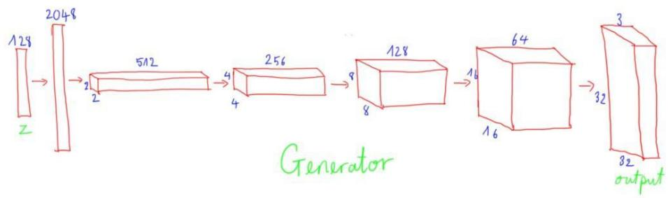
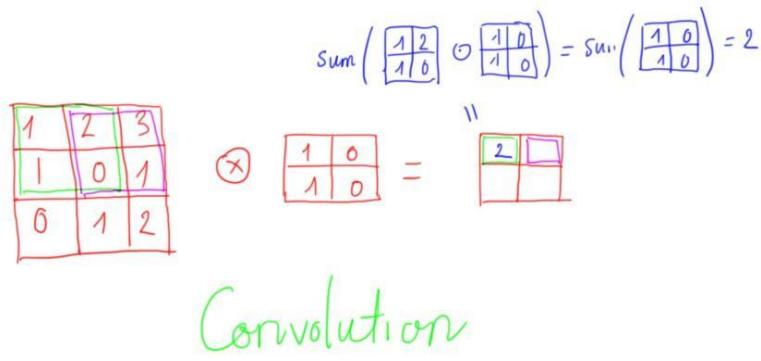
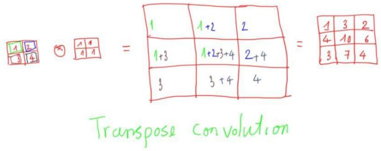
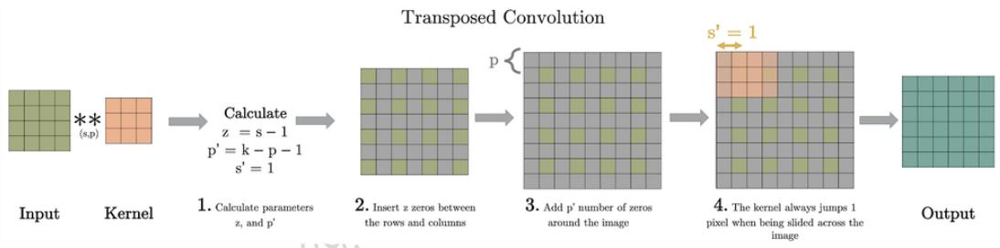
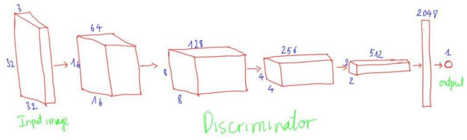
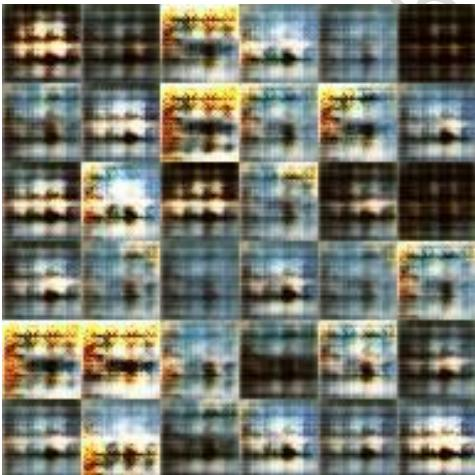
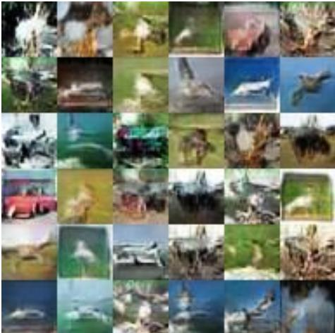
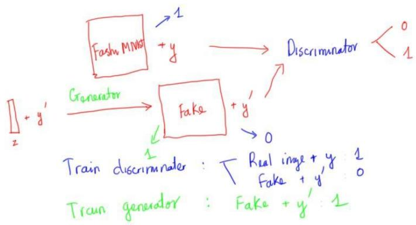

# 1. Deep Convolutional GAN

Bài trước tôi đã giới thiệu về GAN, cấu trúc mạng GAN và hướng dẫn dùng GAN để sinh các số trong bộ dữ liệu MNIST. Tuy nhiên mô hình của Generator và Discriminator đều dùng Neural Network. Trong khi ở bài CNN tôi đã biết CNN xử lý dữ liệu ảnh tốt hơn và hiệu quả hơn rất nhiều so với Neural Network truyền thống. Vậy nên bài này tôi sẽ hướng dẫn áp dụng CNN vào mô hình GAN bài trước, mô hình đấy gọi là Deep Convolutional GAN (DCGAN).

Bài toán: Dùng mạng GAN sinh ra các ảnh giống với dữ liệu trong CIFAR-10 dataset.

CIFAR-10 dataset bao $\mathrm { g \dot { o } m 6 0 0 0 0 }$ ảnh màu kích thước 32x32 thuộc 10 thể loại khác nhau. Mỗi thể loại có 6000 ảnh.

# 1.1 Cấu trúc mạng

Nhắc lại bài trước 1 chút thì GAN $\mathrm { g } \dot { \mathsf { o } } \mathrm { m } 2$ mạng là generator và discriminator. Trong khi discriminator được train để phân biệt ảnh thật (trong dataset) và ảnh fake (do generator sinh ra), thì generator được train $\mathrm { d } \acute { \mathrm { e } }$ đánh lừa discriminator. Ở bài trước thì cả generator và discriminator đều được xây bằng mạng neural network thông thường với các fully connected layer, bài này thì generator và discriminator được xây dựng bằng mô hình CNN với 2 layers chính là convolutional layer và transposed convolutional layer.

# 1.1.1 Generator

Mạng Generator nhằm mục đích sinh ảnh fake, input là noise vector kích thước 128 và output và ảnh fake cùng kích thước ảnh thật $( 3 2 * 3 2 * 3 )$ )

  
Hình 21.1: Mô hình generator của DCGAN

Các layer trong mạng

Dense (fully-connected) layer: $1 2 8 ^ { * } 1  2 0 4 8 ^ { * } 1$ Flatten chuyển từ vector về dạng tensor 3d, 2048\*1 -> 2\*2\*512

Transposed convolution stride ${ \boldsymbol { \mathsf { \varepsilon } } } { = } 2$ , kernel=256, 2\*2\*512 -> 4\*4\*256 • Transposed convolution stride ${ \boldsymbol { \mathsf { \varepsilon } } } { = } 2$ , kerne $\scriptstyle 1 = 1 2 8$ , $4 ^ { * } 4 ^ { * } 2 5 6 \to 8 ^ { * } 8 ^ { * } 1 2 8$

Transposed convolution stride $^ { : = 2 }$ , kernel=64, 8\*8\*128 -> 16\*16\*64

Transposed convolution stride $^ { : = 2 }$ , kernel $^ { = 3 }$ , $1 6 ^ { * } 1 6 ^ { * } 6 4  3 2 ^ { * } 3 2 ^ { * } 3$

Đầu tiên thì input noise (128) được dùng full-connected layer chuyển thành $2 0 4 8 \ : ( =$ $2 ^ { * } 2 ^ { * } 5 1 2 )$ ). Số 2048 được chọn $\mathrm { d } \acute { \mathrm { e } }$ reshape $\mathbf { v } \dot { \hat { \mathbf { e } } }$ dạng tensor 3d $( 2 ^ { * } 2 ^ { * } 5 1 2 )$ . Sau đó transposed convolution với stride $= 2$ được dùng $\mathbf { \bar { d e } }$ tăng kích thước tensor lên dần $4 ^ { * } 4$ $ 8 ^ { * } 8  1 6 ^ { * } 1 6  3 2 ^ { * } 3 2$ . Cho tới khi kích thước tensor $3 2 ^ { * } 3 2$ (bằng đúng width, height của ảnh trong CIFAR-10 dataset) thì ta dùng 3 kernel để ra đúng shape của ảnh.

Mọi người để ý thấy là khi width, height tăng thì depth sẽ giảm, cũng giống như trong mạng CNN bình thường width, height giảm thì depth sẽ tăng.

Transposed convolution hay deconvolution có thể coi là phép toán ngược của convolution. $\mathrm { \Delta N } \mathrm { \acute { e } u }$ như convolution với stride $> 1$ giúp làm giảm kích thước của ảnh thì transposed convolution với stride $> 1$ sẽ làm tăng kích thước ảnh. Ví dụ stride $= 2$ và padding $=$ ’SAME’ sẽ giúp gấp đôi width, height kích thước của ảnh.

Transposed convolution có 2 kiểu định nghĩa:

• Kiểu 1 Kiểu 1 được định nghĩa đơn giản hơn lấy từ sách Dive into deep learning.   
Ý tưởng đơn giản là transposed convolution là phép tính ngược của convolution.

  
Hình 21.3: Convolution $\mathbf { s } { = } 1$ , $\scriptstyle \mathtt { p } = 0$

Nếu như ở phép tính convolution thì 1 vùng kích thước $2 ^ { \ast } 2$ được nhân element-wise với kernel và tính tổng viết ra $\dot { \mathbf { O } }$ output thì $\dot { \sigma }$ phép tính transposed convolution mỗi phần tử ở input sẽ được nhân với kernel và ma trận $\mathrm { k } \acute { \mathrm { e t } }$ quả cùng kích thước với kernel được viết vào output. Nếu các phần tử ở output viết đè lên nhau thì ta sẽ cộng dồn vào.

  
Hình 21.4: Transposed convolution với $\mathbf { s } { = } 1$ , $\mathtt { p } { = } 0$

Stride trong transposed convolution được định nghĩa là số bước nhảy khi viết kết quả ra ma trận output. Với padding thì ta tính toán bình thường như với $\mathtt { p } { = } 0$ sau đó kết quả ta sẽ bỏ p hàng và cột ở 4 cạnh (trên, dưới, trái, phải)

  
Hình 21.6: Transposed convolution $\mathsf { s } \mathrm { = } 2$ , $\mathsf { p } { = } 1$

• Kiểu 2 Kiểu định nghĩa thứ 2 thì phức tạp hơn nhưng lại có vẻ chuẩn và hay gặp hơn. Ý nghĩa của stride và padding ở đây là khi ta thực hiện phép tính convolution trên output sẽ được kích thước giống input.

  
Hình 21.7: Các bước thực hiện transposed convolution

# Discriminator

Mạng Discriminator nhằm mục đích phân biệt ảnh thật từ dataset và ảnh fake do Generator sinh ra, input là ảnh kích thước $( 3 2 * 3 2 * 3 )$ , output là ảnh thật hay fake (binary classification)

  
Hình 21.8: Mô hình discriminator của DCGAN

Mô hình discriminator đối xứng lại với mô hình generator. Ảnh input được đi qua convolution với stride $= 2$ để giảm kích thước ảnh từ $3 2 ^ { * } 3 2  1 6 ^ { * } 1 6 > 8 ^ { * } 8 > 4 ^ { * } 4 >$ $2 ^ { \ast } 2$ . Khi giảm kích thước thì depth tăng dần. Cuối cùng thì tensor shape $2 ^ { * } 2 ^ { * } 5 1 2$ được reshape về vector 2048 và dùng 1 lớp fully connected chuyển từ 2048d về 1d.

Loss function được sử dụng giống như bài trước về GAN.

# 1.2 Tips

Đây là một số tips để build model và train DCGAN

Dùng ReLU trong generator trừ output layer • Output layer trong generator dùng tanh (-1, 1) và scale ảnh input về (-1,1) sẽ cho kết quả tốt hơn dùng sigmoid và scale ảnh về (0, 1) hoặc để nguyên ảnh.

• Sử dụng Leaky ReLU trong discriminator   
• Thay thế max pooling bằng convolution với stride $= 2$ Sử dụng transposed convolution để upsampling   
• Sử dụng batch norm từ output layer trong generator và input layer trong   
discriminator

# 1.3 Thực nghiệm

Ảnh CIFAR-10 được scale về (-1, 1) để cùng scale với ảnh sinh ra bởi generator khi dùng tanh activation.

Ở những epoch đầu tiên thì generator chỉ sinh ra noise.

  
Hình 21.9: Ảnh sinh ra bởi generator sau 10 epochs

Tuy nhiên sau 150 epoch thì mạng đã học được thuộc tính của ảnh trong dữ liệu CIFAR-10 và có thể sinh ra được hình con chim, ô tô.

  
Hình 21.10: Ảnh sinh ra bởi generator sau 150 epochs

# 2. Conditional GAN

Phần trước tôi giới thiệu về DCGAN, dùng deep convolutional network trong mô hình GAN. Tuy nhiên khi ta train GAN xong rồi dùng generator $\mathrm { d } \acute { \mathrm { e } }$ sinh ảnh mới giống trong dataset tôi không kiểm soát được là ảnh sinh ra giống category nào trong dataset. Ví dụ như dùng GAN để sinh các chữ số trong bộ MNIST, thì khi train xong và dùng generator sinh ảnh thì tôi không biết được ảnh sinh ra sẽ là số mấy $( 0  9 )$ . Bài toán hôm nay muốn kiểm soát được generator sinh ra ảnh theo 1 category nhất định. Ví dụ có thể chỉ định generator sinh ra số 1 chẳng hạn. Mô hình đấy gọi là Conditional GAN (cGAN).

# 2.1 Fashion-MNIST

Dữ liệu Fashion-MNIST về quần áo, giày dép $\mathrm { g \dot { o } m 6 0 0 0 0 }$ ảnh training và 10000 ảnh test. Ảnh xám kích thước $2 8 ^ { \ast } 2 8$ thuộc 10 lớp khác nhau.

Input y là 1 số được đi qua embedding layer của keras, layer này giống như 1 dictionary map mỗi số thành một vector $5 0 ^ { * } 1$ , sau đó được qua dense với output $2 8 ^ { \ast } 2 8$ node cuối cùng được reshape về 3D tensor kích thước $2 8 \mathrm { x } 2 8 \mathrm { x } 1$ (y1)

Sau đó y1 và ảnh input được xếp chồng lên nhau thành tensor 3d kích thước $2 8 ^ { * } 2 8 ^ { * } 2$ , sau đó tensor đi qua convolution với stride $= 2$ để giảm kích thước ảnh từ $2 8 ^ { * } 2 8 $ $1 4 ^ { * } 1 4  7 ^ { * } 7 .$ . Khi giảm kích thước thì depth tăng dần. Cuối cùng thì tensor shape $2 ^ { * } 2 ^ { * } 5 1 2$ được reshape $\mathbf { v } \dot { \hat { \mathbf { e } } }$ vector 2048 và dùng 1 lớp fully connected chuyển từ 2048d về 1d.

# Loss function

  
Hình 22.4: Loss function cGAN