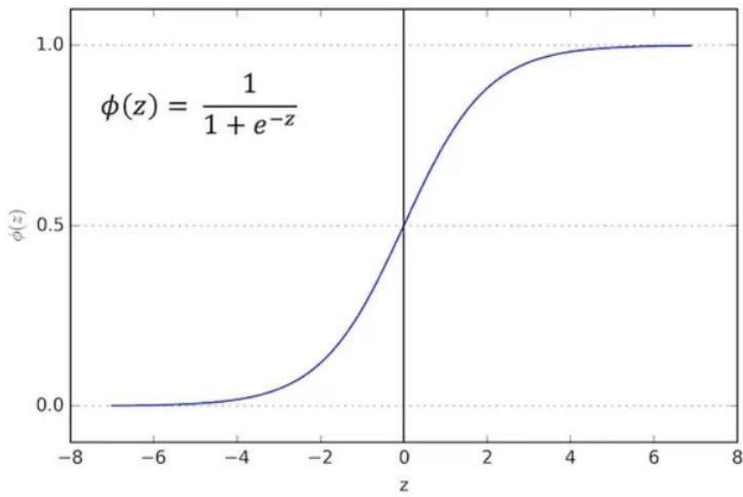
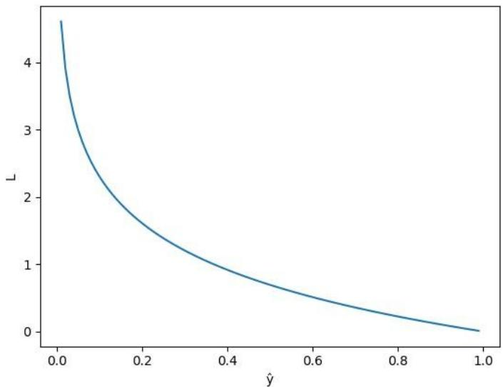
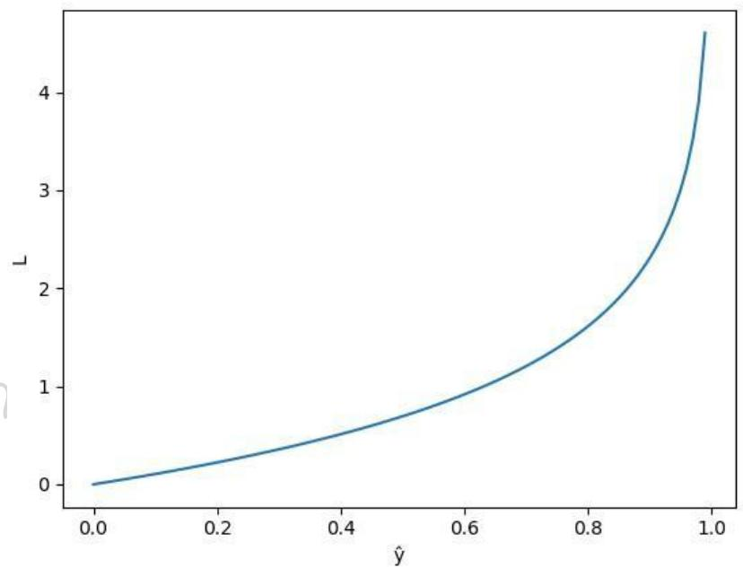

# 1. Bài toán

Ngân hàng bạn đang làm có chương trình cho vay ưu đãi cho các đối tượng mua chung cư. Tuy nhiên gần đây có một vài chung cư rất hấp dẫn (giá tốt, vị trí đẹp,...) nên lượng hồ sơ người nộp cho chương trình ưu đãi tăng đáng $\mathrm { k } \mathring { \mathrm { e } }$ . Bình thường bạn có thể duyệt $1 0 { - } 2 0 \mathrm { ~ h ~ } \bar { \widehat { \mathrm { o } } }$ sơ một ngày để quyết định hồ sơ có được cho vay hay không, tuy nhiên gần đây bạn nhận được 1000-2000 hồ sơ mỗi ngày. Bạn không thể xử lý hết hồ sơ và bạn cần có một giải pháp để có thể dự đoán hồ sơ mới là có nên cho vay hay không.

Sau khi phân tích thì bạn nhận thấy là hai yếu tố chính quyết định đến việc được vay tiền đó là mức lương và thời gian công tác. Đây là dữ liệu bạn có từ trước đến nay:

Sự kiện bạn càng chắc chắn xảy ra thì xác suất càng cao. Ví dụ bạn lương cao và còn đi làm lâu lăm thì xác suất bạn được vay mua chung cư là cao.

● Tổng xác suất của sự kiện A và sự kiện phủ định của A là $100 \%$ (hay 1). Ví dụ sự kiện A: tung đồng xu mặt ngửa, xác suất $50 \%$ ; phủ định của sự kiện A: tung đồng xu mặt sấp, xác suất $5 0 \% \mathrm { = } \mathrm { > t \mathring { o } n g \ 1 0 0 \% }$ .

Bạn sẽ thấy xác suất quan trọng hơn là chỉ 0 hay 1, ví dụ trước mỗi ca $\mathrm { m } \acute { \mathrm { o } }$ khó, bác sĩ không thể chắc chắn là sẽ thất bại hay thành công mà chỉ có th $\acute { \hat { \mathbf { e } } }$ nói xác suất thành công là bao nhiêu (ví dụ $80 \%$ ).

# 3. Hàm sigmoid

Giờ ta cần tìm xác suất của hồ sơ mới nên cho vay. Hay giá trị của hàm cần trong khoảng [0,1]. Rõ ràng là giá trị của phương trình đường thẳng như bài trước có thể ra ngoài khoảng [0,1] nên cần một hàm mới luôn có giá trị trong khoảng [0,1]. Đó là hàm sigmoid.

  
Hình 4.3: Đồ thị hàm sigmoid

Nhận xét:

Hàm số liên tục, nhận giá trị thực trong khoảng (0,1).   
Hàm có đạo hàm tại mọi điểm (để áp dụng gradient descent).

# 4. Thiết lập bài toán

Mọi người có để ý các bước trong bài linear regression không nhỉ, các bước bao gồm:

1. Visualize dữ liệu   
2. Thiết lập model   
3. Thiết lập loss function   
4. Tìm tham số bằng việc tối ưu loss function   
5. Dự đoán dữ liệu mới bằng model vừa tìm được

Đây là mô hình chung cho bài toán trong Deep Learning.

# 1.1 Model

Với dòng thứ i trong bảng dữ liệu, gọi $x _ { 1 }$ là lương và $x _ { 2 }$ là thời gian làm việc của hồ sơ thứ i .

$p \big ( x ^ { ( i ) } = 1 \big ) = \widehat { y } _ { i }$ là xác suất mà model dự đoán $\mathbf { \hat { h } } \dot { \hat { \mathbf { o } } }$ sơ thứ i được cho vay.   
$p \big ( x ^ { ( i ) } = 0 \big ) = 1 - \hat { y } _ { i } \mathrm { l }$ à xác suất mà model dự đoán hồ sơ thứ i không được cho vay.

Như bài trước công thức của linear regression là: $\hat { y } _ { i } = w _ { 0 } + w _ { 1 } x _ { 1 } + w _ { 2 } x _ { 2 }$ thì giờ công thức của logistic regression là:

$$
\hat { y } _ { i } = \sigma \big ( w _ { 0 } + w _ { 1 } x _ { 1 } ^ { ( i ) } + w _ { 2 } x _ { 2 } ^ { ( i ) } \big ) = \frac { 1 } { 1 + e ^ { - \left( w _ { 0 } + w _ { 1 } x _ { 1 } ^ { ( i ) } + w _ { 2 } x _ { 2 } ^ { ( i ) } \right) } }
$$

Ở phần cuối mọi người sẽ thấy được quan hệ giữa xác suất và đường thẳng.

# 1.2 Loss function

Giờ cũng cần một hàm để đánh giá độ tốt của model. Như bài trước $\mathrm { l } \dot { { \mathrm a } } y \hat { }$ càng gần y càng tốt, giờ cũng vậy:

Nếu hồ sơ thứ i là cho vay, tức $y _ { i } = 1$ thì ta cũng mong muốn $\hat { y _ { \textit { i } } }$ càng gần 1 càng tốt hay model dự đoán xác suất người thứ i được vay vốn càng cao càng tốt. ● Nếu hồ sơ thứ i không được vay, tức $y _ { i } { = } 0$ thì ta cũng mong muốn $\hat { y _ { \textit { i } } }$ càng gần 0 càng tốt hay model dự đoán xác suất người thứ i được vay vốn càng thấp càng tốt.

Với mỗi điểm $( x ^ { ( i ) } , y _ { i } )$ , gọi hàm loss function $L = - ( y _ { i } l o g l o g \hat { y } _ { i } + ( 1 - y _ { i } )$ ?????? ?????? $\left( 1 - \hat { y } _ { i } \right)$ ), loss function này có tên gọi là binary_crossentropy

Mặc định trong machine learning nói chung hay deep learning thì viết log hiểu là ln

Thử đánh giá hàm L nhé. $\mathrm { N } \mathring { \mathrm { e u } } y _ { i } = 1 \Rightarrow \mathtt { L } = - l o g ( \gamma \hat { \mathbf { \eta } } _ { i } )$

  
Hình 4.4: Đồ thị hàm loss function trong trường hợp $y _ { i } = 1$

Nhận xét:

Hàm L giảm dần từ 0 đến 1. ● Khi model dự đoán $y \hat { \mathbf { \xi } } _ { i } \mathbf { g } \hat { \mathbf { a } } \mathbf { n } \ 1$ , tức giá trị dự đoán gần với giá trị thật yi thì L nhỏ, xấp xỉ 0 ● Khi model dự đoán $y \hat { \mathbf { \xi } } _ { i } \mathbf { g } \hat { \mathbf { a } } \mathbf { n } \ : 0$ , tức giá trị dự đoán ngược lại giá trị thật yi thì L rất lớn Ngược lại, $\mathrm { n } \mathring { \hat { \mathrm { e u } } } y _ { i } = 0 \Rightarrow \mathtt { L } = - l o g ( \mathtt { l } \mathrm { - } \underline { { \vphantom { \bigcirc } } } y ^ { \cdot } )$

Hình 4.5: Đồ thị hàm loss function trong trường hợp $y _ { i } { = } 0$   

Nhận xét:

Hàm L tăng dần từ 0 đến 1 ● Khi model dự đoán $y \hat { \mathbf { \xi } } _ { i } \mathbf { g } \hat { \mathbf { a } } \mathbf { n } \ : 0$ , tức giá trị dự đoán gần với giá trị thật $y _ { i }$ thì L nhỏ, xấp xỉ 0 ● Khi model dự đoán $y \hat { \mathbf { \xi } } _ { i } \mathbf { g } \hat { \mathbf { a } } \mathbf { n } \ 1$ , tức giá trị dự đoán ngược lại giá trị thật $y _ { i }$ thì L rất $_ { \mathrm { l o n } } \mathrm { = } \mathrm { > H a m ~ L }$ nhỏ khi giá trị model dự đoán gần với giá trị thật và rất lớn khi model dự đoán sai, hay nói cách khác L càng nhỏ thì model dự đoán càng gần với giá trị thật. $= >$ Bài toán tìm model trở thành tìm giá trị nhỏ nhất của L Hàm loss function trên toàn bộ dữ l $\begin{array} { r } { \mathrm { i } \hat { \ e } \mathrm { u } J = - \frac { 1 } { N } \sum _ { i = 1 } ^ { N } } \end{array}$ (???? ?????? ?????? ??̂?? + (1 − ????) ?????? ?????? $( 1 - \hat { y } _ { i } )$ )