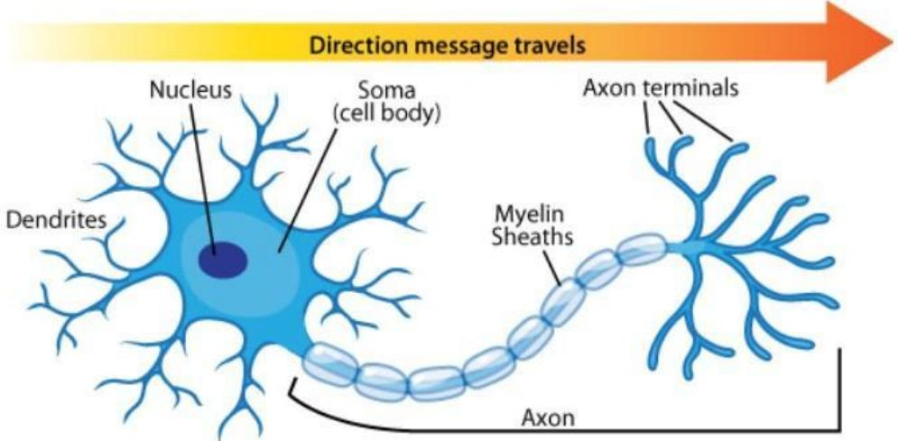
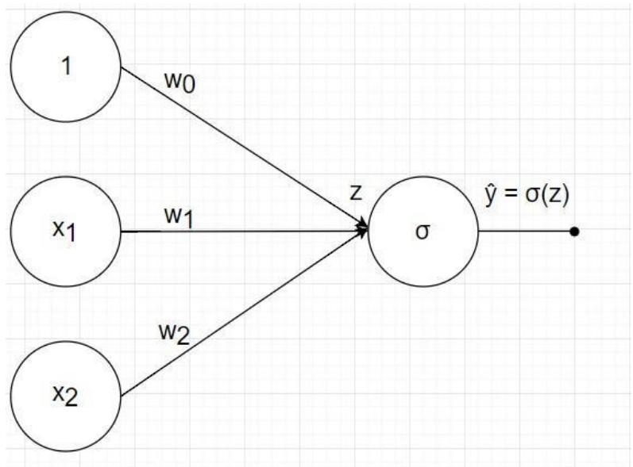
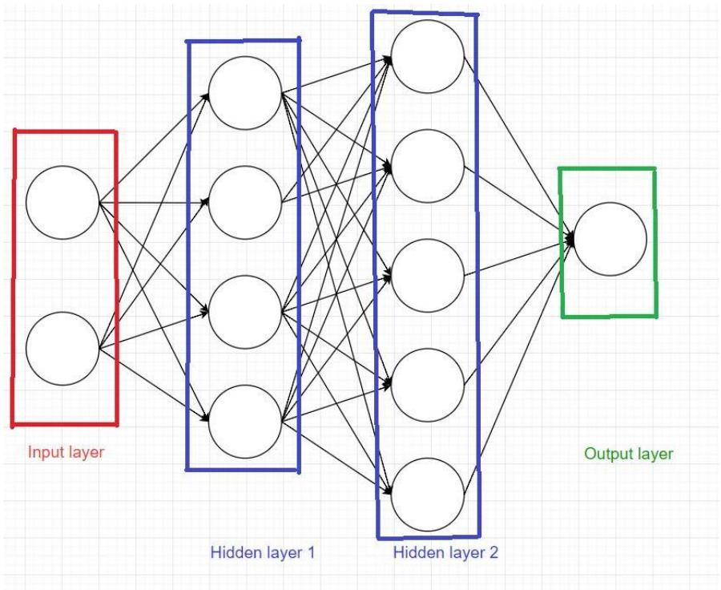
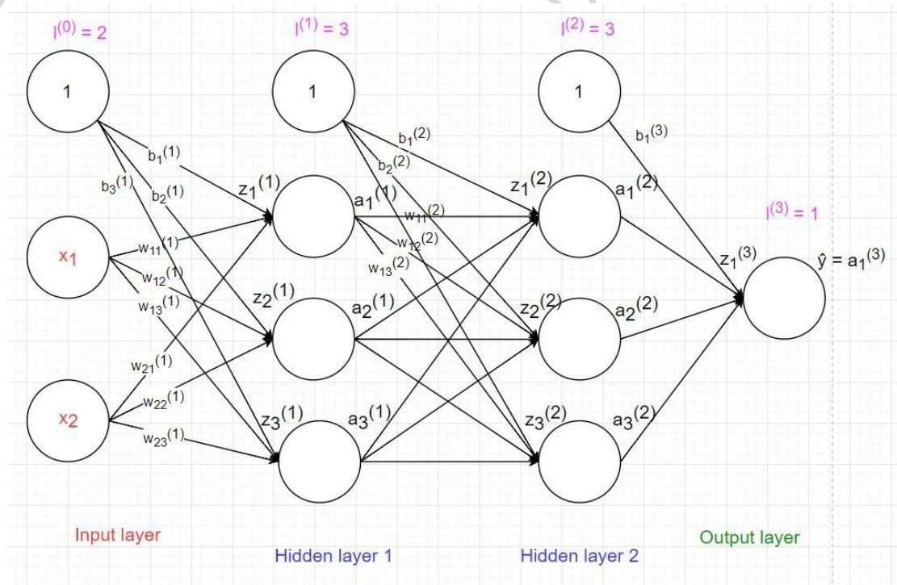
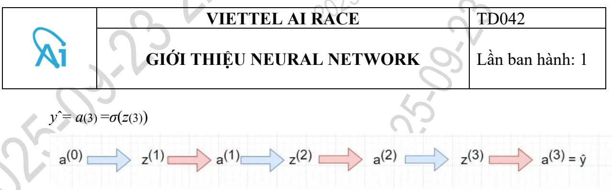
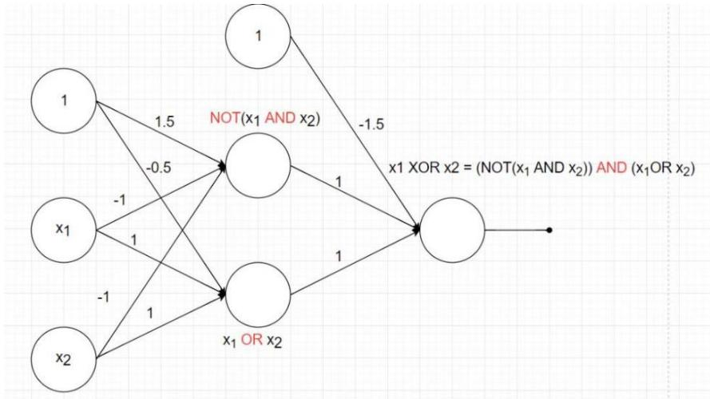

# 1. Neural network là gì

Con chó có thể phân biệt được người thân trong gia đình và người lạ hay đứa trẻ có thể phân biệt được các con vật. Những việc tưởng chừng như rất đơn giản nhưng lại cực kì khó để thực hiện bằng máy tính. Vậy sự khác biệt nằm ở đâu? Câu trả lời nằm $\dot { \mathbf { O } }$ cấu trúc bộ não với lượng lớn các nơ-ron thần kinh liên kết với nhau. Liệu máy tính có thể mô phỏng lại cấu trúc bộ não để giải các bài toán trên ???

Neural là tính từ của neuron (nơ-ron), network chỉ cấu trúc, cách các nơ-ron đó liên kết với nhau, nên neural network (NN) là một hệ thống tính toán lấy cảm hứng từ sự hoạt động của các nơ-ron trong hệ thần kinh.

# 1.1 Hoạt động của các nơ-ron

Nơ-ron là đơn vị cơ bản cấu tạo hệ thống thần kinh và là thành phần quan trọng nhất của não. Đầu chúng ta gồm khoảng 10 triệu nơ-ron và mỗi nơ-ron lại liên kết với tầm 10.000 nơ-ron khác.

Ở mỗi nơ-ron có phần thân (soma) chứa nhân, các tín hiệu đầu vào qua sợi nhánh (dendrites) và các tín hiệu đầu ra qua sợi trục (axon) kết nối với các nơ-ron khác. Hiểu đơn giản mỗi nơ-ron nhận dữ liệu đầu vào qua sợi nhánh và truyền dữ liệu đầu ra qua sợi trục, đến các sợi nhánh của các nơ-ron khác.

Mỗi nơ-ron nhận xung điện từ các nơ-ron khác qua sợi nhánh. Nếu các xung điện này đủ lớn để kích hoạt nơ-ron, thì tín hiệu này đi qua sợi trục đến các sợi nhánh của các nơ-ron khác.

# Neuron Anatomy

  
Hình 5.1: Tế bào thần kinh [14]

$\mathrm { \Gamma } = > \mathring { \mathrm { O } } \mathrm { m } \tilde { \hat { \mathrm { O } } } \mathrm { i }$ nơ-ron cần quyết định có kích hoạt nơ-ron đấy hay không. Tương tự các hoạt động của hàm sigmoid bài trước.

Tuy nhiên NN chỉ là lấy cảm hứng từ não bộ và cách nó hoạt động, chứ không phải bắt chước toàn bộ các chức năng của nó. Việc chính của chúng ta là dùng mô hình đấy đi giải quyết các bài toán chúng ta cần.

# 2. Mô hình neural network

# 2.1 Logistic regression

Logistic regression là mô hình neural network đơn giản nhất chỉ với input layer và output layer.

Mô hình của logistic regression từ bài trước là: $y { \hat { \mathbf { \theta } } } { = } \sigma ( w _ { 0 } { + } w _ { 1 } { * } x _ { 1 } { + } w _ { 2 } { * } x _ { 2 } )$ . Có 2 bước:

Tính tổng linear: $z = 1 * w _ { 0 } + x _ { 1 } * w _ { 1 } + x _ { 2 } * w _ { 2 }$

Áp dụng sigmoid function: $y \hat { \bf \Phi } { = } \sigma ( z )$

Để biểu diễn gọn lại ta sẽ gộp hai bước trên thành một trên biểu đồ như hình 5.2.

  
Hình 5.2: Mô hình logistic regression

$\mathrm { H } \hat { \mathbf { e } }$ số $w _ { 0 }$ được gọi là bias. $\mathrm { \Delta \vec { \mathrm { p } } \vec { \mathrm { e } } \vec { \mathrm { y } } }$ từ những bài trước đến giờ dữ liệu khi tính toán luôn được thêm 1 để tính hệ số bias $w _ { 0 }$ . Tại sao lại cần hệ số bias? Quay lại với bài 1, phương trình đường thẳng sẽ thế nào nếu bỏ $\mathcal { W } _ { 0 } .$ , phương trình giờ có dạng: $y = w _ { 1 } { * } x$ , sẽ luôn đi qua $\mathrm { g } \acute { \mathrm { o c } }$ tọa độ và nó không tổng quát hóa phương trình đường thẳng nên có thể không tìm được phương trình mong muốn. $\mathrm { = > V i \hat { e } c }$ thêm bias (hệ số tự do) là rất quan trọng.

Hàm sigmoid ở đây được gọi là activation function.

# 2.2 Mô hình tổng quát

Layer đầu tiên là input layer, các layer ở giữa được gọi là hidden layer, layer cuối cùng được gọi là output layer. Các hình tròn được gọi là node.

Mỗi mô hình luôn có 1 input layer, 1 output layer, có thể có hoặc không các hidden layer. Tổng số layer trong mô hình được quy ước là số layer - 1 (không tính input layer).

Ví dụ như ở hình trên có 1 input layer, 2 hidden layer và 1 output layer. Số lượng layer của mô hình là 3 layer.

Mỗi node trong hidden layer và output layer :   
Liên kết với tất cả các node ở layer trước đó với các hệ số w riêng. Mỗi node có 1 hệ số bias b riêng.   
Diễn ra 2 bước: tính tổng linear và áp dụng activation function.

# 2.3 Kí hiệu

Số node trong hidden layer thứ i là $l ^ { ( i ) }$ .

Ma trận $W ^ { ( k ) }$ kích thước $l ^ { ( k - 1 ) } * l ^ { ( k ) }$ là ma trận hệ số giữa layer (k-1) và layer $\mathbf { k }$ , trong đó $\mathcal { W } _ { i j } ^ { ( \boldsymbol { \mathbf { \rho } } _ { k } ) }$ là hệ số kết nối từ node thứ i của layer $\mathrm { k } { - } 1$ đến node thứ j của layer k.

  
Hình 5.3: Mô hình neural network

Vector $b ^ { ( k ) }$ kích thước $l ^ { k _ { * 1 } }$ là hệ số bias của các node trong layer $\mathrm { k \Omega }$ , trong đó b(ik) là bias của node thứ i trong layer k.

Với node thứ i trong layer l có bias $b _ { i } ^ { ( l ) }$ thực hiện 2 bước:

• Tính tổng tất cả các node trong layer trước nhân với hệ số w tương ứng, rồi cộng với bias b.

Áp dụng activation function: $a _ { i } ^ { ( l ) } { = } \sigma ( z _ { i } ^ { ( l ) } )$

Vector $z ^ { ( k ) }$ kích thước l(k) ∗1 là giá trị các node trong layer k sau bước tính tổng linear.

Vector $a ^ { ( k ) } \mathrm { k i c h }$ thước $l ^ { ( k ) } * 1$ là giá trị của các node trong layer k sau khi áp dụng hàm activation function.

Mô hình neural network trên $\mathrm { g } \dot { \mathsf { o } } \mathrm { m } 3$ layer. Input layer có 2 node $( l ^ { ( 0 ) } { = } 2 )$ , hidden layer 1 có 3 node, hidden layer 2 có 3 node và output layer có 1 node.

Do mỗi node trong hidden layer và output layer đều có bias nên trong input layer và hidden layer cần thêm node 1 để tính bias (nhưng không tính vào tổng số node layer có).

# 3. Feedforward

Để nhất quán về mặt ký hiệu, gọi input layer là $a ^ { \scriptscriptstyle ( 0 ) } ( = x )$ kích thước $2 ^ { * } 1$

$$
\begin{array} { r l } &  z ^ { ( 1 ) } = [ \begin{array} { l } { z _ { 1 } ^ { ( 1 ) } \Big [ } \\ { z _ { 2 } ^ { ( 1 ) } \Big ] = [ \begin{array} { l } { a _ { 1 } ^ { ( 0 ) } * w _ { 1 1 } ^ { ( 1 ) } + a _ { 2 } ^ { ( 0 ) } * w _ { 2 1 } ^ { ( 1 ) } + a _ { 3 } ^ { ( 0 ) } * w _ { 3 1 } ^ { ( 1 ) } + b _ { 1 } ^ { ( 1 ) } \Big ] } \\ { a _ { 1 } ^ { ( 0 ) } * w _ { 1 2 } ^ { ( 1 ) } + a _ { 2 } ^ { ( 0 ) } * w _ { 2 2 } ^ { ( 1 ) } + a _ { 3 } ^ { ( 0 ) } * w _ { 3 2 } ^ { ( 1 ) } + b _ { 2 } ^ { ( 1 ) } } \end{array} ] } \\ & { ( W ^ { ( 1 ) } ) ^ { T } * a ^ { ( 0 ) } + b ^ { ( 1 ) } } \end{array} \end{array}
$$

Tương tự ta có:

  
Hình 5.4: Feedforward

# 4. Logistic regression với toán tử XOR

Phần này không bắt buộc, nó giúp giải thích việc có nhiều layer hơn thì mô hình sẽ giải quyết được các bài toán phức tạp hơn. Cụ thể là mô hình logistic regression bài trước không biểu diễn được toán tử XOR nhưng nếu thêm 1 hidden layer với 2 node ở giữa input layer và output layer thì có thể biểu diễn được toán tử XOR.

AND, OR, XOR là các phép toán thực hiện phép tính trên bit. Thế bit là gì? bạn không cần quan tâm, chỉ cần biết mỗi bit nhận 1 trong 2 giá trị là 0 hoặc 1.

# 4.1 NOT

Phép tính NOT của 1 bit cho ra giá trị ngược lại.

<table><tr><td rowspan=1 colspan=1>0</td><td rowspan=1 colspan=1>1</td><td rowspan=1 colspan=1>1</td><td rowspan=1 colspan=1>0</td><td rowspan=1 colspan=1>1</td><td rowspan=1 colspan=1></td><td rowspan=1 colspan=1>1</td></tr><tr><td rowspan=1 colspan=1></td><td rowspan=1 colspan=1>0</td><td rowspan=1 colspan=1>1</td><td rowspan=1 colspan=1>0</td><td rowspan=1 colspan=1>1</td><td rowspan=1 colspan=1>0</td><td rowspan=1 colspan=1>1</td></tr><tr><td rowspan=1 colspan=1>1</td><td rowspan=1 colspan=1>1</td><td rowspan=1 colspan=1>0</td><td rowspan=1 colspan=1>1</td><td rowspan=1 colspan=1>0</td><td rowspan=1 colspan=1>V</td><td rowspan=1 colspan=1>0</td></tr></table>

Do đó: A XOR B = (NOT(A AND B) AND (A OR B)), vậy để tính được XOR ta kết hợp NOT(AND) và OR sau đó tính phép tính AND.

  
Hình 5.12: Mô hình XOR

Nhìn có vẻ rối nhỉ, cùng phân tích nhé:

node $\mathrm { N O T } ( x _ { 1 } \mathrm { A N D } x _ { 2 } )$ chính là từ hình 5.10, với 3 mũi tên chỉ đến từ $^ { 1 , x _ { 1 } , x _ { 2 } }$ với hệ số $w _ { 0 } , w _ { 1 } , w _ { 2 }$ tương ứng là 1.5, -1, -1.

node tính $x _ { 1 } \mathrm { O R } x _ { 2 } \mathrm { 1 }$ là từ hình 5.11

node trong output layer là phép tính AND từ 2 node của layer trước, giá trị hệ số từ hình 1 mang xuống.

Nhận xét: mô hình logistic regression không giải quyết được bài toán XOR nhưng mô hình mới thì giải quyết được bài toán XOR. Đâu là sự khác nhau:

Logistic regression chỉ có input layer và output layer Mô hình mới có 1 hidden layer có 2 node $\dot { \mathbf { O } }$ giữa input layer và output layer. Càng nhiều layer và node thì càng giải quyết được các bài toán phức tạp hơn.