1. Ảnh trong máy tính

# 1.1 Hệ màu RGB

RGB viết tắt của Red (đỏ), Green (xanh lục), Blue (xanh lam), là ba màu chính của ánh sáng khi tách ra từ lăng kính. Khi trộn ba màu trên theo tỉ lệ nhất định có thể tạo thành các màu khác nhau.

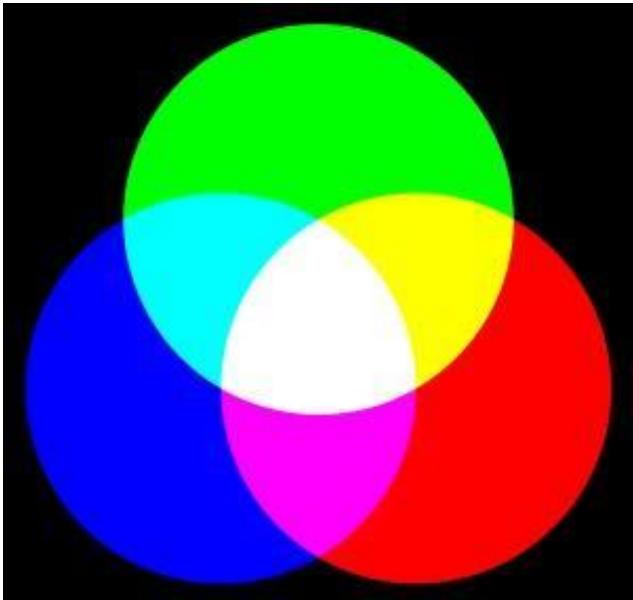  
Hình 7.1: Thêm đỏ vào xanh lá cây tạo ra vàng; thêm vàng vào xanh lam tạo ra trắng [19]

Ví dụ khi bạn chọn màu ở đây. Khi bạn chọn một màu thì sẽ ra một bộ ba số tương ứng (r,g,b) Với mỗi bộ 3 số r, g, b nguyên trong khoảng [0, 255] sẽ cho ra một màu khác nhau. Do có 256 cách chọn r, 256 cách chọn màu g, 256 cách chọn ${ \mathfrak { b } } = >$ tổng số màu có thể tạo ra bằng hệ màu RGB là: $2 5 6 * 2 5 6 * 2 5 6 = 1 6 7 7 7 2 1 6 .$ màu !!!

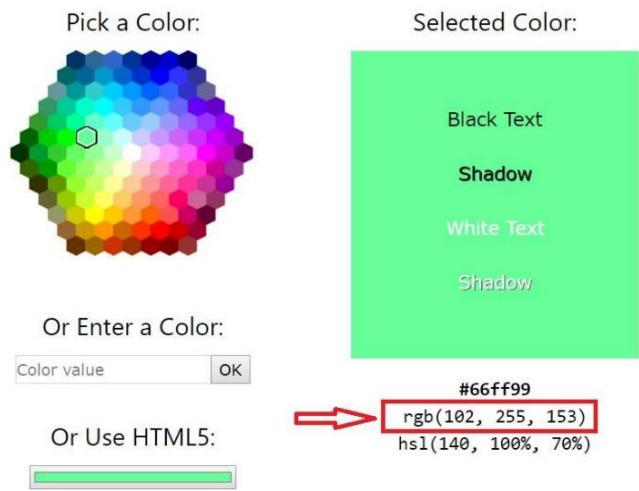  
Hình 7.2: màu được chọn là rgb(102, 255, 153), nghĩa là $\mathrm { r } { = } 1 0 2$ , $\mathrm { g } { = } 2 5 5$ , $\mathtt { b } \mathtt { = } 1 5 3$ .

# 1.2 Ảnh màu

Ví dụ về ảnh màu trong hình 7.3

Khi bạn kích chuột phải vào ảnh trong máy tính, bạn chọn properties (mục cuối cùng), rồi chọn tab details

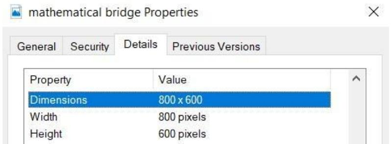

Bạn sẽ thấy chiều dài ảnh là 800 pixels (viết tắt px), chiều rộng 600 pixels, kích thước là $8 0 0 ^ { * } 6 0 0$ . Trước giờ chỉ học đơn vị đo là mét hay centimet, pixel là gì nhỉ ?

Theo wiki, pixel (hay điểm ảnh) là một khối màu rất nhỏ và là đơn vị cơ bản nhất để tạo nên một bức ảnh kỹ thuật số.

Vậy bức ảnh trên kích thước 800 pixel $* 6 0 0$ pixel, có thể biểu diễn dưới dạng một ma trận kích thước $6 0 0 ^ { * } 8 0 0$ (vì định nghĩa ma trận là số hàng nhân số cột).

  
Hình 7.3: Mathematical bridge, Cambridge

Trong đó mỗi phần tử $w _ { i j }$ là một pixel.

Như vậy có thể hiểu là mỗi pixel thì biểu diễn một màu và bức ảnh trên là sự kết hợp rất nhiều pixel. Hiểu đơn giản thì in bức ảnh ra, kẻ ô vuông như chơi cờ ca rô với 800

đường thẳng ở chiều dài, 600 đường ở chiều rộng, thì mỗi ô vuông là một pixel, biểu diễn một chấm màu.

Tuy nhiên để biểu diễn 1 màu ta cần 3 thông số (r,g,b) nên gọi $w _ { i j } { = } ( r _ { i j } , g _ { i j } , b _ { i j } )$ để biểu diễn dưới dạng ma trận thì sẽ như sau:

Hình 7.4: Ảnh màu kích thước $3 ^ { * } 3$ biểu diễn dạng ma trận, mỗi pixel biểu diễn giá trị (r,g,b)

Để tiện lưu trữ và xử lý không thể lưu trong 1 ma trận như thế kia mà sẽ tách mỗi giá trị màu trong mỗi pixel ra một ma trận riêng.

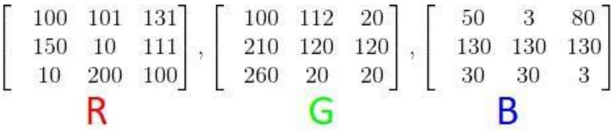  
Hình 7.5: Tách ma trận trên thành 3 ma trận cùng kích thước: mỗi ma trận lưu giá trị từng màu khác nhau red, green, blue   
Hình 7.7: Vector v kích thước n, ma trận W kích thước $\mathfrak { m } ^ { * } \mathfrak { n }$

Mỗi ma trận được tách ra được gọi là 1 channel nên ảnh màu được gọi là 3 channel: channel red, channel green, channel blue.

Tóm tắt: Ảnh màu là một ma trận các pixel mà mỗi pixel biểu diễn một điểm màu. Mỗi điểm màu được biểu diễn bằng bộ 3 số (r,g,b). Để tiện cho việc xử lý ảnh thì sẽ tách ma trận pixel ra 3 channel red, green, blue.

# 1.3 Tensor là gì

Khi dữ liệu biểu diễn dạng 1 chiều, người ta gọi là vector, mặc định khi viết vector sẽ viết dưới dạng cột.

Khi dữ liệu dạng 2 chiều, người ta gọi là ma trận, kích thước là số hàng \* số cột.

$$
v = { \left[ \begin{array} { l } { v _ { 1 } } \\ { v _ { 2 } } \\ { \dots } \\ { v _ { n } } \end{array} \right] } , W = { \left[ \begin{array} { l l l l } { \ w _ { 1 1 } } & { w _ { 1 2 } } & { \dots } & { w _ { 1 n } } \\ { w _ { 2 1 } } & { w _ { 2 2 } } & { \dots } & { w _ { 2 n } } \\ { \dots } & { \dots } & { \dots } & { \dots } \\ { w _ { m 1 } } & { w _ { m 2 } } & { \dots } & { w _ { m n } } \end{array} \right] }
$$

Khi dữ liệu nhiều hơn 2 nhiều thì sẽ được gọi là tensor, ví dụ như dữ liệu có 3 chiều.

Để ý thì thấy là ma trận là sự kết hợp của các vector cùng kích thước. Xếp n vector kích thước m cạnh nhau thì sẽ được ma trận $\mathfrak { m } ^ { * } \mathfrak { n }$ . Thì tensor 3 chiều cũng là sự kết hợp của các ma trận cùng kích thước, xếp k ma trận kích thước $\mathfrak { m } ^ { * } \mathfrak { n }$ lên nhau sẽ được tensor kích thước $\mathrm { m } ^ { \ast } \mathrm { n } ^ { \ast } \mathrm { k }$ .

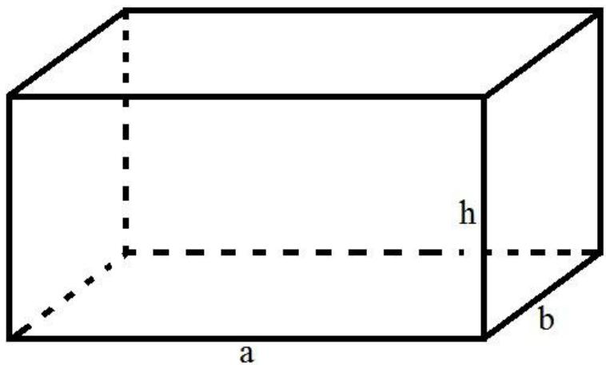  
Hình 7.8: Hình hộp chữ nhật kích thước $\mathtt { a } ^ { * } \mathtt { b } ^ { * } \mathrm { h }$

Tưởng tượng mặt đáy là một ma trận kích thước a $^ { * } \mathfrak { b }$ , được tạo bởi b vector kích thước a. Cả hình hộp là tensor 3 chiều kích thước $\mathtt { a } ^ { * } \mathtt { b } ^ { * } \mathrm { h }$ , được tạo bởi $\mathrm { x } \hat { \mathrm { e } } \mathrm { p }$ h ma trận kích thước $\mathtt { a } ^ { * } \mathtt { b }$ lên nhau.

Do đó biểu diễn ảnh màu trên máy tính $\dot { \sigma }$ phần trên sẽ được biểu diễn dưới dạng tensor 3 chiều kích thước $6 0 0 ^ { * } 8 0 0 ^ { * } 3$ do có 3 ma trận (channel) màu red, green, blue kích thước $6 0 0 ^ { * } 8 0 0$ chồng lên nhau.

Ví dụ biểu diễn ảnh màu kích thước $2 8 ^ { \ast } 2 8$ , biểu diễn dưới dạng tensor $2 8 ^ { * } 2 8 ^ { * } 3$

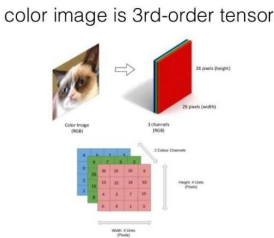  
Hình 7.9: Ảnh màu biểu diễn dưới dạng tensor [1]

# 1.4 Ảnh xám

  
Hình 7.10: Ảnh xám của mathematical bridge

Tương tự ảnh màu, ảnh xám cũng có kích thước 800 pixel $*  _ { 6 0 0 }$ pixel, có thể biểu diễn dưới dạng một ma trận kích thước $6 0 0 ^ { * } 8 0 0$ (vì định nghĩa ma trận là số hàng nhân số cột).

Tuy nhiên mỗi pixel trong ảnh xám chỉ cần biểu diễn bằng một giá trị nguyên trong khoảng từ [0,255] thay vì (r,g,b) như trong ảnh màu. Do đó khi biểu diễn ảnh xám trong máy tính chỉ cần một ma trận là đủ.

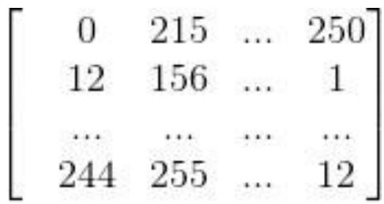  
Hình 7.11: Biểu diễn ảnh xám

Giá trị 0 là màu đen, 255 là màu trắng và giá trị pixel càng gần 0 thì càng tối và càng gần 255 thì càng sáng.

# 1.5 Chuyển hệ màu của ảnh

Mỗi pixel trong ảnh màu được biểu diễn bằng 3 giá trị (r,g,b) còn trong ảnh xám chỉ cần 1 giá trị x để biểu diễn.

Khi chuyển từ ảnh màu sang ảnh xám ta có thể dùng công thức: $\mathrm { \bf x = r } \mathrm { \bf * } 0 . 2 9 9 + \mathrm { \bf g } \mathrm { \bf * }$ \* 0.587 + b \* 0.114.

Tuy nhiên khi chuyển ngược lại, bạn chỉ biết giá trị x và cần đi tìm r,g,b nên sẽ không chính xác.

# 2. Phép tính convolution

# 2.1 Convolution

Để cho dễ hình dung tôi sẽ lấy ví dụ trên ảnh xám, tức là ảnh được biểu diễn dưới dạng ma trận A kích thước $\mathfrak { m } ^ { * } \mathfrak { n }$ .

Ta định nghĩa kernel là một ma trận vuông kích thước $\mathrm { k ^ { * } k }$ trong đó k là số lẻ. k có thể bằng 1, 3, 5, 7, 9,... Ví dụ kernel kích thước $3 ^ { * } 3$

$$
W = { \left[ \begin{array} { l l l } { 1 } & { 0 } & { 1 } \\ { 0 } & { 1 } & { 0 } \\ { 1 } & { 0 } & { 1 } \end{array} \right] }
$$

Kí hiệu phép tính convolution $( \otimes )$ , kí hiệu $Y { = } X \otimes W$

Với mỗi phần tử $x _ { i j }$ trong ma trận X lấy ra một ma trận có kích thước bằng kích thước của kernel W có phần tử $x _ { i j }$ làm trung tâm (đây là vì sao kích thước của kernel thường lẻ) gọi là ma trận A. Sau đó tính tổng các phần tử của phép tính element-wise của ma trận A và ma trận W, rồi viết vào ma trận kết quả Y.

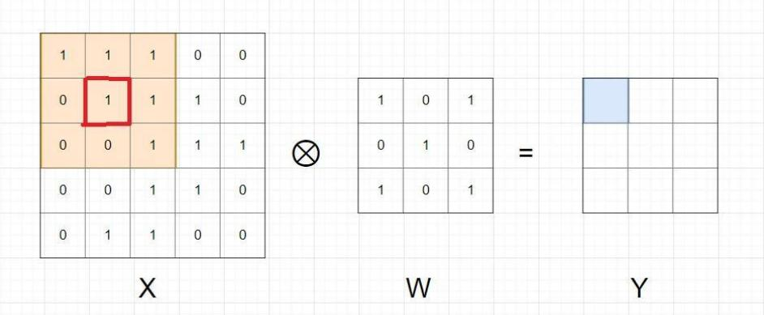

Ví dụ khi tính tại $x _ { 2 2 }$ (ô khoanh đỏ trong hình), ma trận A cùng kích thước với W, ${ \tt c o } x _ { 2 2 }$ làm trung tâm có màu nền da cam như trong hình. Sau đó tính $y _ { 1 1 }$ $= s u m ( A \otimes W ) = x _ { 1 1 } * w _ { 1 1 } + x _ { 1 2 } * w _ { 1 2 } + x _ { 1 3 } * w _ { 1 3 } + x _ { 2 1 } * w _ { 2 1 } + x _ { 2 2 } * w _ { 2 2 } + x _ { 2 3 } * w _ { 2 3 } + x _ { 3 1 } * w _ { 3 1 } + x _ { 3 2 } * w _ { 3 2 } + x _ { 3 3 } * w _ { 3 3 } .$ $\ast w _ { 3 3 } = 4$ . Và làm tương tự với các phần tử còn lại trong ma trận.

Thế thì sẽ xử lý thế nào với phần tử ở viền ngoài như $x _ { 1 1 } 2$ Bình thường khi tính thì sẽ bỏ qua các phần tử ở viền ngoài, vì không tìm được ma trận A ở trong X.

Nên bạn để ý thấy ma trận Y có kích thước nhỏ hơn ma trận X. Kích thước của ma trận Y là $\left( \mathrm { m - k + l } \right)$ ) \* (n-k+1).

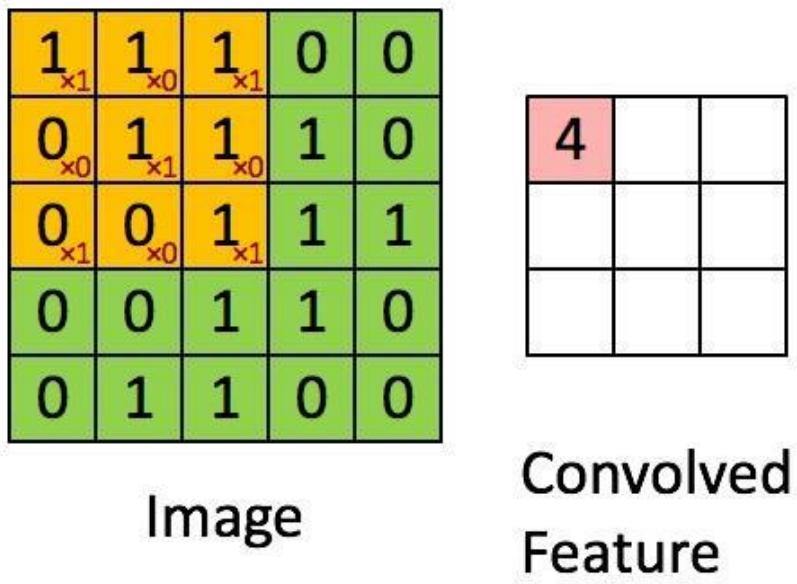  
Hình 7.12: Các bước thực hiện phép tính convolution cho ma trận X với kernel K ở trên

# 2.2 Padding

Như ở trên thì mỗi lần thực hiện phép tính convolution xong thì kích thước ma trận Y đều nhỏ hơn X. Tuy nhiên giờ ta muốn ma trận Y thu được có kích thước bằng ma trận $\mathrm { { } } X { = } >$ Tìm cách giải quyết cho các phần tử $\dot { \mathbf { O } }$ viền $= >$ Thêm giá trị $0 \textrm { ‰}$ viền ngoài ma trận X.

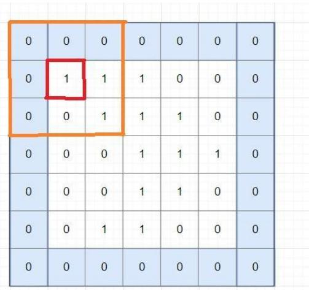  
Hình 7.13: Ma trận X khi thêm viền 0 bên ngoài

Rõ ràng là giờ đã giải quyết được vấn đề tìm A cho phần tử $x _ { 1 1 }$ , và ma trận Y thu được sẽ bằng

kích thước ma trận X ban đầu.

Phép tính này gọi là convolution với padding=1. Padding=k nghĩa là thêm k vector 0 vào mỗi phía (trên, dưới, trái, phải) của ma trận.

# 2.3 Stride

Như ở trên ta thực hiện tuần tự các phần tử trong ma trận X, thu được ma trận Y cùng kích thước ma trận X, ta gọi là stride $\scriptstyle : = 1$ .

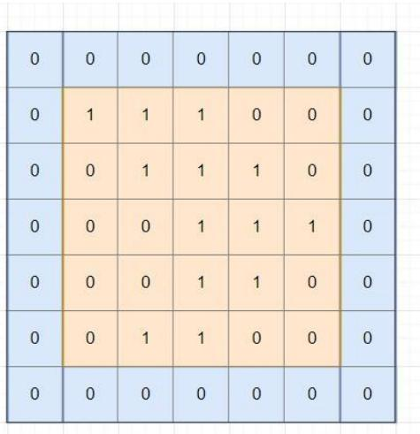  
Hình 7.14: stride ${ \boldsymbol { \mathbf { \rho } } } _ { : = 1 }$ , padding ${ \bf \Pi } _ { ; } = 1$

Tuy nhiên nếu stride $\mathrm { \Phi } = \mathbf { k }$ $( \mathbf { k } > 1 )$ thì ta chỉ thực hiện phép tính convolution trên các phần tử $\dot { \widehat { x } } _ { 1 + i * k , 1 + j * k }$ . Ví dụ ${ \mathrm { k } } = 2$ .

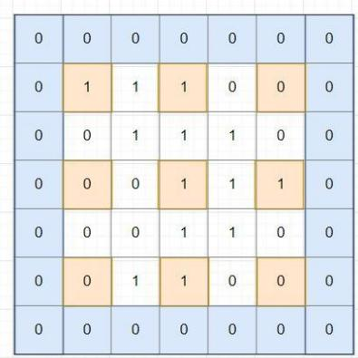  
Hình 7.15: padding $\left[ = 1 \right]$ , stride $^ { \circ 2 }$

Hiểu đơn giản là bắt đầu từ vị trí $x _ { 1 1 }$ sau đó nhảy k bước theo chiều dọc và ngang cho đến hết ma trận X.

Kích thước của ma trận Y là 3\*3 đã giảm đi đáng $\mathrm { k } \mathring { \mathbf e }$ so với ma trận X.

Công thức tổng quát cho phép tính convolution của ma trận X kích thước m\*n với kernel kích thước k\*k, stride $= \mathbf { s }$ , padding $= { \mathfrak { p } }$ ra ma trận Y kích thước là

Stride thường dùng $\mathrm { d } \acute { \mathrm { e } }$ giảm kích thước của ma trận sau phép tính convolution.