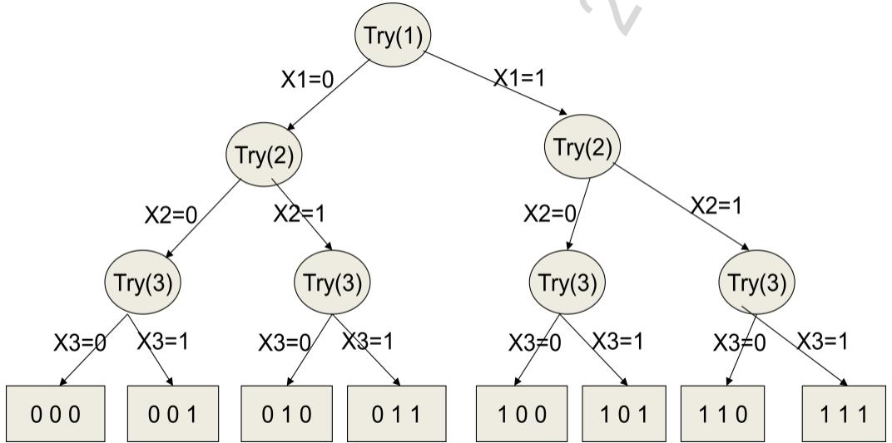
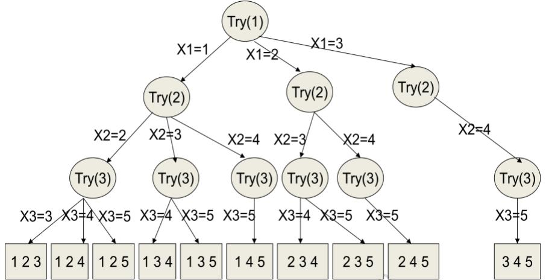
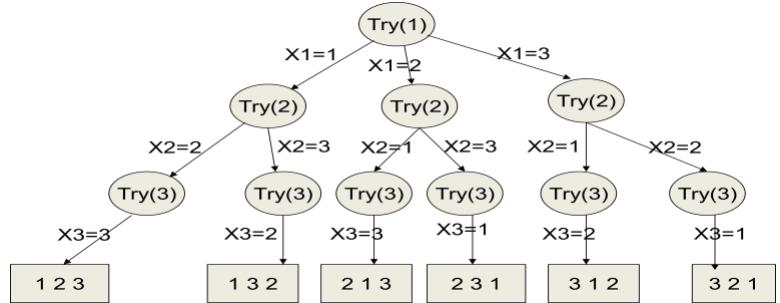
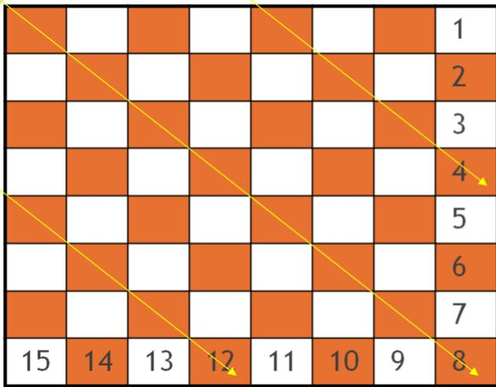
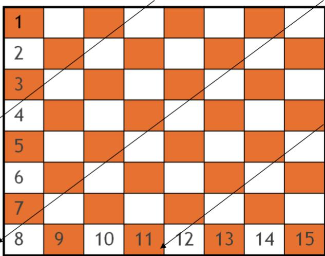

# 1. Mô hình thuật toán quay lui (Backtrack Algorithm)

Giả sử ta cần xác định bộ $X { = } ( x 1 , x 2 , . . . , x \mathrm { n } )$ thỏa mãn một số ràng buộc nào đó. Ứng với mỗi thành phần xi ta có ni khả năng cần lựa chọn. Ứng với mỗi khả năng $j \in n i$ dành cho thành phần xi ta cần thực hiện:

Kiểm tra xem khả năng j có được chấp thuận cho thành phần xi hay không? Nếu khả năng j được chấp thuận thì ta xác định thành phần xi theo khả năng j. Nếu i là thành phần cuối cùng $\scriptstyle ( i = n )$ ta ghi nhận nghiệm của bài toán. Nếu i chưa phải cuối cùng ta xác định thành phần thứ $i + l$ . Nếu không có khả năng j nào được chấp thuận cho thành phần xi thì ta quay lại bước trước đó (i-1) để thử lại các khả năng còn lại.

Thuật toán quay lui được mô tả như sau:

Thuật toán Back-Track ( int i ) { for ( $\mathrm { { j } = < K h i }$ năng $1 >$ ; j <=ni; j++ ){ if (<chấp thuận khả năng j>) { $\mathrm { { X } [ i ] = < k h i n i n g }$ $\mathrm { j } { \mathrm { > } } ; \mathrm { i f } \left( \mathrm { i } = = \mathrm { n } \right)$ Result(); else BackTrack $( \mathrm { i } { + } 1 )$ ; }   
}

Ví dụ 2.7. Duyệt các xâu nhị phân có độ dài n.

Lời giải. Xâu nhị phân $X = ( x \mathrm { 1 } , x 2 , . . . , x \mathrm { n } ) \vert \ \mathrm { X i } = 0 , \ 1 .$ Mỗi xi∈X có hai lựa chọn $\mathbf { \delta X } \mathrm { i } \mathbf { = } 0$ , 1. Cả hai giá trị này đều được chấp thuận mà không cần có thêm bất kỳ điều kiện gì. Thuật toán được mô tả như sau:

void Try ( int i ) { for (int ${ \mathrm { ~ j ~ } } = 0$ ; $\mathrm { j } { < } = 1$ ; $\mathrm  j + + ) \{ \ X [ i ] = j $ ; if (i ==n) Result(); else Try $( \mathrm { i } { + } 1 )$ ; }   
}

Khi đó, việc duyệt các xâu nhị phân có độ dài n ta chỉ cần gọi đến thủ tục Try(1). Cây quay lui được mô tả như Hình 2.1 dưới đây.

  
Hình 2.1. Duyệt các xâu nhị phân độ dài 3

Chương trình duyệt các xâu nhị phân có độ dài n bằng thuật toán quay lui được thể hiện như dưới đây.

#include <iostream>   
#include <iomanip>   
#define MAX 100   
using namespace std;   
int X[MAX], n,   
dem $\scriptstyle { \frac { - 0 } { ! } }$ ;   
void Init(){ //thiết lập độ dài xâu nhị phân cout<<"\n Nhập $\mathfrak { n } ^ { = " }$ ; $\mathrm { c i n } { > } { > } \mathrm { n }$ ;   
}   
void Result(void){ //In ra xâu nhị phân $X [ J = x 1$ , x2,.., xn cout<<"\n Kết quả "<<++dem<<":"; for(int i $= 1$ ; $\mathrm { i } < = \mathrm { n }$ ; i++) cout<<X[i]<<setw(3); }   
void Try(int i){ //thuật toán quay lui for (int $\mathrm { j } ^ { = 0 }$ ; $\mathrm { i } { < } = 1$ ; j++){ //duyệt các khả năng j dành cho xi X[i]=j; //thiết lập thành phần xi là j

$\mathrm { i f ( i \mathrm { = } \mathrm { = } \mathrm { n ) } }$ //nếu i là thành phần cuối cùng Result(); // ta đưa ra kết quả else //trong trường hợp khác $\operatorname { T r y } ( \mathrm { i } { + } 1 )$ ; //ta xác định tiếp thành phần xi+1 } } int main(void){ Init(); Try(1);}

Ví dụ 2.8. Duyệt các tập con $\mathrm { K }$ phần tử của 1, 2, .., N.

Lời giải. Mỗi tập con K phần tử $X = ( x \imath , x 2 , . . . , x \kappa )$ là bộ không tính đến thứ tự K phần tử của 1, 2, .., N. Mỗi xi∈X có $\mathrm { N - K + i }$ lựa chọn. Các giá trị này đều được chấp thuận mà không cần có thêm bất kỳ điều kiện gì. Thuật toán được mô tả như sau:

void Try ( int i ) { for (int $\mathrm { j \ = X [ i - l ] + l }$ ; $\scriptstyle \mathrm { j < = N - K + }$ i; $\mathbf { j } \mathrm { + + ) \{ X [ i ] = j ; \quad } $ ; $\begin{array} { r l r l } { \operatorname { i f } } & { { } \quad ( \mathrm { i } } & { } & { { } = - \mathrm { K } ) } \end{array}$ Result(); else Try $( \mathrm { i } { + } 1 )$ ; }

Khi đó, việc duyệt các tập con K phần tử của 1, 2, .., N ta chỉ cần gọi đến thủ tục Try(1).   
Cây quay lui được mô tả như hình dưới đây.

  
Hình 2.2. Duyệt các tập con 3 phần tử của 1, 2, 3, 4, 5.

Chương trình liệt kê các tập con k phần tử của 1, 2, ..,n được thể hiện như sau.

#include <iostream> #include <iomanip> #define MAX 100

using namespace std; int X[MAX], n, k, dem $\scriptstyle = 0$ ; void Init(){//thiết lập giá trị cho n, k cout<<"\n Nhập n, k: "; cin>>n>>k; } void Result(void){ cout<<"\n Kết quả "<<++dem<<":";//đưa ra kết quả for(int i $= 1$ ; $\mathrm { i } { < } \mathrm { = } \mathrm { k }$ ; $\mathrm { i } { + } { + }$ ) cout<<X[i]<<setw(3); } void Try(int i){//thuật toán quay lui for (int j=X[i-1] $+ 1$ ; j<=n-k+i; j++){ //duyệt trên tập khả năng dành cho xi X[i]=j; //thiết lập thành phần xi là j if $( \mathrm { i } { = } { = } \mathrm { k } )$ ) //nếu xi đã là thành phần cuối Result(); //ta đưa ra kết quả else //trong trường hợp khác Try(i+1); //ta đi xác định thành phần thứ xi+1 } } t main(void){ Init(); X[0] =0 ; Try(1);

Ví dụ 2.9. Duyệt các hoán vị của 1, 2, .., N.

Lời giải. Mỗi hoán vị $X = ( x \mathrm { 1 } , x \mathrm { 2 } , . . . , x \mathrm { K } )$ là bộ có tính đến thứ tự của 1, 2, .., N. Mỗi xi∈X có N lựa chọn. Khi $\mathbf { X } \mathrm { i } = .$ j được lựa chọn thì giá trị này sẽ không được chấp thuận cho các thành phần còn lại. Để ghi nhận điều này, ta sử dụng mảng chuaxet[] $\mathrm { g } \dot { \hat { \mathrm { o } } } \mathrm { m } \mathrm { N }$ phần tử. Nếu chuaxet[i] $=$ True điều đó có nghĩa giá trị i được chấp thuận và chuaxet[i] $=$ False tương ứng với giá trị i không được phép sử dụng. Thuật toán được mô tả như sau:

void Try ( int i ) { for (int $\mathrm { j } { = } 1$ ; $\mathrm { j } < = \mathrm { N }$ ; $\mathrm { j } { + } { + } ) \left\{ \begin{array} { r l } \end{array} \right.$ if (chuaxet[j] ) { X[i] = j;chuaxet[j] $=$ False; if ( $\mathrm { i } = \mathrm { = N } )$ Result(); else Try $( \mathrm { i } { + } 1 )$ ; Chuaxet[j] $=$ True;

} }

Khi đó, việc duyệt các hoán vị của 1, 2, .., N ta chỉ cần gọi đến thủ tục Try(1). Cây quay lui được mô tả như hình dưới đây.

  
Hình 2.3. Duyệt các hoán vị của 1, 2, 3.

Chương trình liệt kê tất cả các hoán vị của 1, 2, .., n được thể hiện như sau:

#include <iostream> #include <iomanip> #define MAX 100 using namespace std; int X[MAX], n, dem $\scriptstyle { \frac { - 0 } { ! } }$ ; bool chuaxet[MAX];   
void Init(){//thiết lập giá trị cho n cout<<"\n Nhập $\mathrm { n } { = } "$ ; cin>>n; for(int $\mathrm { i } { = } 1$ ; $\mathrm { i } < = \mathrm { n }$ ; $\mathrm { i } { + } { + }$ ) //thiết lập giá trị cho mảng chuaxet[] chuaxet[i] $=$ true; } void Result(void){ //Đưa ra hoán vị hiện tại cout<<"\n Kết quả "<<++dem<<":"; for(int $_ { , } = 1$ ; $\mathrm { i } < = \mathrm { n }$ ; $\mathrm { i } { + } { + }$ ) cout<<X[i]<<setw(3);   
} void Try(int i){ //thuật toán quay lui duyệt các hoán vị của 1, 2, .., n. for (int $\mathrm { j } { = } 1$ ; j $< = \mathbf { n }$ ; $\mathrm { j } { + + }$ ){ //duyệt các khả năng j cho thành phần xi if(chuaxet[j]){ //nếu khả năng j đúng chưa được dùng đến X[i] $\mathrm { \Phi } = \mathrm { j }$ ; //thiết lập thành phần xi là j chuaxet[j]=false; //thiết lập chuaxet[j] đã được dùng if(i==n) //nếu xi đã là thành phần cuối cùng Result();//ta đưa ra kết quả

else ///trong trường hợp khác Try(i+1); //ta xác định tiếp thành phần thứ $i + l$ chuaxet[j]=true; //nhớ hoàn trả lại giá trị cho chuaxet[j] } } } int main(void){ Init(); Try(1); }

Ví dụ 2.10. Bài toán $_ \mathrm { N }$ quân hậu. Trên bàn cờ kích cỡ $\mathrm { N } { \times } \mathrm { N } ,$ , hãy đặt N quân hậu mỗi quân trên 1 hàng sao cho tất cả các quân hậu đều không ăn được lẫn nhau.

Lời giải. Gọi ${ \bf X } = ( { \bf x } _ { 1 } , { \bf x } _ { 2 } , . . . , { \bf X } { \mathrm { n } } )$ là một hoán vị của 1, 2, .., n.. Khi đó, $\mathbf { \boldsymbol { x } } \mathbf { \mathrm { { i } } } = \mathbf { \mathrm { { j } } }$ được hiểu là quân hậu hàng thứ i đặt ở cột j. $\mathrm { D \acute { e } }$ các quân hậu khác không thể ăn được, quân hậu thứ i cần không được lấy trùng với bất kỳ cột nào, không được cùng đường chéo xuôi, không được cùng trên đường chéo ngược. Ta có n cột $\mathrm { C o t } = \left( \mathrm { c } _ { 1 } , . . . \mathrm { c } _ { \mathrm { n } } \right)$ , có $\mathrm { X u o i } [ 2 ^ { * } \mathrm { n - 1 } ]$ đường chéo xuôi, Nguoc $[ 2 ^ { * } \mathrm { { n - } } 1 ]$ đường chéo ngược. Quân hậu $\dot { \mathbf { O } }$ hàng $i$ được đặt vào cột $j$ nếu $\mathrm { { A } [ j ] = }$ True (chưa có quân hậu nào án ngữ cột j), $\mathrm { X u o i [ i \mathrm { - j \mathrm { + n } ] = \tilde { \Omega } } }$ True (chưa có quân hậu nào án ngữ đường chéo $\mathrm { i - j + n } )$ ), Nguoc $[ \mathrm { i } + \mathrm { j } - 1 ] =$ True (chưa có quân hậu nào án ngữ đường chéo ngược i + j-1).

Đường chéo xuôi Xuoi[i-j+n]

Đường chéo ngược Nguoc[i+j-1]

Hình 2.4. Mô tả các đường chéo, xuôi đường chéo ngược Thuật toán quay lui giải bài toán n quân hậu được mô tả như dưới đây. void Try (int i){ for(int j=1; j<=n; j++){ if( Cot[j] && Xuoi[ i – j + n ] && Nguoc[i + j -1]){

X[i] =j; Cot[j]=FALSE;Xuoi[ i - j + n]=FALSE; Nguoc[ i + j -1]=FALSE; if(i==n) Result(); Cot[j] $=$ TRUE; $\mathrm { X u o i } [ \mathrm { ~ i - j + n } ] = \mathrm { T R U E } ;$ $\mathrm { N g u o c [ \ i + j - 1 ] = }$ TRUE; } } }   
Chương trình giải bài toán n quân hậu được thể hiện như dưới đây.   
#include <iostream>   
#include <iomanip>   
#define MAX 100   
using namespace std;   
int X[MAX], n,   
dem $\scriptstyle { \frac { - 0 } { ! } }$ ;   
bool COT[MAX], DCXUOI[MAX], DCNGUOC[MAX];;   
void Init(){ //thiết lập kích cỡ bàn cờ cout<<"\n Nhap $\mathfrak { n } ^ { = " }$ ; $\mathrm { c i n } \mathrm { > } \mathrm { > n }$ ; for(int $\mathrm { i } { = } 1$ ; $\mathrm { i } < = \mathrm { n }$ ; $\mathrm { i } { + } { + } \mathrm { \backslash }$ ){ //thiết lập tất cả các cột đều chưa bị án ngữ COT[i] $=$ true; } for(int $\mathrm { i } { = } 1$ ; $\mathrm { i } { < } 2 ^ { \ast } \mathrm { n }$ ; $\mathrm { i } { + } { + }$ ){ //thiết lập các đường chéo DCXUOI[i] $\scriptstyle \left| = { \begin{array} { l } { } \end{array} } \right.$ true; // đường chéo xuôi chưa bị án ngữ DCNGUOC[i] $=$ true; // đường chéo ngược chưa bị án ngữ }   
}   
void Result(void){ //đưa ra một phương án cout<<"\n Kết quả

"<<++dem<<":"; for(int i =1; i<=n; i++) cout<<X[i]<<setw(3); } void Try(int i){ //đây là thuật toán quay lui for (int $\mathrm { j } { = } 1$ ; $\scriptstyle \mathbf { j } < = \mathbf { n }$ ; j++){ //duyệt các khả năng j đặt quân hậu vào hàng i if( COT[j] && DCXUOI[i- $\mathrm { j } + \mathrm { n } ]$ && DCNGUOC[i+j-1]){ //nếu đúng cột j, đường chéo xuôi i-j $+ n$ , đường chéo ngược $i + j - I$ // chưa bị án ngữ $\mathrm { X } [ \mathrm { i } ] { = } \mathrm { j }$ ; //ta đặt được quân hậu hàng i vào vột j COT[j] $=$ false; // cột j đã bị án ngữ DCXUOI[i-j+n] $=$ false; // đường chéo xuôi $i { - } j { + } n$ bị án ngữ DCNGUOC[i+j-1] $=$ false;//đường chéo ngược $i + j - I$ bị án ngữ if $\scriptstyle \mathbf { \dot { i } } = = = \mathbf { n } $ ) // nếu đây là quân hậu hàng n Result();// ta đưa ra phương án hiện tại else //trong trường hợp khác $\operatorname { T r y } ( \mathrm { i } { + } 1 )$ ; // ta đặt tiếp quân hậu hành $i + l$ ${ \mathrm { C O T } } [ { \mathrm { j } } ] =$ true; // nhớ trả lại giá trị cột j DCXUOI[i- $\mathsf { j } + \mathsf { n } ]$ =true; //trả lại giá trị đường chéo xuôi DCNGUOC[i+j-1] $=$ true; // trả lại giá trị đường chéo ngược } } } int main(void){ Init(); Try(1); }