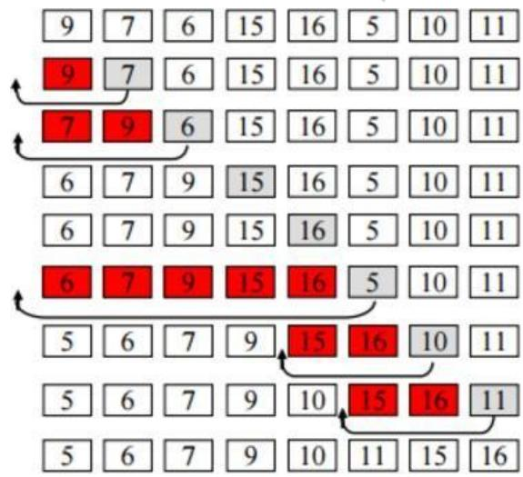

Một trong những vấn đề quan trọng bậc nhất của khoa học máy tính là tìm kiếm thông tin. Có thể nói, hầu hết các hoạt động của người dùng hoặc các ứng dụng tin học đều liên quan đến tìm kiếm. Muốn tìm kiếm thông tinh nhanh, hiệu quả, chính xác ta cần có phương pháp tổ chức và sắp xếp dữ liệu tốt. Chính vì vậy, sắp xếp được xem như giai đoạn đầu chuẩn bị cho quá trình tìm kiếm. Nội dung chương này trình bày các thuật toán sắp xếp và tìm kiếm, bao gồm: các thuật toán sắp xếp đơn giản, các thuật toán sắp xếp nhanh, các thuật toán tìm kiếm tuyến tính, tìm kiếm nhị phân, tìm kiếm nội suy & tìm kiếm Jumping.

# 1. Giới thiệu vấn đề

Bài toán tìm kiếm có thể được phát biểu như sau: Cho dãy gồm n đối tượng r1, r2, .., rn. Mỗi đối tượng ri được tương ứng với một khóa ki $( 1 { \underline { { \leq } } } \mathrm { i } \leq \mathrm { n } )$ . Nhiệm vụ của tìm kiếm là xây dựng thuật toán tìm đối tượng có giá trị khóa là $X$ cho trước. $X$ còn được gọi là khóa tìm kiếm hay tham biến tìm kiếm (argument). Bài toán tìm kiếm bao giờ cũng hoàn thành bởi một trong hai tình huống:

Nếu tìm thấy đối tượng có khóa $X$ trong tập các đối tượng thì ta nói phép tìm kiếm thành công (successful). Nếu không tìm thấy đối tượng có khóa $X$ trong tập các đối tượng thì ta nói phép tìm kiếm không thành công (unsuccessful).

Sắp xếp là phương pháp bố trí lại các đối tượng theo một trật tự nào đó. Ví dụ bố trí theo thứ tự tăng dần hoặc giảm dần đối với dãy số, bố trị theo thứ tự từ điển đối với các xâu ký tự. Mục tiêu của sắp xếp là để lưu trữ và tìm kiếm đối tượng (thông tin) để đạt hiệu quả cao trong tìm kiếm. Có thể nói, sắp xếp là sân sau quả quá trình tìm kiếm. Muốn tìm kiếm và cung cấp thông tin nhanh thì ta cần phải sắp xếp thông tin sao cho hợp lý. Bài toán sắp xếp có thể được phát biểu như sau:

Bài toán sắp xếp: Cho dãy gồm n đối tượng r1, r2, .., rn. Mỗi đối tượng ri được tương ứng với một khóa $\mathrm { k i } ( 1 { \leq } \mathrm { i } \leq \mathrm { n } )$ . Nhiệm vụ của sắp xếp là xây dựng thuật toán bố trí các đối tượng theo một trật tự nào đó của các giá trị khóa. Trật tự của các giá trị khóa có thể là tăng dần hoặc giảm dần tùy thuộc vào mỗi thuật toán tìm kiếm cụ thể.

Trong các mục tiếp theo, chúng ta xem tập các đối tượng cần sắp xếp là tập các số. Việc mở rộng các số cho các bản ghi tổng quát cũng được thực hiện tương tự bằng cách thay đổi các kiểu dữ liệu tương ứng. Cũng giống như tìm kiếm, việc làm này không làm mất đi bản chất của thuật toán.

# 2. Các thuật toán sắp xếp đơn giản

Các thuật toán sắp xếp đơn giản được trình bày ở đây bao gồm:

Thuật toán sắp xếp kiểu lựa chọn (Selection Sort).

Thuật toán sắp xếp kiểu chèn trực tiếp (Insertion Sort). Thuật toán sắp xếp kiểu sủi bọt (Bubble Sort)

# 2.1 Thuật toán Selection-Sort

Thuật toán sắp xếp đơn giản nhất được đề cập đến là thuật toán sắp xếp kiểu chọn. Thuật toán thực hiện sắp xếp dãy các đối tượng bằng cách lặp lại việc tìm kiếm phần tử có giá trị nhỏ nhất từ thành phần chưa được sắp xếp trong mảng và đặt nó vào vị trí đầu tiên của dãy. Trên dãy các đối tượng ban đầu, thuật toán luôn duy trì hai dãy con: dãy con đã được sắp xếp là các phần tử bên trái của dãy và dãy con chưa được sắp xếp là các phần tử bên phải của dãy. Quá trình lặp sẽ kết thúc khi dãy con chưa được sắp xếp chỉ còn lại đúng một phần tử. Thuật toán được trình bày chi tiết trong Hình 3.1.

# a) Biểu diễn thuật toán

Thuât toán Selection-Sort:

# Input:

· Day các aói tuong (cac só) : Arr[0], Arr[1]..,Arr[n-1].   
• só luong các dói tuong càn sáp xép: n.

# Output:

• Day các aói twong da auoc sáp xép (các só) :Arr[0], Arr[1]…ArrIn-1].

Formats: Selection-Sort(Arr[l, n);

# Actions:

for $( 1 = 0 ; 1 < n - 1 ; 1 + + ) \left\{ \begin{array} { r l } \end{array} \right.$ llduyet các phàn tup i=0, 1, ., n-1 min_idx $=$ i; llgoi min_idx là vi trí cúa phàn túr nhō nhát trong dāy con for $( \mathrm { ~ j = i ~ } + 1 ; \mathrm { j < n } ; \mathrm { j + + ~ } ) \left\{ \begin{array} { r l } \end{array} \right.$ llduyet tir phàn túr tiép theo $j { = } i { + } 1 , . . . , n$ if (Arr[i] $>$ Arrlil ) lI néu Arrli] khòng phái nhó nhát trong dāy con min_idx $=$ j; llghi nhán dày mói là vi trí phàn túr nhó nhát. } lldǎt phàn tir nhó nhát vào vi trí dàu tiēn cúa dāy con chua duoc sáp Temp $=$ Arr[] ; Arr[i] $=$ Arr[min_idx]; Arr[min_idx] $=$ temp; } End.

# b) Độ phức tạp thuật toán

Độ phức tạp thuật toán Selection Sort là $\mathrm { O } ( \mathsf { N } ^ { 2 } )$ , trong đó N là số lượng phần tử cần sắp xếp. Bạn đọc tự tìm hiểu phương pháp xác định độ phức tạp thuật toán Selection Sort trong các tài liệu tham khảo liên quan.

# c) Kiểm nghiệm thuật toán

Kièm nghiem thuàt toán: $\mathsf { A r r } [ ] = \{ \ : 9 , 7 , 1 2 , 8 , 6 , 5$ }, ${ \mathsf n } = 6$

int $\mathbf { n } =$ sizeof(arr)/sizeof(arr[0]); SelectionSort(arr, n); cout<<"Dãy số được sắp: \n"; printArray(arr, n); }

# 2.2 Thuật toán Insertion Sort

Thuật toán sắp xếp kiểu chèn được thực hiện đơn giản theo cách của người chơi bài thông thường. Phương pháp được thực hiện như sau:

Lấy phần tử đầu tiên Arr[0] (quân bài đầu tiên) như vậy ta có dãy một phần tử được sắp. Lấy phần tiếp theo (quân bài tiếp theo) Arr[1] và tìm vị trí thích hợp chèn Arr[1] vào dãy Arr[0] để có dãy hai phần tử đã được sắp. Tổng quát, tại bước thứ i ta lấy phần tử thứ i và chèn vào dãy Arr[0],..,Arr[i-1] đã được sắp trước đó để nhận được dãy i phần tử được sắp. Quá trình sắp xếp sẽ kết thúc khi quân bài cuối cùng $( \mathbf { i } = \mathbf { n } )$ được chèn đúng vị trí. Thuật toán Insertion Sort được mô tả chi tiết trong Hình 3.2.

# a) Biểu diễn thuật toán

Thuat toan Insertion-Sort:

Input:

· Day các aói tuqng (các só : Arr[0], Arr[1],…., rr[n-1].   
· só luong các dói tuong càn sáp xép: n.

# Output:

• Day các adói turong da dugc sáp xép (các só) : Arr[0], Arr[1],…,Arr[n-1].

Formats: Insertion-Sort(Arr, n):

Actions: for $( \mathsf { i } = 1 ; \mathsf { i } < \mathsf { n } ; \mathsf { i } + + ) .$ { Ip i=1, 2,., .. key $=$ Arrlij; Ikey la phan tu can chèn vao day Arr[o],., Arrli-1] $j = i - 1$ while $( \mathrm { j } > = 0 \ \& \& \ \mathsf { A r r } [ \mathrm { j } ] > \mathsf { k e y } )$ { lIDuyet lüi tiùr vi trí j=i-1 Arr[j+1] $=$ Arr]; lldich chuyen Arr[i] len vi trí Arr[ji+1] $j = j - 1$ } Arr[i+1] $=$ key; Il vi trí thich hop cua key trong dāy là Arr[j+1] }   
End.

b) Độ phức tạp thuật toán

Độ phức tạp thuật toán là $\mathrm { O } ( \mathrm { N } ^ { 2 } )$ , với N là số lượng phần tử. Thuật toán có thể cải tiến bằng cách sử dụng hàng đợi ưu tiên với độ phức tạp O(N.Log(N)).

# c) Kiểm nghiệm thuật toán

c) Cài đặt thuật toán #include <iostream> #include <iomanip> using namespace std; void insertionSort(int arr[], int n){ int i, key, j; for $\begin{array} { l } { { \begin{array} { l } { = 1 ; { \mathrm { i } } < { \mathrm { \bar { n } } } ; { \mathrm { i } } + + ) \{ } \\ { \displaystyle { \mathrm { k e y } } = } \\ { \displaystyle { \mathrm { a r r } [ { \mathrm { i } } ] } ; { \mathrm { j } } = } \\ { { \mathrm { i } } . { \mathrm { 1 } } . } \end{array} } } \end{array}$ i-1; while $( \mathrm { j } > = 0$ && $\operatorname { a r r } [ \operatorname { j } ] > \ker ) \big \{$ { arr[j+1] = arr[j]; $\mathrm { j } = \mathrm { j } - 1$ ; } $\operatorname { a r r } [ \operatorname { j } + 1 ] = \ker ;$ } } void printArray(int arr[], int n){ int i;cout $\leq < " \ln$ Day so duoc sap:"; for $( \mathrm { i } { = } 0 ; \mathrm { i } < \mathrm { n } ; \mathrm { i } { + } + )$ cout<<arr[i]<<setw(3);

}   
int main(){ int $\mathrm { a r r } [ ] = \{ 1 2 , 1 1 , 1 3 , 5 , 6 \}$ ; int $\mathbf { n } =$ sizeof(arr)/sizeof(arr[0]); insertionSort(arr, n); printArray(arr, n);   
}