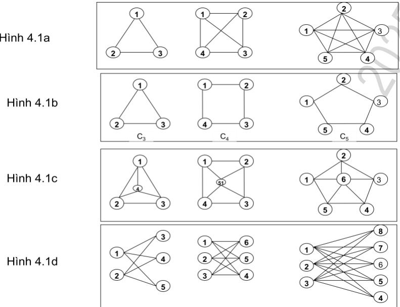
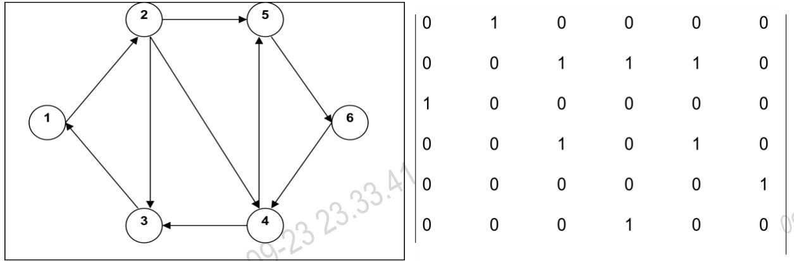
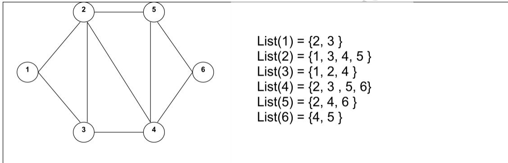

Đồ thị $\mathrm { l } \dot { { \mathrm { a } } } \ \mathrm { m } \hat { \mathrm { o } } \mathrm { t }$ cấu trúc dữ liệu rời rạc bao gồm các đỉnh và các cạnh nối các cặp đỉnh này. Với quan niệm như trên, một mạng máy tính được xem như một đồ thị có mỗi đỉnh là một máy tính, có các cạnh là một liên kết giữa các máy tính khác nhau trong mạng. Các mạch điện, các hệ thống giao thông, các mạng xã hội đều được xem xét như một đồ thị. Có thể nói đồ thị được ứng dụng rộng rãi trong nhiều lĩnh vực khác nhau của khoa học máy tính. Nội dung chính của chương này đề cập đến phương pháp biểu diễn và các thuật toán trên đồ thị.

# 1. Định nghĩa và khái niệm

Ta có thể phân chia đồ thị thành hai loại: đồ thị vô hướng (directed graph) và đồ thị có hướng (directed graph). Mỗi loại đồ thị lại được chia thành 3 loại: đơn đồ thị, đa đồ thị và giả đồ thị. Mỗi loại đồ thị có các thuật ngữ chung và những khái niệm riêng. Dưới đây là một số thuật ngữ cơ bản trên các loại $\mathtt { d } \overset { \triangledown } { \hat { \boldsymbol { \alpha } } }$ thị.

# 1.1 Một số thuật ngữ cơ bản trên đồ thị

Định nghĩa. Bộ đô $G = < V , E >$ , trong đó $V = \{ 1 , 2 , . . , \mathtt { n } \}$ là tập hợp hữu hạn được gọi là tập đỉnh, $E$ là tập có thứ tự hoặc không có thứ tự các cặp đỉnh trong V được gọi là tập cạnh.

Đồ thị vô hướng. Đồ thị $\mathrm { G } { = } { < } \mathrm { V }$ , $\mathrm { E > }$ được gọi là đồ thị vô hướng nếu các cạnh thuộc E là các cặp không tính đến thứ tự các đỉnh trong V.

Đơn đồ thị vô hướng. Đồ thị $\mathrm { G } { = } { < } \mathrm { V }$ , $\mathrm { E > }$ được gọi là đơn đồ thị vô hướng nếu G là đồ thị vô hướng và giữa hai đỉnh bất kỳ thuộc V có nhiều nhất một cạnh nối.

Đa đồ thị vô hướng. Đồ thị $\mathrm { G } { = } { < } \mathrm { V }$ , $\mathrm { E > }$ được gọi là đơn đồ thị vô hướng nếu là đồ thị vô hướng và tồn tại một cặp đỉnh trong V có nhiều hơn một cạnh nối. Cạnh e1∈E, e2∈E được gọi là cạnh bội nếu chúng cùng chung cặp đỉnh.

Giả đồ thị vô hướng. Đồ thị $\mathrm { G } = < \mathrm { V }$ , $\mathrm { E > }$ bao $\mathrm { g \dot { o } m V }$ là tập đỉnh, E là họ các cặp không có thứ tự gồm hai phần tử (hai phần tử không nhất thiết phải khác nhau) trong V được gọi là các cạnh. Cạnh e được gọi là khuyên nếu có dạng e $\mathbf { \Psi } = ( \mathbf { u } , \mathbf { u } )$ , trong đó u là đỉnh nào đó thuộc V.

Đơn đồ thị có hướng. Đồ thị $\mathrm { G } = < \mathrm { V }$ , $\mathrm { E > }$ bao $\mathrm { g \dot { o } m \ V }$ là tập các đỉnh, E là tập các cặp có thứ tự gồm hai phần tử của V gọi là các cung. Giữa hai đỉnh bất kỳ của G tồn tại nhiều nhất một cung.

Đa đồ thị có hướng. Đồ thị $\mathrm { G } = < \mathrm { V }$ , $\mathrm { E > }$ bao gồm V là tập đỉnh, E là cặp có thứ tự gồm hai phần tử của V được gọi là các cung. Hai cung e1, e2 tương ứng với cùng một cặp đỉnh được gọi là cung lặp.

Giả đồ thị có hướng. Đa đồ thị $\mathrm { G } = < \mathrm { V }$ , $\mathrm { E > }$ , trong đó V là tập đỉnh, E là tập các cặp không có thứ tự $\mathrm { g } \dot { \hat { \mathrm { o } } } \mathrm { m }$ hai phần tử (hai phần tử không nhất thiết phải khác nhau) trong $\mathrm { V }$ được gọi là các cung. Cung e được gọi là khuyên nếu có dạng $\mathtt { e } = \left( \mathtt { u } , \mathtt { u } \right)$ , trong đó u là đỉnh nào đó thuộc V.

# 1.2 Một số thuật ngữ trên đồ thị vô hướng

Đỉnh $\mathbf { k } \mathbf { \hat { e } } .$ . Hai đỉnh $u$ và $\nu$ của đồ thị vô hướng $G = < V ,$ , $E >$ được gọi là $\mathrm { k } \dot { \hat { \mathbf { e } } }$ nhau nếu $( u , \nu )$ là cạnh thuộc đồ thị $G .$ Nếu $e = ( u , \nu )$ là cạnh của đồ thị $G$ thì ta nói cạnh này liên thuộc với hai đỉnh $u$ và $\nu _ { : }$ , hoặc ta nói cạnh $e$ nối đỉnh $u$ với đỉnh $\nu$ , đồng thời các đỉnh $u$ và $\nu$ sẽ được gọi là đỉnh đầu của cạnh $( u , \nu )$ .

Bậc của đỉnh. Ta gọi bậc của đỉnh $\nu$ trong $\mathtt { d } \overset { \triangledown } { \hat { \boldsymbol { \alpha } } }$ thị vô hướng là số cạnh liên thuộc với nó và ký hiệu là $d e g ( \nu )$ . Đỉnh có bậc là 0 được gọi là đỉnh cô lập. Đỉnh có đỉnh bậc 1 được gọi là đỉnh treo.

Đường đi, chu trình. Đường đi độ dài $n$ từ đỉnh $u$ đến đỉnh $\nu$ trên $\mathtt { d } \overset { \triangledown } { \hat { \boldsymbol { \alpha } } }$ thị vô hướng $G { = } { < } V ,$ $E >$ là dãy x0, x1, . . ., xn-1, xn , trong đó n là số nguyên dương, $x o { = } u$ , $x _ { n } { = } \nu _ { \mathrm { { ; } } }$ , $( x _ { i } , x _ { i + I } ) \in E$ , $i = 0 ,$ , 1, 2, . . ., n-1. Đường đi có đỉnh đầu trùng với đỉnh cuối gọi là chu trình.

Tính liên thông. Đồ thị vô hướng được gọi là liên thông nếu luôn tìm được đường đi giữa hai đỉnh bất kỳ của nó.

Thành phần liên thông. Đồ thị vô hướng liên thông thì số thành phần liên thông là 1. Đồ thị vô hướng không liên thông thì số liên thông của đồ thị là số các đồ thị con của nó liên thông.

Đỉnh trụ. Đỉnh u∈V được gọi là đỉnh trụ nếu loại bỏ u cùng với các cạnh nối với u làm tăng thành phần liên thông của đồ thị.

Cạnh cầu. Cạnh (u,v) ∈E được gọi là cầu nếu loại bỏ (u,v) làm tăng thành phần liên thông của đồ thị.

Đỉnh rẽ nhánh. Đỉnh s được gọi là đỉnh rẽ nhánh (đỉnh thắt) của cặp đỉnh u, v nếu mọi đường đi từ u đến v đều qua s.

# 1.3 Một số thuật ngữ trên đồ thị có hướng

Đỉnh $\mathbf { k } \mathbf { \hat { e } } .$ . Nếu $e { = } ( u , \nu )$ là cung của đồ thị có hướng $G$ thì ta nói hai đỉnh $u$ và $\nu$ là $\mathrm { k } \dot { \mathrm { e } }$ nhau, và nói cung $( u , \nu )$ nối đỉnh $u$ với đỉnh $\nu _ { \mathrm { { } _ { \mathrm { { } * } } } }$ , hoặc nói cung này đi ra khỏi đỉnh $u$ và đi vào đỉnh $\nu$ . Đỉnh $u$ được gọi là đỉnh đầu, đỉnh $\nu$ được gọi là đỉnh cuối của cung $( u , \nu )$ .

Bán bậc của đỉnh. Ta gọi bán bậc ra của đỉnh $\nu$ trên đồ thị có hướng là số cung của đồ thị đi ra khỏi $\nu$ và ký hiệu là $d e g ^ { + } ( \nu ) .$ Ta gọi bán bậc vào của đỉnh $\nu$ trên đồ thị có hướng là số cung của đồ thị đi vào v và ký hiệu là deg- $( \nu )$ .

Đường đi. Đường đi độ dài $n$ từ đỉnh $u$ đến đỉnh $\nu$ trong $\mathtt { d } \overset { \mathtt { \backslash } } { \mathtt { d } }$ thị có hướng

$G { = } { < } V , A { > } \mathrm { l i }$ dãy $x o , x I , . . . . , x n$ , trong đó, $n$ là số nguyên dương, $u = x 0 .$ , $\nu = x _ { n }$ , $( x i , x i { + } I )$ $\in E$ . Đường đi như trên có thể biểu diễn thành dãy các cung $: ( x 0 , x I )$ , $( x I , x 2 )$ , . . ., $( x _ { n - I } , x _ { n } )$ . Đỉnh $u$ được gọi là đỉnh đầu, đỉnh $\nu$ được gọi là đỉnh cuối của đường đi. Đường đi có đỉnh đầu trùng với đỉnh cuối $\scriptstyle ( u = \nu )$ được gọi là một chu trình. Đường đi hay chu trình được gọi là đơn nếu như không có hai cạnh nào lặp lại.

Liên thông mạnh. Đồ thị có hướng $\mathrm { G } { = } { < } \mathrm { V }$ , $\mathrm { E > }$ được gọi là liên thông mạnh nếu giữa hai đỉnh bất kỳ u∈V, v∈V đều có đường đi từ u đến v.

Liên thông yếu. Ta gọi $\mathtt { d } \overset { \triangledown } { \hat { \boldsymbol { \alpha } } }$ thị vô hướng tương ứng với đồ thị có hướng $\mathrm { G } { = } { < } \mathrm { V }$ , $\mathrm { E > }$ là đồ thị tạo bởi G và bỏ hướng của các cạnh trong G. Khi đó, đồ thị có hướng $\mathrm { G } { = } { < } \mathrm { V }$ , $\mathrm { E > }$ được gọi là liên thông yếu nếu đồ thị vô hướng tương ứng với nó là liên thông.

Thành phần liên thông mạnh. Đồ thị con có hướng $_ \mathrm { H } = < \mathrm { V } 1$ , $\mathrm { E } 1 >$ được gọi là một thành phần liên thông mạnh của đồ thị có hướng $\mathrm { G } { = } { < } \mathrm { V }$ , $\mathrm { E > }$ nếu V1⊆V, E1⊆E và H liên thông mạnh.

# 1.4 Một số loại đồ thị đặc biệt

Dưới đây là một số dang đơn đồ thị vô hướng đặc biệt có nhiều ứng dụng khác nhau của thực tế.

Đồ thị đầy đủ. Đồ thị đầy đủ n đỉnh, ký hiệu là Kn, là đơn đồ thị vô hướng mà giữa hai đỉnh bất kỳ của nó đều có cạnh nối. Ví dụ đồ thị K3, K4, K5 trong Hình 5.1a.

Đồ thị vòng. Đồ thị vòng Cn (n≥3) có các cạnh (1,2), (2,3),..,(n-1,n), (n,1). Ví dụ đồ thị C3, C4, C5 trong Hình 5.1.b.

Đồ thị bánh xe. Đồ thị bánh xe Wn thu được bằng cách bổ sung một đỉnh nối với tất cả các đỉnh của Cn. Ví dụ đồ thị W3, W4, W5 trong Hình 5.1.c.

Đồ thị hai phía. Đồ thị $\mathbf { G } = < \mathbf { V }$ , $\mathrm { E > }$ được gọi là đồ thị hai phía nếu tập đỉnh V của nó có thể phân hoạch thành hai tập X và Y sao cho mỗi cạnh của đồ thị chỉ có dạng $( x , y )$ , trong đó $x \in X$ và y∈Y. Ví dụ đồ thị K2,3, K33, K3,5 trong Hình 5.1.d.

  
Hình 5.1. Một số dạng đồ thị đặc biệt.

# 2. Biểu diễn đồ thị

Để lưu trữ, xử lý hiệu quả ta cần có phương pháp biểu diễn đồ thị trên máy tính. Ba phương pháp biểu diễn thông dụng thường được ứng dụng trên đồ thị đó là: ma trận kề, danh sách cạnh và danh sách kề. Phương pháp biểu diễn cụ thể được thể hiện như dưới đây.

# 2.1 Biểu diễn bằng ma trận kề

Phương pháp biểu diễn đồ thị bằng ma trận $\mathrm { k } \dot { \hat { \mathbf { e } } }$ là phép làm tương ứng $\mathtt { d } \overset { \triangledown } { \hat { \boldsymbol { \alpha } } }$ thị $\mathrm { G } = < \mathrm { V }$ , $\mathrm { E > }$ với một ma trận vuông cấp n. Các phần tử của ma trận $\mathrm { k } \dot { \hat { \mathbf { e } } }$ được xác định như dưới đây.

$$
a _ { u v } = I \{ ( u , v ) \in E \}
$$

Ví dụ với đồ thị cho bởi Hình 5.2 sẽ cho ta biểu diễn ma trận $\mathrm { k } \dot { \mathrm { e } }$ như sau:

Hình 5.2. Biểu diễn ma trận kề của đồ thị.   

# 2.1.1 Tính chất của ma trận kề:

• Ma trận kề biểu diễn đồ thị vô hướng $\mathrm { G } = < \mathrm { V } , \mathrm { E } > \ .$ là ma trận đối xứng. Ma trận $\mathrm { k } \dot { \hat { \mathbf { e } } }$ biểu diễn đồ thị có hướng $\mathrm { G = < V , E > }$ thường là không đối xứng. Tổng các phần tử của ma trận kề biểu diễn đồ thị vô hướng $\mathrm { G } = < \mathrm { V }$ , $\mathrm { E > }$ bằng 2.m, trong đó m là số cạnh của đồ thị. Tổng các phần tử của ma trận $\mathrm { k } \dot { \mathrm { e } }$ biểu diễn đồ thị có hướng $\mathrm { G } = < \mathrm { V }$ , $\mathrm { E > }$ bằng đúng m, trong đó m là số cạnh của đồ thị. Tổng các phần tử của hàng $u$ hoặc cột $u$ của ma trận $\mathrm { k } \dot { \hat { \mathbf { e } } }$ biểu diễn đồ thị vô hướng $\mathrm { G } \mathrm { = } \mathrm { < V }$ , $\mathrm { E > }$ là bậc của đỉnh u (deg(u)). Tổng các phần tử của hàng $u$ của ma trận $\mathrm { k } \dot { \hat { \mathbf { e } } }$ biểu diễn đồ thị có hướng $\mathrm { G } \mathrm { = } \mathrm { < V }$ , $\mathrm { E > }$ là bán bậc ra của đỉnh u $( \mathrm { d e g ^ { + } ( u ) } )$ . Tổng các phần tử của cột $u$ của ma trận $\mathrm { k } \dot { \hat { \mathbf { e } } }$ biểu diễn đồ thị có hướng $\mathrm { G } =$ ${ < } \mathrm { V }$ , $\mathrm { E > }$ là bán bậc vào của đỉnh u $( \mathrm { d e g \bar { ( u ) } } )$ .

# Ưu điểm của ma trận kề:

• Đơn giản dễ cài đặt trên máy tính bằng cách sử dụng một mảng hai chiều. Dễ dàng kiểm tra được hai đỉnh u $\iota , \nu \mathrm { c } \acute { \mathrm { o } } \mathrm { k } \dot { \hat { \mathrm { e } } }$ với nhau hay không bằng đúng một phép so sánh $( \mathrm { a } [ \mathrm { u } ] [ \mathrm { v } ] \neq 0 )$ .

# Nhược điểm của ma trận kề:

Lãng phí bộ nhớ: bất kể số cạnh nhiều hay ít ta cần $\mathrm { n } ^ { 2 }$ đơn vị bộ nhớ để biểu diễn.   
Không thể biểu diễn được với các đồ thị có số đỉnh lớn .   
Để xem xét đỉnh đỉnh $u$ có những đỉnh $\mathrm { k } \dot { \mathrm { e } }$ nào cần mất n phép so sánh kể cả đỉnh u là đỉnh cô lập hoặc đỉnh treo.

# 2.2 Biểu diễn đồ thị bằng danh sách cạnh

Phương pháp biểu diễn đồ thị $\mathbf { G } = < \mathbf { V }$ , $\mathrm { E > }$ bằng cách liệt kê tất cả các cạnh của nó được gọi là phương pháp biểu diễn bằng danh sách cạnh. Đối với đồ thị có hướng ta liệt kê các cung tương ứng. Đối với đồ thị vô hướng ta chỉ cần liệt kê các cạnh (u,v)∈E mà không cần liệt kê các cạnh (v,u)∈E. Ví dụ về biểu diễn đồ thị bằng danh sách cạnh

được cho trong Hình 5.3.

Hình 5.3. Biểu diễn đồ thị bằng danh sách cạnh

# Tính chất của danh sách cạnh:

● Đỉnh đầu luôn nhỏ hơn đỉnh cuối của mỗi cạnh đối với đồ thị vô hướng. ● Đỉnh đầu không phải lúc nào cũng nhỏ hơn đỉnh cuối của mỗi cạnh đối với

  
Hình 5.4. Biểu diễn đồ thị bằng danh sách kề.

# Tính chất của danh sách $\mathbf { k } \mathbf { \dot { \hat { e } } }$

● Lực lượng tập đỉnh $\mathrm { k } \dot { \hat { \mathbf { e } } }$ của đỉnh $u$ là bậc của đỉnh $u$ đối với đồ thị vô hướng $( \deg ( u ) { = } | \mathrm { L i s t } ( u ) |$ .   
Lực lượng tập đỉnh $\mathrm { k } \dot { \hat { \mathbf { e } } }$ của đỉnh $u$ là bán bậc ra của đỉnh $u$ đối với đồ thị có hướng $( \deg ^ { + } ( u ) { = } | \mathrm { L i s t } ( u ) |$ . Số các số có giá trị $u$ thuộc tất cả các danh sách $\mathrm { k } \dot { \mathrm { e } }$ là bán bậc vào của đỉnh u đối với đồ thị có hướng.

# Ưu điểm của danh sách $\mathbf { k } \mathbf { \dot { \hat { e } } }$ :

● Dễ dàng duyệt tất cả các đỉnh của một danh sách $\mathrm { k } \dot { \hat { \mathbf { e } } } .$ . Dễ dàng duyệt các cạnh của đồ thị trong mỗi danh sách kề. Tối ưu việc cài đặt một số giải thuật trên đồ thị.

# Nhược điểm của danh sách kề:

● Khó khăn cho người học có kỹ năng lập trình yếu vì khi biểu diễn đồ thị ta phải dùng một mảng, mỗi phần tử của nó là một danh sách liên kết.