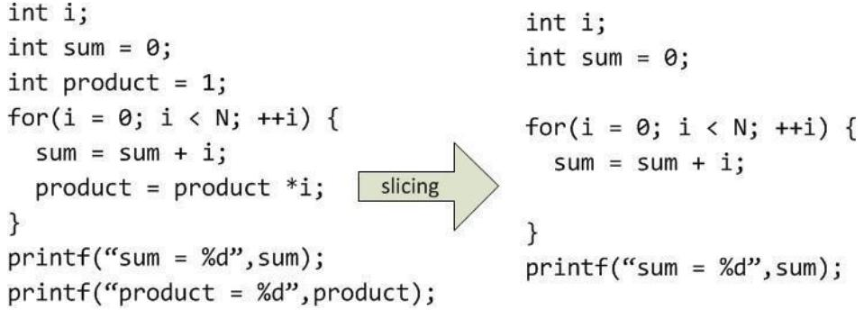

# 1. Kiểm thử dựa trên lát cắt

Kiểm thử dòng dữ liệu như đã trình bày ở trên là một phương pháp tốt nhằm phát hiện các lỗi tiềm tàng bên trong các đơn vị chương trình. Tuy nhiên, độ phức tạp của phương pháp này rất lớn. Với các đơn vị chương trình có kích thước lớn, phương pháp này khá tốn kém. Trong thực tế, để áp dụng phương pháp này, chúng ta không cần phân tích tất cả các câu lệnh thuộc đơn vị chương trình cần kiểm thử. Với mỗi biến, chỉ có một tập con các câu lệnh có liên quan (khai báo, gán giá trị và sử dụng) đến biến này. Dựa trên quan sát này, phương pháp kiểm thử chương trình dựa trên lát cắt được đề xuất nhằm giảm thiểu độ phức tạp trong việc sinh các ca kiểm thử của phương pháp kiểm thử dòng dữ liệu.

# 1.1 Ý tưởng về kiểm thử dựa trên lát cắt

Các lát cắt chương trình đã từng có những bước thăng trầm trong ngành công nghệ phần mềm kể từ đầu những năm 1980. Chúng được đề xuất bởi Weiser [Mar81, Mar84], được dùng như là một phương pháp tiếp cận bảo trì phần mềm, và gần đây nhất chúng được sử dụng như là một cách để kết dính các chức năng. Một phần sự linh hoạt này là do tính tự nhiên cũng như mục đích rõ ràng của lát cắt chương trình.

Thông thường, một lát cắt chương trình là một phần chương trình có ảnh hưởng tới giá trị của biến tại một vị trí trong chương trình. Hình 7.7 là một ví dụ về một lát cắt chương trình ứng với biến sum (phần bên phải). Lát cắt này có được bằng cách lựa chọn các câu lệnh có ảnh hưởng đến biến sum từ đoạn chương trình phía bên trái. Các câu lệnh int product $= 1$ ;, product $=$ product\*i;, và printf("product␣ $\therefore \frac { 0 } { \underline { { \zeta } } } .$ ,product); không có ảnh hưởng đến biến sum nên đã bị loại bỏ khỏi lát cắt này.

Chúng ta sẽ bắt đầu bằng việc định nghĩa thế nào là một lát cắt chương trình. Giả sử ta có một chương trình ký hiệu là $P$ , $\mathtt { d } \dot { \hat { \mathbf { o } } }$ thị của chương trình là $G ( P )$ , và tập các biến của chương trình là $V$ . Sau đây, chúng ta sẽ tìm hiểu chi tiết về kỹ thuật kiểm thử dựa trên lát cắt.

  
Hình 7.7: Một ví dụ về lát cắt chương trình.

Định nghĩa 7.29. (Lát cắt.) Cho một chương trình $P$ và $V$ là tập các biến trong chương trình này. Một lát cắt trên $V$ tại câu lệnh $n$ , kí hiệu $S ( V , n )$ , là tập tất các lệnh trong $P$ có góp phần làm thay đổi giá trị của tập biến trong $V$ .

Tuy nhiên, định nghĩa trên còn khá chung chung nên rất khó để xác định $S ( V , n )$ . Định nghĩa sau giúp chúng ta giải quyết vấn đề này.

Định nghĩa 7.30. (Lát cắt chương trình.) Cho một chương trình $P$ với $\mathtt { d } \dot { \hat { \mathbf { o } } }$ thị chương trình $G ( P )$ (trong đó các câu lệnh và các đoạn câu lệnh được đánh số) và một tập các biến $V$ trong $P$ , lát cắt trên tập biến $V$ tại đoạn câu lệnh $n$ , ký hiệu là $S ( V , n )$ , là tập các số nút của tất cả các câu lệnh và đoạn câu lệnh trong $P$ “trước thời điểm” $n$ “ảnh hưởng” đến các giá trị của các biến trong $V$ tại đoạn mã lệnh thứ $n$ [Jor13].

Trong định nghĩa trên, thuật ngữ “các đoạn câu lệnh” có nghĩa là một câu lệnh có thể là một câu lệnh phức do vậy ta có thể tách các câu lệnh này thành từng câu lệnh riêng biệt. Ví dụ, câu lệnh phức int intMin $_ { \mathrm { 1 = 0 } }$ , intMax $_ { \mathrm { - } 1 0 0 }$ ; sẽ được tách thành hai câu lệnh đơn int intMin $_ { = 0 }$ ; và int intMax $= 1 0 0$ ;. Khái niệm “trước thời điểm” n “ảnh hưởng” không có nghĩa là thứ tự các câu lệnh mà là thời điểm trước khi câu lệnh đó được thực hiện. Ví dụ, trong hàm tính tổng các số chẵn nhỏ hơn $n$ như Đoạn mã 7.3, câu lệnh $\mathrm { i } { + } { + }$ ; đứng sau nhưng lại ảnh hưởng trực tiếp đến câu lệnh result $+ { = } \mathrm { i } ;$ .

# Đoạn mã 7.3: Hàm tính tổng các số chẵn nhỏ hơn n

int Ton $\begin{array} { r l } { \mathrm { g } \operatorname { C a c } \operatorname { S o } \operatorname { C h a n } \left( \mathrm { ~ i n t ~ n } \right) \{ \mathrm { ~ i n t ~ i = 0 } ; } \\ { \mathrm { i n t ~ r e s u l t = 0 } ; \mathrm { ~ w h i l e ~ ( ~ i < ~ } } \\ { \mathrm { n ) } \{ \begin{array} { r l } & { \mathrm { i f ( ~ i ^ { \circ } \it _ { \cdot } = \it _ { \cdot } = 0 ) \it _ { \cdot } \it _ { \cdot } } } \\ { \mathrm { i f ( ~ i ^ { \circ } \it _ { \cdot } = \it _ { \cdot } = \it _ { \cdot } = \it _ { \cdot } ) \it _ { \cdot } \it _ { \cdot } } } \end{array} } \\ { \ ; \mathrm { i ^ { + + } } ; } \end{array}$ } return result;

Ý tưởng của các lát cắt là để tách một chương trình thành các thành phần, mỗi một thành phần có một số ý nghĩa nhất định. Các phần ảnh hưởng tới giá trị của các biến đã được giới thiệu trong mục 7.1.5 bằng việc sử dụng các định nghĩa và sử dụng của từng biến (Def , C-use, $P$ -use), nhưng chúng ta cần phải tinh chỉnh lại một số hình thức sử dụng biến. Cụ thể là mối quan hệ sử dụng (Use) của biến gắn liền với năm hình thức sử dụng như sau.

$P$ -use: Biến được sử dụng trong các câu lệnh rẽ nhánh. Ví dụ, $\mathrm { i f } ( \mathrm { x } { > } 0 ) \{ \ldots \}$

C-use: Biến được sử dụng trong các câu lệnh tính toán. Ví dụ, $\mathbf { X } = \mathbf { X }$ + y;   
O-use: Biến được sử dụng cho các câu lệnh hiển thị hoặc trả về kết quả. Ví dụ, return x; hoặc printf ${ \bf \Pi } ^ { \{ " 0 } / 6 0 ^ { 1 1 } , X \}$ ;   
L-use: Biến được sử dụng như $\mathrm { m } \hat { \mathrm { { o t } } }$ con trỏ trỏ đến các địa chỉ hoặc chỉ số của mảng. Ví dụ, int $\mathbf { \boldsymbol { x } } = 1 0 0$ , \*ptr; ptr $=$ &x;   
I-use: Biến được sử dụng như các biến đếm (trong các vòng lặp). Ví dụ, $\mathrm { i } { + } { + }$ ;

Chúng ta cũng có hai dạng xác định giá trị cho các biến như sau:

• I-def : xác định từ đầu vào (từ bàn phím, truyền tham số, v.v.) • A-def : xác định từ phép gán

Giả sử lát cắt $S ( V , n )$ là một lát cắt trên một biến, $\dot { \mathbf { O } }$ đây tập $V$ chỉ chứa một biến $\nu$ duy nhất. Nếu nút $n$ chứa một định nghĩa của $\nu$ thì ta thêm $n$ vào lát cắt $S ( V , n )$ . Ngược lại, nếu nút $n$ chứa một sử dụng của biến $\nu$ $\in V$ thì $n$ không được thêm vào lát cắt $S ( V , n )$ . Những nút chứa $P$ -use và $C \mathrm { \cdot }$ - use của các biến khác (không phải biến $\nu$ trong tập $V$ ) mà ảnh hưởng trực tiếp hoặc gián tiếp tới giá trị của biến $\nu$ thì được thêm vào tập $V$ . Đối với lát cắt $S ( V , n )$ , những định nghĩa và sử dụng của các biến sau được thêm vào lát cắt $S ( V , n )$ .

Tất cả các $I .$ -def và $A$ -def của biến $\nu$ Tất cả các $C \mathrm { \cdot }$ -use và $P$ -use của biến $\nu$ sao cho nếu loại bỏ nó sẽ làm thay đổi giá trị của $\nu$ Tất cả các $P$ -use và $C$ -use của các biến khác (không phải biến $\nu$ ) sao cho nếu loại bỏ nó thì sẽ làm thay đổi giá trị của biến $\nu$   
• Loại bỏ khỏi lát cắt các $I .$ -use, $L$ -use và O-use của biến $\nu$ Loại bỏ toàn bộ các câu lệnh không được thực thi như các câu lệnh khai báo biến Kiểm tra các hằng số, nếu hằng số đó ảnh hưởng đến biến v thì ta thêm hằng số đó vào lát cắt

# 1.2 Ví dụ áp dụng

Quay trở lại với ví dụ về hàm ReturnAverage được trình bày ở Đoạn mã 7.2 trong mục 7.1.4, để áp dụng kỹ thuật kiểm thử dựa trên lát cắt, chúng ta phân mảnh hàm này như Đoạn mã 7.4. Tiếp đến, chúng ta xây dựng đồ thị của hàm sau khi phân mảnh như hình 7.8. Sau đó, chúng ta cũng sẽ định nghĩa lại các định nghĩa $( D e f )$ và sử dụng $( U s e )$ của các biến trong các bảng 7.3 và 7.4. Và cuối cùng, các lát cắt trên từng biến của hàm sẽ được tính toán.

Đoạn mã 7.4: Mã nguồn hàm ReturnAverage sau khi phân mảnh double Return Average ( int value $[ ] _ { : }$ , int AS , int MIN , int MAX ){ int $\mathrm { i } = 0$ ; int $\mathrm { t i } = 0$ ; int tv $= 0$ ; int $\mathbf { s u m } = 0$ ; double av;   
while ( $\mathrm { t i } < \mathrm { A S }$ && value $[ \mathrm { \ i } ] : = - 9 9 9$ ) $\{ \dot { \mathrm { I i } } { + } +$ ; if ( value $[ \mathrm { \ i } ] \mathrm { \Sigma } > = \mathrm { M I N }$ && value $[ \mathrm { \ i } ] \mathrm { \ k } { \bf \langle = M A X }$ ) { tv ++; $\operatorname { s u m } = \operatorname { s u m } +$ value [ i]; $\} { \mathrm { i } } + +$ ; $\}$ // end while if $\mathbf { \tau } _ { \mathrm { t v } } > 0 )$ )